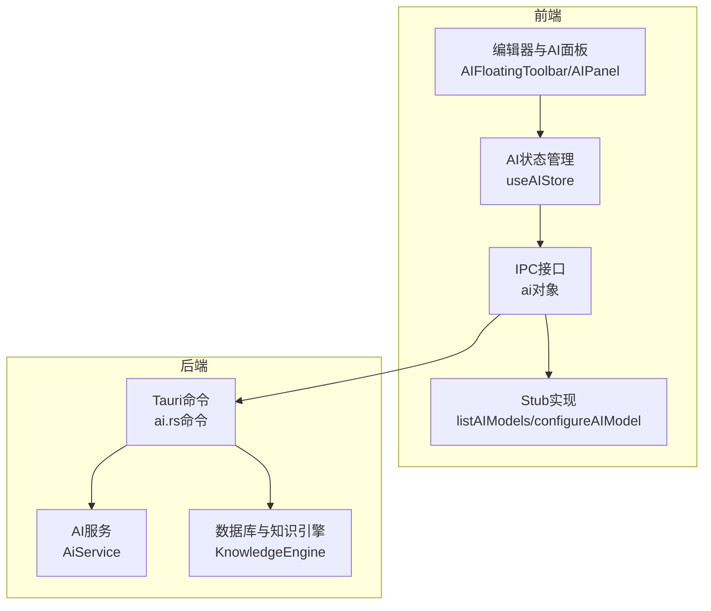
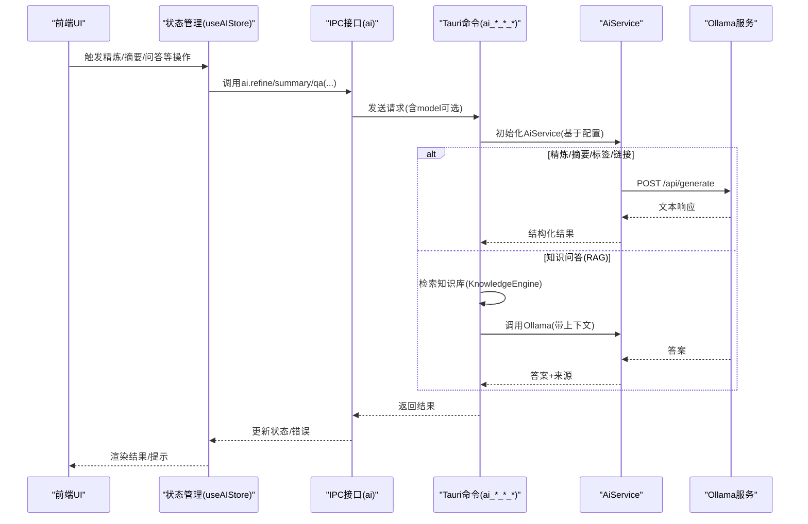
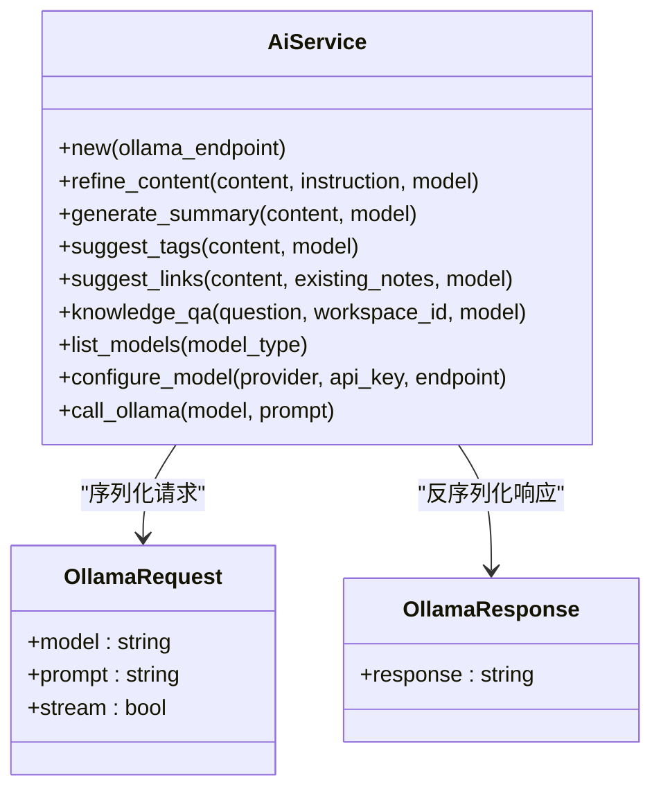
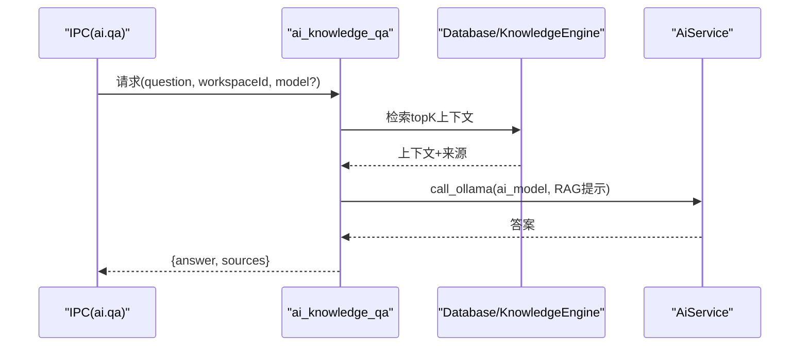
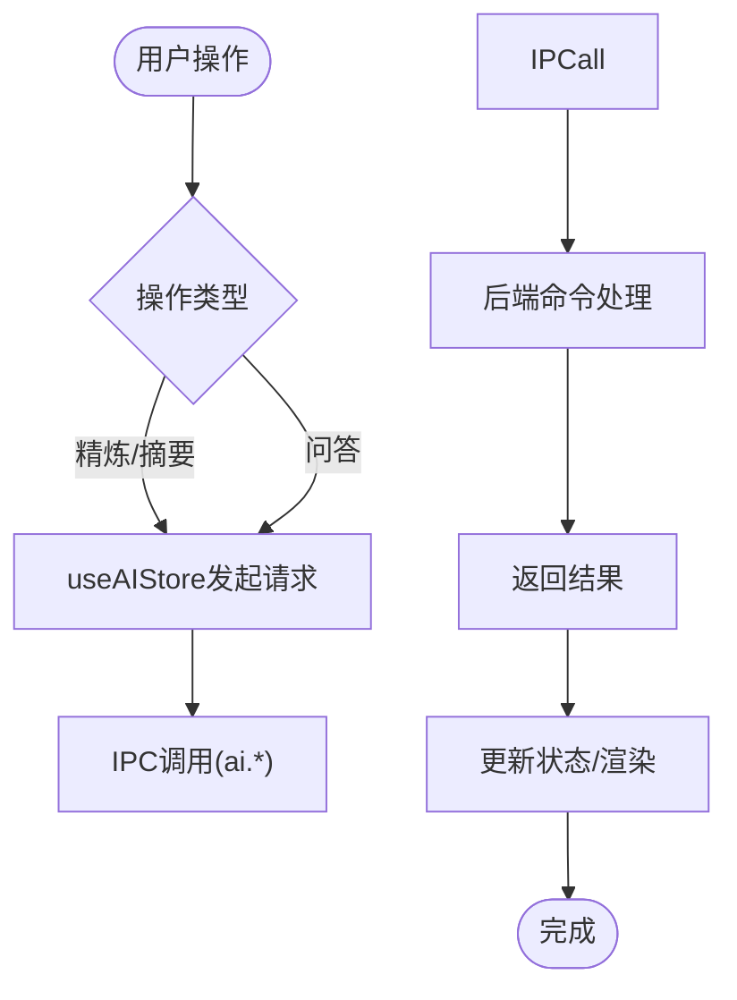
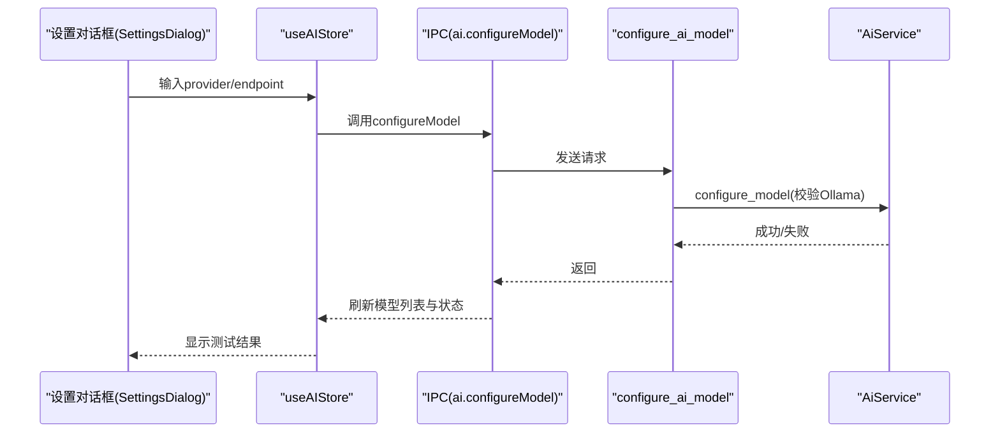
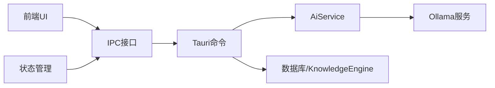

# AI服务API

<cite>
**本文引用的文件**
- [src-tauri/src/ai.rs](file://src-tauri/src/ai.rs)
- [src-tauri/src/commands/ai.rs](file://src-tauri/src/commands/ai.rs)
- [src-tauri/src/models/ai.rs](file://src-tauri/src/models/ai.rs)
- [src-tauri/src/db.rs](file://src-tauri/src/db.rs)
- [src-tauri/src/knowledge.rs](file://src-tauri/src/knowledge.rs)
- [src/ipc/index.ts](file://src/ipc/index.ts)
- [src/ipc/stub.ts](file://src/ipc/stub.ts)
- [src/store/ai.ts](file://src/store/ai.ts)
- [src/components/editor/AIFloatingToolbar.tsx](file://src/components/editor/AIFloatingToolbar.tsx)
- [src/features/ai/AIPanel.tsx](file://src/features/ai/AIPanel.tsx)
- [src/components/dialogs/SettingsDialog.tsx](file://src/components/dialogs/SettingsDialog.tsx)
- [docs/design/03-file-browser-editor.md](file://docs/design/03-file-browser-editor.md)
</cite>

## 目录
1. [简介](#简介)
2. [项目结构](#项目结构)
3. [核心组件](#核心组件)
4. [架构总览](#架构总览)
5. [详细组件分析](#详细组件分析)
6. [依赖关系分析](#依赖关系分析)
7. [性能考虑](#性能考虑)
8. [故障排除指南](#故障排除指南)
9. [结论](#结论)
10. [附录](#附录)

## 简介
本文件为NoteForge的AI服务API提供完整的技术文档，覆盖以下方面：
- 架构设计与集成方式：前端IPC层、命令桥接层、Rust后端服务、知识库检索（RAG）与本地/云端模型管理。
- 功能能力：内容精炼、摘要生成、标签建议、链接建议、知识问答（基于工作空间的知识库）、模型列表与配置。
- 配置与管理：模型选择、参数传递、连接性测试与状态反馈。
- 调用流程：请求封装、IPC调用、后端执行、响应解析与错误恢复。
- 使用示例与最佳实践：常见场景、集成模式与UI交互。

## 项目结构
NoteForge的AI服务跨越前端React与后端Tauri/Rust两部分：
- 前端通过IPC接口暴露统一的ai对象，封装各AI能力的调用，并提供状态管理与UI交互。
- 后端通过Tauri命令接收请求，调用AiService执行具体逻辑；知识问答采用RAG流程，先检索知识库再调用模型。
- 模型管理支持本地（Ollama）与云端（占位），并提供连接性测试。

图表来源
- [src/components/editor/AIFloatingToolbar.tsx:1-117](file://src/components/editor/AIFloatingToolbar.tsx#L1-L117)
- [src/features/ai/AIPanel.tsx:42-82](file://src/features/ai/AIPanel.tsx#L42-L82)
- [src/store/ai.ts:1-110](file://src/store/ai.ts#L1-L110)
- [src/ipc/index.ts:414-448](file://src/ipc/index.ts#L414-L448)
- [src-tauri/src/commands/ai.rs:1-126](file://src-tauri/src/commands/ai.rs#L1-L126)
- [src-tauri/src/ai.rs:1-205](file://src-tauri/src/ai.rs#L1-L205)
- [src-tauri/src/knowledge.rs](file://src-tauri/src/knowledge.rs)
- [src-tauri/src/db.rs](file://src-tauri/src/db.rs)

章节来源
- [src/ipc/index.ts:414-448](file://src/ipc/index.ts#L414-L448)
- [src/store/ai.ts:1-110](file://src/store/ai.ts#L1-L110)
- [src-tauri/src/commands/ai.rs:1-126](file://src-tauri/src/commands/ai.rs#L1-L126)
- [src-tauri/src/ai.rs:1-205](file://src-tauri/src/ai.rs#L1-L205)

## 核心组件
- IPC接口层（前端）
  - 提供ai.refine、ai.summary、ai.suggestTags、ai.suggestLinks、ai.qa、ai.listModels、ai.configureModel等方法，统一请求封装与回退stub。
- 状态管理层（前端）
  - useAIStore负责加载模型、选择模型、发起精炼/摘要、历史记录、错误状态与结果应用。
- 命令层（后端）
  - Tauri命令接收请求，注入配置与数据库状态，调用AiService执行业务逻辑。
- AI服务（后端）
  - 封装对Ollama的HTTP调用，实现内容精炼、摘要、标签、链接建议、问答与模型列举/配置校验。
- 知识引擎（后端）
  - RAG流程中负责从知识库检索上下文，构建问答提示词。

章节来源
- [src/ipc/index.ts:414-448](file://src/ipc/index.ts#L414-L448)
- [src/store/ai.ts:1-110](file://src/store/ai.ts#L1-L110)
- [src-tauri/src/commands/ai.rs:1-126](file://src-tauri/src/commands/ai.rs#L1-L126)
- [src-tauri/src/ai.rs:1-205](file://src-tauri/src/ai.rs#L1-L205)
- [src-tauri/src/models/ai.rs:1-90](file://src-tauri/src/models/ai.rs#L1-L90)

## 架构总览
NoteForge的AI服务采用“前端IPC + 后端Tauri命令 + Rust服务”的分层架构。前端通过ai对象发起请求，后端命令根据请求类型路由到相应处理函数，AI服务负责与Ollama交互或执行RAG流程。

图表来源
- [src/ipc/index.ts:414-448](file://src/ipc/index.ts#L414-L448)
- [src-tauri/src/commands/ai.rs:13-126](file://src-tauri/src/commands/ai.rs#L13-L126)
- [src-tauri/src/ai.rs:18-176](file://src-tauri/src/ai.rs#L18-L176)

## 详细组件分析

### 组件A：AI服务（AiService）
- 职责
  - 封装与Ollama的HTTP通信，提供内容精炼、摘要生成、标签建议、链接建议、问答与模型列举/配置校验。
  - 计算精炼差异（diff）用于可视化变更。
- 数据结构
  - 请求/响应模型定义于models/ai.rs，包含RefineResult、QaResult、ModelInfo、LinkSuggestion等。
- 错误处理
  - 对Ollama连接失败与JSON解析异常进行捕获与转换。
- 性能与复杂度
  - 单次调用为O(1)，主要开销在网络往返与模型推理时间。
  - 精炼差异计算为行级diff，时间复杂度与输出长度相关。

图表来源
- [src-tauri/src/ai.rs:5-205](file://src-tauri/src/ai.rs#L5-L205)
- [src-tauri/src/models/ai.rs:194-204](file://src-tauri/src/models/ai.rs#L194-L204)

章节来源
- [src-tauri/src/ai.rs:1-205](file://src-tauri/src/ai.rs#L1-L205)
- [src-tauri/src/models/ai.rs:1-90](file://src-tauri/src/models/ai.rs#L1-L90)

### 组件B：Tauri命令层（ai.rs命令）
- 职责
  - 接收前端请求，读取配置，初始化AiService，必要时访问数据库/KnowledgeEngine，返回结构化结果。
- 关键流程
  - ai_knowledge_qa：先检索知识库上下文，再构造RAG提示词调用模型。
  - list_ai_models：委托AiService列举模型。
  - configure_ai_model：校验Ollama连接。
- 错误处理
  - 将底层错误包装为统一的NoteforgeError。

图表来源
- [src-tauri/src/commands/ai.rs:61-99](file://src-tauri/src/commands/ai.rs#L61-L99)
- [src-tauri/src/knowledge.rs](file://src-tauri/src/knowledge.rs)
- [src-tauri/src/db.rs](file://src-tauri/src/db.rs)

章节来源
- [src-tauri/src/commands/ai.rs:1-126](file://src-tauri/src/commands/ai.rs#L1-L126)

### 组件C：前端IPC与状态管理
- IPC接口
  - ai对象封装所有AI能力，统一调用call与stub回退策略。
- 状态管理
  - useAIStore负责模型加载、指令设置、精炼/摘要执行、历史记录与错误状态。
- UI交互
  - AIFloatingToolbar在编辑器中根据选区显示快捷AI动作。
  - AIPanel提供对话式指令输入与结果应用。

图表来源
- [src/ipc/index.ts:414-448](file://src/ipc/index.ts#L414-L448)
- [src/store/ai.ts:36-110](file://src/store/ai.ts#L36-L110)
- [src/components/editor/AIFloatingToolbar.tsx:20-117](file://src/components/editor/AIFloatingToolbar.tsx#L20-L117)
- [src/features/ai/AIPanel.tsx:42-82](file://src/features/ai/AIPanel.tsx#L42-L82)

章节来源
- [src/ipc/index.ts:414-448](file://src/ipc/index.ts#L414-L448)
- [src/store/ai.ts:1-110](file://src/store/ai.ts#L1-L110)
- [src/components/editor/AIFloatingToolbar.tsx:1-117](file://src/components/editor/AIFloatingToolbar.tsx#L1-L117)
- [src/features/ai/AIPanel.tsx:42-82](file://src/features/ai/AIPanel.tsx#L42-L82)

### 组件D：模型配置与连接性测试
- 设置界面
  - 支持选择本地Ollama模型、填写服务地址，点击“测试连接”验证连通性并刷新可用模型列表。
- 连接性测试流程
  - 调用ai.configureModel(provider, apiKey?, endpoint?)，后端对Ollama端点发起探测请求，成功则标记可用模型。

图表来源
- [src/components/dialogs/SettingsDialog.tsx:26-111](file://src/components/dialogs/SettingsDialog.tsx#L26-L111)
- [src/ipc/stub.ts:896-902](file://src/ipc/stub.ts#L896-L902)
- [src-tauri/src/commands/ai.rs:111-125](file://src-tauri/src/commands/ai.rs#L111-L125)
- [src-tauri/src/ai.rs:138-157](file://src-tauri/src/ai.rs#L138-L157)

章节来源
- [src/components/dialogs/SettingsDialog.tsx:26-111](file://src/components/dialogs/SettingsDialog.tsx#L26-L111)
- [src-tauri/src/commands/ai.rs:111-125](file://src-tauri/src/commands/ai.rs#L111-L125)
- [src-tauri/src/ai.rs:138-157](file://src-tauri/src/ai.rs#L138-L157)

## 依赖关系分析
- 前端依赖
  - IPC接口依赖stub实现作为回退，确保开发/测试环境可用。
  - 状态管理依赖ai对象提供的异步方法。
- 后端依赖
  - 命令层依赖配置管理、数据库与知识引擎。
  - AiService依赖reqwest HTTP客户端与Ollama API。
- 外部依赖
  - Ollama服务端点（本地或自定义）。
  - 知识库（SQLite/向量索引等，由KnowledgeEngine与数据库模块支撑）。

图表来源
- [src/ipc/index.ts:414-448](file://src/ipc/index.ts#L414-L448)
- [src-tauri/src/commands/ai.rs:1-126](file://src-tauri/src/commands/ai.rs#L1-L126)
- [src-tauri/src/ai.rs:1-205](file://src-tauri/src/ai.rs#L1-L205)

章节来源
- [src/ipc/index.ts:414-448](file://src/ipc/index.ts#L414-L448)
- [src-tauri/src/commands/ai.rs:1-126](file://src-tauri/src/commands/ai.rs#L1-L126)
- [src-tauri/src/ai.rs:1-205](file://src-tauri/src/ai.rs#L1-L205)

## 性能考虑
- 网络与I/O
  - Ollama请求为阻塞式HTTP调用，应避免在UI主线程中频繁触发，可通过节流/防抖与并发控制降低压力。
- RAG检索
  - 知识库检索应在释放数据库锁后再构造提示词，减少锁持有时间。
- 模型选择
  - 不同模型大小与推理速度差异较大，建议在设置中缓存模型可用性与延迟，优先选择本地可用模型。
- 前端渲染
  - 精炼差异（diff）在大文本上计算成本较高，建议限制展示范围或采用增量更新策略。

## 故障排除指南
- 无法连接Ollama
  - 现象：状态为离线或测试连接失败。
  - 排查：确认Ollama服务地址正确、网络可达、模型已拉取。
  - 处理：在设置中修正endpoint，重新测试连接。
- 知识问答无上下文
  - 现象：回答不准确或与知识库无关。
  - 排查：检查知识库是否索引、检索关键词是否合理。
  - 处理：重新索引知识库，调整问题表述。
- 响应为空或格式异常
  - 现象：标签/链接建议解析失败。
  - 排查：检查模型输出格式是否符合预期。
  - 处理：切换更稳定的模型或调整提示词。
- UI无响应
  - 现象：点击AI按钮无反应。
  - 排查：查看控制台错误、IPC调用是否被stub回退。
  - 处理：在开发模式下启用真实后端，修复IPC映射。

章节来源
- [src/components/dialogs/SettingsDialog.tsx:26-111](file://src/components/dialogs/SettingsDialog.tsx#L26-L111)
- [src-tauri/src/ai.rs:138-157](file://src-tauri/src/ai.rs#L138-L157)
- [src-tauri/src/commands/ai.rs:61-99](file://src-tauri/src/commands/ai.rs#L61-L99)

## 结论
NoteForge的AI服务以清晰的前后端分层实现，结合RAG与本地模型能力，提供了从内容精炼到知识问答的完整体验。通过状态管理与UI交互的解耦，开发者可以便捷地扩展新能力或接入新的模型提供商。建议在生产环境中完善超时与重试策略、增强日志与监控，并持续优化RAG检索与提示词工程。

## 附录

### API定义与调用示例
- 内容精炼
  - 方法：ai.refine(content, instruction, model?)
  - 典型用途：去除冗余、提升专业度、统一术语。
  - 示例路径：[src/ipc/index.ts:418-421](file://src/ipc/index.ts#L418-L421)
- 摘要生成
  - 方法：ai.summary(content, model?)
  - 典型用途：快速提炼要点。
  - 示例路径：[src/ipc/index.ts:422-425](file://src/ipc/index.ts#L422-L425)
- 标签建议
  - 方法：ai.suggestTags(content, model?)
  - 典型用途：自动标注主题标签。
  - 示例路径：[src/ipc/index.ts:426-429](file://src/ipc/index.ts#L426-L429)
- 链接建议
  - 方法：ai.suggestLinks(content, existingNotes, model?)
  - 典型用途：建议与现有笔记建立链接。
  - 示例路径：[src/ipc/index.ts:430-435](file://src/ipc/index.ts#L430-L435)
- 知识问答（RAG）
  - 方法：ai.qa(question, workspaceId, model?)
  - 典型用途：基于工作空间知识回答问题。
  - 示例路径：[src/ipc/index.ts:436-441](file://src/ipc/index.ts#L436-L441)
- 模型列表
  - 方法：ai.listModels(type)
  - 典型用途：列出本地/云端可用模型。
  - 示例路径：[src/ipc/index.ts:442-443](file://src/ipc/index.ts#L442-L443)
- 模型配置
  - 方法：ai.configureModel(provider, apiKey?, endpoint?)
  - 典型用途：测试连接与配置Ollama端点。
  - 示例路径：[src/ipc/index.ts:444-447](file://src/ipc/index.ts#L444-L447)

### 最佳实践
- 模型选择
  - 在设置中优先选择本地可用模型，结合延迟与准确性评估。
- 提示词工程
  - 针对不同任务定制指令，确保输出格式稳定（如标签逗号分隔、链接JSON数组）。
- 并发与节流
  - 对高频操作（如编辑器内浮动工具栏）添加节流，避免过多并发请求。
- 错误恢复
  - 对网络异常与模型不可用场景提供明确提示与重试入口。
- UI集成
  - 使用AIFloatingToolbar与AIPanel提供一致的上下文操作体验，支持一键应用结果。

章节来源
- [src/components/editor/AIFloatingToolbar.tsx:1-117](file://src/components/editor/AIFloatingToolbar.tsx#L1-L117)
- [src/features/ai/AIPanel.tsx:42-82](file://src/features/ai/AIPanel.tsx#L42-L82)
- [docs/design/03-file-browser-editor.md:129-146](file://docs/design/03-file-browser-editor.md#L129-L146)