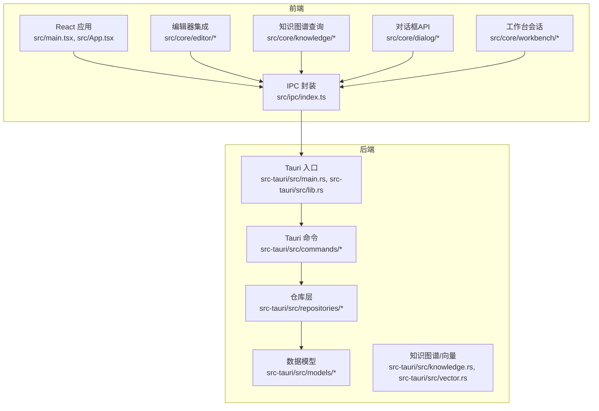
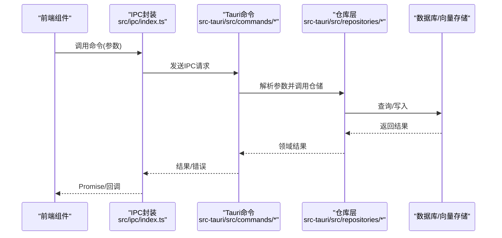
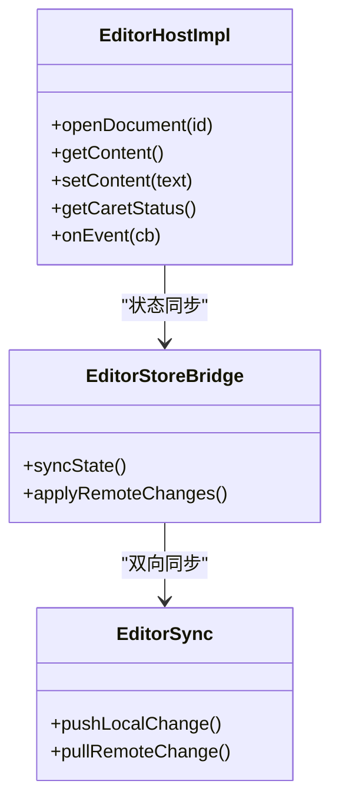
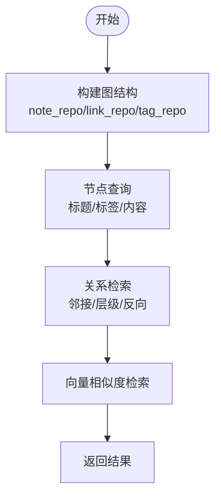
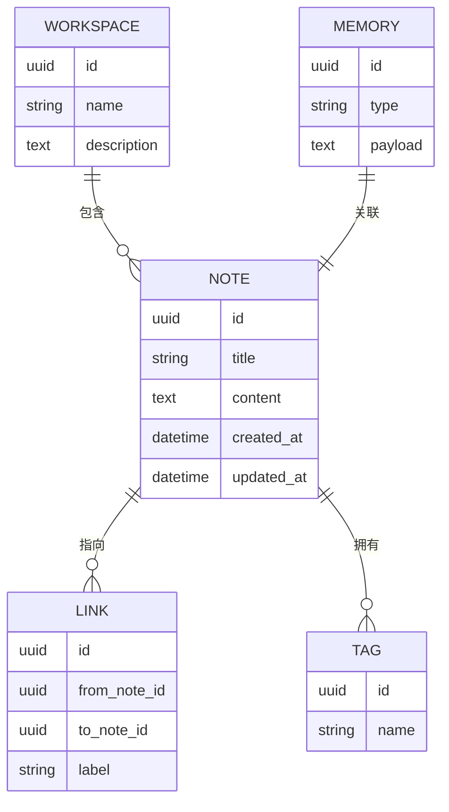
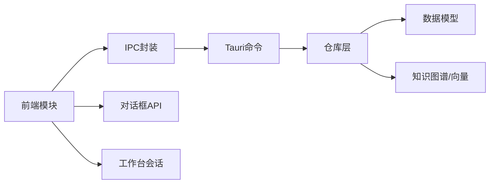

# API参考

<cite>
**本文引用的文件**
- [src-tauri/src/main.rs](file://src-tauri/src/main.rs)
- [src-tauri/src/lib.rs](file://src-tauri/src/lib.rs)
- [src-tauri/src/commands/mod.rs](file://src-tauri/src/commands/mod.rs)
- [src-tauri/src/commands/editor.rs](file://src-tauri/src/commands/editor.rs)
- [src-tauri/src/commands/knowledge.rs](file://src-tauri/src/commands/knowledge.rs)
- [src-tauri/src/commands/ai.rs](file://src-tauri/src/commands/ai.rs)
- [src-tauri/src/commands/search.rs](file://src-tauri/src/commands/search.rs)
- [src-tauri/src/commands/workspace.rs](file://src-tauri/src/commands/workspace.rs)
- [src-tauri/src/commands/workbench_session.rs](file://src-tauri/src/commands/workbench_session.rs)
- [src-tauri/src/commands/memory.rs](file://src-tauri/src/commands/memory.rs)
- [src-tauri/src/commands/file.rs](file://src-tauri/src/commands/file.rs)
- [src-tauri/src/models/mod.rs](file://src-tauri/src/models/mod.rs)
- [src-tauri/src/models/editor.rs](file://src-tauri/src/models/editor.rs)
- [src-tauri/src/models/graph.rs](file://src-tauri/src/models/graph.rs)
- [src-tauri/src/models/note.rs](file://src-tauri/src/models/note.rs)
- [src-tauri/src/models/link.rs](file://src-tauri/src/models/link.rs)
- [src-tauri/src/models/tag.rs](file://src-tauri/src/models/tag.rs)
- [src-tauri/src/models/ai.rs](file://src-tauri/src/models/ai.rs)
- [src-tauri/src/models/search.rs](file://src-tauri/src/models/search.rs)
- [src-tauri/src/models/workspace.rs](file://src-tauri/src/models/workspace.rs)
- [src-tauri/src/models/memory.rs](file://src-tauri/src/models/memory.rs)
- [src-tauri/src/repositories/note_repo.rs](file://src-tauri/src/repositories/note_repo.rs)
- [src-tauri/src/repositories/link_repo.rs](file://src-tauri/src/repositories/link_repo.rs)
- [src-tauri/src/repositories/tag_repo.rs](file://src-tauri/src/repositories/tag_repo.rs)
- [src-tauri/src/repositories/embedding_repo.rs](file://src-tauri/src/repositories/embedding_repo.rs)
- [src-tauri/src/repositories/workspace_repo.rs](file://src-tauri/src/repositories/workspace_repo.rs)
- [src-tauri/src/knowledge.rs](file://src-tauri/src/knowledge.rs)
- [src-tauri/src/vector.rs](file://src-tauri/src/vector.rs)
- [src-tauri/src/db.rs](file://src-tauri/src/db.rs)
- [src-tauri/src/error.rs](file://src-tauri/src/error.rs)
- [src-tauri/src/pipeline.rs](file://src-tauri/src/pipeline.rs)
- [src-tauri/src/watcher.rs](file://src-tauri/src/watcher.rs)
- [src-tauri/Cargo.toml](file://src-tauri/Cargo.toml)
- [src-tauri/tauri.conf.json](file://src-tauri/tauri.conf.json)
- [src-tauri/gen/schemas/capabilities.json](file://src-tauri/gen/schemas/capabilities.json)
- [src-tauri/gen/schemas/desktop-schema.json](file://src-tauri/gen/schemas/desktop-schema.json)
- [src-tauri/gen/schemas/macOS-schema.json](file://src-tauri/gen/schemas/macOS-schema.json)
- [src/ipc/index.ts](file://src/ipc/index.ts)
- [src/ipc/stub.ts](file://src/ipc/stub.ts)
- [src/core/editor/editor-host.impl.ts](file://src/core/editor/editor-host.impl.ts)
- [src/core/editor/types.ts](file://src/core/editor/types.ts)
- [src/core/knowledge/knowledge-query.impl.ts](file://src/core/knowledge/knowledge-query.impl.ts)
- [src/core/knowledge/types.ts](file://src/core/knowledge/types.ts)
- [src/core/document/service.ts](file://src/core/document/service.ts)
- [src/core/document/types.ts](file://src/core/document/types.ts)
- [src/core/dialog/dialog-api.ts](file://src/core/dialog/dialog-api.ts)
- [src/core/dialog/types.ts](file://src/core/dialog/types.ts)
- [src/core/platform/event-bus.ts](file://src/core/platform/event-bus.ts)
- [src/core/platform/config.ts](file://src/core/platform/config.ts)
- [src/core/vault/service.ts](file://src/core/vault/service.ts)
- [src/core/vault/types.ts](file://src/core/vault/types.ts)
- [src/core/workbench/service.ts](file://src/core/workbench/service.ts)
- [src/core/workbench/types.ts](file://src/core/workbench/types.ts)
- [src/core/session/tab-lifecycle.ts](file://src/core/session/tab-lifecycle.ts)
- [src/core/session/workspace-draft-autosave.ts](file://src/core/session/workspace-draft-autosave.ts)
- [src/core/bridge/editor-store-bridge.ts](file://src/core/bridge/editor-store-bridge.ts)
- [src/core/bridge/editor-sync.ts](file://src/core/bridge/editor-sync.ts)
- [src/core/command/types.ts](file://src/core/command/types.ts)
- [src/core/command/context.ts](file://src/core/command/context.ts)
- [src/core/command/register-core-commands.ts](file://src/core/command/register-core-commands.ts)
- [src/core/events.ts](file://src/core/events.ts)
- [src/core/runtime.ts](file://src/core/runtime.ts)
- [src/main.tsx](file://src/main.tsx)
- [src/App.tsx](file://src/App.tsx)
- [src/types.ts](file://src/types.ts)
</cite>

## 目录
1. [简介](#简介)
2. [项目结构](#项目结构)
3. [核心组件](#核心组件)
4. [架构总览](#架构总览)
5. [详细组件分析](#详细组件分析)
6. [依赖分析](#依赖分析)
7. [性能考虑](#性能考虑)
8. [故障排除指南](#故障排除指南)
9. [结论](#结论)
10. [附录](#附录)

## 简介
本文件为NoteForge的全面API参考，覆盖后端Tauri命令、前端IPC通信、数据模型与仓库层、编辑器API集成、知识图谱查询接口、AI服务API以及常见使用场景的最佳实践。文档以“可执行的参考”为目标，通过源码映射与流程图展示实际实现，帮助集成开发者快速理解并正确使用各模块。

## 项目结构
NoteForge采用前后端分离的Tauri架构：前端基于TypeScript/React，后端基于Rust，二者通过IPC桥接通信。核心目录与职责如下：
- 前端(src): React应用与核心业务逻辑（编辑器、对话框、工作台、知识图谱等）
- 后端(src-tauri): Tauri命令、数据模型、仓库层、向量与知识图谱处理
- IPC(src/ipc): 前端对后端命令的封装与桩实现
- 核心桥接(src/core): 编辑器状态同步、对话框API、事件总线等

图表来源
- [src/main.tsx](file://src/main.tsx)
- [src/App.tsx](file://src/App.tsx)
- [src/ipc/index.ts](file://src/ipc/index.ts)
- [src-tauri/src/main.rs](file://src-tauri/src/main.rs)
- [src-tauri/src/lib.rs](file://src-tauri/src/lib.rs)
- [src-tauri/src/commands/mod.rs](file://src-tauri/src/commands/mod.rs)

章节来源
- [src/main.tsx](file://src/main.tsx)
- [src/App.tsx](file://src/App.tsx)
- [src/ipc/index.ts](file://src/ipc/index.ts)
- [src-tauri/src/main.rs](file://src-tauri/src/main.rs)
- [src-tauri/src/lib.rs](file://src-tauri/src/lib.rs)
- [src-tauri/src/commands/mod.rs](file://src-tauri/src/commands/mod.rs)

## 核心组件
- Tauri命令层：定义所有后端可被前端调用的命令，统一在mod.rs中导出，并在各子模块中实现具体逻辑
- 数据模型层：描述持久化与传输的数据结构，如笔记、链接、标签、工作区等
- 仓库层：封装数据库访问与聚合逻辑，提供领域服务所需的稳定接口
- 知识图谱与向量：负责图构建、嵌入与相似度检索
- 前端IPC：封装命令调用、错误处理与类型安全
- 编辑器桥接：连接编辑器状态与后端命令，支持内容同步与事件分发

章节来源
- [src-tauri/src/commands/mod.rs](file://src-tauri/src/commands/mod.rs)
- [src-tauri/src/models/mod.rs](file://src-tauri/src/models/mod.rs)
- [src-tauri/src/repositories/mod.rs](file://src-tauri/src/repositories/mod.rs)
- [src-tauri/src/knowledge.rs](file://src-tauri/src/knowledge.rs)
- [src-tauri/src/vector.rs](file://src-tauri/src/vector.rs)
- [src/ipc/index.ts](file://src/ipc/index.ts)
- [src/core/bridge/editor-store-bridge.ts](file://src/core/bridge/editor-store-bridge.ts)

## 架构总览
NoteForge的IPC调用链路从前端发起，经由IPC封装，到达Tauri命令处理器，再由仓库层访问数据库或外部服务，最终返回结果给前端。

图表来源
- [src/ipc/index.ts](file://src/ipc/index.ts)
- [src-tauri/src/commands/mod.rs](file://src-tauri/src/commands/mod.rs)
- [src-tauri/src/repositories/mod.rs](file://src-tauri/src/repositories/mod.rs)
- [src-tauri/src/db.rs](file://src-tauri/src/db.rs)

## 详细组件分析

### Tauri命令与IPC通信规范
- 命令注册与导出：命令在mod.rs中集中导出，前端通过IPC封装统一调用
- 参数与返回：每个命令定义明确的输入输出结构；错误通过统一错误类型返回
- 调用约定：前端以Promise风格调用，错误通过catch处理；支持异步与流式响应

章节来源
- [src-tauri/src/commands/mod.rs](file://src-tauri/src/commands/mod.rs)
- [src-tauri/src/error.rs](file://src-tauri/src/error.rs)
- [src/ipc/index.ts](file://src/ipc/index.ts)

### 编辑器API集成
- 状态获取：通过编辑器宿主接口获取当前文档、光标位置、选区等
- 内容操作：支持读取/写入文档内容、撤销重做、格式化等
- 事件监听：订阅编辑器变更、焦点切换、滚动等事件
- 同步机制：编辑器状态与后端命令桥接，确保一致性

图表来源
- [src/core/editor/editor-host.impl.ts](file://src/core/editor/editor-host.impl.ts)
- [src/core/bridge/editor-store-bridge.ts](file://src/core/bridge/editor-store-bridge.ts)
- [src/core/bridge/editor-sync.ts](file://src/core/bridge/editor-sync.ts)

章节来源
- [src/core/editor/editor-host.impl.ts](file://src/core/editor/editor-host.impl.ts)
- [src/core/editor/types.ts](file://src/core/editor/types.ts)
- [src/core/bridge/editor-store-bridge.ts](file://src/core/bridge/editor-store-bridge.ts)
- [src/core/bridge/editor-sync.ts](file://src/core/bridge/editor-sync.ts)

### 知识图谱API
- 图构建：基于笔记、链接、标签建立图结构
- 节点查询：按标题、标签、内容片段查询节点
- 关系检索：支持邻接节点、层级关系、反向链接查询
- 搜索增强：结合向量相似度进行语义检索

图表来源
- [src-tauri/src/knowledge.rs](file://src-tauri/src/knowledge.rs)
- [src-tauri/src/vector.rs](file://src-tauri/src/vector.rs)
- [src-tauri/src/repositories/note_repo.rs](file://src-tauri/src/repositories/note_repo.rs)
- [src-tauri/src/repositories/link_repo.rs](file://src-tauri/src/repositories/link_repo.rs)
- [src-tauri/src/repositories/tag_repo.rs](file://src-tauri/src/repositories/tag_repo.rs)
- [src-tauri/src/repositories/embedding_repo.rs](file://src-tauri/src/repositories/embedding_repo.rs)

章节来源
- [src-tauri/src/knowledge.rs](file://src-tauri/src/knowledge.rs)
- [src-tauri/src/vector.rs](file://src-tauri/src/vector.rs)
- [src-tauri/src/repositories/note_repo.rs](file://src-tauri/src/repositories/note_repo.rs)
- [src-tauri/src/repositories/link_repo.rs](file://src-tauri/src/repositories/link_repo.rs)
- [src-tauri/src/repositories/tag_repo.rs](file://src-tauri/src/repositories/tag_repo.rs)
- [src-tauri/src/repositories/embedding_repo.rs](file://src-tauri/src/repositories/embedding_repo.rs)

### AI服务API
- 内容生成：根据上下文生成段落、摘要、翻译等
- 智能搜索：结合知识图谱与向量检索提供增强搜索
- 模型调用：封装外部模型接口，支持流式输出与错误重试

章节来源
- [src-tauri/src/commands/ai.rs](file://src-tauri/src/commands/ai.rs)
- [src-tauri/src/models/ai.rs](file://src-tauri/src/models/ai.rs)
- [src-tauri/src/ai.rs](file://src-tauri/src/ai.rs)

### 数据模型与仓库层
- 模型定义：note、link、tag、workspace、memory、search等
- 仓库接口：提供CRUD与聚合查询能力
- 管道与流水线：数据转换、清洗与索引构建

图表来源
- [src-tauri/src/models/note.rs](file://src-tauri/src/models/note.rs)
- [src-tauri/src/models/link.rs](file://src-tauri/src/models/link.rs)
- [src-tauri/src/models/tag.rs](file://src-tauri/src/models/tag.rs)
- [src-tauri/src/models/workspace.rs](file://src-tauri/src/models/workspace.rs)
- [src-tauri/src/models/memory.rs](file://src-tauri/src/models/memory.rs)

章节来源
- [src-tauri/src/models/mod.rs](file://src-tauri/src/models/mod.rs)
- [src-tauri/src/repositories/note_repo.rs](file://src-tauri/src/repositories/note_repo.rs)
- [src-tauri/src/repositories/link_repo.rs](file://src-tauri/src/repositories/link_repo.rs)
- [src-tauri/src/repositories/tag_repo.rs](file://src-tauri/src/repositories/tag_repo.rs)
- [src-tauri/src/repositories/workspace_repo.rs](file://src-tauri/src/repositories/workspace_repo.rs)
- [src-tauri/src/pipeline.rs](file://src-tauri/src/pipeline.rs)

### 对话框与工作台API
- 对话框API：统一的模态交互入口，支持自定义内容与回调
- 工作台会话：管理多标签页生命周期与草稿保存

章节来源
- [src/core/dialog/dialog-api.ts](file://src/core/dialog/dialog-api.ts)
- [src/core/dialog/types.ts](file://src/core/dialog/types.ts)
- [src/core/session/tab-lifecycle.ts](file://src/core/session/tab-lifecycle.ts)
- [src/core/session/workspace-draft-autosave.ts](file://src/core/session/workspace-draft-autosave.ts)
- [src/core/workbench/service.ts](file://src/core/workbench/service.ts)
- [src/core/workbench/types.ts](file://src/core/workbench/types.ts)

### 文件与配置API
- 文件操作：读取、写入、移动、删除与监控
- 配置管理：应用设置、主题、快捷键等

章节来源
- [src-tauri/src/commands/file.rs](file://src-tauri/src/commands/file.rs)
- [src-tauri/src/commands/config.rs](file://src-tauri/src/commands/config.rs)
- [src/core/platform/config.ts](file://src/core/platform/config.ts)

### 搜索API
- 文本搜索：全文检索与高亮
- 结果排序与分页：支持相关性排序与游标分页

章节来源
- [src-tauri/src/commands/search.rs](file://src-tauri/src/commands/search.rs)
- [src-tauri/src/models/search.rs](file://src-tauri/src/models/search.rs)
- [src/core/knowledge/knowledge-query.impl.ts](file://src/core/knowledge/knowledge-query.impl.ts)

## 依赖分析
- 前端对后端：通过IPC封装调用命令，命令再委托仓库层
- 仓库层对模型：使用模型定义作为数据契约
- 知识图谱对向量：向量库用于语义检索
- 错误处理：统一错误类型贯穿前后端

图表来源
- [src/ipc/index.ts](file://src/ipc/index.ts)
- [src-tauri/src/commands/mod.rs](file://src-tauri/src/commands/mod.rs)
- [src-tauri/src/repositories/mod.rs](file://src-tauri/src/repositories/mod.rs)
- [src-tauri/src/models/mod.rs](file://src-tauri/src/models/mod.rs)
- [src-tauri/src/knowledge.rs](file://src-tauri/src/knowledge.rs)
- [src-tauri/src/vector.rs](file://src-tauri/src/vector.rs)

章节来源
- [src-tauri/src/Cargo.toml](file://src-tauri/src/Cargo.toml)
- [src-tauri/tauri.conf.json](file://src-tauri/tauri.conf.json)
- [src-tauri/gen/schemas/capabilities.json](file://src-tauri/gen/schemas/capabilities.json)
- [src-tauri/gen/schemas/desktop-schema.json](file://src-tauri/gen/schemas/desktop-schema.json)
- [src-tauri/gen/schemas/macOS-schema.json](file://src-tauri/gen/schemas/macOS-schema.json)

## 性能考虑
- 批量操作：优先使用批量插入/更新减少IPC往返
- 懒加载：知识图谱与向量检索按需触发
- 缓存策略：对话框与工作台状态本地缓存，避免重复初始化
- 异步I/O：文件与数据库操作使用异步接口

## 故障排除指南
- IPC调用失败：检查命令是否在mod.rs中导出，确认schema与capabilities一致
- 数据不一致：核查编辑器同步桥接与事务边界
- 知识图谱查询异常：确认向量索引是否构建完成，查询参数是否合法
- 错误码对照：统一错误类型定义于错误模块，前端捕获后进行用户提示

章节来源
- [src-tauri/src/error.rs](file://src-tauri/src/error.rs)
- [src-tauri/gen/schemas/capabilities.json](file://src-tauri/gen/schemas/capabilities.json)
- [src-tauri/gen/schemas/desktop-schema.json](file://src-tauri/gen/schemas/desktop-schema.json)
- [src-tauri/gen/schemas/macOS-schema.json](file://src-tauri/gen/schemas/macOS-schema.json)

## 结论
本文档提供了NoteForge的完整API参考，涵盖命令规范、消息格式、数据模型、编辑器集成、知识图谱查询与AI服务接口。建议在集成时遵循统一的错误处理与调用约定，充分利用仓库层抽象与向量检索提升性能与体验。

## 附录
- 快速开始：在前端通过IPC封装调用命令，命令在后端解析参数并委托仓库层，返回结果
- 最佳实践：参数校验前置、错误统一处理、状态同步与缓存策略并用
- 常见场景：打开文档、查询笔记、生成摘要、图谱导航、工作区切换