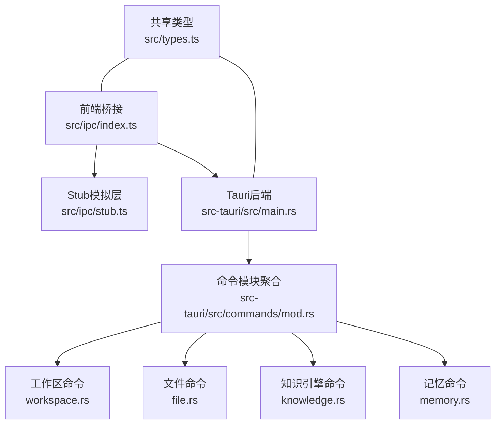
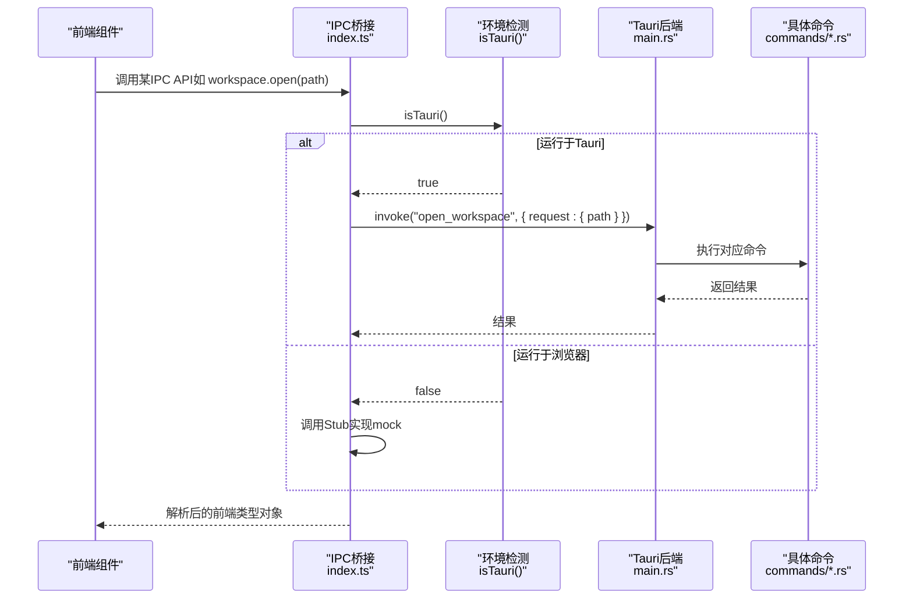
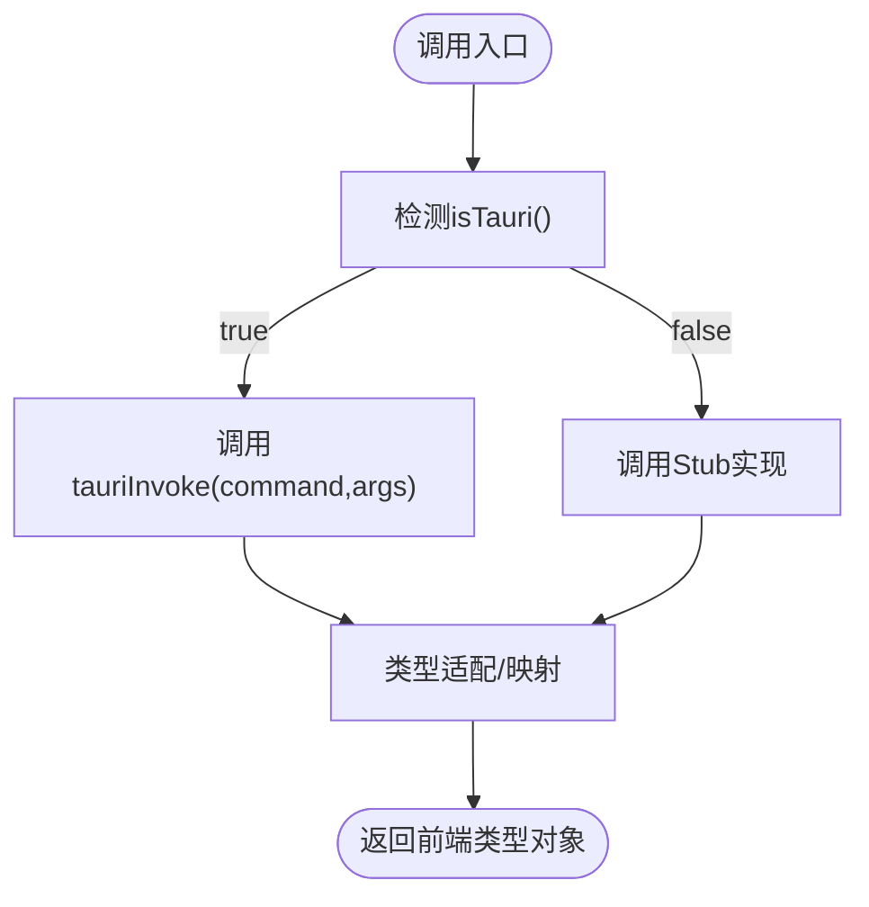
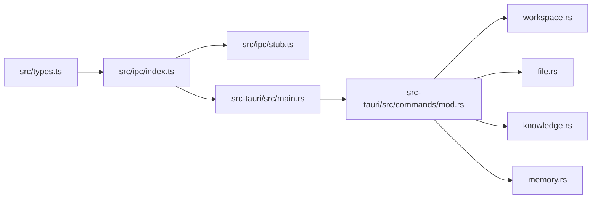

# IPC通信API

<cite>
**本文档引用的文件**
- [src/ipc/index.ts](file://src/ipc/index.ts)
- [src/ipc/stub.ts](file://src/ipc/stub.ts)
- [src/types.ts](file://src/types.ts)
- [src-tauri/src/main.rs](file://src-tauri/src/main.rs)
- [src-tauri/src/commands/mod.rs](file://src-tauri/src/commands/mod.rs)
- [src-tauri/src/commands/workspace.rs](file://src-tauri/src/commands/workspace.rs)
- [src-tauri/src/commands/file.rs](file://src-tauri/src/commands/file.rs)
- [src-tauri/src/commands/knowledge.rs](file://src-tauri/src/commands/knowledge.rs)
- [src-tauri/src/commands/memory.rs](file://src-tauri/src/commands/memory.rs)
- [src-tauri/tests/ipc_contract_tests.rs](file://src-tauri/tests/ipc_contract_tests.rs)
</cite>

## 目录
1. [简介](#简介)
2. [项目结构](#项目结构)
3. [核心组件](#核心组件)
4. [架构总览](#架构总览)
5. [详细组件分析](#详细组件分析)
6. [依赖关系分析](#依赖关系分析)
7. [性能考量](#性能考量)
8. [故障排查指南](#故障排查指南)
9. [结论](#结论)
10. [附录：完整API使用示例](#附录完整api使用示例)

## 简介
本文件系统性梳理NoteForge的IPC（进程间通信）API设计与实现，覆盖前端桥接层、后端Tauri命令、类型安全与错误处理、Stub模拟层以及测试契约等关键方面。目标是帮助开发者在开发环境与生产环境中无缝切换，正确注册与调用IPC命令，并以类型安全的方式传递参数、接收响应与处理错误。

## 项目结构
NoteForge的IPC相关代码主要分布在以下位置：
- 前端桥接与Stub：src/ipc/index.ts、src/ipc/stub.ts
- 共享类型定义：src/types.ts
- 后端入口与命令注册：src-tauri/src/main.rs、src-tauri/src/commands/mod.rs
- 具体命令实现：src-tauri/src/commands/*.rs（如workspace、file、knowledge、memory等）
- 合同测试：src-tauri/tests/ipc_contract_tests.rs

图表来源
- [src/ipc/index.ts:1-489](file://src/ipc/index.ts#L1-L489)
- [src/ipc/stub.ts:1-800](file://src/ipc/stub.ts#L1-L800)
- [src-tauri/src/main.rs:19-97](file://src-tauri/src/main.rs#L19-L97)
- [src-tauri/src/commands/mod.rs:1-13](file://src-tauri/src/commands/mod.rs#L1-L13)
- [src/types.ts:1-389](file://src/types.ts#L1-L389)

章节来源
- [src/ipc/index.ts:1-489](file://src/ipc/index.ts#L1-L489)
- [src-tauri/src/main.rs:1-101](file://src-tauri/src/main.rs#L1-L101)

## 核心组件
- 前端IPC桥接层：统一入口，自动识别运行环境（浏览器或Tauri），在Tauri环境下调用真实invoke，在浏览器环境下委托Stub层返回模拟数据。
- Stub模拟层：提供确定性的内存态实现，便于UI自测与离线开发；与真实命令一一对应，函数签名保持一致。
- 类型系统：通过共享类型定义确保前后端数据结构一致，减少序列化/反序列化错误。
- 错误模型：统一的IpcError类，配合后端NoteforgeError，便于前端捕获与展示。

章节来源
- [src/ipc/index.ts:59-83](file://src/ipc/index.ts#L59-L83)
- [src/ipc/stub.ts:1-100](file://src/ipc/stub.ts#L1-L100)
- [src/types.ts:335-389](file://src/types.ts#L335-L389)

## 架构总览
NoteForge采用“前端桥接 + 后端命令”的分层架构：
- 前端通过src/ipc/index.ts暴露各功能域API（工作区、文件系统、知识图谱、记忆、编辑器、AI等）。
- 调用路径：前端API → 桥接层call → isTauri判断 → Tauri invoke 或 Stub实现。
- 后端在src-tauri/src/main.rs中集中注册所有命令，命令实现位于各自模块（commands/*）。

图表来源
- [src/ipc/index.ts:76-83](file://src/ipc/index.ts#L76-L83)
- [src-tauri/src/main.rs:19-97](file://src-tauri/src/main.rs#L19-L97)

## 详细组件分析

### 组件A：IPC桥接层（src/ipc/index.ts）
- 自动环境检测：通过window.__TAURI_INTERNALS__或window.__TAURI__判断是否在Tauri环境中。
- 统一调用封装：call函数负责在Tauri与Stub之间切换；req辅助包装请求体为{ request: fields }。
- 类型适配器：将后端返回的蛇形命名结构转换为前端驼峰命名结构（如WorkspaceView、FileEntry、SearchResult等）。
- 命名空间划分：按功能域导出对象（workspace、fs、knowledge、memory、ai、editor、scratch、draft、workbenchSession、vaultWatch、system）。

图表来源
- [src/ipc/index.ts:59-88](file://src/ipc/index.ts#L59-L88)

章节来源
- [src/ipc/index.ts:59-489](file://src/ipc/index.ts#L59-L489)

### 组件B：Stub模拟层（src/ipc/stub.ts）
- 内存态存储：维护虚拟文件系统、工作区、记忆、标签等数据，模拟真实后端行为。
- 确定性延迟：sleep函数模拟网络/IO延迟，便于前端体验一致性。
- 与真实命令一一对应：每个Stub函数与后端命令保持相同签名，便于替换。
- 示例数据：内置演示工作区与文件，便于UI开发与测试。

章节来源
- [src/ipc/stub.ts:1-800](file://src/ipc/stub.ts#L1-L800)

### 组件C：共享类型系统（src/types.ts）
- 数据模型：WorkspaceConfig/View、FileEntry、SearchResult、KnowledgeGraph、MemoryEntry、AI相关类型等。
- 错误码枚举：ErrorCode涵盖路径、文件、工作区、知识、记忆、AI、加密、配置等场景。
- IpcError：统一错误包装，包含code、message与details。

章节来源
- [src/types.ts:1-389](file://src/types.ts#L1-L389)

### 组件D：后端命令注册与实现
- 注册入口：src-tauri/src/main.rs在setup阶段集中注册所有命令。
- 命令模块：commands/mod.rs导出各子模块（workspace、file、knowledge、memory、ai、config、scratch、workbench_session、workspace_draft、vault_watch）。
- 典型命令：
  - 工作区：create/open/list/get/update
  - 文件：read/write/list/create/delete/rename/move/info
  - 知识：索引、全文检索、语义检索、提取链接/标签、获取反链、知识图谱
  - 记忆：监控目录、列出Agent记忆、时间线、增删改、批量打标/删除、导入
  - AI：内容精炼、摘要生成、标签建议、链接建议、问答、模型列表与配置
  - 系统：应用配置、主题、更新检查

章节来源
- [src-tauri/src/main.rs:19-97](file://src-tauri/src/main.rs#L19-L97)
- [src-tauri/src/commands/mod.rs:1-13](file://src-tauri/src/commands/mod.rs#L1-L13)
- [src-tauri/src/commands/workspace.rs:1-113](file://src-tauri/src/commands/workspace.rs#L1-L113)
- [src-tauri/src/commands/file.rs:1-175](file://src-tauri/src/commands/file.rs#L1-L175)
- [src-tauri/src/commands/knowledge.rs:1-305](file://src-tauri/src/commands/knowledge.rs#L1-L305)
- [src-tauri/src/commands/memory.rs:1-337](file://src-tauri/src/commands/memory.rs#L1-L337)

### 组件E：错误处理与契约测试
- 前端错误：IpcError统一捕获未知错误；后端命令返回Result<..., NoteforgeError>。
- 契约测试：ipc_contract_tests.rs验证工作区、记忆、笔记、标签、链接、索引管道、搜索、知识图谱、加密、配置等关键流程的一致性。

章节来源
- [src/types.ts:335-389](file://src/types.ts#L335-L389)
- [src-tauri/tests/ipc_contract_tests.rs:1-528](file://src-tauri/tests/ipc_contract_tests.rs#L1-L528)

## 依赖关系分析
- 前端桥接依赖共享类型定义，确保前后端数据结构一致。
- Stub层与真实命令一一对应，便于替换与测试。
- 后端命令依赖数据库状态与业务逻辑（KnowledgeEngine、IndexPipeline、VectorEngine等）。
- 测试契约覆盖关键领域，保障命令行为符合预期。

图表来源
- [src/types.ts:1-389](file://src/types.ts#L1-L389)
- [src/ipc/index.ts:12-50](file://src/ipc/index.ts#L12-L50)
- [src-tauri/src/main.rs:19-97](file://src-tauri/src/main.rs#L19-L97)
- [src-tauri/src/commands/mod.rs:1-13](file://src-tauri/src/commands/mod.rs#L1-L13)

章节来源
- [src/ipc/index.ts:12-50](file://src/ipc/index.ts#L12-L50)
- [src-tauri/src/main.rs:19-97](file://src-tauri/src/main.rs#L19-L97)

## 性能考量
- Stub延迟：sleep用于模拟真实延迟，便于前端体验一致性；生产环境可忽略或缩短。
- 批量操作：记忆模块提供批量打标与删除，减少多次IPC往返。
- 搜索与索引：知识引擎结合全文与向量检索，注意limit参数控制结果规模。
- 文件操作：避免频繁小文件读写，必要时合并操作或使用缓存。

## 故障排查指南
- 环境判断失败：确认window.__TAURI_INTERNALS__/window.__TAURI__是否存在；在浏览器中应走Stub。
- 参数格式错误：确保使用req包装请求体为{ request: fields }；检查字段命名与类型。
- 路径与权限：文件操作禁止虚拟路径；路径不存在或无权限会抛出相应错误码。
- 未知错误：前端捕获IpcError，查看code与details定位问题。
- 契约不匹配：参照ipc_contract_tests.rs核对命令输入输出结构与行为。

章节来源
- [src/ipc/index.ts:66-83](file://src/ipc/index.ts#L66-L83)
- [src/types.ts:335-389](file://src/types.ts#L335-L389)
- [src-tauri/tests/ipc_contract_tests.rs:1-528](file://src-tauri/tests/ipc_contract_tests.rs#L1-L528)

## 结论
NoteForge的IPC体系通过“桥接层 + Stub + 共享类型 + 契约测试”实现了前后端解耦与类型安全。开发者可在浏览器中快速迭代UI，部署到Tauri后无需修改前端调用代码即可获得真实后端能力。建议严格遵循命令参数格式、错误码约定与类型映射规则，以获得稳定可靠的IPC集成体验。

## 附录：完整API使用示例

### 使用示例1：打开工作区并列出文件
- 步骤
  - 调用workspace.open(path)获取工作区视图
  - 调用fs.list(path)获取目录项
- 异常处理
  - 捕获IpcError，依据code区分路径无效、未找到等场景
- 性能建议
  - 初次加载可设置合理的limit参数，避免一次性拉取过多结果

章节来源
- [src/ipc/index.ts:191-213](file://src/ipc/index.ts#L191-L213)
- [src/ipc/index.ts:218-238](file://src/ipc/index.ts#L218-L238)
- [src/types.ts:335-389](file://src/types.ts#L335-L389)

### 使用示例2：知识检索与知识图谱
- 步骤
  - knowledge.searchFulltext(workspaceId, query, limit)
  - knowledge.getGraph(workspaceId)
- 异常处理
  - 捕获IpcError，关注SEARCH_ERROR、GRAPH_ERROR等
- 性能建议
  - 限制limit；对查询词做预处理（去噪、截断）

章节来源
- [src/ipc/index.ts:300-354](file://src/ipc/index.ts#L300-L354)
- [src-tauri/src/commands/knowledge.rs:70-163](file://src-tauri/src/commands/knowledge.rs#L70-L163)

### 使用示例3：Agent记忆管理
- 步骤
  - memory.listAgents() 获取Agent列表
  - memory.list(agentId, type) 获取记忆列表
  - memory.create(agentId, content, type, title, tags, workspaceId)
  - memory.update(memoryId, content, metadata)
  - memory.batchTag(memoryIds, tags)
  - memory.batchDelete(memoryIds)
- 异常处理
  - 捕获IpcError，关注MEMORY_NOT_FOUND、IMPORT_ERROR等
- 性能建议
  - 大批量操作使用批处理命令

章节来源
- [src/ipc/index.ts:359-412](file://src/ipc/index.ts#L359-L412)
- [src-tauri/src/commands/memory.rs:12-337](file://src-tauri/src/commands/memory.rs#L12-L337)

### 使用示例4：编辑器语言检测与格式化
- 步骤
  - editor.detectLanguage(content, filename?)
  - editor.formatCode(content, language)
- 异常处理
  - 捕获IpcError，关注DETECTION_FAILED、FORMAT_ERROR等

章节来源
- [src/ipc/index.ts:286-295](file://src/ipc/index.ts#L286-L295)
- [src-tauri/src/commands/file.rs:14-175](file://src-tauri/src/commands/file.rs#L14-L175)

### 使用示例5：Scratch与工作台会话
- 步骤
  - scratch.saveBuffer(payload)/loadBuffer()/deleteBuffer()
  - scratch.saveSession()/restoreSession()/clearSession()
  - workbenchSession.save(session)/load()
- 异常处理
  - 捕获IpcError，关注相关错误码

章节来源
- [src/ipc/index.ts:243-281](file://src/ipc/index.ts#L243-L281)

### 使用示例6：系统配置与主题
- 步骤
  - system.getAppConfig()/updateAppConfig()
  - system.getTheme()/setTheme(theme)
- 异常处理
  - 捕获IpcError，关注CONFIG_ERROR等

章节来源
- [src/ipc/index.ts:462-488](file://src/ipc/index.ts#L462-L488)

### 开发环境与生产环境差异
- 开发环境（浏览器）
  - 通过isTauri()返回false，自动走Stub实现
  - 适合UI联调与离线开发
- 生产环境（Tauri）
  - 通过isTauri()返回true，调用真实Tauri invoke
  - 需要后端命令正确注册与实现

章节来源
- [src/ipc/index.ts:59-83](file://src/ipc/index.ts#L59-L83)
- [src-tauri/src/main.rs:19-97](file://src-tauri/src/main.rs#L19-L97)