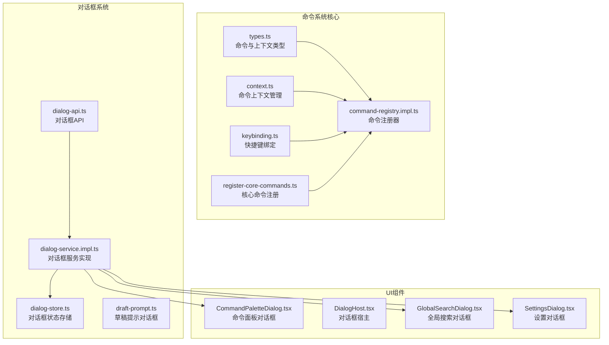
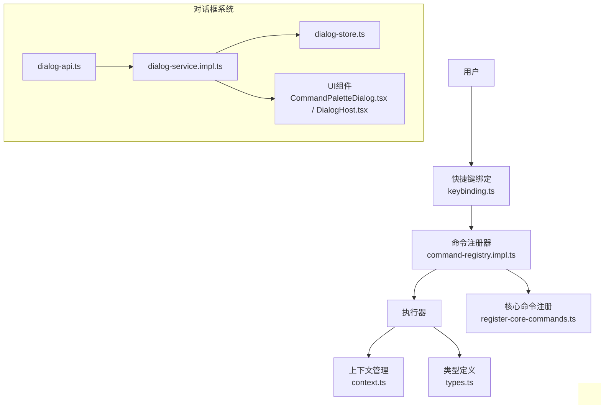
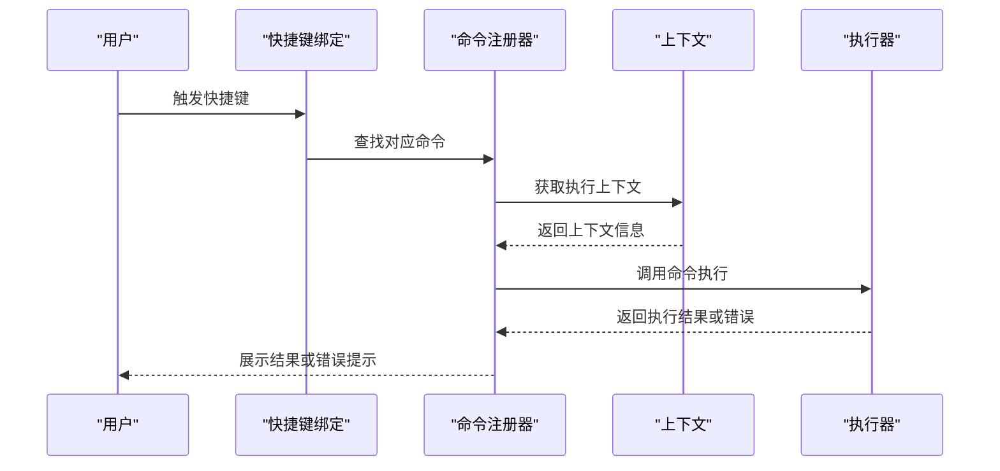
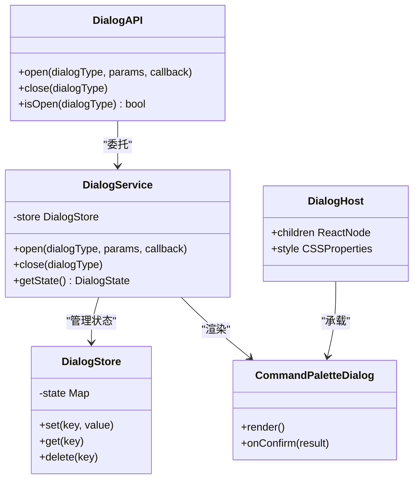
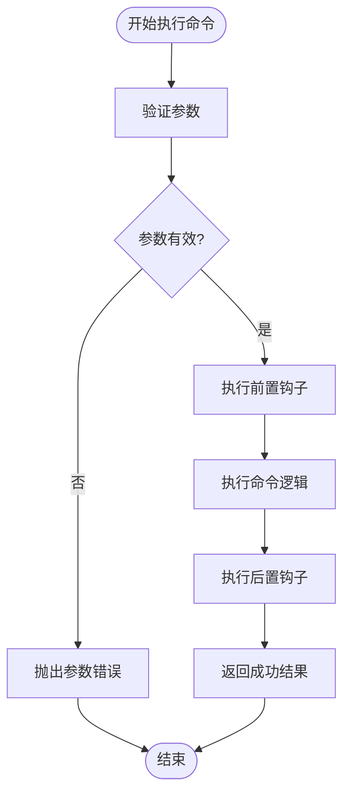
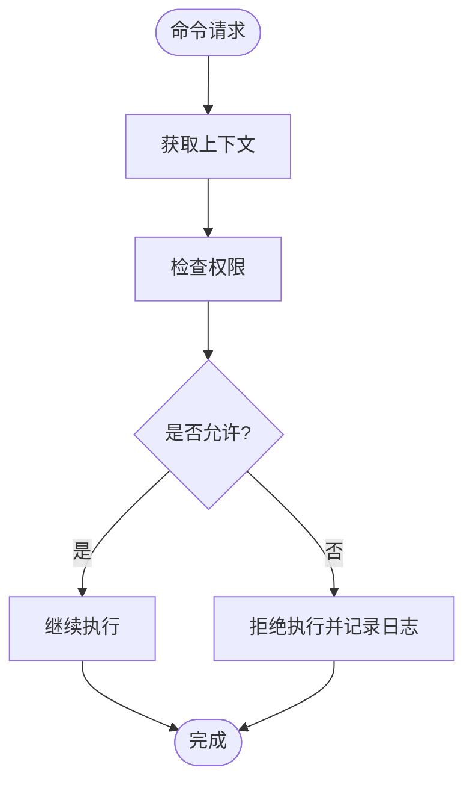
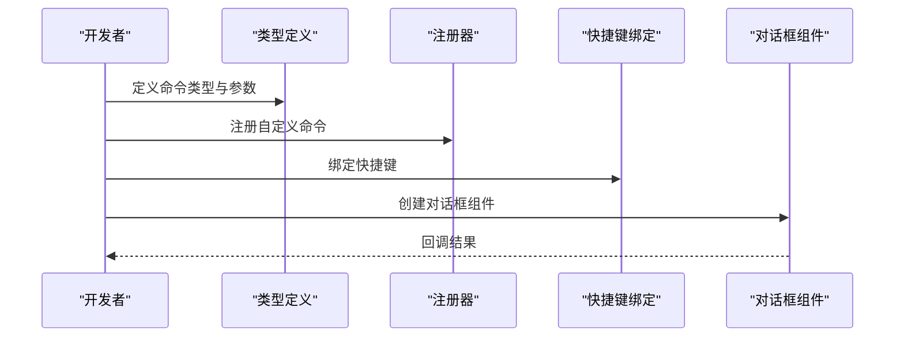
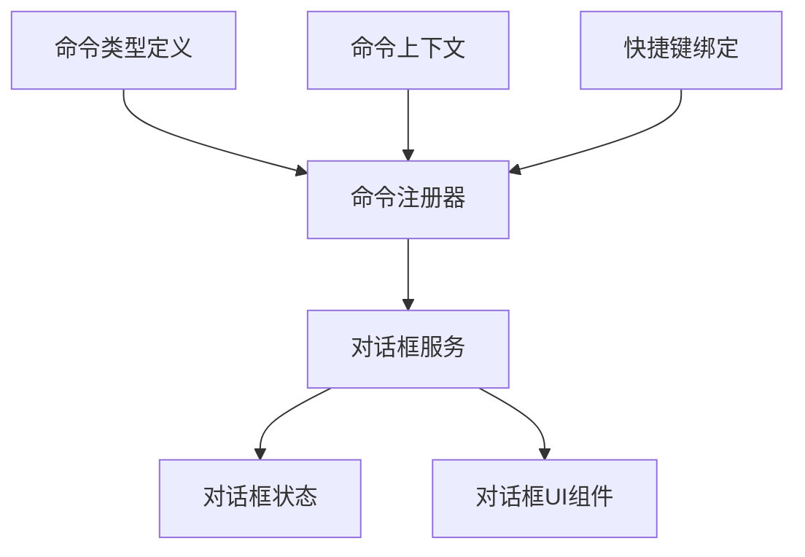

# 命令系统API

<cite>
**本文档引用的文件**
- [command-registry.impl.ts](file://src/core/command/command-registry.impl.ts)
- [register-core-commands.ts](file://src/core/command/register-core-commands.ts)
- [types.ts](file://src/core/command/types.ts)
- [context.ts](file://src/core/command/context.ts)
- [keybinding.ts](file://src/core/command/keybinding.ts)
- [dialog-api.ts](file://src/core/dialog/dialog-api.ts)
- [dialog-service.impl.ts](file://src/core/dialog/dialog-service.impl.ts)
- [dialog-store.ts](file://src/core/dialog/dialog-store.ts)
- [types.ts](file://src/core/dialog/types.ts)
- [draft-prompt.ts](file://src/core/dialog/draft-prompt.ts)
- [CommandPaletteDialog.tsx](file://src/components/dialogs/CommandPaletteDialog.tsx)
- [DialogHost.tsx](file://src/components/dialogs/DialogHost.tsx)
- [GlobalSearchDialog.tsx](file://src/components/dialogs/GlobalSearchDialog.tsx)
- [SettingsDialog.tsx](file://src/components/dialogs/SettingsDialog.tsx)
- [useShortcuts.ts](file://src/hooks/useShortcuts.ts)
- [main.tsx](file://src/main.tsx)
- [index.ts](file://src/core/index.ts)
</cite>

## 目录
1. [简介](#简介)
2. [项目结构](#项目结构)
3. [核心组件](#核心组件)
4. [架构概览](#架构概览)
5. [详细组件分析](#详细组件分析)
6. [依赖关系分析](#依赖关系分析)
7. [性能考虑](#性能考虑)
8. [故障排除指南](#故障排除指南)
9. [结论](#结论)
10. [附录](#附录)

## 简介
本文件为NoteForge命令系统API的完整技术文档，涵盖命令注册与执行机制、参数验证、权限控制、错误处理，以及对话框系统的API接口设计。文档旨在帮助开发者快速理解并扩展NoteForge的命令体系，包括自定义命令开发、插件集成和第三方扩展的最佳实践。

## 项目结构
命令系统位于前端核心模块中，采用分层架构：类型定义（types）提供统一的数据契约；上下文管理（context）负责运行时状态；注册器（command-registry.impl）维护命令表；快捷键绑定（keybinding）提供交互入口；核心命令注册（register-core-commands）初始化内置命令集。

**图表来源**
- [command-registry.impl.ts:1-200](file://src/core/command/command-registry.impl.ts#L1-L200)
- [register-core-commands.ts:1-200](file://src/core/command/register-core-commands.ts#L1-L200)
- [types.ts:1-200](file://src/core/command/types.ts#L1-L200)
- [context.ts:1-200](file://src/core/command/context.ts#L1-L200)
- [keybinding.ts:1-200](file://src/core/command/keybinding.ts#L1-L200)
- [dialog-api.ts:1-200](file://src/core/dialog/dialog-api.ts#L1-L200)
- [dialog-service.impl.ts:1-200](file://src/core/dialog/dialog-service.impl.ts#L1-L200)
- [dialog-store.ts:1-200](file://src/core/dialog/dialog-store.ts#L1-L200)
- [CommandPaletteDialog.tsx:1-200](file://src/components/dialogs/CommandPaletteDialog.tsx#L1-L200)
- [DialogHost.tsx:1-200](file://src/components/dialogs/DialogHost.tsx#L1-L200)

**章节来源**
- [command-registry.impl.ts:1-200](file://src/core/command/command-registry.impl.ts#L1-L200)
- [register-core-commands.ts:1-200](file://src/core/command/register-core-commands.ts#L1-L200)
- [types.ts:1-200](file://src/core/command/types.ts#L1-L200)
- [context.ts:1-200](file://src/core/command/context.ts#L1-L200)
- [keybinding.ts:1-200](file://src/core/command/keybinding.ts#L1-L200)

## 核心组件
本节深入解析命令系统的关键组件及其职责边界：

- 命令类型定义（types.ts）
  - 定义命令元数据、参数规范、执行上下文接口，确保命令声明与执行的一致性
  - 提供命令返回值与错误类型的标准化契约

- 命令上下文（context.ts）
  - 维护当前激活的编辑器、工作区、文档等运行时信息
  - 提供上下文查询与更新能力，支持命令在不同场景下的行为适配

- 命令注册器（command-registry.impl.ts）
  - 实现命令注册、查找、执行的集中式管理
  - 支持命令优先级、依赖关系与冲突检测
  - 提供执行前后的钩子扩展点

- 快捷键绑定（keybinding.ts）
  - 将用户输入映射到具体命令
  - 支持组合键、平台差异与动态重绑定

- 核心命令注册（register-core-commands.ts）
  - 初始化内置命令集合，如文件操作、编辑器功能、知识图谱等
  - 作为扩展点，允许第三方注入自定义命令

**章节来源**
- [types.ts:1-200](file://src/core/command/types.ts#L1-L200)
- [context.ts:1-200](file://src/core/command/context.ts#L1-L200)
- [command-registry.impl.ts:1-200](file://src/core/command/command-registry.impl.ts#L1-L200)
- [keybinding.ts:1-200](file://src/core/command/keybinding.ts#L1-L200)
- [register-core-commands.ts:1-200](file://src/core/command/register-core-commands.ts#L1-L200)

## 架构概览
命令系统采用“类型驱动 + 注册器 + 上下文 + 快捷键”的分层设计，确保高内聚、低耦合与可扩展性。

**图表来源**
- [command-registry.impl.ts:1-200](file://src/core/command/command-registry.impl.ts#L1-L200)
- [keybinding.ts:1-200](file://src/core/command/keybinding.ts#L1-L200)
- [context.ts:1-200](file://src/core/command/context.ts#L1-L200)
- [types.ts:1-200](file://src/core/command/types.ts#L1-L200)
- [register-core-commands.ts:1-200](file://src/core/command/register-core-commands.ts#L1-L200)
- [dialog-api.ts:1-200](file://src/core/dialog/dialog-api.ts#L1-L200)
- [dialog-service.impl.ts:1-200](file://src/core/dialog/dialog-service.impl.ts#L1-L200)
- [dialog-store.ts:1-200](file://src/core/dialog/dialog-store.ts#L1-L200)
- [CommandPaletteDialog.tsx:1-200](file://src/components/dialogs/CommandPaletteDialog.tsx#L1-L200)
- [DialogHost.tsx:1-200](file://src/components/dialogs/DialogHost.tsx#L1-L200)

## 详细组件分析

### 命令注册与执行流程
命令从注册到执行的完整序列如下：

**图表来源**
- [keybinding.ts:1-200](file://src/core/command/keybinding.ts#L1-L200)
- [command-registry.impl.ts:1-200](file://src/core/command/command-registry.impl.ts#L1-L200)
- [context.ts:1-200](file://src/core/command/context.ts#L1-L200)

**章节来源**
- [keybinding.ts:1-200](file://src/core/command/keybinding.ts#L1-L200)
- [command-registry.impl.ts:1-200](file://src/core/command/command-registry.impl.ts#L1-L200)
- [context.ts:1-200](file://src/core/command/context.ts#L1-L200)

### 对话框系统API
对话框系统通过API封装、服务实现与状态存储解耦UI组件，提供一致的调用体验。

**图表来源**
- [dialog-api.ts:1-200](file://src/core/dialog/dialog-api.ts#L1-L200)
- [dialog-service.impl.ts:1-200](file://src/core/dialog/dialog-service.impl.ts#L1-L200)
- [dialog-store.ts:1-200](file://src/core/dialog/dialog-store.ts#L1-L200)
- [CommandPaletteDialog.tsx:1-200](file://src/components/dialogs/CommandPaletteDialog.tsx#L1-L200)
- [DialogHost.tsx:1-200](file://src/components/dialogs/DialogHost.tsx#L1-L200)

**章节来源**
- [dialog-api.ts:1-200](file://src/core/dialog/dialog-api.ts#L1-L200)
- [dialog-service.impl.ts:1-200](file://src/core/dialog/dialog-service.impl.ts#L1-L200)
- [dialog-store.ts:1-200](file://src/core/dialog/dialog-store.ts#L1-L200)
- [CommandPaletteDialog.tsx:1-200](file://src/components/dialogs/CommandPaletteDialog.tsx#L1-L200)
- [DialogHost.tsx:1-200](file://src/components/dialogs/DialogHost.tsx#L1-L200)

### 参数验证与错误处理
命令执行前的参数验证与错误处理流程如下：

**图表来源**
- [command-registry.impl.ts:1-200](file://src/core/command/command-registry.impl.ts#L1-L200)
- [types.ts:1-200](file://src/core/command/types.ts#L1-L200)

**章节来源**
- [command-registry.impl.ts:1-200](file://src/core/command/command-registry.impl.ts#L1-L200)
- [types.ts:1-200](file://src/core/command/types.ts#L1-L200)

### 权限控制与安全
权限控制通过上下文与命令元数据结合实现，确保命令在受限环境中的安全执行。

**图表来源**
- [context.ts:1-200](file://src/core/command/context.ts#L1-L200)
- [types.ts:1-200](file://src/core/command/types.ts#L1-L200)

**章节来源**
- [context.ts:1-200](file://src/core/command/context.ts#L1-L200)
- [types.ts:1-200](file://src/core/command/types.ts#L1-L200)

### 扩展机制：自定义命令与插件集成
开发者可通过以下方式扩展命令系统：

- 定义新命令类型与参数规范
- 在注册器中注册命令，并指定依赖与优先级
- 通过快捷键绑定为命令配置热键
- 使用对话框API创建交互式UI

**图表来源**
- [types.ts:1-200](file://src/core/command/types.ts#L1-L200)
- [command-registry.impl.ts:1-200](file://src/core/command/command-registry.impl.ts#L1-L200)
- [keybinding.ts:1-200](file://src/core/command/keybinding.ts#L1-L200)
- [dialog-api.ts:1-200](file://src/core/dialog/dialog-api.ts#L1-L200)

**章节来源**
- [types.ts:1-200](file://src/core/command/types.ts#L1-L200)
- [command-registry.impl.ts:1-200](file://src/core/command/command-registry.impl.ts#L1-L200)
- [keybinding.ts:1-200](file://src/core/command/keybinding.ts#L1-L200)
- [dialog-api.ts:1-200](file://src/core/dialog/dialog-api.ts#L1-L200)

## 依赖关系分析
命令系统与对话框系统之间的依赖关系清晰且松耦合：

**图表来源**
- [command-registry.impl.ts:1-200](file://src/core/command/command-registry.impl.ts#L1-L200)
- [dialog-service.impl.ts:1-200](file://src/core/dialog/dialog-service.impl.ts#L1-L200)
- [dialog-store.ts:1-200](file://src/core/dialog/dialog-store.ts#L1-L200)

**章节来源**
- [command-registry.impl.ts:1-200](file://src/core/command/command-registry.impl.ts#L1-L200)
- [dialog-service.impl.ts:1-200](file://src/core/dialog/dialog-service.impl.ts#L1-L200)
- [dialog-store.ts:1-200](file://src/core/dialog/dialog-store.ts#L1-L200)

## 性能考虑
- 命令注册与查找应避免频繁重建，建议在应用启动阶段完成核心命令注册
- 对话框状态存储采用轻量级Map结构，减少不必要的渲染开销
- 快捷键绑定应支持去抖动与防重复触发，提升交互流畅度
- 大量命令时，建议按需加载与懒注册，降低首屏内存占用

## 故障排除指南
- 命令未响应：检查快捷键绑定是否正确，确认命令已在注册器中注册
- 参数错误：核对命令参数类型与必填字段，查看错误返回码
- 权限不足：确认上下文中的权限标识，必要时在命令元数据中声明所需权限
- 对话框不显示：检查对话框服务状态与UI组件挂载情况

**章节来源**
- [command-registry.impl.ts:1-200](file://src/core/command/command-registry.impl.ts#L1-L200)
- [dialog-service.impl.ts:1-200](file://src/core/dialog/dialog-service.impl.ts#L1-L200)
- [context.ts:1-200](file://src/core/command/context.ts#L1-L200)

## 结论
NoteForge的命令系统以类型驱动为核心，结合注册器、上下文与快捷键绑定，构建了高内聚、易扩展的命令执行框架。配合对话框系统API，开发者可以快速实现复杂交互与业务逻辑，同时保持良好的性能与可维护性。

## 附录
- 常用命令模式：文件操作、编辑器功能、知识检索、工作区管理
- 最佳实践：明确命令职责单一、参数最小化、错误处理标准化、权限最小化原则
- 调试技巧：利用上下文日志输出、命令执行时间统计、对话框状态快照