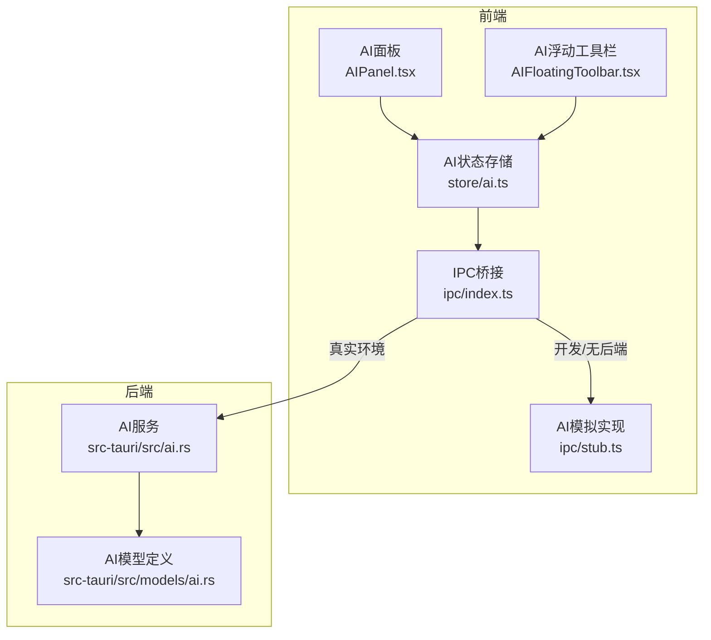
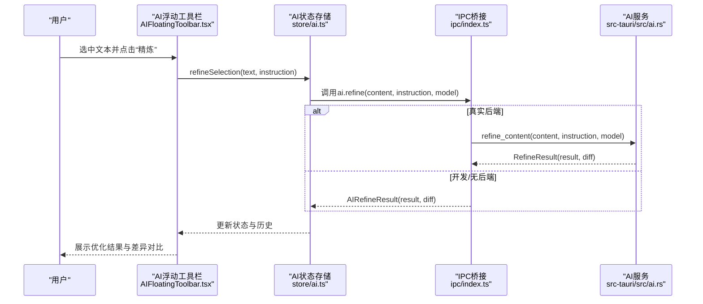
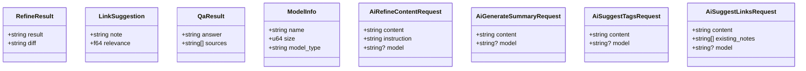
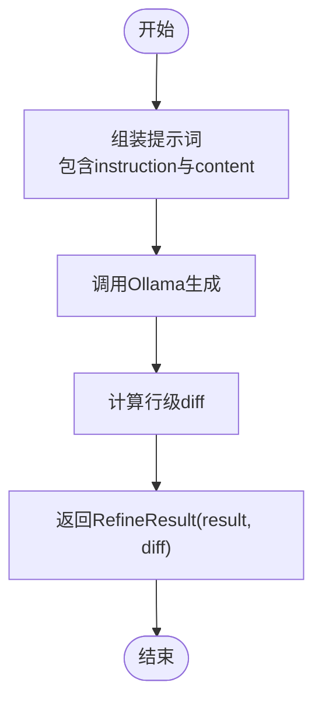
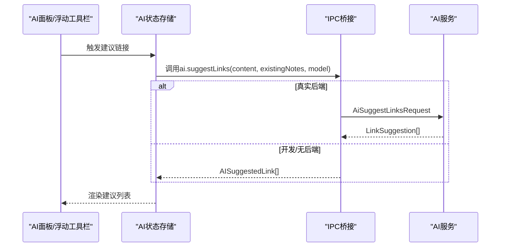
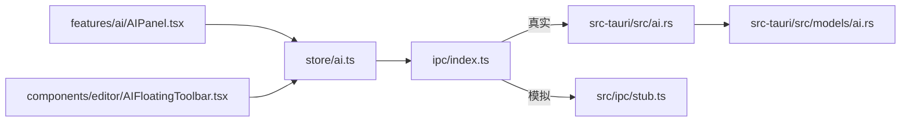

# AI服务模型

<cite>
**本文引用的文件**
- [src-tauri/src/models/ai.rs](file://src-tauri/src/models/ai.rs)
- [src-tauri/src/ai.rs](file://src-tauri/src/ai.rs)
- [src/ipc/stub.ts](file://src/ipc/stub.ts)
- [src/store/ai.ts](file://src/store/ai.ts)
- [src/components/editor/AIFloatingToolbar.tsx](file://src/components/editor/AIFloatingToolbar.tsx)
- [src/components/dialogs/SettingsDialog.tsx](file://src/components/dialogs/SettingsDialog.tsx)
- [src/features/ai/AIPanel.tsx](file://src/features/ai/AIPanel.tsx)
- [src-tauri/tests/dataflow_tests.rs](file://src-tauri/tests/dataflow_tests.rs)
- [docs/design/03-file-browser-editor.md](file://docs/design/03-file-browser-editor.md)
</cite>

## 目录
1. [简介](#简介)
2. [项目结构](#项目结构)
3. [核心组件](#核心组件)
4. [架构总览](#架构总览)
5. [详细组件分析](#详细组件分析)
6. [依赖关系分析](#依赖关系分析)
7. [性能考量](#性能考量)
8. [故障排查指南](#故障排查指南)
9. [结论](#结论)
10. [附录](#附录)

## 简介
本文件面向NoteForge的AI服务模型，系统化梳理与AI相关的核心数据结构与API行为，重点覆盖以下主题：
- AIRefineResult、AISuggestedLink、ModelInfo等数据结构的设计与用途
- 内容优化结果结构中result与diff字段的语义、作用与使用场景
- 链接建议数据格式中filePath、reason、confidence等字段的含义与应用
- ModelInfo模型字段及支持的AI模型提供商（ollama、openai、anthropic、custom）
- 完整的AI服务集成API使用示例（模型选择、内容生成、链接建议、性能监控）
- 不同AI提供商的API适配与兼容性处理策略
- 开发者扩展与模型管理的最佳实践

## 项目结构
NoteForge的AI能力由前端IPC层、AI面板与浮动工具栏、状态存储、以及后端Rust服务共同构成。前端通过IPC桥接调用后端或模拟实现，后端提供本地Ollama集成与云端配置入口。

图表来源
- [src/features/ai/AIPanel.tsx:1-228](file://src/features/ai/AIPanel.tsx#L1-L228)
- [src/components/editor/AIFloatingToolbar.tsx:1-116](file://src/components/editor/AIFloatingToolbar.tsx#L1-L116)
- [src/store/ai.ts:51-110](file://src/store/ai.ts#L51-L110)
- [src/ipc/index.ts:1-105](file://src/ipc/index.ts#L1-L105)
- [src/ipc/stub.ts:819-879](file://src/ipc/stub.ts#L819-L879)
- [src-tauri/src/ai.rs:1-181](file://src-tauri/src/ai.rs#L1-L181)
- [src-tauri/src/models/ai.rs:1-60](file://src-tauri/src/models/ai.rs#L1-L60)

章节来源
- [src/features/ai/AIPanel.tsx:1-228](file://src/features/ai/AIPanel.tsx#L1-L228)
- [src/components/editor/AIFloatingToolbar.tsx:1-116](file://src/components/editor/AIFloatingToolbar.tsx#L1-L116)
- [src/store/ai.ts:51-110](file://src/store/ai.ts#L51-L110)
- [src/ipc/index.ts:1-105](file://src/ipc/index.ts#L1-L105)
- [src/ipc/stub.ts:819-879](file://src/ipc/stub.ts#L819-L879)
- [src-tauri/src/ai.rs:1-181](file://src-tauri/src/ai.rs#L1-L181)
- [src-tauri/src/models/ai.rs:1-60](file://src-tauri/src/models/ai.rs#L1-L60)

## 核心组件
本节聚焦AI相关的核心数据结构与API契约，明确字段语义与使用边界。

- AIRefineResult
  - 字段
    - result: 优化后的文本内容
    - diff: 基于行级对比的变更差异，便于UI展示差异视图
  - 用途
    - 返回内容精炼的最终结果与可交互的差异对比
  - 使用场景
    - 在AI面板或浮动工具栏中对选区进行“精炼”“改写”等操作后，展示优化结果与逐行差异

- AISuggestedLink
  - 字段
    - filePath: 建议关联的笔记路径
    - reason: 建议理由（如标题片段匹配）
    - confidence: 置信度分数（0~1）
  - 用途
    - 为当前内容提供潜在知识链接建议
  - 使用场景
    - 在编辑器中输入时提供智能补全建议，或在AI面板中批量查看建议

- ModelInfo
  - 字段
    - name: 模型名称（用于显示）
    - size: 模型大小（字节），用于估算资源占用
    - model_type: 模型类型（如text-generation）
  - 用途
    - 描述可用模型的基本信息，支撑前端模型选择与状态展示
  - 注意
    - 当前前端还存在id/provider/available/latencyMs等字段的展示逻辑，但后端模型定义以name/size/model_type为主；二者需在集成时保持映射与兼容

- 请求体
  - AiRefineContentRequest
    - content: 待优化内容
    - instruction: 优化指令（如“精炼”“改写”“翻译”）
    - model: 可选指定模型
  - AiGenerateSummaryRequest
    - content: 文本内容
    - model: 可选指定模型
  - AiSuggestTagsRequest
    - content: 文本内容
    - model: 可选指定模型
  - AiSuggestLinksRequest
    - content: 文本内容
    - existing_notes: 已有笔记列表
    - model: 可选指定模型

章节来源
- [src-tauri/src/models/ai.rs:1-60](file://src-tauri/src/models/ai.rs#L1-L60)
- [src/ipc/stub.ts:819-879](file://src/ipc/stub.ts#L819-L879)
- [src/features/ai/AIPanel.tsx:198-228](file://src/features/ai/AIPanel.tsx#L198-L228)

## 架构总览
下图展示了从用户触发到AI结果返回的关键流程，涵盖前端状态管理、IPC调用、后端服务与差异计算。

图表来源
- [src/components/editor/AIFloatingToolbar.tsx:70-116](file://src/components/editor/AIFloatingToolbar.tsx#L70-L116)
- [src/store/ai.ts:67-82](file://src/store/ai.ts#L67-L82)
- [src/ipc/index.ts:66-83](file://src/ipc/index.ts#L66-L83)
- [src-tauri/src/ai.rs:18-34](file://src-tauri/src/ai.rs#L18-L34)
- [src/ipc/stub.ts:823-834](file://src/ipc/stub.ts#L823-L834)

## 详细组件分析

### 数据结构类图

图表来源
- [src-tauri/src/models/ai.rs:1-60](file://src-tauri/src/models/ai.rs#L1-L60)

章节来源
- [src-tauri/src/models/ai.rs:1-60](file://src-tauri/src/models/ai.rs#L1-L60)

### AI内容优化流程（精炼）
- 输入
  - content: 待优化内容
  - instruction: 优化指令（如“精炼”“改写”“翻译”）
  - model: 可选模型标识
- 处理
  - 后端默认模型回退（如“llama3”）
  - 组装提示词并调用Ollama生成
  - 计算行级diff，形成可展示的差异字符串
- 输出
  - RefineResult(result, diff)

图表来源
- [src-tauri/src/ai.rs:18-34](file://src-tauri/src/ai.rs#L18-L34)
- [src-tauri/src/ai.rs:159-176](file://src-tauri/src/ai.rs#L159-L176)
- [src-tauri/src/ai.rs:179-181](file://src-tauri/src/ai.rs#L179-L181)

章节来源
- [src-tauri/src/ai.rs:18-34](file://src-tauri/src/ai.rs#L18-L34)
- [src-tauri/src/ai.rs:159-176](file://src-tauri/src/ai.rs#L159-L176)
- [src-tauri/src/ai.rs:179-181](file://src-tauri/src/ai.rs#L179-L181)

### AI链接建议流程
- 输入
  - content: 当前内容
  - existing_notes: 已有笔记列表
  - model: 可选模型
- 处理
  - 前端模拟实现：基于标题片段匹配与置信度排序
  - 后端预留：AiSuggestLinksRequest与LinkSuggestion结构
- 输出
  - AISuggestedLink数组（filePath、reason、confidence）

图表来源
- [src/ipc/stub.ts:848-864](file://src/ipc/stub.ts#L848-L864)
- [src-tauri/src/models/ai.rs:5-8](file://src-tauri/src/models/ai.rs#L5-L8)
- [src-tauri/src/models/ai.rs:54-60](file://src-tauri/src/models/ai.rs#L54-L60)

章节来源
- [src/ipc/stub.ts:848-864](file://src/ipc/stub.ts#L848-L864)
- [src-tauri/src/models/ai.rs:5-8](file://src-tauri/src/models/ai.rs#L5-L8)
- [src-tauri/src/models/ai.rs:54-60](file://src-tauri/src/models/ai.rs#L54-L60)

### 摘要与标签建议
- 摘要
  - 输入：content
  - 输出：summary字符串
- 标签建议
  - 输入：content
  - 输出：tags数组（去重并合并种子标签）

章节来源
- [src/ipc/stub.ts:836-846](file://src/ipc/stub.ts#L836-L846)

### 模型信息与提供商
- ModelInfo（后端）
  - name、size、model_type
- 前端展示字段（设置对话框）
  - id、name、provider、endpoint、available、latencyMs
- 支持的提供商
  - ollama（本地）、openai、anthropic（云端）、custom（自定义）

章节来源
- [src-tauri/src/models/ai.rs:10-16](file://src-tauri/src/models/ai.rs#L10-L16)
- [src/ipc/stub.ts:881-894](file://src/ipc/stub.ts#L881-L894)
- [src/components/dialogs/SettingsDialog.tsx:63-142](file://src/components/dialogs/SettingsDialog.tsx#L63-L142)

## 依赖关系分析
- 前端依赖
  - IPC桥接负责在真实后端与模拟实现之间切换
  - AI状态存储集中管理请求参数、结果与历史
  - UI组件（AI面板、浮动工具栏）驱动用户交互
- 后端依赖
  - AiService封装Ollama调用与默认模型回退
  - 模型定义位于models/ai.rs，供前后端共享

图表来源
- [src/store/ai.ts:51-110](file://src/store/ai.ts#L51-L110)
- [src/ipc/index.ts:66-83](file://src/ipc/index.ts#L66-L83)
- [src/features/ai/AIPanel.tsx:1-228](file://src/features/ai/AIPanel.tsx#L1-L228)
- [src/components/editor/AIFloatingToolbar.tsx:1-116](file://src/components/editor/AIFloatingToolbar.tsx#L1-L116)
- [src-tauri/src/ai.rs:1-181](file://src-tauri/src/ai.rs#L1-L181)
- [src-tauri/src/models/ai.rs:1-60](file://src-tauri/src/models/ai.rs#L1-L60)
- [src/ipc/stub.ts:819-879](file://src/ipc/stub.ts#L819-L879)

章节来源
- [src/store/ai.ts:51-110](file://src/store/ai.ts#L51-L110)
- [src/ipc/index.ts:66-83](file://src/ipc/index.ts#L66-L83)
- [src/features/ai/AIPanel.tsx:1-228](file://src/features/ai/AIPanel.tsx#L1-L228)
- [src/components/editor/AIFloatingToolbar.tsx:1-116](file://src/components/editor/AIFloatingToolbar.tsx#L1-L116)
- [src-tauri/src/ai.rs:1-181](file://src-tauri/src/ai.rs#L1-L181)
- [src-tauri/src/models/ai.rs:1-60](file://src-tauri/src/models/ai.rs#L1-L60)
- [src/ipc/stub.ts:819-879](file://src/ipc/stub.ts#L819-L879)

## 性能考量
- 默认模型回退
  - 后端在未指定模型时采用默认值，避免空模型导致的失败
- 行级diff计算
  - 仅用于UI展示，复杂度与行数成正比；建议在长文本场景限制diff展示范围
- 本地与云端差异
  - 本地Ollama延迟受模型大小与硬件影响；云端提供商受网络与配额影响
- 建议
  - 对高频调用增加节流与缓存
  - 在设置中提供模型性能指标（如latencyMs）辅助选择

## 故障排查指南
- 精炼结果为空或异常
  - 检查instruction与content是否有效
  - 确认后端默认模型可用或已正确传入model
- 差异视图不显示
  - 确认后端diff计算逻辑正常执行
  - 前端差异面板需要origin与result同时存在
- 链接建议为空
  - 检查existing_notes是否包含有效路径
  - 置信度阈值与匹配算法需结合实际内容调整
- 日志与测试
  - 后端测试验证了diff非空与日志插入逻辑，可作为回归检查依据

章节来源
- [src-tauri/tests/dataflow_tests.rs:160-201](file://src-tauri/tests/dataflow_tests.rs#L160-L201)
- [src/features/ai/AIPanel.tsx:221-228](file://src/features/ai/AIPanel.tsx#L221-L228)

## 结论
NoteForge的AI服务通过清晰的数据结构与前后端分离设计，实现了从内容精炼、摘要生成、标签建议到链接建议的完整闭环。通过默认模型回退、行级diff展示与可扩展的提供商适配，既保证了易用性，也为后续接入更多AI服务提供了良好基础。

## 附录

### API使用示例（概念性）
- 模型选择
  - 本地：从设置中选择Ollama模型（显示name、latencyMs）
  - 云端：选择OpenAI/Anthropic并填写API Key与Endpoint
- 内容生成
  - 精炼：传入content与instruction，接收result与diff
  - 摘要：传入content，接收summary
- 链接建议
  - 传入content与existing_notes，接收AISuggestedLink数组
- 性能监控
  - 通过设置中的latencyMs与日志记录评估调用耗时

章节来源
- [src/components/dialogs/SettingsDialog.tsx:63-142](file://src/components/dialogs/SettingsDialog.tsx#L63-L142)
- [src/ipc/stub.ts:819-879](file://src/ipc/stub.ts#L819-L879)
- [src-tauri/src/ai.rs:18-34](file://src-tauri/src/ai.rs#L18-L34)

### 最佳实践
- 数据结构一致性
  - 前端展示字段（id/provider/available/latencyMs）与后端模型定义（name/size/model_type）需建立稳定映射
- 错误处理
  - 对IPC调用进行统一错误包装与降级（如使用模拟实现）
- 用户体验
  - 在浮动工具栏与AI面板中提供一键复制、重试与差异对比
- 扩展性
  - 为新提供商预留配置接口与兼容层（如configure_model）

章节来源
- [src/ipc/index.ts:66-83](file://src/ipc/index.ts#L66-L83)
- [src/components/editor/AIFloatingToolbar.tsx:70-116](file://src/components/editor/AIFloatingToolbar.tsx#L70-L116)
- [src/features/ai/AIPanel.tsx:198-228](file://src/features/ai/AIPanel.tsx#L198-L228)
- [src-tauri/src/ai.rs:138-157](file://src-tauri/src/ai.rs#L138-L157)