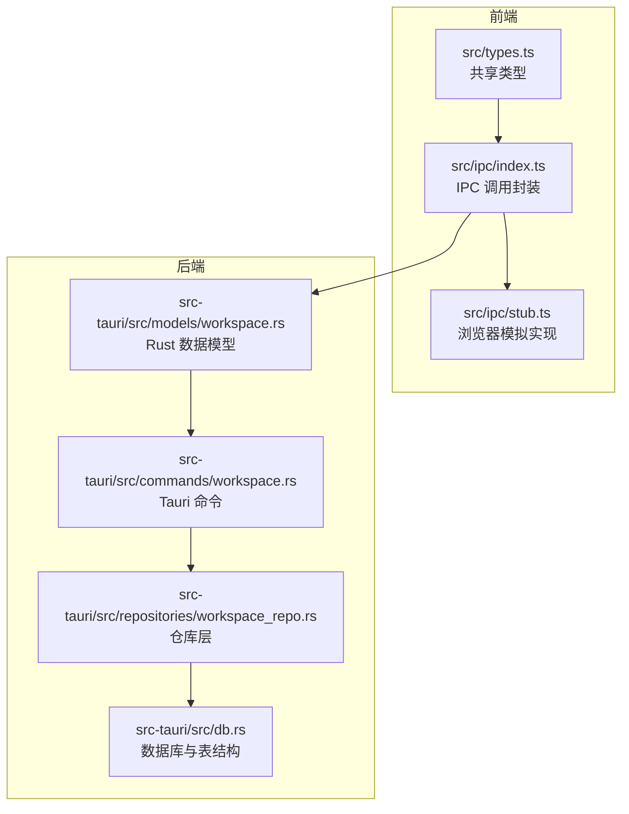
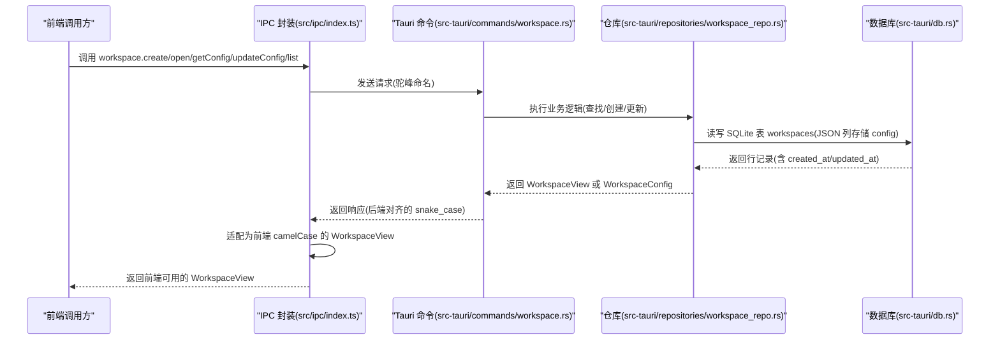
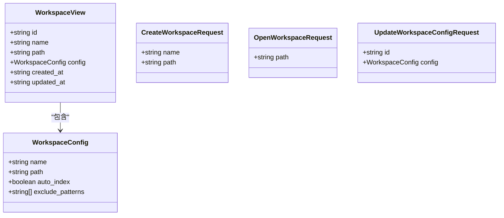
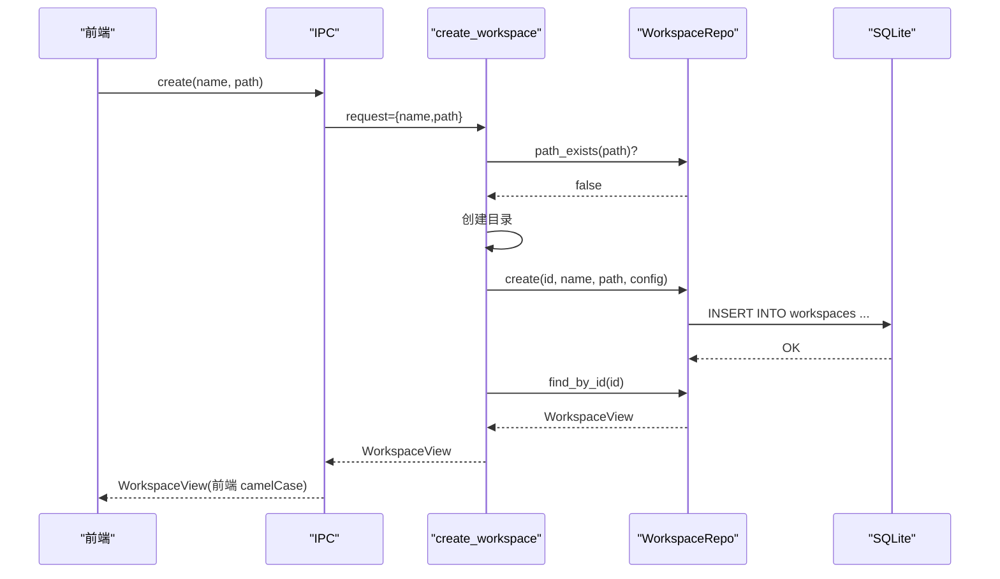
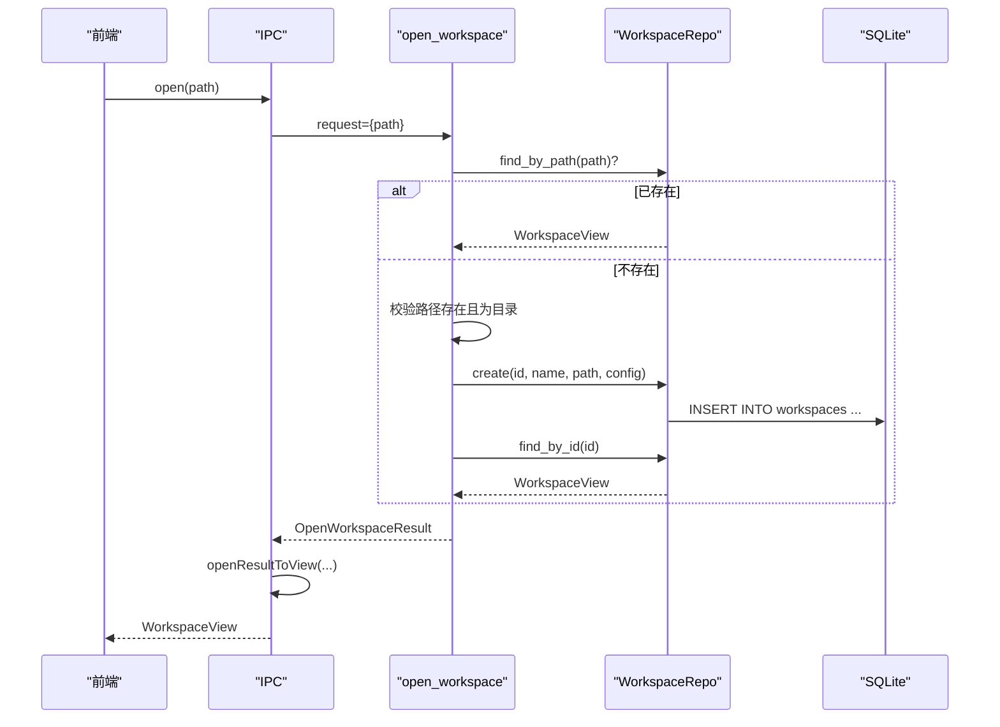
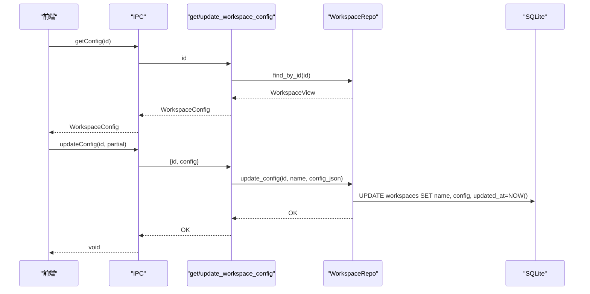
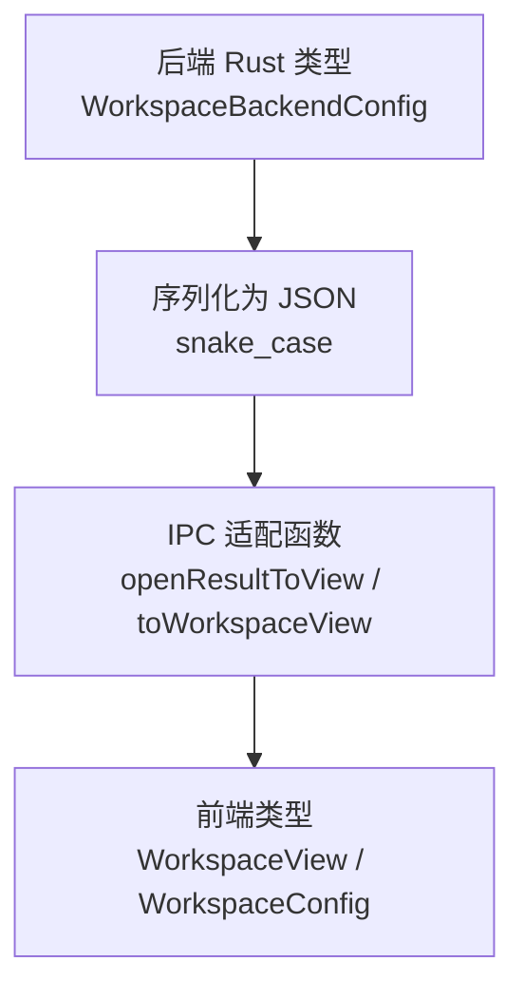
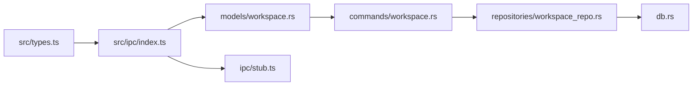

# 工作区模型

<cite>
**本文引用的文件**
- [src/types.ts](file://src/types.ts)
- [src/ipc/index.ts](file://src/ipc/index.ts)
- [src/ipc/stub.ts](file://src/ipc/stub.ts)
- [src-tauri/src/models/workspace.rs](file://src-tauri/src/models/workspace.rs)
- [src-tauri/src/commands/workspace.rs](file://src-tauri/src/commands/workspace.rs)
- [src-tauri/src/repositories/workspace_repo.rs](file://src-tauri/src/repositories/workspace_repo.rs)
- [src-tauri/src/db.rs](file://src-tauri/src/db.rs)
</cite>

## 目录
1. [简介](#简介)
2. [项目结构](#项目结构)
3. [核心组件](#核心组件)
4. [架构总览](#架构总览)
5. [详细组件分析](#详细组件分析)
6. [依赖分析](#依赖分析)
7. [性能考虑](#性能考虑)
8. [故障排查指南](#故障排查指南)
9. [结论](#结论)
10. [附录：API 使用示例与最佳实践](#附录api-使用示例与最佳实践)

## 简介
本文件面向 NoteForge 的“工作区模型”，系统化梳理并说明以下核心数据结构的设计与用途：
- WorkspaceConfig：工作区配置（后端对齐）
- WorkspaceBackendConfig：后端工作区配置（snake_case）
- CreateWorkspaceResult：创建工作区返回结果
- OpenWorkspaceResult：打开工作区返回结果
- WorkspaceView：前端工作区视图（合并后的形状）

同时，文档阐明字段含义、数据类型与约束条件，解释前后端数据格式的命名约定转换（camelCase 与 snake_case），并提供工作区创建、打开与配置管理的完整 API 使用示例、参数校验、错误处理与状态同步机制，最后给出最佳实践与集成建议。

## 项目结构
工作区模型涉及三层：
- 前端共享类型与 IPC 封装层：位于 src/types.ts 与 src/ipc/index.ts
- 后端 Rust 模型与命令层：位于 src-tauri/src/models/workspace.rs 与 src-tauri/src/commands/workspace.rs
- 数据持久化与仓库层：位于 src-tauri/src/repositories/workspace_repo.rs 与 src-tauri/src/db.rs

图表来源
- [src/types.ts:1-46](file://src/types.ts#L1-L46)
- [src/ipc/index.ts:191-213](file://src/ipc/index.ts#L191-L213)
- [src-tauri/src/models/workspace.rs:1-42](file://src-tauri/src/models/workspace.rs#L1-L42)
- [src-tauri/src/commands/workspace.rs:1-113](file://src-tauri/src/commands/workspace.rs#L1-L113)
- [src-tauri/src/repositories/workspace_repo.rs:1-122](file://src-tauri/src/repositories/workspace_repo.rs#L1-L122)
- [src-tauri/src/db.rs:18-168](file://src-tauri/src/db.rs#L18-L168)

章节来源
- [src/types.ts:1-46](file://src/types.ts#L1-L46)
- [src/ipc/index.ts:191-213](file://src/ipc/index.ts#L191-L213)
- [src-tauri/src/models/workspace.rs:1-42](file://src-tauri/src/models/workspace.rs#L1-L42)
- [src-tauri/src/commands/workspace.rs:1-113](file://src-tauri/src/commands/workspace.rs#L1-L113)
- [src-tauri/src/repositories/workspace_repo.rs:1-122](file://src-tauri/src/repositories/workspace_repo.rs#L1-L122)
- [src-tauri/src/db.rs:18-168](file://src-tauri/src/db.rs#L18-L168)

## 核心组件
本节聚焦五个核心数据结构及其职责与字段语义。

- WorkspaceConfig（前端对齐）
  - 字段与类型：id(string)、name(string)、path(string)、createdAt(string)、updatedAt(string)
  - 用途：前端统一使用的“工作区配置”对象，包含时间戳
  - 约束：id 唯一；name、path 非空且有效

- WorkspaceBackendConfig（后端对齐）
  - 字段与类型：name(string)、path(string)、auto_index(boolean)、exclude_patterns(string[])
  - 用途：后端 Rust 模型 WorkspaceConfig 的 snake_case 形状，用于序列化/反序列化
  - 约束：auto_index 默认开启；exclude_patterns 为空数组时代表不屏蔽任何模式

- CreateWorkspaceResult
  - 字段与类型：id(string)、path(string)
  - 用途：创建工作区后的返回值，包含新工作区的标识与物理路径
  - 约束：id 唯一；path 存在且可写

- OpenWorkspaceResult
  - 字段与类型：id(string)、config(WorkspaceBackendConfig)
  - 用途：打开工作区后的返回值，包含后端配置
  - 约束：id 唯一；config 必须可解析为 WorkspaceBackendConfig

- WorkspaceView（前端视图）
  - 字段与类型：id(string)、name(string)、path(string)、autoIndex(boolean)、excludePatterns(string[])、createdAt?(string)、updatedAt?(string)
  - 用途：前端最终使用的“工作区视图”，由后端返回的 OpenWorkspaceResult 或 CreateWorkspaceResult 经适配生成
  - 约束：autoIndex 默认开启；excludePatterns 默认为空数组

章节来源
- [src/types.ts:9-46](file://src/types.ts#L9-L46)
- [src-tauri/src/models/workspace.rs:3-41](file://src-tauri/src/models/workspace.rs#L3-L41)

## 架构总览
下图展示从前端调用到后端命令、仓库与数据库的完整链路，以及命名约定转换过程。

图表来源
- [src/ipc/index.ts:191-213](file://src/ipc/index.ts#L191-L213)
- [src-tauri/src/commands/workspace.rs:7-113](file://src-tauri/src/commands/workspace.rs#L7-L113)
- [src-tauri/src/repositories/workspace_repo.rs:14-121](file://src-tauri/src/repositories/workspace_repo.rs#L14-L121)
- [src-tauri/src/db.rs:21-29](file://src-tauri/src/db.rs#L21-L29)

## 详细组件分析

### 数据模型类图

图表来源
- [src-tauri/src/models/workspace.rs:3-41](file://src-tauri/src/models/workspace.rs#L3-L41)

章节来源
- [src-tauri/src/models/workspace.rs:3-41](file://src-tauri/src/models/workspace.rs#L3-L41)

### 创建工作区流程
- 前端调用：workspace.create(name, path)
- 后端命令：create_workspace(CreateWorkspaceRequest)
  - 校验路径是否存在（避免重复）
  - 创建目录
  - 初始化默认配置（auto_index=true，exclude_patterns 包含 .git 与 node_modules）
  - 写入数据库（JSON 列存储 config）
- 返回：WorkspaceView（包含 id、name、path、created_at、updated_at）

图表来源
- [src-tauri/src/commands/workspace.rs:8-35](file://src-tauri/src/commands/workspace.rs#L8-L35)
- [src-tauri/src/repositories/workspace_repo.rs:14-27](file://src-tauri/src/repositories/workspace_repo.rs#L14-L27)
- [src-tauri/src/db.rs:21-29](file://src-tauri/src/db.rs#L21-L29)
- [src/ipc/index.ts:191-199](file://src/ipc/index.ts#L191-L199)

章节来源
- [src-tauri/src/commands/workspace.rs:8-35](file://src-tauri/src/commands/workspace.rs#L8-L35)
- [src-tauri/src/repositories/workspace_repo.rs:14-27](file://src-tauri/src/repositories/workspace_repo.rs#L14-L27)
- [src-tauri/src/db.rs:21-29](file://src-tauri/src/db.rs#L21-L29)
- [src/ipc/index.ts:191-199](file://src/ipc/index.ts#L191-L199)

### 打开工作区流程
- 前端调用：workspace.open(path)
- 后端命令：open_workspace(OpenWorkspaceRequest)
  - 若数据库中已存在该路径，直接返回
  - 否则校验路径存在且为目录，生成随机 id 与默认配置，写入数据库
- 返回：OpenWorkspaceResult（后端对齐的 snake_case），再由 IPC 适配为前端 WorkspaceView

图表来源
- [src-tauri/src/commands/workspace.rs:38-79](file://src-tauri/src/commands/workspace.rs#L38-L79)
- [src-tauri/src/repositories/workspace_repo.rs:29-75](file://src-tauri/src/repositories/workspace_repo.rs#L29-L75)
- [src-tauri/src/db.rs:21-29](file://src-tauri/src/db.rs#L21-L29)
- [src/ipc/index.ts:200-207](file://src/ipc/index.ts#L200-L207)

章节来源
- [src-tauri/src/commands/workspace.rs:38-79](file://src-tauri/src/commands/workspace.rs#L38-L79)
- [src-tauri/src/repositories/workspace_repo.rs:29-75](file://src-tauri/src/repositories/workspace_repo.rs#L29-L75)
- [src-tauri/src/db.rs:21-29](file://src-tauri/src/db.rs#L21-L29)
- [src/ipc/index.ts:200-207](file://src/ipc/index.ts#L200-L207)

### 获取与更新配置流程
- 获取：workspace.getConfig(id) → get_workspace_config → 从数据库读取并返回 WorkspaceConfig
- 更新：workspace.updateConfig(id, partialConfig) → update_workspace_config → 仅更新 name 与 config JSON，同时更新 updated_at

图表来源
- [src-tauri/src/commands/workspace.rs:89-112](file://src-tauri/src/commands/workspace.rs#L89-L112)
- [src-tauri/src/repositories/workspace_repo.rs:102-114](file://src-tauri/src/repositories/workspace_repo.rs#L102-L114)
- [src-tauri/src/db.rs:21-29](file://src-tauri/src/db.rs#L21-L29)

章节来源
- [src-tauri/src/commands/workspace.rs:89-112](file://src-tauri/src/commands/workspace.rs#L89-L112)
- [src-tauri/src/repositories/workspace_repo.rs:102-114](file://src-tauri/src/repositories/workspace_repo.rs#L102-L114)
- [src-tauri/src/db.rs:21-29](file://src-tauri/src/db.rs#L21-L29)

### 命名约定与数据格式映射
- 前端类型（camelCase）：WorkspaceConfig、WorkspaceView
- 后端类型（snake_case）：WorkspaceBackendConfig、CreateWorkspaceResult、OpenWorkspaceResult
- IPC 层负责在前端与后端之间进行字段名转换与形状适配

图表来源
- [src-tauri/src/models/workspace.rs:3-41](file://src-tauri/src/models/workspace.rs#L3-L41)
- [src/ipc/index.ts:92-109](file://src/ipc/index.ts#L92-L109)
- [src/types.ts:17-46](file://src/types.ts#L17-L46)

章节来源
- [src-tauri/src/models/workspace.rs:3-41](file://src-tauri/src/models/workspace.rs#L3-L41)
- [src/ipc/index.ts:92-109](file://src/ipc/index.ts#L92-L109)
- [src/types.ts:17-46](file://src/types.ts#L17-L46)

## 依赖分析
- 前端依赖
  - src/types.ts 提供跨层共享类型
  - src/ipc/index.ts 作为统一入口，封装调用与适配
  - src/ipc/stub.ts 提供浏览器环境下的模拟实现
- 后端依赖
  - src-tauri/src/models/workspace.rs 定义数据模型
  - src-tauri/src/commands/workspace.rs 实现 Tauri 命令
  - src-tauri/src/repositories/workspace_repo.rs 访问数据库
  - src-tauri/src/db.rs 定义表结构与初始化

图表来源
- [src/types.ts:1-46](file://src/types.ts#L1-L46)
- [src/ipc/index.ts:191-213](file://src/ipc/index.ts#L191-L213)
- [src-tauri/src/models/workspace.rs:3-41](file://src-tauri/src/models/workspace.rs#L3-L41)
- [src-tauri/src/commands/workspace.rs:1-113](file://src-tauri/src/commands/workspace.rs#L1-L113)
- [src-tauri/src/repositories/workspace_repo.rs:1-122](file://src-tauri/src/repositories/workspace_repo.rs#L1-L122)
- [src-tauri/src/db.rs:18-168](file://src-tauri/src/db.rs#L18-L168)

章节来源
- [src/types.ts:1-46](file://src/types.ts#L1-L46)
- [src/ipc/index.ts:191-213](file://src/ipc/index.ts#L191-L213)
- [src-tauri/src/models/workspace.rs:3-41](file://src-tauri/src/models/workspace.rs#L3-L41)
- [src-tauri/src/commands/workspace.rs:1-113](file://src-tauri/src/commands/workspace.rs#L1-L113)
- [src-tauri/src/repositories/workspace_repo.rs:1-122](file://src-tauri/src/repositories/workspace_repo.rs#L1-L122)
- [src-tauri/src/db.rs:18-168](file://src-tauri/src/db.rs#L18-L168)

## 性能考虑
- 数据库存储采用 JSON 列保存配置，便于灵活扩展字段，但查询与索引能力受限于 JSON 内容。建议：
  - 对常用过滤字段（如 name、path）建立独立列或复合索引
  - 大量读取时优先使用列表接口并按 updated_at 排序
- 文件系统操作（创建目录）在创建流程中执行，应避免频繁触发
- IPC 适配层为纯内存转换，成本低；错误分支尽量早返回，减少无效调用

## 故障排查指南
常见错误码与定位要点：
- PATH_INVALID / PATH_NOT_FOUND：打开工作区时路径不存在或非目录
- WORKSPACE_EXISTS：尝试创建同路径工作区
- WORKSPACE_NOT_FOUND：根据 id 查询不到工作区
- INVALID_WORKSPACE：工作区配置解析失败（JSON 不合法）
- READ_ERROR / WRITE_ERROR / DELETE_ERROR / CREATE_ERROR / RENAME_ERROR / MOVE_ERROR：文件系统异常
- SEARCH_ERROR / GRAPH_ERROR / INDEX_ERROR：知识引擎相关错误
- AI_ERROR / MODEL_NOT_FOUND：AI 模型配置问题
- UNKNOWN：未知错误，检查后端日志

排查步骤建议：
- 校验路径合法性与权限
- 检查数据库表 workspaces 是否存在对应记录
- 查看后端命令返回的错误类型，结合日志定位
- 在浏览器环境下确认 stub 实现是否覆盖了预期行为

章节来源
- [src/types.ts:335-376](file://src/types.ts#L335-L376)

## 结论
工作区模型通过清晰的数据分层与严格的命名约定转换，实现了前后端一致的交互体验。前端以 WorkspaceView 为核心视图，后端以 WorkspaceBackendConfig 为核心模型，IPC 层负责桥接与适配。配合 SQLite 的 JSON 列存储与仓库层抽象，既保证了灵活性，也具备良好的扩展性。遵循本文的 API 使用示例与最佳实践，可高效完成工作区的创建、打开与配置管理。

## 附录：API 使用示例与最佳实践

### 字段含义、类型与约束
- id：字符串，唯一标识符，自动生成
- name：字符串，工作区名称，非空
- path：字符串，工作区根目录绝对路径，必须存在且可访问
- createdAt / updatedAt：字符串（ISO 8601），自动维护
- autoIndex：布尔，默认 true，控制是否启用自动索引
- excludePatterns：字符串数组，默认包含 .git 与 node_modules

章节来源
- [src/types.ts:9-46](file://src/types.ts#L9-L46)
- [src-tauri/src/models/workspace.rs:3-41](file://src-tauri/src/models/workspace.rs#L3-L41)

### 前后端命名约定转换
- 前端 camelCase：WorkspaceConfig、WorkspaceView
- 后端 snake_case：WorkspaceBackendConfig、CreateWorkspaceResult、OpenWorkspaceResult
- IPC 适配函数：openResultToView、toWorkspaceView

章节来源
- [src-ipc/index.ts:92-109](file://src/ipc/index.ts#L92-L109)
- [src/types.ts:17-46](file://src/types.ts#L17-L46)
- [src-tauri/src/models/workspace.rs:3-41](file://src-tauri/src/models/workspace.rs#L3-L41)

### API 使用示例（无代码片段，仅路径）
- 创建工作区
  - 前端调用：[src/ipc/index.ts:191-199](file://src/ipc/index.ts#L191-L199)
  - 后端命令：[src-tauri/src/commands/workspace.rs:8-35](file://src-tauri/src/commands/workspace.rs#L8-L35)
  - 参数校验：路径存在性与重复性
  - 错误处理：参考错误码定义
- 打开工作区
  - 前端调用：[src/ipc/index.ts:200-207](file://src/ipc/index.ts#L200-L207)
  - 后端命令：[src-tauri/src/commands/workspace.rs:38-79](file://src-tauri/src/commands/workspace.rs#L38-L79)
  - 状态同步：返回 WorkspaceView 并在前端缓存
- 获取配置
  - 前端调用：[src/ipc/index.ts:208-209](file://src/ipc/index.ts#L208-L209)
  - 后端命令：[src-tauri/src/commands/workspace.rs:89-101](file://src-tauri/src/commands/workspace.rs#L89-L101)
- 更新配置
  - 前端调用：[src/ipc/index.ts:210-211](file://src/ipc/index.ts#L210-L211)
  - 后端命令：[src-tauri/src/commands/workspace.rs:104-112](file://src-tauri/src/commands/workspace.rs#L104-L112)
  - 状态同步：updated_at 自动刷新

### 最佳实践
- 始终先调用 open_workspace，若不存在再调用 create_workspace，避免重复创建
- 更新配置时使用部分更新（Partial），避免覆盖未变更字段
- 在浏览器开发环境下，确保 stub 实现与真实后端行为一致
- 对外暴露的 API 应捕获 IpcError 并向用户反馈明确的错误信息
- 对高频读取场景，优先使用 list_workspaces 并按 updated_at 排序