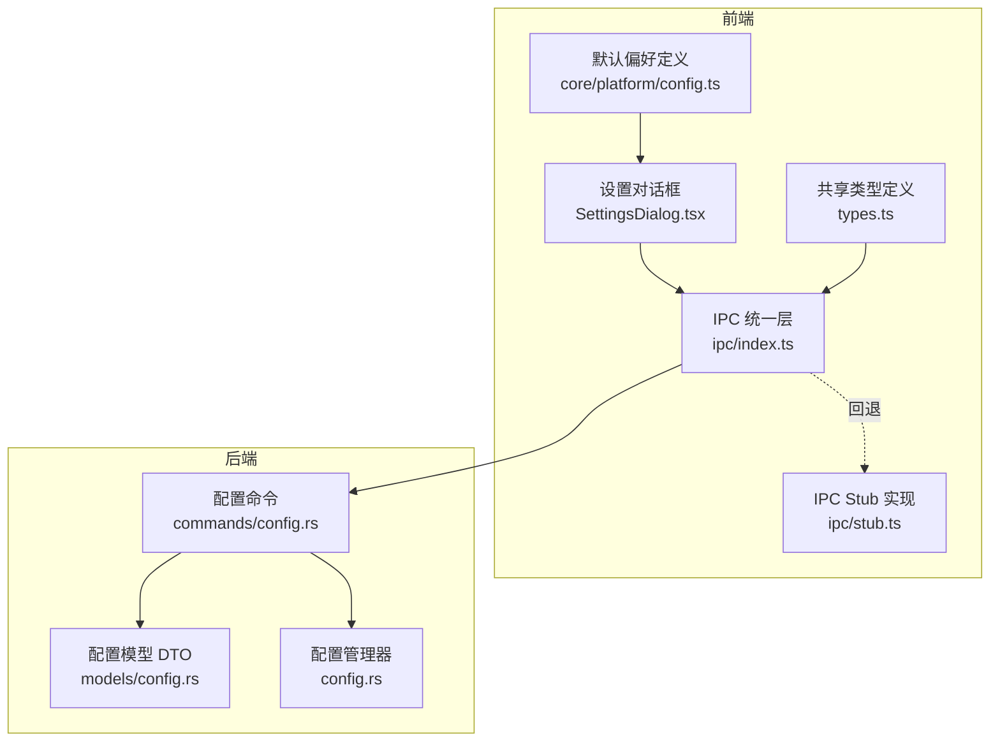
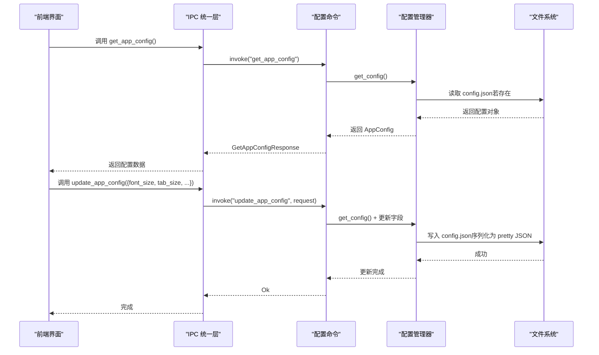
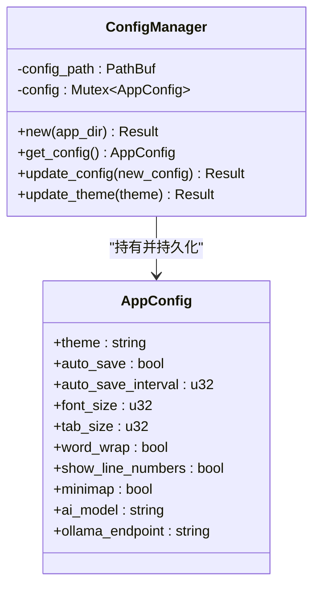
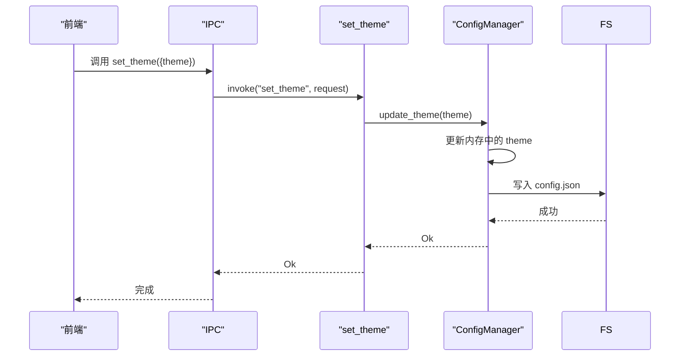
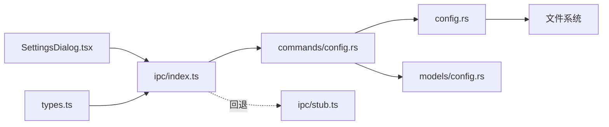

# 应用配置模型

<cite>
**本文引用的文件**
- [src-tauri/src/config.rs](file://src-tauri/src/config.rs)
- [src-tauri/src/commands/config.rs](file://src-tauri/src/commands/config.rs)
- [src-tauri/src/models/config.rs](file://src-tauri/src/models/config.rs)
- [src/core/platform/config.ts](file://src/core/platform/config.ts)
- [src/ipc/stub.ts](file://src/ipc/stub.ts)
- [src/lib/theme-cache.ts](file://src/lib/theme-cache.ts)
- [src/types.ts](file://src/types.ts)
- [src/ipc/index.ts](file://src/ipc/index.ts)
</cite>

## 目录
1. [简介](#简介)
2. [项目结构](#项目结构)
3. [核心组件](#核心组件)
4. [架构总览](#架构总览)
5. [详细组件分析](#详细组件分析)
6. [依赖关系分析](#依赖关系分析)
7. [性能考量](#性能考量)
8. [故障排查指南](#故障排查指南)
9. [结论](#结论)
10. [附录](#附录)

## 简介
本文件系统性梳理 NoteForge 的应用配置模型，聚焦后端配置数据结构与命令接口，以及前端与后端之间的契约与转换规则。重点覆盖以下内容：
- 后端配置数据结构 AppConfig 与 ConfigManager 的职责与行为
- 配置命令 API：读取、更新、主题设置等
- 前端配置类型与默认偏好（AppPreferences）及与后端的差异与映射
- 配置持久化策略与初始化流程
- 配置变更后的同步与缓存策略
- 开发者扩展与定制建议

## 项目结构
NoteForge 的配置能力由“后端（Rust）+ IPC（TypeScript）+ 前端类型”三层构成：
- 后端：定义配置数据结构、持久化与命令接口
- IPC 层：封装 invoke 调用与 stub 回退，暴露统一的前端 API
- 前端：定义 AppPreferences 默认值与 UI 使用的配置形态

图表来源
- [src-tauri/src/commands/config.rs:1-96](file://src-tauri/src/commands/config.rs#L1-L96)
- [src-tauri/src/models/config.rs:1-51](file://src-tauri/src/models/config.rs#L1-L51)
- [src-tauri/src/config.rs:1-90](file://src-tauri/src/config.rs#L1-L90)
- [src/ipc/index.ts:1-105](file://src/ipc/index.ts#L1-L105)
- [src/ipc/stub.ts:907-924](file://src/ipc/stub.ts#L907-L924)
- [src/core/platform/config.ts:1-40](file://src/core/platform/config.ts#L1-L40)
- [src/types.ts:1-58](file://src/types.ts#L1-L58)

章节来源
- [src-tauri/src/config.rs:1-90](file://src-tauri/src/config.rs#L1-L90)
- [src-tauri/src/commands/config.rs:1-96](file://src-tauri/src/commands/config.rs#L1-L96)
- [src-tauri/src/models/config.rs:1-51](file://src-tauri/src/models/config.rs#L1-L51)
- [src/core/platform/config.ts:1-40](file://src/core/platform/config.ts#L1-L40)
- [src/ipc/stub.ts:907-924](file://src/ipc/stub.ts#L907-L924)
- [src/ipc/index.ts:1-105](file://src/ipc/index.ts#L1-L105)
- [src/types.ts:1-58](file://src/types.ts#L1-L58)

## 核心组件
- AppConfig（后端配置模型）
  - 字段：主题、自动保存开关与间隔、字体大小、制表符宽度、是否换行、是否显示行号、是否启用缩略图、AI 模型标识、Ollama 端点
  - 默认值：系统主题、自动保存开启、间隔 30 秒或 5 秒（前端 stub 中）、字体 14、制表符 2、开启换行与行号、开启缩略图、模型 llama3 或 qwen2.5:7b、本地 Ollama 端点
- ConfigManager（配置管理器）
  - 负责加载、克隆、更新配置并持久化到 config.json
  - 提供按字段更新主题的能力
- 配置命令（Tauri Commands）
  - 获取配置、批量更新配置、获取主题、设置主题、检查更新
- 前端类型与默认偏好
  - AppPreferences 与 EditorDefaultsConfig 定义了编辑器默认行为与自动保存策略
  - stub.ts 中提供前端侧的 AppConfigBackend 默认值，用于浏览器开发与测试

章节来源
- [src-tauri/src/config.rs:9-38](file://src-tauri/src/config.rs#L9-L38)
- [src-tauri/src/config.rs:40-80](file://src-tauri/src/config.rs#L40-L80)
- [src-tauri/src/commands/config.rs:9-87](file://src-tauri/src/commands/config.rs#L9-L87)
- [src/core/platform/config.ts:3-39](file://src/core/platform/config.ts#L3-L39)
- [src/ipc/stub.ts:907-924](file://src/ipc/stub.ts#L907-L924)

## 架构总览
后端通过 Tauri 命令暴露配置能力；前端通过 IPC 统一层调用命令或回退到 stub；前端类型与默认偏好与后端配置存在字段映射与差异。

图表来源
- [src-tauri/src/commands/config.rs:9-69](file://src-tauri/src/commands/config.rs#L9-L69)
- [src-tauri/src/config.rs:45-80](file://src-tauri/src/config.rs#L45-L80)
- [src/ipc/index.ts:66-83](file://src/ipc/index.ts#L66-L83)

## 详细组件分析

### 后端配置数据结构与持久化
- AppConfig
  - 字段含义与默认值参见下表
  - 默认值来源于后端默认实现与前端 stub 的不同（例如 auto_save_interval）
- ConfigManager
  - 初始化时在应用数据目录创建 config.json
  - 加载失败或不存在时回退到默认值
  - 更新配置时写入格式化的 JSON 文件

图表来源
- [src-tauri/src/config.rs:9-38](file://src-tauri/src/config.rs#L9-L38)
- [src-tauri/src/config.rs:40-80](file://src-tauri/src/config.rs#L40-L80)

章节来源
- [src-tauri/src/config.rs:9-38](file://src-tauri/src/config.rs#L9-L38)
- [src-tauri/src/config.rs:45-80](file://src-tauri/src/config.rs#L45-L80)

### 配置命令 API
- get_app_config
  - 返回当前配置快照
- update_app_config
  - 接收可选字段请求，逐项更新后整体落盘
- get_theme / set_theme
  - 主题查询与设置（支持系统/浅色/深色）

图表来源
- [src-tauri/src/commands/config.rs:71-87](file://src-tauri/src/commands/config.rs#L71-L87)
- [src-tauri/src/config.rs:73-79](file://src-tauri/src/config.rs#L73-L79)

章节来源
- [src-tauri/src/commands/config.rs:9-87](file://src-tauri/src/commands/config.rs#L9-L87)

### 前端类型与默认偏好
- AppPreferences 与 EditorDefaultsConfig
  - 定义自动保存、编辑器默认行为（表面模式、制表符、字号、字体、换行、新笔记目录、日记目录、日期格式）
  - 默认值集中于 DEFAULT_PREFERENCES
- stub.ts 中的 AppConfigBackend
  - 提供前端开发环境下的默认配置（包含 AI 模型与端点）
  - 与后端 AppConfig 字段保持语义一致，便于 UI 快速运行

章节来源
- [src/core/platform/config.ts:3-39](file://src/core/platform/config.ts#L3-L39)
- [src/ipc/stub.ts:907-924](file://src/ipc/stub.ts#L907-L924)

### 配置持久化与初始化流程
- 初始化
  - 后端在应用数据目录创建 config.json
  - 若文件存在则反序列化，否则使用默认值
- 更新
  - ConfigManager 在更新后以格式化 JSON 写回文件
- 主题缓存
  - 前端使用本地存储缓存主题模式，并在页面渲染前应用样式类

章节来源
- [src-tauri/src/config.rs:45-59](file://src-tauri/src/config.rs#L45-L59)
- [src-tauri/src/config.rs:65-71](file://src-tauri/src/config.rs#L65-L71)
- [src/lib/theme-cache.ts:1-45](file://src/lib/theme-cache.ts#L1-L45)

### 配置字段定义与取值范围
- 主题 theme
  - 取值：系统/浅色/深色
  - 默认：系统
- 自动保存 auto_save
  - 取值：布尔
  - 默认：开启
- 自动保存间隔 auto_save_interval
  - 单位：毫秒
  - 默认：后端为 30 秒，前端 stub 为 5000 毫秒
- 字体大小 font_size
  - 单位：像素
  - 默认：14
- 制表符宽度 tab_size
  - 单位：字符数
  - 默认：2
- 是否换行 word_wrap
  - 取值：布尔
  - 默认：开启
- 是否显示行号 show_line_numbers
  - 取值：布尔
  - 默认：开启
- 是否启用缩略图 minimap
  - 取值：布尔
  - 默认：开启
- AI 模型 ai_model
  - 取值：字符串标识（如 llama3、qwen2.5:7b）
  - 默认：llama3（后端）、qwen2.5:7b（前端 stub）
- Ollama 端点 ollama_endpoint
  - 取值：HTTP 地址
  - 默认：http://localhost:11434

章节来源
- [src-tauri/src/config.rs:23-37](file://src-tauri/src/config.rs#L23-L37)
- [src-tauri/src/models/config.rs:5-16](file://src-tauri/src/models/config.rs#L5-L16)
- [src/ipc/stub.ts:907-924](file://src/ipc/stub.ts#L907-L924)

### 前后端配置模型转换与兼容性
- 字段映射
  - 后端 AppConfig 与前端 stub 的 AppConfigBackend 字段一一对应
  - 命名采用 camelCase，前后端一致
- 兼容性处理
  - IPC 层通过统一的请求/响应 DTO，确保字段名与后端一致
  - 前端类型与后端模型保持语义一致，便于扩展与迁移

章节来源
- [src-tauri/src/models/config.rs:3-31](file://src-tauri/src/models/config.rs#L3-L31)
- [src/ipc/stub.ts:907-924](file://src/ipc/stub.ts#L907-L924)
- [src/types.ts:1-58](file://src/types.ts#L1-L58)

### 配置管理 API 使用示例（步骤级）
- 读取配置
  - 步骤：调用 get_app_config → 后端返回当前配置 → 前端接收并渲染
  - 参考路径：[src-tauri/src/commands/config.rs:9-27](file://src-tauri/src/commands/config.rs#L9-L27)
- 更新配置
  - 步骤：构造 UpdateAppConfigRequest（仅包含需要更新的字段）→ 调用 update_app_config → 后端合并更新并持久化
  - 参考路径：[src-tauri/src/commands/config.rs:29-69](file://src-tauri/src/commands/config.rs#L29-L69)
- 设置主题
  - 步骤：调用 set_theme → 后端仅更新主题字段并持久化 → 前端读取缓存并应用样式
  - 参考路径：[src-tauri/src/commands/config.rs:81-87](file://src-tauri/src/commands/config.rs#L81-L87)
- 重置与默认值
  - 方案：通过 update_app_config 传入后端默认值（可通过后端默认实现或自定义逻辑）→ 覆盖当前配置
  - 参考路径：[src-tauri/src/config.rs:23-37](file://src-tauri/src/config.rs#L23-L37)
- 同步机制
  - 主题变更：set_theme → 写入 config.json → 前端从本地存储读取并应用样式
  - 参考路径：[src/lib/theme-cache.ts:12-30](file://src/lib/theme-cache.ts#L12-L30)

章节来源
- [src-tauri/src/commands/config.rs:9-87](file://src-tauri/src/commands/config.rs#L9-L87)
- [src-tauri/src/config.rs:23-37](file://src-tauri/src/config.rs#L23-L37)
- [src/lib/theme-cache.ts:12-30](file://src/lib/theme-cache.ts#L12-L30)

## 依赖关系分析
- 后端命令依赖 ConfigManager
- ConfigManager 依赖文件系统进行持久化
- 前端通过 IPC 统一层调用命令，支持 stub 回退
- 前端类型与后端模型通过 DTO 保持一致

图表来源
- [src-tauri/src/commands/config.rs:1-96](file://src-tauri/src/commands/config.rs#L1-L96)
- [src-tauri/src/config.rs:1-90](file://src-tauri/src/config.rs#L1-L90)
- [src-tauri/src/models/config.rs:1-51](file://src-tauri/src/models/config.rs#L1-L51)
- [src/ipc/index.ts:1-105](file://src/ipc/index.ts#L1-L105)
- [src/ipc/stub.ts:907-924](file://src/ipc/stub.ts#L907-L924)
- [src/types.ts:1-58](file://src/types.ts#L1-L58)

章节来源
- [src-tauri/src/commands/config.rs:1-96](file://src-tauri/src/commands/config.rs#L1-L96)
- [src-tauri/src/config.rs:1-90](file://src-tauri/src/config.rs#L1-L90)
- [src-tauri/src/models/config.rs:1-51](file://src-tauri/src/models/config.rs#L1-L51)
- [src/ipc/index.ts:1-105](file://src/ipc/index.ts#L1-L105)
- [src/ipc/stub.ts:907-924](file://src/ipc/stub.ts#L907-L924)
- [src/types.ts:1-58](file://src/types.ts#L1-L58)

## 性能考量
- 配置读取：ConfigManager 使用内存锁保护，读取为浅拷贝，开销极低
- 配置写入：每次更新均进行完整 JSON 序列化与磁盘写入，建议批量更新减少 IO
- 主题切换：前端优先使用本地存储缓存，避免重复 IO；后端仅持久化必要字段

## 故障排查指南
- 配置未生效
  - 检查后端是否成功写入 config.json
  - 确认前端是否从本地存储读取并应用主题
- IPC 调用失败
  - 确认 isTauri() 判定与 stub 回退逻辑
  - 检查命令名称与参数结构是否与 DTO 一致
- 字段不一致
  - 确保 DTO 字段名为 camelCase，前后端一致
  - 对照前端类型与后端模型字段映射

章节来源
- [src-tauri/src/config.rs:45-80](file://src-tauri/src/config.rs#L45-L80)
- [src/lib/theme-cache.ts:12-30](file://src/lib/theme-cache.ts#L12-L30)
- [src/ipc/index.ts:59-83](file://src/ipc/index.ts#L59-L83)
- [src-tauri/src/models/config.rs:3-31](file://src-tauri/src/models/config.rs#L3-L31)

## 结论
NoteForge 的配置体系以 AppConfig 为核心，结合 ConfigManager 与 Tauri 命令实现配置的读取、更新与持久化；前端通过 IPC 统一层与 stub 回退保证开发体验与一致性。通过 camelCase DTO 与明确的字段映射，前后端契约清晰，易于扩展与维护。

## 附录

### 配置字段对照表
- 主题：theme（系统/浅色/深色）
- 自动保存：auto_save（布尔）
- 自动保存间隔：auto_save_interval（毫秒）
- 字体大小：font_size（像素）
- 制表符宽度：tab_size（字符数）
- 换行：word_wrap（布尔）
- 显示行号：show_line_numbers（布尔）
- 缩略图：minimap（布尔）
- AI 模型：ai_model（字符串标识）
- Ollama 端点：ollama_endpoint（HTTP 地址）

章节来源
- [src-tauri/src/models/config.rs:5-16](file://src-tauri/src/models/config.rs#L5-L16)
- [src-tauri/src/config.rs:23-37](file://src-tauri/src/config.rs#L23-L37)
- [src/ipc/stub.ts:907-924](file://src/ipc/stub.ts#L907-L924)