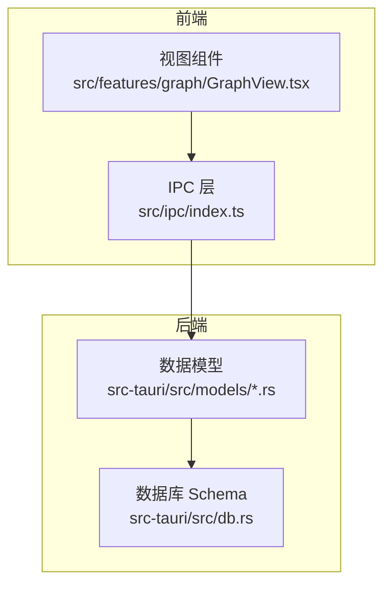
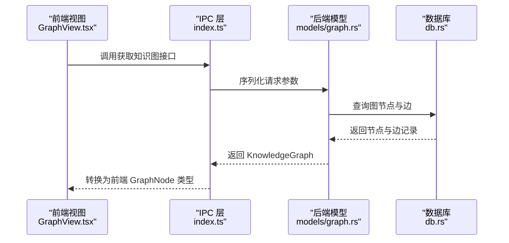
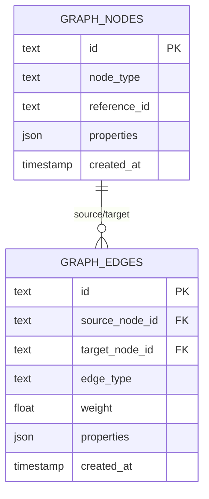
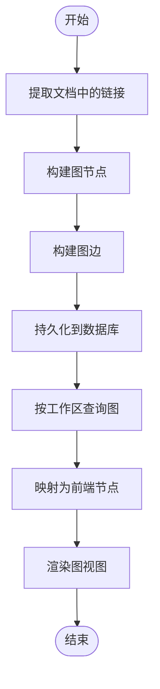
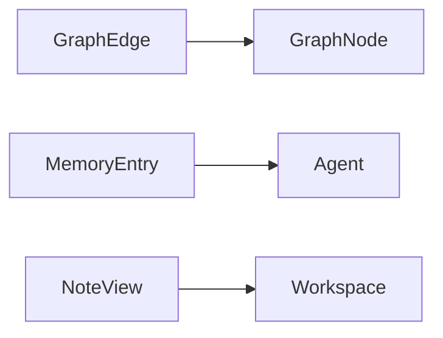

# 数据模型API

<cite>
**本文档引用的文件**
- [src-tauri/src/models/workspace.rs](file://src-tauri/src/models/workspace.rs)
- [src-tauri/src/models/file.rs](file://src-tauri/src/models/file.rs)
- [src-tauri/src/models/editor.rs](file://src-tauri/src/models/editor.rs)
- [src-tauri/src/models/graph.rs](file://src-tauri/src/models/graph.rs)
- [src-tauri/src/models/memory.rs](file://src-tauri/src/models/memory.rs)
- [src-tauri/src/models/note.rs](file://src-tauri/src/models/note.rs)
- [src-tauri/src/db.rs](file://src-tauri/src/db.rs)
- [src/ipc/index.ts](file://src/ipc/index.ts)
- [src/features/graph/GraphView.tsx](file://src/features/graph/GraphView.tsx)
</cite>

## 目录
1. [简介](#简介)
2. [项目结构](#项目结构)
3. [核心组件](#核心组件)
4. [架构总览](#架构总览)
5. [详细组件分析](#详细组件分析)
6. [依赖分析](#依赖分析)
7. [性能考虑](#性能考虑)
8. [故障排除指南](#故障排除指南)
9. [结论](#结论)
10. [附录](#附录)

## 简介
本文件为NoteForge数据模型API的权威参考与集成指南，覆盖工作区配置、文件系统条目、编辑器状态、知识图谱节点与边、记忆体（Agent Memory）以及笔记等核心数据结构。文档从数据结构定义、关系与约束、序列化与反序列化规则、前后端数据格式转换、使用示例与最佳实践、错误处理与性能优化等方面进行系统阐述，帮助开发者准确理解并高效集成。

## 项目结构
NoteForge采用前后端分层设计：Rust后端负责数据模型定义、数据库Schema与业务逻辑；TypeScript前端负责UI与IPC桥接，通过统一的序列化格式在前后端之间传递数据。

图表来源
- [src/ipc/index.ts:107-159](file://src/ipc/index.ts#L107-L159)
- [src/features/graph/GraphView.tsx:81-118](file://src/features/graph/GraphView.tsx#L81-L118)
- [src-tauri/src/models/workspace.rs:1-42](file://src-tauri/src/models/workspace.rs#L1-L42)
- [src-tauri/src/db.rs:102-131](file://src-tauri/src/db.rs#L102-L131)

章节来源
- [src-tauri/src/models/workspace.rs:1-42](file://src-tauri/src/models/workspace.rs#L1-L42)
- [src-tauri/src/models/file.rs:1-19](file://src-tauri/src/models/file.rs#L1-L19)
- [src-tauri/src/models/editor.rs:1-24](file://src-tauri/src/models/editor.rs#L1-L24)
- [src-tauri/src/models/graph.rs:1-35](file://src-tauri/src/models/graph.rs#L1-L35)
- [src-tauri/src/models/memory.rs:1-107](file://src-tauri/src/models/memory.rs#L1-L107)
- [src-tauri/src/models/note.rs:1-32](file://src-tauri/src/models/note.rs#L1-L32)
- [src-tauri/src/db.rs:102-131](file://src-tauri/src/db.rs#L102-L131)
- [src/ipc/index.ts:107-159](file://src/ipc/index.ts#L107-L159)
- [src/features/graph/GraphView.tsx:81-118](file://src/features/graph/GraphView.tsx#L81-L118)

## 核心组件
本节对各数据模型进行逐项说明，包含字段含义、类型约束、默认值与典型用途。

- 工作区配置与视图
  - WorkspaceConfig：工作区名称、路径、自动索引开关、排除模式列表
  - WorkspaceView：工作区视图对象，包含id、name、path、config、创建与更新时间
  - 请求对象：CreateWorkspaceRequest、OpenWorkspaceRequest、UpdateWorkspaceConfigRequest

- 文件系统条目
  - FileEntry：文件或目录的元信息（名称、路径、是否目录、大小、修改时间）
  - ReadFileResponse：读取文件返回内容与语言

- 编辑器状态
  - LanguageDetection：语言检测结果（语言与置信度）
  - FormatCodeResponse：代码格式化结果
  - FileInfo：文件信息（大小、修改时间、语言、是否目录）

- 知识图谱
  - GraphNode：节点（id、节点类型、引用id、属性JSON）
  - GraphEdge：边（id、源节点id、目标节点id、边类型、权重、属性JSON）
  - KnowledgeGraph：图（节点数组、边数组）
  - GetKnowledgeGraphRequest：按工作区获取图的请求

- 记忆体（Agent Memory）
  - MemoryEntry：记忆体条目（id、agent_id、content、title、type、importance、访问相关、创建/更新时间、metadata、tags）
  - 请求对象：CreateMemoryRequest、UpdateMemoryRequest、DeleteMemoryRequest、BatchTagMemoriesRequest、BatchDeleteMemoriesRequest、ListAgentMemoriesRequest、GetMemoryTimelineRequest、MonitorMemoryDirectoryRequest、ImportAgentMemoriesRequest/Response、Agent

- 笔记
  - NoteView：笔记视图（id、workspace_id、file_path、title、content、language、创建/更新时间）
  - 请求对象：CreateNoteRequest、UpdateNoteRequest

章节来源
- [src-tauri/src/models/workspace.rs:1-42](file://src-tauri/src/models/workspace.rs#L1-L42)
- [src-tauri/src/models/file.rs:1-19](file://src-tauri/src/models/file.rs#L1-L19)
- [src-tauri/src/models/editor.rs:1-24](file://src-tauri/src/models/editor.rs#L1-L24)
- [src-tauri/src/models/graph.rs:1-35](file://src-tauri/src/models/graph.rs#L1-L35)
- [src-tauri/src/models/memory.rs:1-107](file://src-tauri/src/models/memory.rs#L1-L107)
- [src-tauri/src/models/note.rs:1-32](file://src-tauri/src/models/note.rs#L1-L32)

## 架构总览
下图展示从前端到后端的数据流与模型映射关系，包括IPC层的序列化转换与数据库持久化。

图表来源
- [src/features/graph/GraphView.tsx:81-118](file://src/features/graph/GraphView.tsx#L81-L118)
- [src/ipc/index.ts:107-159](file://src/ipc/index.ts#L107-L159)
- [src-tauri/src/models/graph.rs:1-35](file://src-tauri/src/models/graph.rs#L1-L35)
- [src-tauri/src/db.rs:102-131](file://src-tauri/src/db.rs#L102-L131)

## 详细组件分析

### 工作区模型
- 字段与约束
  - WorkspaceConfig：name、path、auto_index、exclude_patterns
  - WorkspaceView：id为主键，config为嵌套对象，created_at/updated_at为时间戳字符串
  - 请求对象：Create/Open/Update分别用于创建工作区、打开工作区、更新配置
- 前后端映射
  - 后端模型通过Serde以驼峰命名序列化；前端通过IPC层转换为内部视图对象
- 使用建议
  - 配置变更需幂等更新，避免重复写入
  - 排除模式应支持通配符与相对路径

章节来源
- [src-tauri/src/models/workspace.rs:1-42](file://src-tauri/src/models/workspace.rs#L1-L42)
- [src/ipc/index.ts:107-159](file://src/ipc/index.ts#L107-L159)

### 文件系统条目
- 字段与约束
  - FileEntry：name、path、is_dir、size、modified（均为必要字段）
  - ReadFileResponse：content为文本内容，language为语言标识
- 前后端映射
  - IPC层提供 toFileEntry 映射函数，确保字段一致性
- 使用建议
  - 大文件读取建议分块或异步流式处理
  - 修改时间统一使用ISO字符串便于跨平台比较

章节来源
- [src-tauri/src/models/file.rs:1-19](file://src-tauri/src/models/file.rs#L1-L19)
- [src/ipc/index.ts:107-159](file://src/ipc/index.ts#L107-L159)

### 编辑器状态
- 字段与约束
  - LanguageDetection：language、confidence
  - FormatCodeResponse：formatted
  - FileInfo：size、modified、language、is_dir
- 前后端映射
  - IPC层提供语言检测与格式化响应的序列化规则
- 使用建议
  - 语言检测应结合文件扩展名与内容启发式
  - 格式化失败时回退原始内容并记录日志

章节来源
- [src-tauri/src/models/editor.rs:1-24](file://src-tauri/src/models/editor.rs#L1-L24)
- [src/ipc/index.ts:107-159](file://src/ipc/index.ts#L107-L159)

### 知识图谱模型
- 字段与约束
  - GraphNode：id主键，node_type枚举（note/memory/concept/agent），reference_id指向具体实体，properties为JSON
  - GraphEdge：id主键，source/target引用节点，edge_type表示关系类型，weight为浮点权重，properties为JSON
  - KnowledgeGraph：nodes与edges数组
  - GetKnowledgeGraphRequest：按工作区查询
- 数据库约束
  - graph_nodes表：node_type受CHECK约束，reference_id非空，properties为JSON
  - graph_edges表：外键约束保证源/目标节点存在，CASCADE删除保证引用完整性，索引加速查询
- 前后端映射
  - IPC层提供 toGraphNode 将后端节点映射为前端显示节点（含标签、度数等）
  - 前端GraphView根据过滤条件与布局算法渲染可视化
- 使用建议
  - 边权重可基于链接强度、共现频率或向量相似度计算
  - 节点属性JSON建议规范化schema，便于查询与统计

图表来源
- [src-tauri/src/db.rs:102-131](file://src-tauri/src/db.rs#L102-L131)

图表来源
- [src-tauri/src/db.rs:102-131](file://src-tauri/src/db.rs#L102-L131)
- [src/ipc/index.ts:107-159](file://src/ipc/index.ts#L107-L159)
- [src/features/graph/GraphView.tsx:81-118](file://src/features/graph/GraphView.tsx#L81-L118)

章节来源
- [src-tauri/src/models/graph.rs:1-35](file://src-tauri/src/models/graph.rs#L1-L35)
- [src-tauri/src/db.rs:102-131](file://src-tauri/src/db.rs#L102-L131)
- [src/ipc/index.ts:107-159](file://src/ipc/index.ts#L107-L159)
- [src/features/graph/GraphView.tsx:81-118](file://src/features/graph/GraphView.tsx#L81-L118)

### 记忆体模型
- 字段与约束
  - MemoryEntry：id主键，agent_id关联Agent，content/title/type/importance等，metadata/tags为可选
  - 请求对象：创建、更新、删除、批量标签、批量删除、按Agent列出、时间线查询、目录监控、导入等
  - Agent：id、name、type、memory_count、color
- 前后端映射
  - IPC层提供 toMemoryEntry 映射函数，合并metadata中的派生字段（如agentName、title、tags）
- 使用建议
  - 导入时先解析格式，再批量插入，记录错误明细
  - 批量操作应使用事务，保证一致性

章节来源
- [src-tauri/src/models/memory.rs:1-107](file://src-tauri/src/models/memory.rs#L1-L107)
- [src/ipc/index.ts:107-159](file://src/ipc/index.ts#L107-L159)

### 笔记模型
- 字段与约束
  - NoteView：id主键，workspace_id关联工作区，file_path唯一，title/content/language可选
  - 请求对象：创建、更新
- 使用建议
  - 创建时校验文件路径合法性与唯一性
  - 更新时支持增量同步，避免全量覆盖

章节来源
- [src-tauri/src/models/note.rs:1-32](file://src-tauri/src/models/note.rs#L1-L32)

## 依赖分析
- 模型依赖
  - GraphEdge依赖GraphNodes（外键约束）
  - MemoryEntry依赖Agent（通过agent_id）
  - NoteView依赖Workspace（通过workspace_id）
- IPC层依赖
  - 前端视图组件依赖IPC层提供的序列化/反序列化函数
  - IPC层依赖后端模型定义
- 数据库依赖
  - graph_nodes与graph_edges表通过外键建立引用完整性
  - 索引提升查询性能

图表来源
- [src-tauri/src/models/graph.rs:1-35](file://src-tauri/src/models/graph.rs#L1-L35)
- [src-tauri/src/models/memory.rs:1-107](file://src-tauri/src/models/memory.rs#L1-L107)
- [src-tauri/src/models/note.rs:1-32](file://src-tauri/src/models/note.rs#L1-L32)

章节来源
- [src-tauri/src/models/graph.rs:1-35](file://src-tauri/src/models/graph.rs#L1-L35)
- [src-tauri/src/models/memory.rs:1-107](file://src-tauri/src/models/memory.rs#L1-L107)
- [src-tauri/src/models/note.rs:1-32](file://src-tauri/src/models/note.rs#L1-L32)
- [src-tauri/src/db.rs:102-131](file://src-tauri/src/db.rs#L102-L131)

## 性能考虑
- 数据库索引
  - graph_edges表对source_node_id与target_node_id建立索引，加速邻接查询
  - 建议在高频查询字段上添加复合索引（如node_type+reference_id）
- 图渲染优化
  - 前端按过滤条件裁剪可见节点与边，减少渲染开销
  - 力导向布局参数（如初始位置、迭代次数）应随节点规模动态调整
- IPC序列化
  - 对大JSON属性（如properties）建议压缩或延迟加载
  - 批量操作使用数组传输，减少往返次数
- I/O与缓存
  - 文件读取采用异步与内存缓存策略
  - 编辑器语言检测与格式化结果可缓存热点文件

## 故障排除指南
- 引用完整性错误
  - 症状：删除节点时报外键约束错误
  - 处理：先删除相关边，再删除节点；或启用级联删除（已实现）
- 序列化不一致
  - 症状：前端显示字段缺失或类型不符
  - 处理：检查IPC层映射函数，确保字段名与类型一致（后端驼峰命名）
- 图渲染异常
  - 症状：节点重叠或边交叉混乱
  - 处理：检查过滤条件与布局算法参数；确认节点/边数量未超阈值
- 记忆体导入失败
  - 症状：部分记录导入失败
  - 处理：查看导入响应中的错误列表，定位具体记录并修正格式

章节来源
- [src-tauri/src/db.rs:102-131](file://src-tauri/src/db.rs#L102-L131)
- [src/ipc/index.ts:107-159](file://src/ipc/index.ts#L107-L159)
- [src/features/graph/GraphView.tsx:81-118](file://src/features/graph/GraphView.tsx#L81-L118)

## 结论
本文档提供了NoteForge数据模型API的完整参考与集成指南。通过明确的数据结构定义、关系与约束、序列化规则与前后端映射，开发者可以快速实现功能扩展与性能优化。建议在实际开发中遵循本文的最佳实践，并结合错误处理与性能优化策略，确保系统的稳定性与可维护性。

## 附录
- 常用字段对照
  - 后端驼峰命名 → 前端小写/下划线命名（由IPC层转换）
  - 时间戳统一使用ISO字符串
  - JSON属性建议规范化schema，便于查询与统计
- 开发者提示
  - 新增模型时，同步更新IPC层映射函数
  - 数据库变更需配套迁移脚本与索引重建
  - 图渲染参数应支持用户自定义与主题适配