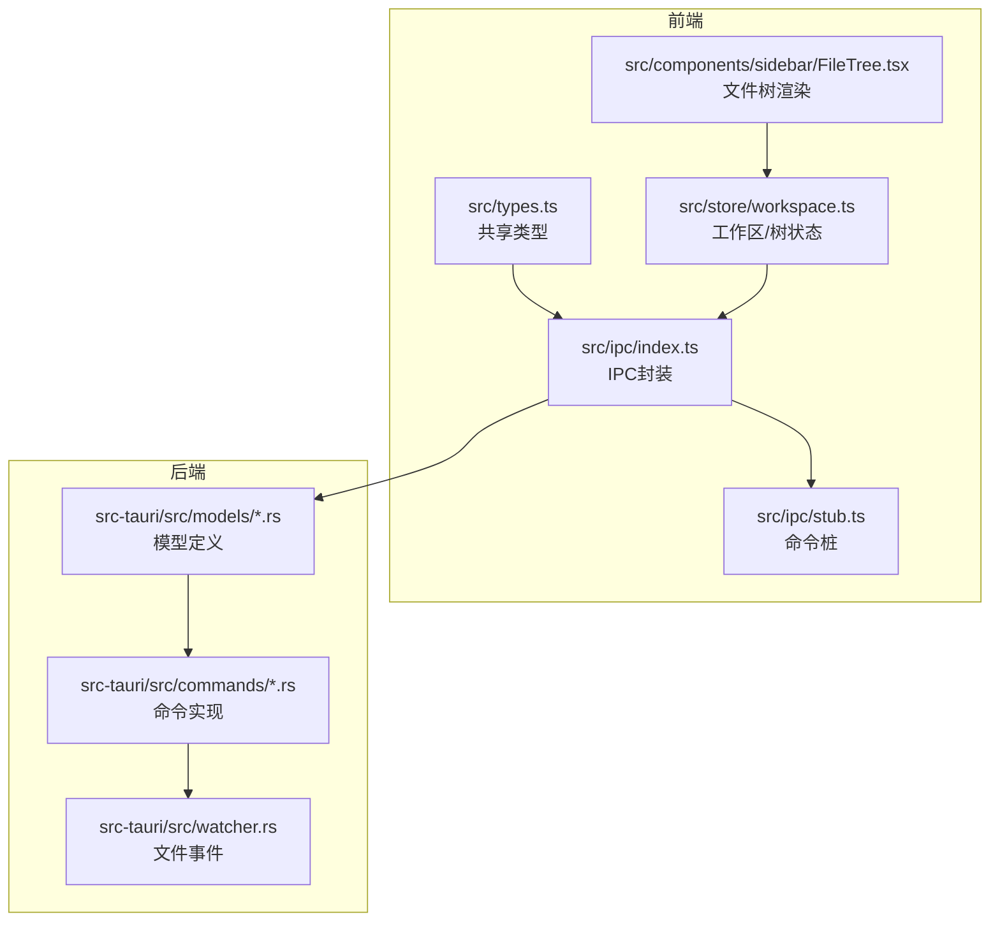
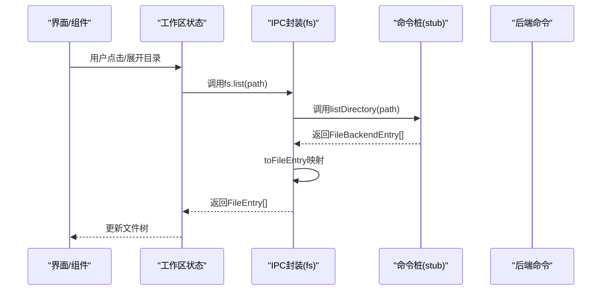
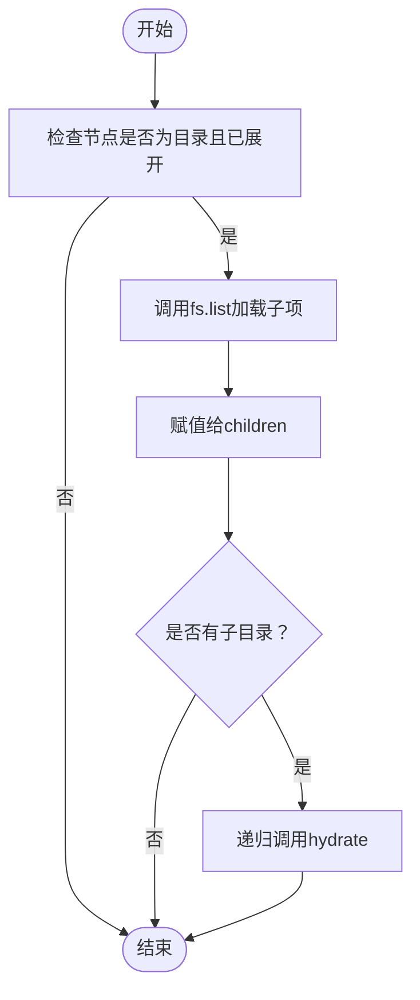
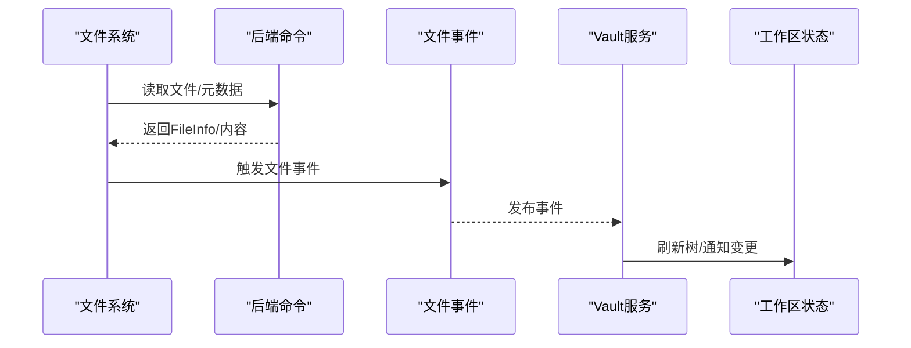
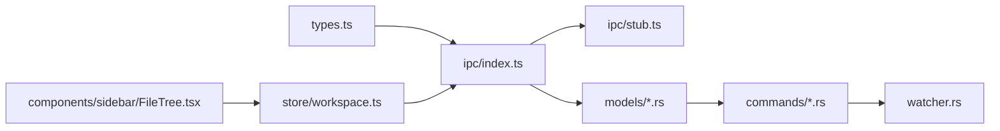

# 文件系统模型

<cite>
**本文档引用的文件**
- [src/types.ts](file://src/types.ts)
- [src/ipc/index.ts](file://src/ipc/index.ts)
- [src/ipc/stub.ts](file://src/ipc/stub.ts)
- [src/store/workspace.ts](file://src/store/workspace.ts)
- [src/core/vault/vault-service.impl.ts](file://src/core/vault/vault-service.impl.ts)
- [src-tauri/src/models/file.rs](file://src-tauri/src/models/file.rs)
- [src-tauri/src/models/editor.rs](file://src-tauri/src/models/editor.rs)
- [src-tauri/src/commands/editor.rs](file://src-tauri/src/commands/editor.rs)
- [src-tauri/src/watcher.rs](file://src-tauri/src/watcher.rs)
- [src/components/sidebar/FileTree.tsx](file://src/components/sidebar/FileTree.tsx)
</cite>

## 目录
1. [简介](#简介)
2. [项目结构](#项目结构)
3. [核心组件](#核心组件)
4. [架构总览](#架构总览)
5. [详细组件分析](#详细组件分析)
6. [依赖关系分析](#依赖关系分析)
7. [性能考量](#性能考量)
8. [故障排除指南](#故障排除指南)
9. [结论](#结论)
10. [附录](#附录)

## 简介
本文件系统模型文档聚焦于NoteForge中文件系统的数据结构与API，涵盖前端与后端之间的契约对齐、文件条目层次结构、元数据管理（大小、修改时间、语言检测）、文件遍历与操作、以及目录监控机制。文档同时提供API使用示例、前端/后端模型转换规则与兼容性处理建议，并给出集成与排障指南。

## 项目结构
NoteForge的文件系统相关代码横跨前端与后端：
- 前端共享类型与IPC封装位于 src/types.ts 与 src/ipc/index.ts
- 前端文件树与工作区状态位于 src/store/workspace.ts
- 前端虚拟文档与后端命令桩位于 src/ipc/stub.ts
- 后端模型与命令位于 src-tauri/src/models 与 src-tauri/src/commands
- 监控与事件位于 src-tauri/src/watcher.rs 与 src/core/vault/vault-service.impl.ts
- 文件树渲染位于 src/components/sidebar/FileTree.tsx

图表来源
- [src/types.ts:1-389](file://src/types.ts#L1-L389)
- [src/ipc/index.ts:215-238](file://src/ipc/index.ts#L215-L238)
- [src/ipc/stub.ts:283-371](file://src/ipc/stub.ts#L283-L371)
- [src-tauri/src/models/file.rs:1-19](file://src-tauri/src/models/file.rs#L1-L19)
- [src-tauri/src/models/editor.rs:16-24](file://src-tauri/src/models/editor.rs#L16-L24)
- [src-tauri/src/commands/editor.rs:51-80](file://src-tauri/src/commands/editor.rs#L51-L80)
- [src-tauri/src/watcher.rs:116-128](file://src-tauri/src/watcher.rs#L116-L128)
- [src/store/workspace.ts:98-157](file://src/store/workspace.ts#L98-L157)
- [src/components/sidebar/FileTree.tsx:42-78](file://src/components/sidebar/FileTree.tsx#L42-L78)

章节来源
- [src/types.ts:1-389](file://src/types.ts#L1-L389)
- [src/ipc/index.ts:215-238](file://src/ipc/index.ts#L215-L238)
- [src/ipc/stub.ts:283-371](file://src/ipc/stub.ts#L283-L371)
- [src-tauri/src/models/file.rs:1-19](file://src-tauri/src/models/file.rs#L1-L19)
- [src-tauri/src/models/editor.rs:16-24](file://src-tauri/src/models/editor.rs#L16-L24)
- [src-tauri/src/commands/editor.rs:51-80](file://src-tauri/src/commands/editor.rs#L51-L80)
- [src-tauri/src/watcher.rs:116-128](file://src-tauri/src/watcher.rs#L116-L128)
- [src/store/workspace.ts:98-157](file://src/store/workspace.ts#L98-L157)
- [src/components/sidebar/FileTree.tsx:42-78](file://src/components/sidebar/FileTree.tsx#L42-L78)

## 核心组件
- 文件条目模型
  - 前端模型：FileEntry（包含路径、名称、是否目录、大小、修改时间、语言、子节点）
  - 后端模型：FileBackendEntry（后端对齐形状，字段命名遵循snake_case）
- 文件信息模型
  - FileInfo：包含大小、修改时间、语言、是否目录
- IPC封装
  - fs对象：read/write/list/create/remove/rename/move/info
  - 转换函数：toFileEntry用于后端到前端的模型映射
- 目录监控
  - 前端轮询与原生监听结合，基于修订版本（内容+修改时间）判断变更
  - 后端文件事件枚举与订阅

章节来源
- [src/types.ts:50-74](file://src/types.ts#L50-L74)
- [src/ipc/index.ts:128-136](file://src/ipc/index.ts#L128-L136)
- [src/core/vault/vault-service.impl.ts:40-94](file://src/core/vault/vault-service.impl.ts#L40-L94)
- [src-tauri/src/models/file.rs:5-11](file://src-tauri/src/models/file.rs#L5-L11)
- [src-tauri/src/models/editor.rs:18-23](file://src-tauri/src/models/editor.rs#L18-L23)
- [src-tauri/src/watcher.rs:116-128](file://src-tauri/src/watcher.rs#L116-L128)

## 架构总览
NoteForge采用“前端IPC封装 + 后端命令实现”的架构。前端通过fs对象发起命令，后端执行实际文件系统操作；在开发环境下，前端提供stub以模拟后端行为，保证UI自测一致性。

图表来源
- [src/store/workspace.ts:98-157](file://src/store/workspace.ts#L98-L157)
- [src/ipc/index.ts:215-238](file://src/ipc/index.ts#L215-L238)
- [src/ipc/stub.ts:300-325](file://src/ipc/stub.ts#L300-L325)

## 详细组件分析

### 数据结构与字段定义
- FileEntry（前端）
  - 字段：path（字符串）、name（字符串）、isDir（布尔）、size（可选数字）、modified（可选ISO字符串）、language（可选字符串）、children（可选数组）
  - 作用：描述文件树节点，支持层级展开与渲染
- FileBackendEntry（后端对齐）
  - 字段：name、path、is_dir、size、modified
  - 作用：作为IPC传输的后端契约形状
- FileInfo
  - 字段：size、modified、language、is_dir
  - 作用：提供文件元信息，含大小、修改时间、语言与是否目录

章节来源
- [src/types.ts:50-74](file://src/types.ts#L50-L74)
- [src-tauri/src/models/file.rs:5-11](file://src-tauri/src/models/file.rs#L5-L11)
- [src-tauri/src/models/editor.rs:18-23](file://src-tauri/src/models/editor.rs#L18-L23)

### 文件条目层次结构设计
- 层次结构
  - isDir为true时，FileEntry.children可填充子项；否则为叶子节点
  - 展开/折叠由工作区状态维护，首次访问时懒加载子节点
- 字段语义
  - path：完整路径，唯一标识
  - name：文件或目录名
  - isDir：是否为目录
  - size：字节数（前端可选，后端提供）
  - modified：ISO字符串格式的最后修改时间
  - language：文件语言（用于编辑器语法高亮）

章节来源
- [src/store/workspace.ts:98-157](file://src/store/workspace.ts#L98-L157)
- [src/types.ts:50-58](file://src/types.ts#L50-L58)

### 元数据管理（大小、修改时间、语言检测）
- 大小与修改时间
  - 前端：getFileInfo通过文本编码计算字节长度，设置当前时间作为修改时间
  - 后端：读取文件系统元数据，返回size与modified
- 语言检测
  - 前端：基于扩展名映射（extLang），支持Markdown、JSON、YAML、JS/TS、Python、Rust、Go、Java、C/C++、HTML/CSS、SQL/XML、TOML等
  - 后端：基于扩展名映射，必要时可扩展为内容探测

章节来源
- [src/ipc/stub.ts:361-371](file://src/ipc/stub.ts#L361-L371)
- [src-tauri/src/commands/editor.rs:51-80](file://src-tauri/src/commands/editor.rs#L51-L80)
- [src-tauri/src/models/editor.rs:18-23](file://src-tauri/src/models/editor.rs#L18-L23)

### 文件系统遍历、过滤与API使用示例
- 遍历
  - 使用fs.list(path)获取某路径下直接子项，按目录优先、名称排序
  - 工作区状态在展开目录时懒加载子节点，并递归预热子目录
- 过滤
  - 前端提供按标签过滤（filterByTags）与全文检索（searchFulltext），可用于筛选文件
- 示例流程（递归遍历与懒加载）

图表来源
- [src/store/workspace.ts:98-157](file://src/store/workspace.ts#L98-L157)
- [src/ipc/index.ts:223-228](file://src/ipc/index.ts#L223-L228)

章节来源
- [src/store/workspace.ts:98-157](file://src/store/workspace.ts#L98-L157)
- [src/ipc/index.ts:223-228](file://src/ipc/index.ts#L223-L228)
- [src/ipc/stub.ts:300-325](file://src/ipc/stub.ts#L300-L325)

### 文件操作API
- 读取/写入
  - fs.read(path)：返回content与language
  - fs.write(path, content)：写入内容
- 列表/创建/删除/重命名/移动
  - fs.list(path)、fs.create(path, content)、fs.remove(path)、fs.rename(oldPath, newPath)、fs.move(source, destination)
- 获取信息
  - fs.info(path)：返回FileInfo

章节来源
- [src/ipc/index.ts:218-238](file://src/ipc/index.ts#L218-L238)
- [src/ipc/stub.ts:283-371](file://src/ipc/stub.ts#L283-L371)

### 目录监控与变更检测
- 前端监控
  - 非Tauri平台：定时轮询（3秒间隔），比较修订版本（buildDiskRevision：基于内容与modified）
  - Tauri平台：原生监听，接收Created/Modified/Deleted/Renamed事件
- 后端事件
  - FileEvent枚举定义了事件类型
- 监控生命周期
  - trackForWatch/untrackForWatch：注册/注销跟踪路径
  - startWatching/stopWatching：启动/停止轮询

图表来源
- [src-tauri/src/commands/editor.rs:51-80](file://src-tauri/src/commands/editor.rs#L51-L80)
- [src-tauri/src/watcher.rs:116-128](file://src-tauri/src/watcher.rs#L116-L128)
- [src/core/vault/vault-service.impl.ts:262-313](file://src/core/vault/vault-service.impl.ts#L262-L313)

章节来源
- [src/core/vault/vault-service.impl.ts:40-94](file://src/core/vault/vault-service.impl.ts#L40-L94)
- [src/core/vault/vault-service.impl.ts:262-313](file://src/core/vault/vault-service.impl.ts#L262-L313)
- [src-tauri/src/watcher.rs:116-128](file://src-tauri/src/watcher.rs#L116-L128)

### 前端与后端模型转换规则
- 契约对齐
  - 后端模型统一使用camelCase序列化（如FileEntry、FileInfo）
  - 前端types.ts中的FileBackendEntry与FileInfo与后端契约对齐
- 映射函数
  - toFileEntry：将后端FileBackendEntry映射为前端FileEntry（仅字段名差异）
- 兼容性处理
  - 在开发模式下，stub提供与后端相同的返回形状，确保前端逻辑无需区分环境
  - 错误码统一（如FILE_NOT_FOUND、CREATE_ERROR等），便于前端捕获与提示

章节来源
- [src/types.ts:60-74](file://src/types.ts#L60-L74)
- [src/ipc/index.ts:128-136](file://src/ipc/index.ts#L128-L136)
- [src-tauri/src/models/file.rs:5-11](file://src-tauri/src/models/file.rs#L5-L11)
- [src-tauri/src/models/editor.rs:18-23](file://src-tauri/src/models/editor.rs#L18-L23)

## 依赖关系分析
- 前端依赖
  - types.ts提供共享契约
  - ipc/index.ts封装命令调用与模型映射
  - store/workspace.ts驱动文件树懒加载与刷新
  - components/sidebar/FileTree.tsx消费FileEntry进行渲染
- 后端依赖
  - models/*.rs定义DTO
  - commands/*.rs实现具体逻辑
  - watcher.rs提供文件事件枚举与订阅

图表来源
- [src/types.ts:1-389](file://src/types.ts#L1-L389)
- [src/ipc/index.ts:215-238](file://src/ipc/index.ts#L215-L238)
- [src/ipc/stub.ts:283-371](file://src/ipc/stub.ts#L283-L371)
- [src-tauri/src/models/file.rs:1-19](file://src-tauri/src/models/file.rs#L1-L19)
- [src-tauri/src/models/editor.rs:16-24](file://src-tauri/src/models/editor.rs#L16-L24)
- [src-tauri/src/commands/editor.rs:51-80](file://src-tauri/src/commands/editor.rs#L51-L80)
- [src-tauri/src/watcher.rs:116-128](file://src-tauri/src/watcher.rs#L116-L128)
- [src/store/workspace.ts:98-157](file://src/store/workspace.ts#L98-L157)
- [src/components/sidebar/FileTree.tsx:42-78](file://src/components/sidebar/FileTree.tsx#L42-L78)

章节来源
- [src/types.ts:1-389](file://src/types.ts#L1-L389)
- [src/ipc/index.ts:215-238](file://src/ipc/index.ts#L215-L238)
- [src/ipc/stub.ts:283-371](file://src/ipc/stub.ts#L283-L371)
- [src-tauri/src/models/file.rs:1-19](file://src-tauri/src/models/file.rs#L1-L19)
- [src-tauri/src/models/editor.rs:16-24](file://src-tauri/src/models/editor.rs#L16-L24)
- [src-tauri/src/commands/editor.rs:51-80](file://src-tauri/src/commands/editor.rs#L51-L80)
- [src-tauri/src/watcher.rs:116-128](file://src-tauri/src/watcher.rs#L116-L128)
- [src/store/workspace.ts:98-157](file://src/store/workspace.ts#L98-L157)
- [src/components/sidebar/FileTree.tsx:42-78](file://src/components/sidebar/FileTree.tsx#L42-L78)

## 性能考量
- 懒加载与递归预热
  - 仅在展开目录时加载子项，减少初始渲染压力
  - 对子目录进行Promise.all并行预热，提升递归展开速度
- 监控轮询
  - 非Tauri平台默认3秒轮询，可根据场景调整频率
  - 通过修订版本避免重复事件与无效刷新
- I/O与序列化
  - 前端getFileInfo对内容进行字节长度计算，注意大文件的内存占用
  - 后端命令直接读取文件系统元数据，避免不必要的解析

章节来源
- [src/store/workspace.ts:98-157](file://src/store/workspace.ts#L98-L157)
- [src/core/vault/vault-service.impl.ts:262-313](file://src/core/vault/vault-service.impl.ts#L262-L313)
- [src/ipc/stub.ts:361-371](file://src/ipc/stub.ts#L361-L371)

## 故障排除指南
- 常见错误码
  - FILE_NOT_FOUND：路径不存在或被删除
  - CREATE_ERROR：目标路径已存在
  - READ_ERROR/WRITE_ERROR：读写权限或虚拟路径限制
  - DETECTION_FAILED：语言检测失败（扩展名未知）
- 排查步骤
  - 确认路径是否为虚拟文档（untitled:或协议前缀），此类路径不可作为文件读写
  - 检查工作区根路径与目标路径关系，避免越权访问
  - 若使用stub，请确认初始化文件集合是否包含目标路径
  - 监控异常：检查轮询是否启动、修订版本是否正确更新
- 建议
  - 在生产环境启用原生监听以降低轮询开销
  - 对大文件操作使用异步与进度反馈

章节来源
- [src/types.ts:335-389](file://src/types.ts#L335-L389)
- [src/ipc/stub.ts:283-290](file://src/ipc/stub.ts#L283-L290)
- [src/core/vault/vault-service.impl.ts:262-313](file://src/core/vault/vault-service.impl.ts#L262-L313)

## 结论
NoteForge的文件系统模型通过清晰的前后端契约与完善的IPC封装，实现了稳定的文件浏览、操作与监控能力。前端以FileEntry为核心数据结构，配合懒加载与并行预热策略，兼顾易用性与性能；后端以模型与命令为中心，提供可靠的语言检测与文件事件支持。开发者可据此快速集成文件系统功能，并依据本文档的示例与最佳实践进行扩展与优化。

## 附录
- API速查
  - 读取：fs.read(path)
  - 写入：fs.write(path, content)
  - 列表：fs.list(path)
  - 创建：fs.create(path, content)
  - 删除：fs.remove(path)
  - 重命名/移动：fs.rename(oldPath, newPath) / fs.move(source, destination)
  - 信息：fs.info(path)
- 渲染提示
  - 目录图标与语言图标：FileTree根据isDir与language字段选择显示

章节来源
- [src/ipc/index.ts:218-238](file://src/ipc/index.ts#L218-L238)
- [src/components/sidebar/FileTree.tsx:42-78](file://src/components/sidebar/FileTree.tsx#L42-L78)