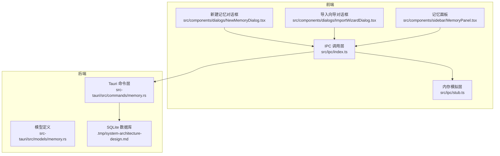
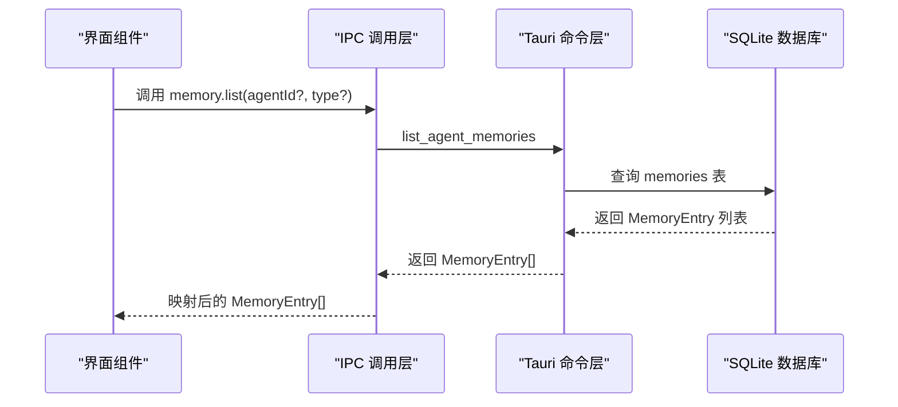
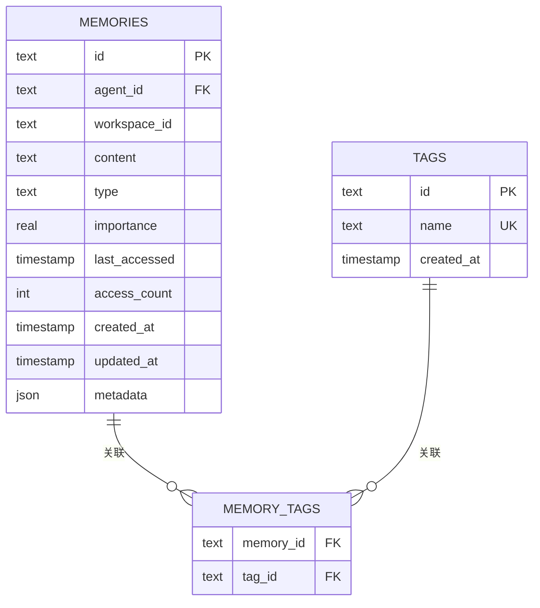
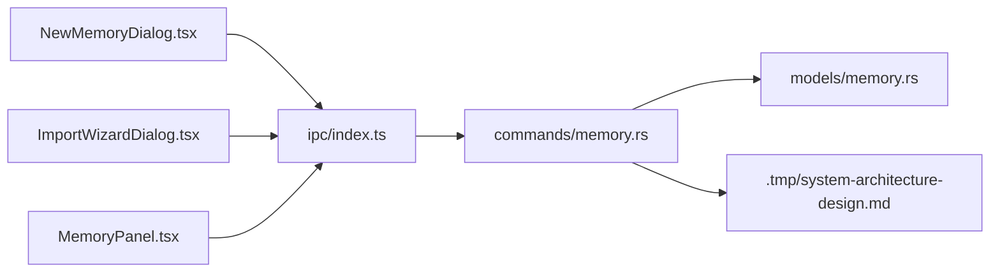

# 智能体记忆模型

<cite>
**本文引用的文件**
- [src/types.ts](file://src/types.ts)
- [src/ipc/index.ts](file://src/ipc/index.ts)
- [src/ipc/stub.ts](file://src/ipc/stub.ts)
- [src-tauri/src/models/memory.rs](file://src-tauri/src/models/memory.rs)
- [src-tauri/src/commands/memory.rs](file://src-tauri/src/commands/memory.rs)
- [.tmp/system-architecture-design.md](file://.tmp/system-architecture-design.md)
- [src/components/dialogs/NewMemoryDialog.tsx](file://src/components/dialogs/NewMemoryDialog.tsx)
- [src/components/dialogs/ImportWizardDialog.tsx](file://src/components/dialogs/ImportWizardDialog.tsx)
- [src/components/sidebar/MemoryPanel.tsx](file://src/components/sidebar/MemoryPanel.tsx)
</cite>

## 目录
1. [简介](#简介)
2. [项目结构](#项目结构)
3. [核心组件](#核心组件)
4. [架构总览](#架构总览)
5. [详细组件分析](#详细组件分析)
6. [依赖关系分析](#依赖关系分析)
7. [性能考量](#性能考量)
8. [故障排查指南](#故障排查指南)
9. [结论](#结论)
10. [附录](#附录)

## 简介
本文件面向NoteForge的智能体记忆模型，提供完整的API与数据结构文档。内容涵盖：
- 智能体与记忆的数据结构定义与用途
- 智能体类型系统与记忆类型的枚举
- 记忆条目的完整字段说明与后端对齐的数据格式
- 智能体管理与记忆检索的API使用示例
- 后端对齐的记忆模型与数据持久化策略
- 生命周期管理与扩展集成指南

## 项目结构
智能体记忆功能由前端IPC层、后端Tauri命令层与SQLite存储共同组成。前端通过IPC调用后端命令，后端执行数据库操作并返回结果。

图表来源
- [src/ipc/index.ts:356-412](file://src/ipc/index.ts#L356-L412)
- [src/ipc/stub.ts:691-767](file://src/ipc/stub.ts#L691-L767)
- [src-tauri/src/commands/memory.rs:183-281](file://src-tauri/src/commands/memory.rs#L183-L281)
- [src-tauri/src/models/memory.rs:1-52](file://src-tauri/src/models/memory.rs#L1-L52)
- [.tmp/system-architecture-design.md:498-542](file://.tmp/system-architecture-design.md#L498-L542)

章节来源
- [src/ipc/index.ts:356-412](file://src/ipc/index.ts#L356-L412)
- [src-tauri/src/commands/memory.rs:183-281](file://src-tauri/src/commands/memory.rs#L183-L281)
- [.tmp/system-architecture-design.md:498-542](file://.tmp/system-architecture-design.md#L498-L542)

## 核心组件
- 智能体类型系统：openclaw、memgpt、custom
- 记忆类型系统：conversation、fact、procedure、context
- 前端数据模型：Agent、MemoryEntry
- 后端模型：MemoryEntry、CreateMemoryRequest、UpdateMemoryRequest、DeleteMemoryRequest、BatchTagMemoriesRequest
- IPC接口：listAgents、list、timeline、create、update、remove、batchTag、batchDelete、importFrom、monitorDirectory

章节来源
- [src/types.ts:241-265](file://src/types.ts#L241-L265)
- [src-tauri/src/models/memory.rs:1-52](file://src-tauri/src/models/memory.rs#L1-L52)
- [src/ipc/index.ts:356-412](file://src/ipc/index.ts#L356-L412)

## 架构总览
前端IPC层封装了所有与后端交互的记忆操作；后端命令层负责SQL查询与更新；模型层定义请求/响应结构；数据库层提供持久化能力。

图表来源
- [src/ipc/index.ts:361-368](file://src/ipc/index.ts#L361-L368)
- [src-tauri/src/commands/memory.rs:36-47](file://src-tauri/src/commands/memory.rs#L36-L47)
- [.tmp/system-architecture-design.md:498-517](file://.tmp/system-architecture-design.md#L498-L517)

## 详细组件分析

### 数据模型与类型系统
- 智能体类型（AgentType）：openclaw、memgpt、custom
- 记忆类型（MemoryType）：conversation、fact、procedure、context
- 前端模型（Agent）包含：id、name、type、memoryCount、lastUpdated、color
- 前端模型（MemoryEntry）包含：id、agentId、agentName、title、content、type、importance、metadata、tags、createdAt、updatedAt
- 后端模型（MemoryEntry）包含：id、agent_id、content、title、type、importance、last_accessed、access_count、created_at、updated_at、metadata、tags
- 请求模型：
  - CreateMemoryRequest：workspace_id、agent_id、content、title、type、tags、metadata
  - UpdateMemoryRequest：memory_id、content、title、metadata
  - DeleteMemoryRequest：memory_id
  - BatchTagMemoriesRequest：memory_ids、tags

章节来源
- [src/types.ts:241-265](file://src/types.ts#L241-L265)
- [src-tauri/src/models/memory.rs:1-52](file://src-tauri/src/models/memory.rs#L1-L52)

### 记忆条目结构详解
- 字段说明
  - id：唯一标识
  - agentId：所属智能体ID
  - agentName：可选，用于显示
  - title：标题，可选
  - content：内容主体
  - type：记忆类型（conversation/fact/procedure/context）
  - importance：重要性评分（0~1）
  - metadata：附加元数据（JSON）
  - tags：标签数组
  - createdAt/updatedAt：时间戳（ISO字符串）

- 后端对齐
  - 后端字段命名采用snake_case，前端统一映射为camelCase
  - 后端返回时会补充tags（通过关联表查询），前端接收后直接使用

章节来源
- [src-tauri/src/models/memory.rs:5-18](file://src-tauri/src/models/memory.rs#L5-L18)
- [src-tauri/src/commands/memory.rs:174-181](file://src-tauri/src/commands/memory.rs#L174-L181)
- [src/ipc/index.ts:361-368](file://src/ipc/index.ts#L361-L368)

### 智能体管理与记忆检索API
- 列出智能体
  - 接口：listAgents
  - 行为：返回智能体列表，并统计每个智能体的记忆数量与最近更新时间
- 列出记忆
  - 接口：list(agentId?, type?)
  - 行为：按agentId与type过滤，按updated_at降序排列
- 时间线检索
  - 接口：timeline(agentId?, startDate?, endDate?)
  - 行为：按时间范围过滤，按created_at降序排列
- 创建记忆
  - 接口：create(agentId, content, type, title?, tags[])
  - 行为：生成新ID，填充默认字段，写入数据库并返回ID
- 更新记忆
  - 接口：update(memoryId, content?, title?, metadata?)
  - 行为：支持部分字段更新
- 删除记忆
  - 接口：remove(memoryId)
  - 行为：删除对应记录
- 批量打标签
  - 接口：batchTag(memoryIds[], tags[])
  - 行为：为多个记忆添加标签
- 批量删除
  - 接口：batchDelete(memoryIds[])
  - 行为：删除多个记忆
- 导入记忆
  - 接口：importFrom(agentId, format, data)
  - 行为：解析输入并批量创建记忆
- 目录监控
  - 接口：monitorDirectory(agentId, path)
  - 行为：返回一个watcherId，便于后续管理

章节来源
- [src/ipc/index.ts:356-412](file://src/ipc/index.ts#L356-L412)
- [src/ipc/stub.ts:691-767](file://src/ipc/stub.ts#L691-L767)
- [src-tauri/src/commands/memory.rs:183-281](file://src-tauri/src/commands/memory.rs#L183-L281)

### 后端对齐的记忆模型与数据流
- 内存模拟层（stub）
  - 提供与后端一致的接口签名与行为，便于开发调试
  - 支持过滤、排序、批量操作与导入
- Tauri命令层
  - list_agent_memories：根据agent_id与type查询，返回MemoryEntry[]
  - get_memory_timeline：按时间范围查询
  - create_memory：插入记录并处理标签
  - update_memory：按需更新content/title/metadata
  - delete_memory：删除记录
  - batch_tag_memories：批量打标签
- 数据库schema
  - memories表包含主键id、外键agent_id、workspace_id、type枚举、importance、时间戳与metadata
  - tags与memory_tags多对多关联表

图表来源
- [.tmp/system-architecture-design.md:498-542](file://.tmp/system-architecture-design.md#L498-L542)

章节来源
- [src-tauri/src/commands/memory.rs:36-47](file://src-tauri/src/commands/memory.rs#L36-L47)
- [src-tauri/src/commands/memory.rs:183-281](file://src-tauri/src/commands/memory.rs#L183-L281)
- [.tmp/system-architecture-design.md:498-542](file://.tmp/system-architecture-design.md#L498-L542)

### API使用示例（步骤说明）
以下示例以“步骤”形式描述，不展示具体代码内容：

- 创建智能体
  - 在前端选择或新增Agent（类型为openclaw/memgpt/custom）
  - 记录Agent的id/name/type/color等信息
- 添加记忆
  - 通过新建记忆对话框选择Agent与类型，填写内容与可选标题
  - 调用create接口提交，得到新记忆ID
- 类型过滤与重要性排序
  - 使用list接口传入agentId与type进行过滤
  - 若需要按重要性排序，可在应用侧对返回结果进行二次排序（前端模型包含importance字段）
- 时间线检索
  - 使用timeline接口传入agentId与日期范围，获取按创建时间倒序的记忆列表
- 批量操作
  - 使用batchTag为多个记忆添加标签
  - 使用batchDelete删除多个记忆
- 导入外部记忆
  - 使用importFrom接口，传入agentId、格式与数据文本
  - 查看返回的导入计数与错误列表

章节来源
- [src/components/dialogs/NewMemoryDialog.tsx:45-76](file://src/components/dialogs/NewMemoryDialog.tsx#L45-L76)
- [src/components/dialogs/ImportWizardDialog.tsx:14-52](file://src/components/dialogs/ImportWizardDialog.tsx#L14-L52)
- [src/ipc/index.ts:356-412](file://src/ipc/index.ts#L356-L412)
- [src-tauri/src/commands/memory.rs:183-281](file://src-tauri/src/commands/memory.rs#L183-L281)

### 生命周期管理与持久化策略
- 生命周期
  - 创建：生成唯一ID，设置创建/更新时间为当前时间
  - 更新：支持content、title、metadata的增量更新
  - 删除：级联删除关联标签
- 持久化
  - SQLite表memories保存核心字段
  - tags与memory_tags维护标签体系
  - 索引：按agent_id、type、importance建立索引，优化查询性能

章节来源
- [.tmp/system-architecture-design.md:498-542](file://.tmp/system-architecture-design.md#L498-L542)
- [src-tauri/src/commands/memory.rs:183-281](file://src-tauri/src/commands/memory.rs#L183-L281)

## 依赖关系分析
- 前端IPC依赖后端命令层
- 后端命令层依赖数据库与标签仓库
- 前端UI组件通过IPC调用实现用户交互

图表来源
- [src/components/dialogs/NewMemoryDialog.tsx:45-76](file://src/components/dialogs/NewMemoryDialog.tsx#L45-L76)
- [src/components/dialogs/ImportWizardDialog.tsx:14-52](file://src/components/dialogs/ImportWizardDialog.tsx#L14-L52)
- [src/components/sidebar/MemoryPanel.tsx:254-269](file://src/components/sidebar/MemoryPanel.tsx#L254-L269)
- [src/ipc/index.ts:356-412](file://src/ipc/index.ts#L356-L412)
- [src-tauri/src/commands/memory.rs:183-281](file://src-tauri/src/commands/memory.rs#L183-L281)
- [src-tauri/src/models/memory.rs:1-52](file://src-tauri/src/models/memory.rs#L1-L52)
- [.tmp/system-architecture-design.md:498-542](file://.tmp/system-architecture-design.md#L498-L542)

章节来源
- [src/ipc/index.ts:356-412](file://src/ipc/index.ts#L356-L412)
- [src-tauri/src/commands/memory.rs:183-281](file://src-tauri/src/commands/memory.rs#L183-L281)

## 性能考量
- 查询优化
  - 使用索引：agent_id、type、importance
  - 过滤优先：先按agent_id与type过滤，再按时间范围筛选
- 写入优化
  - 批量标签：使用batch_tag_memories减少多次往返
  - 部分更新：仅更新变更字段，避免全量覆盖
- 内存模拟层
  - stub.ts在开发阶段提供快速迭代，生产环境应切换到真实后端

[本节为通用建议，无需特定文件来源]

## 故障排查指南
- 错误码
  - MEMORY_NOT_FOUND：尝试更新或删除不存在的记忆
- 常见问题
  - 记忆未显示：检查agentId是否正确、是否被类型过滤
  - 标签未生效：确认batchTag调用成功且标签已存在
  - 导入失败：检查format与data格式，查看返回的错误列表
- 调试建议
  - 在前端打印IPC调用参数与返回值
  - 在后端查看SQL执行日志与异常堆栈

章节来源
- [src/ipc/stub.ts:754-758](file://src/ipc/stub.ts#L754-L758)
- [src/ipc/stub.ts:763-767](file://src/ipc/stub.ts#L763-L767)
- [src-tauri/src/commands/memory.rs:183-213](file://src-tauri/src/commands/memory.rs#L183-L213)

## 结论
NoteForge的智能体记忆模型通过清晰的类型系统、前后端对齐的数据模型与完善的IPC接口，实现了从创建、检索到导入与批量管理的完整闭环。结合SQLite索引与批处理能力，可在保证易用性的同时兼顾性能与可扩展性。

[本节为总结，无需特定文件来源]

## 附录

### API参考速查
- 列出智能体：listAgents
- 列出记忆：list(agentId?, type?)
- 时间线：timeline(agentId?, startDate?, endDate?)
- 创建记忆：create(agentId, content, type, title?, tags[])
- 更新记忆：update(memoryId, content?, title?, metadata?)
- 删除记忆：remove(memoryId)
- 批量打标签：batchTag(memoryIds[], tags[])
- 批量删除：batchDelete(memoryIds[])
- 导入记忆：importFrom(agentId, format, data)
- 目录监控：monitorDirectory(agentId, path)

章节来源
- [src/ipc/index.ts:356-412](file://src/ipc/index.ts#L356-L412)