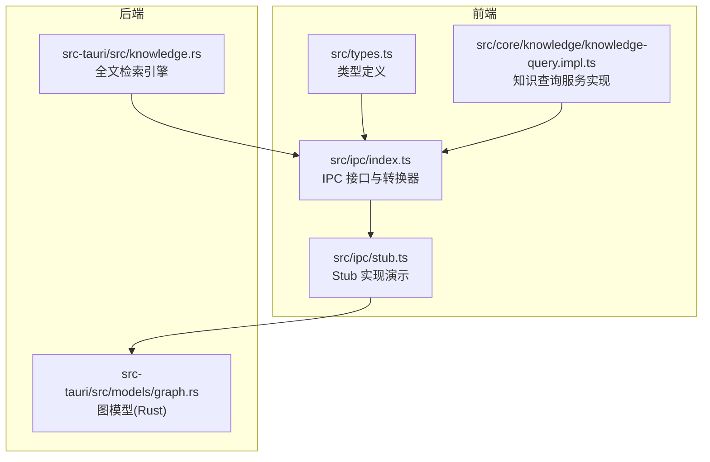
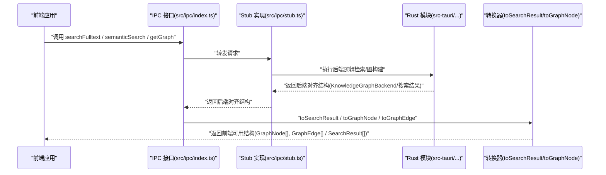
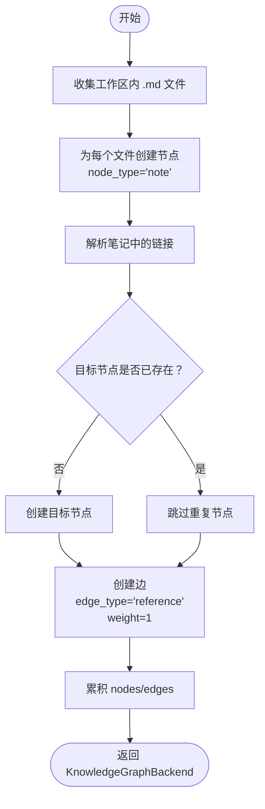
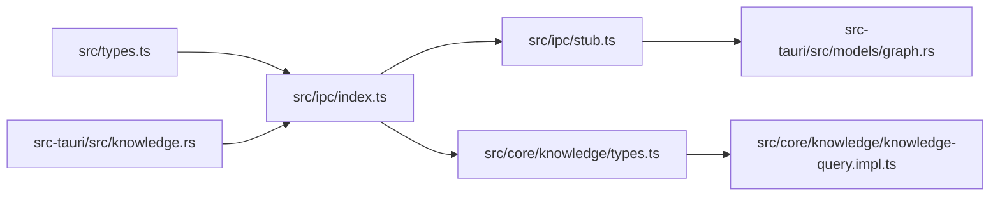

# 知识图谱模型

<cite>
**本文引用的文件**
- [src/types.ts](file://src/types.ts)
- [src/ipc/index.ts](file://src/ipc/index.ts)
- [src/ipc/stub.ts](file://src/ipc/stub.ts)
- [src/core/knowledge/types.ts](file://src/core/knowledge/types.ts)
- [src/core/knowledge/knowledge-query.impl.ts](file://src/core/knowledge/knowledge-query.impl.ts)
- [src-tauri/src/models/graph.rs](file://src-tauri/src/models/graph.rs)
- [src-tauri/src/knowledge.rs](file://src-tauri/src/knowledge.rs)
- [.tmp/system-architecture-design.md](file://.tmp/system-architecture-design.md)
</cite>

## 目录
1. [简介](#简介)
2. [项目结构](#项目结构)
3. [核心组件](#核心组件)
4. [架构总览](#架构总览)
5. [详细组件分析](#详细组件分析)
6. [依赖分析](#依赖分析)
7. [性能考虑](#性能考虑)
8. [故障排查指南](#故障排查指南)
9. [结论](#结论)
10. [附录：API 使用示例与扩展指南](#附录api-使用示例与扩展指南)

## 简介
本文件为 NoteForge 的知识图谱模型提供全面的 API 文档，覆盖前端 TypeScript 类型定义、IPC 层转换器、后端 Rust 模型以及检索与图构建流程。重点说明以下数据结构与概念：
- 图节点 GraphNode 与后端 GraphNodeBackend 的设计与映射
- 图边 GraphEdge 与后端 GraphEdgeBackend 的设计与映射
- 知识图谱 KnowledgeGraph 与后端 KnowledgeGraphBackend 的结构
- 搜索结果 SearchResult/SemanticResult 的字段与来源
- 节点类型系统（note、memory、concept、agent）与边关系模型（reference、embed、tag、semantic）
- 权重与属性的承载方式
- 前后端对齐的数据格式转换与扩展建议

## 项目结构
知识图谱相关代码主要分布在以下位置：
- 前端类型与 IPC：src/types.ts、src/ipc/index.ts、src/ipc/stub.ts
- 核心知识服务：src/core/knowledge/types.ts、src/core/knowledge/knowledge-query.impl.ts
- 后端模型与检索：src-tauri/src/models/graph.rs、src-tauri/src/knowledge.rs
- 架构与检索路径参考：.tmp/system-architecture-design.md

图表来源
- [src/types.ts:161-204](file://src/types.ts#L161-L204)
- [src/ipc/index.ts:297-330](file://src/ipc/index.ts#L297-L330)
- [src/ipc/stub.ts:538-588](file://src/ipc/stub.ts#L538-L588)
- [src-tauri/src/models/graph.rs:1-35](file://src-tauri/src/models/graph.rs#L1-L35)
- [src-tauri/src/knowledge.rs:1-75](file://src-tauri/src/knowledge.rs#L1-L75)

章节来源
- [src/types.ts:139-204](file://src/types.ts#L139-L204)
- [src/ipc/index.ts:297-330](file://src/ipc/index.ts#L297-L330)
- [src/ipc/stub.ts:538-588](file://src/ipc/stub.ts#L538-L588)
- [src-tauri/src/models/graph.rs:1-35](file://src-tauri/src/models/graph.rs#L1-L35)
- [src-tauri/src/knowledge.rs:1-75](file://src-tauri/src/knowledge.rs#L1-L75)

## 核心组件
本节聚焦于知识图谱与检索的核心数据结构及前后端对齐的模型。

- GraphNode（前端）：包含 id、label、type、referenceId、degree 等字段，用于前端渲染与交互。
- GraphEdge（前端）：包含 id、source、target、type、weight 等字段，描述节点间关系。
- KnowledgeGraph（前端）：由 nodes 和 edges 组成，表示完整的知识图谱。
- GraphNodeBackend/GraphEdgeBackend/KnowledgeGraphBackend（后端对齐）：与 Rust 结构体保持命名一致，便于序列化/反序列化。
- SearchResult/SemanticResult：搜索结果结构，包含 filePath、title、snippet、score 等字段；SemanticResult 扩展 similarity 字段。
- 搜索后端结果 SearchBackendResult：后端返回的原始结构，字段为 snake_case。

章节来源
- [src/types.ts:161-204](file://src/types.ts#L161-L204)
- [src/types.ts:141-159](file://src/types.ts#L141-L159)

## 架构总览
下图展示了从前端调用到后端执行再到 IPC 返回并进行数据转换的整体流程。

图表来源
- [src/ipc/index.ts:297-330](file://src/ipc/index.ts#L297-L330)
- [src/ipc/stub.ts:538-588](file://src/ipc/stub.ts#L538-L588)
- [src/types.ts:139-204](file://src/types.ts#L139-L204)

## 详细组件分析

### 数据结构与字段说明
- GraphNode（前端）
  - id：节点唯一标识
  - label：显示标签
  - type：节点类型，枚举值包括 note、memory、concept、agent
  - referenceId：引用 ID，通常与物理路径或实体标识对应
  - degree：可选，表示度数（可用于可视化布局或分析）
- GraphEdge（前端）
  - id：边唯一标识
  - source/target：起止节点 ID
  - type：边类型，枚举值包括 reference、embed、tag、semantic
  - weight：可选，表示关系强度或权重
- KnowledgeGraph（前端）
  - nodes：节点数组
  - edges：边数组
- GraphNodeBackend/GraphEdgeBackend/KnowledgeGraphBackend（后端对齐）
  - 字段命名采用 snake_case，与 Rust 结构体一致，便于 JSON 序列化
  - properties/权重等以通用对象承载，前端通过转换器映射到前端字段
- SearchResult/SemanticResult
  - filePath/title/snippet/score：来自后端 SearchBackendResult 的映射
  - SemanticResult 额外包含 similarity 字段，用于语义相似度排序
- SearchBackendResult（后端）
  - file_path/title/content/score：后端检索返回的原始字段

章节来源
- [src/types.ts:161-204](file://src/types.ts#L161-L204)
- [src/types.ts:141-159](file://src/types.ts#L141-L159)

### 节点类型系统
- note：笔记节点，通常对应工作区内的 Markdown 文件
- memory：记忆节点，用于存储短期或长期记忆内容
- concept：概念节点，用于抽象知识单元
- agent：智能体节点，用于标识与交互相关的代理实体

前端 GraphNode.type 限定为上述枚举值之一；后端 GraphNodeBackend.node_type 以字符串形式承载，前端转换器将其映射到前端枚举。

章节来源
- [src/types.ts:161-167](file://src/types.ts#L161-L167)
- [src-tauri/src/models/graph.rs:5-10](file://src-tauri/src/models/graph.rs#L5-L10)

### 边关系模型
- reference：引用关系，常用于笔记间的链接
- embed：嵌入关系，可能用于向量化嵌入或内容嵌入
- tag：标签关系，连接节点与标签
- semantic：语义关系，基于向量相似度或语义分析建立

前端 GraphEdge.type 限定为上述枚举值之一；后端 GraphEdgeBackend.edge_type 以字符串承载，前端转换器映射到前端类型。

权重 weight 在前端为可选字段，后端以 f64(number) 表示，前端转换器将其映射到前端 weight。

章节来源
- [src/types.ts:169-175](file://src/types.ts#L169-L175)
- [src-tauri/src/models/graph.rs:14-21](file://src-tauri/src/models/graph.rs#L14-L21)

### 搜索结果数据结构
- SearchResult
  - filePath：文件路径
  - title：标题
  - snippet：片段（来自后端 content）
  - score：分数
  - tags：可选标签列表
- SemanticResult
  - 继承 SearchResult，并增加 similarity 字段
- SearchBackendResult（后端）
  - file_path/title/content/score：后端检索返回的原始字段

前端通过 toSearchResult 将后端结果映射为 SearchResult；toSemanticResult 在此基础上补充 similarity。

章节来源
- [src/types.ts:141-159](file://src/types.ts#L141-L159)
- [src/ipc/index.ts:138-149](file://src/ipc/index.ts#L138-L149)

### 前后端对齐的数据格式转换
- GraphNodeBackend → GraphNode
  - id → id
  - node_type → type（前端枚举）
  - reference_id → referenceId
  - properties.label → label
  - properties.degree → degree
- GraphEdgeBackend → GraphEdge
  - id → id
  - source_node_id → source
  - target_node_id → target
  - edge_type → type（前端枚举）
  - weight → weight
- SearchBackendResult → SearchResult
  - file_path → filePath
  - title → title
  - content → snippet
  - score → score

章节来源
- [src/ipc/index.ts:151-175](file://src/ipc/index.ts#L151-L175)
- [src/types.ts:182-204](file://src/types.ts#L182-L204)

### 知识图谱构建与查询流程
- 构建流程（Stub 示例）
  - 收集工作区内所有 .md 文件作为节点
  - 解析每个笔记中的链接，生成目标节点（去重）
  - 为每条链接创建一条 type=reference 的边，weight=1
  - 返回 KnowledgeGraphBackend，前端通过 toGraphNode/toGraphEdge 转换
- 查询流程（Stub 示例）
  - 提供 getKnowledgeGraph 接口，返回 nodes/edges 数组
  - 前端调用时自动完成转换

图表来源
- [src/ipc/stub.ts:547-588](file://src/ipc/stub.ts#L547-L588)

章节来源
- [src/ipc/stub.ts:547-588](file://src/ipc/stub.ts#L547-L588)
- [src/ipc/index.ts:323-330](file://src/ipc/index.ts#L323-L330)

### 检索与全文检索
- 全文检索（fulltext）
  - 后端使用 FTS5 虚拟表进行关键词检索
  - 支持 unicode61 分词与去重音，适合中英文混合文本
- 语义检索（semantic）
  - 当前 Stub 实现返回与全文检索相同的结果（后续可替换为向量相似度）
- 检索路径对比（参考架构文档）
  - fulltext：FTS5 索引，关键词精确匹配，支持中文分词
  - semantic：向量嵌入，语义相似性，语言无关
  - hybrid：组合策略（架构文档建议）

章节来源
- [src-tauri/src/knowledge.rs:9-75](file://src-tauri/src/knowledge.rs#L9-L75)
- [.tmp/system-architecture-design.md:905-942](file://.tmp/system-architecture-design.md#L905-L942)

## 依赖分析
- 前端类型依赖
  - src/types.ts 定义了所有前端使用的接口与后端对齐结构
  - src/ipc/index.ts 依赖 src/types.ts 的接口，并提供转换器函数
  - src/core/knowledge/knowledge-query.impl.ts 依赖 IPC 接口，间接使用前端类型
- 后端模型依赖
  - src-tauri/src/models/graph.rs 定义了 Rust 端的图模型
  - src-tauri/src/knowledge.rs 定义了检索引擎与 FTS5 表结构
- Stub 与 IPC
  - src/ipc/stub.ts 提供演示实现，返回固定结构，便于前端联调
  - src/ipc/index.ts 将后端对齐结构转换为前端可用结构

图表来源
- [src/types.ts:139-204](file://src/types.ts#L139-L204)
- [src/ipc/index.ts:297-330](file://src/ipc/index.ts#L297-L330)
- [src/ipc/stub.ts:538-588](file://src/ipc/stub.ts#L538-L588)
- [src-tauri/src/models/graph.rs:1-35](file://src-tauri/src/models/graph.rs#L1-L35)
- [src-tauri/src/knowledge.rs:1-75](file://src-tauri/src/knowledge.rs#L1-L75)

章节来源
- [src/types.ts:139-204](file://src/types.ts#L139-L204)
- [src/ipc/index.ts:297-330](file://src/ipc/index.ts#L297-L330)
- [src/ipc/stub.ts:538-588](file://src/ipc/stub.ts#L538-L588)
- [src-tauri/src/models/graph.rs:1-35](file://src-tauri/src/models/graph.rs#L1-L35)
- [src-tauri/src/knowledge.rs:1-75](file://src-tauri/src/knowledge.rs#L1-L75)

## 性能考虑
- 检索性能
  - FTS5 使用 unicode61 分词器，适合中英文混合文本；在大规模文档上建议合理设置 limit
  - 语义检索可结合向量索引（如后续实现），减少全库扫描
- 图构建性能
  - Stub 示例中对每个笔记解析链接并去重，复杂度与笔记数量和链接密度相关
  - 建议在后台任务中增量更新，避免阻塞主线程
- 前端渲染
  - 大图建议采用分页加载、虚拟化与层级折叠策略
  - 权重与标签可用于动态着色与布局优化

## 故障排查指南
- 搜索无结果
  - 检查工作区是否已索引（reindexAll 或 indexWorkspace）
  - 确认查询关键字是否被正确分词（中文建议使用完整词汇）
- 图为空或不完整
  - 确认 Stub 实现中是否正确解析链接与去重
  - 检查节点与边的类型映射是否正确
- 类型不匹配
  - 确保后端返回的 snake_case 字段与前端转换器一致
  - 检查枚举值（type/edge_type）是否在前端类型定义范围内

章节来源
- [src/core/knowledge/knowledge-query.impl.ts:136-144](file://src/core/knowledge/knowledge-query.impl.ts#L136-L144)
- [src/ipc/index.ts:138-149](file://src/ipc/index.ts#L138-L149)

## 结论
NoteForge 的知识图谱模型通过前后端对齐的数据结构与清晰的转换层，实现了从检索到图构建的完整链路。前端类型定义与后端模型保持一致，辅以 IPC 转换器，确保了扩展与维护的便利性。未来可在语义检索、图算法与可视化方面进一步增强。

## 附录：API 使用示例与扩展指南

### API 使用示例（步骤说明）
- 获取全文检索结果
  - 调用：searchFulltext(workspaceId, query, limit)
  - 返回：SearchResult[]
  - 字段：filePath/title/snippet/score/tags（可选）
- 获取语义检索结果
  - 调用：semanticSearch(workspaceId, query, limit)
  - 返回：SemanticResult[]（含 similarity）
- 获取知识图谱
  - 调用：getGraph(workspaceId)
  - 返回：{ nodes: GraphNode[], edges: GraphEdge[] }
  - 节点类型：note/memory/concept/agent
  - 边类型：reference/embed/tag/semantic
  - 权重：可选，用于关系强度展示

章节来源
- [src/ipc/index.ts:307-330](file://src/ipc/index.ts#L307-L330)
- [src/types.ts:141-175](file://src/types.ts#L141-L175)

### 扩展与定制指南
- 新增节点类型
  - 在前端 GraphNode.type 中新增枚举值
  - 在后端 GraphNodeBackend.node_type 中支持新字符串值
  - 在转换器中完善映射逻辑
- 新增边类型
  - 在前端 GraphEdge.type 中新增枚举值
  - 在后端 GraphEdgeBackend.edge_type 中支持新字符串值
  - 在图构建 Stub 中生成对应边
- 自定义权重
  - 在后端 GraphEdgeBackend.weight 中设置数值
  - 在前端 GraphEdge.weight 中消费
- 搜索结果扩展
  - 在 SearchBackendResult 中新增字段
  - 在前端 SearchResult/SemanticResult 中映射
- 检索策略切换
  - 替换 Stub 中的 semanticSearch 实现，接入向量检索
  - 在架构文档基础上选择 fulltext/semantic/hybrid 策略

章节来源
- [src/types.ts:161-204](file://src/types.ts#L161-L204)
- [src-tauri/src/models/graph.rs:1-35](file://src-tauri/src/models/graph.rs#L1-L35)
- [.tmp/system-architecture-design.md:905-942](file://.tmp/system-architecture-design.md#L905-L942)