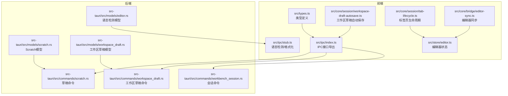
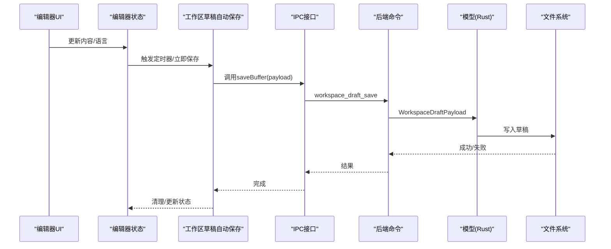
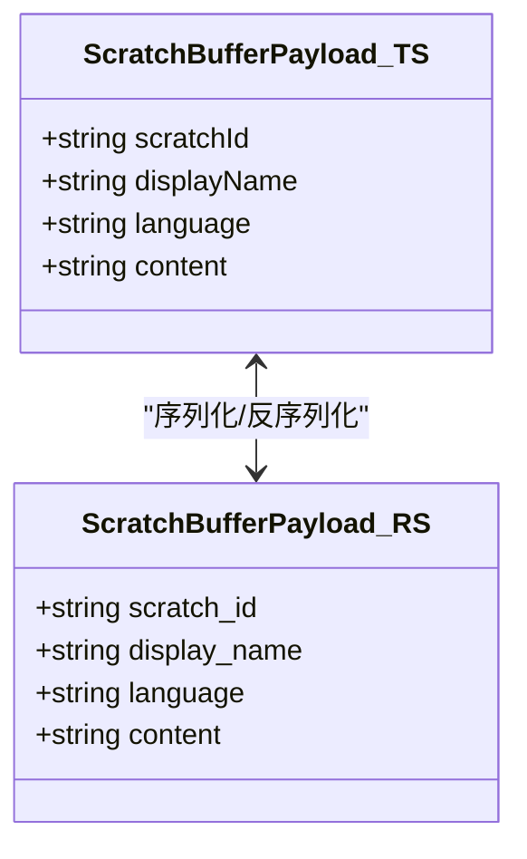
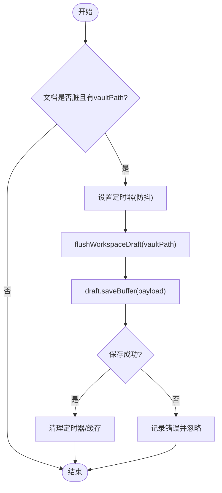
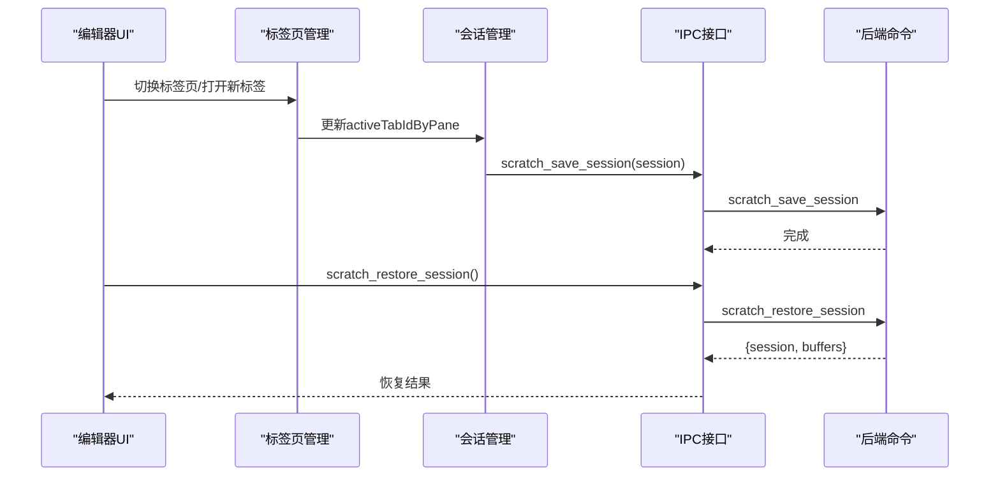
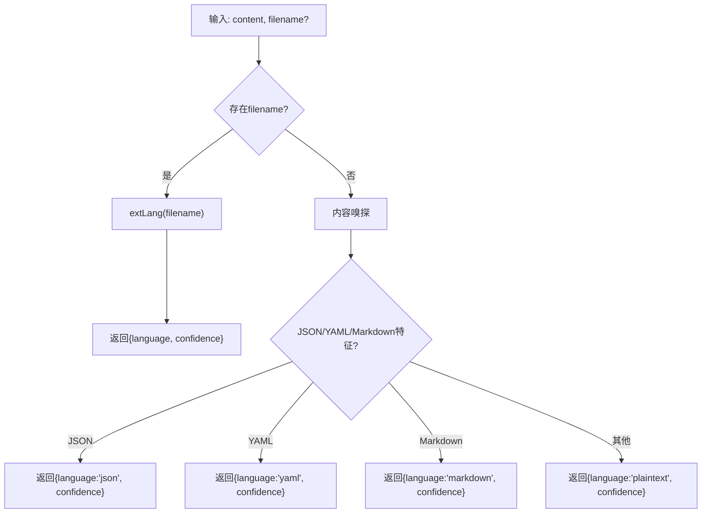
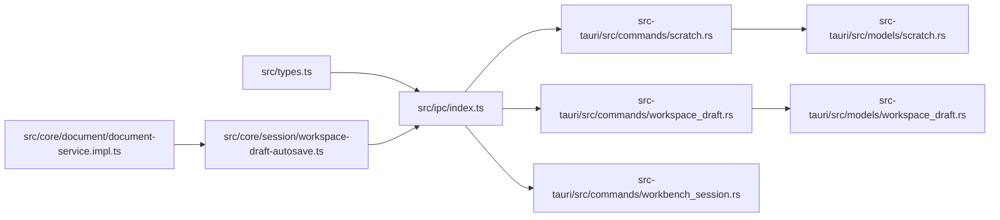

# 编辑器模型

<cite>
**本文引用的文件**
- [src/types.ts](file://src/types.ts)
- [src/ipc/index.ts](file://src/ipc/index.ts)
- [src/ipc/stub.ts](file://src/ipc/stub.ts)
- [src/core/session/workspace-draft-autosave.ts](file://src/core/session/workspace-draft-autosave.ts)
- [src/core/session/tab-lifecycle.ts](file://src/core/session/tab-lifecycle.ts)
- [src/core/bridge/editor-sync.ts](file://src/core/bridge/editor-sync.ts)
- [src/core/document/document-service.impl.ts](file://src/core/document/document-service.impl.ts)
- [src/core/editor/types.ts](file://src/core/editor/types.ts)
- [src/store/editor.ts](file://src/store/editor.ts)
- [src-tauri/src/models/scratch.rs](file://src-tauri/src/models/scratch.rs)
- [src-tauri/src/models/workspace_draft.rs](file://src-tauri/src/models/workspace_draft.rs)
- [src-tauri/src/models/editor.rs](file://src-tauri/src/models/editor.rs)
- [src-tauri/src/commands/scratch.rs](file://src-tauri/src/commands/scratch.rs)
- [src-tauri/src/commands/workspace_draft.rs](file://src-tauri/src/commands/workspace_draft.rs)
- [src-tauri/src/commands/workbench_session.rs](file://src-tauri/src/commands/workbench_session.rs)
</cite>

## 目录
1. [简介](#简介)
2. [项目结构](#项目结构)
3. [核心组件](#核心组件)
4. [架构总览](#架构总览)
5. [详细组件分析](#详细组件分析)
6. [依赖关系分析](#依赖关系分析)
7. [性能考虑](#性能考虑)
8. [故障排查指南](#故障排查指南)
9. [结论](#结论)
10. [附录](#附录)

## 简介
本文件面向NoteForge编辑器模型的开发者与集成者，系统化梳理草稿缓冲区、工作区草稿、编辑器会话与标签页状态管理的数据结构与API行为，并提供扩展与性能优化建议。重点覆盖以下主题：
- 草稿缓冲区设计：scratchId、displayName、language、content等字段职责与持久化策略
- 工作区草稿自动保存：vaultPath、content、language的存储与清理流程
- 编辑器会话与标签页：会话恢复、标签页切换、预览模式管理
- 语言检测与多语言支持：SupportedLanguage枚举与LanguageDetection结构
- 扩展指南与性能优化建议

## 项目结构
编辑器模型由前端TypeScript类型与后端Rust模型构成，通过IPC桥接调用实现跨层交互；同时包含会话与草稿的自动保存逻辑。

图表来源
- [src/types.ts:76-137](file://src/types.ts#L76-L137)
- [src/ipc/index.ts:240-257](file://src/ipc/index.ts#L240-L257)
- [src-tauri/src/models/scratch.rs:1-38](file://src-tauri/src/models/scratch.rs#L1-L38)
- [src-tauri/src/models/workspace_draft.rs:1-9](file://src-tauri/src/models/workspace_draft.rs#L1-L9)
- [src-tauri/src/models/editor.rs:1-23](file://src-tauri/src/models/editor.rs#L1-L23)

章节来源
- [src/types.ts:76-137](file://src/types.ts#L76-L137)
- [src/ipc/index.ts:240-257](file://src/ipc/index.ts#L240-L257)

## 核心组件
- 草稿缓冲区数据结构
  - 前端类型：ScratchBufferPayload（包含scratchId、displayName、language、content）
  - 后端模型：ScratchBufferPayload（字段名采用snake_case）
- 工作区草稿数据结构
  - 前端类型：WorkspaceDraftPayload（包含vaultPath、content、language）
  - 后端模型：WorkspaceDraftPayload（字段名采用snake_case）
- 编辑器会话与标签页
  - ScratchSessionTab：tabId、scratchId、displayName、language、paneId、previewMode
  - ScratchSessionPayload：panes、activePaneId、activeTabIdByPane、tabs
- 语言检测与多语言支持
  - LanguageDetection：language、confidence
  - SupportedLanguage：多种编程语言与文本类型的联合类型

章节来源
- [src/types.ts:78-111](file://src/types.ts#L78-L111)
- [src-tauri/src/models/scratch.rs:6-31](file://src-tauri/src/models/scratch.rs#L6-L31)
- [src-tauri/src/models/workspace_draft.rs:5-9](file://src-tauri/src/models/workspace_draft.rs#L5-L9)
- [src-tauri/src/models/editor.rs:5-8](file://src-tauri/src/models/editor.rs#L5-L8)
- [src/types.ts:115-137](file://src/types.ts#L115-L137)

## 架构总览
编辑器模型围绕“草稿缓冲区—工作区草稿—会话与标签页—语言检测”形成闭环，前端负责UI与状态管理，后端负责持久化与语言能力，IPC作为桥梁协调二者。

图表来源
- [src/core/session/workspace-draft-autosave.ts:37-55](file://src/core/session/workspace-draft-autosave.ts#L37-L55)
- [src/ipc/index.ts:240-257](file://src/ipc/index.ts#L240-L257)
- [src-tauri/src/commands/workspace_draft.rs](file://src-tauri/src/commands/workspace_draft.rs)
- [src-tauri/src/models/workspace_draft.rs:5-9](file://src-tauri/src/models/workspace_draft.rs#L5-L9)

## 详细组件分析

### 草稿缓冲区设计与API
- 字段职责
  - scratchId：草稿唯一标识，用于检索与删除
  - displayName：显示名称，便于用户识别
  - language：语言标识，用于语法高亮与格式化
  - content：草稿内容，实时更新
- 前端API
  - 保存：scratch.saveBuffer(payload)
  - 加载：scratch.loadBuffer(scratchId)
  - 删除：scratch.deleteBuffer(scratchId)
- 后端模型
  - Rust侧对应结构体字段采用snake_case命名，序列化为camelCase传递给前端

图表来源
- [src/types.ts:78-83](file://src/types.ts#L78-L83)
- [src-tauri/src/models/scratch.rs:6-11](file://src-tauri/src/models/scratch.rs#L6-L11)

章节来源
- [src/types.ts:78-83](file://src/types.ts#L78-L83)
- [src/ipc/index.ts:244-251](file://src/ipc/index.ts#L244-L251)
- [src-tauri/src/models/scratch.rs:6-11](file://src-tauri/src/models/scratch.rs#L6-L11)

### 工作区草稿自动保存机制
- 数据结构
  - vaultPath：工作区文件路径，作为草稿键
  - content：当前内容
  - language：语言标识
- 存储策略
  - 定时触发：对脏文档进行去重批量保存
  - 立即刷新：确保在关闭或切换前完成写入
  - 清理：成功写入后清除定时器；保存失败记录日志
- 关联操作
  - 保存：draft.saveBuffer(payload)
  - 刷新：ensureWorkspaceDraftFlushed(vaultPath)
  - 全量刷新：flushAllDirtyWorkspaceDrafts()
  - 删除：deleteWorkspaceDraft(vaultPath)
  - 取消：cancelPendingWorkspaceDraftAutosave()

图表来源
- [src/core/session/workspace-draft-autosave.ts:37-100](file://src/core/session/workspace-draft-autosave.ts#L37-L100)

章节来源
- [src/core/session/workspace-draft-autosave.ts:37-100](file://src/core/session/workspace-draft-autosave.ts#L37-L100)
- [src/types.ts:86-90](file://src/types.ts#L86-L90)
- [src-tauri/src/models/workspace_draft.rs:5-9](file://src-tauri/src/models/workspace_draft.rs#L5-L9)

### 编辑器会话与标签页状态管理
- 会话数据结构
  - panes：面板ID列表
  - activePaneId：当前激活面板
  - activeTabIdByPane：按面板映射的激活标签页
  - tabs：标签页集合，包含tabId、scratchId、displayName、language、paneId、previewMode
- 会话API
  - 保存：scratch.saveSession(session)
  - 恢复：scratch.restoreSession() → 返回session与buffers
  - 清空：scratch.clearSession()
- 标签页生命周期
  - 通过tab-lifecycle模块管理标签页打开、切换、关闭事件
  - 预览模式：previewMode可选字符串，用于控制渲染模式

图表来源
- [src/types.ts:101-111](file://src/types.ts#L101-L111)
- [src/ipc/index.ts:252-256](file://src/ipc/index.ts#L252-L256)
- [src-tauri/src/models/scratch.rs:26-31](file://src-tauri/src/models/scratch.rs#L26-L31)

章节来源
- [src/types.ts:92-111](file://src/types.ts#L92-L111)
- [src/ipc/index.ts:252-256](file://src/ipc/index.ts#L252-L256)
- [src/core/session/tab-lifecycle.ts](file://src/core/session/tab-lifecycle.ts)

### 语言检测与多语言支持
- 语言检测
  - 支持基于文件扩展名与内容特征的启发式检测
  - 返回language与confidence，前端据此选择语法高亮与格式化
- 多语言支持
  - SupportedLanguage联合类型涵盖markdown、json、yaml、多种编程语言与plaintext
- 与编辑器集成
  - detectLanguage(content, filename?)返回LanguageDetection
  - formatCode(content, language)返回格式化后的字符串

图表来源
- [src/ipc/stub.ts:377-390](file://src/ipc/stub.ts#L377-L390)
- [src/types.ts:120-137](file://src/types.ts#L120-L137)
- [src-tauri/src/models/editor.rs:5-8](file://src-tauri/src/models/editor.rs#L5-L8)

章节来源
- [src/ipc/stub.ts:377-390](file://src/ipc/stub.ts#L377-L390)
- [src/types.ts:115-137](file://src/types.ts#L115-L137)

### 编辑器同步与状态桥接
- 文档到标签同步
  - 将文档元信息（如displayName、language、paneId、surfaceMode）推送到绑定的编辑器标签
  - 控制源码/写作/阅读模式的切换
- 编辑器状态
  - EditorTabKind：scratch/workspace
  - EditorTab：包含id、kind、scratchId、displayName、language、bufferRevision、savedRevision、paneId、surfaceMode、openedInSplit等

章节来源
- [src/core/bridge/editor-sync.ts:50-69](file://src/core/bridge/editor-sync.ts#L50-L69)
- [src/store/editor.ts:30-34](file://src/store/editor.ts#L30-L34)

## 依赖关系分析
- 类型一致性
  - 前端types.ts中的接口与后端models/*.rs结构体一一对应，字段命名在序列化时转换为camelCase
- IPC调用链
  - 前端调用src/ipc/index.ts导出的方法，经由Tauri命令层转发至对应Rust命令处理
- 自动保存依赖
  - 工作区草稿自动保存依赖document-service的脏状态判断与vaultPath

图表来源
- [src/types.ts:76-137](file://src/types.ts#L76-L137)
- [src/ipc/index.ts:240-257](file://src/ipc/index.ts#L240-L257)
- [src-tauri/src/commands/scratch.rs](file://src-tauri/src/commands/scratch.rs)
- [src-tauri/src/commands/workspace_draft.rs](file://src-tauri/src/commands/workspace_draft.rs)
- [src-tauri/src/commands/workbench_session.rs](file://src-tauri/src/commands/workbench_session.rs)
- [src-tauri/src/models/scratch.rs:1-38](file://src-tauri/src/models/scratch.rs#L1-L38)
- [src-tauri/src/models/workspace_draft.rs:1-9](file://src-tauri/src/models/workspace_draft.rs#L1-L9)

章节来源
- [src/core/session/workspace-draft-autosave.ts:37-100](file://src/core/session/workspace-draft-autosave.ts#L37-L100)
- [src/core/document/document-service.impl.ts:327-367](file://src/core/document/document-service.impl.ts#L327-L367)

## 性能考虑
- 防抖与批处理
  - 对工作区草稿保存采用定时器防抖，避免频繁IO；对多个脏文档进行去重批量保存
- 异常隔离
  - 保存失败仅记录错误日志，不影响主流程；及时清理定时器与in-flight状态
- 语言检测开销
  - 检测函数包含固定延迟与简单嗅探逻辑，避免昂贵计算；对常见格式快速判定
- UI同步
  - 文档变更只在存在对应标签时推送，减少无效更新

## 故障排查指南
- 工作区草稿未保存
  - 检查文档是否标记为脏且具备vaultPath
  - 确认flushAllDirtyWorkspaceDrafts()已执行或ensureWorkspaceDraftFlushed()被调用
  - 查看控制台错误日志定位保存异常
- 会话恢复为空
  - 确认scratch_restore_session()返回的session/buffers是否为空
  - 检查后端会话存储状态
- 语言检测不准确
  - 若仅传入content，检查内容特征是否符合预期
  - 优先提供filename以利用扩展名检测

章节来源
- [src/core/session/workspace-draft-autosave.ts:64-100](file://src/core/session/workspace-draft-autosave.ts#L64-L100)
- [src/ipc/stub.ts:377-390](file://src/ipc/stub.ts#L377-L390)

## 结论
NoteForge编辑器模型通过清晰的数据结构与稳健的自动保存机制，实现了草稿、会话与标签页状态的可靠管理；结合语言检测与格式化能力，为多语言内容创作提供了良好支撑。遵循本文的扩展与优化建议，可在保证性能的同时提升稳定性与用户体验。

## 附录
- 常用API速查
  - 草稿缓冲区：saveBuffer、loadBuffer、deleteBuffer
  - 会话：saveSession、restoreSession、clearSession
  - 工作区草稿：flushAllDirtyWorkspaceDrafts、ensureWorkspaceDraftFlushed、deleteWorkspaceDraft
  - 语言检测：detectLanguage、formatCode
- 扩展建议
  - 新增语言类型：在SupportedLanguage中添加枚举值，并完善detectLanguage分支
  - 自定义预览模式：在ScratchSessionTab.previewMode中扩展模式标识
  - 会话持久化：在后端命令中增加更细粒度的会话分组与版本控制