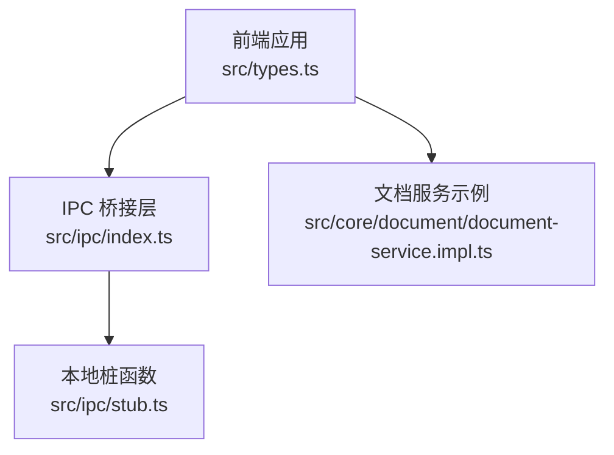
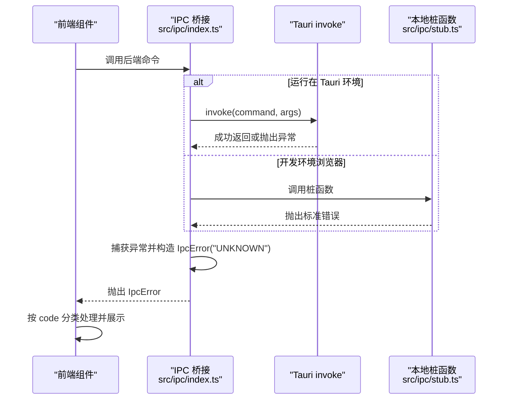
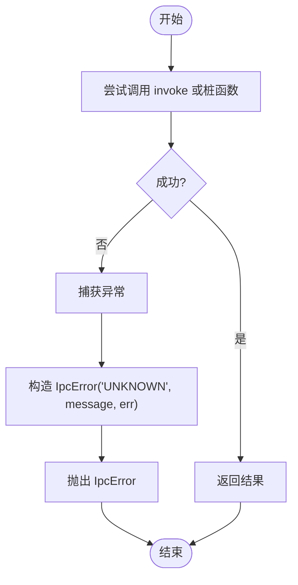
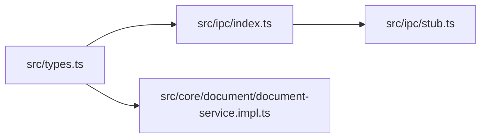

# 错误模型

<cite>
**本文档引用的文件**
- [src/types.ts](file://src/types.ts)
- [src/ipc/index.ts](file://src/ipc/index.ts)
- [src/ipc/stub.ts](file://src/ipc/stub.ts)
- [src/core/document/document-service.impl.ts](file://src/core/document/document-service.impl.ts)
</cite>

## 目录
1. [简介](#简介)
2. [项目结构](#项目结构)
3. [核心组件](#核心组件)
4. [架构总览](#架构总览)
5. [详细组件分析](#详细组件分析)
6. [依赖关系分析](#依赖关系分析)
7. [性能考虑](#性能考虑)
8. [故障排查指南](#故障排查指南)
9. [结论](#结论)

## 简介
本文件为 NoteForge 的错误模型提供全面的 API 文档，重点涵盖：
- ErrorCode 枚举的完整定义与分类说明
- IpcError 类的结构、属性与使用方式
- 各类错误的语义、触发场景与处理策略
- 前后端 IPC 层的错误传播与封装机制
- 错误处理最佳实践、恢复策略与调试指南

## 项目结构
错误模型主要分布在以下文件：
- 错误类型与错误对象定义：src/types.ts
- IPC 调用与错误封装：src/ipc/index.ts
- 本地桩函数与错误抛出：src/ipc/stub.ts
- 文档服务中的错误使用示例：src/core/document/document-service.impl.ts

图表来源
- [src/types.ts:333-388](file://src/types.ts#L333-L388)
- [src/ipc/index.ts:1-105](file://src/ipc/index.ts#L1-L105)
- [src/ipc/stub.ts:243-380](file://src/ipc/stub.ts#L243-L380)
- [src/core/document/document-service.impl.ts:250-265](file://src/core/document/document-service.impl.ts#L250-L265)

章节来源
- [src/types.ts:333-388](file://src/types.ts#L333-L388)
- [src/ipc/index.ts:1-105](file://src/ipc/index.ts#L1-L105)
- [src/ipc/stub.ts:243-380](file://src/ipc/stub.ts#L243-L380)
- [src/core/document/document-service.impl.ts:250-265](file://src/core/document/document-service.impl.ts#L250-L265)

## 核心组件
- ErrorCode 枚举：统一定义所有错误类型，按功能域划分（文件系统、工作区、AI 服务、数据库、加密、监控等）
- IpcError 类：继承自 Error，携带 code 与 details 字段，用于 IPC 层的标准化错误传递

章节来源
- [src/types.ts:333-388](file://src/types.ts#L333-L388)

## 架构总览
IPC 层负责将后端错误统一包装为 IpcError，前端通过统一的调用入口进行错误捕获与分类处理。

图表来源
- [src/ipc/index.ts:66-83](file://src/ipc/index.ts#L66-L83)
- [src/ipc/stub.ts:264-380](file://src/ipc/stub.ts#L264-L380)

章节来源
- [src/ipc/index.ts:66-83](file://src/ipc/index.ts#L66-L83)
- [src/ipc/stub.ts:264-380](file://src/ipc/stub.ts#L264-L380)

## 详细组件分析

### ErrorCode 枚举与分类
ErrorCode 以字符串字面量联合类型定义，按功能域分为以下类别：

- 文件系统类
  - PATH_INVALID：路径格式无效
  - PATH_NOT_FOUND：路径不存在
  - FILE_NOT_FOUND：文件不存在
  - READ_ERROR：读取失败
  - WRITE_ERROR：写入失败
  - DELETE_ERROR：删除失败
  - CREATE_ERROR：创建失败
  - RENAME_ERROR：重命名失败
  - MOVE_ERROR：移动失败
  - PERMISSION_DENIED：权限不足
  - DETECTION_FAILED：语言/格式识别失败
  - FORMAT_ERROR：格式错误
  - UNSUPPORTED_LANGUAGE：不支持的语言
  - INVALID_FORMAT：无效格式

- 工作区类
  - WORKSPACE_EXISTS：工作区已存在
  - WORKSPACE_NOT_FOUND：工作区不存在
  - INVALID_WORKSPACE：工作区无效

- 知识图谱/索引类
  - INDEX_ERROR：索引构建失败
  - INDEX_NOT_READY：索引未就绪
  - SEARCH_ERROR：全文检索失败
  - GRAPH_ERROR：图计算错误
  - PARSE_ERROR：解析错误

- 记忆与 Agent 类
  - AGENT_NOT_FOUND：Agent 不存在
  - MEMORY_NOT_FOUND：记忆不存在

- 更新与导入类
  - UPDATE_ERROR：更新失败
  - IMPORT_ERROR：导入失败
  - UPDATE_CHECK_ERROR：更新检查失败

- AI 服务类
  - AI_ERROR：通用 AI 错误
  - MODEL_NOT_FOUND：模型未找到
  - RAG_ERROR：RAG 相关错误
  - MODEL_LIST_ERROR：模型列表获取失败

- 配置与加密类
  - CONFIG_ERROR：配置错误
  - ENCRYPT_ERROR：加密失败
  - DECRYPT_ERROR：解密失败
  - INVALID_PASSWORD：密码无效
  - KEY_NOT_FOUND：密钥不存在

- 向量化与嵌入类
  - EMBEDDING_ERROR：嵌入生成失败
  - VECTOR_SEARCH_ERROR：向量检索失败

- 监控与文件监听类
  - WATCH_ERROR：文件监控错误

- 数据库与查询类
  - QUERY_ERROR：查询执行失败

- 通用未知错误
  - UNKNOWN：未知错误（通常由 IPC 层兜底）

章节来源
- [src/types.ts:335-376](file://src/types.ts#L335-L376)

### IpcError 类
IpcError 继承自 Error，包含以下属性：
- code: ErrorCode —— 错误类型标识
- details?: unknown —— 附加的错误详情（如原始异常对象、上下文信息等）

构造函数签名与行为：
- new IpcError(code, message, details?)
- name 固定为 "IpcError"
- message 透传给 Error
- code 与 details 作为实例属性保存

章节来源
- [src/types.ts:378-388](file://src/types.ts#L378-L388)

### IPC 层错误封装流程
- 当 invoke 抛出异常时，IPC 层捕获并构造 IpcError("UNKNOWN")，同时保留原始错误作为 details
- 在开发环境下，IPC 层会调用桩函数；桩函数内部可能抛出标准错误（例如 WORKSPACE_NOT_FOUND、FILE_NOT_FOUND 等），这些错误会被统一包装为 IpcError

图表来源
- [src/ipc/index.ts:66-83](file://src/ipc/index.ts#L66-L83)
- [src/ipc/stub.ts:264-380](file://src/ipc/stub.ts#L264-L380)

章节来源
- [src/ipc/index.ts:66-83](file://src/ipc/index.ts#L66-L83)
- [src/ipc/stub.ts:264-380](file://src/ipc/stub.ts#L264-L380)

### 错误使用示例与最佳实践

- 捕获与分类
  - 使用 try/catch 捕获 IpcError
  - 根据 code 进行分支处理，分别执行用户提示、日志记录与降级逻辑
  - 对 details 进行安全访问，避免直接打印敏感信息

- 用户提示
  - 将 code 映射为用户可理解的提示文案
  - 对于权限类错误，引导用户检查文件/目录权限
  - 对于网络/模型类错误，提供重试按钮或切换模型的选项

- 日志记录
  - 记录 code、message 与 details（脱敏后）
  - 区分开发与生产环境的日志级别

- 恢复策略
  - 文件系统错误：提示修复路径或权限，允许用户重试
  - 工作区错误：引导用户选择其他工作区或重新初始化
  - AI/模型错误：提供模型列表刷新、切换可用模型或离线模式
  - 索引/查询错误：提示稍后重试或清理缓存

- 文档服务中的错误使用示例
  - 文档保存时若为临时文档需显式路径，否则抛出标准错误（在 IPC 层会被包装为 IpcError）

章节来源
- [src/core/document/document-service.impl.ts:259](file://src/core/document/document-service.impl.ts#L259)

## 依赖关系分析
- 前端类型与错误定义：src/types.ts
- IPC 调用入口与错误封装：src/ipc/index.ts
- 本地桩函数与错误抛出：src/ipc/stub.ts
- 文档服务中的错误使用：src/core/document/document-service.impl.ts

图表来源
- [src/types.ts:333-388](file://src/types.ts#L333-L388)
- [src/ipc/index.ts:1-105](file://src/ipc/index.ts#L1-L105)
- [src/ipc/stub.ts:243-380](file://src/ipc/stub.ts#L243-L380)
- [src/core/document/document-service.impl.ts:250-265](file://src/core/document/document-service.impl.ts#L250-L265)

章节来源
- [src/types.ts:333-388](file://src/types.ts#L333-L388)
- [src/ipc/index.ts:1-105](file://src/ipc/index.ts#L1-L105)
- [src/ipc/stub.ts:243-380](file://src/ipc/stub.ts#L243-L380)
- [src/core/document/document-service.impl.ts:250-265](file://src/core/document/document-service.impl.ts#L250-L265)

## 性能考虑
- 错误对象轻量：IpcError 仅携带 code 与 details，避免冗余数据传输
- IPC 层统一兜底：将底层异常统一封装为 IpcError，减少前端分支判断成本
- 开发环境与生产环境差异：在浏览器环境下通过桩函数模拟错误，便于快速定位问题

## 故障排查指南
- 常见问题定位
  - 文件系统错误：检查路径合法性、权限与文件是否存在
  - 工作区错误：确认工作区 ID/路径有效，避免重复创建
  - AI/模型错误：检查模型列表、网络连通性与 API Key
  - 索引/查询错误：确认索引状态与数据库连接

- 日志与诊断
  - 记录 code 与 message，必要时附带 details（注意脱敏）
  - 在开发环境观察桩函数抛出的错误，确认前端错误映射逻辑

- 恢复与降级
  - 对可重试的网络/模型错误提供重试机制
  - 对不可恢复的配置/权限错误引导用户修复

章节来源
- [src/ipc/index.ts:66-83](file://src/ipc/index.ts#L66-L83)
- [src/ipc/stub.ts:264-380](file://src/ipc/stub.ts#L264-L380)

## 结论
NoteForge 的错误模型通过 ErrorCode 枚举与 IpcError 类实现了跨前端与后端的一致化错误表达。结合 IPC 层的统一封装与桩函数的本地模拟，开发者可以高效地进行错误分类、用户提示与日志记录，并制定合理的恢复与降级策略，从而提升系统的稳定性与用户体验。