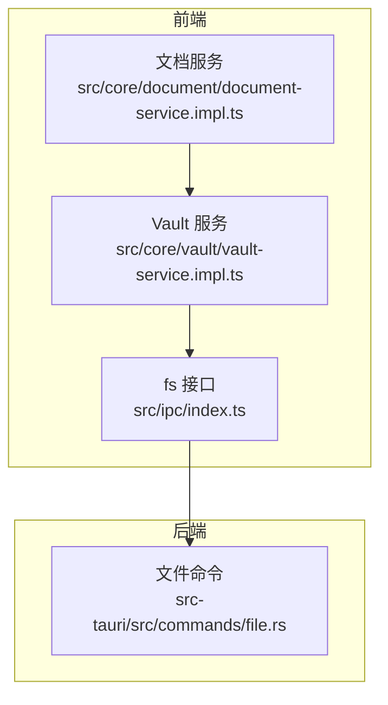
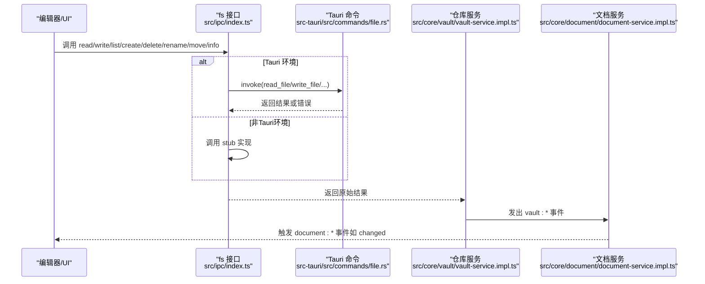
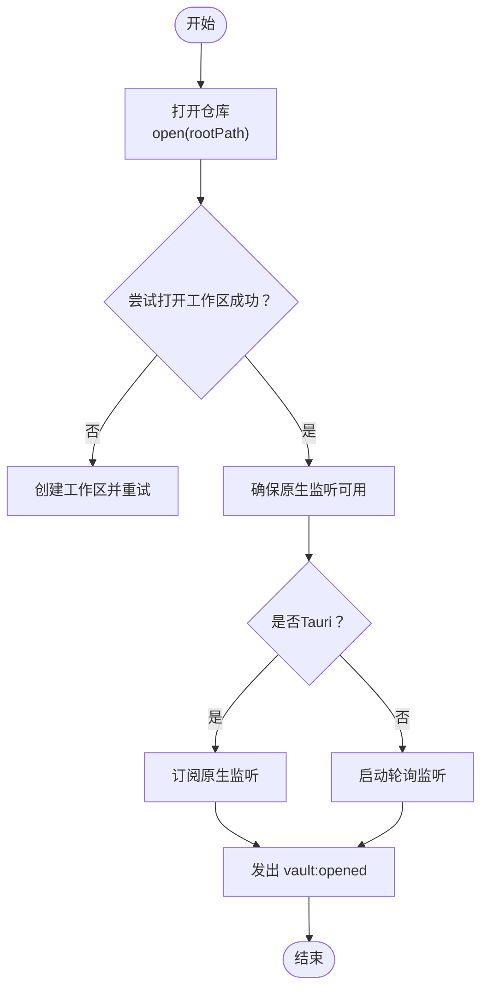
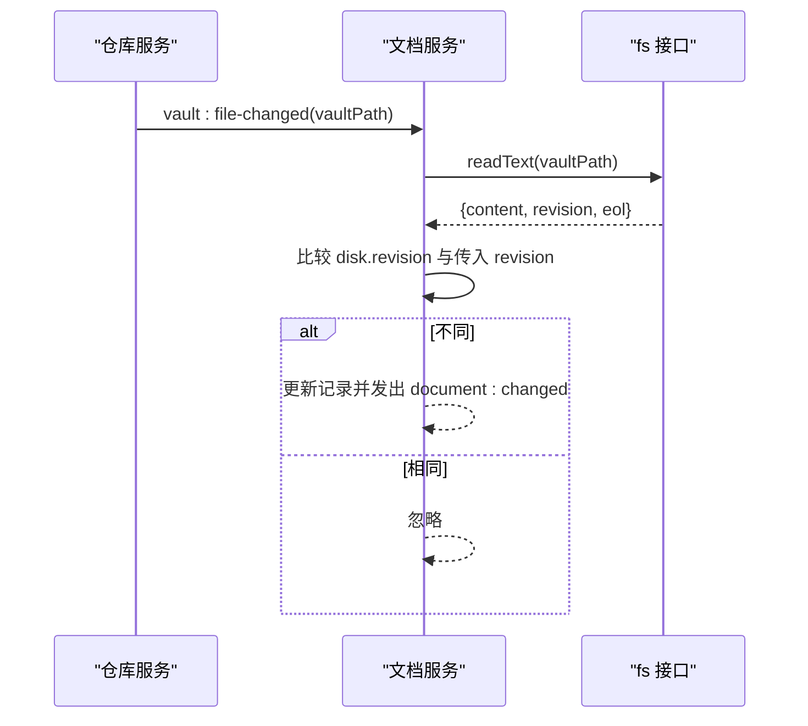
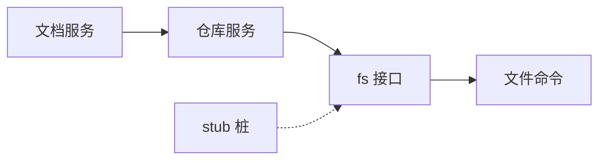

# 文件系统API

<cite>
**本文引用的文件**
- [src/core/vault/vault-service.impl.ts](file://src/core/vault/vault-service.impl.ts)
- [src/ipc/index.ts](file://src/ipc/index.ts)
- [src-tauri/src/commands/file.rs](file://src-tauri/src/commands/file.rs)
- [src/core/vault/types.ts](file://src/core/vault/types.ts)
- [src/core/document/types.ts](file://src/core/document/types.ts)
- [src/core/document/document-service.impl.ts](file://src/core/document/document-service.impl.ts)
- [src/ipc/stub.ts](file://src/ipc/stub.ts)
</cite>

## 目录
1. [简介](#简介)
2. [项目结构](#项目结构)
3. [核心组件](#核心组件)
4. [架构总览](#架构总览)
5. [详细组件分析](#详细组件分析)
6. [依赖关系分析](#依赖关系分析)
7. [性能考量](#性能考量)
8. [故障排查指南](#故障排查指南)
9. [结论](#结论)
10. [附录：API 参考与使用示例](#附录api-参考与使用示例)

## 简介
本文件系统API文档面向NoteForge的前端与后端工程师，系统性介绍文件系统服务的设计与实现，涵盖文件读写、目录遍历、文件监听与同步机制，并深入说明虚拟文件系统边界、缓存策略与性能优化。同时提供文件监听器工作机制（实时更新、增量同步、冲突处理）的详解，以及批量操作、错误处理与性能考虑的实践建议。

## 项目结构
NoteForge采用“前端IPC桥接层 + 后端Tauri命令 + 前端模拟桩”的分层设计：
- 前端通过统一的IPC入口调用后端能力；在非Tauri环境下，自动降级到浏览器内的模拟桩。
- 后端以Tauri命令形式暴露文件系统操作，确保跨平台一致性。
- 文档层与仓库层通过事件总线联动，实现外部变更的感知与冲突处理。

图表来源
- [src/ipc/index.ts:215-238](file://src/ipc/index.ts#L215-L238)
- [src/core/vault/vault-service.impl.ts:101-143](file://src/core/vault/vault-service.impl.ts#L101-L143)
- [src/core/document/document-service.impl.ts:369-465](file://src/core/document/document-service.impl.ts#L369-L465)
- [src-tauri/src/commands/file.rs:14-175](file://src-tauri/src/commands/file.rs#L14-L175)

章节来源
- [src/ipc/index.ts:1-84](file://src/ipc/index.ts#L1-L84)
- [src/core/vault/vault-service.impl.ts:1-314](file://src/core/vault/vault-service.impl.ts#L1-L314)
- [src-tauri/src/commands/file.rs:1-175](file://src-tauri/src/commands/file.rs#L1-L175)

## 核心组件
- IPC桥接层：封装isTauri判断、命令调用与错误包装，提供统一的fs接口。
- 文件命令层：后端Tauri命令，负责真实文件系统操作与元数据读取。
- 仓库服务：对文件系统进行抽象，提供打开/关闭、树形浏览、增删改查、监听等能力。
- 文档服务：基于仓库服务感知外部变更，进行增量同步与冲突处理。

章节来源
- [src/ipc/index.ts:215-238](file://src/ipc/index.ts#L215-L238)
- [src-tauri/src/commands/file.rs:14-175](file://src-tauri/src/commands/file.rs#L14-L175)
- [src/core/vault/vault-service.impl.ts:101-143](file://src/core/vault/vault-service.impl.ts#L101-L143)
- [src/core/document/document-service.impl.ts:369-465](file://src/core/document/document-service.impl.ts#L369-L465)

## 架构总览
下图展示从编辑器到文件系统的调用链路与事件流转：

图表来源
- [src/ipc/index.ts:66-83](file://src/ipc/index.ts#L66-L83)
- [src-tauri/src/commands/file.rs:14-175](file://src-tauri/src/commands/file.rs#L14-L175)
- [src/core/vault/vault-service.impl.ts:44-94](file://src/core/vault/vault-service.impl.ts#L44-L94)
- [src/core/document/document-service.impl.ts:439-448](file://src/core/document/document-service.impl.ts#L439-L448)

## 详细组件分析

### 组件一：文件系统接口 fs
- 设计要点
  - 统一入口：所有文件操作通过fs对象暴露，内部根据运行环境选择真实调用或桩实现。
  - 类型映射：后端返回的FileBackendEntry经toFileEntry转换为前端FileEntry。
  - 错误包装：非Tauri环境抛出可识别的错误字符串，便于前端捕获与提示。
- 支持操作
  - 读取：read(path)
  - 写入：write(path, content)
  - 列表：list(path)
  - 创建：create(path[, content])
  - 删除：remove(path)
  - 重命名：rename(oldPath, newPath)
  - 移动：move(source, destination)
  - 元信息：info(path)

章节来源
- [src/ipc/index.ts:215-238](file://src/ipc/index.ts#L215-L238)
- [src/ipc/index.ts:128-136](file://src/ipc/index.ts#L128-L136)
- [src/ipc/stub.ts:327-371](file://src/ipc/stub.ts#L327-L371)

### 组件二：仓库服务 VaultService
- 设计要点
  - 打开/关闭：open/close管理当前仓库上下文与监听生命周期。
  - 目录遍历：loadChildren/dir树构建由fs.list驱动。
  - 文件变更监听：支持原生Tauri监听与轮询两种模式；轮询间隔固定，避免频繁IO。
  - 自写去噪：selfWritePaths集合用于忽略自身写入产生的监听噪声。
  - 路径跟踪：trackForWatch/untrackForWatch维护watchSnapshot，按需启动轮询。
- 关键流程
  - 打开仓库时尝试打开工作区，失败则创建并重试；随后确保原生监听可用。
  - 写入时优先write，失败回退到create；成功后更新watchSnapshot。
  - 监听回调中区分created/modified/deleted/renamed，分别发出对应事件并刷新树。

图表来源
- [src/core/vault/vault-service.impl.ts:106-143](file://src/core/vault/vault-service.impl.ts#L106-L143)
- [src/core/vault/vault-service.impl.ts:262-282](file://src/core/vault/vault-service.impl.ts#L262-L282)

章节来源
- [src/core/vault/vault-service.impl.ts:101-143](file://src/core/vault/vault-service.impl.ts#L101-L143)
- [src/core/vault/vault-service.impl.ts:262-310](file://src/core/vault/vault-service.impl.ts#L262-L310)

### 组件三：文档服务与冲突处理
- 设计要点
  - 外部变更通知：订阅vault:file-changed，拉取最新内容并重建文档记录。
  - 冲突检测：基于DiskSnapshot.revision（由内容与修改时间组合）比较本地与磁盘差异。
  - 冲突解决：支持“从磁盘重载”“保留本地”“另存为副本”三种策略。
  - 生命周期：文档记录包含lifecycle字段，标识“已持久化/冲突/外部删除”等状态。
- 关键流程
  - 外部变更触发notifyExternalChange，若revision不同则更新记录并发出document:changed。
  - 外部删除触发deleted-externally状态迁移。
  - 重命名时迁移路径索引与监听快照。

图表来源
- [src/core/document/document-service.impl.ts:369-392](file://src/core/document/document-service.impl.ts#L369-L392)
- [src/core/vault/vault-service.impl.ts:164-174](file://src/core/vault/vault-service.impl.ts#L164-L174)

章节来源
- [src/core/document/document-service.impl.ts:369-465](file://src/core/document/document-service.impl.ts#L369-L465)
- [src/core/document/types.ts:37-72](file://src/core/document/types.ts#L37-L72)

### 组件四：后端文件命令
- 设计要点
  - 输入校验：ensure_real_file_path拒绝虚拟文档路径与协议路径，保证仅对真实文件系统操作生效。
  - 目录遍历：list_directory读取目录项并填充名称、路径、是否目录、大小、修改时间。
  - 写入与创建：write_file先确保父目录存在；create_file要求目标不存在。
  - 重命名/移动：rename_file/move_file均执行原子重命名，目标存在时报错。
  - 语言检测：按扩展名推断语言类型，用于编辑器语法高亮与格式化。

章节来源
- [src-tauri/src/commands/file.rs:5-12](file://src-tauri/src/commands/file.rs#L5-L12)
- [src-tauri/src/commands/file.rs:40-75](file://src-tauri/src/commands/file.rs#L40-L75)
- [src-tauri/src/commands/file.rs:113-153](file://src-tauri/src/commands/file.rs#L113-L153)
- [src-tauri/src/commands/file.rs:155-174](file://src-tauri/src/commands/file.rs#L155-L174)

## 依赖关系分析
- 前端依赖
  - fs依赖IPC桥接层与stub桩，实现跨环境一致行为。
  - 仓库服务依赖fs与事件总线，负责监听与树构建。
  - 文档服务依赖仓库服务与事件总线，负责冲突检测与同步。
- 后端依赖
  - 文件命令依赖标准库与错误类型，提供稳定IO与错误语义。
- 耦合与内聚
  - IPC层与命令层职责清晰，前端通过统一接口屏蔽差异。
  - 仓库服务与文档服务通过事件解耦，便于扩展与测试。

图表来源
- [src/ipc/index.ts:215-238](file://src/ipc/index.ts#L215-L238)
- [src/core/vault/vault-service.impl.ts:101-143](file://src/core/vault/vault-service.impl.ts#L101-L143)
- [src/core/document/document-service.impl.ts:369-465](file://src/core/document/document-service.impl.ts#L369-L465)
- [src-tauri/src/commands/file.rs:14-175](file://src-tauri/src/commands/file.rs#L14-L175)

章节来源
- [src/ipc/index.ts:1-84](file://src/ipc/index.ts#L1-L84)
- [src/core/vault/vault-service.impl.ts:1-314](file://src/core/vault/vault-service.impl.ts#L1-L314)
- [src/core/document/document-service.impl.ts:1-465](file://src/core/document/document-service.impl.ts#L1-L465)
- [src-tauri/src/commands/file.rs:1-175](file://src-tauri/src/commands/file.rs#L1-L175)

## 性能考量
- 监听轮询
  - 非Tauri环境下采用定时轮询（固定周期），避免过多系统资源占用；建议在大量文件场景下结合原生监听。
- 写入去噪
  - 使用selfWritePaths集合在写入期间忽略自身变更，减少重复事件与无效刷新。
- 目录遍历
  - list_directory一次性读取目录项并填充元数据，避免多次系统调用；注意大目录的内存占用。
- 缓存策略
  - watchSnapshot缓存路径与修订版本，仅在变化时发出事件，降低事件风暴。
- I/O批处理
  - 对于批量操作（如导入/导出），建议合并写入批次并延迟刷新树，减少UI抖动。

## 故障排查指南
- 常见错误与定位
  - CREATE_ERROR: 文件已存在（创建时）——检查目标路径是否存在，必要时先执行删除或移动。
  - FILE_NOT_FOUND（删除/重命名/信息查询）——确认路径正确且未被外部进程占用。
  - INVALID_INPUT（重命名/移动/创建）——目标已存在或输入非法，修正目标路径或权限。
  - UNKNOWN（Tauri调用异常）——检查后端命令注册与权限配置。
- 定位步骤
  - 在非Tauri环境：查看stub实现与错误字符串，确认路径与权限。
  - 在Tauri环境：检查命令日志与后端错误类型，确认真实文件系统访问权限。
- 冲突处理
  - 若出现冲突，优先使用文档服务提供的冲突解决策略；必要时手动备份并选择“从磁盘重载”。

章节来源
- [src/ipc/stub.ts:327-371](file://src/ipc/stub.ts#L327-L371)
- [src-tauri/src/commands/file.rs:78-94](file://src-tauri/src/commands/file.rs#L78-L94)
- [src-tauri/src/commands/file.rs:113-132](file://src-tauri/src/commands/file.rs#L113-L132)
- [src/core/document/document-service.impl.ts:394-429](file://src/core/document/document-service.impl.ts#L394-L429)

## 结论
NoteForge的文件系统API通过清晰的分层设计与事件驱动机制，实现了跨平台的一致体验。仓库服务与文档服务协同完成文件监听、增量同步与冲突处理，满足多场景下的可靠性与性能需求。建议在生产环境中优先启用原生监听，并结合缓存与批处理策略进一步提升稳定性与响应速度。

## 附录：API 参考与使用示例

### API 参考
- 读取文件
  - 方法：fs.read(path)
  - 返回：{ content: string, language: string }
  - 适用：获取文本内容与语言类型
- 写入文件
  - 方法：fs.write(path, content)
  - 返回：void
  - 适用：覆盖写入；失败时可回退至创建
- 列出目录
  - 方法：fs.list(path)
  - 返回：FileEntry[]
  - FileEntry 字段：path, name, isDir, size, modified
- 创建文件
  - 方法：fs.create(path[, content])
  - 返回：void
  - 适用：新建空文件或带初始内容的文件
- 删除文件/目录
  - 方法：fs.remove(path)
  - 返回：void
  - 适用：递归删除目录与文件
- 重命名/移动
  - 方法：fs.rename(oldPath, newPath) 或 fs.move(source, destination)
  - 返回：void
  - 适用：原子重命名；目标存在时报错
- 获取文件信息
  - 方法：fs.info(path)
  - 返回：FileInfo（size, modified, language, isDir）
  - 适用：文件元数据查询

章节来源
- [src/ipc/index.ts:215-238](file://src/ipc/index.ts#L215-L238)
- [src/ipc/index.ts:128-136](file://src/ipc/index.ts#L128-L136)
- [src-tauri/src/commands/file.rs:14-175](file://src-tauri/src/commands/file.rs#L14-L175)

### 使用示例与最佳实践
- 单文件读写
  - 读取：调用fs.read，解析返回的语言信息用于编辑器高亮。
  - 写入：调用fs.write；若目标不存在，捕获异常后调用fs.create。
- 目录遍历
  - 使用fs.list加载根目录，递归展开子节点；注意大目录的渲染节流。
- 批量操作
  - 导入/导出：合并写入批次，完成后一次性刷新树；避免频繁触发事件。
- 错误处理
  - 区分“文件不存在/已存在/目标已存在”等错误类型，给出用户可理解的提示。
- 性能考虑
  - 启用原生监听优先；在无原生监听时设置合理的轮询间隔。
  - 使用watchSnapshot缓存修订版本，减少重复读取与事件风暴。

### 事件与状态
- 仓库事件
  - vault:opened / vault:closed：仓库生命周期事件
  - vault:file-created / vault:file-changed / vault:file-deleted / vault:file-renamed：文件变更事件
- 文档事件
  - document:changed：文档内容因外部变更而更新
  - deleted-externally：文档被外部删除

章节来源
- [src/core/vault/vault-service.impl.ts:63-94](file://src/core/vault/vault-service.impl.ts#L63-L94)
- [src/core/document/document-service.impl.ts:439-448](file://src/core/document/document-service.impl.ts#L439-L448)
- [src/core/document/types.ts:11-16](file://src/core/document/types.ts#L11-L16)