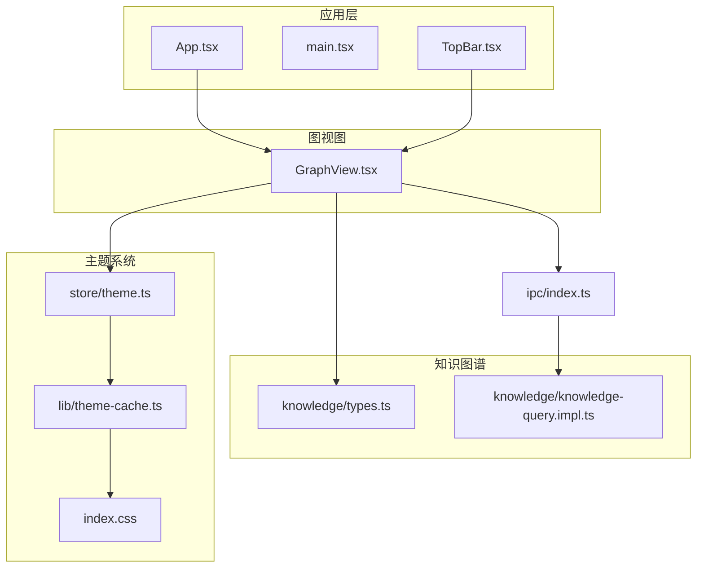
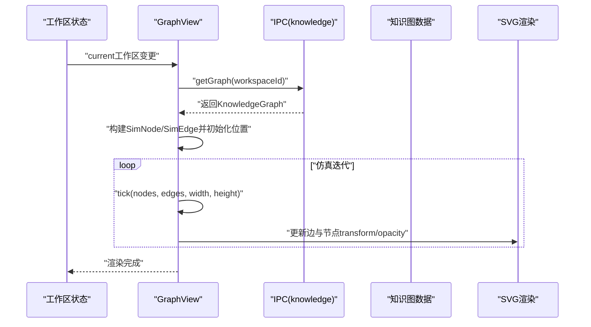
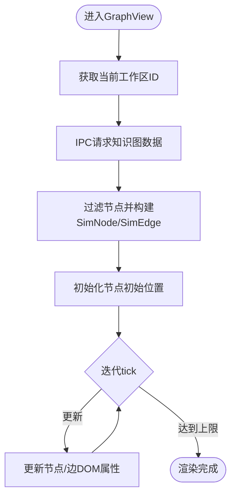
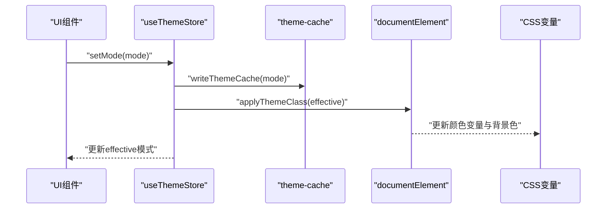
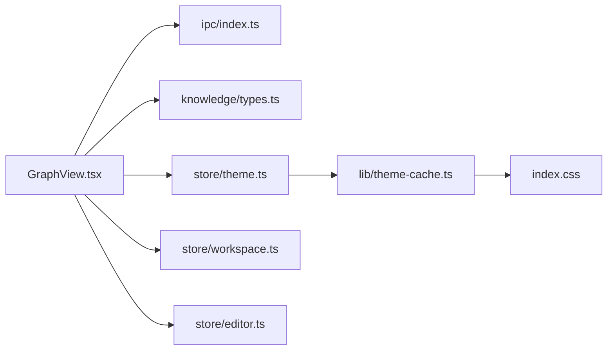

# 可视化集成

<cite>
**本文引用的文件**
- [src/features/graph/GraphView.tsx](file://src/features/graph/GraphView.tsx)
- [src/core/knowledge/types.ts](file://src/core/knowledge/types.ts)
- [src/core/knowledge/knowledge-query.impl.ts](file://src/core/knowledge/knowledge-query.impl.ts)
- [src/store/theme.ts](file://src/store/theme.ts)
- [src/lib/theme-cache.ts](file://src/lib/theme-cache.ts)
- [src/index.css](file://src/index.css)
- [src/components/topbar/TopBar.tsx](file://src/components/topbar/TopBar.tsx)
- [src/main.tsx](file://src/main.tsx)
- [src/App.tsx](file://src/App.tsx)
- [src/hooks/useShortcuts.ts](file://src/hooks/useShortcuts.ts)
- [src/core/platform/event-bus.ts](file://src/core/platform/event-bus.ts)
- [src/store/editor.ts](file://src/store/editor.ts)
- [src/store/workspace.ts](file://src/store/workspace.ts)
- [src/ipc/index.ts](file://src/ipc/index.ts)
</cite>

## 目录
1. [简介](#简介)
2. [项目结构](#项目结构)
3. [核心组件](#核心组件)
4. [架构总览](#架构总览)
5. [详细组件分析](#详细组件分析)
6. [依赖分析](#依赖分析)
7. [性能考虑](#性能考虑)
8. [故障排查指南](#故障排查指南)
9. [结论](#结论)
10. [附录](#附录)

## 简介
本实施指南面向NoteForge的知识图谱可视化集成，聚焦于图视图组件的架构设计与渲染机制，说明如何以轻量SVG+原生动画实现力导向布局、节点缩放与交互操作；并给出针对大数据集的性能优化策略（分页/懒加载思路）、用户交互能力（节点选择、关系高亮、图搜索与过滤）、自定义样式与主题配置方法，以及移动端适配与响应式设计的实践方案。

## 项目结构
- 图视图组件位于features/graph目录，采用React函数组件与useEffect/useMemo组合实现物理仿真与渲染更新。
- 知识图数据类型与查询实现位于core/knowledge，通过IPC调用后端服务获取图数据。
- 主题系统由store/theme与lib/theme-cache协同管理，CSS变量驱动颜色体系。
- 顶层应用入口与路由在App.tsx中组织，图视图作为工作区内容的一部分呈现。

图表来源
- [src/App.tsx](file://src/App.tsx)
- [src/main.tsx](file://src/main.tsx)
- [src/components/topbar/TopBar.tsx](file://src/components/topbar/TopBar.tsx)
- [src/features/graph/GraphView.tsx](file://src/features/graph/GraphView.tsx)
- [src/core/knowledge/types.ts](file://src/core/knowledge/types.ts)
- [src/core/knowledge/knowledge-query.impl.ts](file://src/core/knowledge/knowledge-query.impl.ts)
- [src/store/theme.ts](file://src/store/theme.ts)
- [src/lib/theme-cache.ts](file://src/lib/theme-cache.ts)
- [src/index.css](file://src/index.css)
- [src/ipc/index.ts](file://src/ipc/index.ts)

章节来源
- [src/features/graph/GraphView.tsx](file://src/features/graph/GraphView.tsx)
- [src/core/knowledge/types.ts](file://src/core/knowledge/types.ts)
- [src/store/theme.ts](file://src/store/theme.ts)
- [src/lib/theme-cache.ts](file://src/lib/theme-cache.ts)
- [src/index.css](file://src/index.css)
- [src/components/topbar/TopBar.tsx](file://src/components/topbar/TopBar.tsx)
- [src/ipc/index.ts](file://src/ipc/index.ts)

## 核心组件
- 图视图组件GraphView：负责拉取知识图数据、构建仿真节点/边、运行物理迭代、渲染SVG元素、处理缩放与交互。
- 知识图数据类型：定义节点、边、图等核心数据结构，支撑前端渲染与过滤。
- 主题存储与缓存：统一管理主题模式与生效态，驱动CSS变量与DOM类名。
- IPC接口：提供知识图查询能力，供图视图异步获取数据。

章节来源
- [src/features/graph/GraphView.tsx](file://src/features/graph/GraphView.tsx)
- [src/core/knowledge/types.ts](file://src/core/knowledge/types.ts)
- [src/store/theme.ts](file://src/store/theme.ts)
- [src/lib/theme-cache.ts](file://src/lib/theme-cache.ts)
- [src/ipc/index.ts](file://src/ipc/index.ts)

## 架构总览
图视图采用“数据-仿真-渲染”三层架构：
- 数据层：从工作区上下文订阅当前工作空间，通过IPC请求知识图数据，得到节点与边集合。
- 仿真层：在内存中维护SimNode/SimEdge，基于经典力导向算法（斥力、引力、阻尼、边界约束）进行迭代。
- 渲染层：使用SVG绘制边与节点，通过DOM属性更新实现动画；同时支持缩放、搜索过滤、节点选择与双击打开文件。

图表来源
- [src/features/graph/GraphView.tsx](file://src/features/graph/GraphView.tsx)
- [src/ipc/index.ts](file://src/ipc/index.ts)

## 详细组件分析

### 组件：GraphView（图视图）
- 数据获取与过滤
  - 通过工作区ID请求知识图，得到节点与边集合。
  - 支持按节点label进行大小写不敏感的包含匹配过滤，仅对可见节点建立仿真对象。
- 力导向仿真
  - 仿真函数计算斥力、引力、中心引力与边界约束，更新节点速度与位置。
  - 使用固定迭代次数上限避免无限循环。
- 渲染与交互
  - 使用SVG绘制边与节点，边根据两端节点是否被选中调整透明度；节点半径与度数相关。
  - 支持节点点击选择、双击打开对应文件、工具栏缩放控制与搜索输入框过滤。
- 性能要点
  - 通过useMemo稳定化仿真对象集合，减少重复计算。
  - DOM查询批量更新transform，避免逐帧多次重排。

图表来源
- [src/features/graph/GraphView.tsx](file://src/features/graph/GraphView.tsx)

章节来源
- [src/features/graph/GraphView.tsx](file://src/features/graph/GraphView.tsx)

### 数据模型：知识图数据类型
- 定义节点、边与完整图的数据结构，用于前后端契约与前端渲染。
- 提供类型安全的访问路径，便于在图视图中进行过滤与映射。

章节来源
- [src/core/knowledge/types.ts](file://src/core/knowledge/types.ts)

### 查询实现：知识图查询
- 提供知识图查询的实现入口，图视图通过IPC调用该实现获取数据。
- 可在此扩展分页/增量拉取策略，以支持更大规模图数据。

章节来源
- [src/core/knowledge/knowledge-query.impl.ts](file://src/core/knowledge/knowledge-query.impl.ts)

### 主题系统：主题存储与缓存
- 主题存储：Zustand状态管理，支持设置主题模式与监听系统主题变化。
- 主题缓存：本地持久化主题模式，应用启动时同步到DOM类名与CSS变量。
- CSS变量：全局颜色变量与背景色，配合暗/亮模式切换。

图表来源
- [src/store/theme.ts](file://src/store/theme.ts)
- [src/lib/theme-cache.ts](file://src/lib/theme-cache.ts)
- [src/index.css](file://src/index.css)

章节来源
- [src/store/theme.ts](file://src/store/theme.ts)
- [src/lib/theme-cache.ts](file://src/lib/theme-cache.ts)
- [src/index.css](file://src/index.css)

### 交互与快捷键
- 图视图内提供搜索框、缩放按钮与节点选择/双击打开文件等交互。
- 应用顶部导航提供视图切换与主题设置入口，便于整体布局与外观控制。

章节来源
- [src/features/graph/GraphView.tsx](file://src/features/graph/GraphView.tsx)
- [src/components/topbar/TopBar.tsx](file://src/components/topbar/TopBar.tsx)
- [src/hooks/useShortcuts.ts](file://src/hooks/useShortcuts.ts)

## 依赖分析
- 组件耦合
  - GraphView依赖工作区状态、编辑器打开文件能力、IPC知识图查询与主题存储。
  - 主题系统通过缓存与状态管理解耦UI与持久化。
- 外部依赖
  - 未引入第三方图形库，采用原生SVG与定时器实现仿真与渲染，降低体积与复杂度。
- 潜在环路
  - 当前模块间为单向依赖（视图→IPC→查询），无明显循环依赖。

图表来源
- [src/features/graph/GraphView.tsx](file://src/features/graph/GraphView.tsx)
- [src/ipc/index.ts](file://src/ipc/index.ts)
- [src/core/knowledge/types.ts](file://src/core/knowledge/types.ts)
- [src/store/theme.ts](file://src/store/theme.ts)
- [src/lib/theme-cache.ts](file://src/lib/theme-cache.ts)
- [src/index.css](file://src/index.css)
- [src/store/workspace.ts](file://src/store/workspace.ts)
- [src/store/editor.ts](file://src/store/editor.ts)

章节来源
- [src/features/graph/GraphView.tsx](file://src/features/graph/GraphView.tsx)
- [src/store/theme.ts](file://src/store/theme.ts)
- [src/lib/theme-cache.ts](file://src/lib/theme-cache.ts)
- [src/index.css](file://src/index.css)
- [src/store/workspace.ts](file://src/store/workspace.ts)
- [src/store/editor.ts](file://src/store/editor.ts)
- [src/ipc/index.ts](file://src/ipc/index.ts)

## 性能考虑
- 仿真性能
  - 当前实现为O(n^2)斥力计算，适合数百节点场景；超过阈值应考虑四叉树近似或采样。
  - 固定迭代上限与批量DOM更新有助于控制帧率。
- 渲染性能
  - 使用transform而非改变x/y属性，避免强制布局。
  - 仅对可见节点建立仿真对象，过滤阶段即缩小规模。
- 大数据优化（建议）
  - 分页/懒加载：按节点度数或聚类分批加载，先渲染中心子图，滚动/搜索时再拉取邻域。
  - 增量更新：仅对受影响节点重新计算力，而非全量tick。
  - 降采样：对边进行抽样或聚合，降低渲染压力。
- 内存与状态
  - 使用useMemo稳定化数据结构，避免重复映射与对象重建。
  - 在组件卸载时清理定时器与事件监听。

[本节为通用性能指导，不直接分析具体代码文件]

## 故障排查指南
- 图无法渲染或空白
  - 检查工作区是否为空，确认IPC返回的图数据是否存在。
  - 确认容器尺寸计算（getBoundingClientRect）有效。
- 仿真不动或抖动
  - 检查迭代定时器是否被清理，确认tick参数（阻尼、斥力系数）合理。
  - 确认节点初始位置与边界约束逻辑。
- 交互异常
  - 确认节点点击事件冒泡被阻止，双击打开文件的referenceId有效。
  - 检查主题切换后CSS变量是否正确更新。
- 主题不生效
  - 检查主题缓存写入与DOM类名应用流程，确认系统主题监听事件注册。

章节来源
- [src/features/graph/GraphView.tsx](file://src/features/graph/GraphView.tsx)
- [src/store/theme.ts](file://src/store/theme.ts)
- [src/lib/theme-cache.ts](file://src/lib/theme-cache.ts)

## 结论
GraphView以轻量SVG与原生动画实现了知识图谱的实时可视化，具备基础的力导向布局、缩放与交互能力。结合主题系统与响应式布局，可在NoteForge中提供一致且高效的图视图体验。对于更大规模图数据，建议在查询层引入分页/增量策略，并在渲染层采用降采样与懒加载以维持流畅度。

[本节为总结性内容，不直接分析具体代码文件]

## 附录

### 自定义样式与主题配置
- CSS变量：通过全局CSS变量控制颜色与阴影，主题切换时自动更新。
- 主题模式：支持亮色、暗色与跟随系统三种模式，持久化到本地存储。
- 应用入口：在应用启动时应用缓存主题，确保首屏一致性。

章节来源
- [src/index.css](file://src/index.css)
- [src/store/theme.ts](file://src/store/theme.ts)
- [src/lib/theme-cache.ts](file://src/lib/theme-cache.ts)
- [src/main.tsx](file://src/main.tsx)

### 移动端适配与响应式设计
- 响应式容器：图视图容器使用flex布局与相对尺寸，随窗口变化自适应。
- 缩放控制：提供放大/缩小/重置按钮，满足不同屏幕密度下的可视需求。
- 交互优化：触摸设备上的点击与双击行为保持一致，必要时可增加触控缩放手势（建议）。

章节来源
- [src/features/graph/GraphView.tsx](file://src/features/graph/GraphView.tsx)