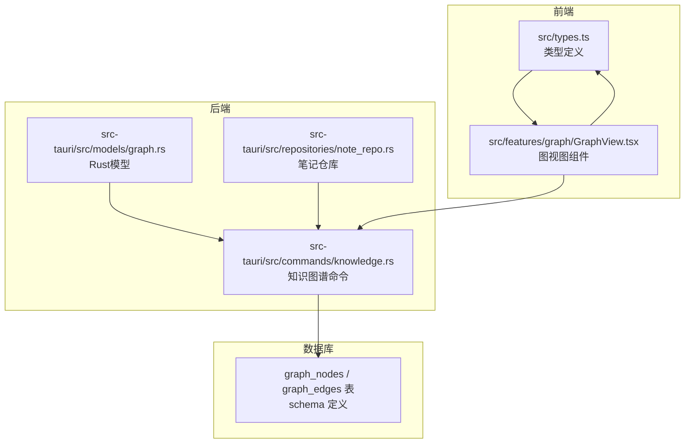
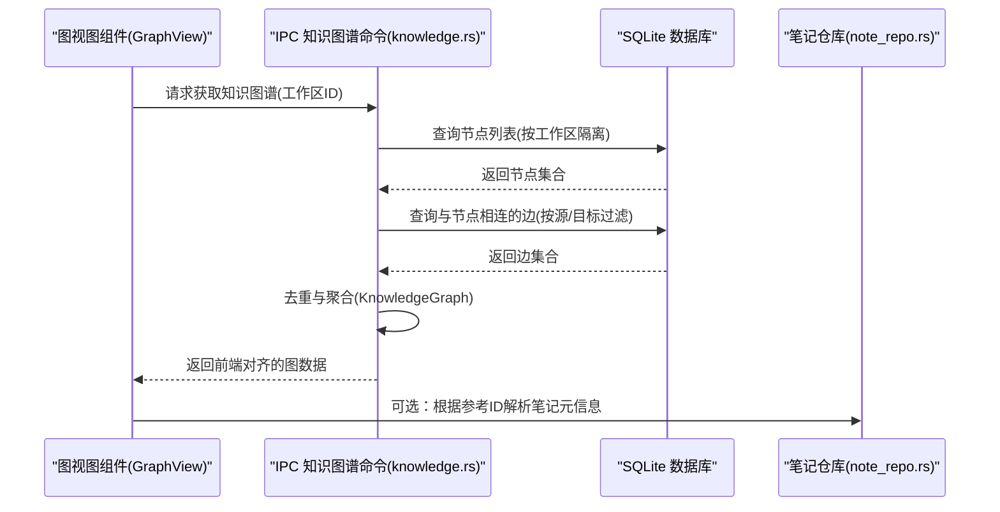
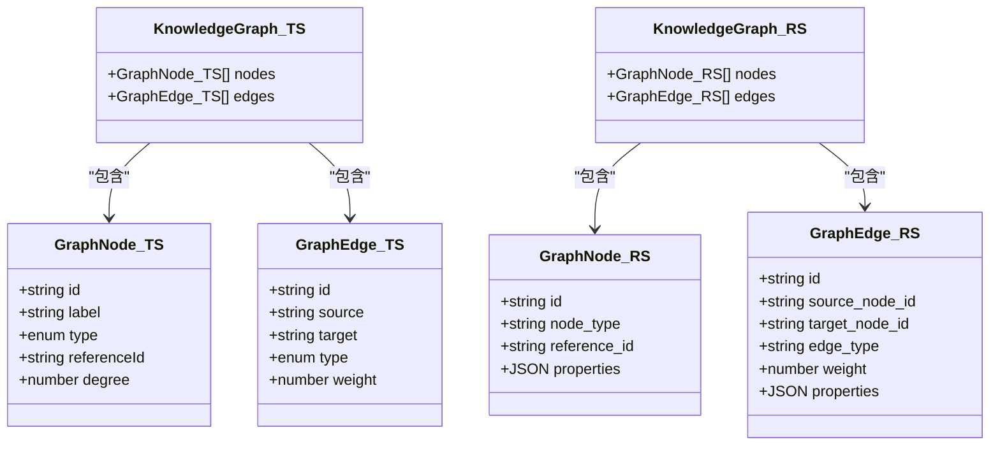
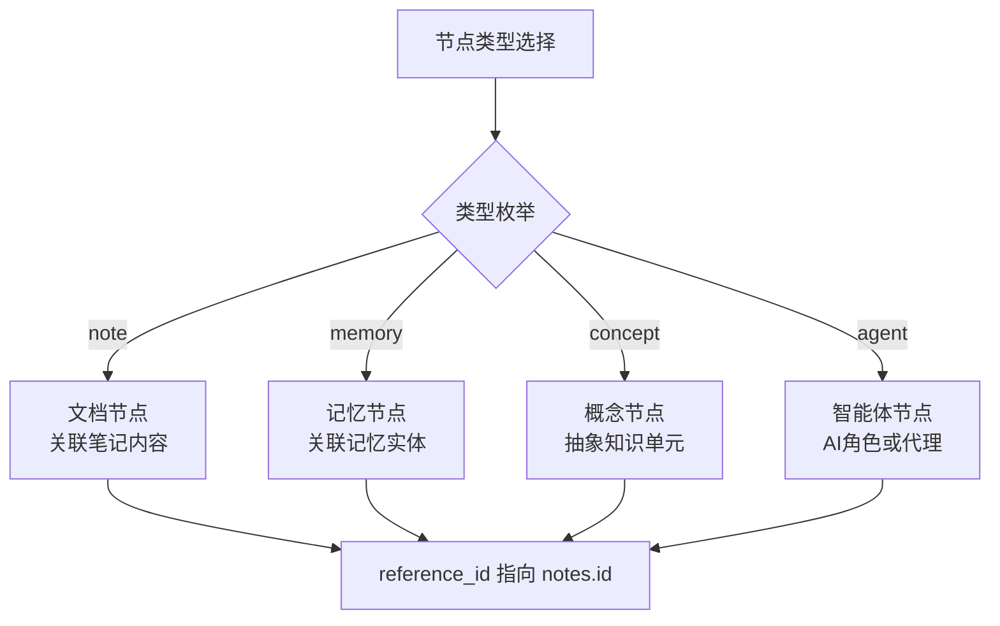
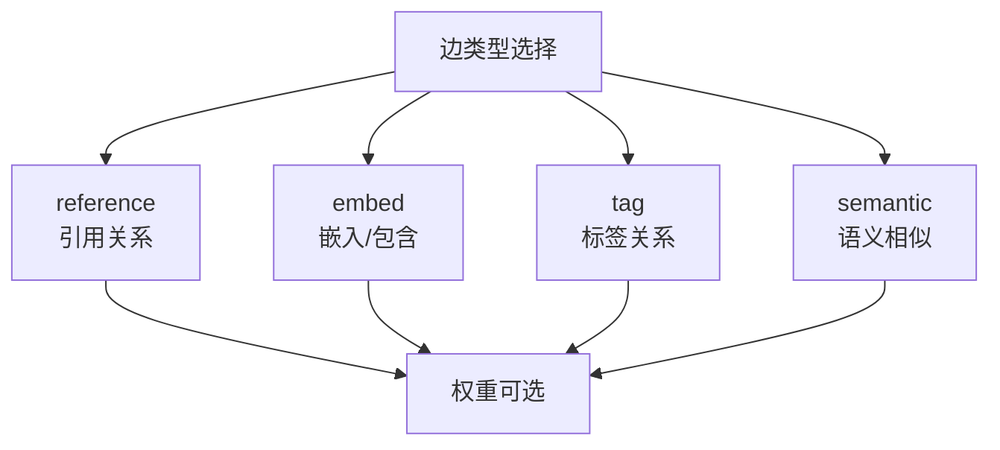
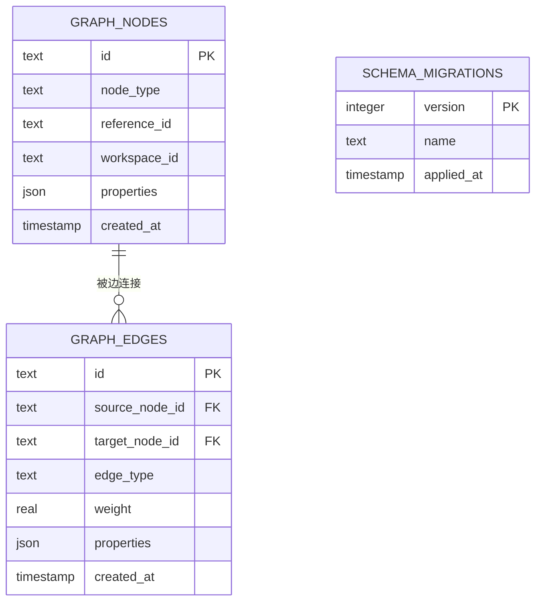
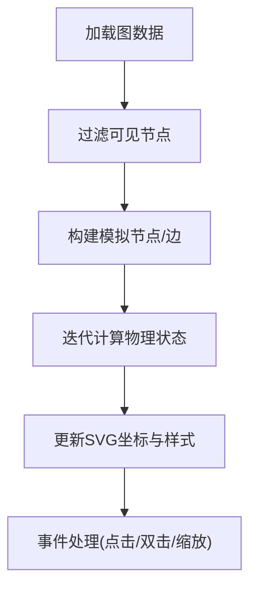
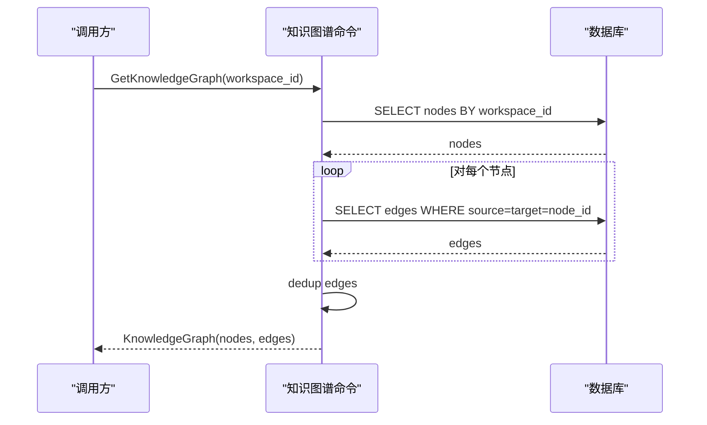
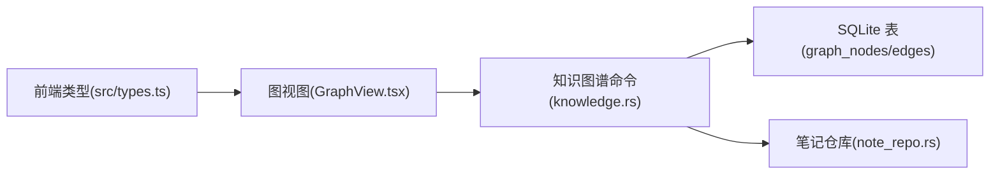

# 图数据模型

<cite>
**本文档引用的文件**
- [src-tauri/src/models/graph.rs](file://src-tauri/src/models/graph.rs)
- [src/types.ts](file://src/types.ts)
- [src-tauri/src/commands/knowledge.rs](file://src-tauri/src/commands/knowledge.rs)
- [src-tauri/src/repositories/note_repo.rs](file://src-tauri/src/repositories/note_repo.rs)
- [.tmp/system-architecture-design.md](file://.tmp/system-architecture-design.md)
- [src/features/graph/GraphView.tsx](file://src/features/graph/GraphView.tsx)
</cite>

## 目录
1. [引言](#引言)
2. [项目结构](#项目结构)
3. [核心组件](#核心组件)
4. [架构总览](#架构总览)
5. [详细组件分析](#详细组件分析)
6. [依赖分析](#依赖分析)
7. [性能考虑](#性能考虑)
8. [故障排查指南](#故障排查指南)
9. [结论](#结论)
10. [附录](#附录)

## 引言
本文件系统性梳理NoteForge的知识图谱数据模型，覆盖节点与边的数据结构、节点类型与边关系的语义、图数据的存储与序列化、前端可视化以及生命周期与版本控制机制。目标是帮助开发者与产品人员快速理解并正确使用知识图谱能力。

## 项目结构
围绕知识图谱的关键代码分布在前端TypeScript类型定义、后端Rust模型与命令实现、数据库模式定义以及前端图视图组件中。下图给出与知识图谱相关的主要模块及其职责：

**图表来源**
- [src/types.ts:161-204](file://src/types.ts#L161-L204)
- [src/features/graph/GraphView.tsx:1-278](file://src/features/graph/GraphView.tsx#L1-L278)
- [src-tauri/src/models/graph.rs:1-35](file://src-tauri/src/models/graph.rs#L1-L35)
- [src-tauri/src/commands/knowledge.rs:126-163](file://src-tauri/src/commands/knowledge.rs#L126-L163)
- [src-tauri/src/repositories/note_repo.rs:1-170](file://src-tauri/src/repositories/note_repo.rs#L1-L170)
- [.tmp/system-architecture-design.md:568-614](file://.tmp/system-architecture-design.md#L568-L614)

**章节来源**
- [src/types.ts:161-204](file://src/types.ts#L161-L204)
- [src/features/graph/GraphView.tsx:1-278](file://src/features/graph/GraphView.tsx#L1-L278)
- [src-tauri/src/models/graph.rs:1-35](file://src-tauri/src/models/graph.rs#L1-L35)
- [src-tauri/src/commands/knowledge.rs:126-163](file://src-tauri/src/commands/knowledge.rs#L126-L163)
- [src-tauri/src/repositories/note_repo.rs:1-170](file://src-tauri/src/repositories/note_repo.rs#L1-L170)
- [.tmp/system-architecture-design.md:568-614](file://.tmp/system-architecture-design.md#L568-L614)

## 核心组件
- 节点模型（前端/后端对齐）
  - 前端类型：包含标识、标签、类型枚举、参考ID、度数等字段，用于UI渲染与交互。
  - 后端模型：包含标识、节点类型字符串、参考ID、通用JSON属性，用于持久化与序列化。
- 边模型（前端/后端对齐）
  - 前端类型：包含标识、源/目标节点、类型枚举、权重等字段。
  - 后端模型：包含标识、源/目标节点、边类型、权重、通用JSON属性。
- 知识图谱聚合
  - 前端：由节点数组与边数组组成。
  - 后端：在查询时从数据库加载节点与边并去重返回。

**章节来源**
- [src/types.ts:161-204](file://src/types.ts#L161-L204)
- [src-tauri/src/models/graph.rs:1-35](file://src-tauri/src/models/graph.rs#L1-L35)

## 架构总览
下图展示从前端请求到后端查询再到数据库读取的整体流程，以及与笔记仓库的协作关系。

**图表来源**
- [src/features/graph/GraphView.tsx:91-94](file://src/features/graph/GraphView.tsx#L91-L94)
- [src-tauri/src/commands/knowledge.rs:126-163](file://src-tauri/src/commands/knowledge.rs#L126-L163)
- [src-tauri/src/repositories/note_repo.rs:1-170](file://src-tauri/src/repositories/note_repo.rs#L1-L170)

## 详细组件分析

### 节点与边的数据结构
- 节点
  - 前端字段：id、label、type、referenceId、degree
  - 后端字段：id、node_type、reference_id、properties(JSON)
- 边
  - 前端字段：id、source、target、type、weight
  - 后端字段：id、source_node_id、target_node_id、edge_type、weight、properties(JSON)
- 知识图谱
  - 前端：nodes[]、edges[]
  - 后端：nodes[]、edges[] 聚合结构

**图表来源**
- [src/types.ts:161-204](file://src/types.ts#L161-L204)
- [src-tauri/src/models/graph.rs:1-35](file://src-tauri/src/models/graph.rs#L1-L35)

**章节来源**
- [src/types.ts:161-204](file://src/types.ts#L161-L204)
- [src-tauri/src/models/graph.rs:1-35](file://src-tauri/src/models/graph.rs#L1-L35)

### 节点类型与语义
- 类型枚举（前端）：note、memory、concept、agent
- 类型约束（数据库）：node_type 限定于 note/memory/concept/agent
- 参考ID语义：reference_id 指向 notes.id 或其他实体主键，用于UI打开与元信息解析

**图表来源**
- [src/types.ts:161-167](file://src/types.ts#L161-L167)
- [.tmp/system-architecture-design.md:568-577](file://.tmp/system-architecture-design.md#L568-L577)

**章节来源**
- [src/types.ts:161-167](file://src/types.ts#L161-L167)
- [.tmp/system-architecture-design.md:568-577](file://.tmp/system-architecture-design.md#L568-L577)

### 边关系模型与语义
- 类型枚举（前端）：reference、embed、tag、semantic
- 语义说明（结合前端类型与数据库字段）
  - reference：引用关系（wikilink等）
  - embed：嵌入/包含关系
  - tag：标签关系
  - semantic：语义相似关系（基于向量）
- 权重：可选权重用于排序与渲染强度

**图表来源**
- [src/types.ts:169-175](file://src/types.ts#L169-L175)

**章节来源**
- [src/types.ts:169-175](file://src/types.ts#L169-L175)

### 存储格式与序列化机制
- 数据库存储
  - graph_nodes：id、node_type、reference_id、workspace_id、properties(JSON)、created_at
  - graph_edges：id、source_node_id、target_node_id、edge_type、weight、properties(JSON)、created_at
  - 外键约束：边的源/目标引用节点ID，删除级联
  - 索引：对边表的源/目标列建立索引以支持邻接查询
- 版本管理
  - schema_migrations：版本号、名称、应用时间
- 序列化
  - 前后端均采用 camelCase 字段命名，并通过 serde/JSON 进行序列化/反序列化

**图表来源**
- [.tmp/system-architecture-design.md:568-614](file://.tmp/system-architecture-design.md#L568-L614)

**章节来源**
- [.tmp/system-architecture-design.md:568-614](file://.tmp/system-architecture-design.md#L568-L614)

### 前端可视化与交互
- 力导向布局：内置轻量力引导算法，支持节点重力、斥力、弹簧吸引与边界约束
- 交互功能：筛选节点、缩放、选中高亮、双击打开文档
- 数据绑定：将后端返回的节点/边映射为SVG元素，动态更新位置

**图表来源**
- [src/features/graph/GraphView.tsx:96-146](file://src/features/graph/GraphView.tsx#L96-L146)

**章节来源**
- [src/features/graph/GraphView.tsx:1-278](file://src/features/graph/GraphView.tsx#L1-L278)

### 查询与聚合流程
- 输入：工作区ID
- 步骤：
  1) 加载节点（按工作区隔离）
  2) 为每个节点查询与其相连的边（源或目标匹配）
  3) 合并边并去重
  4) 返回前端对齐的图数据结构

**图表来源**
- [src-tauri/src/commands/knowledge.rs:126-163](file://src-tauri/src/commands/knowledge.rs#L126-L163)

**章节来源**
- [src-tauri/src/commands/knowledge.rs:126-163](file://src-tauri/src/commands/knowledge.rs#L126-L163)

## 依赖分析
- 前端依赖后端IPC接口获取图数据；图数据结构与后端模型保持一致
- 后端依赖SQLite存储节点与边；边的外键约束保证图的一致性
- 笔记仓库提供与节点参考ID的关联，便于UI层打开对应文档

**图表来源**
- [src/types.ts:161-204](file://src/types.ts#L161-L204)
- [src/features/graph/GraphView.tsx:1-278](file://src/features/graph/GraphView.tsx#L1-L278)
- [src-tauri/src/commands/knowledge.rs:126-163](file://src-tauri/src/commands/knowledge.rs#L126-L163)
- [src-tauri/src/repositories/note_repo.rs:1-170](file://src-tauri/src/repositories/note_repo.rs#L1-L170)

**章节来源**
- [src/types.ts:161-204](file://src/types.ts#L161-L204)
- [src/features/graph/GraphView.tsx:1-278](file://src/features/graph/GraphView.tsx#L1-L278)
- [src-tauri/src/commands/knowledge.rs:126-163](file://src-tauri/src/commands/knowledge.rs#L126-L163)
- [src-tauri/src/repositories/note_repo.rs:1-170](file://src-tauri/src/repositories/note_repo.rs#L1-L170)

## 性能考虑
- 查询路径
  - 节点查询：按工作区ID过滤，避免跨工作区扫描
  - 边查询：对每个节点查询其邻接边，建议在节点规模可控（≤数百）时使用
- 去重策略：后端对边ID进行排序与去重，减少重复边带来的渲染与计算开销
- 前端渲染：内置力导算法适合小规模图；大规模图建议分页/子图或采用外部可视化库
- 数据库索引：边表已建立源/目标索引，有助于邻接查询性能

**章节来源**
- [src-tauri/src/commands/knowledge.rs:126-163](file://src-tauri/src/commands/knowledge.rs#L126-L163)
- [.tmp/system-architecture-design.md:591-592](file://.tmp/system-architecture-design.md#L591-L592)

## 故障排查指南
- 图为空或节点为0
  - 检查工作区是否已建立双向链接（wikilink），前端会在无数据时提示
  - 确认知识索引是否完成重建
- 边重复或不完整
  - 后端已执行去重逻辑；若仍异常，检查数据库中是否存在重复边记录
- 打不开文档
  - 确认节点的 reference_id 是否指向有效笔记ID；必要时通过笔记仓库校验
- 性能问题
  - 节点/边数量超过预期时，考虑分页加载或子图策略

**章节来源**
- [src/features/graph/GraphView.tsx:180-190](file://src/features/graph/GraphView.tsx#L180-L190)
- [src-tauri/src/commands/knowledge.rs:126-163](file://src-tauri/src/commands/knowledge.rs#L126-L163)
- [src-tauri/src/repositories/note_repo.rs:1-170](file://src-tauri/src/repositories/note_repo.rs#L1-L170)

## 结论
NoteForge的知识图谱以“节点-边”为核心，通过前后端对齐的数据结构与严格的数据库约束，实现了从笔记链接到可视化呈现的完整闭环。前端提供轻量力导图视图，后端负责高效查询与去重，数据库层面通过索引与外键保障一致性与性能。配合工作区隔离与迁移版本管理，整体方案具备良好的扩展性与可维护性。

## 附录

### 实际数据示例（示意）
- 节点示例
  - id: "node_abc"
  - type: "note"
  - referenceId: "note_xyz"
  - degree: 3
- 边示例
  - id: "edge_def"
  - source: "node_abc"
  - target: "node_xyz"
  - type: "reference"
  - weight: 1.0

**章节来源**
- [src/types.ts:161-175](file://src/types.ts#L161-L175)