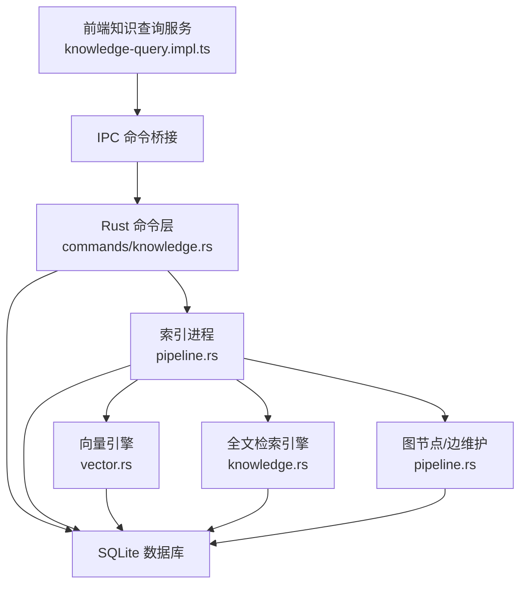
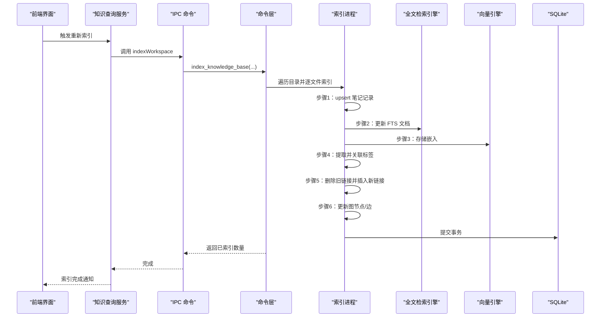
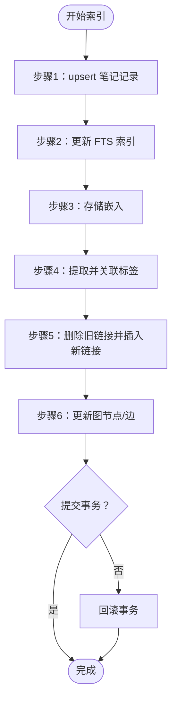
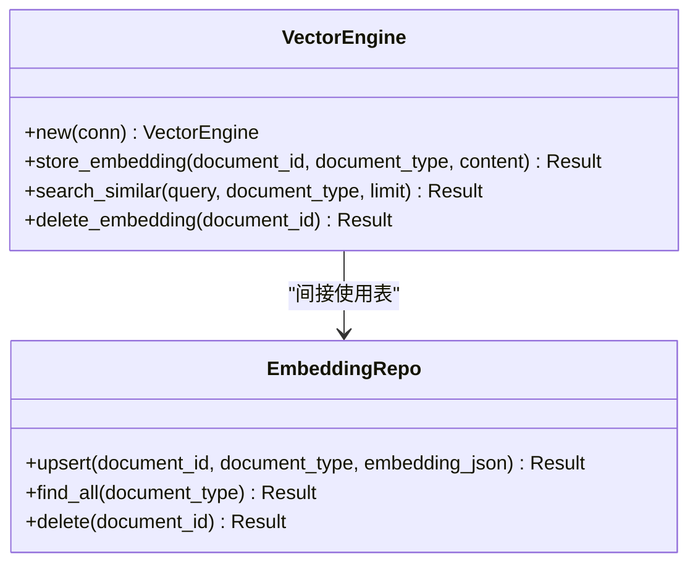
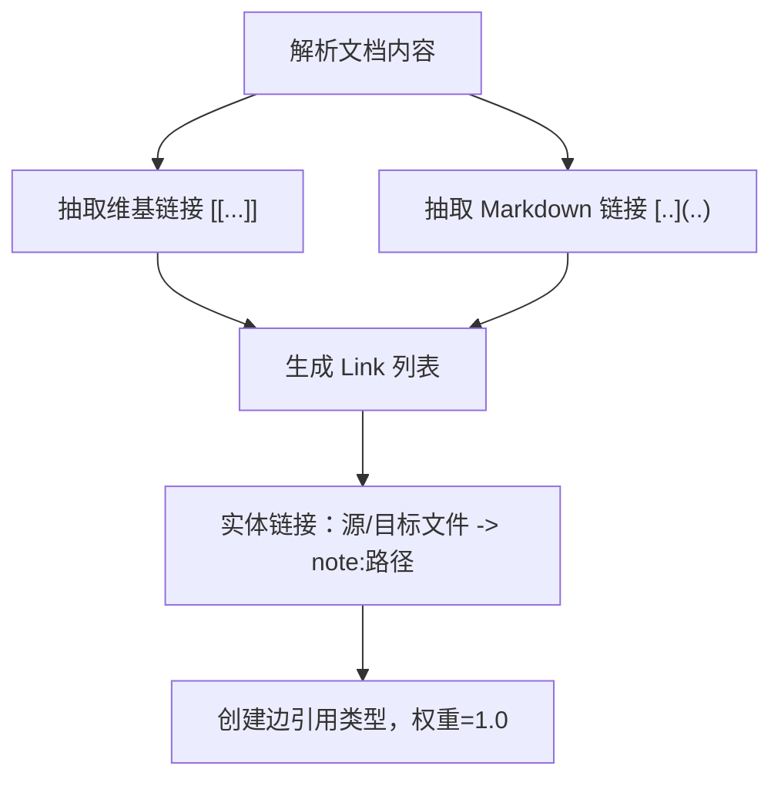
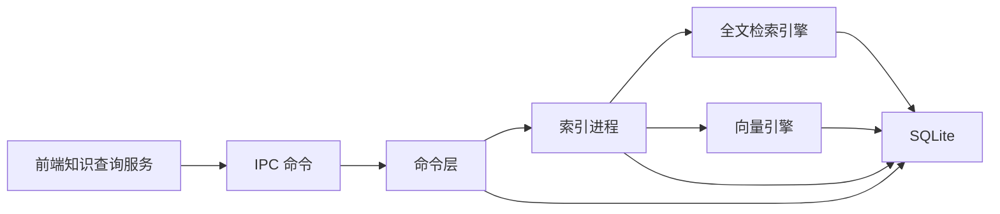

# 图构建算法

<cite>
**本文引用的文件**
- [src/core/knowledge/knowledge-query.impl.ts](file://src/core/knowledge/knowledge-query.impl.ts)
- [src-tauri/src/commands/knowledge.rs](file://src-tauri/src/commands/knowledge.rs)
- [src-tauri/src/knowledge.rs](file://src-tauri/src/knowledge.rs)
- [src-tauri/src/models/graph.rs](file://src-tauri/src/models/graph.rs)
- [src-tauri/src/pipeline.rs](file://src-tauri/src/pipeline.rs)
- [src-tauri/src/vector.rs](file://src-tauri/src/vector.rs)
- [src-tauri/src/repositories/embedding_repo.rs](file://src-tauri/src/repositories/embedding_repo.rs)
- [src-tauri/src/models/link.rs](file://src-tauri/src/models/link.rs)
</cite>

## 目录
1. [引言](#引言)
2. [项目结构](#项目结构)
3. [核心组件](#核心组件)
4. [架构总览](#架构总览)
5. [详细组件分析](#详细组件分析)
6. [依赖分析](#依赖分析)
7. [性能考虑](#性能考虑)
8. [故障排查指南](#故障排查指南)
9. [结论](#结论)
10. [附录](#附录)

## 引言
本技术文档围绕 NoteForge 的知识图谱自动构建流程展开，系统性阐述从文档解析、实体识别、关系抽取到图生成的完整链路；深入说明实体链接（将文本中的“提及”映射为知识图谱节点）的实现方式；解释关系抽取所采用的规则引擎与向量化嵌入在图构建中的作用（语义相似度与检索）；并提供配置项与性能调优建议、增量更新机制与实时同步策略。

## 项目结构
NoteForge 的知识图谱能力由前端查询服务与后端 Rust 管线共同组成：
- 前端：提供工作区索引调度、标题与反链查询、维基链接解析等能力
- 后端：负责全文检索索引、向量嵌入存储与相似度检索、图节点/边维护、以及完整的索引进程

图表来源
- [src/core/knowledge/knowledge-query.impl.ts:1-178](file://src/core/knowledge/knowledge-query.impl.ts#L1-L178)
- [src-tauri/src/commands/knowledge.rs:1-305](file://src-tauri/src/commands/knowledge.rs#L1-L305)
- [src-tauri/src/pipeline.rs:1-290](file://src-tauri/src/pipeline.rs#L1-L290)
- [src-tauri/src/knowledge.rs:1-75](file://src-tauri/src/knowledge.rs#L1-L75)
- [src-tauri/src/vector.rs:1-151](file://src-tauri/src/vector.rs#L1-L151)

章节来源
- [src/core/knowledge/knowledge-query.impl.ts:1-178](file://src/core/knowledge/knowledge-query.impl.ts#L1-L178)
- [src-tauri/src/commands/knowledge.rs:1-305](file://src-tauri/src/commands/knowledge.rs#L1-L305)
- [src-tauri/src/pipeline.rs:1-290](file://src-tauri/src/pipeline.rs#L1-L290)

## 核心组件
- 知识查询服务（前端）：提供笔记元数据、标题索引、反链、出链、维基链接解析与全文检索触发
- 索引进程（后端）：原子化六步索引流水线，包含笔记写入、FTS 更新、向量嵌入、标签提取与链接持久化、图节点/边更新
- 全文检索引擎：基于 SQLite FTS5 的本地全文检索
- 向量引擎：基于 fastembed 的嵌入生成与相似度检索
- 图模型：统一的节点与边结构，支持属性 JSON 存储
- 链接模型：标准化的链接结构，用于抽取与持久化

章节来源
- [src/core/knowledge/knowledge-query.impl.ts:41-148](file://src/core/knowledge/knowledge-query.impl.ts#L41-L148)
- [src-tauri/src/pipeline.rs:12-90](file://src-tauri/src/pipeline.rs#L12-L90)
- [src-tauri/src/knowledge.rs:5-74](file://src-tauri/src/knowledge.rs#L5-L74)
- [src-tauri/src/vector.rs:7-28](file://src-tauri/src/vector.rs#L7-L28)
- [src-tauri/src/models/graph.rs:3-35](file://src-tauri/src/models/graph.rs#L3-L35)
- [src-tauri/src/models/link.rs:3-34](file://src-tauri/src/models/link.rs#L3-L34)

## 架构总览
下图展示从用户保存文档到知识图谱可视化的端到端流程：

图表来源
- [src/core/knowledge/knowledge-query.impl.ts:136-144](file://src/core/knowledge/knowledge-query.impl.ts#L136-L144)
- [src-tauri/src/commands/knowledge.rs:14-68](file://src-tauri/src/commands/knowledge.rs#L14-L68)
- [src-tauri/src/pipeline.rs:17-90](file://src-tauri/src/pipeline.rs#L17-L90)

## 详细组件分析

### 知识查询服务（前端）
- 职责：提供笔记元信息、标题索引、反链查询、出链抽取、维基链接解析与建议、全文检索触发
- 关键点：
  - 使用正则匹配维基链接与标题，生成索引条目
  - 通过 IPC 调用后端命令进行重索引
  - 基于事件总线对工作区变更进行节流式重索引调度

章节来源
- [src/core/knowledge/knowledge-query.impl.ts:48-148](file://src/core/knowledge/knowledge-query.impl.ts#L48-L148)
- [src/core/knowledge/knowledge-query.impl.ts:150-175](file://src/core/knowledge/knowledge-query.impl.ts#L150-L175)

### 索引进程（后端）
- 六步原子化索引：
  1) upsert 笔记记录
  2) 更新 FTS 索引
  3) 存储向量嵌入
  4) 提取并建立标签关联
  5) 删除旧链接并插入新链接
  6) 更新图节点/边
- 移除文档时对应回滚步骤，保证一致性
- 图节点/边更新策略：
  - 源节点使用“note:文件路径”作为稳定 ID
  - 目标节点按需插入（INSERT OR IGNORE），避免级联删除
  - 边权重固定为 1.0，属性中保留上下文片段

图表来源
- [src-tauri/src/pipeline.rs:17-90](file://src-tauri/src/pipeline.rs#L17-L90)
- [src-tauri/src/pipeline.rs:136-191](file://src-tauri/src/pipeline.rs#L136-L191)

章节来源
- [src-tauri/src/pipeline.rs:12-191](file://src-tauri/src/pipeline.rs#L12-L191)

### 全文检索引擎（FTS5）
- 初始化虚拟表，使用 unicode61 分词器并移除变音符号
- 支持按查询词匹配并返回文件路径、标题、内容
- 提供索引与删除接口，配合索引进程使用

章节来源
- [src-tauri/src/knowledge.rs:9-74](file://src-tauri/src/knowledge.rs#L9-L74)

### 向量引擎与嵌入检索
- 表结构：document_embeddings（document_id、document_type、embedding JSON、created_at）
- 功能：
  - 存储嵌入：在索引阶段生成并持久化
  - 相似度检索：内存中加载候选嵌入，计算余弦相似度并排序
  - 删除嵌入：随文档删除同步清理
- 注意：当前实现为内存扫描，适合中小规模数据；大规模场景建议引入专用向量数据库

图表来源
- [src-tauri/src/vector.rs:7-128](file://src-tauri/src/vector.rs#L7-L128)
- [src-tauri/src/repositories/embedding_repo.rs:4-71](file://src-tauri/src/repositories/embedding_repo.rs#L4-L71)

章节来源
- [src-tauri/src/vector.rs:12-128](file://src-tauri/src/vector.rs#L12-L128)
- [src-tauri/src/repositories/embedding_repo.rs:8-71](file://src-tauri/src/repositories/embedding_repo.rs#L8-L71)

### 关系抽取与实体链接
- 关系抽取（规则引擎）：
  - 维基链接：[[目标|别名]] → Link 列表
  - Markdown 链接：[文本](目标) → Link 列表
  - 标签抽取：#标签 与 YAML frontmatter 中的 tags 列表
- 实体链接（节点映射）：
  - 将“源文件”映射为“note:文件路径”的图节点 ID
  - 将“目标文件”同样映射为“note:文件路径”的图节点 ID（按需插入）
  - 以“引用”类型建立有向边，权重为 1.0，属性中保留上下文片段

图表来源
- [src-tauri/src/pipeline.rs:193-267](file://src-tauri/src/pipeline.rs#L193-L267)
- [src-tauri/src/commands/knowledge.rs:165-202](file://src-tauri/src/commands/knowledge.rs#L165-L202)
- [src-tauri/src/models/link.rs:3-34](file://src-tauri/src/models/link.rs#L3-L34)

章节来源
- [src-tauri/src/pipeline.rs:193-267](file://src-tauri/src/pipeline.rs#L193-L267)
- [src-tauri/src/commands/knowledge.rs:165-202](file://src-tauri/src/commands/knowledge.rs#L165-L202)
- [src-tauri/src/models/link.rs:3-34](file://src-tauri/src/models/link.rs#L3-L34)

### 图模型与查询
- 图节点：包含 id、node_type、reference_id、properties（JSON）
- 图边：包含 id、source_node_id、target_node_id、edge_type、weight、properties（JSON）
- 查询：按工作区过滤，获取与至少一条边相连的节点及其邻接边，并去重

章节来源
- [src-tauri/src/models/graph.rs:3-35](file://src-tauri/src/models/graph.rs#L3-L35)
- [src-tauri/src/commands/knowledge.rs:95-163](file://src-tauri/src/commands/knowledge.rs#L95-L163)

## 依赖分析
- 前端知识查询服务依赖 IPC 与工作区状态，间接依赖后端命令层
- 命令层依赖索引进程、全文检索引擎、向量引擎与数据库
- 索引进程耦合多个仓库与引擎，但保持事务边界，降低耦合风险
- 图构建依赖链接抽取与实体链接策略，确保节点与边的稳定性

图表来源
- [src/core/knowledge/knowledge-query.impl.ts:1-178](file://src/core/knowledge/knowledge-query.impl.ts#L1-L178)
- [src-tauri/src/commands/knowledge.rs:1-305](file://src-tauri/src/commands/knowledge.rs#L1-L305)
- [src-tauri/src/pipeline.rs:1-290](file://src-tauri/src/pipeline.rs#L1-L290)

章节来源
- [src/core/knowledge/knowledge-query.impl.ts:1-178](file://src/core/knowledge/knowledge-query.impl.ts#L1-L178)
- [src-tauri/src/commands/knowledge.rs:1-305](file://src-tauri/src/commands/knowledge.rs#L1-L305)
- [src-tauri/src/pipeline.rs:1-290](file://src-tauri/src/pipeline.rs#L1-L290)

## 性能考虑
- 索引批处理与事务
  - 单文档索引使用原子事务，减少锁竞争与中间态
  - 多文件遍历采用顺序扫描，建议在工作区根目录上做预筛选
- 全文检索
  - FTS5 使用 unicode61 分词器，适合多语言混合内容
  - 查询限制结果集大小，避免全表扫描
- 向量检索
  - 当前为内存扫描，建议在大规模场景引入专用向量数据库或分片策略
  - 可缓存常用模型实例，避免重复初始化
- 图构建
  - 节点/边更新采用“先插入忽略，再更新属性”的策略，避免外键级联删除
  - 边去重在查询侧执行，减少重复边带来的渲染开销

[本节为通用性能建议，不直接分析具体文件]

## 故障排查指南
- 索引失败
  - 检查命令层对路径存在性的校验与错误返回
  - 查看索引进程事务回滚日志，定位具体步骤
- 全文检索无结果
  - 确认 FTS 表是否成功创建与更新
  - 检查查询语法与分词设置
- 向量检索为空
  - 确认嵌入是否成功存储
  - 检查模型懒加载与序列化异常
- 图查询异常
  - 检查节点/边过滤条件与去重逻辑
  - 确认工作区 ID 匹配

章节来源
- [src-tauri/src/commands/knowledge.rs:14-22](file://src-tauri/src/commands/knowledge.rs#L14-L22)
- [src-tauri/src/pipeline.rs:80-89](file://src-tauri/src/pipeline.rs#L80-L89)
- [src-tauri/src/knowledge.rs:11-20](file://src-tauri/src/knowledge.rs#L11-L20)
- [src-tauri/src/vector.rs:35-54](file://src-tauri/src/vector.rs#L35-L54)
- [src-tauri/src/commands/knowledge.rs:98-162](file://src-tauri/src/commands/knowledge.rs#L98-L162)

## 结论
NoteForge 的知识图谱构建以“规则抽取 + 向量检索 + 图节点/边维护”为核心，通过前后端协作实现从文档到图谱的自动化流转。索引进程保证了索引的一致性与可扩展性；FTS 与向量检索分别满足关键词与语义层面的检索需求；实体链接与关系抽取以稳定的命名策略与事务化更新保障图结构的可靠性。后续可在向量检索与图存储层面引入更高效的外部组件，以支撑更大规模的知识管理场景。

[本节为总结性内容，不直接分析具体文件]

## 附录

### 配置选项与参数
- 索引命令请求
  - workspace_id：工作区标识
  - path：工作区根路径
- 全文检索请求
  - query：查询字符串
  - limit：结果上限
- 语义检索请求
  - query：查询字符串
  - limit：结果上限
  - document_type：可选，限定文档类型
- 获取知识图谱请求
  - workspace_id：工作区标识

章节来源
- [src-tauri/src/commands/knowledge.rs:6-11](file://src-tauri/src/commands/knowledge.rs#L6-L11)
- [src-tauri/src/commands/knowledge.rs:71-92](file://src-tauri/src/commands/knowledge.rs#L71-L92)
- [src-tauri/src/commands/knowledge.rs:233-269](file://src-tauri/src/commands/knowledge.rs#L233-L269)
- [src-tauri/src/commands/knowledge.rs:95-163](file://src-tauri/src/commands/knowledge.rs#L95-L163)

### 增量更新与实时同步
- 前端事件驱动
  - 监听工作区打开、文档保存、文件创建/删除/重命名等事件
  - 1.5 秒内防抖重索引，避免频繁 I/O
- 后端索引流水线
  - 单文档索引原子化，失败即回滚
  - 移除文档时同步清理 FTS、嵌入与图节点/边

章节来源
- [src/core/knowledge/knowledge-query.impl.ts:150-175](file://src/core/knowledge/knowledge-query.impl.ts#L150-L175)
- [src-tauri/src/pipeline.rs:92-134](file://src-tauri/src/pipeline.rs#L92-L134)