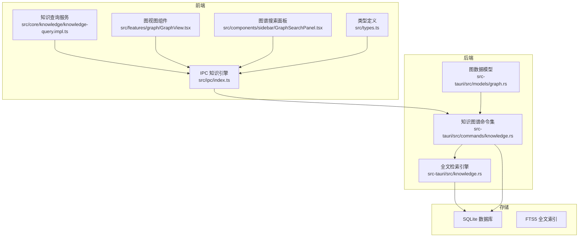
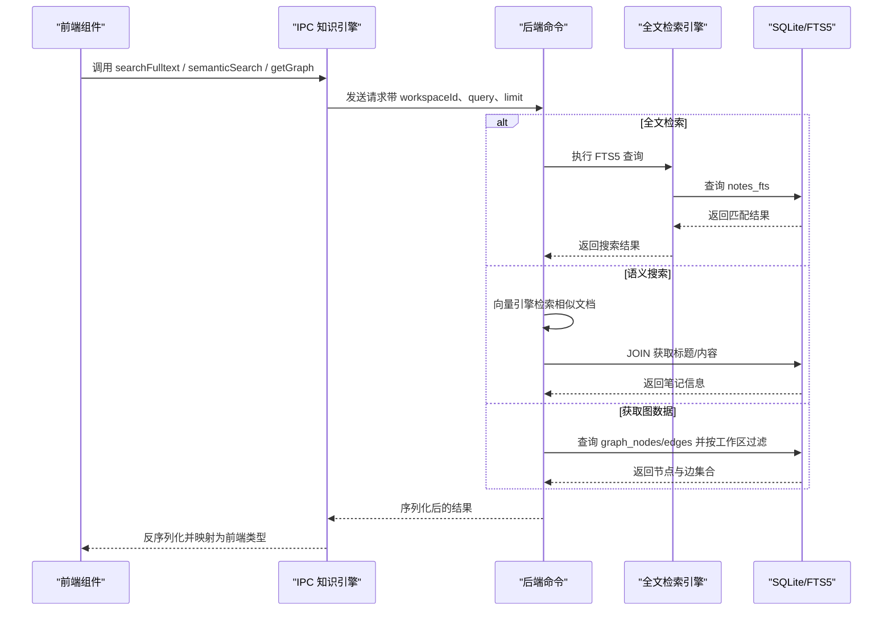
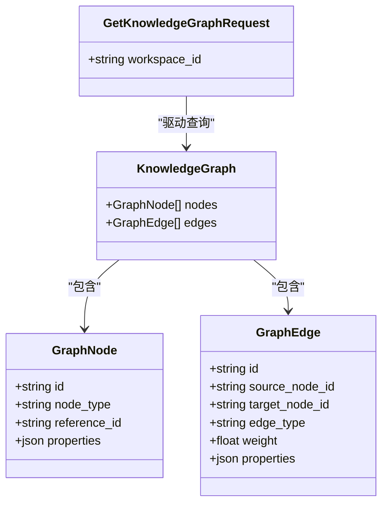
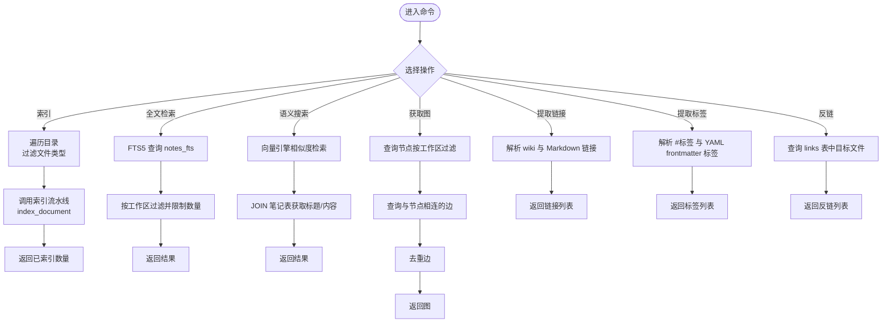
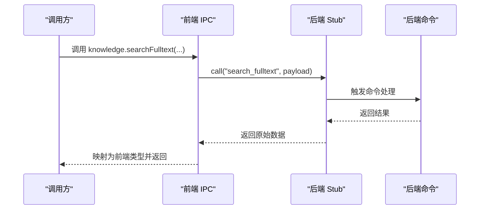
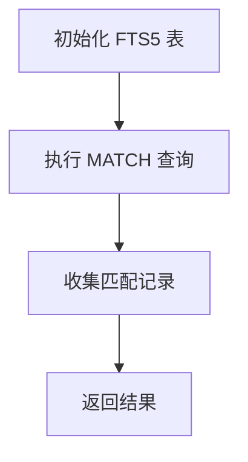
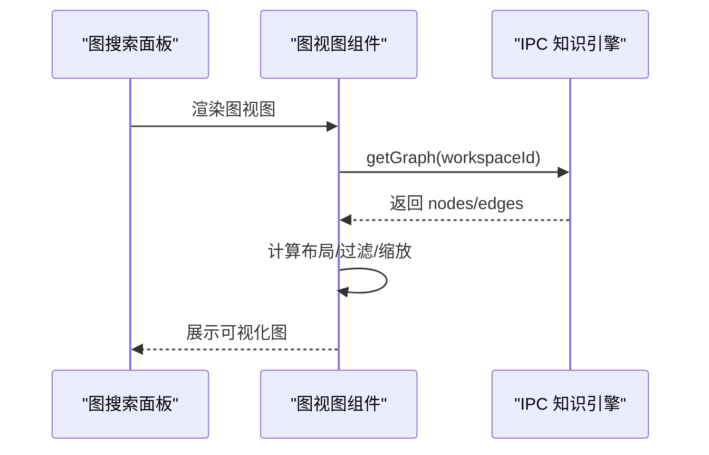
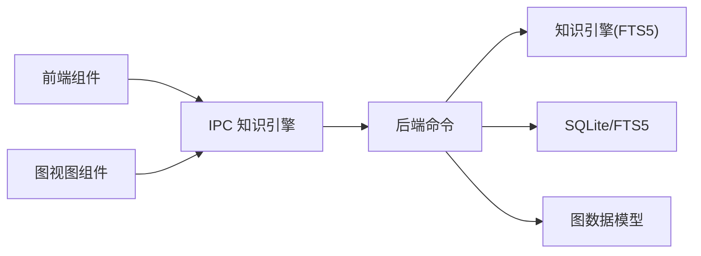

# 知识图谱API

<cite>
**本文引用的文件**
- [src-tauri/src/commands/knowledge.rs](file://src-tauri/src/commands/knowledge.rs)
- [src-tauri/src/knowledge.rs](file://src-tauri/src/knowledge.rs)
- [src-tauri/src/models/graph.rs](file://src-tauri/src/models/graph.rs)
- [src/ipc/index.ts](file://src/ipc/index.ts)
- [src/types.ts](file://src/types.ts)
- [src/core/knowledge/knowledge-query.impl.ts](file://src/core/knowledge/knowledge-query.impl.ts)
- [src/features/graph/GraphView.tsx](file://src/features/graph/GraphView.tsx)
- [src/components/sidebar/GraphSearchPanel.tsx](file://src/components/sidebar/GraphSearchPanel.tsx)
</cite>

## 目录
1. [简介](#简介)
2. [项目结构](#项目结构)
3. [核心组件](#核心组件)
4. [架构总览](#架构总览)
5. [详细组件分析](#详细组件分析)
6. [依赖分析](#依赖分析)
7. [性能考虑](#性能考虑)
8. [故障排查指南](#故障排查指南)
9. [结论](#结论)
10. [附录：API参考与集成指南](#附录api参考与集成指南)

## 简介
本文件面向NoteForge的知识图谱API，系统性阐述其架构设计、数据模型、查询接口与可视化能力，并提供可操作的集成指南与最佳实践。知识图谱围绕“笔记”“记忆”“概念”“智能体”等节点类型，通过“引用”“嵌入”“标签”“语义相似”等边关系，构建可检索、可分析、可可视化的知识网络。前端通过IPC调用后端命令，实现全文检索、语义搜索、图数据拉取与可视化展示。

## 项目结构
知识图谱能力由前端IPC层、后端Tauri命令层与SQLite/FTS5存储层协同完成；同时包含轻量级前端力导向图视图组件，用于交互式探索。

图表来源
- [src/ipc/index.ts:297-330](file://src/ipc/index.ts#L297-L330)
- [src-tauri/src/commands/knowledge.rs:1-305](file://src-tauri/src/commands/knowledge.rs#L1-L305)
- [src-tauri/src/knowledge.rs:1-75](file://src-tauri/src/knowledge.rs#L1-L75)
- [src-tauri/src/models/graph.rs:1-35](file://src-tauri/src/models/graph.rs#L1-L35)
- [src/features/graph/GraphView.tsx:1-118](file://src/features/graph/GraphView.tsx#L1-L118)
- [src/components/sidebar/GraphSearchPanel.tsx:1-30](file://src/components/sidebar/GraphSearchPanel.tsx#L1-L30)

章节来源
- [src/ipc/index.ts:297-330](file://src/ipc/index.ts#L297-L330)
- [src-tauri/src/commands/knowledge.rs:1-305](file://src-tauri/src/commands/knowledge.rs#L1-L305)
- [src-tauri/src/knowledge.rs:1-75](file://src-tauri/src/knowledge.rs#L1-L75)
- [src-tauri/src/models/graph.rs:1-35](file://src-tauri/src/models/graph.rs#L1-L35)
- [src/features/graph/GraphView.tsx:1-118](file://src/features/graph/GraphView.tsx#L1-L118)
- [src/components/sidebar/GraphSearchPanel.tsx:1-30](file://src/components/sidebar/GraphSearchPanel.tsx#L1-L30)

## 核心组件
- 前端IPC知识引擎：封装全文检索、语义搜索、图数据拉取、工作区索引等API，统一返回类型映射。
- 后端命令层：提供索引、全文检索、语义搜索、图数据查询、反链查询、链接/标签提取等命令。
- 全文检索引擎：基于SQLite FTS5虚拟表，提供高性能全文匹配与评分。
- 图数据模型：标准化节点与边结构，支持属性扩展与权重。
- 轻量图视图：前端SVG力导向布局，支持筛选、缩放与点击打开文件。

章节来源
- [src/ipc/index.ts:297-330](file://src/ipc/index.ts#L297-L330)
- [src-tauri/src/commands/knowledge.rs:1-305](file://src-tauri/src/commands/knowledge.rs#L1-L305)
- [src-tauri/src/knowledge.rs:1-75](file://src-tauri/src/knowledge.rs#L1-L75)
- [src-tauri/src/models/graph.rs:1-35](file://src-tauri/src/models/graph.rs#L1-L35)
- [src/features/graph/GraphView.tsx:1-118](file://src/features/graph/GraphView.tsx#L1-L118)

## 架构总览
下图展示了从前端到后端再到存储的整体流程，以及知识图谱命令如何组织数据并返回给前端。

图表来源
- [src/ipc/index.ts:297-330](file://src/ipc/index.ts#L297-L330)
- [src-tauri/src/commands/knowledge.rs:70-163](file://src-tauri/src/commands/knowledge.rs#L70-L163)
- [src-tauri/src/knowledge.rs:25-46](file://src-tauri/src/knowledge.rs#L25-L46)

## 详细组件分析

### 图数据模型与节点/边管理
- 节点（GraphNode）：包含唯一标识、节点类型、引用ID与任意JSON属性对象，便于扩展元数据。
- 边（GraphEdge）：包含唯一标识、源/目标节点ID、边类型、权重与属性对象。
- 知识图（KnowledgeGraph）：节点与边的聚合容器，用于前后端传输。
- 请求模型（GetKnowledgeGraphRequest）：以工作区ID作为上下文过滤图数据。

图表来源
- [src-tauri/src/models/graph.rs:3-28](file://src-tauri/src/models/graph.rs#L3-L28)
- [src-tauri/src/models/graph.rs:30-34](file://src-tauri/src/models/graph.rs#L30-L34)

章节来源
- [src-tauri/src/models/graph.rs:1-35](file://src-tauri/src/models/graph.rs#L1-L35)

### 命令层：图构建与查询
- 索引知识库（index_knowledge_base）：遍历指定路径下的文档，调用索引流水线写入图数据库。
- 全文检索（search_fulltext）：基于FTS5匹配查询，限制在当前工作区的笔记范围内。
- 语义搜索（semantic_search）：通过向量引擎检索相似文档，再JOIN笔记表获取标题与内容。
- 获取知识图（get_knowledge_graph）：按工作区过滤节点，查询与这些节点相连的边，去重后返回。
- 链接/标签提取（extract_links / extract_tags）：解析内容中的[[wiki链接]]、[Markdown链接]与#标签。
- 反链查询（get_backlinks）：查询某文件被哪些文件反链引用。

图表来源
- [src-tauri/src/commands/knowledge.rs:14-305](file://src-tauri/src/commands/knowledge.rs#L14-L305)

章节来源
- [src-tauri/src/commands/knowledge.rs:1-305](file://src-tauri/src/commands/knowledge.rs#L1-L305)

### 前端IPC与类型映射
- 知识引擎API：提供 indexWorkspace、searchFulltext、semanticSearch、getGraph 等方法，内部通过call与stub桥接到后端命令。
- 类型映射：前端类型（如GraphNode、GraphEdge、KnowledgeGraph）与后端模型保持字段对齐，IPC层负责序列化/反序列化与转换。

图表来源
- [src/ipc/index.ts:297-330](file://src/ipc/index.ts#L297-L330)

章节来源
- [src/ipc/index.ts:297-330](file://src/ipc/index.ts#L297-L330)
- [src/types.ts:139-204](file://src/types.ts#L139-L204)

### 全文检索引擎（FTS5）
- 初始化：首次使用时创建notes_fts虚拟表，使用unicode61分词器并移除变音符号。
- 搜索：执行MATCH查询，返回file_path、title、content与固定score。
- 索引/删除：支持按file_path删除或插入更新。

图表来源
- [src-tauri/src/knowledge.rs:9-46](file://src-tauri/src/knowledge.rs#L9-L46)

章节来源
- [src-tauri/src/knowledge.rs:1-75](file://src-tauri/src/knowledge.rs#L1-L75)

### 轻量图视图与交互
- 力导向布局：前端使用SVG绘制节点与边，内置斥力/引力参数，支持缩放与节点过滤。
- 数据来源：通过knowledge.getGraph拉取当前工作区的图数据，渲染为可交互视图。
- 交互行为：选中节点可触发打开文件等动作。

图表来源
- [src/components/sidebar/GraphSearchPanel.tsx:1-30](file://src/components/sidebar/GraphSearchPanel.tsx#L1-L30)
- [src/features/graph/GraphView.tsx:81-118](file://src/features/graph/GraphView.tsx#L81-L118)
- [src/ipc/index.ts:323-330](file://src/ipc/index.ts#L323-L330)

章节来源
- [src/features/graph/GraphView.tsx:1-118](file://src/features/graph/GraphView.tsx#L1-L118)
- [src/components/sidebar/GraphSearchPanel.tsx:1-30](file://src/components/sidebar/GraphSearchPanel.tsx#L1-L30)

## 依赖分析
- 前端依赖后端命令：所有知识图谱能力均通过IPC转发至后端命令处理。
- 后端依赖SQLite与FTS5：全文检索依赖notes_fts虚拟表；图数据查询依赖graph_nodes/edges表。
- 引擎与命令耦合：知识引擎封装FTS5逻辑，命令层协调引擎与数据库访问。
- 可视化依赖IPC：图视图组件直接依赖IPC提供的图数据API。

图表来源
- [src/ipc/index.ts:297-330](file://src/ipc/index.ts#L297-L330)
- [src-tauri/src/commands/knowledge.rs:1-305](file://src-tauri/src/commands/knowledge.rs#L1-L305)
- [src-tauri/src/knowledge.rs:1-75](file://src-tauri/src/knowledge.rs#L1-L75)
- [src-tauri/src/models/graph.rs:1-35](file://src-tauri/src/models/graph.rs#L1-L35)
- [src/features/graph/GraphView.tsx:1-118](file://src/features/graph/GraphView.tsx#L1-L118)

章节来源
- [src/ipc/index.ts:297-330](file://src/ipc/index.ts#L297-L330)
- [src-tauri/src/commands/knowledge.rs:1-305](file://src-tauri/src/commands/knowledge.rs#L1-L305)
- [src-tauri/src/knowledge.rs:1-75](file://src-tauri/src/knowledge.rs#L1-L75)
- [src-tauri/src/models/graph.rs:1-35](file://src-tauri/src/models/graph.rs#L1-L35)
- [src/features/graph/GraphView.tsx:1-118](file://src/features/graph/GraphView.tsx#L1-L118)

## 性能考虑
- 全文检索：FTS5具备高效匹配能力，建议合理设置limit并利用工作区过滤减少扫描范围。
- 图数据查询：先查节点再查边，最后去重，避免重复边带来的渲染与计算开销。
- 语义搜索：向量检索后进行少量JOIN，建议控制limit并缓存热点查询结果。
- 前端渲染：力导向布局复杂度与节点数近似平方，建议在节点规模较大时启用过滤与缩放策略。

## 故障排查指南
- 索引失败：检查路径是否存在与可读权限，确认索引命令返回值与错误日志。
- 全文检索无结果：确认FTS5表是否已初始化，查询语法是否符合FTS5规则。
- 图数据为空：确认工作区ID正确且节点/边存在，检查过滤条件与去重逻辑。
- 语义搜索异常：检查向量引擎可用性与文档ID一致性，确保JOIN条件正确。
- 反链查询异常：确认links表结构与索引，核对目标文件路径是否一致。

章节来源
- [src-tauri/src/commands/knowledge.rs:14-68](file://src-tauri/src/commands/knowledge.rs#L14-L68)
- [src-tauri/src/knowledge.rs:9-46](file://src-tauri/src/knowledge.rs#L9-L46)

## 结论
NoteForge的知识图谱API以清晰的前后端分层、稳定的SQLite/FTS5存储与简洁的图数据模型为基础，提供了从索引、检索到可视化的完整能力。通过IPC抽象与类型映射，前端可以稳定地消费后端能力；通过工作区上下文过滤与边去重，保证了图数据的准确性与性能。建议在大规模场景下结合过滤、缓存与缩放策略，持续优化用户体验。

## 附录：API参考与集成指南

### API参考
- 索引工作区
  - 方法：indexWorkspace(workspaceId, path)
  - 返回：number（已索引文档数）
  - 用途：批量索引指定路径下的文档
- 全文检索
  - 方法：searchFulltext(workspaceId, query, limit?)
  - 返回：SearchResult[]
  - 用途：基于FTS5的全文匹配
- 语义搜索
  - 方法：semanticSearch(workspaceId, query, limit?)
  - 返回：SemanticResult[]
  - 用途：基于向量相似度的语义匹配
- 获取知识图
  - 方法：getGraph(workspaceId)
  - 返回：{ nodes: GraphNode[], edges: GraphEdge[] }
  - 用途：按工作区过滤并返回图数据
- 提取链接
  - 方法：extractLinks({ content, file_path })
  - 返回：Link[]
  - 用途：解析wiki与Markdown链接
- 提取标签
  - 方法：extractTags({ content })
  - 返回：string[]
  - 用途：解析#标签与YAML frontmatter标签
- 反链查询
  - 方法：getBacklinks({ file_path })
  - 返回：Backlink[]
  - 用途：查询某文件被哪些文件反链引用

章节来源
- [src/ipc/index.ts:297-330](file://src/ipc/index.ts#L297-L330)
- [src-tauri/src/commands/knowledge.rs:14-305](file://src-tauri/src/commands/knowledge.rs#L14-L305)
- [src/types.ts:139-204](file://src/types.ts#L139-L204)

### 数据模型参考
- GraphNode
  - 字段：id, node_type, reference_id, properties
- GraphEdge
  - 字段：id, source_node_id, target_node_id, edge_type, weight, properties
- KnowledgeGraph
  - 字段：nodes[], edges[]
- 请求模型
  - GetKnowledgeGraphRequest：workspace_id

章节来源
- [src-tauri/src/models/graph.rs:3-28](file://src-tauri/src/models/graph.rs#L3-L28)
- [src-tauri/src/models/graph.rs:30-34](file://src-tauri/src/models/graph.rs#L30-L34)

### 集成指南
- 前端集成
  - 使用知识引擎API进行检索与图数据拉取，注意传入正确的workspaceId。
  - 在图视图组件中调用getGraph并绑定过滤/缩放逻辑。
  - 对高频查询进行本地缓存，避免重复请求。
- 后端集成
  - 确保SQLite连接与FTS5表初始化成功。
  - 在索引流程中处理文件类型过滤与内容清洗。
  - 对图数据查询增加必要的索引与去重步骤，保障性能与一致性。