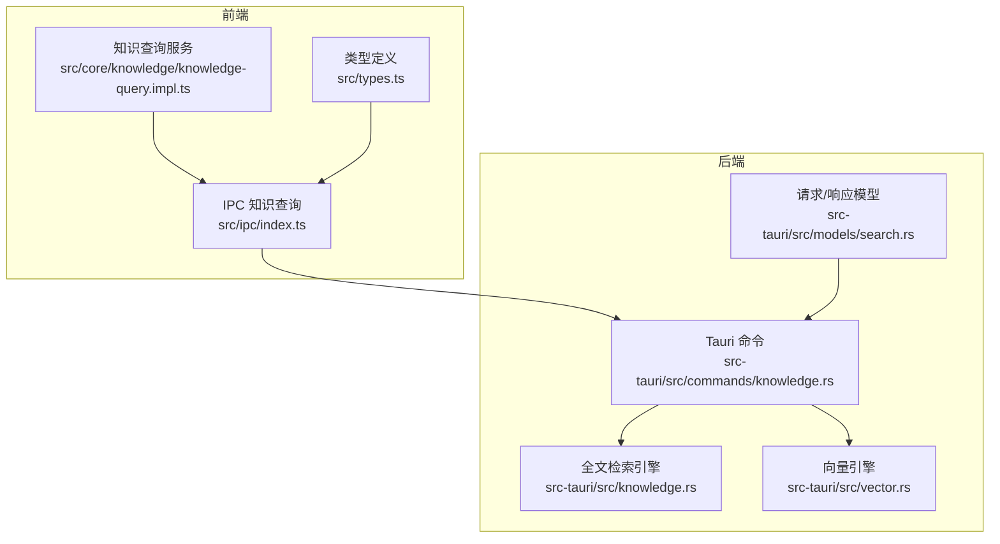
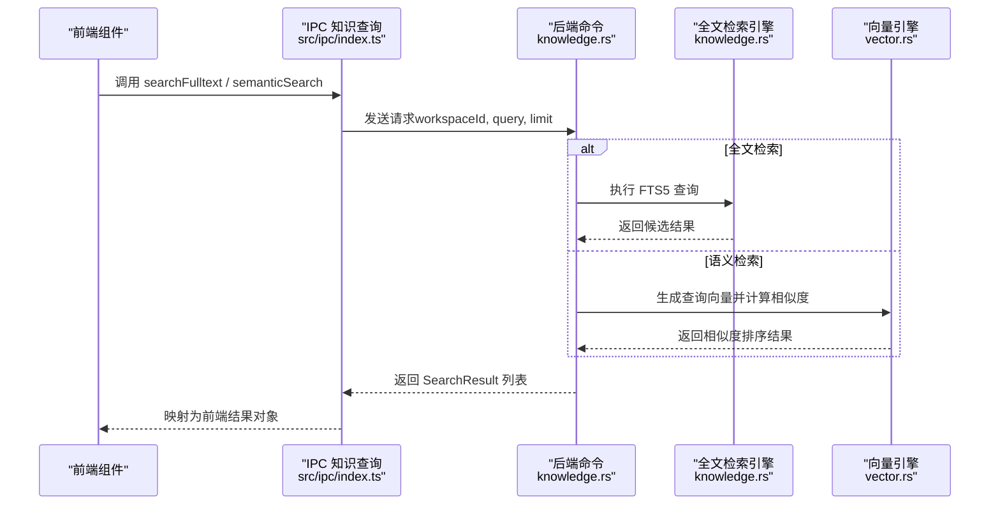
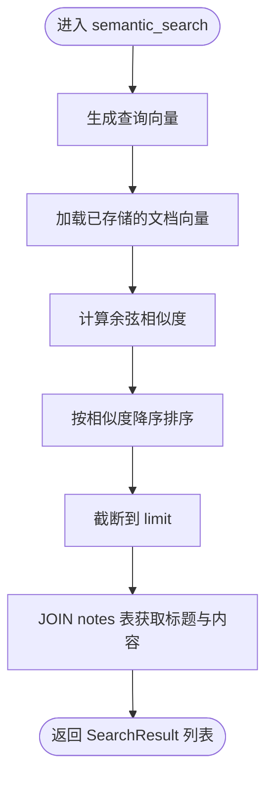
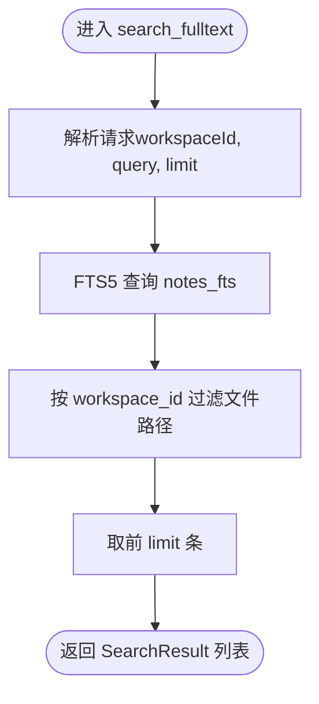
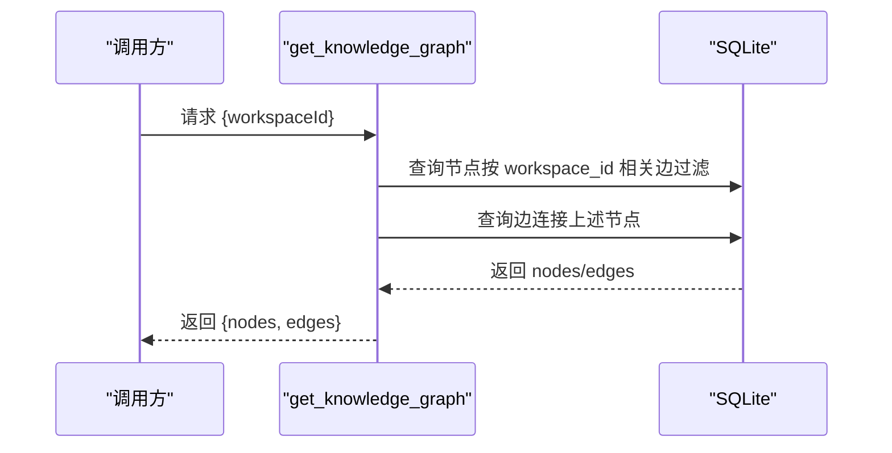
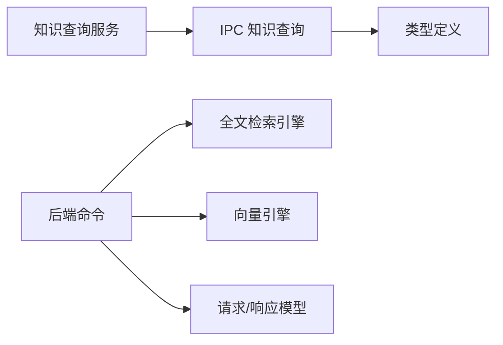

# 知识查询API

<cite>
**本文引用的文件**
- [src/ipc/index.ts](file://src/ipc/index.ts)
- [src/ipc/stub.ts](file://src/ipc/stub.ts)
- [src/types.ts](file://src/types.ts)
- [src/core/knowledge/knowledge-query.impl.ts](file://src/core/knowledge/knowledge-query.impl.ts)
- [src-tauri/src/commands/knowledge.rs](file://src-tauri/src/commands/knowledge.rs)
- [src-tauri/src/knowledge.rs](file://src-tauri/src/knowledge.rs)
- [src-tauri/src/vector.rs](file://src-tauri/src/vector.rs)
- [src-tauri/src/models/search.rs](file://src-tauri/src/models/search.rs)
- [.tmp/system-architecture-design.md](file://.tmp/system-architecture-design.md)
</cite>

## 目录
1. [简介](#简介)
2. [项目结构](#项目结构)
3. [核心组件](#核心组件)
4. [架构总览](#架构总览)
5. [详细组件分析](#详细组件分析)
6. [依赖关系分析](#依赖关系分析)
7. [性能考虑](#性能考虑)
8. [故障排查指南](#故障排查指南)
9. [结论](#结论)
10. [附录](#附录)

## 简介
本文件为 NoteForge 的“知识查询 API”技术文档，覆盖以下能力与规范：
- 全文检索（关键词匹配）
- 语义检索（向量相似度）
- 结构化查询与过滤（标签、时间线、反链）
- 图谱查询（知识图谱节点与边）
- 查询参数定义（关键词、范围、排序、分页）
- 查询结果数据格式与元数据
- 典型调用示例与高级过滤策略
- 性能优化与缓存建议
- 错误处理与异常响应

NoteForge 的前端通过 IPC 将请求转发至 Rust 后端命令，后端结合 SQLite FTS5、向量引擎与图存储完成检索与图谱构建。

## 项目结构
围绕知识查询的关键模块分布如下：
- 前端 IPC 层：封装知识查询命令、参数与结果转换
- 前端类型层：定义查询结果与图谱数据结构
- 后端命令层：暴露 Tauri 命令，接收请求并调用引擎
- 引擎层：全文检索引擎（FTS5）、向量引擎（fastembed）
- 模型层：请求/响应数据模型（Rust）

图表来源
- [src/ipc/index.ts:297-330](file://src/ipc/index.ts#L297-L330)
- [src/types.ts:139-204](file://src/types.ts#L139-L204)
- [src/core/knowledge/knowledge-query.impl.ts:41-148](file://src/core/knowledge/knowledge-query.impl.ts#L41-L148)
- [src-tauri/src/commands/knowledge.rs:14-305](file://src-tauri/src/commands/knowledge.rs#L14-L305)
- [src-tauri/src/knowledge.rs:5-75](file://src-tauri/src/knowledge.rs#L5-L75)
- [src-tauri/src/vector.rs:7-151](file://src-tauri/src/vector.rs#L7-L151)
- [src-tauri/src/models/search.rs:1-63](file://src-tauri/src/models/search.rs#L1-L63)

章节来源
- [src/ipc/index.ts:297-330](file://src/ipc/index.ts#L297-L330)
- [src/types.ts:139-204](file://src/types.ts#L139-L204)
- [src/core/knowledge/knowledge-query.impl.ts:41-148](file://src/core/knowledge/knowledge-query.impl.ts#L41-L148)
- [src-tauri/src/commands/knowledge.rs:14-305](file://src-tauri/src/commands/knowledge.rs#L14-L305)
- [src-tauri/src/knowledge.rs:5-75](file://src-tauri/src/knowledge.rs#L5-L75)
- [src-tauri/src/vector.rs:7-151](file://src-tauri/src/vector.rs#L7-L151)
- [src-tauri/src/models/search.rs:1-63](file://src-tauri/src/models/search.rs#L1-L63)

## 核心组件
- 知识查询 IPC 接口：提供全文检索、语义检索、知识图谱查询等方法，并负责将后端返回的 snake_case 结果映射为前端 camelCase 结构。
- 类型系统：统一前后端数据结构，包含搜索结果、语义结果、图节点/边等。
- 后端命令：将前端请求解析为 Rust 请求模型，调用引擎执行查询。
- 引擎与向量：FTS5 实现全文检索；向量引擎基于 fastembed 计算余弦相似度。
- 知识查询服务：封装 wiki 链接解析、反链、标题索引等能力，供前端 UI 使用。

章节来源
- [src/ipc/index.ts:297-330](file://src/ipc/index.ts#L297-L330)
- [src/types.ts:139-204](file://src/types.ts#L139-L204)
- [src-tauri/src/commands/knowledge.rs:70-269](file://src-tauri/src/commands/knowledge.rs#L70-L269)
- [src-tauri/src/knowledge.rs:25-46](file://src-tauri/src/knowledge.rs#L25-L46)
- [src-tauri/src/vector.rs:57-118](file://src-tauri/src/vector.rs#L57-L118)
- [src/core/knowledge/knowledge-query.impl.ts:41-148](file://src/core/knowledge/knowledge-query.impl.ts#L41-L148)

## 架构总览
下图展示从前端到后端再到引擎的整体调用链路与数据流向。

图表来源
- [src/ipc/index.ts:307-322](file://src/ipc/index.ts#L307-L322)
- [src-tauri/src/commands/knowledge.rs:70-269](file://src-tauri/src/commands/knowledge.rs#L70-L269)
- [src-tauri/src/knowledge.rs:25-46](file://src-tauri/src/knowledge.rs#L25-L46)
- [src-tauri/src/vector.rs:57-118](file://src-tauri/src/vector.rs#L57-L118)

## 详细组件分析

### API 规范与参数
- 全文检索
  - 方法：search_fulltext
  - 请求参数：workspaceId（工作区 ID）、query（查询字符串）、limit（可选，限制返回条数）
  - 响应：SearchResult 数组
- 语义检索
  - 方法：semantic_search
  - 请求参数：workspaceId、query、limit
  - 响应：SearchResult 数组（语义检索结果包含相似度字段）
- 知识图谱
  - 方法：get_knowledge_graph
  - 请求参数：workspaceId
  - 响应：{ nodes: GraphNode[], edges: GraphEdge[] }
- 反链
  - 方法：get_backlinks
  - 请求参数：filePath
  - 响应：Backlink 数组
- 标签提取与过滤
  - 提取标签：extract_tags
  - 获取标签统计：get_tags
  - 按标签过滤：filter_by_tags

章节来源
- [.tmp/system-architecture-design.md:206-260](file://.tmp/system-architecture-design.md#L206-L260)
- [src-tauri/src/models/search.rs:14-63](file://src-tauri/src/models/search.rs#L14-L63)
- [src-tauri/src/commands/knowledge.rs:14-305](file://src-tauri/src/commands/knowledge.rs#L14-L305)

### 查询参数定义
- 关键词匹配
  - 支持 FTS5 语法（布尔、短语、通配），具体行为由 FTS5 tokenizer 决定
- 范围筛选
  - 通过 workspaceId 限定结果集仅来自指定工作区
  - 时间范围可通过 get_timeline（按创建时间）进行筛选
- 排序规则
  - 全文检索：默认按 FTS5 匹配度排序
  - 语义检索：按余弦相似度降序
- 分页机制
  - 通过 limit 参数控制返回数量
  - 前端可自行实现游标或偏移分页（如需）

章节来源
- [src-tauri/src/commands/knowledge.rs:70-92](file://src-tauri/src/commands/knowledge.rs#L70-L92)
- [src-tauri/src/commands/knowledge.rs:232-269](file://src-tauri/src/commands/knowledge.rs#L232-L269)
- [.tmp/system-architecture-design.md:932-939](file://.tmp/system-architecture-design.md#L932-L939)

### 查询结果数据格式与元数据
- SearchResult
  - 字段：filePath、title、snippet、score、tags（可选）
- SemanticResult
  - 在 SearchResult 基础上增加 similarity 字段
- GraphNode / GraphEdge
  - 节点与边的属性、权重、类型等
- Backlink
  - 源文件路径、源标题、上下文片段

章节来源
- [src/types.ts:141-175](file://src/types.ts#L141-L175)
- [src/types.ts:177-204](file://src/types.ts#L177-L204)
- [.tmp/system-architecture-design.md:206-247](file://.tmp/system-architecture-design.md#L206-L247)

### API 调用示例（场景化）
- 简单搜索
  - 全文：传入 workspaceId、query、limit=30
  - 语义：传入 workspaceId、query、limit=30
- 复合查询
  - 先做全文检索，再对结果集做标签过滤（前端自行组合）
- 高级过滤
  - 按标签过滤：先 get_tags 获取热门标签，再 filter_by_tags 进行筛选
  - 按时间范围：get_timeline(start_date?, end_date?) 获取时间线

章节来源
- [.tmp/system-architecture-design.md:206-260](file://.tmp/system-architecture-design.md#L206-L260)
- [src-tauri/src/commands/knowledge.rs:94-163](file://src-tauri/src/commands/knowledge.rs#L94-L163)
- [src-tauri/src/commands/knowledge.rs:210-229](file://src-tauri/src/commands/knowledge.rs#L210-L229)
- [src-tauri/src/commands/knowledge.rs:232-269](file://src-tauri/src/commands/knowledge.rs#L232-L269)

### 语义检索流程（后端）

图表来源
- [src-tauri/src/commands/knowledge.rs:232-269](file://src-tauri/src/commands/knowledge.rs#L232-L269)
- [src-tauri/src/vector.rs:57-118](file://src-tauri/src/vector.rs#L57-L118)

### 全文检索流程（后端）

图表来源
- [src-tauri/src/commands/knowledge.rs:70-92](file://src-tauri/src/commands/knowledge.rs#L70-L92)
- [src-tauri/src/knowledge.rs:25-46](file://src-tauri/src/knowledge.rs#L25-L46)

### 知识图谱查询流程

图表来源
- [src-tauri/src/commands/knowledge.rs:94-163](file://src-tauri/src/commands/knowledge.rs#L94-L163)

## 依赖关系分析
- 前端依赖
  - IPC 层依赖类型定义与 stub 实现
  - 知识查询服务依赖 IPC 与工作区状态
- 后端依赖
  - 命令层依赖引擎与模型
  - 引擎依赖 SQLite 与 fastembed
- 耦合与内聚
  - IPC 与命令层职责清晰，耦合度低
  - 引擎与命令层通过模型解耦

图表来源
- [src/ipc/index.ts:297-330](file://src/ipc/index.ts#L297-L330)
- [src/types.ts:139-204](file://src/types.ts#L139-L204)
- [src/core/knowledge/knowledge-query.impl.ts:41-148](file://src/core/knowledge/knowledge-query.impl.ts#L41-L148)
- [src-tauri/src/commands/knowledge.rs:14-305](file://src-tauri/src/commands/knowledge.rs#L14-L305)
- [src-tauri/src/knowledge.rs:5-75](file://src-tauri/src/knowledge.rs#L5-L75)
- [src-tauri/src/vector.rs:7-151](file://src-tauri/src/vector.rs#L7-L151)
- [src-tauri/src/models/search.rs:1-63](file://src-tauri/src/models/search.rs#L1-L63)

## 性能考虑
- 全文检索
  - FTS5 使用 unicode61 分词器，适合多语言；建议合理设置 limit，避免大结果集传输
- 语义检索
  - 向量相似度计算在内存中进行，建议控制 limit 与文档数量；可考虑延迟初始化 embedding 模型
- 混合检索（概念）
  - 文档设计支持并行执行全文与语义检索，融合去重与重排；实际实现可参考混合检索流程描述
- 缓存机制
  - 建议在前端缓存热门查询结果与标签统计
  - 后端可缓存常用向量或热点文档的 embedding（需评估内存占用）
- I/O 与序列化
  - 向量存储采用 JSON 序列化，注意大数组的序列化开销；可评估二进制存储方案

章节来源
- [.tmp/system-architecture-design.md:880-903](file://.tmp/system-architecture-design.md#L880-L903)
- [src-tauri/src/vector.rs:130-144](file://src-tauri/src/vector.rs#L130-L144)

## 故障排查指南
- 常见错误
  - 路径不存在：索引时若根路径不存在会返回未找到错误
  - 向量搜索失败：embedding 生成或 JSON 序列化异常
  - 查询为空：空查询或无匹配结果
- 建议排查步骤
  - 确认 workspaceId 正确且对应的工作区存在
  - 检查索引是否已完成（reindexAll 或前端触发的索引流程）
  - 对于语义检索，确认向量模型可用且 embedding 已生成
  - 查看后端日志定位具体命令错误

章节来源
- [src-tauri/src/commands/knowledge.rs:14-68](file://src-tauri/src/commands/knowledge.rs#L14-L68)
- [src-tauri/src/vector.rs:36-54](file://src-tauri/src/vector.rs#L36-L54)

## 结论
NoteForge 的知识查询 API 通过 IPC 将前端请求路由至 Rust 后端，结合 FTS5 与向量引擎实现关键词与语义双通道检索，并提供标签、时间线与反链等结构化能力。前端类型系统与后端模型保持一致，便于扩展与维护。建议在生产环境中引入缓存与限流策略，并持续优化向量检索性能。

## 附录

### API 定义速览
- search_fulltext
  - 请求：{ workspaceId, query, limit? }
  - 响应：SearchResult[]
- semantic_search
  - 请求：{ workspaceId, query, limit? }
  - 响应：SearchResult[]（语义检索结果包含 similarity）
- get_knowledge_graph
  - 请求：{ workspaceId }
  - 响应：{ nodes: GraphNode[], edges: GraphEdge[] }
- get_backlinks
  - 请求：{ filePath }
  - 响应：Backlink[]
- extract_tags / get_tags / filter_by_tags
  - 请求：extract_tags({ content }) / get_tags({ workspaceId }) / filter_by_tags({ workspaceId, tags[] })
  - 响应：string[] / TagCount[] / FileEntry[]

章节来源
- [.tmp/system-architecture-design.md:206-260](file://.tmp/system-architecture-design.md#L206-L260)
- [src-tauri/src/models/search.rs:14-63](file://src-tauri/src/models/search.rs#L14-L63)
- [src-tauri/src/commands/knowledge.rs:165-230](file://src-tauri/src/commands/knowledge.rs#L165-L230)