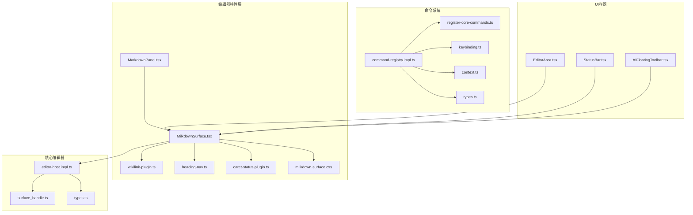
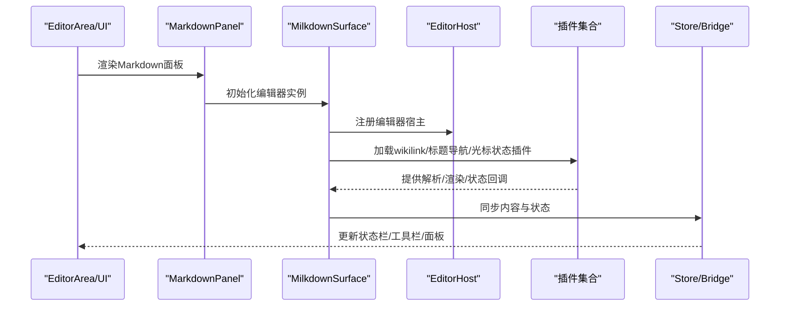
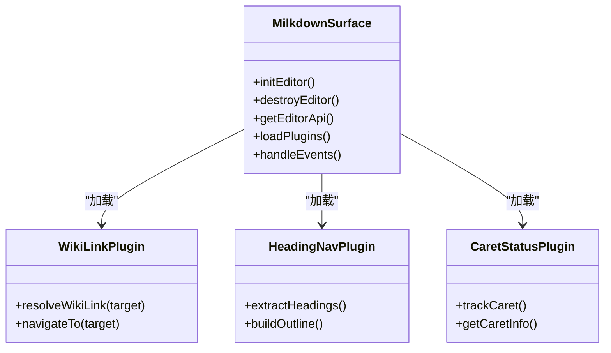
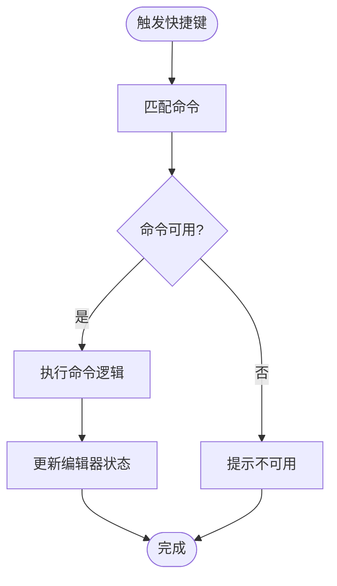
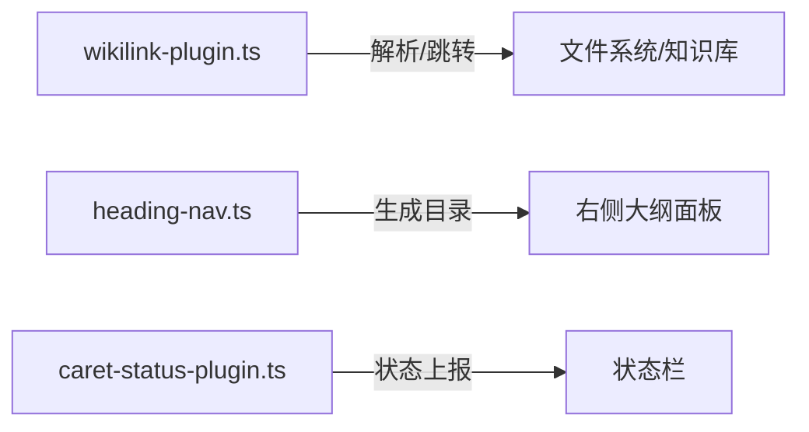
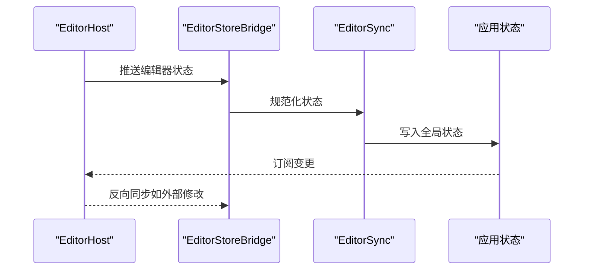
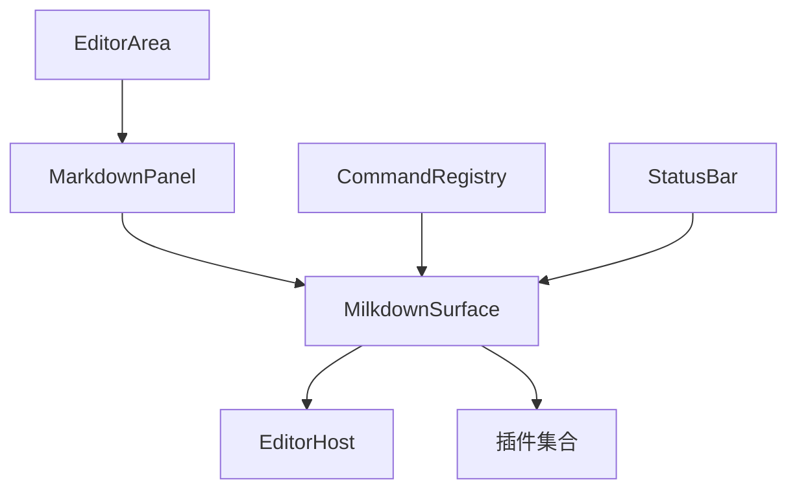

# Markdown编辑器API

<cite>
**本文档引用的文件**
- [MilkdownSurface.tsx](file://src/features/markdown/MilkdownSurface.tsx)
- [wikilink-plugin.ts](file://src/features/markdown/wikilink-plugin.ts)
- [heading-nav.ts](file://src/features/markdown/heading-nav.ts)
- [caret-status-plugin.ts](file://src/features/markdown/caret-status-plugin.ts)
- [MarkdownPanel.tsx](file://src/features/markdown/MarkdownPanel.tsx)
- [milkdown-surface.css](file://src/features/markdown/milkdown-surface.css)
- [editor-host.impl.ts](file://src/core/editor/editor-host.impl.ts)
- [surface_handle.ts](file://src/core/editor/surface_handle.ts)
- [types.ts](file://src/core/editor/types.ts)
- [command-registry.impl.ts](file://src/core/command/command-registry.impl.ts)
- [register-core-commands.ts](file://src/core/command/register-core-commands.ts)
- [keybinding.ts](file://src/core/command/keybinding.ts)
- [context.ts](file://src/core/command/context.ts)
- [types.ts](file://src/core/command/types.ts)
- [editor-store-bridge.ts](file://src/core/bridge/editor-store-bridge.ts)
- [editor-sync.ts](file://src/core/bridge/editor-sync.ts)
- [EditorArea.tsx](file://src/components/editor/EditorArea.tsx)
- [StatusBar.tsx](file://src/components/editor/StatusBar.tsx)
- [AIFloatingToolbar.tsx](file://src/components/editor/AIFloatingToolbar.tsx)
- [App.tsx](file://src/App.tsx)
- [main.tsx](file://src/main.tsx)
</cite>

## 目录
1. [简介](#简介)
2. [项目结构](#项目结构)
3. [核心组件](#核心组件)
4. [架构总览](#架构总览)
5. [详细组件分析](#详细组件分析)
6. [依赖关系分析](#依赖关系分析)
7. [性能考虑](#性能考虑)
8. [故障排除指南](#故障排除指南)
9. [结论](#结论)
10. [附录](#附录)

## 简介
本文件为NoteForge的Markdown编辑器API提供全面的技术文档，重点围绕基于Milkdown的编辑器集成与使用展开，涵盖Markdown解析、渲染与编辑流程；编辑器命令体系（文本格式化、链接插入、列表操作等）；插件系统设计（wikilink插件、标题导航、光标状态管理）；以及编辑器API的集成示例（自定义插件开发、编辑器配置与事件处理）。文档旨在帮助开发者快速理解并高效扩展NoteForge的Markdown编辑能力。

## 项目结构
NoteForge的Markdown编辑器相关代码主要位于以下位置：
- 编辑器界面与插件：src/features/markdown/*.tsx/ts
- 编辑器宿主与桥接：src/core/editor/* 与 src/core/bridge/*
- 命令系统：src/core/command/*
- 编辑器UI容器：src/components/editor/*

**图表来源**
- [MarkdownPanel.tsx](file://src/features/markdown/MarkdownPanel.tsx)
- [MilkdownSurface.tsx](file://src/features/markdown/MilkdownSurface.tsx)
- [wikilink-plugin.ts](file://src/features/markdown/wikilink-plugin.ts)
- [heading-nav.ts](file://src/features/markdown/heading-nav.ts)
- [caret-status-plugin.ts](file://src/features/markdown/caret-status-plugin.ts)
- [milkdown-surface.css](file://src/features/markdown/milkdown-surface.css)
- [editor-host.impl.ts](file://src/core/editor/editor-host.impl.ts)
- [surface_handle.ts](file://src/core/editor/surface_handle.ts)
- [types.ts](file://src/core/editor/types.ts)
- [command-registry.impl.ts](file://src/core/command/command-registry.impl.ts)
- [register-core-commands.ts](file://src/core/command/register-core-commands.ts)
- [keybinding.ts](file://src/core/command/keybinding.ts)
- [context.ts](file://src/core/command/context.ts)
- [types.ts](file://src/core/command/types.ts)
- [EditorArea.tsx](file://src/components/editor/EditorArea.tsx)
- [StatusBar.tsx](file://src/components/editor/StatusBar.tsx)
- [AIFloatingToolbar.tsx](file://src/components/editor/AIFloatingToolbar.tsx)

**章节来源**
- [MilkdownSurface.tsx](file://src/features/markdown/MilkdownSurface.tsx)
- [MarkdownPanel.tsx](file://src/features/markdown/MarkdownPanel.tsx)
- [editor-host.impl.ts](file://src/core/editor/editor-host.impl.ts)
- [command-registry.impl.ts](file://src/core/command/command-registry.impl.ts)

## 核心组件
- 编辑器表面（MilkdownSurface）：负责初始化Milkdown编辑器实例、加载插件、绑定DOM容器与事件，并暴露编辑器API供上层调用。
- 插件集合：
  - wikilink插件：解析与渲染wiki链接，支持点击跳转与解析目标路径。
  - 标题导航插件：提取文档标题，生成可导航的目录树。
  - 光标状态插件：跟踪光标位置、选区信息，用于状态栏与工具栏联动。
- 编辑器宿主与桥接：提供编辑器生命周期管理、状态同步与跨模块通信。
- 命令系统：注册核心命令（如加粗、斜体、链接、列表等），绑定快捷键，统一上下文环境。

**章节来源**
- [MilkdownSurface.tsx](file://src/features/markdown/MilkdownSurface.tsx)
- [wikilink-plugin.ts](file://src/features/markdown/wikilink-plugin.ts)
- [heading-nav.ts](file://src/features/markdown/heading-nav.ts)
- [caret-status-plugin.ts](file://src/features/markdown/caret-status-plugin.ts)
- [editor-host.impl.ts](file://src/core/editor/editor-host.impl.ts)
- [editor-store-bridge.ts](file://src/core/bridge/editor-store-bridge.ts)
- [editor-sync.ts](file://src/core/bridge/editor-sync.ts)
- [command-registry.impl.ts](file://src/core/command/command-registry.impl.ts)
- [register-core-commands.ts](file://src/core/command/register-core-commands.ts)

## 架构总览
下图展示了从UI到编辑器内核、再到插件系统的整体交互：

**图表来源**
- [EditorArea.tsx](file://src/components/editor/EditorArea.tsx)
- [MarkdownPanel.tsx](file://src/features/markdown/MarkdownPanel.tsx)
- [MilkdownSurface.tsx](file://src/features/markdown/MilkdownSurface.tsx)
- [editor-host.impl.ts](file://src/core/editor/editor-host.impl.ts)
- [editor-store-bridge.ts](file://src/core/bridge/editor-store-bridge.ts)
- [editor-sync.ts](file://src/core/bridge/editor-sync.ts)

## 详细组件分析

### MilkdownSurface 组件
职责与实现要点：
- 负责创建与销毁Milkdown编辑器实例，挂载DOM容器。
- 集成插件：wikilink、标题导航、光标状态管理。
- 暴露编辑器API（如执行命令、获取文档、设置内容等）给上层组件使用。
- 处理编辑器事件（输入、焦点、滚动、粘贴等）并转发至桥接层或状态管理。

**图表来源**
- [MilkdownSurface.tsx](file://src/features/markdown/MilkdownSurface.tsx)
- [wikilink-plugin.ts](file://src/features/markdown/wikilink-plugin.ts)
- [heading-nav.ts](file://src/features/markdown/heading-nav.ts)
- [caret-status-plugin.ts](file://src/features/markdown/caret-status-plugin.ts)

**章节来源**
- [MilkdownSurface.tsx](file://src/features/markdown/MilkdownSurface.tsx)

### 命令系统与快捷键
- 命令注册：集中于命令注册实现，定义命令名称、执行函数、可用性判断与上下文。
- 核心命令：包含文本格式化（加粗、斜体、行内代码、删除线）、块级元素（标题、引用、代码块）、列表（有序/无序）、链接插入、任务清单等。
- 快捷键绑定：将命令与键盘组合键关联，支持跨平台一致的编辑体验。
- 上下文：命令在不同节点类型、选区范围下的可用性由上下文决定。

**图表来源**
- [command-registry.impl.ts](file://src/core/command/command-registry.impl.ts)
- [register-core-commands.ts](file://src/core/command/register-core-commands.ts)
- [keybinding.ts](file://src/core/command/keybinding.ts)
- [context.ts](file://src/core/command/context.ts)

**章节来源**
- [command-registry.impl.ts](file://src/core/command/command-registry.impl.ts)
- [register-core-commands.ts](file://src/core/command/register-core-commands.ts)
- [keybinding.ts](file://src/core/command/keybinding.ts)
- [context.ts](file://src/core/command/context.ts)
- [types.ts](file://src/core/command/types.ts)

### 插件系统设计
- wikilink插件：解析形如[[目标]]的wiki链接，提供解析与跳转能力，支持与知识库/文件系统对接。
- 标题导航插件：扫描文档中的标题层级，构建可点击的目录树，支持滚动定位与高亮当前标题。
- 光标状态插件：监听光标移动与选区变化，输出坐标、行号、列号、选区长度等信息，驱动状态栏显示与工具栏启用状态。

**图表来源**
- [wikilink-plugin.ts](file://src/features/markdown/wikilink-plugin.ts)
- [heading-nav.ts](file://src/features/markdown/heading-nav.ts)
- [caret-status-plugin.ts](file://src/features/markdown/caret-status-plugin.ts)
- [StatusBar.tsx](file://src/components/editor/StatusBar.tsx)

**章节来源**
- [wikilink-plugin.ts](file://src/features/markdown/wikilink-plugin.ts)
- [heading-nav.ts](file://src/features/markdown/heading-nav.ts)
- [caret-status-plugin.ts](file://src/features/markdown/caret-status-plugin.ts)

### 编辑器宿主与桥接
- 编辑器宿主：封装编辑器生命周期、事件分发与状态管理，向上提供统一接口。
- 状态桥接：将编辑器内部状态（内容、光标、选区、脏标记）与应用全局状态进行双向同步。
- 同步策略：采用增量更新与去抖动机制，避免频繁重绘与性能问题。

**图表来源**
- [editor-host.impl.ts](file://src/core/editor/editor-host.impl.ts)
- [surface_handle.ts](file://src/core/editor/surface_handle.ts)
- [types.ts](file://src/core/editor/types.ts)
- [editor-store-bridge.ts](file://src/core/bridge/editor-store-bridge.ts)
- [editor-sync.ts](file://src/core/bridge/editor-sync.ts)

**章节来源**
- [editor-host.impl.ts](file://src/core/editor/editor-host.impl.ts)
- [surface_handle.ts](file://src/core/editor/surface_handle.ts)
- [types.ts](file://src/core/editor/types.ts)
- [editor-store-bridge.ts](file://src/core/bridge/editor-store-bridge.ts)
- [editor-sync.ts](file://src/core/bridge/editor-sync.ts)

### Markdown编辑器API集成示例
- 自定义插件开发：参考现有插件模式，实现解析、渲染与交互逻辑，通过编辑器实例加载。
- 编辑器配置：通过编辑器宿主提供的配置入口设置主题、语言、插件顺序与默认行为。
- 事件处理：订阅编辑器事件（如内容变更、光标移动、焦点切换），结合桥接层更新UI与状态栏。
- 命令扩展：新增命令并在注册中心注册，绑定快捷键与上下文，确保在不同场景下正确启用。

**章节来源**
- [MilkdownSurface.tsx](file://src/features/markdown/MilkdownSurface.tsx)
- [editor-host.impl.ts](file://src/core/editor/editor-host.impl.ts)
- [command-registry.impl.ts](file://src/core/command/command-registry.impl.ts)
- [register-core-commands.ts](file://src/core/command/register-core-commands.ts)

## 依赖关系分析
- 组件耦合：MarkdownPanel作为容器，依赖MilkdownSurface；MilkdownSurface依赖编辑器宿主与插件；命令系统独立但被Surface与UI共同使用。
- 外部依赖：Milkdown为核心渲染引擎，插件围绕其扩展；UI组件通过桥接层与编辑器状态解耦。
- 循环依赖：当前结构未见循环依赖迹象，职责边界清晰。

**图表来源**
- [MarkdownPanel.tsx](file://src/features/markdown/MarkdownPanel.tsx)
- [MilkdownSurface.tsx](file://src/features/markdown/MilkdownSurface.tsx)
- [editor-host.impl.ts](file://src/core/editor/editor-host.impl.ts)
- [command-registry.impl.ts](file://src/core/command/command-registry.impl.ts)
- [EditorArea.tsx](file://src/components/editor/EditorArea.tsx)
- [StatusBar.tsx](file://src/components/editor/StatusBar.tsx)

**章节来源**
- [MarkdownPanel.tsx](file://src/features/markdown/MarkdownPanel.tsx)
- [MilkdownSurface.tsx](file://src/features/markdown/MilkdownSurface.tsx)
- [command-registry.impl.ts](file://src/core/command/command-registry.impl.ts)

## 性能考虑
- 插件加载：按需加载与懒初始化，避免一次性加载过多插件导致首帧延迟。
- 状态同步：采用节流/去抖策略，减少高频事件对UI与存储的压力。
- DOM更新：利用虚拟DOM与最小化重绘，避免不必要的全量刷新。
- 渲染优化：对长文档采用分段渲染与懒加载策略，提升滚动与交互流畅度。

## 故障排除指南
- 编辑器不响应：检查Surface是否成功初始化、插件是否正确加载、事件监听是否绑定。
- 命令不可用：确认命令上下文判断逻辑、快捷键冲突与命令注册顺序。
- 状态不同步：核查桥接层的状态写入与订阅流程，确保无遗漏字段。
- 样式异常：检查CSS覆盖与主题变量，确保插件样式与全局主题兼容。

**章节来源**
- [MilkdownSurface.tsx](file://src/features/markdown/MilkdownSurface.tsx)
- [editor-store-bridge.ts](file://src/core/bridge/editor-store-bridge.ts)
- [editor-sync.ts](file://src/core/bridge/editor-sync.ts)
- [milkdown-surface.css](file://src/features/markdown/milkdown-surface.css)

## 结论
NoteForge的Markdown编辑器以Milkdown为核心，结合插件化架构与命令系统，提供了可扩展、可维护的编辑体验。通过清晰的组件边界与桥接层，实现了编辑器与UI、状态管理的解耦。开发者可在现有基础上快速扩展自定义插件、完善命令体系与优化性能表现。

## 附录
- 关键文件索引与用途概览：
  - MilkdownSurface.tsx：编辑器实例化与插件集成的核心入口。
  - wikilink-plugin.ts：wikilink解析与导航。
  - heading-nav.ts：标题提取与导航目录。
  - caret-status-plugin.ts：光标与选区状态追踪。
  - editor-host.impl.ts：编辑器宿主生命周期与事件管理。
  - command-registry.impl.ts：命令注册与执行调度。
  - editor-store-bridge.ts 与 editor-sync.ts：编辑器状态与应用状态的桥接与同步。
  - MarkdownPanel.tsx 与 EditorArea.tsx：编辑器容器与UI布局。
  - StatusBar.tsx 与 AIFloatingToolbar.tsx：状态栏与AI浮动工具栏。

**章节来源**
- [MilkdownSurface.tsx](file://src/features/markdown/MilkdownSurface.tsx)
- [wikilink-plugin.ts](file://src/features/markdown/wikilink-plugin.ts)
- [heading-nav.ts](file://src/features/markdown/heading-nav.ts)
- [caret-status-plugin.ts](file://src/features/markdown/caret-status-plugin.ts)
- [editor-host.impl.ts](file://src/core/editor/editor-host.impl.ts)
- [command-registry.impl.ts](file://src/core/command/command-registry.impl.ts)
- [editor-store-bridge.ts](file://src/core/bridge/editor-store-bridge.ts)
- [editor-sync.ts](file://src/core/bridge/editor-sync.ts)
- [MarkdownPanel.tsx](file://src/features/markdown/MarkdownPanel.tsx)
- [EditorArea.tsx](file://src/components/editor/EditorArea.tsx)
- [StatusBar.tsx](file://src/components/editor/StatusBar.tsx)
- [AIFloatingToolbar.tsx](file://src/components/editor/AIFloatingToolbar.tsx)