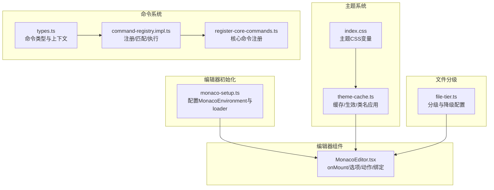
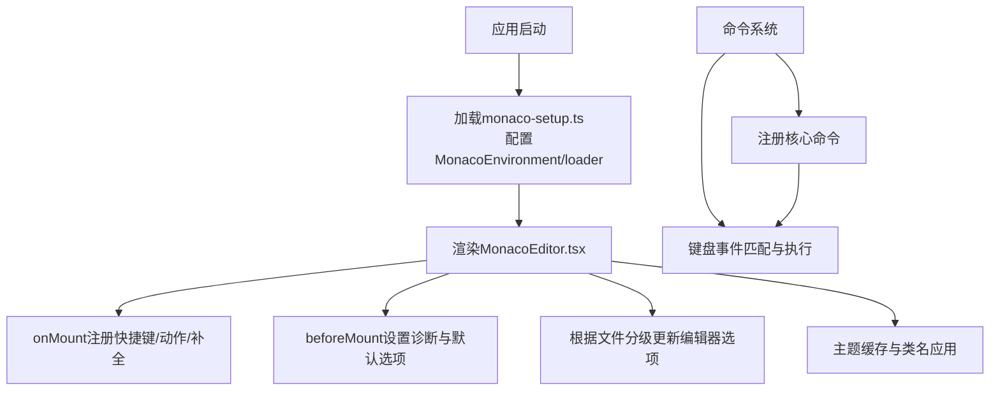
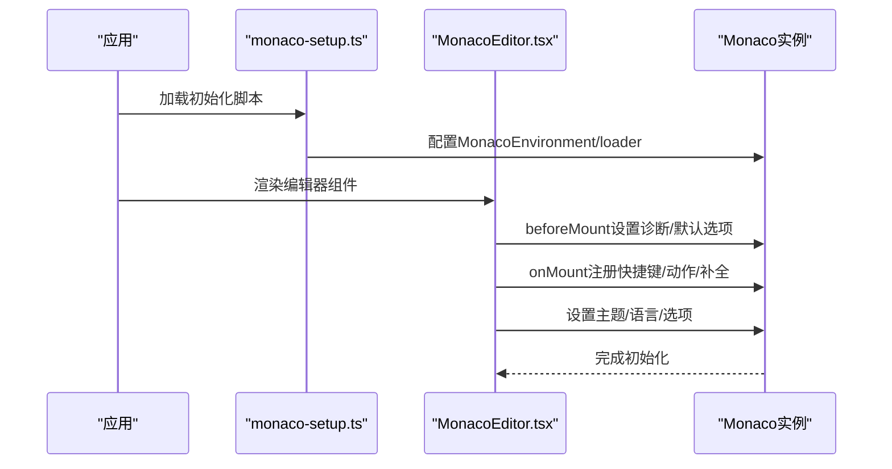
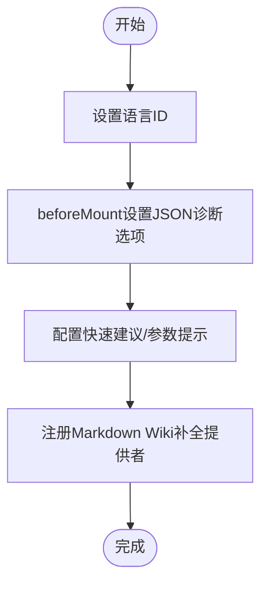
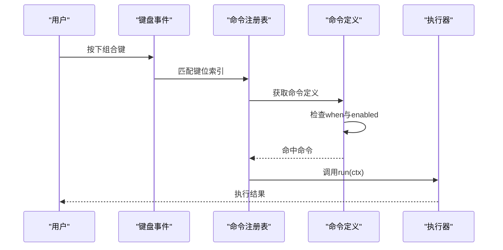
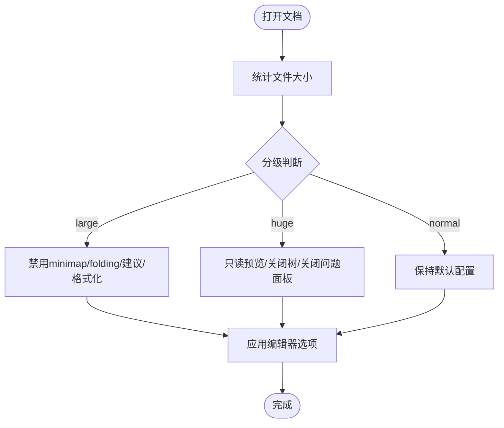
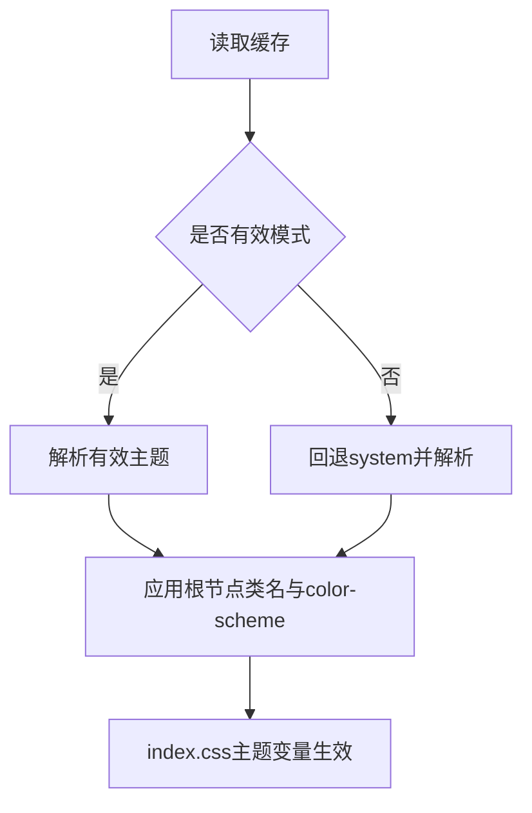
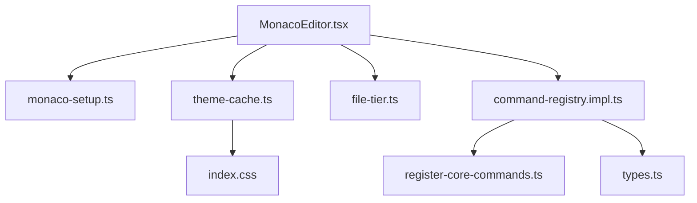

# Monaco编辑器API

<cite>
**本文引用的文件**
- [monaco-setup.ts](file://src/lib/monaco-setup.ts)
- [MonacoEditor.tsx](file://src/components/editor/MonacoEditor.tsx)
- [theme-cache.ts](file://src/lib/theme-cache.ts)
- [file-tier.ts](file://src/core/document/file-tier.ts)
- [command-registry.impl.ts](file://src/core/command/command-registry.impl.ts)
- [register-core-commands.ts](file://src/core/command/register-core-commands.ts)
- [types.ts](file://src/core/command/types.ts)
- [index.css](file://src/index.css)
</cite>

## 目录
1. [简介](#简介)
2. [项目结构](#项目结构)
3. [核心组件](#核心组件)
4. [架构总览](#架构总览)
5. [详细组件分析](#详细组件分析)
6. [依赖关系分析](#依赖关系分析)
7. [性能考量](#性能考量)
8. [故障排查指南](#故障排查指南)
9. [结论](#结论)
10. [附录](#附录)

## 简介
本文件面向NoteForge中的Monaco编辑器集成与API使用，系统性阐述以下主题：
- 编辑器初始化与配置：主题、语言映射、工作线程、基础选项
- 语法高亮与智能提示：内置语言支持、Markdown Wiki补全、诊断噪声控制
- 代码格式化与编辑行为：自动换行、括号配对高亮、参数提示、快速建议
- 编辑器命令系统：快捷键、上下文匹配、命令注册与执行
- 大文件优化：文件分级策略、降级配置、只读预览
- 使用示例与最佳实践：自定义语言模式、语言服务集成、性能优化

## 项目结构
NoteForge围绕Monaco编辑器的关键文件分布如下：
- 初始化与工作线程：src/lib/monaco-setup.ts
- 编辑器组件：src/components/editor/MonacoEditor.tsx
- 主题缓存与应用：src/lib/theme-cache.ts
- 文件分级与降级策略：src/core/document/file-tier.ts
- 命令系统：src/core/command/*.ts
- UI主题变量：src/index.css

**图表来源**
- [monaco-setup.ts:1-24](file://src/lib/monaco-setup.ts#L1-L24)
- [MonacoEditor.tsx:1-434](file://src/components/editor/MonacoEditor.tsx#L1-L434)
- [theme-cache.ts:1-46](file://src/lib/theme-cache.ts#L1-L46)
- [index.css:1-57](file://src/index.css#L1-L57)
- [command-registry.impl.ts:1-100](file://src/core/command/command-registry.impl.ts#L1-L100)
- [register-core-commands.ts:1-201](file://src/core/command/register-core-commands.ts#L1-L201)
- [types.ts:1-45](file://src/core/command/types.ts#L1-L45)
- [file-tier.ts:1-95](file://src/core/document/file-tier.ts#L1-L95)

**章节来源**
- [monaco-setup.ts:1-24](file://src/lib/monaco-setup.ts#L1-L24)
- [MonacoEditor.tsx:1-434](file://src/components/editor/MonacoEditor.tsx#L1-L434)
- [theme-cache.ts:1-46](file://src/lib/theme-cache.ts#L1-L46)
- [index.css:1-57](file://src/index.css#L1-L57)
- [command-registry.impl.ts:1-100](file://src/core/command/command-registry.impl.ts#L1-L100)
- [register-core-commands.ts:1-201](file://src/core/command/register-core-commands.ts#L1-L201)
- [types.ts:1-45](file://src/core/command/types.ts#L1-L45)
- [file-tier.ts:1-95](file://src/core/document/file-tier.ts#L1-L95)

## 核心组件
- Monaco初始化与工作线程
  - 通过MonacoEnvironment将各语言Worker映射到打包后的Web Worker，确保离线可用与无CDN依赖
  - 使用loader.config将Monaco实例注入@monaco-editor/react
- 编辑器组件
  - onMount阶段注册快捷键与编辑动作，注册Markdown Wiki补全提供者
  - beforeMount阶段降低JSON诊断噪声，避免Markdown/YAML误报
  - 通过options配置字体、行高、缩进、括号高亮、参数提示、快速建议等
  - 支持主题随系统/用户选择切换，并将有效主题应用于根节点
  - 针对大文件自动调整编辑器选项，禁用minimap/folding/建议/格式化等
- 命令系统
  - 统一注册命令、维护键位索引、按上下文匹配执行
  - 核心命令包含文件、编辑、视图、导航、工作区、AI等类别
- 文件分级
  - 基于文件大小分为normal/large/huge三档，分别对应不同的编辑器降级策略与只读限制

**章节来源**
- [monaco-setup.ts:1-24](file://src/lib/monaco-setup.ts#L1-L24)
- [MonacoEditor.tsx:92-408](file://src/components/editor/MonacoEditor.tsx#L92-L408)
- [theme-cache.ts:1-46](file://src/lib/theme-cache.ts#L1-L46)
- [command-registry.impl.ts:1-100](file://src/core/command/command-registry.impl.ts#L1-L100)
- [register-core-commands.ts:1-201](file://src/core/command/register-core-commands.ts#L1-L201)
- [file-tier.ts:1-95](file://src/core/document/file-tier.ts#L1-L95)

## 架构总览
NoteForge的编辑器架构以“组件驱动 + 命令系统 + 分级策略”为核心，确保在多语言、多场景下的稳定与高性能。

**图表来源**
- [monaco-setup.ts:1-24](file://src/lib/monaco-setup.ts#L1-L24)
- [MonacoEditor.tsx:92-408](file://src/components/editor/MonacoEditor.tsx#L92-L408)
- [command-registry.impl.ts:1-100](file://src/core/command/command-registry.impl.ts#L1-L100)
- [register-core-commands.ts:1-201](file://src/core/command/register-core-commands.ts#L1-L201)
- [file-tier.ts:1-95](file://src/core/document/file-tier.ts#L1-L95)
- [theme-cache.ts:1-46](file://src/lib/theme-cache.ts#L1-L46)

## 详细组件分析

### 组件：Monaco编辑器初始化与配置
- 初始化流程
  - 导入monaco-setup.ts以确保Monaco环境与loader正确配置
  - 在MonacoEditor组件中通过@monaco-editor/react的Editor组件挂载
- 主题设置
  - 依据主题缓存决定light/dark，应用到根节点类名与颜色方案
- 语言配置
  - 通过mapLanguage将内部语言名映射到Monaco ID
  - beforeMount阶段对JSON诊断进行噪声控制
- 扩展加载
  - 注册Markdown Wiki补全提供者，触发字符为[
  - 通过MonacoEnvironment将各语言Worker映射到打包后的Web Worker

**图表来源**
- [monaco-setup.ts:1-24](file://src/lib/monaco-setup.ts#L1-L24)
- [MonacoEditor.tsx:92-408](file://src/components/editor/MonacoEditor.tsx#L92-L408)

**章节来源**
- [monaco-setup.ts:1-24](file://src/lib/monaco-setup.ts#L1-L24)
- [MonacoEditor.tsx:350-433](file://src/components/editor/MonacoEditor.tsx#L350-L433)
- [theme-cache.ts:32-46](file://src/lib/theme-cache.ts#L32-L46)

### 组件：语法高亮、智能提示与诊断
- 语法高亮
  - 通过language属性与Monaco内置语言ID实现
- 智能提示
  - 快速建议：开启字符串/注释外的其他建议，关闭字符串内建议
  - 参数提示：启用参数提示
  - Markdown Wiki补全：触发字符[，基于工作区树收集标题并返回建议
- 诊断噪声控制
  - beforeMount阶段将JSON诊断设为警告级别，关闭注释与外部schema，降低Markdown/YAML误报

**图表来源**
- [MonacoEditor.tsx:363-403](file://src/components/editor/MonacoEditor.tsx#L363-L403)
- [MonacoEditor.tsx:131-161](file://src/components/editor/MonacoEditor.tsx#L131-L161)

**章节来源**
- [MonacoEditor.tsx:363-403](file://src/components/editor/MonacoEditor.tsx#L363-L403)
- [MonacoEditor.tsx:131-161](file://src/components/editor/MonacoEditor.tsx#L131-L161)

### 组件：编辑器命令系统与快捷键
- 命令注册
  - 统一通过createCommandRegistry维护命令表与键位索引
  - 支持分类、标题、键位、上下文条件、启用条件与执行函数
- 快捷键与动作
  - onMount阶段注册常用编辑动作（查找、替换、添加下一个匹配、行注释、跳转行、行上下移动）
  - 通过Monaco Action API调用内置动作
- 命令执行
  - 键盘事件匹配when条件与enabled回调后执行run逻辑
  - 核心命令涵盖文件、编辑、视图、导航、工作区、AI等类别

**图表来源**
- [command-registry.impl.ts:1-100](file://src/core/command/command-registry.impl.ts#L1-L100)
- [types.ts:1-45](file://src/core/command/types.ts#L1-L45)
- [register-core-commands.ts:1-201](file://src/core/command/register-core-commands.ts#L1-L201)
- [MonacoEditor.tsx:98-129](file://src/components/editor/MonacoEditor.tsx#L98-L129)

**章节来源**
- [command-registry.impl.ts:1-100](file://src/core/command/command-registry.impl.ts#L1-L100)
- [types.ts:1-45](file://src/core/command/types.ts#L1-L45)
- [register-core-commands.ts:1-201](file://src/core/command/register-core-commands.ts#L1-L201)
- [MonacoEditor.tsx:98-129](file://src/components/editor/MonacoEditor.tsx#L98-L129)

### 组件：大文件优化与分级策略
- 文件分级
  - normal：常规体验
  - large：禁用minimap/folding/wordBasedSuggestions/formatOnPaste，降低快速建议
  - huge：只读预览，关闭JSON/YAML树与问题面板
- 编辑器选项动态调整
  - onMount阶段根据文档tier配置更新编辑器选项
- 性能影响
  - 减少tokenization与worker负载，提升大文件滚动与交互响应

**图表来源**
- [file-tier.ts:1-95](file://src/core/document/file-tier.ts#L1-L95)
- [MonacoEditor.tsx:247-259](file://src/components/editor/MonacoEditor.tsx#L247-L259)

**章节来源**
- [file-tier.ts:1-95](file://src/core/document/file-tier.ts#L1-L95)
- [MonacoEditor.tsx:247-259](file://src/components/editor/MonacoEditor.tsx#L247-L259)

### 组件：主题系统与样式
- 主题缓存
  - 支持system/light/dark三种模式，读取/写入localStorage
  - 解析有效主题（light/dark），应用到根节点类名与color-scheme
- 样式变量
  - index.css提供明暗两套CSS变量，配合主题类名生效

**图表来源**
- [theme-cache.ts:1-46](file://src/lib/theme-cache.ts#L1-L46)
- [index.css:1-57](file://src/index.css#L1-L57)

**章节来源**
- [theme-cache.ts:1-46](file://src/lib/theme-cache.ts#L1-L46)
- [index.css:1-57](file://src/index.css#L1-L57)

## 依赖关系分析
- 组件耦合
  - MonacoEditor依赖monaco-setup.ts提供的Monaco环境与loader
  - 主题系统通过theme-cache.ts与index.css协同生效
  - 命令系统独立于编辑器，但通过快捷键与动作与编辑器交互
- 外部依赖
  - @monaco-editor/react负责React封装与生命周期管理
  - Monaco原生库提供语言服务、Worker与编辑能力

**图表来源**
- [MonacoEditor.tsx:1-434](file://src/components/editor/MonacoEditor.tsx#L1-L434)
- [monaco-setup.ts:1-24](file://src/lib/monaco-setup.ts#L1-L24)
- [theme-cache.ts:1-46](file://src/lib/theme-cache.ts#L1-L46)
- [index.css:1-57](file://src/index.css#L1-L57)
- [file-tier.ts:1-95](file://src/core/document/file-tier.ts#L1-L95)
- [command-registry.impl.ts:1-100](file://src/core/command/command-registry.impl.ts#L1-L100)
- [register-core-commands.ts:1-201](file://src/core/command/register-core-commands.ts#L1-L201)
- [types.ts:1-45](file://src/core/command/types.ts#L1-L45)

**章节来源**
- [MonacoEditor.tsx:1-434](file://src/components/editor/MonacoEditor.tsx#L1-L434)
- [monaco-setup.ts:1-24](file://src/lib/monaco-setup.ts#L1-L24)
- [theme-cache.ts:1-46](file://src/lib/theme-cache.ts#L1-L46)
- [index.css:1-57](file://src/index.css#L1-L57)
- [file-tier.ts:1-95](file://src/core/document/file-tier.ts#L1-L95)
- [command-registry.impl.ts:1-100](file://src/core/command/command-registry.impl.ts#L1-L100)
- [register-core-commands.ts:1-201](file://src/core/command/register-core-commands.ts#L1-L201)
- [types.ts:1-45](file://src/core/command/types.ts#L1-L45)

## 性能考量
- 大文件优化
  - 使用文件分级策略，在large/huge级别禁用昂贵特性（minimap/folding/建议/格式化/树/问题面板）
  - 通过largeFileOptimizations与只读限制保障交互流畅
- 编辑器选项
  - 关闭不必要的渲染与计算（空白字符渲染、行号、边距等）
  - 控制快速建议范围，减少输入时的提示计算
- 诊断噪声
  - 降低JSON诊断级别与范围，避免误报干扰
- 建议
  - 对单行超长文本场景，建议先格式化再编辑，或仅启用基础编辑能力

[本节为通用指导，无需列出章节来源]

## 故障排查指南
- 编辑器无法加载或报错
  - 确认monaco-setup.ts已导入，MonacoEnvironment与loader配置正确
  - 检查Worker映射是否覆盖所需语言标签
- 主题不生效
  - 检查theme-cache.ts是否成功写入缓存并应用到根节点类名
  - 确认index.css主题变量存在且未被覆盖
- 快捷键无效
  - 检查命令注册与键位索引是否正确
  - 确认when条件与enabled回调未阻止执行
- 大文件卡顿
  - 确认文件分级策略已生效，编辑器选项已按tier调整
  - 避免在large/huge模式下启用树形视图与全量parse

**章节来源**
- [monaco-setup.ts:1-24](file://src/lib/monaco-setup.ts#L1-L24)
- [theme-cache.ts:1-46](file://src/lib/theme-cache.ts#L1-L46)
- [command-registry.impl.ts:1-100](file://src/core/command/command-registry.impl.ts#L1-L100)
- [MonacoEditor.tsx:247-259](file://src/components/editor/MonacoEditor.tsx#L247-L259)

## 结论
NoteForge通过模块化的初始化、完善的命令系统、精细的主题与语言配置以及严格的文件分级策略，实现了在多语言、多场景下的稳定与高性能编辑体验。开发者可在现有基础上进一步扩展语言服务、优化大文件路径与草稿层，持续提升编辑器的可用性与性能。

[本节为总结性内容，无需列出章节来源]

## 附录

### API参考与使用示例

- 自定义编辑器模式
  - 通过language属性与mapLanguage映射到Monaco ID，支持markdown/json/yaml/编程语言等
  - 在beforeMount阶段设置语言特定的诊断与默认选项
  - 示例路径：[语言映射与选项:350-433](file://src/components/editor/MonacoEditor.tsx#L350-L433)
- 语言服务集成
  - 注册自定义补全提供者：参考Markdown Wiki补全注册方式
  - 示例路径：[Markdown补全提供者:131-161](file://src/components/editor/MonacoEditor.tsx#L131-L161)
- 性能优化
  - 使用文件分级策略与降级配置
  - 示例路径：[文件分级与降级:1-95](file://src/core/document/file-tier.ts#L1-L95)
- 主题与样式
  - 通过theme-cache.ts缓存与应用主题，结合index.css主题变量
  - 示例路径：[主题缓存与应用:1-46](file://src/lib/theme-cache.ts#L1-L46)、[主题变量:1-57](file://src/index.css#L1-L57)
- 命令系统
  - 注册命令与快捷键，统一执行入口
  - 示例路径：[命令注册与执行:1-100](file://src/core/command/command-registry.impl.ts#L1-L100)、[核心命令:1-201](file://src/core/command/register-core-commands.ts#L1-L201)

[本节为参考与示例汇总，无需列出章节来源]