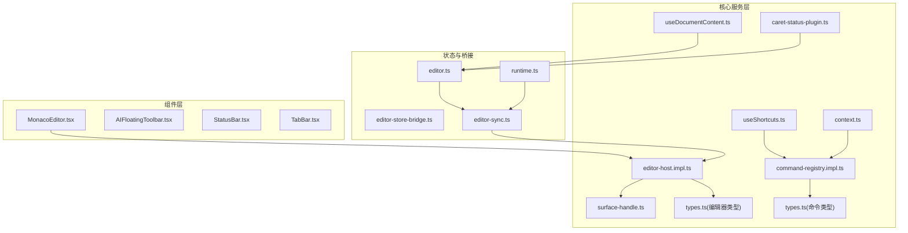
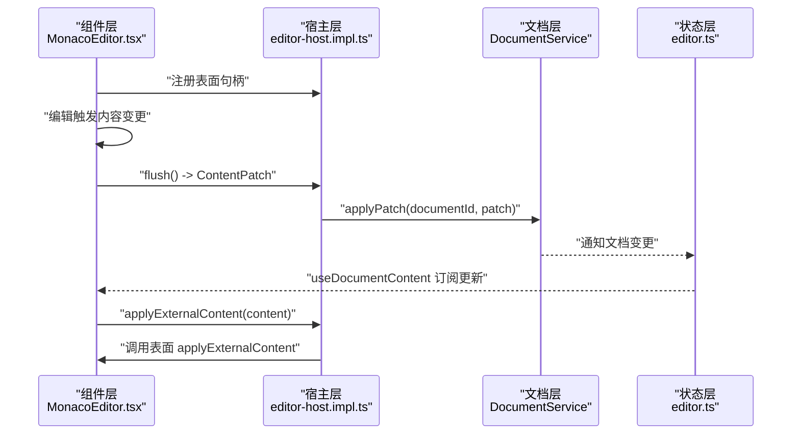
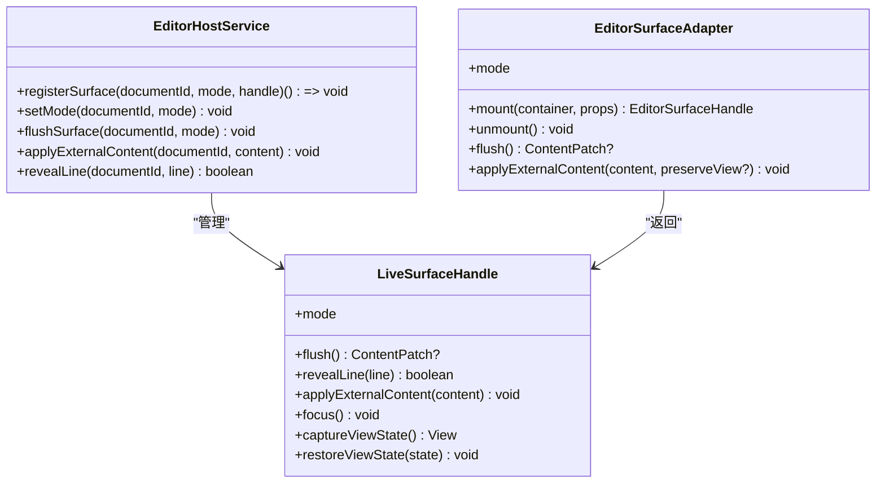
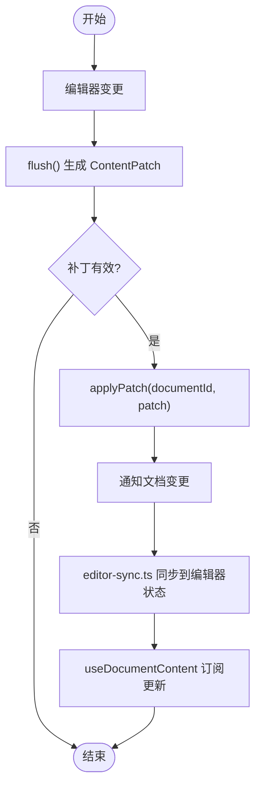
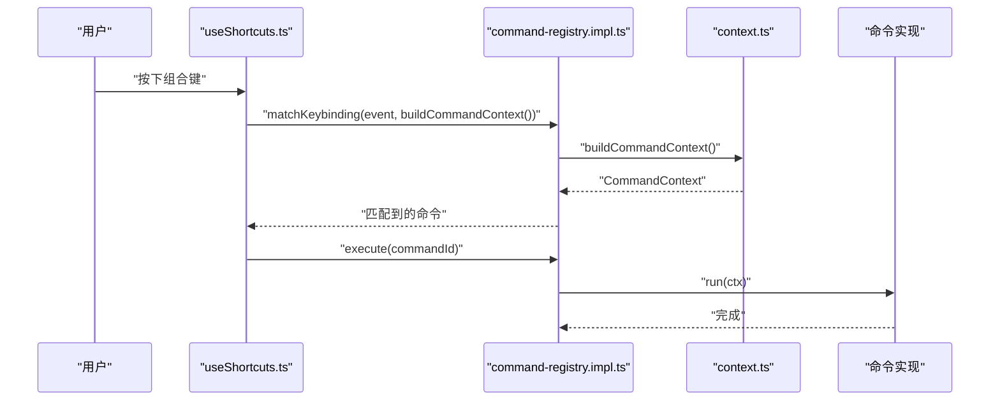
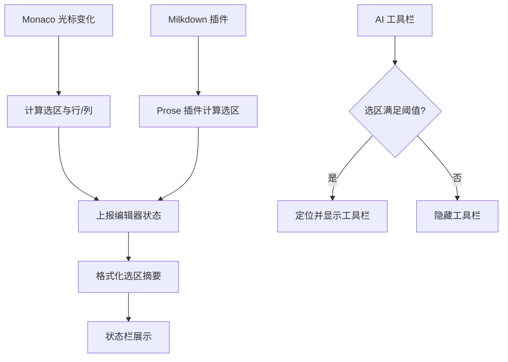
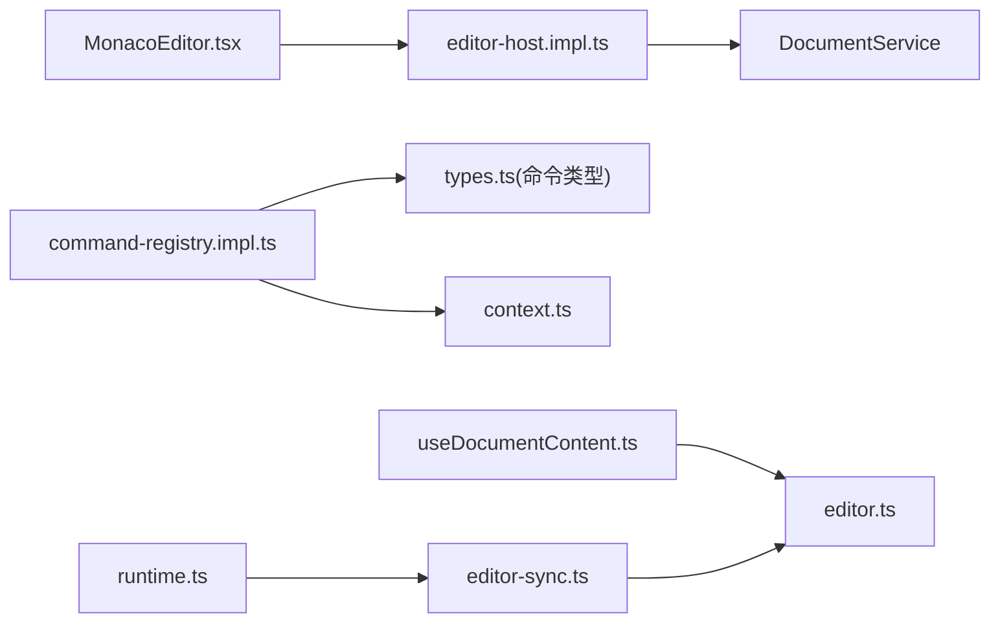

# 编辑器API

<cite>
**本文引用的文件**
- [MonacoEditor.tsx](file://src/components/editor/MonacoEditor.tsx)
- [editor-host.impl.ts](file://src/core/editor/editor-host.impl.ts)
- [surface-handle.ts](file://src/core/editor/surface-handle.ts)
- [types.ts](file://src/core/editor/types.ts)
- [command-registry.impl.ts](file://src/core/command/command-registry.impl.ts)
- [types.ts](file://src/core/command/types.ts)
- [context.ts](file://src/core/command/context.ts)
- [useShortcuts.ts](file://src/hooks/useShortcuts.ts)
- [useDocumentContent.ts](file://src/hooks/useDocumentContent.ts)
- [editor-caret-status.ts](file://src/lib/editor-caret-status.ts)
- [caret-status-plugin.ts](file://src/features/markdown/caret-status-plugin.ts)
- [AIFloatingToolbar.tsx](file://src/components/editor/AIFloatingToolbar.tsx)
- [editor-sync.ts](file://src/core/bridge/editor-sync.ts)
- [editor-store-bridge.ts](file://src/core/bridge/editor-store-bridge.ts)
- [editor.ts](file://src/store/editor.ts)
- [runtime.ts](file://src/core/runtime.ts)
</cite>

## 目录
1. [简介](#简介)
2. [项目结构](#项目结构)
3. [核心组件](#核心组件)
4. [架构总览](#架构总览)
5. [详细组件分析](#详细组件分析)
6. [依赖分析](#依赖分析)
7. [性能考虑](#性能考虑)
8. [故障排查指南](#故障排查指南)
9. [结论](#结论)
10. [附录](#附录)

## 简介
本文件为 NoteForge 编辑器API的权威参考与实践指南，覆盖多模式编辑（写模式、源码模式、只读模式）、内容同步机制、状态管理、命令系统、事件与快捷键、以及扩展与集成方法。目标读者既包含需要快速上手的开发者，也包含希望深入理解架构设计的高级用户。

## 项目结构
编辑器相关代码主要分布在以下模块：
- 组件层：Monaco 编辑器封装、AI浮动工具栏、状态栏、标签页等
- 核心服务层：编辑器宿主、表面句柄、命令注册表、上下文构建
- 状态与桥接：Zustand 编辑器状态、文档与编辑器的同步桥
- 功能插件：Markdown Prose 插件（光标位置统计）

图表来源
- [MonacoEditor.tsx:36-351](file://src/components/editor/MonacoEditor.tsx#L36-L351)
- [editor-host.impl.ts:1-110](file://src/core/editor/editor-host.impl.ts#L1-L110)
- [surface-handle.ts:1-26](file://src/core/editor/surface-handle.ts#L1-L26)
- [types.ts:1-38](file://src/core/editor/types.ts#L1-L38)
- [command-registry.impl.ts:1-99](file://src/core/command/command-registry.impl.ts#L1-L99)
- [context.ts:1-38](file://src/core/command/context.ts#L1-L38)
- [useShortcuts.ts:1-24](file://src/hooks/useShortcuts.ts#L1-L24)
- [useDocumentContent.ts:1-47](file://src/hooks/useDocumentContent.ts#L1-L47)
- [caret-status-plugin.ts:1-49](file://src/features/markdown/caret-status-plugin.ts#L1-L49)
- [editor-sync.ts](file://src/core/bridge/editor-sync.ts)
- [editor-store-bridge.ts](file://src/core/bridge/editor-store-bridge.ts)
- [editor.ts](file://src/store/editor.ts)
- [runtime.ts](file://src/core/runtime.ts)

章节来源
- [MonacoEditor.tsx:36-351](file://src/components/editor/MonacoEditor.tsx#L36-L351)
- [editor-host.impl.ts:1-110](file://src/core/editor/editor-host.impl.ts#L1-L110)
- [surface-handle.ts:1-26](file://src/core/editor/surface-handle.ts#L1-L26)
- [types.ts:1-38](file://src/core/editor/types.ts#L1-L38)
- [command-registry.impl.ts:1-99](file://src/core/command/command-registry.impl.ts#L1-L99)
- [context.ts:1-38](file://src/core/command/context.ts#L1-L38)
- [useShortcuts.ts:1-24](file://src/hooks/useShortcuts.ts#L1-L24)
- [useDocumentContent.ts:1-47](file://src/hooks/useDocumentContent.ts#L1-L47)
- [caret-status-plugin.ts:1-49](file://src/features/markdown/caret-status-plugin.ts#L1-L49)
- [editor-sync.ts](file://src/core/bridge/editor-sync.ts)
- [editor-store-bridge.ts](file://src/core/bridge/editor-store-bridge.ts)
- [editor.ts](file://src/store/editor.ts)
- [runtime.ts](file://src/core/runtime.ts)

## 核心组件
- 编辑器表面与宿主
  - 表面句柄：统一暴露聚焦、行定位、视图状态捕获/恢复、外部内容应用等能力
  - 编辑器宿主：集中管理表面注册、切换模式、刷新补丁、应用外部内容
- 命令系统
  - 注册表：命令注册、列表过滤、快捷键匹配、执行
  - 上下文：构建命令执行上下文（活动文档、焦点状态、表面模式等）
  - 全局快捷键钩子：统一拦截与路由
- 状态与同步
  - 文档记录与补丁：全量替换或增量补丁
  - 编辑器状态桥接：文档变更驱动编辑器更新，编辑器变更回流至文档
  - React 订阅：useDocumentContent 提供文档内容订阅

章节来源
- [surface-handle.ts:1-26](file://src/core/editor/surface-handle.ts#L1-L26)
- [editor-host.impl.ts:1-110](file://src/core/editor/editor-host.impl.ts#L1-L110)
- [types.ts:1-38](file://src/core/editor/types.ts#L1-L38)
- [command-registry.impl.ts:1-99](file://src/core/command/command-registry.impl.ts#L1-L99)
- [context.ts:1-38](file://src/core/command/context.ts#L1-L38)
- [useShortcuts.ts:1-24](file://src/hooks/useShortcuts.ts#L1-L24)
- [useDocumentContent.ts:1-47](file://src/hooks/useDocumentContent.ts#L1-L47)
- [editor-sync.ts](file://src/core/bridge/editor-sync.ts)
- [editor.ts](file://src/store/editor.ts)

## 架构总览
NoteForge 的编辑器采用“表面（Surface）- 宿主（Host）- 文档（Document）”三层协作：
- 表面负责渲染与交互（Monaco/WYSIWYG），不直接持有“真相”，通过补丁向上游回流
- 宿主负责模式切换、视图状态同步、外部内容应用、刷新补丁
- 文档服务负责内容存储、补丁应用、视图状态持久化
- 命令系统统一入口，通过上下文控制可用性与执行路径

图表来源
- [MonacoEditor.tsx:261-313](file://src/components/editor/MonacoEditor.tsx#L261-L313)
- [editor-host.impl.ts:26-86](file://src/core/editor/editor-host.impl.ts#L26-L86)
- [editor-sync.ts](file://src/core/bridge/editor-sync.ts)
- [editor.ts](file://src/store/editor.ts)
- [useDocumentContent.ts:1-25](file://src/hooks/useDocumentContent.ts#L1-L25)

## 详细组件分析

### 表面与宿主：多模式编辑与内容同步
- 表面模式
  - write：Milkdown WYSIWYG
  - source：Monaco markdown 源码
  - read：只读模式（presentation）
- 表面职责
  - 暴露 flush() 生成 ContentPatch
  - 应用外部内容（如 revert、外部变更）
  - 捕获/恢复视图状态（光标、滚动）
- 宿主职责
  - 注册/注销表面
  - 切换模式、定位行、应用外部内容
  - 刷新并回写补丁，同时持久化视图状态

图表来源
- [surface-handle.ts:1-26](file://src/core/editor/surface-handle.ts#L1-L26)
- [types.ts:15-38](file://src/core/editor/types.ts#L15-L38)
- [editor-host.impl.ts:88-99](file://src/core/editor/editor-host.impl.ts#L88-L99)

章节来源
- [surface-handle.ts:1-26](file://src/core/editor/surface-handle.ts#L1-L26)
- [types.ts:1-38](file://src/core/editor/types.ts#L1-L38)
- [editor-host.impl.ts:1-110](file://src/core/editor/editor-host.impl.ts#L1-L110)

### 内容同步机制：补丁与桥接
- 补丁模型
  - replace-all：全量替换
  - 其他增量补丁（由文档服务定义）
- 同步流程
  - 编辑器 flush 生成补丁 -> 文档 applyPatch -> 通知变更 -> 状态桥接 -> UI 订阅更新
- 外部内容应用
  - 当文档被外部修改或 revert 时，宿主调用 applyExternalContent，确保编辑器与文档一致

图表来源
- [MonacoEditor.tsx:261-313](file://src/components/editor/MonacoEditor.tsx#L261-L313)
- [editor-host.impl.ts:26-39](file://src/core/editor/editor-host.impl.ts#L26-L39)
- [editor-sync.ts](file://src/core/bridge/editor-sync.ts)
- [useDocumentContent.ts:1-25](file://src/hooks/useDocumentContent.ts#L1-L25)

章节来源
- [MonacoEditor.tsx:261-313](file://src/components/editor/MonacoEditor.tsx#L261-L313)
- [editor-host.impl.ts:26-39](file://src/core/editor/editor-host.impl.ts#L26-L39)
- [editor-sync.ts](file://src/core/bridge/editor-sync.ts)
- [useDocumentContent.ts:1-25](file://src/hooks/useDocumentContent.ts#L1-L25)

### 命令系统：调用方式与上下文
- 命令注册
  - 注册命令与快捷键索引
  - 支持分类过滤与查询
- 快捷键匹配
  - 全局拦截（useGlobalShortcuts）
  - 结合上下文 when 条件判断启用
- 执行路径
  - 构建上下文 -> 匹配快捷键 -> 执行命令

图表来源
- [useShortcuts.ts:8-23](file://src/hooks/useShortcuts.ts#L8-L23)
- [command-registry.impl.ts:30-65](file://src/core/command/command-registry.impl.ts#L30-L65)
- [context.ts:6-37](file://src/core/command/context.ts#L6-L37)
- [types.ts:12-44](file://src/core/command/types.ts#L12-L44)

章节来源
- [command-registry.impl.ts:1-99](file://src/core/command/command-registry.impl.ts#L1-L99)
- [context.ts:1-38](file://src/core/command/context.ts#L1-L38)
- [useShortcuts.ts:1-24](file://src/hooks/useShortcuts.ts#L1-L24)
- [types.ts:1-45](file://src/core/command/types.ts#L1-L45)

### 事件系统：光标位置、选择状态与键盘快捷键
- 光标与选择
  - Monaco 编辑器：通过 onDidChangeCursorSelection 与 getSelection 获取选区
  - Milkdown 插件：计算行/列与选区字符数/行数，并上报编辑器状态
  - 状态栏格式化：根据选区统计生成可读摘要
- 键盘快捷键
  - 全局路由：useGlobalShortcuts 统一拦截
  - 命令上下文：editorFocus、markdown、hasActiveTab 等条件控制可用性
- AI 浮动工具栏
  - 基于选区文本长度与结构阈值显示
  - 监听光标与滚动事件，动态定位

图表来源
- [MonacoEditor.tsx:53-68](file://src/components/editor/MonacoEditor.tsx#L53-L68)
- [caret-status-plugin.ts:13-48](file://src/features/markdown/caret-status-plugin.ts#L13-L48)
- [editor-caret-status.ts:1-31](file://src/lib/editor-caret-status.ts#L1-L31)
- [AIFloatingToolbar.tsx:26-74](file://src/components/editor/AIFloatingToolbar.tsx#L26-L74)

章节来源
- [MonacoEditor.tsx:53-68](file://src/components/editor/MonacoEditor.tsx#L53-L68)
- [caret-status-plugin.ts:1-49](file://src/features/markdown/caret-status-plugin.ts#L1-L49)
- [editor-caret-status.ts:1-31](file://src/lib/editor-caret-status.ts#L1-L31)
- [AIFloatingToolbar.tsx:26-74](file://src/components/editor/AIFloatingToolbar.tsx#L26-L74)

### API 参考与使用指南

- 获取与订阅文档内容
  - 使用 useDocumentContent(documentId) 订阅特定文档的内容变更，仅在文档变更时重渲染
  - 返回 null 表示无对应文档记录
- 编辑器命令调用
  - 注册命令：通过命令注册表注册命令与快捷键
  - 执行命令：全局快捷键触发或程序化执行
  - 上下文：命令运行时可访问活动文档、焦点状态、表面模式等
- 外部内容应用
  - 宿主层提供 applyExternalContent(documentId, content)，用于 revert 或外部变更场景
  - 表面层实现 applyExternalContent(content) 并可选择保留视图状态
- 视图状态管理
  - 表面层 captureViewState()/restoreViewState() 捕获/恢复光标与滚动
  - 宿主层在切换模式或刷新时同步视图状态至文档
- 多模式编辑
  - write：WYSIWYG
  - source：Monaco 源码
  - read：只读模式
  - 宿主根据当前标签页解析表面模式并进行切换

章节来源
- [useDocumentContent.ts:1-47](file://src/hooks/useDocumentContent.ts#L1-L47)
- [command-registry.impl.ts:1-99](file://src/core/command/command-registry.impl.ts#L1-L99)
- [context.ts:1-38](file://src/core/command/context.ts#L1-L38)
- [editor-host.impl.ts:82-86](file://src/core/editor/editor-host.impl.ts#L82-L86)
- [surface-handle.ts:11-18](file://src/core/editor/surface-handle.ts#L11-L18)
- [types.ts:9-13](file://src/core/editor/types.ts#L9-L13)

### 集成示例

- 自定义编辑器扩展
  - 实现 EditorSurfaceAdapter 接口，提供 mount/unmount/flush/applyExternalContent
  - 在组件中创建 LiveSurfaceHandle 并通过宿主 registerSurface 注册
  - 示例路径参考：[MonacoEditor.tsx:261-313](file://src/components/editor/MonacoEditor.tsx#L261-L313)
- 插件开发
  - 在 Milkdown 中通过 caret-status-plugin 上报光标与选区信息
  - 示例路径参考：[caret-status-plugin.ts:13-48](file://src/features/markdown/caret-status-plugin.ts#L13-L48)
- 第三方集成
  - 通过 editor-host.impl.ts 的 applyExternalContent 将外部变更同步到编辑器
  - 通过 editor-sync.ts 将文档变更同步到编辑器状态
  - 示例路径参考：
    - [editor-host.impl.ts:82-86](file://src/core/editor/editor-host.impl.ts#L82-L86)
    - [editor-sync.ts](file://src/core/bridge/editor-sync.ts)

章节来源
- [MonacoEditor.tsx:261-313](file://src/components/editor/MonacoEditor.tsx#L261-L313)
- [caret-status-plugin.ts:13-48](file://src/features/markdown/caret-status-plugin.ts#L13-L48)
- [editor-host.impl.ts:82-86](file://src/core/editor/editor-host.impl.ts#L82-L86)
- [editor-sync.ts](file://src/core/bridge/editor-sync.ts)

## 依赖分析
- 组件对宿主的依赖：MonacoEditor 通过宿主注册表面句柄并进行内容同步
- 宿主对文档服务的依赖：applyPatch、更新视图状态
- 命令系统对上下文与注册表的依赖：构建上下文、匹配快捷键、执行命令
- 状态桥接：editor-sync.ts 将文档变更同步到编辑器状态，驱动 UI 订阅更新

图表来源
- [MonacoEditor.tsx:318-339](file://src/components/editor/MonacoEditor.tsx#L318-L339)
- [editor-host.impl.ts:1-110](file://src/core/editor/editor-host.impl.ts#L1-L110)
- [command-registry.impl.ts:1-99](file://src/core/command/command-registry.impl.ts#L1-L99)
- [context.ts:1-38](file://src/core/command/context.ts#L1-L38)
- [useDocumentContent.ts:1-25](file://src/hooks/useDocumentContent.ts#L1-L25)
- [editor-sync.ts](file://src/core/bridge/editor-sync.ts)
- [editor.ts](file://src/store/editor.ts)
- [runtime.ts](file://src/core/runtime.ts)

章节来源
- [MonacoEditor.tsx:318-339](file://src/components/editor/MonacoEditor.tsx#L318-L339)
- [editor-host.impl.ts:1-110](file://src/core/editor/editor-host.impl.ts#L1-L110)
- [command-registry.impl.ts:1-99](file://src/core/command/command-registry.impl.ts#L1-L99)
- [context.ts:1-38](file://src/core/command/context.ts#L1-L38)
- [useDocumentContent.ts:1-25](file://src/hooks/useDocumentContent.ts#L1-L25)
- [editor-sync.ts](file://src/core/bridge/editor-sync.ts)
- [editor.ts](file://src/store/editor.ts)
- [runtime.ts](file://src/core/runtime.ts)

## 性能考虑
- 减少全量同步：编辑器端采用防抖合并多次输入，避免频繁全量 replace-all
- 双份持有与镜像同步：当前存在文档与编辑器状态的双份内容与镜像同步，建议逐步迁移为“真相仅在编辑器模型内”，业务层仅维护元数据
- 视图状态持久化：仅在必要时捕获/恢复光标与滚动，降低开销

章节来源
- [MonacoEditor.tsx:53-68](file://src/components/editor/MonacoEditor.tsx#L53-L68)
- [.tmp/noteforgeChat.md:590-821](file://.tmp/noteforgeChat.md#L590-L821)

## 故障排查指南
- 编辑器未响应外部变更
  - 检查是否处于 hostSurfaceMode，该模式下宿主负责推送内容
  - 确认 applyExternalContent 是否被正确调用
  - 参考路径：[MonacoEditor.tsx:318-339](file://src/components/editor/MonacoEditor.tsx#L318-L339), [editor-host.impl.ts:82-86](file://src/core/editor/editor-host.impl.ts#L82-L86)
- 快捷键无效
  - 确认 useGlobalShortcuts 是否绑定到 window
  - 检查命令上下文 when 条件是否满足
  - 参考路径：[useShortcuts.ts:8-23](file://src/hooks/useShortcuts.ts#L8-L23), [context.ts:6-37](file://src/core/command/context.ts#L6-L37)
- 选区统计不准确
  - 检查 Milkdown 插件是否正确计算 offset 到行列
  - 确认状态上报频率与 UI 渲染时机
  - 参考路径：[caret-status-plugin.ts:13-48](file://src/features/markdown/caret-status-plugin.ts#L13-L48), [editor-caret-status.ts:1-31](file://src/lib/editor-caret-status.ts#L1-L31)
- 内容不同步
  - 确认 flush 是否产生有效补丁并调用 applyPatch
  - 检查 editor-sync.ts 是否将文档变更同步到编辑器状态
  - 参考路径：[editor-host.impl.ts:26-39](file://src/core/editor/editor-host.impl.ts#L26-L39), [editor-sync.ts](file://src/core/bridge/editor-sync.ts)

章节来源
- [MonacoEditor.tsx:318-339](file://src/components/editor/MonacoEditor.tsx#L318-L339)
- [editor-host.impl.ts:26-39](file://src/core/editor/editor-host.impl.ts#L26-L39)
- [useShortcuts.ts:8-23](file://src/hooks/useShortcuts.ts#L8-L23)
- [context.ts:6-37](file://src/core/command/context.ts#L6-L37)
- [caret-status-plugin.ts:13-48](file://src/features/markdown/caret-status-plugin.ts#L13-L48)
- [editor-caret-status.ts:1-31](file://src/lib/editor-caret-status.ts#L1-L31)
- [editor-sync.ts](file://src/core/bridge/editor-sync.ts)

## 结论
NoteForge 的编辑器API以“表面-宿主-文档”分层设计为核心，结合命令系统与状态桥接，实现了多模式编辑、稳定的内容同步与丰富的事件能力。开发者可通过表面适配器扩展编辑器、通过命令系统接入快捷键与面板、并通过状态桥接实现与 UI 的无缝联动。建议在后续迭代中减少双份内容与镜像同步，进一步提升性能与一致性。

## 附录
- 关键实现路径速查
  - 表面注册与刷新：[MonacoEditor.tsx:261-313](file://src/components/editor/MonacoEditor.tsx#L261-L313)
  - 宿主注册与外部内容应用：[editor-host.impl.ts:88-99](file://src/core/editor/editor-host.impl.ts#L88-L99)
  - 命令注册与执行：[command-registry.impl.ts:14-66](file://src/core/command/command-registry.impl.ts#L14-L66)
  - 文档内容订阅：[useDocumentContent.ts:8-24](file://src/hooks/useDocumentContent.ts#L8-L24)
  - 光标与选区统计：[caret-status-plugin.ts:13-48](file://src/features/markdown/caret-status-plugin.ts#L13-L48)
  - 状态栏摘要格式化：[editor-caret-status.ts:25-31](file://src/lib/editor-caret-status.ts#L25-L31)
  - 文档同步桥接：[editor-sync.ts](file://src/core/bridge/editor-sync.ts)