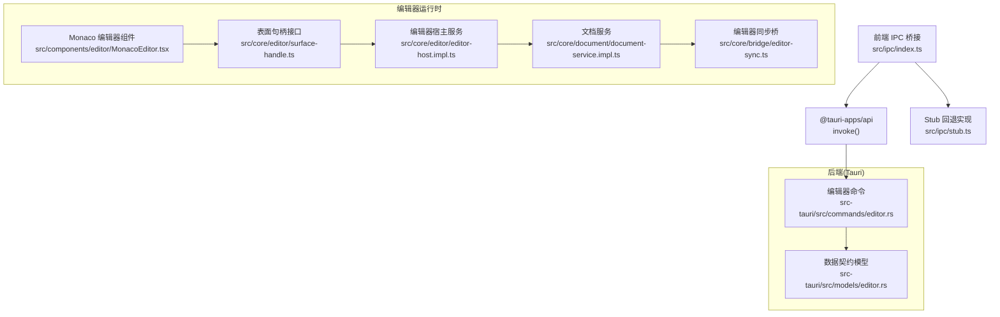
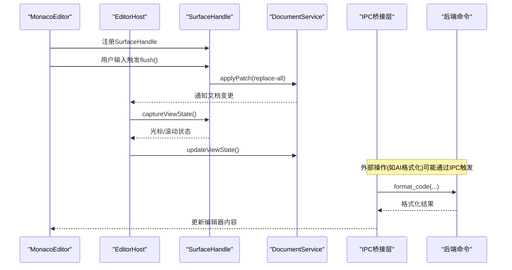
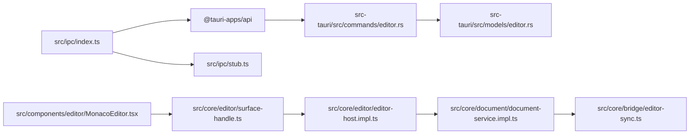

# 编辑器IPC通信API

<cite>
**本文引用的文件**
- [src/ipc/index.ts](file://src/ipc/index.ts)
- [src/ipc/stub.ts](file://src/ipc/stub.ts)
- [src-tauri/src/commands/editor.rs](file://src-tauri/src/commands/editor.rs)
- [src-tauri/src/models/editor.rs](file://src-tauri/src/models/editor.rs)
- [src/core/editor/editor-host.impl.ts](file://src/core/editor/editor-host.impl.ts)
- [src/core/editor/surface-handle.ts](file://src/core/editor/surface-handle.ts)
- [src/components/editor/MonacoEditor.tsx](file://src/components/editor/MonacoEditor.tsx)
- [src/core/document/document-service.impl.ts](file://src/core/document/document-service.impl.ts)
- [src/core/bridge/editor-sync.ts](file://src/core/bridge/editor-sync.ts)
- [src/core/session/scratch-autosave.ts](file://src/core/session/scratch-autosave.ts)
- [src/core/workbench/session-storage.ts](file://src/core/workbench/session-storage.ts)
</cite>

## 目录
1. [简介](#简介)
2. [项目结构](#项目结构)
3. [核心组件](#核心组件)
4. [架构总览](#架构总览)
5. [详细组件分析](#详细组件分析)
6. [依赖关系分析](#依赖关系分析)
7. [性能考量](#性能考量)
8. [故障排查指南](#故障排查指南)
9. [结论](#结论)
10. [附录](#附录)

## 简介
本文件系统性梳理NoteForge编辑器的IPC通信API，覆盖前后端架构、消息协议、数据序列化、异步处理与事件传播机制。重点说明编辑器相关IPC命令（语言检测、格式化、文件信息）、内容读取/写入与状态同步、跨进程事件（光标移动、内容变更、错误处理）以及使用示例与集成指南。目标是帮助开发者快速理解并正确集成编辑器IPC能力。

## 项目结构
- 前端IPC桥接层位于 src/ipc，统一暴露 editor/fs/workspace 等子域命令，并在浏览器环境下回退到 stub 实现。
- 后端命令位于 src-tauri/src/commands，编辑器相关命令集中在 editor.rs；数据契约模型位于 src-tauri/src/models。
- 编辑器宿主与表面句柄位于 src/core/editor，Monaco 编辑器组件位于 src/components/editor。
- 文档服务与桥接层负责内容变更与视图状态的同步。

图表来源
- [src/ipc/index.ts:1-489](file://src/ipc/index.ts#L1-L489)
- [src/ipc/stub.ts:1-1056](file://src/ipc/stub.ts#L1-L1056)
- [src-tauri/src/commands/editor.rs:1-104](file://src-tauri/src/commands/editor.rs#L1-L104)
- [src-tauri/src/models/editor.rs:1-24](file://src-tauri/src/models/editor.rs#L1-L24)
- [src/core/editor/editor-host.impl.ts:1-110](file://src/core/editor/editor-host.impl.ts#L1-L110)
- [src/core/editor/surface-handle.ts:1-26](file://src/core/editor/surface-handle.ts#L1-L26)
- [src/components/editor/MonacoEditor.tsx:36-296](file://src/components/editor/MonacoEditor.tsx#L36-L296)
- [src/core/document/document-service.impl.ts:227-263](file://src/core/document/document-service.impl.ts#L227-L263)
- [src/core/bridge/editor-sync.ts:762-772](file://src/core/bridge/editor-sync.ts#L762-L772)

章节来源
- [src/ipc/index.ts:1-489](file://src/ipc/index.ts#L1-L489)
- [src-tauri/src/commands/editor.rs:1-104](file://src-tauri/src/commands/editor.rs#L1-L104)
- [src-tauri/src/models/editor.rs:1-24](file://src-tauri/src/models/editor.rs#L1-L24)
- [src/core/editor/editor-host.impl.ts:1-110](file://src/core/editor/editor-host.impl.ts#L1-L110)
- [src/core/editor/surface-handle.ts:1-26](file://src/core/editor/surface-handle.ts#L1-L26)
- [src/components/editor/MonacoEditor.tsx:36-296](file://src/components/editor/MonacoEditor.tsx#L36-L296)
- [src/core/document/document-service.impl.ts:227-263](file://src/core/document/document-service.impl.ts#L227-L263)
- [src/core/bridge/editor-sync.ts:762-772](file://src/core/bridge/editor-sync.ts#L762-L772)

## 核心组件
- 前端IPC桥接层
  - 统一入口：isTauri() 判断是否在Tauri环境中；call()封装invoke与stub回退。
  - 编辑器域：editor.detectLanguage、editor.formatCode。
  - 文件域：fs.read、fs.write、fs.list、fs.info等。
  - 会话与草稿：scratch、draft、workbenchSession。
- 后端命令
  - 编辑器命令：detect_language、format_code、get_file_info。
  - 数据契约：LanguageDetection、FormatCodeResponse、FileInfo。
- 编辑器运行时
  - SurfaceHandle：flush/applyExternalContent/captureViewState等。
  - EditorHost：注册Surface、刷新补丁、应用外部内容。
  - MonacoEditor：防抖更新、表面句柄注册、视图状态捕获。
  - 文档服务：applyPatch、updateViewState、save。
  - 同步桥：将Document变更镜像到EditorTabs并应用到Monaco。

章节来源
- [src/ipc/index.ts:66-83](file://src/ipc/index.ts#L66-L83)
- [src/ipc/index.ts:286-295](file://src/ipc/index.ts#L286-L295)
- [src-tauri/src/commands/editor.rs:7-59](file://src-tauri/src/commands/editor.rs#L7-L59)
- [src-tauri/src/models/editor.rs:3-23](file://src-tauri/src/models/editor.rs#L3-L23)
- [src/core/editor/surface-handle.ts:4-19](file://src/core/editor/surface-handle.ts#L4-L19)
- [src/core/editor/editor-host.impl.ts:14-39](file://src/core/editor/editor-host.impl.ts#L14-L39)
- [src/components/editor/MonacoEditor.tsx:36-69](file://src/components/editor/MonacoEditor.tsx#L36-L69)
- [src/core/document/document-service.impl.ts:227-263](file://src/core/document/document-service.impl.ts#L227-L263)
- [src/core/bridge/editor-sync.ts:762-772](file://src/core/bridge/editor-sync.ts#L762-L772)

## 架构总览
- 消息协议
  - 命名规范：后端DTO统一使用camelCase，前端ipc/index.ts中对应字段名与后端一致。
  - 请求体：多数命令采用单Request对象（如req({ ... }))，便于统一序列化。
- 数据序列化
  - 前端call()在Tauri环境调用@tauri-apps/api的invoke，返回值自动JSON反序列化。
  - stub.ts提供等价函数签名，用于浏览器开发与自测。
- 异步处理
  - 所有IPC调用返回Promise，前端以async/await消费。
  - 后端命令执行可能涉及文件系统、格式化等IO，stub中使用sleep模拟延迟。
- 跨进程事件
  - Monaco编辑器通过SurfaceHandle将本地变更flush到DocumentService。
  - EditorHost在必要时将外部内容应用到Monaco，确保UI与文档一致。
  - 文档变更通过事件总线触发同步桥，更新EditorTabs并应用到Monaco。

图表来源
- [src/components/editor/MonacoEditor.tsx:261-296](file://src/components/editor/MonacoEditor.tsx#L261-L296)
- [src/core/editor/surface-handle.ts:4-19](file://src/core/editor/surface-handle.ts#L4-L19)
- [src/core/editor/editor-host.impl.ts:26-39](file://src/core/editor/editor-host.impl.ts#L26-L39)
- [src/core/document/document-service.impl.ts:227-263](file://src/core/document/document-service.impl.ts#L227-L263)
- [src-tauri/src/commands/editor.rs:21-30](file://src-tauri/src/commands/editor.rs#L21-L30)
- [src/ipc/index.ts:286-295](file://src/ipc/index.ts#L286-L295)

## 详细组件分析

### IPC桥接层（前端）
- 统一入口与回退
  - isTauri()判断是否在Tauri环境中；call()在Tauri下调用invoke，否则调用stub相应函数。
  - 错误包装：tauriInvoke()捕获异常并抛出IpcError，便于前端统一处理。
- 编辑器域命令
  - detectLanguage(content, filename?)：语言检测，返回language与confidence。
  - formatCode(content, language)：代码格式化（当前对json进行美化）。
- 文件域命令
  - read_file(path)、write_file(path, content)、list_directory(path)、get_file_info(path)等。
- 会话与草稿
  - scratch_*：临时草稿缓冲与会话持久化。
  - draft_*：工作区文件草稿缓冲。
  - workbench_*：窗口会话持久化。

章节来源
- [src/ipc/index.ts:59-83](file://src/ipc/index.ts#L59-L83)
- [src/ipc/index.ts:286-295](file://src/ipc/index.ts#L286-L295)
- [src/ipc/index.ts:218-238](file://src/ipc/index.ts#L218-L238)
- [src/ipc/index.ts:243-257](file://src/ipc/index.ts#L243-L257)
- [src/ipc/index.ts:262-271](file://src/ipc/index.ts#L262-L271)
- [src/ipc/index.ts:276-281](file://src/ipc/index.ts#L276-L281)

### Stub实现（浏览器回退）
- 作用
  - 在浏览器环境下提供与后端命令等价的函数签名，行为确定以便UI自测。
- 关键点
  - readFile/writeFile/listDirectory等均包含sleep()模拟延迟。
  - detectLanguage/formatCode等提供合理默认实现。
- 使用场景
  - 开发期无后端时的UI联调。
  - 单元测试中的稳定mock。

章节来源
- [src/ipc/stub.ts:283-290](file://src/ipc/stub.ts#L283-L290)
- [src/ipc/stub.ts:377-403](file://src/ipc/stub.ts#L377-L403)

### 后端命令（编辑器）
- detect_language
  - 输入：content、filename可选。
  - 逻辑：优先基于filename推断语言；否则基于内容特征推断。
  - 输出：LanguageDetection（language、confidence）。
- format_code
  - 输入：content、language。
  - 逻辑：对json进行美化；其他语言原样返回（或由真实后端实现）。
  - 输出：FormatCodeResponse（formatted）。
- get_file_info
  - 输入：path。
  - 逻辑：校验真实文件路径、读取元数据、推断语言。
  - 输出：FileInfo（size、modified、language、is_dir）。

章节来源
- [src-tauri/src/commands/editor.rs:7-19](file://src-tauri/src/commands/editor.rs#L7-L19)
- [src-tauri/src/commands/editor.rs:21-30](file://src-tauri/src/commands/editor.rs#L21-L30)
- [src-tauri/src/commands/editor.rs:32-59](file://src-tauri/src/commands/editor.rs#L32-L59)

### 数据契约模型
- LanguageDetection
  - 字段：language、confidence。
- FormatCodeResponse
  - 字段：formatted。
- FileInfo
  - 字段：size、modified、language、is_dir。

章节来源
- [src-tauri/src/models/editor.rs:3-23](file://src-tauri/src/models/editor.rs#L3-L23)

### 编辑器运行时（Surface与Host）
- SurfaceHandle接口
  - flush()：计算并返回内容补丁（当前实现为全量替换）。
  - applyExternalContent(content)：将外部内容应用到编辑器模型，保持光标与滚动位置。
  - captureViewState()/restoreViewState()：捕获/恢复光标与滚动状态。
- EditorHost
  - registerSurface()：注册SurfaceHandle并返回注销函数。
  - flushSurface()：将Surface变更flush到DocumentService，并更新视图状态。
  - applyExternalContent()：将外部内容应用到当前活跃模式的Surface。

章节来源
- [src/core/editor/surface-handle.ts:4-19](file://src/core/editor/surface-handle.ts#L4-L19)
- [src/core/editor/editor-host.impl.ts:14-39](file://src/core/editor/editor-host.impl.ts#L14-L39)
- [src/core/editor/editor-host.impl.ts:82-98](file://src/core/editor/editor-host.impl.ts#L82-L98)

### Monaco编辑器组件
- 防抖更新
  - debouncedUpdateContent()：200ms防抖，合并频繁输入。
  - 将变更写入EditorStore并触发DocumentService.applyPatch。
- 表面句柄注册
  - mount时创建LiveSurfaceHandle，注册到EditorHost。
  - flush()：在flush前先处理待定内容，计算全量替换补丁。
  - applyExternalContent()：在外部内容更新时同步到编辑器模型。

章节来源
- [src/components/editor/MonacoEditor.tsx:36-69](file://src/components/editor/MonacoEditor.tsx#L36-L69)
- [src/components/editor/MonacoEditor.tsx:261-296](file://src/components/editor/MonacoEditor.tsx#L261-L296)

### 文档服务与同步桥
- DocumentService.applyPatch
  - replace-all：直接替换内容。
  - 其他补丁：基于start/end插入/删除片段。
- DocumentService.updateViewState
  - 合并视图状态并发出“document:view-state-changed”事件。
- 同步桥
  - onDocumentsChanged遍历所有文档，调用syncDocumentToEditorTabs。
  - 将DocumentRecord内容镜像到EditorTabs，并通过EditorHost.applyExternalContent应用到Monaco。

章节来源
- [src/core/document/document-service.impl.ts:227-263](file://src/core/document/document-service.impl.ts#L227-L263)
- [src/core/bridge/editor-sync.ts:762-772](file://src/core/bridge/editor-sync.ts#L762-L772)

### 草稿与会话持久化
- 草稿缓冲（Scratch）
  - scheduleScratchAutosave()：1500ms去抖，flushScratchBuffer()将内容写入后端。
  - 与EditorStore脏标记配合，仅在内容变化时保存。
- 会话持久化
  - workbenchSession.save/load：窗口布局与标签页列表。
  - scratch.saveSession/restoreSession：临时会话与缓冲区。

章节来源
- [src/core/session/scratch-autosave.ts:15-36](file://src/core/session/scratch-autosave.ts#L15-L36)
- [src/core/workbench/session-storage.ts:76-125](file://src/core/workbench/session-storage.ts#L76-L125)
- [src/ipc/index.ts:243-257](file://src/ipc/index.ts#L243-L257)
- [src/ipc/index.ts:276-281](file://src/ipc/index.ts#L276-L281)

## 依赖关系分析
- 前端依赖
  - @tauri-apps/api：invoke调用后端命令。
  - Monaco：编辑器UI与SurfaceHandle交互。
- 后端依赖
  - 标准库与serde：序列化/反序列化与文件系统访问。
- 运行时依赖
  - EditorHost与DocumentService：内容与视图状态的桥梁。
  - 同步桥：保证EditorTabs与Monaco一致。

图表来源
- [src/ipc/index.ts:66-83](file://src/ipc/index.ts#L66-L83)
- [src-tauri/src/commands/editor.rs:1-104](file://src-tauri/src/commands/editor.rs#L1-L104)
- [src-tauri/src/models/editor.rs:1-24](file://src-tauri/src/models/editor.rs#L1-L24)
- [src/components/editor/MonacoEditor.tsx:261-296](file://src/components/editor/MonacoEditor.tsx#L261-L296)
- [src/core/editor/surface-handle.ts:4-19](file://src/core/editor/surface-handle.ts#L4-L19)
- [src/core/editor/editor-host.impl.ts:14-39](file://src/core/editor/editor-host.impl.ts#L14-L39)
- [src/core/document/document-service.impl.ts:227-263](file://src/core/document/document-service.impl.ts#L227-L263)
- [src/core/bridge/editor-sync.ts:762-772](file://src/core/bridge/editor-sync.ts#L762-L772)

## 性能考量
- 防抖与去抖
  - Monaco输入防抖（200ms）减少频繁applyPatch与UI重绘。
  - 草稿缓冲去抖（1500ms）降低磁盘写入频率。
- 全量替换的权衡
  - SurfaceHandle.flush()返回全量replace-all，简化实现但可能抵消Monaco内部优化。
  - 建议在高频编辑场景评估增量补丁策略。
- IO延迟
  - stub中sleep()模拟真实IO延迟，建议在生产后端中使用高效格式化器与缓存。

章节来源
- [src/components/editor/MonacoEditor.tsx:53-69](file://src/components/editor/MonacoEditor.tsx#L53-L69)
- [src/core/session/scratch-autosave.ts:10-28](file://src/core/session/scratch-autosave.ts#L10-L28)
- [src/ipc/stub.ts:193-193](file://src/ipc/stub.ts#L193-L193)

## 故障排查指南
- 常见错误类型
  - IpcError：前端统一包装未知错误，便于定位。
  - FILE_NOT_FOUND/INVALID_PATH：文件读写路径非法或不存在。
  - FORMAT_ERROR：格式化失败（如非有效JSON）。
- 排查步骤
  - 确认isTauri()返回true，确保调用真实invoke而非stub。
  - 捕获并记录IpcError.message，结合后端日志定位问题。
  - 检查路径合法性（避免虚拟文档路径用于文件读写）。
  - 对格式化命令，确保输入内容符合目标语言语法。
- 相关实现
  - invoke封装与错误包装。
  - stub中的错误抛出与路径校验。
  - 后端命令的错误映射。

章节来源
- [src/ipc/index.ts:66-83](file://src/ipc/index.ts#L66-L83)
- [src/ipc/stub.ts:283-290](file://src/ipc/stub.ts#L283-L290)
- [src-tauri/src/commands/editor.rs:98-103](file://src-tauri/src/commands/editor.rs#L98-L103)

## 结论
NoteForge的编辑器IPC通信以统一的命名规范与契约模型为基础，前端通过IPC桥接层与后端命令解耦，运行时通过SurfaceHandle与EditorHost实现内容与视图状态的可靠同步。建议在保持现有契约的前提下，逐步优化增量补丁与去抖策略，提升编辑体验与性能。

## 附录

### 使用示例与最佳实践
- 命令调用
  - 语言检测：调用editor.detectLanguage(content, filename)，解析返回的language与confidence。
  - 代码格式化：调用editor.formatCode(content, language)，获取formatted结果。
  - 文件信息：调用fs.getFileInfo(path)，获取size、modified、language、is_dir。
- 事件监听与状态同步
  - 在MonacoEditor中注册SurfaceHandle，利用flush()与applyExternalContent()保持UI与文档一致。
  - 监听文档变更事件，通过同步桥更新EditorTabs与Monaco。
- 错误恢复
  - 捕获IpcError，区分网络/后端错误与业务错误（如FILE_NOT_FOUND）。
  - 对格式化失败，提示用户检查输入或选择正确的语言。
- 集成要点
  - 严格遵循camelCase契约，避免前端手动转换。
  - 在浏览器开发时依赖stub，确保UI功能可独立验证。
  - 对草稿与会话持久化，使用scratch与workbenchSession域命令。

章节来源
- [src/ipc/index.ts:286-295](file://src/ipc/index.ts#L286-L295)
- [src/ipc/index.ts:218-238](file://src/ipc/index.ts#L218-L238)
- [src/components/editor/MonacoEditor.tsx:261-296](file://src/components/editor/MonacoEditor.tsx#L261-L296)
- [src/core/bridge/editor-sync.ts:762-772](file://src/core/bridge/editor-sync.ts#L762-L772)