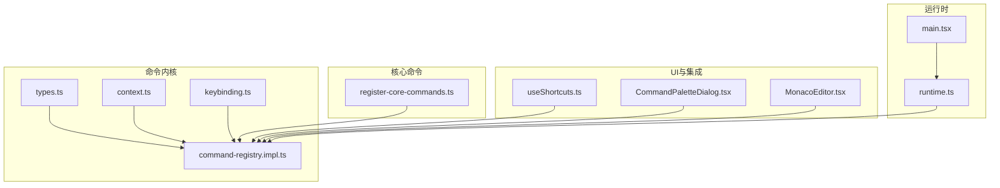
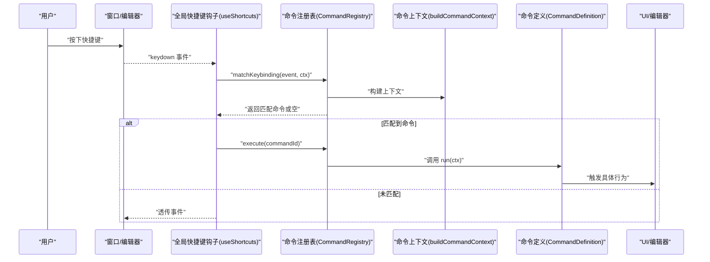
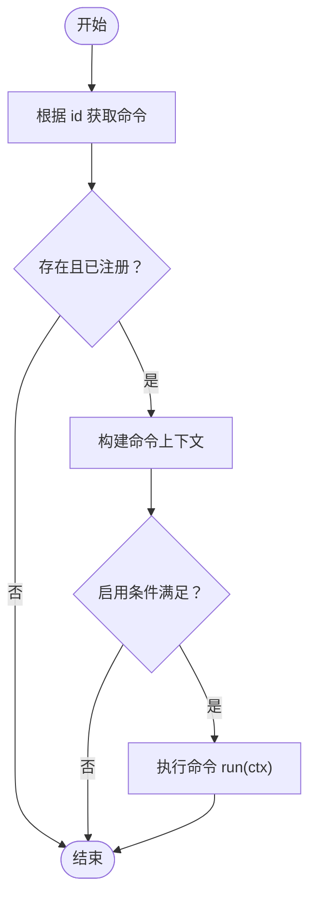
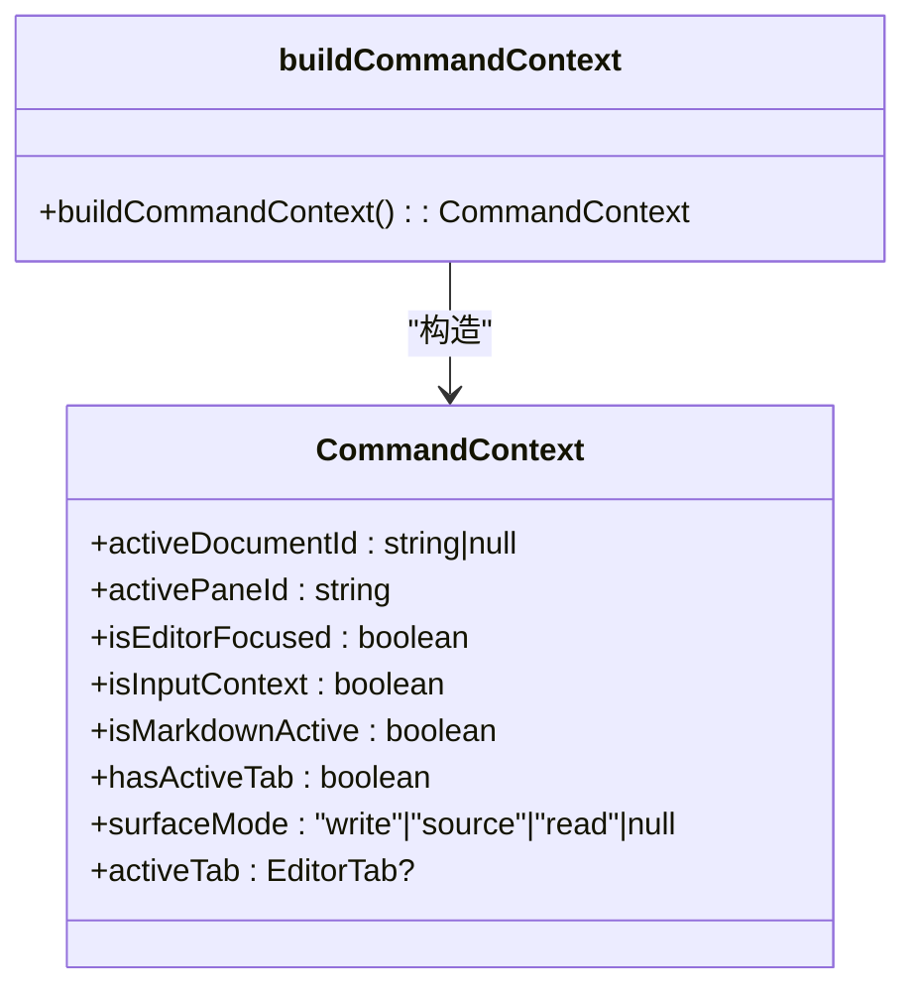
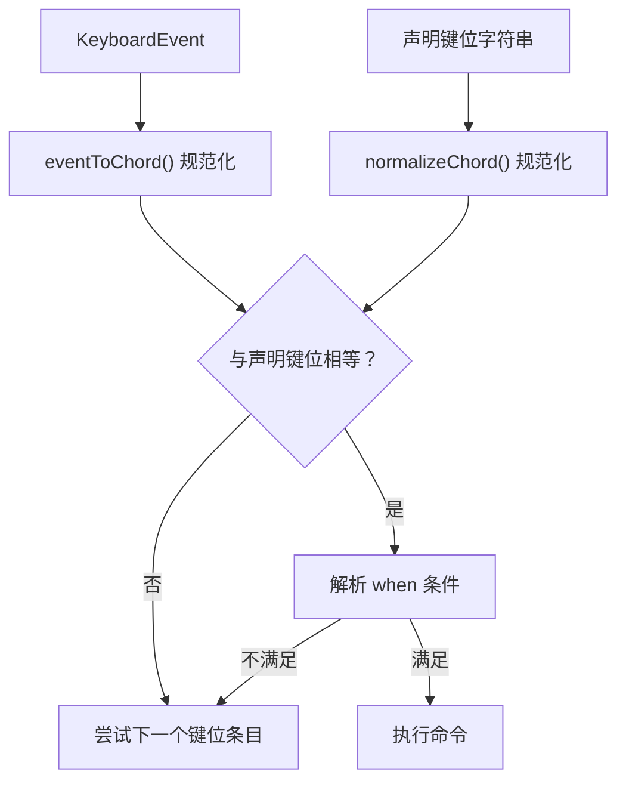
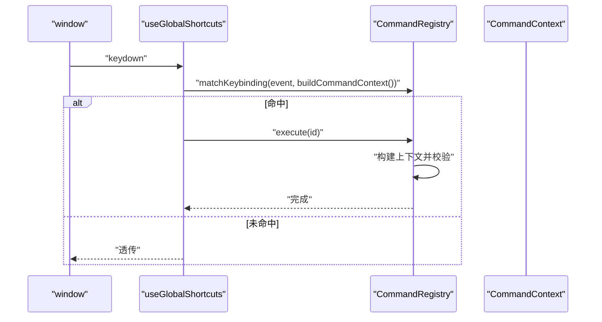
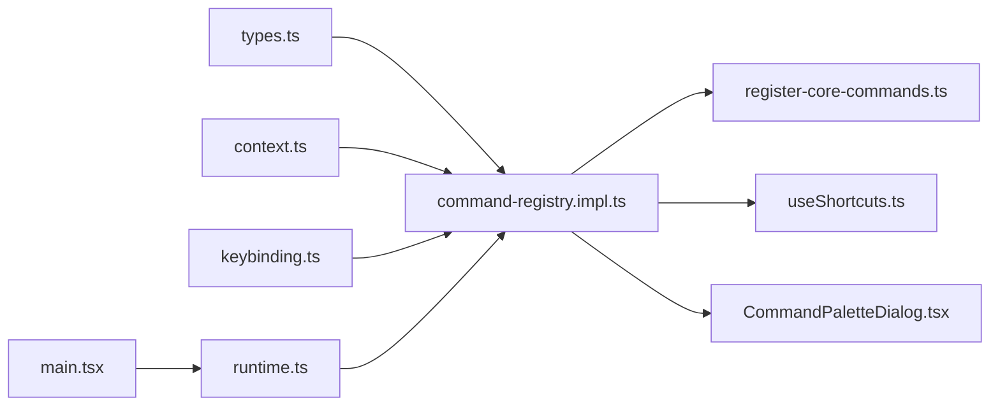

# 编辑器命令API

<cite>
**本文引用的文件**
- [src/core/command/command-registry.impl.ts](file://src/core/command/command-registry.impl.ts)
- [src/core/command/context.ts](file://src/core/command/context.ts)
- [src/core/command/keybinding.ts](file://src/core/command/keybinding.ts)
- [src/core/command/register-core-commands.ts](file://src/core/command/register-core-commands.ts)
- [src/core/command/types.ts](file://src/core/command/types.ts)
- [src/hooks/useShortcuts.ts](file://src/hooks/useShortcuts.ts)
- [src/components/dialogs/CommandPaletteDialog.tsx](file://src/components/dialogs/CommandPaletteDialog.tsx)
- [src/components/editor/MonacoEditor.tsx](file://src/components/editor/MonacoEditor.tsx)
- [src/core/runtime.ts](file://src/core/runtime.ts)
- [src/main.tsx](file://src/main.tsx)
</cite>

## 目录
1. [简介](#简介)
2. [项目结构](#项目结构)
3. [核心组件](#核心组件)
4. [架构总览](#架构总览)
5. [详细组件分析](#详细组件分析)
6. [依赖关系分析](#依赖关系分析)
7. [性能考量](#性能考量)
8. [故障排查指南](#故障排查指南)
9. [结论](#结论)
10. [附录：使用示例与扩展指南](#附录使用示例与扩展指南)

## 简介
本文件系统性梳理 NoteForge 的编辑器命令 API，覆盖命令注册系统、参数与上下文验证、快捷键绑定（含平台差异与上下文条件）、命令上下文设计、以及命令执行与组合实践。目标是帮助开发者在不直接操作底层编辑器的情况下，通过统一的命令层实现一致的交互体验与可维护的扩展。

## 项目结构
围绕命令系统的关键目录与文件如下：
- 命令内核：类型定义、注册表、上下文构建、快捷键归一化与匹配
- 核心命令注册：内置命令的集中注册与键位绑定
- 快捷键路由：全局按键监听与命令派发
- 命令面板：命令检索与执行入口
- 编辑器集成：Monaco 编辑器内的快捷键与动作
- 运行时与入口：核心模块初始化与命令服务注入

图表来源
- [src/core/command/types.ts:1-63](file://src/core/command/types.ts#L1-L63)
- [src/core/command/context.ts:1-39](file://src/core/command/context.ts#L1-L39)
- [src/core/command/keybinding.ts:1-59](file://src/core/command/keybinding.ts#L1-L59)
- [src/core/command/command-registry.impl.ts:1-100](file://src/core/command/command-registry.impl.ts#L1-L100)
- [src/core/command/register-core-commands.ts:1-201](file://src/core/command/register-core-commands.ts#L1-L201)
- [src/hooks/useShortcuts.ts:1-24](file://src/hooks/useShortcuts.ts#L1-L24)
- [src/components/dialogs/CommandPaletteDialog.tsx:1-100](file://src/components/dialogs/CommandPaletteDialog.tsx#L1-L100)
- [src/components/editor/MonacoEditor.tsx:71-245](file://src/components/editor/MonacoEditor.tsx#L71-L245)
- [src/core/runtime.ts:72-115](file://src/core/runtime.ts#L72-L115)
- [src/main.tsx:1-23](file://src/main.tsx#L1-L23)

章节来源
- [src/core/command/types.ts:1-63](file://src/core/command/types.ts#L1-L63)
- [src/core/command/command-registry.impl.ts:1-100](file://src/core/command/command-registry.impl.ts#L1-L100)
- [src/core/command/context.ts:1-39](file://src/core/command/context.ts#L1-L39)
- [src/core/command/keybinding.ts:1-59](file://src/core/command/keybinding.ts#L1-L59)
- [src/core/command/register-core-commands.ts:1-201](file://src/core/command/register-core-commands.ts#L1-L201)
- [src/hooks/useShortcuts.ts:1-24](file://src/hooks/useShortcuts.ts#L1-L24)
- [src/components/dialogs/CommandPaletteDialog.tsx:1-100](file://src/components/dialogs/CommandPaletteDialog.tsx#L1-L100)
- [src/components/editor/MonacoEditor.tsx:71-245](file://src/components/editor/MonacoEditor.tsx#L71-L245)
- [src/core/runtime.ts:72-115](file://src/core/runtime.ts#L72-L115)
- [src/main.tsx:1-23](file://src/main.tsx#L1-L23)

## 核心组件
- 命令定义与类型：统一的命令结构、分类、键位与启用条件
- 命令注册表：命令注册、执行、列表与键位匹配
- 命令上下文：从编辑器状态、活动标签、焦点位置等构建上下文
- 键位系统：跨平台键位归一化、格式化与匹配
- 全局快捷键路由：统一的键盘事件捕获与命令派发
- 核心命令注册：内置命令的键位绑定与启用条件
- 命令面板：命令检索与执行入口
- 编辑器集成：Monaco 内部快捷键与动作，避免与命令层重复

章节来源
- [src/core/command/types.ts:1-63](file://src/core/command/types.ts#L1-L63)
- [src/core/command/command-registry.impl.ts:1-100](file://src/core/command/command-registry.impl.ts#L1-L100)
- [src/core/command/context.ts:1-39](file://src/core/command/context.ts#L1-L39)
- [src/core/command/keybinding.ts:1-59](file://src/core/command/keybinding.ts#L1-L59)
- [src/core/command/register-core-commands.ts:1-201](file://src/core/command/register-core-commands.ts#L1-L201)
- [src/hooks/useShortcuts.ts:1-24](file://src/hooks/useShortcuts.ts#L1-L24)
- [src/components/dialogs/CommandPaletteDialog.tsx:1-100](file://src/components/dialogs/CommandPaletteDialog.tsx#L1-L100)
- [src/components/editor/MonacoEditor.tsx:71-245](file://src/components/editor/MonacoEditor.tsx#L71-L245)

## 架构总览
命令系统遵循“一个用户动作，一条路径”的原则：快捷键、命令面板、菜单均通过同一注册表与执行管线，确保一致性与可扩展性。

图表来源
- [src/hooks/useShortcuts.ts:7-24](file://src/hooks/useShortcuts.ts#L7-L24)
- [src/core/command/command-registry.impl.ts:30-67](file://src/core/command/command-registry.impl.ts#L30-L67)
- [src/core/command/context.ts:6-38](file://src/core/command/context.ts#L6-L38)
- [src/core/command/types.ts:29-45](file://src/core/command/types.ts#L29-L45)

## 详细组件分析

### 命令注册表与执行流程
- 注册：将命令写入内存映射，并建立键位索引；支持返回注销函数以移除命令与键位索引项
- 执行：按 id 获取命令，构建上下文，应用启用条件，再异步执行
- 列表：过滤隐藏项、按类别与查询词筛选、按标题排序
- 键位匹配：规范化事件与声明键位，结合 when 条件与启用条件进行最终判定

图表来源
- [src/core/command/command-registry.impl.ts:14-37](file://src/core/command/command-registry.impl.ts#L14-L37)

章节来源
- [src/core/command/command-registry.impl.ts:1-100](file://src/core/command/command-registry.impl.ts#L1-L100)

### 命令上下文系统
上下文从编辑器状态与文档视图中提取，用于控制命令可用性与行为分支：
- 活动文档与标签页：当前激活的文档 ID、标签对象
- 焦点与输入上下文：是否聚焦于编辑器或输入控件
- 文档类型：是否为 Markdown
- 工作表面模式：写/源码/阅读等模式
- 面板与标签页存在性：是否存在活动标签

图表来源
- [src/core/command/context.ts:6-38](file://src/core/command/context.ts#L6-L38)
- [src/core/command/types.ts:12-21](file://src/core/command/types.ts#L12-L21)

章节来源
- [src/core/command/context.ts:1-39](file://src/core/command/context.ts#L1-L39)
- [src/core/command/types.ts:12-21](file://src/core/command/types.ts#L12-L21)

### 快捷键绑定机制
- 平台差异：通过检测平台设置修饰键符号与 Mod 键来源（Meta/Ctrl）
- 归一化：将键盘事件转换为“Mod+Shift+Alt+Key”形式，统一大小写与特殊键名
- 匹配：声明式键位与事件键位严格相等；支持 when 条件（如 editorFocus、markdown、hasActiveTab 等）
- 冲突处理：注册表遍历键位索引，先匹配到的即生效；可通过 when 与 enabled 精细控制优先级

图表来源
- [src/core/command/keybinding.ts:19-51](file://src/core/command/keybinding.ts#L19-L51)
- [src/core/command/command-registry.impl.ts:53-65](file://src/core/command/command-registry.impl.ts#L53-L65)

章节来源
- [src/core/command/keybinding.ts:1-59](file://src/core/command/keybinding.ts#L1-L59)
- [src/core/command/command-registry.impl.ts:53-80](file://src/core/command/command-registry.impl.ts#L53-L80)

### 全局快捷键路由与命令面板
- 全局路由：在应用生命周期中挂载全局 keydown 监听，仅在满足修饰键或 F1 时交由命令系统处理
- 命令面板：打开后按输入关键字过滤命令列表，支持键盘上下移动与回车执行

图表来源
- [src/hooks/useShortcuts.ts:8-23](file://src/hooks/useShortcuts.ts#L8-L23)
- [src/core/command/command-registry.impl.ts:30-67](file://src/core/command/command-registry.impl.ts#L30-L67)
- [src/core/command/context.ts:6-38](file://src/core/command/context.ts#L6-L38)

章节来源
- [src/hooks/useShortcuts.ts:1-24](file://src/hooks/useShortcuts.ts#L1-L24)
- [src/components/dialogs/CommandPaletteDialog.tsx:1-100](file://src/components/dialogs/CommandPaletteDialog.tsx#L1-L100)

### 核心命令注册与上下文相关快捷键
- 文件类：新建、保存、另存为、关闭标签
- 视图类：切换侧边栏、右侧面板
- 导航类：快速打开/搜索、全局搜索、命令面板
- 工作区：分屏
- 笔记类：打开今日日记
- 编辑类：切换语言模式、切换 Markdown 表面模式（需 Markdown 激活）

章节来源
- [src/core/command/register-core-commands.ts:1-201](file://src/core/command/register-core-commands.ts#L1-L201)

### 编辑器集成与冲突规避
- Monaco 内部快捷键：编辑器内部保留若干常用快捷键（如查找、替换、跳转行、行移动、注释等），避免与命令层重复
- 命令层接管：保存等关键操作通过命令层统一处理，确保一致性与可扩展性

章节来源
- [src/components/editor/MonacoEditor.tsx:92-130](file://src/components/editor/MonacoEditor.tsx#L92-L130)
- [src/components/editor/MonacoEditor.tsx:96-101](file://src/components/editor/MonacoEditor.tsx#L96-L101)

## 依赖关系分析
- 类型与上下文：命令注册表依赖类型定义与上下文构建
- 键位系统：注册表依赖键位归一化与匹配工具
- 全局路由：依赖上下文构建与注册表
- 核心命令：依赖注册表与上下文，同时依赖 UI/编辑器状态
- 命令面板：依赖注册表与键位格式化
- 运行时：在核心运行时中注入命令服务，供全局访问

图表来源
- [src/core/command/types.ts:1-63](file://src/core/command/types.ts#L1-L63)
- [src/core/command/context.ts:1-39](file://src/core/command/context.ts#L1-L39)
- [src/core/command/keybinding.ts:1-59](file://src/core/command/keybinding.ts#L1-L59)
- [src/core/command/command-registry.impl.ts:1-100](file://src/core/command/command-registry.impl.ts#L1-L100)
- [src/core/command/register-core-commands.ts:1-201](file://src/core/command/register-core-commands.ts#L1-L201)
- [src/hooks/useShortcuts.ts:1-24](file://src/hooks/useShortcuts.ts#L1-L24)
- [src/components/dialogs/CommandPaletteDialog.tsx:1-100](file://src/components/dialogs/CommandPaletteDialog.tsx#L1-L100)
- [src/core/runtime.ts:72-115](file://src/core/runtime.ts#L72-L115)
- [src/main.tsx:1-23](file://src/main.tsx#L1-L23)

章节来源
- [src/core/command/types.ts:1-63](file://src/core/command/types.ts#L1-L63)
- [src/core/command/command-registry.impl.ts:1-100](file://src/core/command/command-registry.impl.ts#L1-L100)
- [src/core/runtime.ts:72-115](file://src/core/runtime.ts#L72-L115)
- [src/main.tsx:1-23](file://src/main.tsx#L1-L23)

## 性能考量
- 键位匹配复杂度：注册表维护键位索引，匹配时线性扫描索引，整体近似 O(N)；N 为已注册命令数
- 上下文构建：读取编辑器状态与文档视图，开销与标签数量与文档状态相关
- 列表与过滤：内存中过滤与排序，建议限制命令总数与面板渲染范围
- 异步执行：命令执行为异步，避免阻塞主线程

## 故障排查指南
- 快捷键无效
  - 检查是否处于输入上下文（when 中可能包含 inputContext 或 !inputContext）
  - 确认 enabled 条件是否满足
  - 核对键位是否与平台修饰键一致（Mac 使用 ⌘，其他使用 Ctrl）
- 命令面板无结果
  - 确认命令未设置 palette=false
  - 检查查询关键词与命令标题/id 是否匹配
- 命令被覆盖或冲突
  - 调整 when 条件或 enabled 条件，确保优先级符合预期
  - 在注册时为命令提供更精确的上下文条件
- 编辑器快捷键与命令冲突
  - 避免在命令层重复绑定编辑器已有的快捷键（如查找、替换、跳转行等）

章节来源
- [src/core/command/command-registry.impl.ts:53-80](file://src/core/command/command-registry.impl.ts#L53-L80)
- [src/core/command/keybinding.ts:14-59](file://src/core/command/keybinding.ts#L14-L59)
- [src/components/dialogs/CommandPaletteDialog.tsx:15-35](file://src/components/dialogs/CommandPaletteDialog.tsx#L15-L35)

## 结论
NoteForge 的命令系统以统一的注册表为核心，配合上下文构建与键位归一化，实现了全局快捷键、命令面板与编辑器动作的一致性与可扩展性。通过 when 条件与 enabled 控制，命令能够在不同场景下精准生效；通过 cmd 辅助与 CORE_COMMANDS 常量，开发者可以安全地扩展与维护命令生态。

## 附录：使用示例与扩展指南

### 自定义命令开发
- 定义命令：提供 id、title、category、可选 keybindings、enabled 与 run
- 注册命令：通过注册表注册，返回的注销函数可用于清理
- 示例路径
  - [命令定义与注册辅助:84-89](file://src/core/command/command-registry.impl.ts#L84-L89)
  - [核心命令注册示例:11-201](file://src/core/command/register-core-commands.ts#L11-L201)

### 命令组合与批量操作
- 组合思路：在 run 中顺序调用多个命令或封装为复合动作
- 批量操作：在 run 中遍历当前上下文中的多个目标（如多标签页）并逐一执行
- 注意：保持异步执行与错误隔离，避免单个失败影响整体

### 快捷键绑定最佳实践
- 使用 when 条件限定生效范围（如 editorFocus、markdown、hasActiveTab）
- 避免与编辑器默认快捷键冲突（参考编辑器集成部分）
- 提供多平台兼容的键位表达（Mod、Shift、Alt）

### 命令上下文使用要点
- 通过上下文判断当前是否为 Markdown、是否有活动标签、是否聚焦编辑器
- 根据 surfaceMode 决定命令行为（如切换表面模式）
- 将上下文作为 run 的唯一输入，减少外部耦合

### 运行时与入口
- 应用启动时初始化核心运行时，注入命令服务
- 全局快捷键钩子在应用生命周期中挂载，统一接收键盘事件

章节来源
- [src/core/runtime.ts:72-115](file://src/core/runtime.ts#L72-L115)
- [src/main.tsx:12-15](file://src/main.tsx#L12-L15)
- [src/hooks/useShortcuts.ts:8-23](file://src/hooks/useShortcuts.ts#L8-L23)