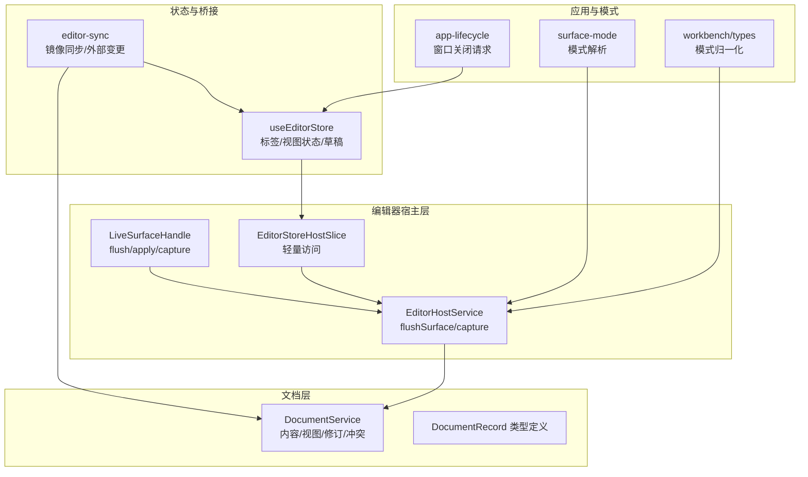
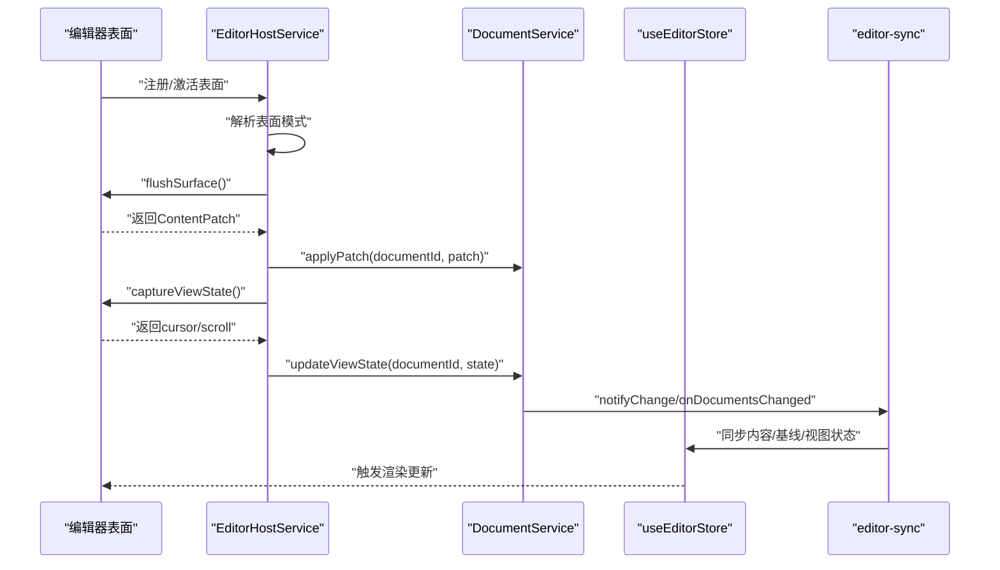
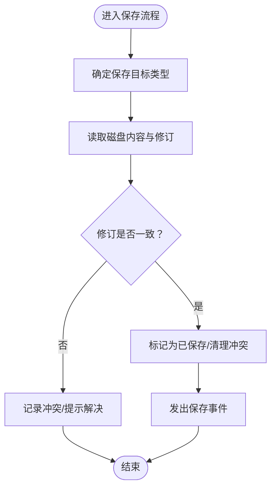
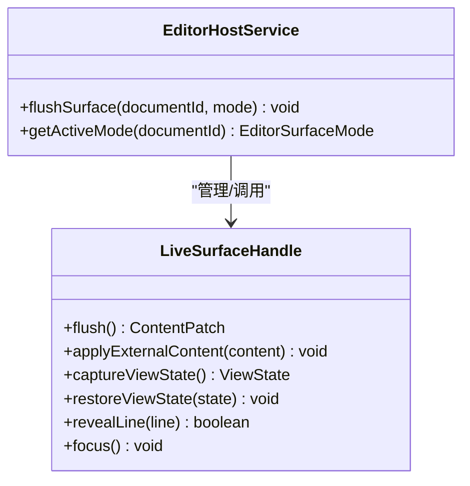
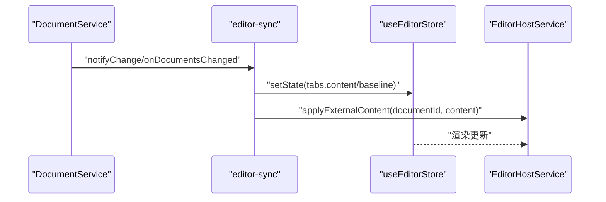
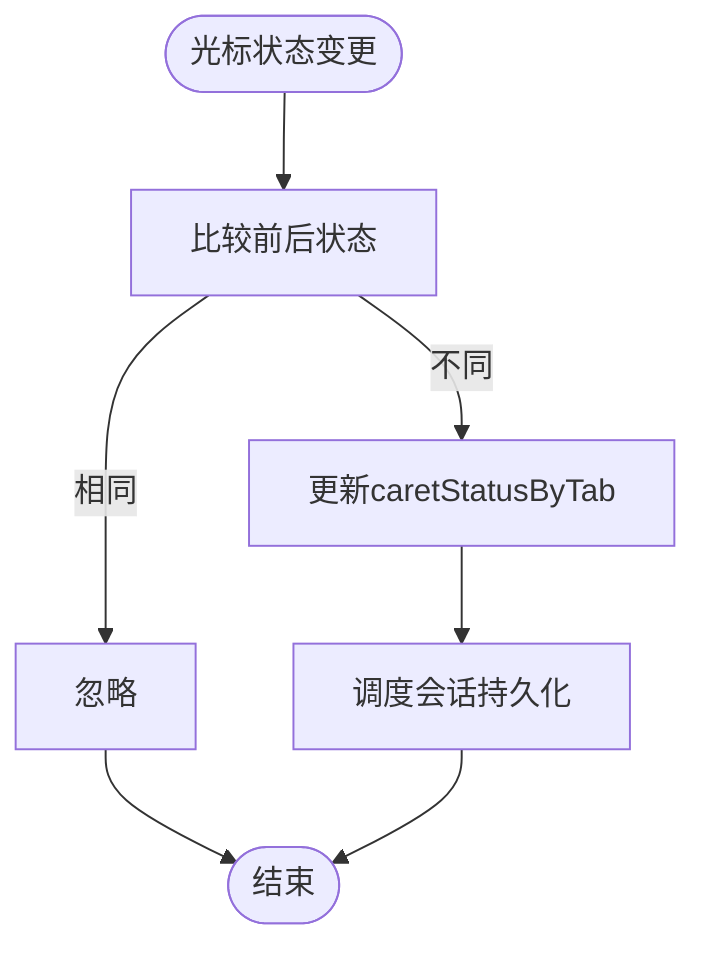
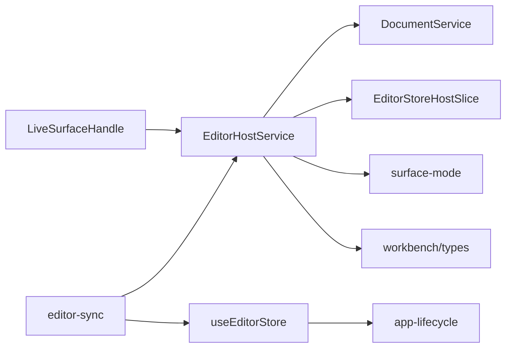

# 编辑器状态管理API

<cite>
**本文引用的文件**
- [src/core/document/document-service.impl.ts](file://src/core/document/document-service.impl.ts)
- [src/core/document/types.ts](file://src/core/document/types.ts)
- [src/core/editor/editor-host.impl.ts](file://src/core/editor/editor-host.impl.ts)
- [src/core/editor/surface-handle.ts](file://src/core/editor/surface-handle.ts)
- [src/core/bridge/editor-store-bridge.ts](file://src/core/bridge/editor-store-bridge.ts)
- [src/core/bridge/editor-sync.ts](file://src/core/bridge/editor-sync.ts)
- [src/store/editor.ts](file://src/store/editor.ts)
- [src/lib/app-lifecycle.ts](file://src/lib/app-lifecycle.ts)
- [src/core/events.ts](file://src/core/events.ts)
- [src/core/workbench/types.ts](file://src/core/workbench/types.ts)
- [src/lib/surface-mode.ts](file://src/lib/surface-mode.ts)
</cite>

## 目录
1. [简介](#简介)
2. [项目结构](#项目结构)
3. [核心组件](#核心组件)
4. [架构总览](#架构总览)
5. [详细组件分析](#详细组件分析)
6. [依赖分析](#依赖分析)
7. [性能考量](#性能考量)
8. [故障排查指南](#故障排查指南)
9. [结论](#结论)
10. [附录](#附录)

## 简介
本文件面向NoteForge编辑器状态管理API，系统性阐述编辑器状态的存储与同步机制，覆盖内容状态、光标位置与选择状态管理；详解编辑器宿主系统的设计与实例生命周期控制；阐明状态变更的监听与响应机制，包括实时同步与冲突解决策略；并提供状态订阅、状态更新与错误处理的使用示例与最佳实践。

## 项目结构
围绕编辑器状态管理的关键模块分布如下：
- 文档服务与记录：负责文档内容、视图状态、修订与冲突管理
- 编辑器宿主：桥接UI表面与文档服务，驱动状态刷新与视图状态捕获
- 表面句柄：定义活跃编辑器表面的生命周期与状态读写接口
- 状态桥接：在编辑器存储与宿主之间建立轻量化访问通道
- 应用生命周期：窗口关闭请求与退出流程集成
- 工作台与表面模式：统一解析与归一化编辑器表面模式

图表来源
- [src/core/document/document-service.impl.ts:48-407](file://src/core/document/document-service.impl.ts#L48-L407)
- [src/core/editor/editor-host.impl.ts:14-39](file://src/core/editor/editor-host.impl.ts#L14-L39)
- [src/core/editor/surface-handle.ts:1-26](file://src/core/editor/surface-handle.ts#L1-L26)
- [src/core/bridge/editor-store-bridge.ts:1-27](file://src/core/bridge/editor-store-bridge.ts#L1-L27)
- [src/core/bridge/editor-sync.ts](file://src/core/bridge/editor-sync.ts)
- [src/store/editor.ts:281-304](file://src/store/editor.ts#L281-L304)
- [src/lib/app-lifecycle.ts:13-30](file://src/lib/app-lifecycle.ts#L13-L30)
- [src/lib/surface-mode.ts](file://src/lib/surface-mode.ts)
- [src/core/workbench/types.ts](file://src/core/workbench/types.ts)

章节来源
- [src/core/document/document-service.impl.ts:48-407](file://src/core/document/document-service.impl.ts#L48-L407)
- [src/core/editor/editor-host.impl.ts:14-39](file://src/core/editor/editor-host.impl.ts#L14-L39)
- [src/core/editor/surface-handle.ts:1-26](file://src/core/editor/surface-handle.ts#L1-L26)
- [src/core/bridge/editor-store-bridge.ts:1-27](file://src/core/bridge/editor-store-bridge.ts#L1-L27)
- [src/core/bridge/editor-sync.ts](file://src/core/bridge/editor-sync.ts)
- [src/store/editor.ts:281-304](file://src/store/editor.ts#L281-L304)
- [src/lib/app-lifecycle.ts:13-30](file://src/lib/app-lifecycle.ts#L13-L30)
- [src/lib/surface-mode.ts](file://src/lib/surface-mode.ts)
- [src/core/workbench/types.ts](file://src/core/workbench/types.ts)

## 核心组件
- 文档服务与记录
  - 提供内容补丁应用、视图状态更新、保存、回滚与外部变更通知
  - 维护修订、磁盘状态、脏标记与生命周期
- 编辑器宿主
  - 注册/注销活跃表面，刷新表面状态为文档补丁与视图状态
  - 解析当前表面模式并驱动同步
- 表面句柄
  - 定义flush/apply/capture/restore等接口，承载编辑器模型与视图状态交互
- 状态桥接
  - 通过轻量slice暴露标签与表面模式，避免循环依赖
  - 提供镜像同步函数，确保文档记录与编辑器标签状态一致
- 编辑器存储
  - 维护标签集合、面板布局、活动标签映射、光标状态快照
  - 提供报告光标状态与会话持久化调度

章节来源
- [src/core/document/document-service.impl.ts:227-367](file://src/core/document/document-service.impl.ts#L227-L367)
- [src/core/editor/editor-host.impl.ts:14-39](file://src/core/editor/editor-host.impl.ts#L14-L39)
- [src/core/editor/surface-handle.ts:1-26](file://src/core/editor/surface-handle.ts#L1-L26)
- [src/core/bridge/editor-store-bridge.ts:1-27](file://src/core/bridge/editor-store-bridge.ts#L1-L27)
- [src/core/bridge/editor-sync.ts](file://src/core/bridge/editor-sync.ts)
- [src/store/editor.ts:281-304](file://src/store/editor.ts#L281-L304)

## 架构总览
编辑器状态管理采用“文档真相源 + 表面桥接 + 轻量状态桥”的分层设计：
- 文档服务作为唯一真相源，负责内容与视图状态的权威更新
- 编辑器宿主从状态桥获取当前标签与模式，调用表面句柄flush并回写文档
- 状态桥向宿主暴露最小必要信息，避免跨层循环依赖
- 镜像同步在文档变更时将内容与视图状态同步至编辑器标签，保证UI一致性

图表来源
- [src/core/editor/editor-host.impl.ts:26-39](file://src/core/editor/editor-host.impl.ts#L26-L39)
- [src/core/document/document-service.impl.ts:54-72](file://src/core/document/document-service.impl.ts#L54-L72)
- [src/core/bridge/editor-sync.ts](file://src/core/bridge/editor-sync.ts)
- [src/store/editor.ts:281-304](file://src/store/editor.ts#L281-L304)

## 详细组件分析

### 文档服务与记录
- 内容与视图状态
  - applyPatch支持替换全部或基于范围的插入/删除
  - updateViewState合并光标与滚动锚点，触发视图状态变更事件
- 保存与回滚
  - save根据目标类型定位保存路径，对比磁盘修订，写入后清理冲突并发出保存事件
  - revert从磁盘重载内容，清理草稿与冲突，发出文档变更事件
- 外部变更与冲突
  - notifyExternalChange检测磁盘修订变化，非脏状态时重载内容并更新磁盘元数据
  - getConflict/resolveConflict支持冲突查询与解决（如从磁盘重载）

图表来源
- [src/core/document/document-service.impl.ts:250-347](file://src/core/document/document-service.impl.ts#L250-L347)

章节来源
- [src/core/document/document-service.impl.ts:227-367](file://src/core/document/document-service.impl.ts#L227-L367)
- [src/core/document/document-service.impl.ts:369-392](file://src/core/document/document-service.impl.ts#L369-L392)
- [src/core/document/document-service.impl.ts:394-407](file://src/core/document/document-service.impl.ts#L394-L407)

### 编辑器宿主系统
- 实例管理
  - 使用Map维护documentId+模式到LiveSurfaceHandle的映射
  - 通过surfaceRegistrationKey生成唯一键
- 生命周期控制
  - flushSurface从表面句柄收集补丁与视图状态，并回写至文档服务
  - getActiveMode从编辑器存储中解析当前表面模式，结合表面模式解析与归一化

图表来源
- [src/core/editor/editor-host.impl.ts:14-39](file://src/core/editor/editor-host.impl.ts#L14-L39)
- [src/core/editor/surface-handle.ts:1-26](file://src/core/editor/surface-handle.ts#L1-L26)

章节来源
- [src/core/editor/editor-host.impl.ts:14-39](file://src/core/editor/editor-host.impl.ts#L14-L39)
- [src/core/editor/surface-handle.ts:1-26](file://src/core/editor/surface-handle.ts#L1-L26)

### 状态桥接与镜像同步
- 轻量访问
  - EditorStoreHostSlice仅暴露tabs与applySurfaceMode，避免循环依赖
  - wireEditorStoreHost/getEditorStoreHost提供桥接入口
- 镜像同步
  - syncDocumentToEditorTabs在文档变更时将内容与基线同步至所有标签，并应用外部内容到编辑器
  - onDocumentsChanged回调对所有文档执行镜像同步

图表来源
- [src/core/bridge/editor-sync.ts](file://src/core/bridge/editor-sync.ts)
- [src/core/bridge/editor-store-bridge.ts:11-23](file://src/core/bridge/editor-store-bridge.ts#L11-L23)
- [src/core/document/document-service.impl.ts:54-72](file://src/core/document/document-service.impl.ts#L54-L72)

章节来源
- [src/core/bridge/editor-store-bridge.ts:1-27](file://src/core/bridge/editor-store-bridge.ts#L1-L27)
- [src/core/bridge/editor-sync.ts](file://src/core/bridge/editor-sync.ts)
- [src/core/document/document-service.impl.ts:54-72](file://src/core/document/document-service.impl.ts#L54-L72)

### 光标与视图状态管理
- 状态采集与恢复
  - LiveSurfaceHandle提供captureViewState/restoreViewState用于光标与滚动锚点的读取与恢复
- 状态订阅
  - useEditorStore.reportCaretStatus根据光标变化更新状态快照，避免重复设置
- 会话持久化
  - finalizeClosePane在关闭面板时调度会话持久化

图表来源
- [src/store/editor.ts:290-304](file://src/store/editor.ts#L290-L304)
- [src/core/editor/surface-handle.ts:11-18](file://src/core/editor/surface-handle.ts#L11-L18)

章节来源
- [src/store/editor.ts:290-304](file://src/store/editor.ts#L290-L304)
- [src/core/editor/surface-handle.ts:11-18](file://src/core/editor/surface-handle.ts#L11-L18)

### 应用生命周期与退出控制
- 窗口关闭请求
  - installAppLifecycle监听窗口关闭请求，调用编辑器存储的requestAppExit以允许/阻止退出
- 与编辑器状态的集成
  - 通过Tauri API获取当前窗口并绑定关闭事件

章节来源
- [src/lib/app-lifecycle.ts:13-30](file://src/lib/app-lifecycle.ts#L13-L30)

## 依赖分析
- 组件耦合
  - EditorHostService依赖DocumentService与编辑器存储桥接
  - LiveSurfaceHandle由宿主管理，提供最小接口给宿主
  - editor-sync依赖useEditorStore与EditorHostService进行镜像同步
- 外部依赖
  - Tauri窗口API用于生命周期钩子
  - 工作台类型与表面模式解析用于模式统一

图表来源
- [src/core/editor/editor-host.impl.ts:14-39](file://src/core/editor/editor-host.impl.ts#L14-L39)
- [src/core/bridge/editor-store-bridge.ts:1-27](file://src/core/bridge/editor-store-bridge.ts#L1-L27)
- [src/core/bridge/editor-sync.ts](file://src/core/bridge/editor-sync.ts)
- [src/lib/app-lifecycle.ts:13-30](file://src/lib/app-lifecycle.ts#L13-L30)
- [src/lib/surface-mode.ts](file://src/lib/surface-mode.ts)
- [src/core/workbench/types.ts](file://src/core/workbench/types.ts)

章节来源
- [src/core/editor/editor-host.impl.ts:14-39](file://src/core/editor/editor-host.impl.ts#L14-L39)
- [src/core/bridge/editor-store-bridge.ts:1-27](file://src/core/bridge/editor-store-bridge.ts#L1-L27)
- [src/core/bridge/editor-sync.ts](file://src/core/bridge/editor-sync.ts)
- [src/lib/app-lifecycle.ts:13-30](file://src/lib/app-lifecycle.ts#L13-L30)
- [src/lib/surface-mode.ts](file://src/lib/surface-mode.ts)
- [src/core/workbench/types.ts](file://src/core/workbench/types.ts)

## 性能考量
- 内容持有与Piece Tree优化
  - 建议编辑真相仅存在于编辑器模型内，业务层仅保留元数据（路径、脏修订、视图状态），避免在React/Zustand层重复持有全量内容
- 同步策略
  - 避免每次按键都进行全量replace-all，减少对Monaco Piece Tree优化的抵消
- 事件与镜像同步
  - onDocumentsChanged对所有文档执行镜像同步，应避免不必要的全量更新

章节来源
- [.tmp/noteforgeChat.md:594-821](file://.tmp/noteforgeChat.md#L594-L821)
- [src/core/document/document-service.impl.ts:54-72](file://src/core/document/document-service.impl.ts#L54-L72)

## 故障排查指南
- 保存失败与取消
  - SaveCancelledError用于标识保存被取消的场景，需在调用方捕获并提示用户
- 冲突处理
  - getConflict用于查询冲突；resolveConflict支持从磁盘重载等策略
- 外部变更未生效
  - 检查notifyExternalChange逻辑：仅当文档非脏且磁盘修订发生变化时才会重载
- 光标状态不更新
  - 确认reportCaretStatus的调用频率与状态比较逻辑，避免重复设置

章节来源
- [src/core/document/document-service.impl.ts:41-46](file://src/core/document/document-service.impl.ts#L41-L46)
- [src/core/document/document-service.impl.ts:394-407](file://src/core/document/document-service.impl.ts#L394-L407)
- [src/core/document/document-service.impl.ts:369-392](file://src/core/document/document-service.impl.ts#L369-L392)
- [src/store/editor.ts:290-304](file://src/store/editor.ts#L290-L304)

## 结论
NoteForge的编辑器状态管理以文档服务为核心，通过编辑器宿主与表面句柄完成状态刷新与视图状态捕获，借助状态桥接与镜像同步保障UI一致性。遵循“真相源在文档层”的设计原则，可有效降低重复持有与全量同步带来的性能损耗，并通过清晰的事件与冲突处理机制提升稳定性与用户体验。

## 附录

### API使用示例（步骤说明）
- 订阅状态变更
  - 监听文档服务事件（如视图状态变更、保存完成、文档变更），在回调中触发UI更新
  - 示例路径：[src/core/document/document-service.impl.ts:247](file://src/core/document/document-service.impl.ts#L247)
- 更新内容状态
  - 通过flushSurface将编辑器表面的补丁应用到文档服务
  - 示例路径：[src/core/editor/editor-host.impl.ts:30-33](file://src/core/editor/editor-host.impl.ts#L30-L33)
- 更新光标与滚动状态
  - 在flushSurface后调用captureViewState并将结果传入updateViewState
  - 示例路径：[src/core/editor/editor-host.impl.ts:35-38](file://src/core/editor/editor-host.impl.ts#L35-L38)
- 处理外部变更
  - 当磁盘内容变化时，调用notifyExternalChange以重载内容并清理脏标记
  - 示例路径：[src/core/document/document-service.impl.ts:369-392](file://src/core/document/document-service.impl.ts#L369-L392)
- 冲突解决
  - 查询冲突并选择从磁盘重载或其它策略
  - 示例路径：[src/core/document/document-service.impl.ts:394-407](file://src/core/document/document-service.impl.ts#L394-L407)
- 错误处理
  - 捕获SaveCancelledError并在UI中提示用户
  - 示例路径：[src/core/document/document-service.impl.ts:41-46](file://src/core/document/document-service.impl.ts#L41-L46)

### 最佳实践
- 将编辑真相置于编辑器模型内，业务层仅保留元数据
- 避免全量replace-all，减少对Monaco优化的抵消
- 使用镜像同步时注意批量更新与去抖策略
- 在窗口关闭前通过requestAppExit进行必要的保存与清理