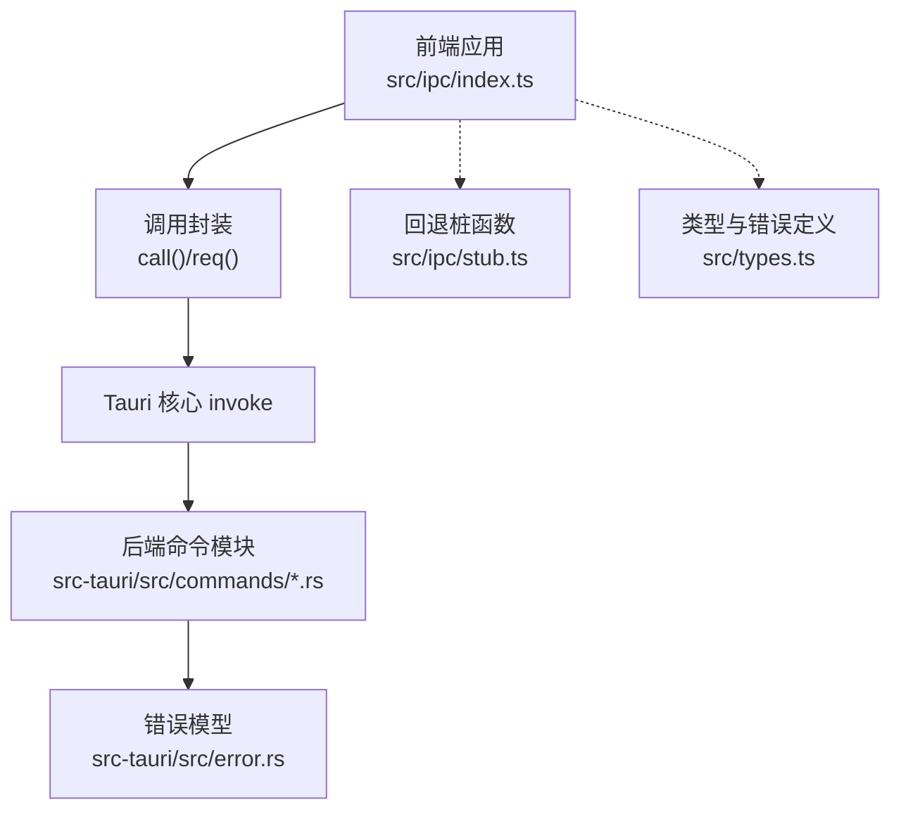
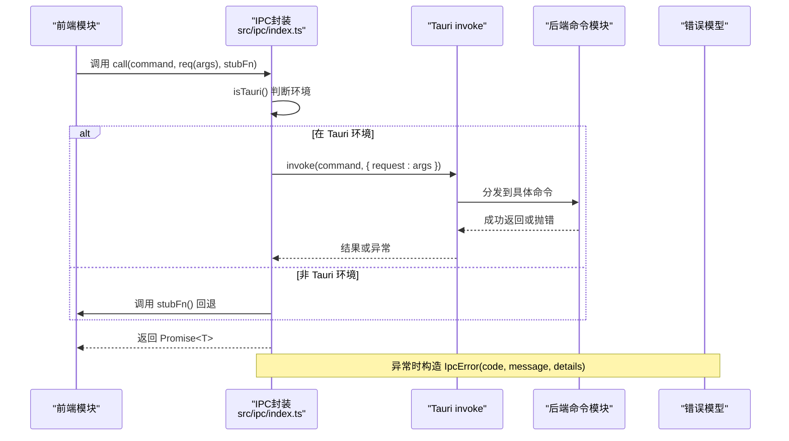
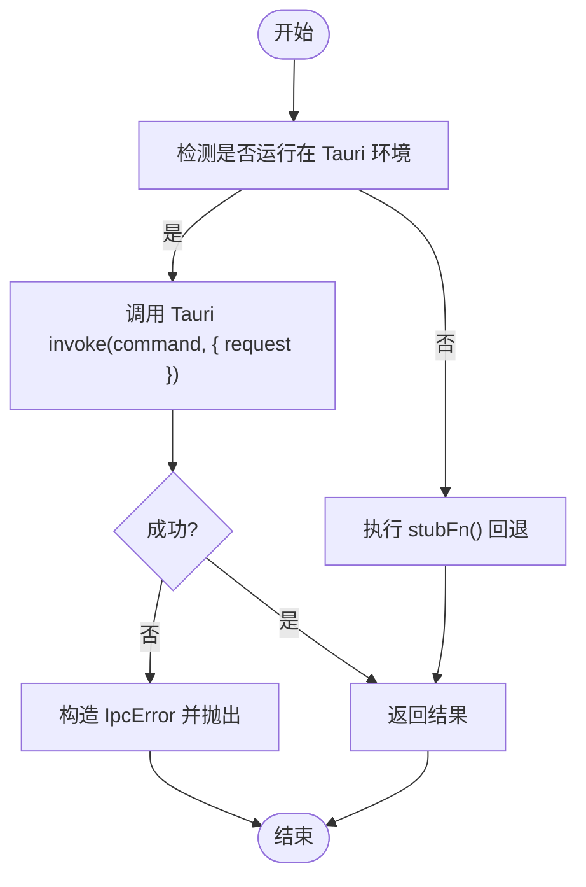
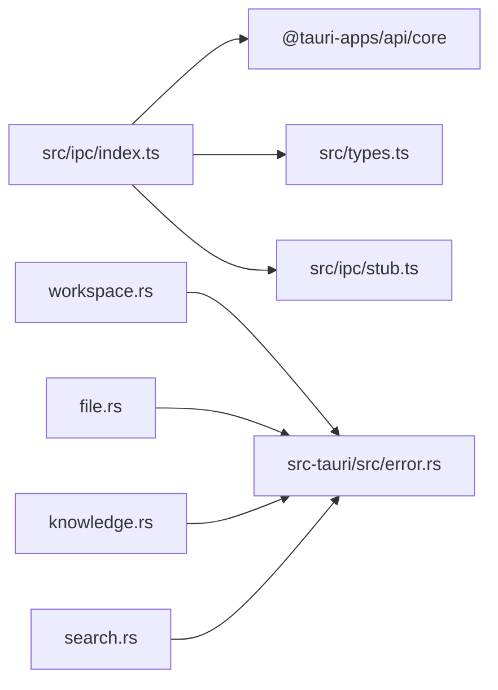

# IPC协议设计

<cite>
**本文引用的文件**
- [src/ipc/index.ts](file://src/ipc/index.ts)
- [src/ipc/stub.ts](file://src/ipc/stub.ts)
- [src/types.ts](file://src/types.ts)
- [src-tauri/src/commands/mod.rs](file://src-tauri/src/commands/mod.rs)
- [src-tauri/src/commands/workspace.rs](file://src-tauri/src/commands/workspace.rs)
- [src-tauri/src/commands/file.rs](file://src-tauri/src/commands/file.rs)
- [src-tauri/src/commands/search.rs](file://src-tauri/src/commands/search.rs)
- [src-tauri/src/commands/knowledge.rs](file://src-tauri/src/commands/knowledge.rs)
- [src-tauri/src/error.rs](file://src-tauri/src/error.rs)
- [.tmp/requirements-specification.md](file://.tmp/requirements-specification.md)
- [.tmp/noteforge-refactor-plan.md](file://.tmp/noteforge-refactor-plan.md)
- [src-tauri/gen/schemas/desktop-schema.json](file://src-tauri/gen/schemas/desktop-schema.json)
- [src-tauri/gen/schemas/macOS-schema.json](file://src-tauri/gen/schemas/macOS-schema.json)
</cite>

## 目录
1. [引言](#引言)
2. [项目结构](#项目结构)
3. [核心组件](#核心组件)
4. [架构总览](#架构总览)
5. [详细组件分析](#详细组件分析)
6. [依赖关系分析](#依赖关系分析)
7. [性能考量](#性能考量)
8. [故障排查指南](#故障排查指南)
9. [结论](#结论)
10. [附录](#附录)

## 引言
本文件系统性梳理 NoteForge 的 IPC 协议设计，聚焦于前端与后端之间的通信契约、请求-响应模式、参数封装策略、错误处理协议、版本兼容与演进机制，并给出最佳实践与扩展指南。目标是帮助开发者在不深入底层实现细节的前提下，准确理解并高效使用 IPC。

## 项目结构
NoteForge 的 IPC 分层清晰：前端通过统一的 IPC 封装发起调用；后端以 Tauri 命令形式暴露能力；错误与类型在两端对齐，确保契约一致性。



图表来源
- [src/ipc/index.ts:52-105](file://src/ipc/index.ts#L52-L105)
- [src-tauri/src/commands/mod.rs:1-50](file://src-tauri/src/commands/mod.rs#L1-L50)
- [src-tauri/src/error.rs:1-120](file://src-tauri/src/error.rs#L1-L120)
- [src/types.ts:333-388](file://src/types.ts#L333-L388)

章节来源
- [src/ipc/index.ts:52-105](file://src/ipc/index.ts#L52-L105)
- [src-tauri/src/commands/mod.rs:1-50](file://src-tauri/src/commands/mod.rs#L1-L50)
- [src/types.ts:333-388](file://src/types.ts#L333-L388)

## 核心组件
- 前端 IPC 封装：提供 isTauri 检测、统一调用 call、参数包装 req、以及在非 Tauri 环境下的 stub 回退。
- 错误模型：IpcError 类承载错误码与可选详情，便于上层统一处理。
- 后端命令：以模块化方式组织，每个命令对应一个功能域（如 workspace、file、search、knowledge 等）。
- 契约与命名：前后端统一采用 camelCase 字段命名，减少手动 patch。

章节来源
- [src/ipc/index.ts:52-105](file://src/ipc/index.ts#L52-L105)
- [src/types.ts:333-388](file://src/types.ts#L333-L388)
- [src-tauri/src/commands/mod.rs:1-50](file://src-tauri/src/commands/mod.rs#L1-L50)

## 架构总览
下图展示一次典型 IPC 请求的端到端流程：前端封装调用 → Tauri invoke → 后端命令处理 → 返回结果或错误。



图表来源
- [src/ipc/index.ts:52-105](file://src/ipc/index.ts#L52-L105)
- [src-tauri/src/commands/mod.rs:1-50](file://src-tauri/src/commands/mod.rs#L1-L50)
- [src-tauri/src/error.rs:1-120](file://src-tauri/src/error.rs#L1-L120)

## 详细组件分析

### 命令命名约定与参数封装
- 命名约定：前后端统一使用 camelCase 字段命名，避免前端额外转换。
- 参数封装：req 函数将任意字段对象包裹为 { request: fields }，保证后端命令签名的一致性与可读性。
- 调用模式：前端通过 call(command, req(args), stubFn) 发起请求，若处于 Tauri 环境则走真实 invoke，否则回退到 stubFn。

章节来源
- [.tmp/requirements-specification.md:139-191](file://.tmp/requirements-specification.md#L139-L191)
- [.tmp/noteforge-refactor-plan.md:89-132](file://.tmp/noteforge-refactor-plan.md#L89-L132)
- [src/ipc/index.ts:85-88](file://src/ipc/index.ts#L85-L88)

### 请求-响应模式与 req() 封装机制
- req 包装策略：将多字段参数统一封装为 request 对象，简化后端命令签名，提升可维护性。
- call 调用链：根据 isTauri 判定选择真实 invoke 或 stub 回退；异常统一转为 IpcError。
- 参数传递格式：args 为 Record<string, unknown>，最终序列化为 JSON；后端 DTO 使用 serde rename_all 保持 camelCase。



图表来源
- [src/ipc/index.ts:52-105](file://src/ipc/index.ts#L52-L105)

章节来源
- [src/ipc/index.ts:52-105](file://src/ipc/index.ts#L52-L105)

### 错误处理协议
- IpcError 类：包含 code、message、details 字段，便于上层按错误码分类处理与展示。
- 错误码枚举：ErrorCode 覆盖文件系统、工作区、索引、搜索、图谱、AI、加密等常见领域，确保语义明确。
- 异常传播：前端封装在 invoke 失败时捕获异常并构造 IpcError；后端错误模型与前端错误码对齐，保障跨层一致性。

```mermaid
classDiagram
class IpcError {
+code : ErrorCode
+details : unknown
+constructor(code, message, details)
}
class ErrorCode {
<<enumeration>>
"PATH_INVALID"
"PATH_NOT_FOUND"
"WORKSPACE_EXISTS"
"WORKSPACE_NOT_FOUND"
"INVALID_WORKSPACE"
"FILE_NOT_FOUND"
"READ_ERROR"
"WRITE_ERROR"
"DELETE_ERROR"
"CREATE_ERROR"
"RENAME_ERROR"
"MOVE_ERROR"
"PERMISSION_DENIED"
"DETECTION_FAILED"
"FORMAT_ERROR"
"UNSUPPORTED_LANGUAGE"
"INDEX_ERROR"
"INDEX_NOT_READY"
"SEARCH_ERROR"
"GRAPH_ERROR"
"PARSE_ERROR"
"AGENT_NOT_FOUND"
"MEMORY_NOT_FOUND"
"UPDATE_ERROR"
"IMPORT_ERROR"
"INVALID_FORMAT"
"AI_ERROR"
"MODEL_NOT_FOUND"
"RAG_ERROR"
"CONFIG_ERROR"
"ENCRYPT_ERROR"
"DECRYPT_ERROR"
"INVALID_PASSWORD"
"KEY_NOT_FOUND"
"EMBEDDING_ERROR"
"VECTOR_SEARCH_ERROR"
"WATCH_ERROR"
"MODEL_LIST_ERROR"
"UPDATE_CHECK_ERROR"
"QUERY_ERROR"
"UNKNOWN"
}
IpcError --> ErrorCode : "使用"
```

图表来源
- [src/types.ts:333-388](file://src/types.ts#L333-L388)

章节来源
- [src/types.ts:333-388](file://src/types.ts#L333-L388)

### 版本兼容性与 API 演进
- 契约统一：前后端 DTO 字段统一 camelCase，避免因命名差异导致的手动 patch。
- 契约对照表：针对缺失或不一致的命令与返回结构，建立对照表并逐步补齐，确保前端类型与后端实现一致。
- 自动化测试：建议引入契约测试，自动校验前后端 IPC 契约一致性，降低回归风险。

章节来源
- [.tmp/requirements-specification.md:139-191](file://.tmp/requirements-specification.md#L139-L191)
- [.tmp/noteforge-refactor-plan.md:104-132](file://.tmp/noteforge-refactor-plan.md#L104-L132)

### 协议扩展指南与自定义命令
- 新增后端命令：在 src-tauri/src/commands 下新增模块，导出命令函数并在 mod.rs 中注册；使用单 Request 结构体风格，配合 serde rename_all。
- 前端适配：在 src/ipc/index.ts 中新增对应的调用接口，遵循 req 包装与 call 调用模式；必要时补充 stub 实现。
- 类型对齐：优先以 Rust models 为契约单一真相源，前端通过手写对齐或生成工具收敛到 contracts.ts。

章节来源
- [.tmp/noteforge-refactor-plan.md:89-132](file://.tmp/noteforge-refactor-plan.md#L89-L132)
- [src-tauri/src/commands/mod.rs:1-50](file://src-tauri/src/commands/mod.rs#L1-L50)

## 依赖关系分析
- 前端依赖：@tauri-apps/api/core 提供 invoke；内部依赖 isTauri 判定与 call/req 封装；错误模型来自 src/types.ts。
- 后端依赖：各命令模块依赖统一的错误模型与数据模型；capabilities 与权限控制由 Tauri 能力配置管理。



图表来源
- [src/ipc/index.ts:52-105](file://src/ipc/index.ts#L52-L105)
- [src-tauri/src/commands/workspace.rs:1-120](file://src-tauri/src/commands/workspace.rs#L1-L120)
- [src-tauri/src/commands/file.rs:1-120](file://src-tauri/src/commands/file.rs#L1-L120)
- [src-tauri/src/commands/knowledge.rs:1-120](file://src-tauri/src/commands/knowledge.rs#L1-L120)
- [src-tauri/src/commands/search.rs:1-120](file://src-tauri/src/commands/search.rs#L1-L120)
- [src-tauri/src/error.rs:1-120](file://src-tauri/src/error.rs#L1-L120)

章节来源
- [src/ipc/index.ts:52-105](file://src/ipc/index.ts#L52-L105)
- [src-tauri/src/commands/workspace.rs:1-120](file://src-tauri/src/commands/workspace.rs#L1-L120)
- [src-tauri/src/commands/file.rs:1-120](file://src-tauri/src/commands/file.rs#L1-L120)
- [src-tauri/src/commands/knowledge.rs:1-120](file://src-tauri/src/commands/knowledge.rs#L1-L120)
- [src-tauri/src/commands/search.rs:1-120](file://src-tauri/src/commands/search.rs#L1-L120)
- [src-tauri/src/error.rs:1-120](file://src-tauri/src/error.rs#L1-L120)

## 性能考量
- 减少不必要的序列化与转换：保持参数扁平化，避免深层嵌套；统一 camelCase，避免前端二次转换。
- 合理使用 stub 回退：在开发/测试环境下使用 stub，避免真实系统调用带来的开销。
- 命令粒度与批量：对于高频操作，考虑合并或批量化请求，降低 IPC 往返次数。
- 错误快速失败：尽早校验输入参数，减少无效调用与后端处理成本。

## 故障排查指南
- 环境判定问题：确认 isTauri 返回值与运行环境一致；在非 Tauri 环境下检查 stub 是否正确实现。
- 参数不匹配：核对 req 包装后的 request 字段与后端 DTO 字段命名是否一致（camelCase）。
- 错误码定位：依据 IpcError.code 快速定位错误类别，结合 details 获取更详细的上下文信息。
- 权限与能力：若出现访问受限，检查 Tauri 能力配置与平台 schema，确保窗口具备相应权限。

章节来源
- [src/ipc/index.ts:52-105](file://src/ipc/index.ts#L52-L105)
- [src/types.ts:333-388](file://src/types.ts#L333-L388)
- [src-tauri/gen/schemas/desktop-schema.json:32-47](file://src-tauri/gen/schemas/desktop-schema.json#L32-L47)
- [src-tauri/gen/schemas/macOS-schema.json:32-47](file://src-tauri/gen/schemas/macOS-schema.json#L32-L47)

## 结论
NoteForge 的 IPC 协议以“统一命名、参数封装、错误模型、契约对齐”为核心设计原则，既保证了前后端协作的稳定性，也为后续扩展与演进提供了清晰路径。遵循本文的最佳实践与扩展指南，可在不牺牲性能与可维护性的前提下，持续完善 IPC 能力。

## 附录
- 最佳实践清单
  - 统一使用 camelCase 字段命名，避免前端转换。
  - 所有命令参数通过 req 包装为 { request }，保持签名一致。
  - 明确错误码覆盖范围，异常统一转为 IpcError。
  - 新增命令时同步补齐前端调用与 stub 实现。
  - 引入契约测试，保障前后端一致性。
- 扩展步骤
  - 后端：新增命令模块 → 注册命令 → 定义 DTO 与错误类型。
  - 前端：新增调用接口 → req 包装 → call 调用 → stub 回退。
  - 类型收敛：以 Rust models 为契约单一真相源，逐步收敛到 contracts.ts。