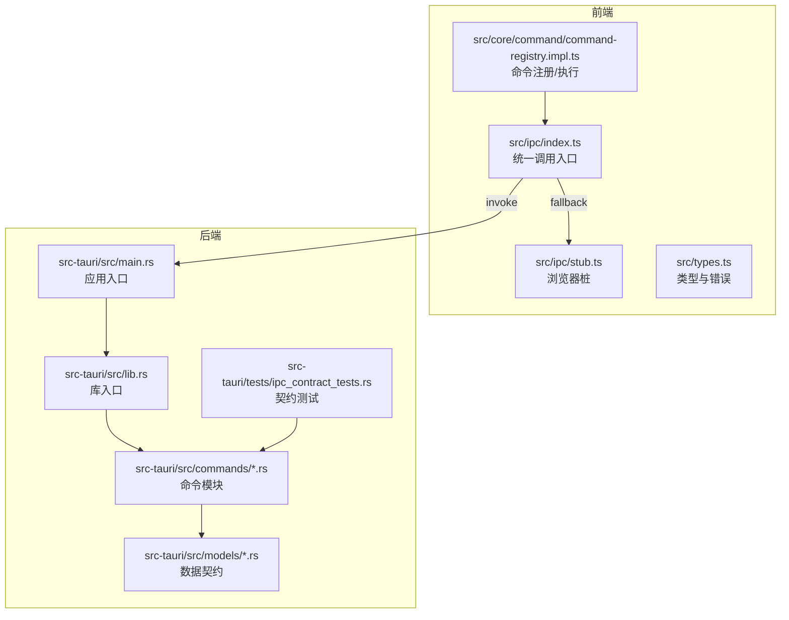
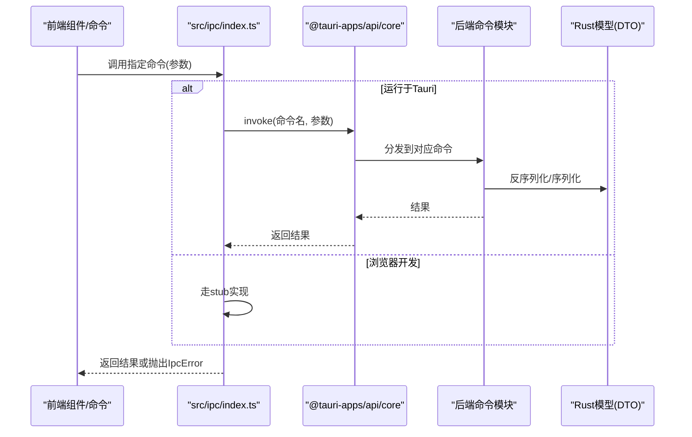
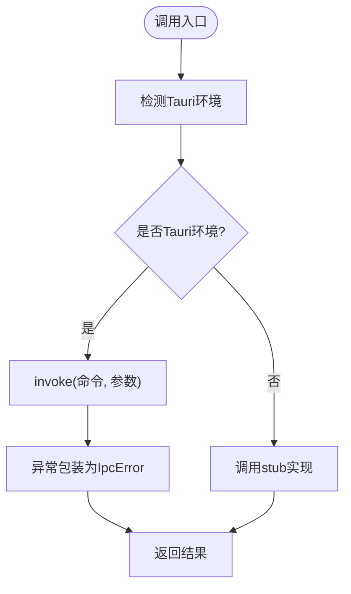
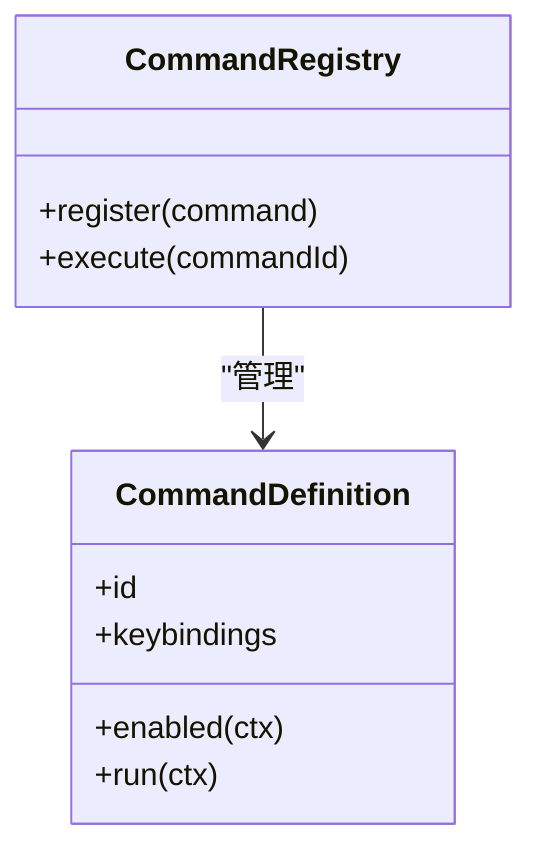
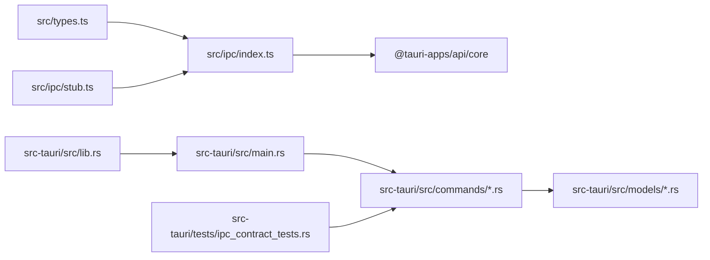
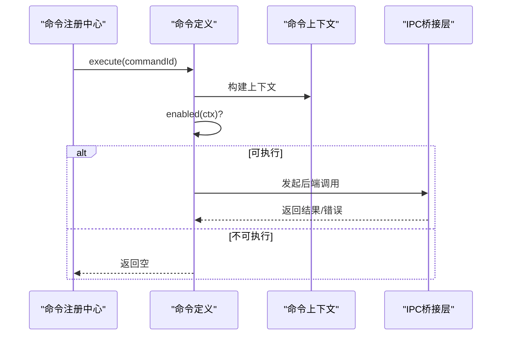

# IPC通信

<cite>
**本文引用的文件**
- [src/ipc/index.ts](file://src/ipc/index.ts)
- [src/ipc/stub.ts](file://src/ipc/stub.ts)
- [src/types.ts](file://src/types.ts)
- [src/core/command/command-registry.impl.ts](file://src/core/command/command-registry.impl.ts)
- [src-tauri/src/lib.rs](file://src-tauri/src/lib.rs)
- [src-tauri/src/main.rs](file://src-tauri/src/main.rs)
- [src-tauri/src/commands/mod.rs](file://src-tauri/src/commands/mod.rs)
- [src-tauri/src/models/mod.rs](file://src-tauri/src/models/mod.rs)
- [src-tauri/tests/ipc_contract_tests.rs](file://src-tauri/tests/ipc_contract_tests.rs)
- [.tmp/requirements-specification.md](file://.tmp/requirements-specification.md)
- [.tmp/noteforge-refactor-plan.md](file://.tmp/noteforge-refactor-plan.md)
</cite>

## 目录
1. [简介](#简介)
2. [项目结构](#项目结构)
3. [核心组件](#核心组件)
4. [架构总览](#架构总览)
5. [详细组件分析](#详细组件分析)
6. [依赖关系分析](#依赖关系分析)
7. [性能考量](#性能考量)
8. [故障排查指南](#故障排查指南)
9. [结论](#结论)
10. [附录](#附录)

## 简介
本文件系统化梳理NoteForge的IPC（进程间通信）体系，覆盖前后端通信架构、消息协议与类型安全、错误处理、命令注册与执行、类型一致性保障、性能优化策略、使用示例与最佳实践、开发/生产差异、调试与监控方案，并给出面向开发者的完整集成指南。IPC以Tauri invoke为核心，前端通过统一桥接层发起调用，后端以命令模块暴露能力，双方通过“契约”（DTO命名与结构）保持一致。

## 项目结构
NoteForge的IPC相关代码主要分布在以下位置：
- 前端桥接与桩：src/ipc/index.ts、src/ipc/stub.ts
- 类型与错误：src/types.ts
- 命令系统（前端）：src/core/command/command-registry.impl.ts
- 后端入口与命令：src-tauri/src/main.rs、src-tauri/src/lib.rs、src-tauri/src/commands/*
- 数据契约模型：src-tauri/src/models/*
- 契约测试：src-tauri/tests/ipc_contract_tests.rs
- 需求与重构规划：.tmp/requirements-specification.md、.tmp/noteforge-refactor-plan.md

图表来源
- [src/ipc/index.ts:1-105](file://src/ipc/index.ts#L1-L105)
- [src/ipc/stub.ts:1-59](file://src/ipc/stub.ts#L1-L59)
- [src/types.ts:377-386](file://src/types.ts#L377-L386)
- [src/core/command/command-registry.impl.ts:1-37](file://src/core/command/command-registry.impl.ts#L1-L37)
- [src-tauri/src/main.rs:1-50](file://src-tauri/src/main.rs#L1-L50)
- [src-tauri/src/lib.rs:1-50](file://src-tauri/src/lib.rs#L1-L50)
- [src-tauri/src/commands/mod.rs:1-50](file://src-tauri/src/commands/mod.rs#L1-L50)
- [src-tauri/src/models/mod.rs:1-50](file://src-tauri/src/models/mod.rs#L1-L50)
- [src-tauri/tests/ipc_contract_tests.rs:1-50](file://src-tauri/tests/ipc_contract_tests.rs#L1-L50)

章节来源
- [src/ipc/index.ts:1-105](file://src/ipc/index.ts#L1-L105)
- [src/ipc/stub.ts:1-59](file://src/ipc/stub.ts#L1-L59)
- [src/types.ts:377-386](file://src/types.ts#L377-L386)
- [src/core/command/command-registry.impl.ts:1-37](file://src/core/command/command-registry.impl.ts#L1-L37)
- [src-tauri/src/main.rs:1-50](file://src-tauri/src/main.rs#L1-L50)
- [src-tauri/src/lib.rs:1-50](file://src-tauri/src/lib.rs#L1-L50)
- [src-tauri/src/commands/mod.rs:1-50](file://src-tauri/src/commands/mod.rs#L1-L50)
- [src-tauri/src/models/mod.rs:1-50](file://src-tauri/src/models/mod.rs#L1-L50)
- [src-tauri/tests/ipc_contract_tests.rs:1-50](file://src-tauri/tests/ipc_contract_tests.rs#L1-L50)

## 核心组件
- 前端IPC桥接层：封装invoke调用、环境检测、错误包装与请求适配器，提供统一调用入口与浏览器回退桩。
- 前端桩层：在无Tauri环境时提供确定性模拟行为，确保UI可独立开发与自测。
- 类型与错误：集中定义IpcError与跨端共享的数据类型，保障契约一致性。
- 命令系统（前端）：注册命令、建立键位绑定索引、构建上下文并执行命令。
- 后端命令模块：按功能拆分命令文件，实现具体业务逻辑。
- 数据契约模型：Rust侧定义的DTO，统一JSON序列化命名风格，作为前后端契约的单一事实来源。
- 契约测试：验证命令输入输出的JSON往返一致性，防止前后端脱节。

章节来源
- [src/ipc/index.ts:59-83](file://src/ipc/index.ts#L59-L83)
- [src/ipc/stub.ts:1-59](file://src/ipc/stub.ts#L1-L59)
- [src/types.ts:377-386](file://src/types.ts#L377-L386)
- [src/core/command/command-registry.impl.ts:10-37](file://src/core/command/command-registry.impl.ts#L10-L37)
- [src-tauri/src/commands/mod.rs:1-50](file://src-tauri/src/commands/mod.rs#L1-L50)
- [src-tauri/src/models/mod.rs:1-50](file://src-tauri/src/models/mod.rs#L1-L50)
- [src-tauri/tests/ipc_contract_tests.rs:1-50](file://src-tauri/tests/ipc_contract_tests.rs#L1-L50)

## 架构总览
NoteForge采用“前端统一桥接 + 后端命令模块”的双层架构：
- 前端通过src/ipc/index.ts发起invoke；若检测到Tauri环境则调用真实后端，否则走stub桩。
- 后端由main.rs/lib.rs统一导出命令，命令模块按功能划分，模型层统一契约。
- 契约测试贯穿开发流程，确保命令签名、参数与返回值的JSON一致性。

图表来源
- [src/ipc/index.ts:66-83](file://src/ipc/index.ts#L66-L83)
- [src-tauri/src/main.rs:1-50](file://src-tauri/src/main.rs#L1-L50)
- [src-tauri/src/lib.rs:1-50](file://src-tauri/src/lib.rs#L1-L50)
- [src-tauri/src/commands/mod.rs:1-50](file://src-tauri/src/commands/mod.rs#L1-L50)
- [src-tauri/src/models/mod.rs:1-50](file://src-tauri/src/models/mod.rs#L1-L50)

## 详细组件分析

### 前端IPC桥接层（src/ipc/index.ts）
- 环境检测：通过全局标志判断是否运行于Tauri环境，决定invoke或stub路径。
- 统一调用：封装invoke调用，捕获异常并包装为IpcError，便于上层统一处理。
- 请求适配：提供req函数将“字段对象”包装为“request: 字段对象”，保持后端单参数请求风格。
- 结果适配：提供toWorkspaceView等适配器，将后端返回映射为前端类型，减少跨端差异。
- 类型导入：集中导入所有跨端类型，确保契约一致性。

图表来源
- [src/ipc/index.ts:59-83](file://src/ipc/index.ts#L59-L83)
- [src/types.ts:377-386](file://src/types.ts#L377-L386)

章节来源
- [src/ipc/index.ts:59-105](file://src/ipc/index.ts#L59-L105)
- [src/types.ts:377-386](file://src/types.ts#L377-L386)

### 前端桩层（src/ipc/stub.ts）
- 目标：在浏览器中提供与真实后端一致的返回结构，便于UI自测与离线开发。
- 策略：与真实backend保持“同形”结构，不额外添加字段，避免前端过度适配。
- 示例：包含演示工作区种子数据与基础文件内容，支撑UI交互验证。

章节来源
- [src/ipc/stub.ts:1-59](file://src/ipc/stub.ts#L1-L59)

### 类型与错误（src/types.ts）
- IpcError：统一的IPC错误类型，便于前端捕获与展示。
- 跨端类型：集中声明所有IPC涉及的类型别名与接口，作为契约基线。

章节来源
- [src/types.ts:377-386](file://src/types.ts#L377-L386)

### 命令系统（前端）（src/core/command/command-registry.impl.ts）
- 注册：将命令id映射到定义，同时建立键位绑定索引。
- 执行：根据命令启用条件构建上下文并执行，支持异步执行。
- 解除注册：提供清理函数，移除命令与键位索引。

图表来源
- [src/core/command/command-registry.impl.ts:10-37](file://src/core/command/command-registry.impl.ts#L10-L37)

章节来源
- [src/core/command/command-registry.impl.ts:1-37](file://src/core/command/command-registry.impl.ts#L1-L37)

### 后端命令模块（src-tauri/src/commands/*）
- 模块化：按功能拆分命令文件（如workspace、file、knowledge等），职责清晰。
- 契约：命令签名与参数/返回值遵循Rust模型（DTO），统一camelCase命名。
- 入口：main.rs/lib.rs负责初始化与导出命令，形成统一入口。

章节来源
- [src-tauri/src/commands/mod.rs:1-50](file://src-tauri/src/commands/mod.rs#L1-L50)
- [src-tauri/src/main.rs:1-50](file://src-tauri/src/main.rs#L1-L50)
- [src-tauri/src/lib.rs:1-50](file://src-tauri/src/lib.rs#L1-L50)

### 数据契约模型（src-tauri/src/models/*）
- 单一事实来源：Rust模型作为前后端契约，统一JSON字段命名（camelCase）。
- 自动生成：规划中可通过工具生成前端类型或保持手写对齐，确保一致性。

章节来源
- [src-tauri/src/models/mod.rs:1-50](file://src-tauri/src/models/mod.rs#L1-L50)
- [.tmp/noteforge-refactor-plan.md:104-121](file://.tmp/noteforge-refactor-plan.md#L104-L121)

### 契约测试（src-tauri/tests/ipc_contract_tests.rs）
- 目标：验证每个命令的JSON输入/输出往返一致性，避免手工对齐偏差。
- 覆盖：建议优先覆盖索引流水线、IPC契约与RAG等关键路径。

章节来源
- [src-tauri/tests/ipc_contract_tests.rs:1-50](file://src-tauri/tests/ipc_contract_tests.rs#L1-L50)
- [.tmp/noteforge-refactor-plan.md:468-477](file://.tmp/noteforge-refactor-plan.md#L468-L477)

## 依赖关系分析
- 前端依赖：src/ipc/index.ts依赖@tauri-apps/api/core进行invoke；依赖src/types.ts中的类型与错误；在非Tauri环境下依赖src/ipc/stub.ts。
- 后端依赖：命令模块依赖models层的DTO；main.rs/lib.rs统一导出命令；测试依赖命令实现。
- 契约依赖：前端类型与后端模型通过camelCase命名与结构对齐，契约测试贯穿开发流程。

图表来源
- [src/ipc/index.ts:49-50](file://src/ipc/index.ts#L49-L50)
- [src-tauri/src/main.rs:1-50](file://src-tauri/src/main.rs#L1-L50)
- [src-tauri/src/lib.rs:1-50](file://src-tauri/src/lib.rs#L1-L50)
- [src-tauri/src/commands/mod.rs:1-50](file://src-tauri/src/commands/mod.rs#L1-L50)
- [src-tauri/src/models/mod.rs:1-50](file://src-tauri/src/models/mod.rs#L1-L50)
- [src-tauri/tests/ipc_contract_tests.rs:1-50](file://src-tauri/tests/ipc_contract_tests.rs#L1-L50)

章节来源
- [src/ipc/index.ts:49-50](file://src/ipc/index.ts#L49-L50)
- [src-tauri/src/main.rs:1-50](file://src-tauri/src/main.rs#L1-L50)
- [src-tauri/src/lib.rs:1-50](file://src-tauri/src/lib.rs#L1-L50)
- [src-tauri/src/commands/mod.rs:1-50](file://src-tauri/src/commands/mod.rs#L1-L50)
- [src-tauri/src/models/mod.rs:1-50](file://src-tauri/src/models/mod.rs#L1-L50)
- [src-tauri/tests/ipc_contract_tests.rs:1-50](file://src-tauri/tests/ipc_contract_tests.rs#L1-L50)

## 性能考量
- 批量操作：建议后端命令支持批量请求（例如批量索引、批量查询），前端聚合多次调用为一次批量请求，减少往返次数。
- 异步处理：对于耗时任务（如全文检索、语义向量索引），采用异步命令与进度回调，避免阻塞主线程。
- 缓存机制：对高频读取数据（如工作区配置、标签统计）引入前端缓存与失效策略，结合后端增量更新。
- 序列化优化：保持DTO字段命名统一（camelCase），减少字段映射与转换成本。
- 并发控制：限制并发invoke数量，避免后端过载；前端使用队列或信号量控制并发。

## 故障排查指南
- 错误类型：IpcError用于统一捕获与展示IPC异常，便于定位未知错误。
- 环境检测：确认isTauri返回值与实际运行环境一致；在浏览器中应走stub路径。
- 契约不一致：若返回结构与前端类型不符，检查后端模型命名与字段是否符合camelCase约定。
- 命令缺失：若前端调用后端未实现的命令，契约测试会暴露差异，需补充后端实现或调整前端调用。
- 开发/生产差异：开发模式下stub提供稳定数据；生产模式下确保Tauri环境变量存在且invoke可用。

章节来源
- [src/types.ts:377-386](file://src/types.ts#L377-L386)
- [src/ipc/index.ts:59-83](file://src/ipc/index.ts#L59-L83)
- [.tmp/requirements-specification.md:139-162](file://.tmp/requirements-specification.md#L139-L162)

## 结论
NoteForge的IPC体系以“前端统一桥接 + 后端命令模块 + Rust模型契约”为核心，通过camelCase命名与契约测试保障类型安全与一致性，结合stub桩提升开发效率。建议在后续迭代中完善批量与异步能力、加强缓存与并发控制，并持续强化契约测试覆盖度，确保系统在开发与生产模式下均稳定可靠。

## 附录

### IPC命令注册与执行流程
- 命令注册：前端通过createCommandRegistry维护命令表与键位索引。
- 执行流程：根据命令id查找定义，构建上下文，校验启用条件，异步执行run。
- 与IPC协作：命令执行过程中通过src/ipc/index.ts发起后端调用，获得结果或错误。

图表来源
- [src/core/command/command-registry.impl.ts:30-37](file://src/core/command/command-registry.impl.ts#L30-L37)
- [src/ipc/index.ts:66-83](file://src/ipc/index.ts#L66-L83)

章节来源
- [src/core/command/command-registry.impl.ts:10-37](file://src/core/command/command-registry.impl.ts#L10-L37)
- [src/ipc/index.ts:66-83](file://src/ipc/index.ts#L66-L83)

### 使用示例与最佳实践
- 统一调用：通过src/ipc/index.ts发起invoke，避免直接依赖Tauri API。
- 错误处理：捕获IpcError并进行分类处理（网络、权限、未知）。
- 超时与重试：在前端封装invoke调用时加入超时控制与指数退避重试。
- 契约对齐：严格遵守camelCase命名与DTO结构，避免字段映射。
- 开发/生产：开发时使用stub，生产时确保Tauri环境变量可用。

章节来源
- [src/ipc/index.ts:66-83](file://src/ipc/index.ts#L66-L83)
- [src/types.ts:377-386](file://src/types.ts#L377-L386)
- [.tmp/requirements-specification.md:139-162](file://.tmp/requirements-specification.md#L139-L162)

### 调试工具与监控方案
- 契约测试：运行src-tauri/tests/ipc_contract_tests.rs，验证命令JSON往返一致性。
- 日志与追踪：在后端命令中记录关键事件与耗时，前端收集IpcError统计信息。
- 监控指标：跟踪invoke成功率、平均耗时、错误类型分布，辅助容量与稳定性评估。

章节来源
- [src-tauri/tests/ipc_contract_tests.rs:1-50](file://src-tauri/tests/ipc_contract_tests.rs#L1-L50)
- [.tmp/noteforge-refactor-plan.md:468-477](file://.tmp/noteforge-refactor-plan.md#L468-L477)