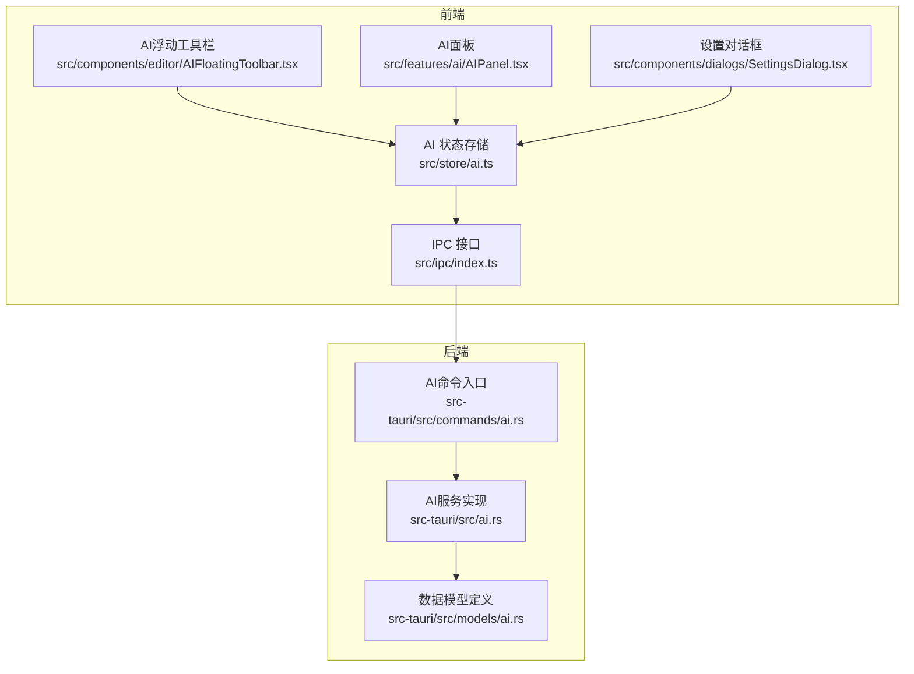
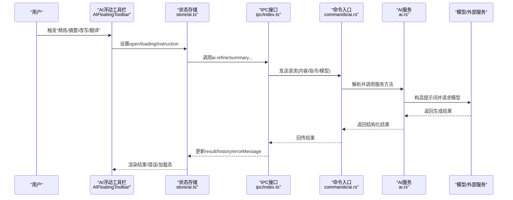
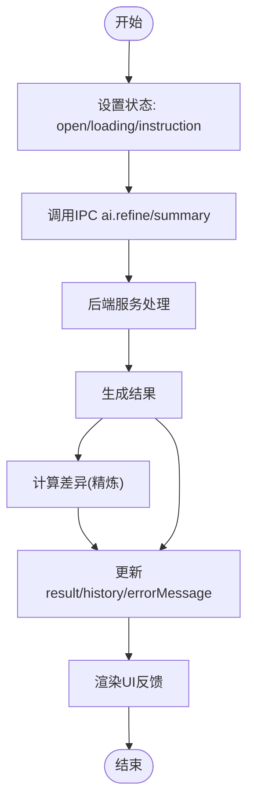
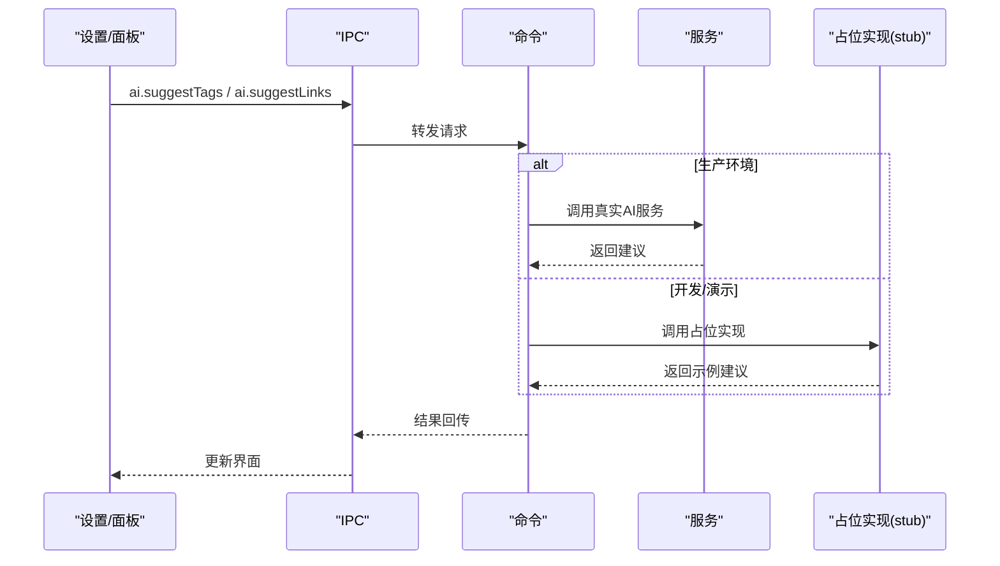
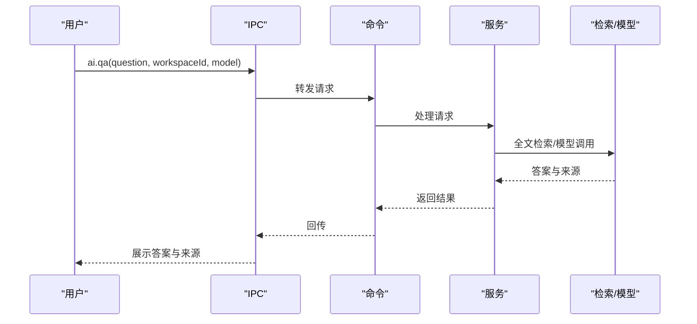
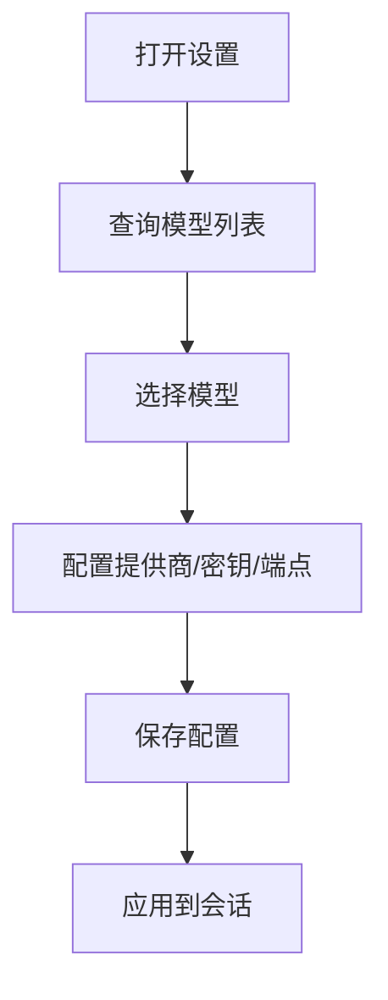
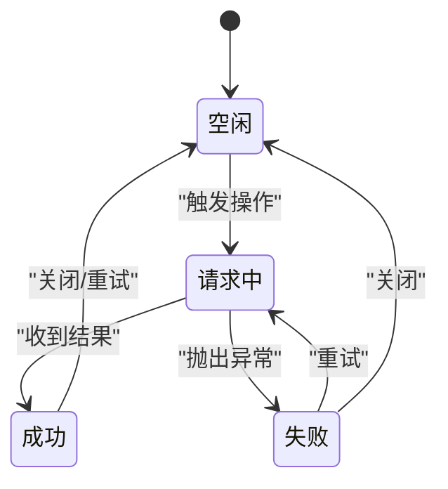
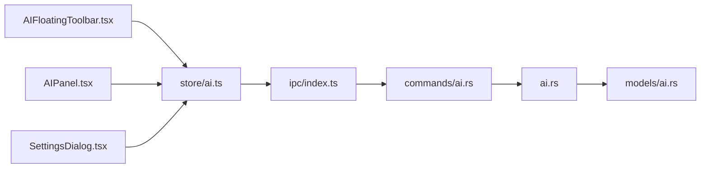

# AI服务命令

<cite>
**本文引用的文件**
- [src/ipc/index.ts](file://src/ipc/index.ts)
- [src/ipc/stub.ts](file://src/ipc/stub.ts)
- [src/store/ai.ts](file://src/store/ai.ts)
- [src-tauri/src/ai.rs](file://src-tauri/src/ai.rs)
- [src-tauri/src/models/ai.rs](file://src-tauri/src/models/ai.rs)
- [src-tauri/src/commands/ai.rs](file://src-tauri/src/commands/ai.rs)
- [src/components/editor/AIFloatingToolbar.tsx](file://src/components/editor/AIFloatingToolbar.tsx)
- [src/features/ai/AIPanel.tsx](file://src/features/ai/AIPanel.tsx)
- [src/components/dialogs/SettingsDialog.tsx](file://src/components/dialogs/SettingsDialog.tsx)
- [src-tauri/tests/dataflow_tests.rs](file://src-tauri/tests/dataflow_tests.rs)
</cite>

## 目录
1. [简介](#简介)
2. [项目结构](#项目结构)
3. [核心组件](#核心组件)
4. [架构总览](#架构总览)
5. [详细组件分析](#详细组件分析)
6. [依赖关系分析](#依赖关系分析)
7. [性能考虑](#性能考虑)
8. [故障排除指南](#故障排除指南)
9. [结论](#结论)
10. [附录](#附录)

## 简介
本文件系统性梳理NoteForge中“AI服务命令”的设计与实现，覆盖以下主题：
- 文本生成、代码补全与智能建议的实现机制
- AI模型调用命令（模型选择、参数配置、响应处理）
- AI增强功能（内容优化、标签建议、链接建议、问答检索）
- 异步处理机制（长任务管理、进度反馈、错误处理）
- 配置选项（API密钥、模型参数、性能调优）
- 使用示例与故障排除

## 项目结构
NoteForge的AI能力由前端IPC层、Tauri后端服务与模型定义三部分协同完成：
- 前端通过IPC封装的ai接口发起请求，并维护状态与UI交互
- Tauri后端实现具体AI服务逻辑，负责与本地/云端模型交互
- 数据模型统一定义请求与响应格式，确保前后端契约一致

图表来源
- [src/ipc/index.ts:414-448](file://src/ipc/index.ts#L414-L448)
- [src/store/ai.ts:51-110](file://src/store/ai.ts#L51-L110)
- [src-tauri/src/commands/ai.rs](file://src-tauri/src/commands/ai.rs)
- [src-tauri/src/ai.rs:1-48](file://src-tauri/src/ai.rs#L1-L48)
- [src-tauri/src/models/ai.rs:1-60](file://src-tauri/src/models/ai.rs#L1-L60)

章节来源
- [src/ipc/index.ts:414-448](file://src/ipc/index.ts#L414-L448)
- [src/store/ai.ts:51-110](file://src/store/ai.ts#L51-L110)
- [src-tauri/src/ai.rs:1-48](file://src-tauri/src/ai.rs#L1-L48)
- [src-tauri/src/models/ai.rs:1-60](file://src-tauri/src/models/ai.rs#L1-L60)

## 核心组件
- IPC层ai接口：封装了内容精炼、摘要生成、标签建议、链接建议、知识问答、模型列表与配置等命令，并提供占位stub以支持开发调试
- AI状态存储：集中管理当前选中模型、指令、结果、历史与加载状态，驱动UI反馈与重试机制
- AI服务实现：面向本地Ollama服务的调用封装，包含提示词构造与差异计算
- 数据模型：统一定义请求与响应结构，保证前后端契约稳定

章节来源
- [src/ipc/index.ts:414-448](file://src/ipc/index.ts#L414-L448)
- [src/store/ai.ts:51-110](file://src/store/ai.ts#L51-L110)
- [src-tauri/src/ai.rs:1-48](file://src-tauri/src/ai.rs#L1-L48)
- [src-tauri/src/models/ai.rs:1-60](file://src-tauri/src/models/ai.rs#L1-L60)

## 架构总览
下图展示从用户触发到AI响应的关键调用链路，涵盖前端状态更新、IPC转发、后端服务执行与回传。

图表来源
- [src/components/editor/AIFloatingToolbar.tsx:70-116](file://src/components/editor/AIFloatingToolbar.tsx#L70-L116)
- [src/store/ai.ts:51-110](file://src/store/ai.ts#L51-L110)
- [src/ipc/index.ts:414-448](file://src/ipc/index.ts#L414-L448)
- [src-tauri/src/commands/ai.rs](file://src-tauri/src/commands/ai.rs)
- [src-tauri/src/ai.rs:18-48](file://src-tauri/src/ai.rs#L18-L48)

## 详细组件分析

### 文本生成与内容精炼
- 功能要点
  - 内容精炼：接收原文与指令，构造提示词并调用模型；返回新内容与差异对比
  - 摘要生成：对长文本生成简洁摘要
- 前端流程
  - 用户在浮动工具栏或AI面板触发操作
  - 状态存储设置加载态与指令，调用IPC接口
  - 成功后写入历史记录与结果，失败则显示错误信息
- 后端流程
  - 服务实现根据模型名构造提示词并调用本地推理引擎
  - 计算原始与生成内容的差异，便于可视化对比

图表来源
- [src/store/ai.ts:67-99](file://src/store/ai.ts#L67-L99)
- [src-tauri/src/ai.rs:18-48](file://src-tauri/src/ai.rs#L18-L48)

章节来源
- [src/store/ai.ts:67-99](file://src/store/ai.ts#L67-L99)
- [src-tauri/src/ai.rs:18-48](file://src-tauri/src/ai.rs#L18-L48)

### 标签建议与链接建议
- 标签建议：基于内容生成候选标签集合
- 链接建议：结合现有笔记集合，给出与内容最相关的笔记建议，包含置信度与理由
- 前端行为：在设置中选择模型，调用IPC接口获取建议；AI面板提供快捷操作入口
- 后端行为：服务实现负责提示词构造与模型调用；测试用例验证建议流程

图表来源
- [src/ipc/index.ts:426-435](file://src/ipc/index.ts#L426-L435)
- [src-tauri/src/commands/ai.rs](file://src-tauri/src/commands/ai.rs)
- [src-tauri/src/ai.rs:18-48](file://src-tauri/src/ai.rs#L18-L48)
- [src/ipc/stub.ts:848-879](file://src/ipc/stub.ts#L848-L879)

章节来源
- [src/ipc/index.ts:426-435](file://src/ipc/index.ts#L426-L435)
- [src-tauri/src/ai.rs:18-48](file://src-tauri/src/ai.rs#L18-L48)
- [src/ipc/stub.ts:848-879](file://src/ipc/stub.ts#L848-L879)

### 知识问答与检索增强
- 功能要点
  - 基于工作区内容进行问答，返回答案与引用来源
  - 在演示模式下，通过全文检索模拟答案生成
- 前端行为：在设置中选择模型，调用IPC接口发起问答；面板显示答案与来源
- 后端行为：服务实现构造提示词并调用模型；测试用例验证日志记录与计数

图表来源
- [src/ipc/index.ts:436-441](file://src/ipc/index.ts#L436-L441)
- [src-tauri/src/commands/ai.rs](file://src-tauri/src/commands/ai.rs)
- [src-tauri/src/ai.rs:18-48](file://src-tauri/src/ai.rs#L18-L48)
- [src-tauri/tests/dataflow_tests.rs:160-201](file://src-tauri/tests/dataflow_tests.rs#L160-L201)

章节来源
- [src/ipc/index.ts:436-441](file://src/ipc/index.ts#L436-L441)
- [src-tauri/src/ai.rs:18-48](file://src-tauri/src/ai.rs#L18-L48)
- [src-tauri/tests/dataflow_tests.rs:160-201](file://src-tauri/tests/dataflow_tests.rs#L160-L201)

### 模型选择与配置
- 模型列表：支持列出本地/云端模型，用于设置界面选择
- 配置命令：可配置提供商、API密钥与端点，保存至后端配置
- 前端设置：在设置对话框中切换提供商与模型，显示延迟与可用性

图表来源
- [src/ipc/index.ts:442-447](file://src/ipc/index.ts#L442-L447)
- [src/components/dialogs/SettingsDialog.tsx:63-92](file://src/components/dialogs/SettingsDialog.tsx#L63-L92)

章节来源
- [src/ipc/index.ts:442-447](file://src/ipc/index.ts#L442-L447)
- [src/components/dialogs/SettingsDialog.tsx:63-92](file://src/components/dialogs/SettingsDialog.tsx#L63-L92)

### 异步处理与进度反馈
- 加载态：UI在请求期间显示“AI正在思考”等提示
- 错误处理：捕获异常并展示错误信息，支持重试
- 历史记录：每次成功结果写入历史，最多保留10条
- 取消机制：当前未暴露显式取消API，可通过中断IPC调用或在上层控制停止渲染

图表来源
- [src/features/ai/AIPanel.tsx:186-196](file://src/features/ai/AIPanel.tsx#L186-L196)
- [src/store/ai.ts:67-105](file://src/store/ai.ts#L67-L105)

章节来源
- [src/features/ai/AIPanel.tsx:186-196](file://src/features/ai/AIPanel.tsx#L186-L196)
- [src/store/ai.ts:67-105](file://src/store/ai.ts#L67-L105)

## 依赖关系分析
- 前端依赖
  - IPC接口依赖命令入口与后端stub实现
  - 状态存储依赖IPC接口与UI组件
  - 工具栏与面板依赖状态存储与设置对话框
- 后端依赖
  - 命令入口依赖AI服务实现
  - AI服务依赖模型定义与外部推理引擎

图表来源
- [src/components/editor/AIFloatingToolbar.tsx:70-116](file://src/components/editor/AIFloatingToolbar.tsx#L70-L116)
- [src/features/ai/AIPanel.tsx:159-196](file://src/features/ai/AIPanel.tsx#L159-L196)
- [src/components/dialogs/SettingsDialog.tsx:63-92](file://src/components/dialogs/SettingsDialog.tsx#L63-L92)
- [src/store/ai.ts:51-110](file://src/store/ai.ts#L51-L110)
- [src/ipc/index.ts:414-448](file://src/ipc/index.ts#L414-L448)
- [src-tauri/src/commands/ai.rs](file://src-tauri/src/commands/ai.rs)
- [src-tauri/src/ai.rs:1-48](file://src-tauri/src/ai.rs#L1-L48)
- [src-tauri/src/models/ai.rs:1-60](file://src-tauri/src/models/ai.rs#L1-L60)

章节来源
- [src/components/editor/AIFloatingToolbar.tsx:70-116](file://src/components/editor/AIFloatingToolbar.tsx#L70-L116)
- [src/features/ai/AIPanel.tsx:159-196](file://src/features/ai/AIPanel.tsx#L159-L196)
- [src/components/dialogs/SettingsDialog.tsx:63-92](file://src/components/dialogs/SettingsDialog.tsx#L63-L92)
- [src/store/ai.ts:51-110](file://src/store/ai.ts#L51-L110)
- [src/ipc/index.ts:414-448](file://src/ipc/index.ts#L414-L448)
- [src-tauri/src/commands/ai.rs](file://src-tauri/src/commands/ai.rs)
- [src-tauri/src/ai.rs:1-48](file://src-tauri/src/ai.rs#L1-L48)
- [src-tauri/src/models/ai.rs:1-60](file://src-tauri/src/models/ai.rs#L1-L60)

## 性能考虑
- 模型选择
  - 优先选择本地Ollama模型以降低网络延迟；在设置中可查看模型延迟与可用性
- 提示词优化
  - 将指令与内容分隔清晰，避免过长上下文导致响应时间增长
- 批量与缓存
  - 对重复的摘要/精炼请求可考虑前端缓存策略，减少重复调用
- 并发控制
  - 同时触发多个AI任务时，建议限制并发数量，避免阻塞UI与资源争用

## 故障排除指南
- 无法连接模型
  - 检查本地Ollama服务是否运行；确认模型已下载且可用
  - 在设置中切换到其他模型或提供商进行验证
- 响应缓慢
  - 切换更小的模型或缩短输入长度；检查系统资源占用
- 结果为空或不准确
  - 调整指令表述，明确目标与风格要求
  - 使用“重试”功能重新生成
- 错误信息显示
  - 查看面板中的错误提示，复制错误描述以便定位问题
  - 在测试用例中验证AI日志记录是否正常

章节来源
- [src/features/ai/AIPanel.tsx:186-196](file://src/features/ai/AIPanel.tsx#L186-L196)
- [src-tauri/tests/dataflow_tests.rs:160-201](file://src-tauri/tests/dataflow_tests.rs#L160-L201)

## 结论
NoteForge的AI服务命令通过清晰的前后端分层与稳定的IPC契约，实现了从内容精炼、摘要生成到标签与链接建议、知识问答的完整闭环。前端提供直观的交互入口与状态反馈，后端以可扩展的服务实现支撑本地与云端模型。建议在生产环境中完善取消机制、并发控制与错误恢复策略，并持续优化提示词模板与模型选择体验。

## 附录

### 使用示例
- 在编辑器中选中文本，点击“精炼/摘要/改写/翻译”，观察浮动工具栏与AI面板的反馈
- 在设置中选择合适的模型，查看延迟与可用性
- 对长文档进行摘要生成，或将段落改写为更专业的表达

### 配置选项速览
- 模型提供商：本地(Ollama)、云端
- 模型名称：在设置中选择可用模型
- API密钥与端点：通过配置命令进行设置与保存

章节来源
- [src/components/editor/AIFloatingToolbar.tsx:70-116](file://src/components/editor/AIFloatingToolbar.tsx#L70-L116)
- [src/features/ai/AIPanel.tsx:159-196](file://src/features/ai/AIPanel.tsx#L159-L196)
- [src/components/dialogs/SettingsDialog.tsx:63-92](file://src/components/dialogs/SettingsDialog.tsx#L63-L92)
- [src/ipc/index.ts:442-447](file://src/ipc/index.ts#L442-L447)