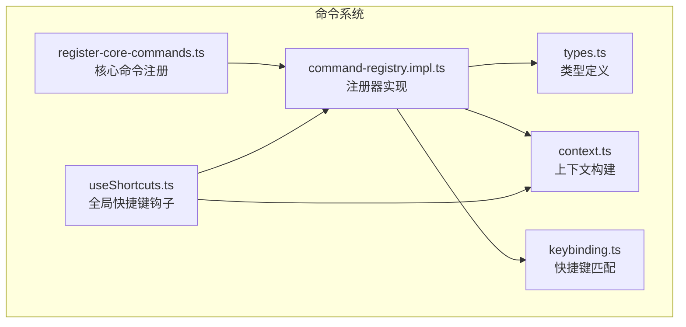
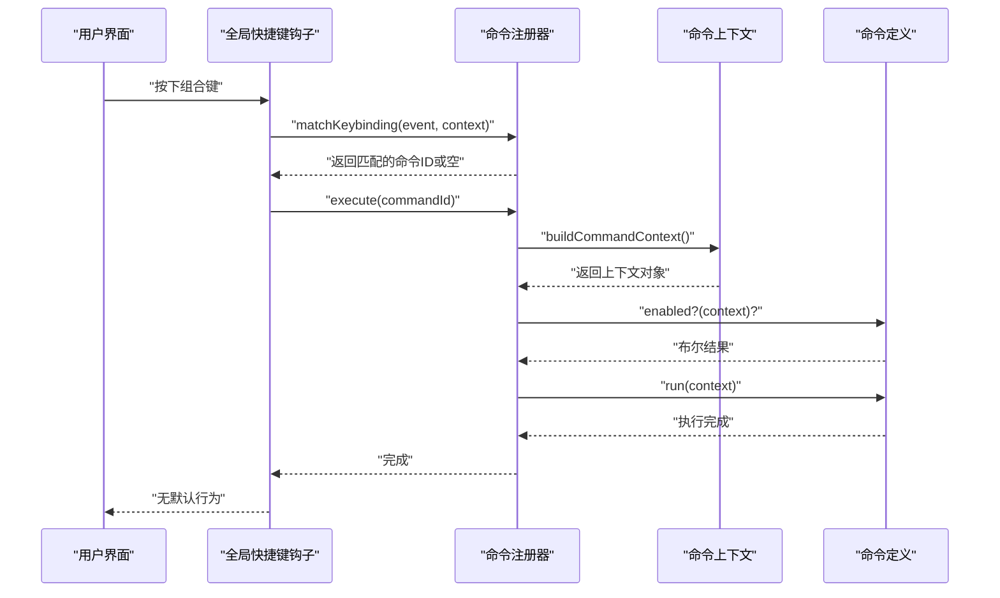
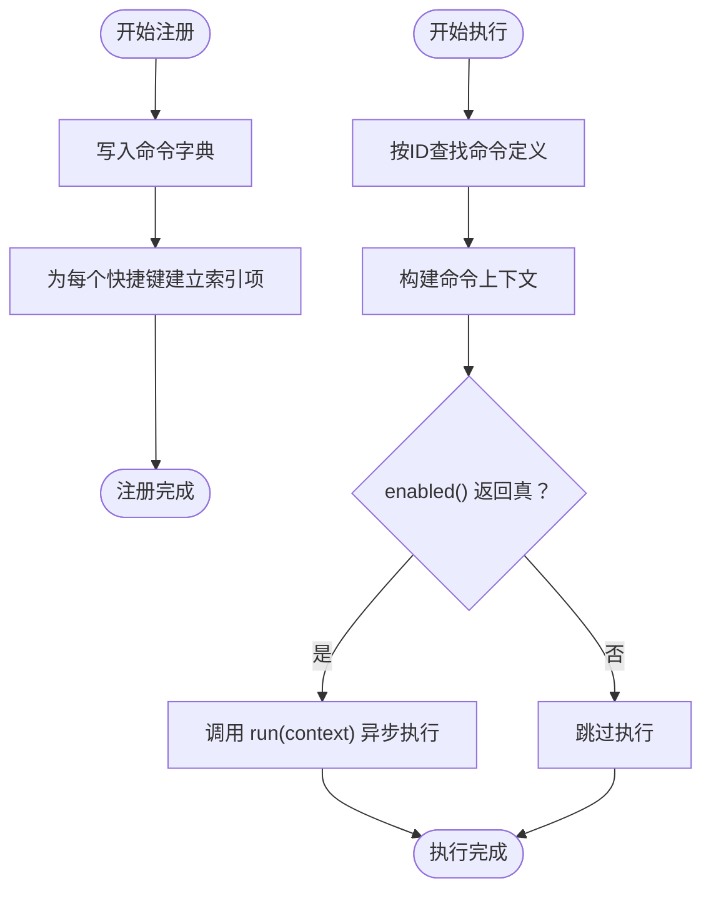
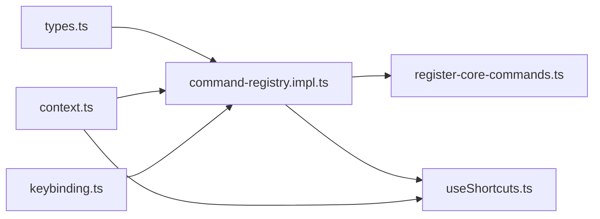

# 命令注册机制

<cite>
**本文档引用的文件**
- [command-registry.impl.ts](file://src/core/command/command-registry.impl.ts)
- [types.ts](file://src/core/command/types.ts)
- [context.ts](file://src/core/command/context.ts)
- [keybinding.ts](file://src/core/command/keybinding.ts)
- [register-core-commands.ts](file://src/core/command/register-core-commands.ts)
- [useShortcuts.ts](file://src/hooks/useShortcuts.ts)
</cite>

## 目录
1. [简介](#简介)
2. [项目结构](#项目结构)
3. [核心组件](#核心组件)
4. [架构总览](#架构总览)
5. [详细组件分析](#详细组件分析)
6. [依赖关系分析](#依赖关系分析)
7. [性能考虑](#性能考虑)
8. [故障排除指南](#故障排除指南)
9. [结论](#结论)
10. [附录](#附录)

## 简介
本文件系统性阐述NoteForge的命令注册机制，重点覆盖以下方面：
- CommandRegistry的实现架构与注册流程
- 命令元数据的定义方式（命令名称、参数类型、返回值类型、权限控制）
- 命令注册的生命周期管理（从注册到注销）
- 命令注册的安全机制（权限验证与访问控制）
- 命令注册的最佳实践（命名规范、参数设计、错误处理策略）
- 具体的代码示例路径，展示如何正确注册新命令

## 项目结构
命令注册相关代码集中在前端核心模块的command子目录中，围绕注册器、类型定义、上下文构建、快捷键匹配与核心命令注册展开。

图表来源
- [command-registry.impl.ts:1-37](file://src/core/command/command-registry.impl.ts#L1-L37)
- [types.ts:1-200](file://src/core/command/types.ts#L1-L200)
- [context.ts:1-120](file://src/core/command/context.ts#L1-L120)
- [keybinding.ts:1-120](file://src/core/command/keybinding.ts#L1-L120)
- [register-core-commands.ts:1-200](file://src/core/command/register-core-commands.ts#L1-L200)
- [useShortcuts.ts:1-24](file://src/hooks/useShortcuts.ts#L1-L24)

章节来源
- [command-registry.impl.ts:1-37](file://src/core/command/command-registry.impl.ts#L1-L37)
- [types.ts:1-200](file://src/core/command/types.ts#L1-L200)
- [context.ts:1-120](file://src/core/command/context.ts#L1-L120)
- [keybinding.ts:1-120](file://src/core/command/keybinding.ts#L1-L120)
- [register-core-commands.ts:1-200](file://src/core/command/register-core-commands.ts#L1-L200)
- [useShortcuts.ts:1-24](file://src/hooks/useShortcuts.ts#L1-L24)

## 核心组件
- CommandRegistry：命令注册与执行的中心枢纽，负责命令存储、快捷键索引、执行调度与注销清理。
- CommandDefinition：命令定义的契约，包含命令标识、名称、描述、类别、参数、权限检查函数、执行函数等。
- CommandContext：命令执行时的上下文对象，封装当前可用的服务、状态与环境信息。
- Keybinding：快捷键匹配逻辑，支持组合键、条件表达式与上下文感知。
- 注册入口：通过register-core-commands集中注册核心命令，形成应用功能基线。

章节来源
- [command-registry.impl.ts:10-37](file://src/core/command/command-registry.impl.ts#L10-L37)
- [types.ts:1-200](file://src/core/command/types.ts#L1-L200)
- [context.ts:1-120](file://src/core/command/context.ts#L1-L120)
- [keybinding.ts:1-120](file://src/core/command/keybinding.ts#L1-L120)
- [register-core-commands.ts:1-200](file://src/core/command/register-core-commands.ts#L1-L200)

## 架构总览
命令注册机制采用“注册器+上下文+快捷键”的分层架构：
- 注册器维护命令字典与快捷键索引，提供注册、执行与注销能力
- 上下文在执行前动态构建，确保命令运行时可访问所需资源
- 快捷键系统在全局事件层面拦截按键，按条件匹配并触发对应命令
- 核心命令通过统一入口注册，保证初始化一致性

图表来源
- [useShortcuts.ts:8-24](file://src/hooks/useShortcuts.ts#L8-L24)
- [command-registry.impl.ts:30-37](file://src/core/command/command-registry.impl.ts#L30-L37)
- [context.ts:1-120](file://src/core/command/context.ts#L1-L120)

## 详细组件分析

### CommandRegistry 实现与注册流程
- 存储结构：使用Map存储命令定义；使用数组维护快捷键索引，便于快速匹配与批量清理。
- 注册流程：写入命令字典，遍历命令的快捷键配置，建立索引项（含组合键与when条件）。
- 执行流程：根据命令ID获取定义，构建上下文，调用enabled函数进行权限校验，再异步执行run函数。
- 注销流程：返回一个取消函数，删除命令字典中的条目，并从快捷键索引中移除所有关联项。

图表来源
- [command-registry.impl.ts:14-28](file://src/core/command/command-registry.impl.ts#L14-L28)
- [command-registry.impl.ts:30-37](file://src/core/command/command-registry.impl.ts#L30-L37)

章节来源
- [command-registry.impl.ts:10-37](file://src/core/command/command-registry.impl.ts#L10-L37)

### 命令元数据定义
- 关键字段：id、title、category、keybindings、enabled、run等。
- 参数与返回：run函数接收上下文对象，返回Promise<void>，不强制要求显式返回值类型，但建议保持一致的异步约定。
- 权限控制：enabled函数接收上下文并返回布尔值，用于决定命令是否可执行。
- 类别与组织：category用于对命令进行分类，便于后续筛选与展示。

章节来源
- [types.ts:1-200](file://src/core/command/types.ts#L1-L200)

### 命令上下文构建
- 上下文职责：向命令提供运行时所需的资源与状态，如服务实例、当前文档、工作区信息等。
- 构建时机：在执行命令前由注册器动态构建，避免硬编码依赖。
- 可扩展性：上下文接口可随业务演进而扩展，不影响命令定义的稳定性。

章节来源
- [context.ts:1-120](file://src/core/command/context.ts#L1-L120)

### 快捷键匹配与路由
- 匹配策略：基于组合键字符串与when条件进行匹配，支持多级条件表达式。
- 全局路由：全局快捷键钩子监听keydown事件，在满足修饰键条件时尝试匹配命令并阻止默认行为。
- 与注册器协作：通过注册器提供的matchKeybinding方法完成匹配，确保与注册表一致。

章节来源
- [keybinding.ts:1-120](file://src/core/command/keybinding.ts#L1-L120)
- [useShortcuts.ts:8-24](file://src/hooks/useShortcuts.ts#L8-L24)

### 核心命令注册入口
- 统一注册：核心命令通过register-core-commands集中注册，保证应用启动时的一致性与可维护性。
- 模块化：每个功能域可独立导出命令集合，最终在统一入口聚合。

章节来源
- [register-core-commands.ts:1-200](file://src/core/command/register-core-commands.ts#L1-L200)

## 依赖关系分析
- 注册器依赖类型定义、上下文构建与快捷键匹配模块。
- 全局快捷键钩子依赖注册器与上下文构建。
- 核心命令注册依赖注册器与具体命令实现。

图表来源
- [command-registry.impl.ts:1-37](file://src/core/command/command-registry.impl.ts#L1-L37)
- [types.ts:1-200](file://src/core/command/types.ts#L1-L200)
- [context.ts:1-120](file://src/core/command/context.ts#L1-L120)
- [keybinding.ts:1-120](file://src/core/command/keybinding.ts#L1-L120)
- [register-core-commands.ts:1-200](file://src/core/command/register-core-commands.ts#L1-L200)
- [useShortcuts.ts:1-24](file://src/hooks/useShortcuts.ts#L1-L24)

章节来源
- [command-registry.impl.ts:1-37](file://src/core/command/command-registry.impl.ts#L1-L37)
- [types.ts:1-200](file://src/core/command/types.ts#L1-L200)
- [context.ts:1-120](file://src/core/command/context.ts#L1-L120)
- [keybinding.ts:1-120](file://src/core/command/keybinding.ts#L1-L120)
- [register-core-commands.ts:1-200](file://src/core/command/register-core-commands.ts#L1-L200)
- [useShortcuts.ts:1-24](file://src/hooks/useShortcuts.ts#L1-L24)

## 性能考虑
- 命令存储：使用Map进行O(1)级别的命令查找，适合高频执行场景。
- 快捷键索引：数组索引便于快速匹配与批量删除，注销时按命令ID反向扫描清理，时间复杂度与快捷键数量线性相关。
- 上下文延迟构建：仅在执行前构建上下文，避免不必要的初始化开销。
- 全局事件节流：全局快捷键钩子在满足修饰键条件下才进行匹配，减少无效计算。

## 故障排除指南
- 命令未执行
  - 检查enabled函数返回值与上下文状态
  - 确认快捷键组合与when条件匹配
- 注销后仍可触发
  - 确认取消函数已被调用且索引已清理
- 快捷键冲突
  - 检查多个命令是否绑定相同组合键
  - 使用更精确的when条件限定执行上下文

## 结论
NoteForge的命令注册机制以注册器为核心，结合上下文构建与快捷键匹配，实现了高内聚、低耦合的命令体系。通过统一的注册入口与清晰的生命周期管理，既保证了扩展性，也确保了安全性与可维护性。遵循本文最佳实践，可在保证安全与性能的前提下高效扩展命令生态。

## 附录

### 命令注册最佳实践
- 命名规范
  - 使用清晰、语义化的命令ID，避免缩写与歧义
  - 分类前缀建议采用领域/功能域前缀，便于检索与组织
- 参数设计
  - 将可变输入抽象为上下文参数，减少命令间差异
  - 对外部输入进行必要校验，避免在命令内部重复校验
- 权限控制
  - 在enabled函数中集中判断上下文状态与权限位
  - 对敏感操作增加二次确认或审计日志
- 错误处理
  - run函数应捕获并记录异常，避免抛出未处理异常
  - 提供可恢复的降级策略或提示信息
- 注册与注销
  - 在模块销毁时调用取消函数，防止内存泄漏
  - 注销后清理相关快捷键索引与上下文缓存

### 如何正确注册新命令（示例路径）
- 定义命令类型与上下文
  - 参考类型定义文件，明确命令字段与上下文接口
  - 示例路径：[types.ts:1-200](file://src/core/command/types.ts#L1-L200)
- 构建命令上下文
  - 在执行前通过上下文构建函数生成上下文对象
  - 示例路径：[context.ts:1-120](file://src/core/command/context.ts#L1-L120)
- 注册命令
  - 调用注册器的register方法，传入命令定义
  - 示例路径：[command-registry.impl.ts:14-28](file://src/core/command/command-registry.impl.ts#L14-L28)
- 执行命令
  - 通过命令ID调用execute方法，或在快捷键事件中自动触发
  - 示例路径：[command-registry.impl.ts:30-37](file://src/core/command/command-registry.impl.ts#L30-L37)
- 全局快捷键集成
  - 在全局快捷键钩子中使用注册器进行匹配与执行
  - 示例路径：[useShortcuts.ts:8-24](file://src/hooks/useShortcuts.ts#L8-L24)