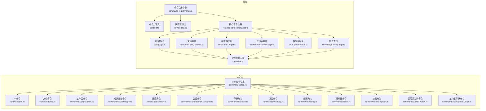
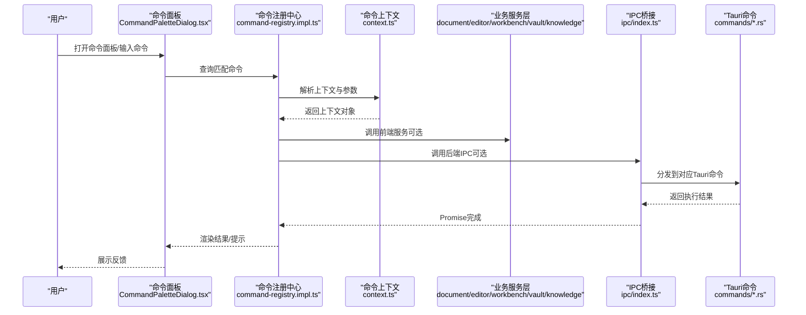
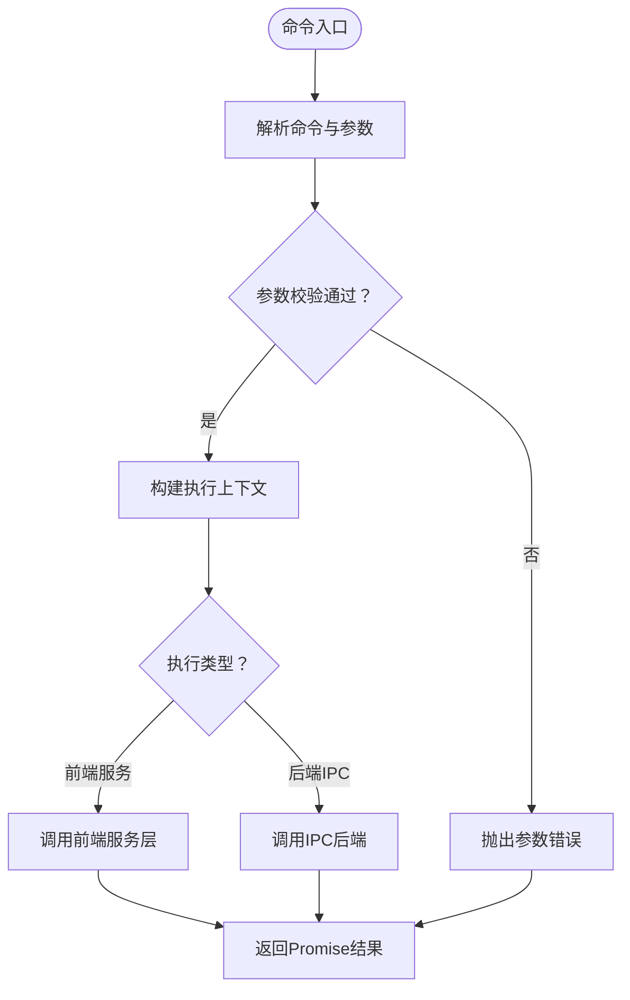
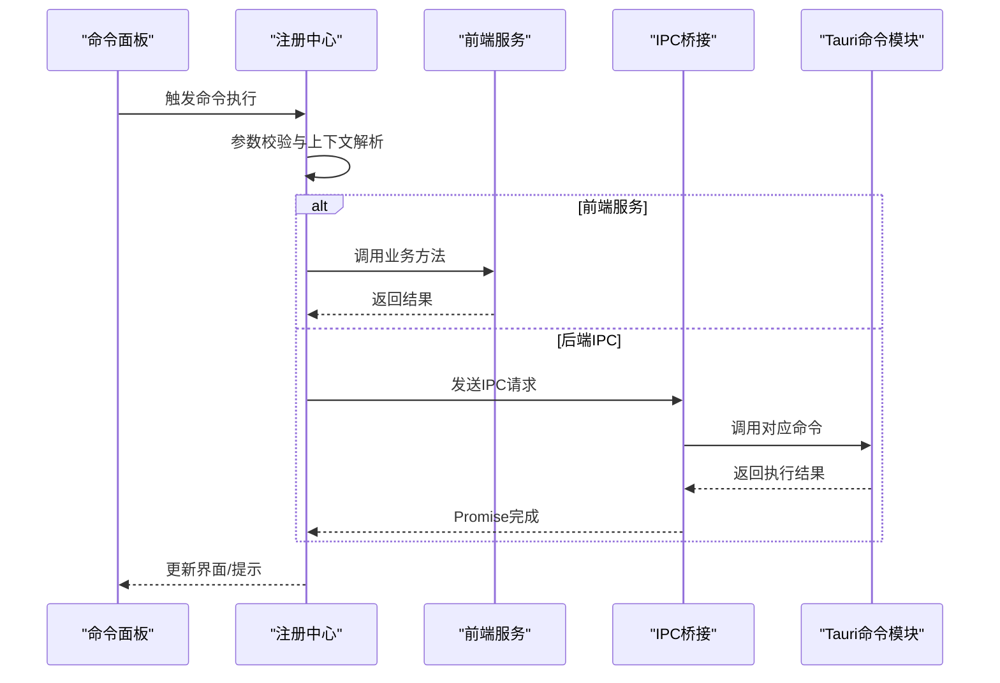
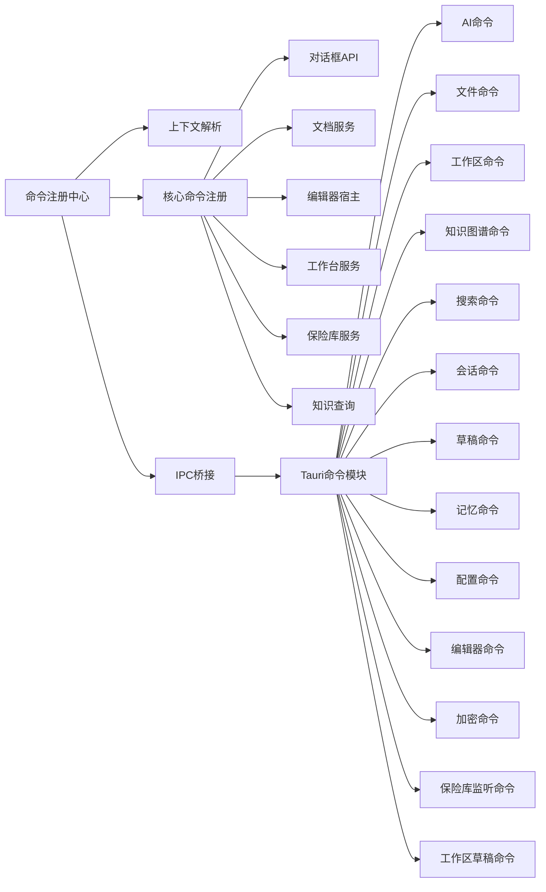

# 命令系统

<cite>
**本文引用的文件**
- [command-registry.impl.ts](file://src/core/command/command-registry.impl.ts)
- [register-core-commands.ts](file://src/core/command/register-core-commands.ts)
- [types.ts](file://src/core/command/types.ts)
- [context.ts](file://src/core/command/context.ts)
- [keybinding.ts](file://src/core/command/keybinding.ts)
- [CommandPaletteDialog.tsx](file://src/components/dialogs/CommandPaletteDialog.tsx)
- [dialog-api.ts](file://src/core/dialog/dialog-api.ts)
- [dialog-service.impl.ts](file://src/core/dialog/dialog-service.impl.ts)
- [document-service.impl.ts](file://src/core/document/document-service.impl.ts)
- [editor-host.impl.ts](file://src/core/editor/editor-host.impl.ts)
- [workbench-service.impl.ts](file://src/core/workbench/workbench-service.impl.ts)
- [vault-service.impl.ts](file://src/core/vault/vault-service.impl.ts)
- [knowledge-query.impl.ts](file://src/core/knowledge/knowledge-query.impl.ts)
- [mod.rs](file://src-tauri/src/commands/mod.rs)
- [ai.rs](file://src-tauri/src/commands/ai.rs)
- [file.rs](file://src-tauri/src/commands/file.rs)
- [workspace.rs](file://src-tauri/src/commands/workspace.rs)
- [knowledge.rs](file://src-tauri/src/commands/knowledge.rs)
- [search.rs](file://src-tauri/src/commands/search.rs)
- [workbench_session.rs](file://src-tauri/src/commands/workbench_session.rs)
- [scratch.rs](file://src-tauri/src/commands/scratch.rs)
- [memory.rs](file://src-tauri/src/commands/memory.rs)
- [config.rs](file://src-tauri/src/commands/config.rs)
- [editor.rs](file://src-tauri/src/commands/editor.rs)
- [encryption.rs](file://src-tauri/src/commands/encryption.rs)
- [vault_watch.rs](file://src-tauri/src/commands/vault_watch.rs)
- [workspace_draft.rs](file://src-tauri/src/commands/workspace_draft.rs)
- [ipc/index.ts](file://src/ipc/index.ts)
- [ipc/stub.ts](file://src/ipc/stub.ts)
</cite>

## 目录
1. [引言](#引言)
2. [项目结构](#项目结构)
3. [核心组件](#核心组件)
4. [架构总览](#架构总览)
5. [详细组件分析](#详细组件分析)
6. [依赖关系分析](#依赖关系分析)
7. [性能考虑](#性能考虑)
8. [故障排查指南](#故障排查指南)
9. [结论](#结论)
10. [附录](#附录)

## 引言
本文件系统性梳理NoteForge的命令系统，覆盖命令注册机制、参数校验与返回值处理、命令分类（工作区、文件系统、知识图谱、AI服务）、执行链路（前端到后端）、异步处理（Promise封装、并发与超时）、扩展指南（新增命令、参数设计、错误处理）以及最佳实践与性能优化建议。目标是帮助开发者快速理解并高效扩展命令体系。

## 项目结构
命令系统由三层组成：
- 前端命令注册与调度：在src/core/command目录下，负责命令定义、上下文、快捷键绑定与核心命令注册。
- 前端服务层：在src/core/*目录下，封装业务服务（如文档、编辑器、工作台、知识图谱、保险库等），通过统一接口暴露给命令。
- 后端Tauri命令：在src-tauri/src/commands下，实现具体持久化、系统级操作与AI/搜索等能力，并通过IPC桥接前端。

图表来源
- [command-registry.impl.ts:1-200](file://src/core/command/command-registry.impl.ts#L1-L200)
- [register-core-commands.ts:1-200](file://src/core/command/register-core-commands.ts#L1-L200)
- [context.ts:1-200](file://src/core/command/context.ts#L1-L200)
- [keybinding.ts:1-200](file://src/core/command/keybinding.ts#L1-L200)
- [dialog-api.ts:1-200](file://src/core/dialog/dialog-api.ts#L1-L200)
- [document-service.impl.ts:1-200](file://src/core/document/document-service.impl.ts#L1-L200)
- [editor-host.impl.ts:1-200](file://src/core/editor/editor-host.impl.ts#L1-L200)
- [workbench-service.impl.ts:1-200](file://src/core/workbench/workbench-service.impl.ts#L1-L200)
- [vault-service.impl.ts:1-200](file://src/core/vault/vault-service.impl.ts#L1-L200)
- [knowledge-query.impl.ts:1-200](file://src/core/knowledge/knowledge-query.impl.ts#L1-L200)
- [ipc/index.ts:1-200](file://src/ipc/index.ts#L1-L200)
- [mod.rs:1-200](file://src-tauri/src/commands/mod.rs#L1-L200)
- [ai.rs:1-200](file://src-tauri/src/commands/ai.rs#L1-L200)
- [file.rs:1-200](file://src-tauri/src/commands/file.rs#L1-L200)
- [workspace.rs:1-200](file://src-tauri/src/commands/workspace.rs#L1-L200)
- [knowledge.rs:1-200](file://src-tauri/src/commands/knowledge.rs#L1-L200)
- [search.rs:1-200](file://src-tauri/src/commands/search.rs#L1-L200)
- [workbench_session.rs:1-200](file://src-tauri/src/commands/workbench_session.rs#L1-L200)
- [scratch.rs:1-200](file://src-tauri/src/commands/scratch.rs#L1-L200)
- [memory.rs:1-200](file://src-tauri/src/commands/memory.rs#L1-L200)
- [config.rs:1-200](file://src-tauri/src/commands/config.rs#L1-L200)
- [editor.rs:1-200](file://src-tauri/src/commands/editor.rs#L1-L200)
- [encryption.rs:1-200](file://src-tauri/src/commands/encryption.rs#L1-L200)
- [vault_watch.rs:1-200](file://src-tauri/src/commands/vault_watch.rs#L1-L200)
- [workspace_draft.rs:1-200](file://src-tauri/src/commands/workspace_draft.rs#L1-L200)

章节来源
- [command-registry.impl.ts:1-200](file://src/core/command/command-registry.impl.ts#L1-L200)
- [register-core-commands.ts:1-200](file://src/core/command/register-core-commands.ts#L1-L200)
- [context.ts:1-200](file://src/core/command/context.ts#L1-L200)
- [keybinding.ts:1-200](file://src/core/command/keybinding.ts#L1-L200)
- [ipc/index.ts:1-200](file://src/ipc/index.ts#L1-L200)
- [mod.rs:1-200](file://src-tauri/src/commands/mod.rs#L1-L200)

## 核心组件
- 命令注册中心：集中管理命令定义、参数模式、上下文解析与执行分发。
- 命令类型与上下文：定义命令签名、参数约束、返回值结构与执行上下文。
- 快捷键绑定：将命令与用户交互绑定，支持组合键与平台差异。
- 核心命令注册：批量注册内置命令，按功能域组织，便于扩展与维护。
- 对话框与UI集成：通过对话框API触发命令面板与全局搜索，提升可用性。
- 服务层封装：文档、编辑器、工作台、知识图谱、保险库等服务抽象，隔离业务细节。
- IPC桥接：前端通过IPC调用后端Tauri命令，实现系统级能力与持久化。

章节来源
- [types.ts:1-200](file://src/core/command/types.ts#L1-L200)
- [context.ts:1-200](file://src/core/command/context.ts#L1-L200)
- [keybinding.ts:1-200](file://src/core/command/keybinding.ts#L1-L200)
- [register-core-commands.ts:1-200](file://src/core/command/register-core-commands.ts#L1-L200)
- [dialog-api.ts:1-200](file://src/core/dialog/dialog-api.ts#L1-L200)
- [document-service.impl.ts:1-200](file://src/core/document/document-service.impl.ts#L1-L200)
- [editor-host.impl.ts:1-200](file://src/core/editor/editor-host.impl.ts#L1-L200)
- [workbench-service.impl.ts:1-200](file://src/core/workbench/workbench-service.impl.ts#L1-L200)
- [vault-service.impl.ts:1-200](file://src/core/vault/vault-service.impl.ts#L1-L200)
- [knowledge-query.impl.ts:1-200](file://src/core/knowledge/knowledge-query.impl.ts#L1-L200)
- [ipc/index.ts:1-200](file://src/ipc/index.ts#L1-L200)

## 架构总览
命令从“用户触发”开始，经过“命令解析与上下文构建”，进入“服务层或IPC后端”，最终返回结果并更新UI。

图表来源
- [CommandPaletteDialog.tsx:1-200](file://src/components/dialogs/CommandPaletteDialog.tsx#L1-L200)
- [command-registry.impl.ts:1-200](file://src/core/command/command-registry.impl.ts#L1-L200)
- [context.ts:1-200](file://src/core/command/context.ts#L1-L200)
- [ipc/index.ts:1-200](file://src/ipc/index.ts#L1-L200)
- [mod.rs:1-200](file://src-tauri/src/commands/mod.rs#L1-L200)

## 详细组件分析

### 命令注册机制
- 命令定义与签名：通过统一的命令类型定义命令名称、参数模式、返回值结构与执行函数签名，确保前后端契约一致。
- 参数验证：在命令执行前进行参数校验，包括必填项、类型、范围与业务规则检查；失败时抛出明确错误。
- 上下文解析：根据当前编辑状态、选区、打开文件、工作区等动态信息生成上下文对象，供命令逻辑使用。
- 注册与发现：集中注册核心命令，支持按需扩展；命令注册中心提供查询、过滤与排序能力。
- 返回值处理：统一Promise封装，支持成功/失败回调与错误传播，前端可据此更新UI或提示。

图表来源
- [types.ts:1-200](file://src/core/command/types.ts#L1-L200)
- [context.ts:1-200](file://src/core/command/context.ts#L1-L200)
- [command-registry.impl.ts:1-200](file://src/core/command/command-registry.impl.ts#L1-L200)

章节来源
- [types.ts:1-200](file://src/core/command/types.ts#L1-L200)
- [context.ts:1-200](file://src/core/command/context.ts#L1-L200)
- [command-registry.impl.ts:1-200](file://src/core/command/command-registry.impl.ts#L1-L200)

### 命令分类与功能域
- 工作区管理：工作区切换、会话恢复、草稿保存与清理、工作台布局与状态持久化。
- 文件系统操作：文件创建/删除/重命名、移动/复制、内容读写、路径解析与权限检查。
- 知识图谱处理：节点/边查询、链接关系分析、图遍历与聚合、嵌入检索与相似度计算。
- AI服务调用：提示词构造、模型推理、流式输出、缓存与速率限制、错误重试。
- 搜索与索引：全文搜索、标签/标题匹配、高亮与定位、跨文件导航。
- 编辑器与文档：光标状态、选区操作、块级结构、格式化、问题面板与校对。
- 记忆与草稿：临时记忆创建、草稿存储与回滚、自动保存策略。
- 配置与加密：设置读写、密钥管理、敏感数据保护、安全策略应用。
- 保险库监听：文件变更事件、增量同步、冲突检测与合并。

章节来源
- [register-core-commands.ts:1-200](file://src/core/command/register-core-commands.ts#L1-L200)
- [workspace.rs:1-200](file://src-tauri/src/commands/workspace.rs#L1-L200)
- [workbench_session.rs:1-200](file://src-tauri/src/commands/workbench_session.rs#L1-L200)
- [scratch.rs:1-200](file://src-tauri/src/commands/scratch.rs#L1-L200)
- [file.rs:1-200](file://src-tauri/src/commands/file.rs#L1-L200)
- [knowledge.rs:1-200](file://src-tauri/src/commands/knowledge.rs#L1-L200)
- [ai.rs:1-200](file://src-tauri/src/commands/ai.rs#L1-L200)
- [search.rs:1-200](file://src-tauri/src/commands/search.rs#L1-L200)
- [editor.rs:1-200](file://src-tauri/src/commands/editor.rs#L1-L200)
- [memory.rs:1-200](file://src-tauri/src/commands/memory.rs#L1-L200)
- [config.rs:1-200](file://src-tauri/src/commands/config.rs#L1-L200)
- [encryption.rs:1-200](file://src-tauri/src/commands/encryption.rs#L1-L200)
- [vault_watch.rs:1-200](file://src-tauri/src/commands/vault_watch.rs#L1-L200)
- [workspace_draft.rs:1-200](file://src-tauri/src/commands/workspace_draft.rs#L1-L200)

### 命令执行链路（前端到后端）
- 前端触发：命令面板或快捷键触发，解析输入并选择候选命令。
- 命令解析：注册中心匹配命令名与参数，构建上下文对象。
- 服务层调用：若为前端能力（如UI状态、文档元数据），直接调用对应服务。
- IPC后端调用：若为系统级能力（文件、数据库、网络），通过IPC桥接调用Tauri命令。
- 结果返回：后端执行完成后，通过Promise回调返回结果，前端渲染或提示。

图表来源
- [CommandPaletteDialog.tsx:1-200](file://src/components/dialogs/CommandPaletteDialog.tsx#L1-L200)
- [command-registry.impl.ts:1-200](file://src/core/command/command-registry.impl.ts#L1-L200)
- [ipc/index.ts:1-200](file://src/ipc/index.ts#L1-L200)
- [mod.rs:1-200](file://src-tauri/src/commands/mod.rs#L1-L200)

章节来源
- [CommandPaletteDialog.tsx:1-200](file://src/components/dialogs/CommandPaletteDialog.tsx#L1-L200)
- [command-registry.impl.ts:1-200](file://src/core/command/command-registry.impl.ts#L1-L200)
- [ipc/index.ts:1-200](file://src/ipc/index.ts#L1-L200)
- [mod.rs:1-200](file://src-tauri/src/commands/mod.rs#L1-L200)

### 异步处理机制
- Promise封装：所有命令执行返回Promise，统一错误捕获与结果处理。
- 并发控制：对可能产生竞态的操作（如文件写入、网络请求）进行队列化或互斥控制，避免冲突。
- 超时管理：为长耗时命令设置超时阈值，超时则中止并提示用户。
- 错误传播：前端与后端错误通过统一错误类型传递，保证UI一致性与可观测性。
- 流式输出：对于AI类命令，采用流式响应，前端逐步渲染，提升交互体验。

章节来源
- [types.ts:1-200](file://src/core/command/types.ts#L1-L200)
- [command-registry.impl.ts:1-200](file://src/core/command/command-registry.impl.ts#L1-L200)
- [ai.rs:1-200](file://src-tauri/src/commands/ai.rs#L1-L200)

### 扩展指南：新增命令
- 定义命令类型：在命令类型定义中声明命令名称、参数结构与返回值类型。
- 实现命令逻辑：在前端服务层或IPC后端实现具体逻辑，确保幂等与可回滚。
- 注册命令：在核心命令注册文件中添加新命令，保持功能域内有序组织。
- 绑定快捷键：在快捷键配置中为命令分配组合键，提升效率。
- 参数校验：在执行前严格校验参数，必要时提供默认值与边界提示。
- 错误处理：定义清晰的错误码与消息，前端友好展示并记录日志。
- 性能优化：对高频命令进行缓存与批处理，避免重复计算与IO。

章节来源
- [types.ts:1-200](file://src/core/command/types.ts#L1-L200)
- [register-core-commands.ts:1-200](file://src/core/command/register-core-commands.ts#L1-L200)
- [keybinding.ts:1-200](file://src/core/command/keybinding.ts#L1-L200)
- [command-registry.impl.ts:1-200](file://src/core/command/command-registry.impl.ts#L1-L200)

## 依赖关系分析
- 前端耦合：命令注册中心依赖上下文解析与核心命令注册；各业务服务相互独立，通过统一接口解耦。
- IPC耦合：前端服务与后端命令通过IPC桥接松耦合，便于替换与测试。
- 后端模块：Tauri命令模块按功能域拆分，避免单体膨胀，利于维护与扩展。

图表来源
- [command-registry.impl.ts:1-200](file://src/core/command/command-registry.impl.ts#L1-L200)
- [register-core-commands.ts:1-200](file://src/core/command/register-core-commands.ts#L1-L200)
- [ipc/index.ts:1-200](file://src/ipc/index.ts#L1-L200)
- [mod.rs:1-200](file://src-tauri/src/commands/mod.rs#L1-L200)

章节来源
- [command-registry.impl.ts:1-200](file://src/core/command/command-registry.impl.ts#L1-L200)
- [register-core-commands.ts:1-200](file://src/core/command/register-core-commands.ts#L1-L200)
- [ipc/index.ts:1-200](file://src/ipc/index.ts#L1-L200)
- [mod.rs:1-200](file://src-tauri/src/commands/mod.rs#L1-L200)

## 性能考虑
- 命令去抖与节流：对频繁触发的命令（如搜索、预览）启用去抖/节流，减少无效计算。
- 批量操作：对多文件/多节点操作进行批处理，降低IPC往返次数。
- 缓存策略：对查询类命令（知识图谱、搜索）建立内存/磁盘缓存，命中优先。
- 并发限流：对网络/IO密集型命令设置并发上限，避免资源争用。
- 懒加载与延迟初始化：仅在首次使用时加载重型模块，缩短启动时间。
- UI渲染优化：对大量结果的命令采用虚拟滚动与分页，避免DOM压力。

## 故障排查指南
- 命令无响应：检查命令注册是否正确、上下文解析是否异常、IPC连接是否断开。
- 参数错误：查看参数校验日志，确认必填字段与类型匹配，必要时提供默认值。
- 权限问题：核对文件/目录权限与沙箱策略，确保Tauri命令具备所需能力。
- 超时与崩溃：为长任务设置合理超时，记录堆栈与上下文，定位瓶颈。
- 错误码不一致：统一错误类型与消息格式，前端一致化提示与日志采集。

章节来源
- [types.ts:1-200](file://src/core/command/types.ts#L1-L200)
- [command-registry.impl.ts:1-200](file://src/core/command/command-registry.impl.ts#L1-L200)
- [ipc/stub.ts:1-200](file://src/ipc/stub.ts#L1-L200)

## 结论
NoteForge命令系统以“类型安全+上下文驱动+IPC解耦”为核心设计思想，既满足前端业务能力的快速迭代，又通过Tauri命令实现系统级操作与持久化。通过规范的注册、校验、执行与错误处理流程，以及完善的扩展指南与性能优化策略，能够支撑复杂知识工作流的高效执行与稳定运行。

## 附录
- 命令开发清单
  - 明确命令用途与参数模型
  - 设计上下文解析与默认行为
  - 实现前端服务或后端命令
  - 在核心注册中添加命令
  - 绑定快捷键与UI入口
  - 编写单元/集成测试
  - 添加文档与变更日志