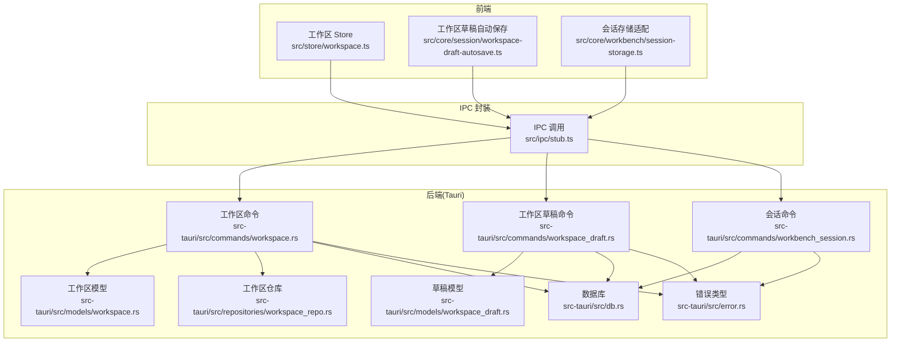
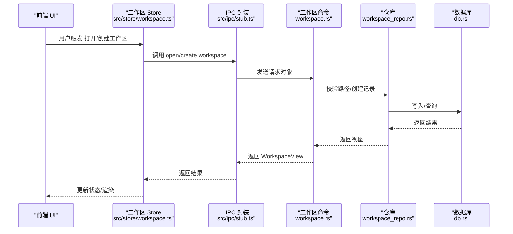
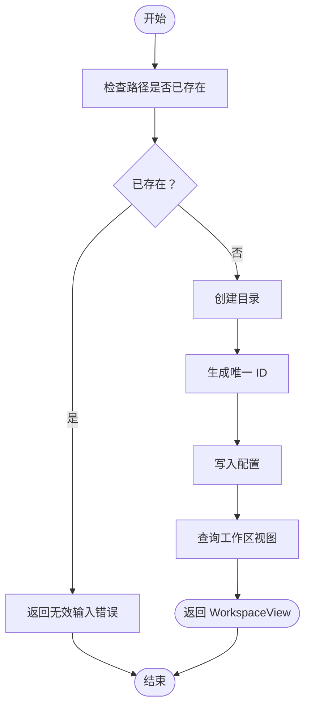
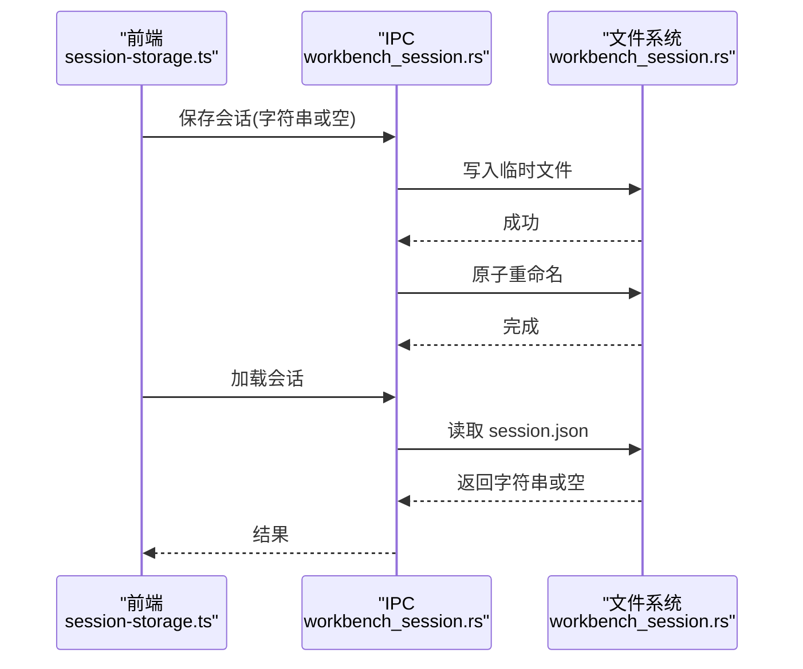
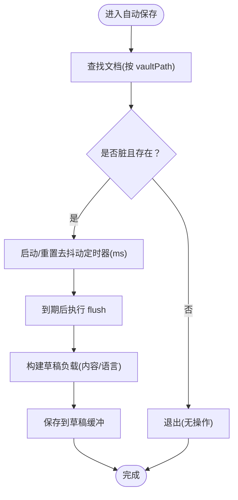
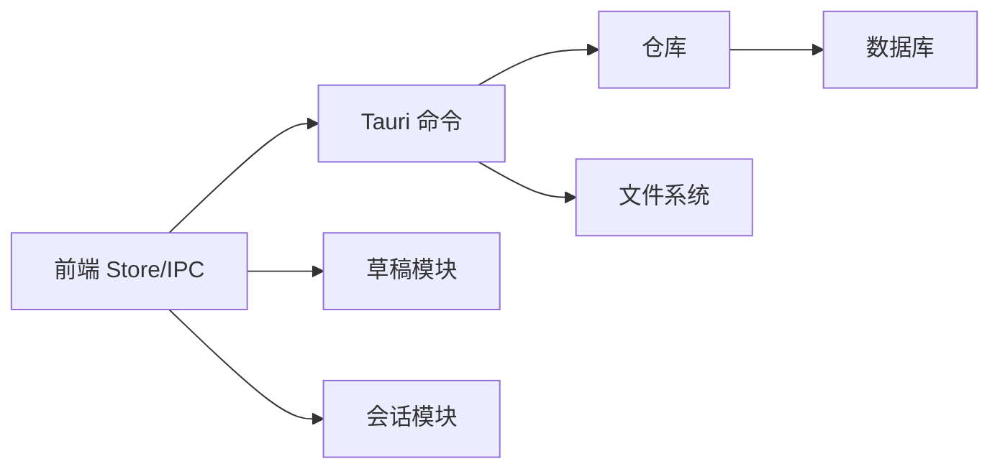

# 工作区命令

<cite>
**本文引用的文件**
- [src-tauri/src/commands/workspace.rs](file://src-tauri/src/commands/workspace.rs)
- [src-tauri/src/models/workspace.rs](file://src-tauri/src/models/workspace.rs)
- [src-tauri/src/repositories/workspace_repo.rs](file://src-tauri/src/repositories/workspace_repo.rs)
- [src-tauri/src/db.rs](file://src-tauri/src/db.rs)
- [src-tauri/src/error.rs](file://src-tauri/src/error.rs)
- [src-tauri/src/commands/workbench_session.rs](file://src-tauri/src/commands/workbench_session.rs)
- [src-tauri/src/workbench_session.rs](file://src-tauri/src/workbench_session.rs)
- [src/core/workbench/session-storage.ts](file://src/core/workbench/session-storage.ts)
- [src/core/session/workspace-draft-autosave.ts](file://src/core/session/workspace-draft-autosave.ts)
- [src-tauri/src/commands/workspace_draft.rs](file://src-tauri/src/commands/workspace_draft.rs)
- [src-tauri/src/workspace_draft.rs](file://src-tauri/src/workspace_draft.rs)
- [src-tauri/src/models/workspace_draft.rs](file://src-tauri/src/models/workspace_draft.rs)
- [src/store/workspace.ts](file://src/store/workspace.ts)
- [src/ipc/stub.ts](file://src/ipc/stub.ts)
- [src/core/workbench/types.ts](file://src/core/workbench/types.ts)
</cite>

## 目录
1. [简介](#简介)
2. [项目结构](#项目结构)
3. [核心组件](#核心组件)
4. [架构总览](#架构总览)
5. [详细组件分析](#详细组件分析)
6. [依赖关系分析](#依赖关系分析)
7. [性能考量](#性能考量)
8. [故障排查指南](#故障排查指南)
9. [结论](#结论)
10. [附录：使用示例与最佳实践](#附录使用示例与最佳实践)

## 简介
本文件系统化梳理 NoteForge 的“工作区”相关命令与实现，覆盖以下主题：
- 工作区管理命令：创建工作区、打开（加载）工作区、更新配置、关闭（删除）工作区的端到端流程
- 工作区会话管理命令：窗口会话持久化与加载、兼容旧版存储、跨平台一致性
- 工作区草稿管理命令：自动草稿缓存、手动保存、恢复与版本控制策略
- 事务性处理：数据库事务、原子写入、幂等与回滚策略
- 使用示例与错误处理策略：常见问题定位与修复建议
- 性能优化与最佳实践：并发写入、去抖动、批量刷新与资源释放

## 项目结构
围绕工作区的前端与后端协作主要分布在如下位置：
- 前端 IPC 层：封装工作区与草稿相关命令调用
- 后端 Tauri 命令层：暴露工作区与会话操作接口
- 数据模型层：定义请求/响应与配置结构
- 存储与仓库层：文件系统与数据库交互
- 会话与草稿层：本地持久化与自动保存

图表来源
- [src/store/workspace.ts:1-44](file://src/store/workspace.ts#L1-L44)
- [src/core/session/workspace-draft-autosave.ts:1-100](file://src/core/session/workspace-draft-autosave.ts#L1-L100)
- [src/core/workbench/session-storage.ts:1-74](file://src/core/workbench/session-storage.ts#L1-L74)
- [src/ipc/stub.ts:195-281](file://src/ipc/stub.ts#L195-L281)
- [src-tauri/src/commands/workspace.rs:1-47](file://src-tauri/src/commands/workspace.rs#L1-L47)
- [src-tauri/src/commands/workspace_draft.rs](file://src-tauri/src/commands/workspace_draft.rs)
- [src-tauri/src/commands/workbench_session.rs:1-19](file://src-tauri/src/commands/workbench_session.rs#L1-L19)
- [src-tauri/src/models/workspace.rs:1-41](file://src-tauri/src/models/workspace.rs#L1-L41)
- [src-tauri/src/models/workspace_draft.rs](file://src-tauri/src/models/workspace_draft.rs)
- [src-tauri/src/repositories/workspace_repo.rs](file://src-tauri/src/repositories/workspace_repo.rs)
- [src-tauri/src/db.rs](file://src-tauri/src/db.rs)
- [src-tauri/src/error.rs](file://src-tauri/src/error.rs)

章节来源
- [src-tauri/src/commands/workspace.rs:1-47](file://src-tauri/src/commands/workspace.rs#L1-L47)
- [src-tauri/src/models/workspace.rs:1-41](file://src-tauri/src/models/workspace.rs#L1-L41)
- [src-tauri/src/repositories/workspace_repo.rs](file://src-tauri/src/repositories/workspace_repo.rs)
- [src-tauri/src/db.rs](file://src-tauri/src/db.rs)
- [src-tauri/src/error.rs](file://src-tauri/src/error.rs)
- [src-tauri/src/commands/workbench_session.rs:1-19](file://src-tauri/src/commands/workbench_session.rs#L1-L19)
- [src-tauri/src/workbench_session.rs:1-53](file://src-tauri/src/workbench_session.rs#L1-L53)
- [src/core/workbench/session-storage.ts:1-74](file://src/core/workbench/session-storage.ts#L1-L74)
- [src/core/session/workspace-draft-autosave.ts:1-100](file://src/core/session/workspace-draft-autosave.ts#L1-L100)
- [src-tauri/src/commands/workspace_draft.rs](file://src-tauri/src/commands/workspace_draft.rs)
- [src-tauri/src/workspace_draft.rs](file://src-tauri/src/workspace_draft.rs)
- [src-tauri/src/models/workspace_draft.rs](file://src-tauri/src/models/workspace_draft.rs)
- [src/store/workspace.ts:1-44](file://src/store/workspace.ts#L1-L44)
- [src/ipc/stub.ts:195-281](file://src/ipc/stub.ts#L195-L281)

## 核心组件
- 工作区命令层
  - 创建工作区：校验路径存在性、创建目录、生成唯一 ID、写入配置并返回视图
  - 打开工作区：按路径查找已存在工作区；不存在则创建新工作区视图并返回
  - 更新配置：接收完整或部分配置，写入数据库
- 会话命令层
  - 保存会话：将前端序列化的会话字符串写入磁盘，采用临时文件+重命名保证原子性
  - 加载会话：读取磁盘会话，若无则返回空；同时兼容旧版 localStorage 存储键
- 草稿命令层
  - 自动草稿：基于文档去抖动定时器，将未落盘内容写入草稿缓冲
  - 手动保存/恢复：通过 IPC 将草稿持久化或从缓冲恢复
  - 版本控制：当前实现以“最近一次有效草稿”为准，可扩展为多版本链表

章节来源
- [src-tauri/src/commands/workspace.rs:1-47](file://src-tauri/src/commands/workspace.rs#L1-L47)
- [src-tauri/src/commands/workbench_session.rs:1-19](file://src-tauri/src/commands/workbench_session.rs#L1-L19)
- [src-tauri/src/workbench_session.rs:1-53](file://src-tauri/src/workbench_session.rs#L1-L53)
- [src/core/session/workspace-draft-autosave.ts:1-100](file://src/core/session/workspace-draft-autosave.ts#L1-L100)

## 架构总览
下图展示工作区命令在前后端之间的调用链路与数据流。

图表来源
- [src/store/workspace.ts:1-44](file://src/store/workspace.ts#L1-L44)
- [src/ipc/stub.ts:195-281](file://src/ipc/stub.ts#L195-L281)
- [src-tauri/src/commands/workspace.rs:1-47](file://src-tauri/src/commands/workspace.rs#L1-L47)
- [src-tauri/src/repositories/workspace_repo.rs](file://src-tauri/src/repositories/workspace_repo.rs)
- [src-tauri/src/db.rs](file://src-tauri/src/db.rs)

## 详细组件分析

### 工作区管理命令
- 创建工作区
  - 输入：名称与路径
  - 流程：检查路径是否存在 → 创建目录 → 生成 UUID → 写入配置 → 查询并返回视图
  - 错误：路径已存在时返回无效输入错误
- 打开工作区
  - 输入：路径
  - 流程：按路径查找已有工作区；若不存在则创建新视图并返回
- 更新配置
  - 输入：工作区 ID 与配置对象
  - 流程：写入数据库，支持部分字段更新

图表来源
- [src-tauri/src/commands/workspace.rs:1-47](file://src-tauri/src/commands/workspace.rs#L1-L47)
- [src-tauri/src/models/workspace.rs:1-41](file://src-tauri/src/models/workspace.rs#L1-L41)

章节来源
- [src-tauri/src/commands/workspace.rs:1-47](file://src-tauri/src/commands/workspace.rs#L1-L47)
- [src-tauri/src/models/workspace.rs:1-41](file://src-tauri/src/models/workspace.rs#L1-L41)

### 工作区会话管理命令
- 保存会话
  - 前端：序列化会话对象为字符串
  - 后端：写入临时文件，再原子重命名为最终文件，避免部分写入
  - 兼容：若无磁盘会话，则回退到旧版 localStorage 键
- 加载会话
  - 前端：优先从磁盘读取，失败则回退到旧版键
  - 解析：仅接受特定版本号，不匹配则忽略

图表来源
- [src/core/workbench/session-storage.ts:1-74](file://src/core/workbench/session-storage.ts#L1-L74)
- [src-tauri/src/commands/workbench_session.rs:1-19](file://src-tauri/src/commands/workbench_session.rs#L1-L19)
- [src-tauri/src/workbench_session.rs:1-53](file://src-tauri/src/workbench_session.rs#L1-L53)

章节来源
- [src/core/workbench/session-storage.ts:1-74](file://src/core/workbench/session-storage.ts#L1-L74)
- [src-tauri/src/commands/workbench_session.rs:1-19](file://src-tauri/src/commands/workbench_session.rs#L1-L19)
- [src-tauri/src/workbench_session.rs:1-53](file://src-tauri/src/workbench_session.rs#L1-L53)

### 工作区草稿管理命令
- 自动草稿缓存
  - 触发：文档脏标记置位且去抖动到期
  - 行为：将内容与语言信息写入草稿缓冲，避免频繁 IO
  - 并发：同一文档路径的刷新任务串行化，防止竞态
- 手动保存/恢复
  - 保存：将缓冲内容持久化
  - 恢复：从缓冲读取最新草稿
  - 清理：关闭或切换文档时删除对应缓冲
- 版本控制
  - 当前策略：单次草稿覆盖
  - 可选增强：引入时间戳/版本号链，支持多版本回溯

图表来源
- [src/core/session/workspace-draft-autosave.ts:1-100](file://src/core/session/workspace-draft-autosave.ts#L1-L100)

章节来源
- [src/core/session/workspace-draft-autosave.ts:1-100](file://src/core/session/workspace-draft-autosave.ts#L1-L100)
- [src-tauri/src/commands/workspace_draft.rs](file://src-tauri/src/commands/workspace_draft.rs)
- [src-tauri/src/workspace_draft.rs](file://src-tauri/src/workspace_draft.rs)
- [src-tauri/src/models/workspace_draft.rs](file://src-tauri/src/models/workspace_draft.rs)

### 事务性处理与一致性
- 数据库事务
  - 创建/更新工作区：在单连接上执行写入，保持原子性
  - 失败回滚：IO 或约束异常统一转换为内部错误类型
- 文件系统原子写
  - 会话保存：临时文件写入 + 原子重命名，避免部分写入导致的数据损坏
- 前端状态一致性
  - 工作区 Store 在调用 IPC 前后维护 loading/error 状态，确保 UI 与后端一致

章节来源
- [src-tauri/src/commands/workspace.rs:1-47](file://src-tauri/src/commands/workspace.rs#L1-L47)
- [src-tauri/src/error.rs](file://src-tauri/src/error.rs)
- [src-tauri/src/workbench_session.rs:1-53](file://src-tauri/src/workbench_session.rs#L1-L53)
- [src/store/workspace.ts:1-44](file://src/store/workspace.ts#L1-L44)

## 依赖关系分析
- 组件耦合
  - 命令层依赖仓库层与数据库层，职责清晰
  - 会话与草稿模块独立于业务逻辑，便于替换实现
- 外部依赖
  - 文件系统：用于目录创建、会话文件读写
  - 序列化：JSON 用于会话与草稿的持久化
- 潜在环路
  - 未发现直接循环依赖；IPC 封装作为桥接层避免双向导入

图表来源
- [src/store/workspace.ts:1-44](file://src/store/workspace.ts#L1-L44)
- [src/ipc/stub.ts:195-281](file://src/ipc/stub.ts#L195-L281)
- [src-tauri/src/commands/workspace.rs:1-47](file://src-tauri/src/commands/workspace.rs#L1-L47)
- [src-tauri/src/repositories/workspace_repo.rs](file://src-tauri/src/repositories/workspace_repo.rs)
- [src-tauri/src/db.rs](file://src-tauri/src/db.rs)
- [src-tauri/src/workbench_session.rs:1-53](file://src-tauri/src/workbench_session.rs#L1-L53)
- [src/core/session/workspace-draft-autosave.ts:1-100](file://src/core/session/workspace-draft-autosave.ts#L1-L100)

## 性能考量
- 去抖动与批量刷新
  - 文档草稿自动保存采用去抖动定时器，降低频繁 IO
  - 支持一次性刷新所有脏文档，减少并发竞争
- 原子写入
  - 会话保存使用临时文件 + 重命名，避免部分写入带来的额外读取与修复成本
- 并发控制
  - 同一文档路径的刷新任务串行化，避免重复写入与竞态
- 缓存与回退
  - 会话加载优先磁盘，失败回退到旧版 localStorage，提升可用性

章节来源
- [src/core/session/workspace-draft-autosave.ts:1-100](file://src/core/session/workspace-draft-autosave.ts#L1-L100)
- [src-tauri/src/workbench_session.rs:1-53](file://src-tauri/src/workbench_session.rs#L1-L53)
- [src/core/workbench/session-storage.ts:1-74](file://src/core/workbench/session-storage.ts#L1-L74)

## 故障排查指南
- 创建工作区失败
  - 检查路径是否存在与权限
  - 查看错误类型是否为“无效输入”
- 打开会话为空
  - 确认磁盘 session.json 是否存在
  - 若不存在，确认旧版 localStorage 键是否迁移成功
- 草稿未恢复
  - 确认文档是否仍处于“脏”状态
  - 检查自动保存定时器是否被取消或清理
- 性能问题
  - 关注去抖动阈值设置
  - 避免在同一时间大量文档同时写入

章节来源
- [src-tauri/src/error.rs](file://src-tauri/src/error.rs)
- [src-tauri/src/commands/workspace.rs:1-47](file://src-tauri/src/commands/workspace.rs#L1-L47)
- [src-tauri/src/workbench_session.rs:1-53](file://src-tauri/src/workbench_session.rs#L1-L53)
- [src/core/session/workspace-draft-autosave.ts:1-100](file://src/core/session/workspace-draft-autosave.ts#L1-L100)

## 结论
工作区命令体系以清晰的分层设计实现了可靠的一致性与良好的用户体验。通过数据库事务、原子文件写入与前端状态同步，确保了关键数据的完整性；通过自动草稿与会话持久化，提升了编辑连续性与可用性。未来可在草稿版本控制与更细粒度的并发控制方面进一步增强。

## 附录：使用示例与最佳实践
- 使用示例
  - 创建工作区：传入名称与路径，接收视图对象
  - 打开工作区：传入路径，返回工作区视图
  - 保存会话：传入序列化后的会话字符串
  - 自动草稿：无需手动调用，系统根据去抖动定时器自动保存
- 最佳实践
  - 严格区分“会话”与“草稿”：会话关注界面布局与标签页状态，草稿关注未落盘内容
  - 控制去抖动阈值：根据文档大小与用户习惯调整，平衡性能与实时性
  - 定期清理：关闭或切换文档时及时删除草稿缓冲，避免磁盘占用
  - 错误隔离：对 IPC 调用进行 try/catch 包裹，并在 UI 上反馈错误

章节来源
- [src-tauri/src/commands/workspace.rs:1-47](file://src-tauri/src/commands/workspace.rs#L1-L47)
- [src-tauri/src/commands/workbench_session.rs:1-19](file://src-tauri/src/commands/workbench_session.rs#L1-L19)
- [src/core/session/workspace-draft-autosave.ts:1-100](file://src/core/session/workspace-draft-autosave.ts#L1-L100)
- [src/core/workbench/session-storage.ts:1-74](file://src/core/workbench/session-storage.ts#L1-L74)
- [src/store/workspace.ts:1-44](file://src/store/workspace.ts#L1-L44)
- [src/ipc/stub.ts:195-281](file://src/ipc/stub.ts#L195-L281)