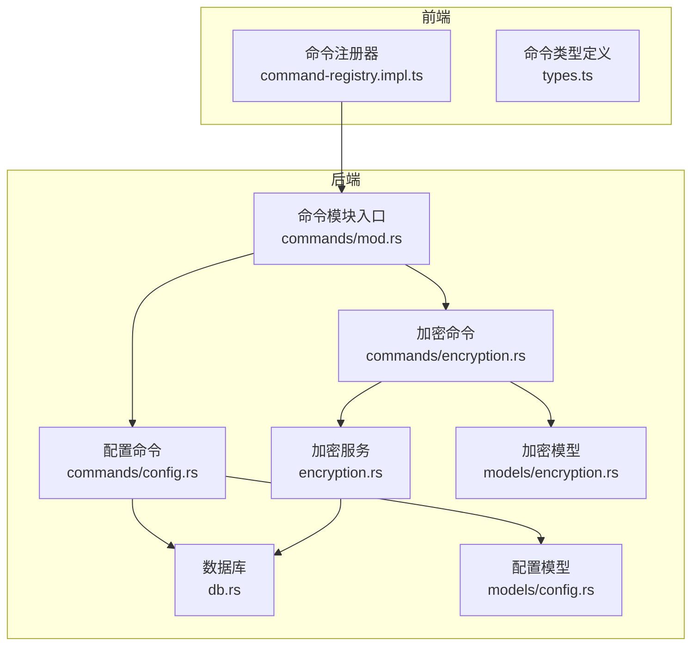
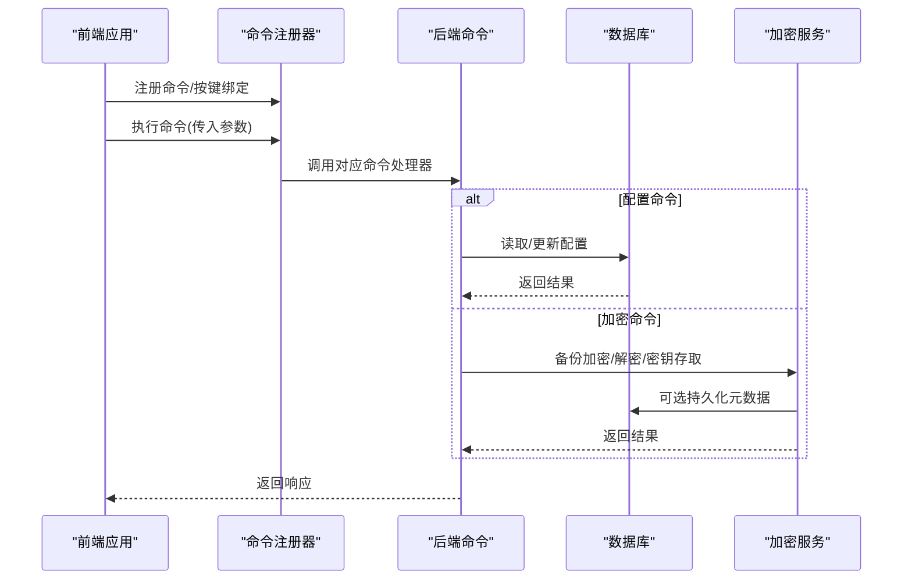
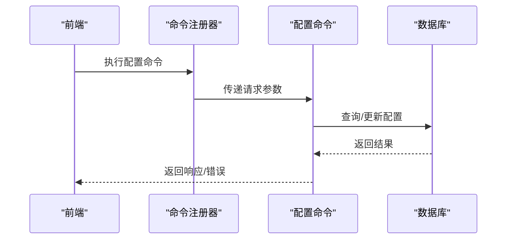
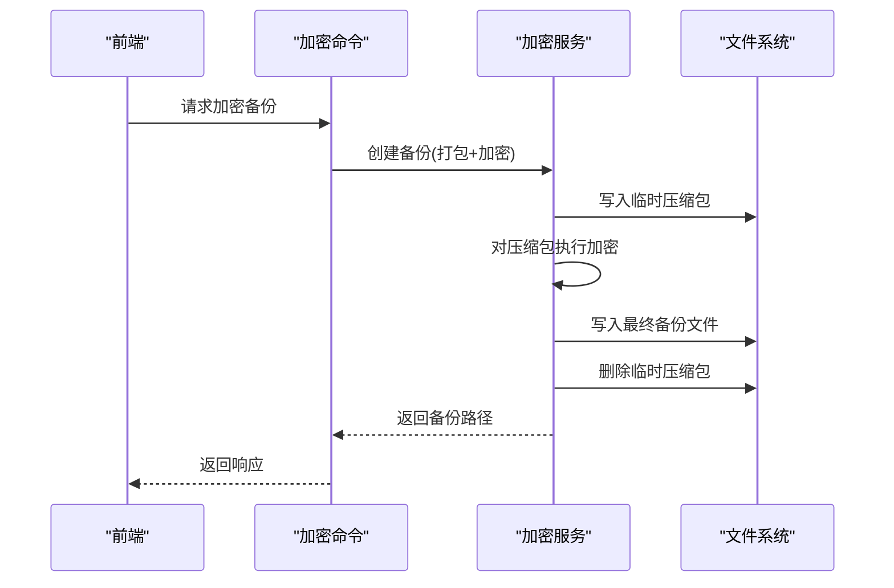
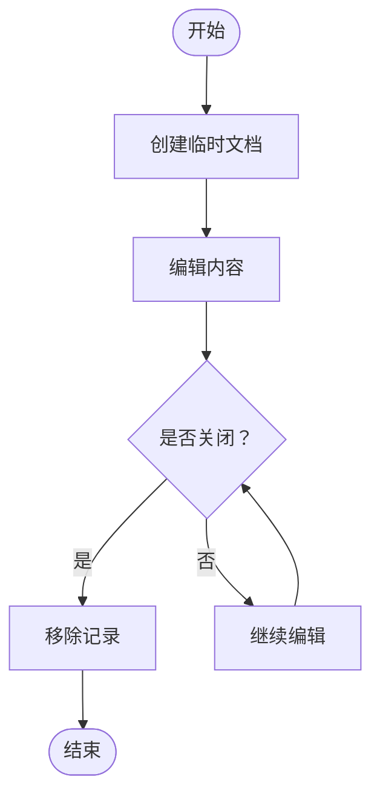
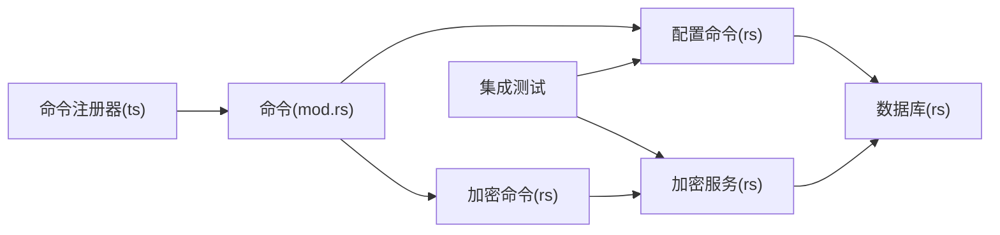

# 工具命令

<cite>
**本文引用的文件**
- [src-tauri/src/commands/mod.rs](file://src-tauri/src/commands/mod.rs)
- [src-tauri/src/commands/config.rs](file://src-tauri/src/commands/config.rs)
- [src-tauri/src/commands/encryption.rs](file://src-tauri/src/commands/encryption.rs)
- [src-tauri/src/encryption.rs](file://src-tauri/src/encryption.rs)
- [src-tauri/src/db.rs](file://src-tauri/src/db.rs)
- [src-tauri/src/models/config.rs](file://src-tauri/src/models/config.rs)
- [src-tauri/src/models/encryption.rs](file://src-tauri/src/models/encryption.rs)
- [src/core/command/command-registry.impl.ts](file://src/core/command/command-registry.impl.ts)
- [src/core/command/types.ts](file://src/core/command/types.ts)
- [src/core/document/document-service.impl.ts](file://src/core/document/document-service.impl.ts)
- [src/ipc/stub.ts](file://src/ipc/stub.ts)
- [src-tauri/tests/integration_test.rs](file://src-tauri/tests/integration_test.rs)
</cite>

## 目录
1. [简介](#简介)
2. [项目结构](#项目结构)
3. [核心组件](#核心组件)
4. [架构总览](#架构总览)
5. [详细组件分析](#详细组件分析)
6. [依赖关系分析](#依赖关系分析)
7. [性能考量](#性能考量)
8. [故障排查指南](#故障排查指南)
9. [结论](#结论)
10. [附录](#附录)

## 简介
本文件聚焦于NoteForge中的“工具类命令”，系统化梳理三类关键能力：配置管理命令（读取、写入、验证）、加密解密命令（数据加密、密钥管理、安全传输）、以及临时文件与临时文档处理命令（创建、清理、生命周期）。文档同时总结设计原则（通用性、可复用性、安全性），并提供扩展指南与使用示例及安全注意事项。

## 项目结构
NoteForge采用前后端分层：前端通过命令注册与执行框架调用后端Tauri命令；后端命令在src-tauri中实现，并通过数据库与模型层完成业务逻辑。工具命令主要分布在以下位置：
- 前端命令框架：src/core/command/*
- 后端命令实现：src-tauri/src/commands/*
- 加密服务：src-tauri/src/encryption.rs
- 数据库与模型：src-tauri/src/db.rs、src-tauri/src/models/*

图表来源
- [src/core/command/command-registry.impl.ts:1-37](file://src/core/command/command-registry.impl.ts#L1-L37)
- [src/core/command/types.ts](file://src/core/command/types.ts)
- [src-tauri/src/commands/mod.rs](file://src-tauri/src/commands/mod.rs)
- [src-tauri/src/commands/config.rs](file://src-tauri/src/commands/config.rs)
- [src-tauri/src/commands/encryption.rs](file://src-tauri/src/commands/encryption.rs)
- [src-tauri/src/encryption.rs:91-183](file://src-tauri/src/encryption.rs#L91-L183)
- [src-tauri/src/db.rs](file://src-tauri/src/db.rs)
- [src-tauri/src/models/config.rs](file://src-tauri/src/models/config.rs)
- [src-tauri/src/models/encryption.rs](file://src-tauri/src/models/encryption.rs)

章节来源
- [src/core/command/command-registry.impl.ts:1-37](file://src/core/command/command-registry.impl.ts#L1-L37)
- [src-tauri/src/commands/mod.rs](file://src-tauri/src/commands/mod.rs)

## 核心组件
- 命令注册与执行框架：负责命令注册、按键绑定索引、上下文构建与执行。
- 配置管理命令：封装配置读取、写入与验证流程，确保一致性与安全性。
- 加密解密命令：提供备份加密、恢复解密、API密钥存储与检索等能力。
- 临时文件与临时文档：提供临时文件操作与临时文档生命周期管理。

章节来源
- [src/core/command/command-registry.impl.ts:1-37](file://src/core/command/command-registry.impl.ts#L1-L37)
- [src-tauri/src/commands/config.rs](file://src-tauri/src/commands/config.rs)
- [src-tauri/src/commands/encryption.rs:1-34](file://src-tauri/src/commands/encryption.rs#L1-L34)
- [src-tauri/src/encryption.rs:91-183](file://src-tauri/src/encryption.rs#L91-L183)
- [src/core/document/document-service.impl.ts:191-225](file://src/core/document/document-service.impl.ts#L191-L225)

## 架构总览
下图展示工具命令从注册到执行的关键路径，以及与数据库、加密服务、模型层的交互。

图表来源
- [src/core/command/command-registry.impl.ts:1-37](file://src/core/command/command-registry.impl.ts#L1-L37)
- [src-tauri/src/commands/config.rs](file://src-tauri/src/commands/config.rs)
- [src-tauri/src/commands/encryption.rs:1-34](file://src-tauri/src/commands/encryption.rs#L1-L34)
- [src-tauri/src/db.rs](file://src-tauri/src/db.rs)
- [src-tauri/src/encryption.rs:91-183](file://src-tauri/src/encryption.rs#L91-L183)

## 详细组件分析

### 配置管理命令
配置管理命令负责工作区配置的读取、写入与验证，确保配置变更的原子性与一致性，并通过数据库持久化。

- 关键职责
  - 读取：根据工作区ID查询路径与配置项。
  - 写入：更新配置字段并校验合法性。
  - 验证：对输入参数进行格式与范围校验，必要时回滚或拒绝。
- 数据流
  - 前端通过命令注册器触发命令。
  - 后端命令从数据库查询/更新配置。
  - 模型层提供请求/响应结构与默认值。
- 错误处理
  - 未找到工作区或配置非法时返回统一错误类型。
  - 对不可逆操作提供幂等保护。

图表来源
- [src-tauri/src/commands/config.rs](file://src-tauri/src/commands/config.rs)
- [src-tauri/src/db.rs](file://src-tauri/src/db.rs)
- [src-tauri/src/models/config.rs](file://src-tauri/src/models/config.rs)

章节来源
- [src-tauri/src/commands/config.rs](file://src-tauri/src/commands/config.rs)
- [src-tauri/src/models/config.rs](file://src-tauri/src/models/config.rs)
- [src-tauri/src/db.rs](file://src-tauri/src/db.rs)

### 加密解密命令
加密解密命令围绕“备份加密/恢复解密”和“API密钥存储/检索”两大场景展开，结合加密服务实现安全的数据保护与密钥管理。

- 备份加密
  - 流程：打包工作区 → 加密输出 → 清理临时文件 → 返回备份路径。
  - 安全性：使用强密码派生与对称加密，避免明文落盘。
- 恢复解密
  - 流程：读取加密备份 → 解密 → 写入目标目录。
- API密钥管理
  - 存储：以服务名为文件名，内容为加密后的密钥。
  - 检索：按服务名读取并解密，失败时返回“未找到”。

图表来源
- [src-tauri/src/commands/encryption.rs:1-34](file://src-tauri/src/commands/encryption.rs#L1-L34)
- [src-tauri/src/encryption.rs:91-183](file://src-tauri/src/encryption.rs#L91-L183)

章节来源
- [src-tauri/src/commands/encryption.rs:1-34](file://src-tauri/src/commands/encryption.rs#L1-L34)
- [src-tauri/src/encryption.rs:91-183](file://src-tauri/src/encryption.rs#L91-L183)
- [src-tauri/src/models/encryption.rs](file://src-tauri/src/models/encryption.rs)
- [src-tauri/tests/integration_test.rs:50-60](file://src-tauri/tests/integration_test.rs#L50-L60)

### 临时文件与临时文档处理命令
- 临时文件
  - 提供创建、删除、重命名、移动、统计信息等基础操作，便于工具链中生成中间产物与清理。
- 临时文档
  - 提供“易失性文档”创建与关闭流程，支持无磁盘持久化的内存态文档，适合临时编辑与预览。

图表来源
- [src/core/document/document-service.impl.ts:191-225](file://src/core/document/document-service.impl.ts#L191-L225)

章节来源
- [src/ipc/stub.ts:327-371](file://src/ipc/stub.ts#L327-L371)
- [src/core/document/document-service.impl.ts:191-225](file://src/core/document/document-service.impl.ts#L191-L225)

## 依赖关系分析
- 前端命令注册器依赖命令定义与键位绑定，运行时动态构建上下文并执行。
- 后端命令通过状态持有数据库连接，访问模型层进行参数校验与结果封装。
- 加密命令依赖加密服务，后者负责具体加解密算法与文件操作。
- 测试覆盖了配置读取与加密解密的关键路径，保证行为正确性。

图表来源
- [src/core/command/command-registry.impl.ts:1-37](file://src/core/command/command-registry.impl.ts#L1-L37)
- [src-tauri/src/commands/mod.rs](file://src-tauri/src/commands/mod.rs)
- [src-tauri/src/commands/config.rs](file://src-tauri/src/commands/config.rs)
- [src-tauri/src/commands/encryption.rs:1-34](file://src-tauri/src/commands/encryption.rs#L1-L34)
- [src-tauri/src/encryption.rs:91-183](file://src-tauri/src/encryption.rs#L91-L183)
- [src-tauri/src/db.rs](file://src-tauri/src/db.rs)
- [src-tauri/tests/integration_test.rs:45-60](file://src-tauri/tests/integration_test.rs#L45-L60)

章节来源
- [src/core/command/types.ts](file://src/core/command/types.ts)
- [src-tauri/src/commands/mod.rs](file://src-tauri/src/commands/mod.rs)
- [src-tauri/src/db.rs](file://src-tauri/src/db.rs)
- [src-tauri/tests/integration_test.rs:45-60](file://src-tauri/tests/integration_test.rs#L45-L60)

## 性能考量
- 配置命令
  - 使用数据库事务与最小化查询，避免频繁I/O。
  - 对大字段采用懒加载策略，仅在需要时读取。
- 加密命令
  - 备份阶段优先使用内存缓冲减少磁盘写入次数。
  - 临时文件在加密完成后立即清理，降低磁盘占用。
- 临时文件与文档
  - 临时文档不落地磁盘，减少IO压力；关闭即释放内存。
  - 文件操作采用批量删除与去重策略，避免重复遍历。

## 故障排查指南
- 配置命令
  - 症状：工作区不存在或配置未更新。
  - 排查：确认工作区ID有效、配置字段合法；检查数据库连接与事务提交。
- 加密命令
  - 症状：备份失败或解密报错。
  - 排查：核对密码正确性、文件权限、临时目录可用性；查看加密服务日志。
- 临时文件与文档
  - 症状：临时文件未清理或临时文档无法关闭。
  - 排查：确认调用顺序与生命周期管理；检查是否存在并发写入。

章节来源
- [src-tauri/tests/integration_test.rs:45-60](file://src-tauri/tests/integration_test.rs#L45-L60)
- [src-tauri/src/encryption.rs:91-183](file://src-tauri/src/encryption.rs#L91-L183)
- [src/core/document/document-service.impl.ts:191-225](file://src/core/document/document-service.impl.ts#L191-L225)

## 结论
NoteForge的工具命令体系以“可复用、可扩展、可验证”为目标，通过前后端清晰分层与统一的错误模型，实现了配置管理、加密解密与临时资源管理的稳定能力。建议在新增工具命令时遵循本文设计原则与扩展指南，确保一致的安全性与可维护性。

## 附录

### 设计原则
- 通用性：命令参数与返回值尽量抽象，适配多种使用场景。
- 可复用性：将公共逻辑下沉至服务层（如加密服务），命令仅做编排。
- 安全性：敏感数据（如密钥）只在内存中短暂存在，落盘前必须加密；提供最小权限原则的文件操作。

### 扩展指南
- 新增命令步骤
  - 在前端定义命令ID、键位绑定与运行函数，注册到命令注册器。
  - 在后端命令模块新增处理函数，声明Tauri命令属性。
  - 编写模型层请求/响应结构，完善参数校验。
  - 实现业务逻辑（可复用的服务层），必要时访问数据库。
  - 编写单元/集成测试，覆盖正常与异常分支。
- 最佳实践
  - 参数校验前置，尽早失败。
  - 使用状态持有数据库连接，避免全局共享。
  - 对外部文件操作增加权限与路径白名单校验。
  - 记录关键事件与错误码，便于追踪。

### 使用示例与安全注意事项
- 配置读取/写入
  - 示例路径参考：[配置命令实现](file://src-tauri/src/commands/config.rs)
  - 安全要点：禁止直接暴露内部路径；对用户输入进行转义与长度限制。
- 备份加密/恢复解密
  - 示例路径参考：[加密命令实现:1-34](file://src-tauri/src/commands/encryption.rs#L1-L34)、[加密服务实现:91-183](file://src-tauri/src/encryption.rs#L91-L183)
  - 安全要点：使用高强度口令；备份文件权限仅限当前用户；清理临时文件。
- API密钥存储/检索
  - 示例路径参考：[加密服务密钥接口:132-162](file://src-tauri/src/encryption.rs#L132-L162)
  - 安全要点：密钥文件命名规范；定期轮换口令；避免在日志中打印密钥。
- 临时文件与临时文档
  - 示例路径参考：[临时文件操作:327-371](file://src/ipc/stub.ts#L327-L371)、[临时文档创建:191-225](file://src/core/document/document-service.impl.ts#L191-L225)
  - 安全要点：临时文件命名唯一；关闭即删除；避免跨进程共享临时句柄。