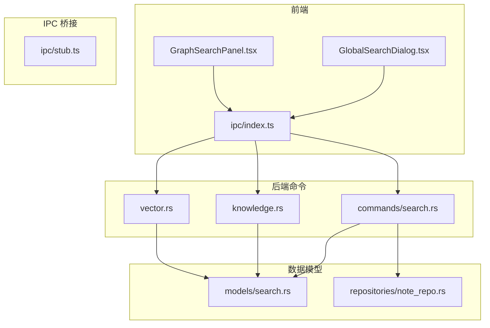
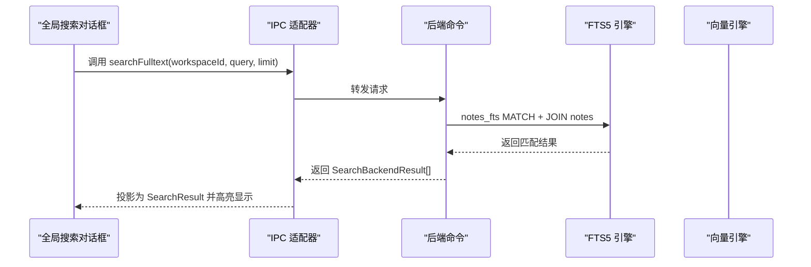
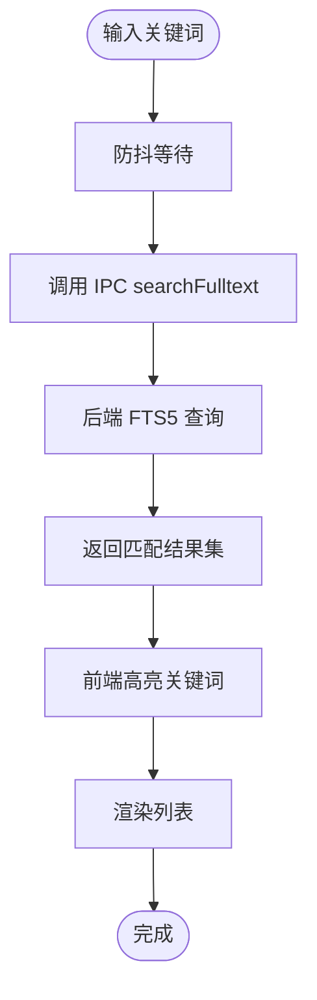
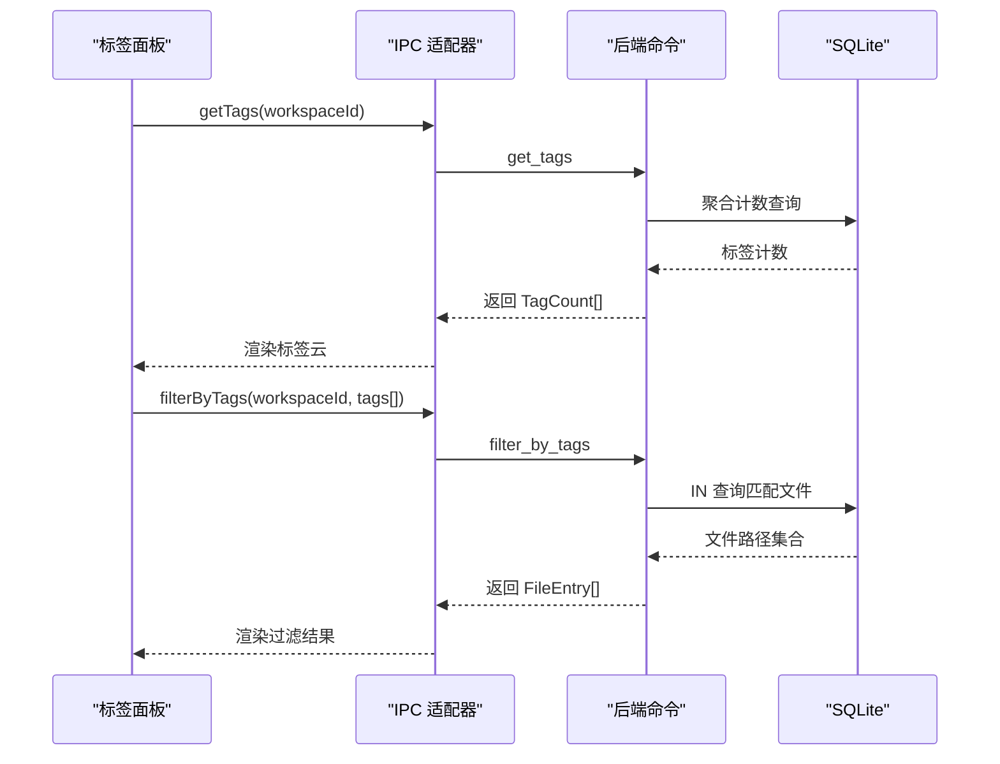
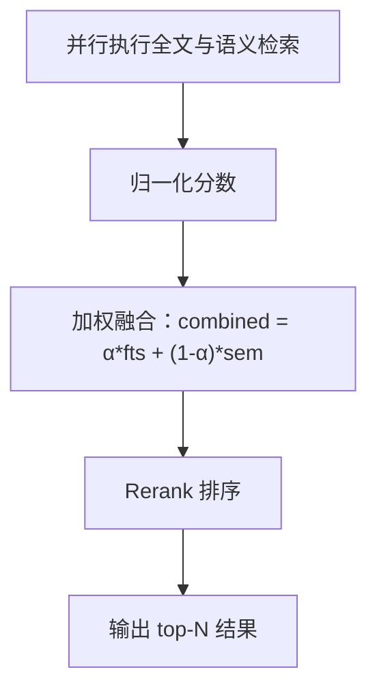
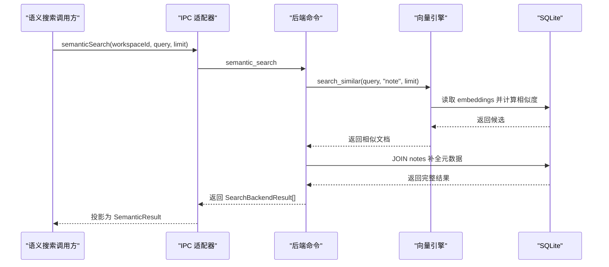
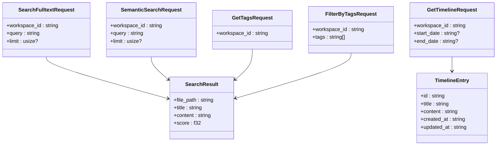
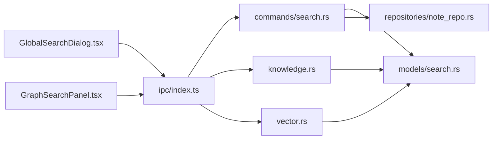

# 搜索命令

<cite>
**本文引用的文件**
- [src/components/dialogs/GlobalSearchDialog.tsx](file://src/components/dialogs/GlobalSearchDialog.tsx)
- [src/components/sidebar/GraphSearchPanel.tsx](file://src/components/sidebar/GraphSearchPanel.tsx)
- [src/ipc/index.ts](file://src/ipc/index.ts)
- [src/ipc/stub.ts](file://src/ipc/stub.ts)
- [src-tauri/src/commands/search.rs](file://src-tauri/src/commands/search.rs)
- [src-tauri/src/knowledge.rs](file://src-tauri/src/knowledge.rs)
- [src-tauri/src/vector.rs](file://src-tauri/src/vector.rs)
- [src-tauri/src/models/search.rs](file://src-tauri/src/models/search.rs)
- [src-tauri/src/repositories/note_repo.rs](file://src-tauri/src/repositories/note_repo.rs)
- [.tmp/system-architecture-design.md](file://.tmp/system-architecture-design.md)
</cite>

## 目录
1. [简介](#简介)
2. [项目结构](#项目结构)
3. [核心组件](#核心组件)
4. [架构总览](#架构总览)
5. [详细组件分析](#详细组件分析)
6. [依赖关系分析](#依赖关系分析)
7. [性能考量](#性能考量)
8. [故障排查指南](#故障排查指南)
9. [结论](#结论)
10. [附录：搜索命令与配置](#附录搜索命令与配置)

## 简介
本文件系统性梳理 NoteForge 的搜索命令体系，覆盖以下主题：
- 全文搜索：文本匹配、模糊搜索与高亮显示的实现机制
- 结构化搜索：标签过滤、日期范围与文件类型筛选
- 搜索结果排序：相关性评分、权重计算与自定义排序规则
- 性能优化：索引构建、查询缓存与并行处理
- 配置项：搜索范围、结果限制与高级过滤条件
- 实战示例与优化建议

## 项目结构
NoteForge 的搜索能力由前端对话框与侧边栏交互入口、IPC 层适配器、后端 Tauri 命令与 Rust 核心引擎共同构成。核心模块分布如下：
- 前端交互层：全局搜索对话框与标签过滤面板
- IPC 适配层：统一调用入口，区分真实后端与浏览器模拟
- 后端命令层：标签统计、标签过滤、时间线、全文检索、语义检索等
- 引擎层：FTS5 全文索引、向量引擎、知识图谱与链接抽取
- 数据模型：请求/响应结构体与结果投影

图表来源
- [src/components/dialogs/GlobalSearchDialog.tsx:12-126](file://src/components/dialogs/GlobalSearchDialog.tsx#L12-L126)
- [src/components/sidebar/GraphSearchPanel.tsx:111-139](file://src/components/sidebar/GraphSearchPanel.tsx#L111-L139)
- [src/ipc/index.ts:300-354](file://src/ipc/index.ts#L300-L354)
- [src-tauri/src/commands/search.rs:8-117](file://src-tauri/src/commands/search.rs#L8-L117)
- [src-tauri/src/knowledge.rs:1-46](file://src-tauri/src/knowledge.rs#L1-L46)
- [src-tauri/src/vector.rs:1-151](file://src-tauri/src/vector.rs#L1-L151)
- [src-tauri/src/models/search.rs:1-64](file://src-tauri/src/models/search.rs#L1-L64)
- [src-tauri/src/repositories/note_repo.rs:1-170](file://src-tauri/src/repositories/note_repo.rs#L1-L170)

章节来源
- [src/components/dialogs/GlobalSearchDialog.tsx:12-126](file://src/components/dialogs/GlobalSearchDialog.tsx#L12-L126)
- [src/components/sidebar/GraphSearchPanel.tsx:111-139](file://src/components/sidebar/GraphSearchPanel.tsx#L111-L139)
- [src/ipc/index.ts:300-354](file://src/ipc/index.ts#L300-L354)
- [src-tauri/src/commands/search.rs:8-117](file://src-tauri/src/commands/search.rs#L8-L117)
- [src-tauri/src/knowledge.rs:1-46](file://src-tauri/src/knowledge.rs#L1-L46)
- [src-tauri/src/vector.rs:1-151](file://src-tauri/src/vector.rs#L1-L151)
- [src-tauri/src/models/search.rs:1-64](file://src-tauri/src/models/search.rs#L1-L64)
- [src-tauri/src/repositories/note_repo.rs:1-170](file://src-tauri/src/repositories/note_repo.rs#L1-L170)

## 核心组件
- 全局搜索对话框：支持“全部/按文件名/按全文/按标签”四种模式；实时搜索与高亮显示；触发编辑器打开文件
- 标签过滤面板：聚合标签并按使用频次可视化；多标签组合过滤；点击即开文件
- IPC 适配器：统一暴露 searchFulltext、semanticSearch、getTags、filterByTags 等方法；在浏览器环境回退到 stub 实现
- 后端命令：提供 get_tags、filter_by_tags、get_timeline 等结构化查询；封装知识库索引与检索
- 引擎与模型：FTS5 全文索引、向量引擎、搜索结果模型

章节来源
- [src/components/dialogs/GlobalSearchDialog.tsx:12-126](file://src/components/dialogs/GlobalSearchDialog.tsx#L12-L126)
- [src/components/sidebar/GraphSearchPanel.tsx:111-139](file://src/components/sidebar/GraphSearchPanel.tsx#L111-L139)
- [src/ipc/index.ts:300-354](file://src/ipc/index.ts#L300-L354)
- [src-tauri/src/commands/search.rs:8-117](file://src-tauri/src/commands/search.rs#L8-L117)
- [src-tauri/src/knowledge.rs:1-46](file://src-tauri/src/knowledge.rs#L1-L46)
- [src-tauri/src/vector.rs:1-151](file://src-tauri/src/vector.rs#L1-L151)
- [src-tauri/src/models/search.rs:1-64](file://src-tauri/src/models/search.rs#L1-L64)

## 架构总览
NoteForge 的搜索采用“前端交互 + IPC 适配 + 后端命令 + 引擎”的分层设计。全文检索基于 FTS5，语义检索基于向量相似度，二者可并行融合。

图表来源
- [src/components/dialogs/GlobalSearchDialog.tsx:30-51](file://src/components/dialogs/GlobalSearchDialog.tsx#L30-L51)
- [src/ipc/index.ts:307-314](file://src/ipc/index.ts#L307-L314)
- [src-tauri/src/commands/search.rs:8-117](file://src-tauri/src/commands/search.rs#L8-L117)
- [src-tauri/src/knowledge.rs:25-46](file://src-tauri/src/knowledge.rs#L25-L46)

章节来源
- [.tmp/system-architecture-design.md:803-855](file://.tmp/system-architecture-design.md#L803-L855)
- [src/components/dialogs/GlobalSearchDialog.tsx:30-51](file://src/components/dialogs/GlobalSearchDialog.tsx#L30-L51)
- [src/ipc/index.ts:307-314](file://src/ipc/index.ts#L307-L314)
- [src-tauri/src/commands/search.rs:8-117](file://src-tauri/src/commands/search.rs#L8-L117)
- [src-tauri/src/knowledge.rs:25-46](file://src-tauri/src/knowledge.rs#L25-L46)

## 详细组件分析

### 全文搜索：文本匹配、模糊搜索与高亮显示
- 文本匹配与模糊搜索
  - 前端通过防抖触发搜索，支持“全部/按文件名/按全文/按标签”模式切换
  - 后端使用 FTS5 虚拟表 notes_fts，支持 unicode61 分词与去音调标记，适合中英文混合
  - 前端对命中片段进行截取并高亮关键词
- 高亮显示
  - 前端在渲染时对匹配子串包裹标记元素，形成视觉高亮
  - 后端返回 snippet 片段，前端再做二次高亮包装

图表来源
- [src/components/dialogs/GlobalSearchDialog.tsx:30-51](file://src/components/dialogs/GlobalSearchDialog.tsx#L30-L51)
- [src/ipc/index.ts:307-314](file://src/ipc/index.ts#L307-L314)
- [src-tauri/src/knowledge.rs:25-46](file://src-tauri/src/knowledge.rs#L25-L46)
- [src/components/dialogs/GlobalSearchDialog.tsx:149-160](file://src/components/dialogs/GlobalSearchDialog.tsx#L149-L160)

章节来源
- [src/components/dialogs/GlobalSearchDialog.tsx:30-51](file://src/components/dialogs/GlobalSearchDialog.tsx#L30-L51)
- [src/components/dialogs/GlobalSearchDialog.tsx:149-160](file://src/components/dialogs/GlobalSearchDialog.tsx#L149-L160)
- [src-tauri/src/knowledge.rs:25-46](file://src-tauri/src/knowledge.rs#L25-L46)
- [.tmp/system-architecture-design.md:825-855](file://.tmp/system-architecture-design.md#L825-L855)

### 结构化搜索：标签过滤、日期范围与文件类型筛选
- 标签过滤
  - 获取标签统计：按工作区聚合标签使用次数
  - 多标签过滤：IN 查询匹配同时包含多个标签的笔记
  - 前端标签面板支持多选与可视化密度
- 日期范围
  - 时间线查询支持起止日期过滤，按创建时间倒序
- 文件类型筛选
  - 当前实现主要面向 Markdown 笔记；可通过扩展过滤器增加类型参数

图表来源
- [src/components/sidebar/GraphSearchPanel.tsx:111-139](file://src/components/sidebar/GraphSearchPanel.tsx#L111-L139)
- [src/ipc/index.ts:346-354](file://src/ipc/index.ts#L346-L354)
- [src-tauri/src/commands/search.rs:8-117](file://src-tauri/src/commands/search.rs#L8-L117)

章节来源
- [src/components/sidebar/GraphSearchPanel.tsx:111-139](file://src/components/sidebar/GraphSearchPanel.tsx#L111-L139)
- [src/ipc/index.ts:346-354](file://src/ipc/index.ts#L346-L354)
- [src-tauri/src/commands/search.rs:8-117](file://src-tauri/src/commands/search.rs#L8-L117)
- [.tmp/system-architecture-design.md:905-942](file://.tmp/system-architecture-design.md#L905-L942)

### 搜索结果排序：相关性评分、权重计算与自定义排序
- FTS5 排序
  - 使用内置 rank 排序，结合 snippet 提取与标签附加
- 语义相似度
  - 向量引擎计算余弦相似度，作为相似度分数参与融合
- 混合排序（概念流程）
  - 并行执行全文与语义检索，归一化分数后加权融合，最终 rerank 输出

图表来源
- [.tmp/system-architecture-design.md:880-903](file://.tmp/system-architecture-design.md#L880-L903)
- [src-tauri/src/vector.rs:57-118](file://src-tauri/src/vector.rs#L57-L118)

章节来源
- [.tmp/system-architecture-design.md:880-903](file://.tmp/system-architecture-design.md#L880-L903)
- [src-tauri/src/vector.rs:57-118](file://src-tauri/src/vector.rs#L57-L118)

### 语义搜索：向量相似度与检索流程
- 查询向量化：fastembed 生成查询 embedding
- 候选召回：遍历 document_embeddings 计算余弦相似度，返回 top-N
- 过滤与补全：按工作区过滤并 JOIN notes 补全标题与内容片段

图表来源
- [src/ipc/index.ts:315-322](file://src/ipc/index.ts#L315-L322)
- [src-tauri/src/commands/knowledge.rs:232-269](file://src-tauri/src/commands/knowledge.rs#L232-L269)
- [src-tauri/src/vector.rs:57-118](file://src-tauri/src/vector.rs#L57-L118)

章节来源
- [src/ipc/index.ts:315-322](file://src/ipc/index.ts#L315-L322)
- [src-tauri/src/commands/knowledge.rs:232-269](file://src-tauri/src/commands/knowledge.rs#L232-L269)
- [src-tauri/src/vector.rs:57-118](file://src-tauri/src/vector.rs#L57-L118)
- [.tmp/system-architecture-design.md:857-878](file://.tmp/system-architecture-design.md#L857-L878)

### 数据模型与接口契约
- 请求/响应模型：SearchFulltextRequest、SemanticSearchRequest、GetTagsRequest、FilterByTagsRequest、GetTimelineRequest
- 结果模型：SearchResult、TimelineEntry
- 前端投影：toSearchResult、toSemanticResult 等

图表来源
- [src-tauri/src/models/search.rs:14-64](file://src-tauri/src/models/search.rs#L14-L64)

章节来源
- [src-tauri/src/models/search.rs:14-64](file://src-tauri/src/models/search.rs#L14-L64)
- [src/ipc/index.ts:138-149](file://src/ipc/index.ts#L138-L149)

## 依赖关系分析
- 前端依赖 IPC 适配器，后者根据运行环境选择真实后端或 stub 实现
- 后端命令依赖 SQLite 与 rusqlite，FTS5 虚拟表与 document_embeddings 表分别承载全文与向量索引
- 知识查询服务负责索引重建与事件驱动的增量更新

图表来源
- [src/components/dialogs/GlobalSearchDialog.tsx:12-126](file://src/components/dialogs/GlobalSearchDialog.tsx#L12-L126)
- [src/components/sidebar/GraphSearchPanel.tsx:111-139](file://src/components/sidebar/GraphSearchPanel.tsx#L111-L139)
- [src/ipc/index.ts:300-354](file://src/ipc/index.ts#L300-L354)
- [src-tauri/src/commands/search.rs:8-117](file://src-tauri/src/commands/search.rs#L8-L117)
- [src-tauri/src/knowledge.rs:1-46](file://src-tauri/src/knowledge.rs#L1-L46)
- [src-tauri/src/vector.rs:1-151](file://src-tauri/src/vector.rs#L1-L151)
- [src-tauri/src/models/search.rs:1-64](file://src-tauri/src/models/search.rs#L1-L64)
- [src-tauri/src/repositories/note_repo.rs:1-170](file://src-tauri/src/repositories/note_repo.rs#L1-L170)

章节来源
- [src/components/dialogs/GlobalSearchDialog.tsx:12-126](file://src/components/dialogs/GlobalSearchDialog.tsx#L12-L126)
- [src/components/sidebar/GraphSearchPanel.tsx:111-139](file://src/components/sidebar/GraphSearchPanel.tsx#L111-L139)
- [src/ipc/index.ts:300-354](file://src/ipc/index.ts#L300-L354)
- [src-tauri/src/commands/search.rs:8-117](file://src-tauri/src/commands/search.rs#L8-L117)
- [src-tauri/src/knowledge.rs:1-46](file://src-tauri/src/knowledge.rs#L1-L46)
- [src-tauri/src/vector.rs:1-151](file://src-tauri/src/vector.rs#L1-L151)
- [src-tauri/src/models/search.rs:1-64](file://src-tauri/src/models/search.rs#L1-L64)
- [src-tauri/src/repositories/note_repo.rs:1-170](file://src-tauri/src/repositories/note_repo.rs#L1-L170)

## 性能考量
- 索引构建
  - FTS5 虚拟表自动维护；向量索引通过 document_embeddings 表存储 JSON 向量
  - 建议在工作区变更或批量导入后触发增量重建
- 查询缓存
  - 前端对搜索结果进行短期缓存（防抖与状态缓存），减少重复请求
  - 后端可引入查询结果缓存（需注意并发一致性）
- 并行处理
  - 语义与全文检索可并行执行，合并后再 rerank
- I/O 优化
  - 使用 LIMIT 控制结果规模；仅在必要时 JOIN notes 补全元数据
  - 标签过滤使用 IN 查询，避免多次往返

章节来源
- [.tmp/system-architecture-design.md:880-903](file://.tmp/system-architecture-design.md#L880-L903)
- [src/components/dialogs/GlobalSearchDialog.tsx:30-51](file://src/components/dialogs/GlobalSearchDialog.tsx#L30-L51)
- [src-tauri/src/commands/search.rs:8-117](file://src-tauri/src/commands/search.rs#L8-L117)
- [src-tauri/src/knowledge.rs:1-46](file://src-tauri/src/knowledge.rs#L1-L46)
- [src-tauri/src/vector.rs:57-118](file://src-tauri/src/vector.rs#L57-L118)

## 故障排查指南
- 搜索无结果
  - 检查工作区是否正确加载且存在笔记
  - 确认 FTS5 索引是否存在，必要时触发 reindexAll
- 标签过滤无效
  - 确认标签解析逻辑与标签名大小写
  - 检查 filter_by_tags SQL 是否正确拼接 IN 列表
- 语义搜索缓慢
  - 检查向量模型是否可用与 embedding 表是否填充
  - 调整 limit 与并行策略
- 高亮异常
  - 检查前端高亮函数是否正确包裹匹配子串
  - 确认后端 snippet 截取逻辑与字符编码

章节来源
- [src-tauri/src/knowledge.rs:1-46](file://src-tauri/src/knowledge.rs#L1-L46)
- [src-tauri/src/commands/search.rs:8-117](file://src-tauri/src/commands/search.rs#L8-L117)
- [src-tauri/src/vector.rs:57-118](file://src-tauri/src/vector.rs#L57-L118)
- [src/components/dialogs/GlobalSearchDialog.tsx:149-160](file://src/components/dialogs/GlobalSearchDialog.tsx#L149-L160)

## 结论
NoteForge 的搜索体系以 FTS5 与向量引擎为核心，结合前端交互与 IPC 适配，实现了从全文到语义、从标签到时间线的多维检索能力。通过合理的索引策略、并行融合与前端缓存，可在保证体验的同时兼顾性能与扩展性。

## 附录：搜索命令与配置
- 全文搜索
  - 命令：searchFulltext(workspaceId, query, limit?)
  - 行为：FTS5 匹配 + snippet 截取 + 标签附加
  - 高亮：前端对匹配子串进行高亮包裹
- 语义搜索
  - 命令：semanticSearch(workspaceId, query, limit?)
  - 行为：向量相似度召回 + 工作区过滤 + 内容片段截取
- 结构化搜索
  - 标签统计：getTags(workspaceId)
  - 标签过滤：filterByTags(workspaceId, tags[])
  - 时间线：getTimeline(workspaceId, start_date?, end_date?)
- 配置与限制
  - limit：控制单次返回条目数量
  - 搜索范围：通过 workspace_id 限定
  - 高级过滤：可扩展类型过滤（如仅 Markdown）、正则匹配等

章节来源
- [src/ipc/index.ts:307-322](file://src/ipc/index.ts#L307-L322)
- [src-tauri/src/commands/search.rs:8-117](file://src-tauri/src/commands/search.rs#L8-L117)
- [src-tauri/src/models/search.rs:14-64](file://src-tauri/src/models/search.rs#L14-L64)
- [.tmp/system-architecture-design.md:905-942](file://.tmp/system-architecture-design.md#L905-L942)