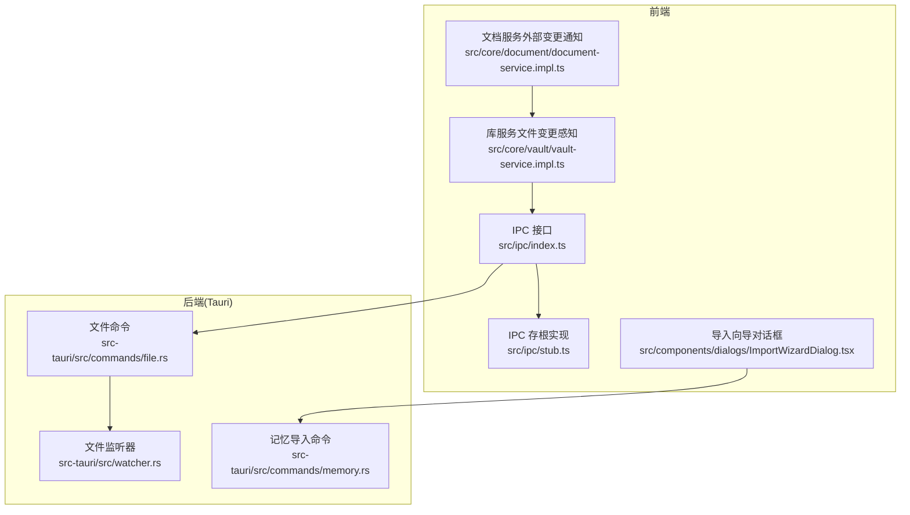
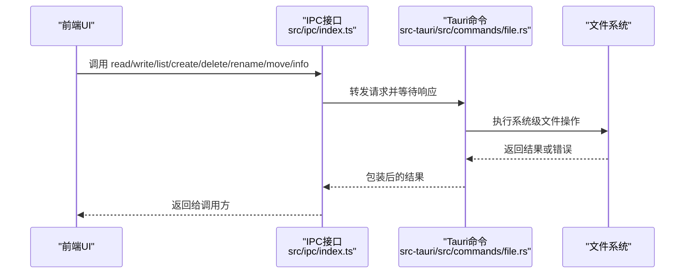
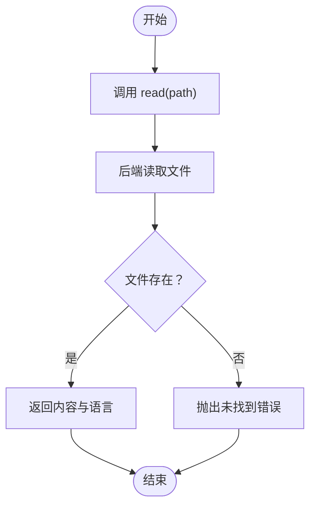
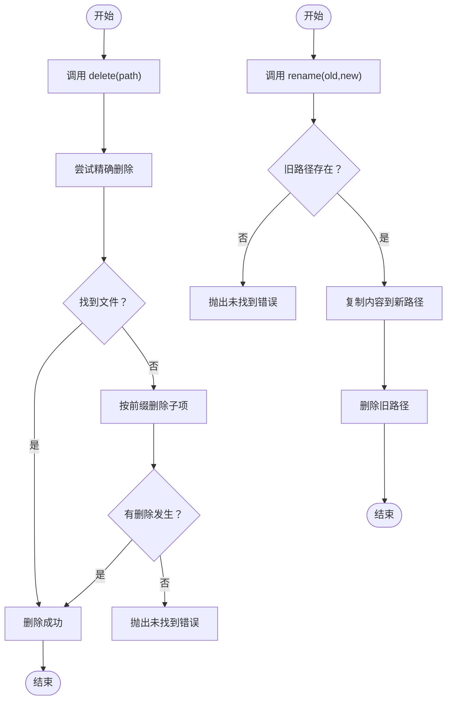
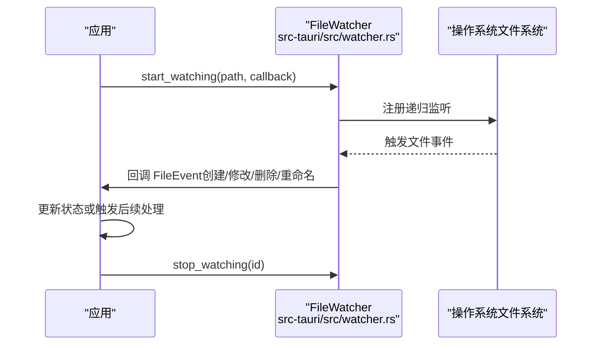
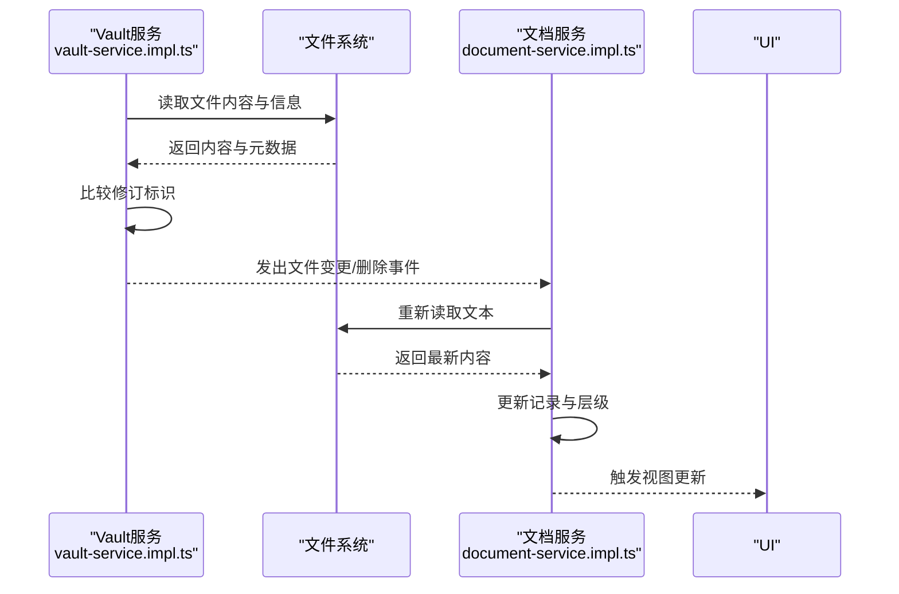
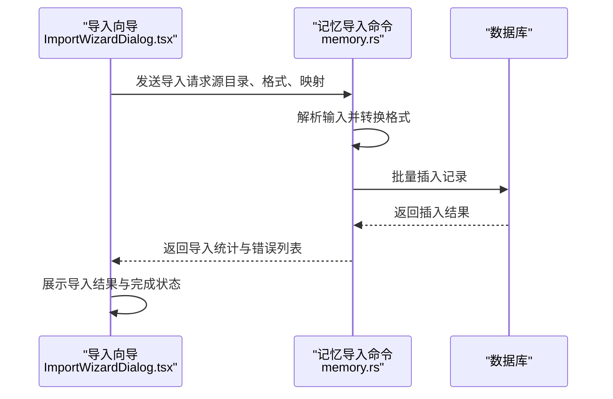
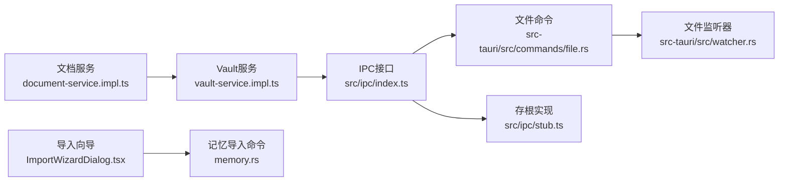

# 文件系统命令

<cite>
**本文引用的文件**
- [src/ipc/index.ts](file://src/ipc/index.ts)
- [src/ipc/stub.ts](file://src/ipc/stub.ts)
- [src-tauri/src/commands/file.rs](file://src-tauri/src/commands/file.rs)
- [src-tauri/src/watcher.rs](file://src-tauri/src/watcher.rs)
- [src/core/vault/vault-service.impl.ts](file://src/core/vault/vault-service.impl.ts)
- [src/core/document/document-service.impl.ts](file://src/core/document/document-service.impl.ts)
- [src/components/dialogs/ImportWizardDialog.tsx](file://src/components/dialogs/ImportWizardDialog.tsx)
- [src-tauri/src/commands/memory.rs](file://src-tauri/src/commands/memory.rs)
</cite>

## 目录
1. [简介](#简介)
2. [项目结构](#项目结构)
3. [核心组件](#核心组件)
4. [架构总览](#架构总览)
5. [详细组件分析](#详细组件分析)
6. [依赖关系分析](#依赖关系分析)
7. [性能考量](#性能考量)
8. [故障排除指南](#故障排除指南)
9. [结论](#结论)
10. [附录](#附录)

## 简介
本文件系统命令文档聚焦于NoteForge中的文件操作与监控能力，涵盖以下方面：
- 文件读取、写入、删除、重命名与移动等基础操作
- 文件变更监听（监控、事件通知、批量处理）
- 文件导入与导出（批量导入、格式转换、数据迁移）
- 性能优化策略（缓存、异步处理、并发控制）
- 安全与健壮性（权限检查、路径验证、异常处理）
- 使用示例与故障排除

## 项目结构
NoteForge的文件系统相关代码主要分布在前端IPC层、后端Tauri命令层以及核心服务层：
- 前端IPC接口定义与调用封装
- Tauri后端命令实现（文件系统、内存/磁盘监控）
- 核心服务层对文件变更的感知与事件分发
- 导入向导与记忆导入命令

图表来源
- [src/ipc/index.ts:215-238](file://src/ipc/index.ts#L215-L238)
- [src-tauri/src/commands/file.rs](file://src-tauri/src/commands/file.rs)
- [src-tauri/src/watcher.rs:1-128](file://src-tauri/src/watcher.rs#L1-L128)
- [src/core/vault/vault-service.impl.ts:40-61](file://src/core/vault/vault-service.impl.ts#L40-L61)
- [src/core/document/document-service.impl.ts:369-407](file://src/core/document/document-service.impl.ts#L369-L407)
- [src/components/dialogs/ImportWizardDialog.tsx:1-181](file://src/components/dialogs/ImportWizardDialog.tsx#L1-L181)
- [src-tauri/src/commands/memory.rs:320-336](file://src-tauri/src/commands/memory.rs#L320-L336)

章节来源
- [src/ipc/index.ts:215-238](file://src/ipc/index.ts#L215-L238)
- [src-tauri/src/commands/file.rs](file://src-tauri/src/commands/file.rs)
- [src-tauri/src/watcher.rs:1-128](file://src-tauri/src/watcher.rs#L1-L128)
- [src/core/vault/vault-service.impl.ts:40-61](file://src/core/vault/vault-service.impl.ts#L40-L61)
- [src/core/document/document-service.impl.ts:369-407](file://src/core/document/document-service.impl.ts#L369-L407)
- [src/components/dialogs/ImportWizardDialog.tsx:1-181](file://src/components/dialogs/ImportWizardDialog.tsx#L1-L181)
- [src-tauri/src/commands/memory.rs:320-336](file://src-tauri/src/commands/memory.rs#L320-L336)

## 核心组件
- 前端IPC文件系统接口：统一暴露读取、写入、列出、创建、删除、重命名、移动、获取信息等方法，并通过call封装进行跨进程调用。
- 后端文件命令：在Tauri侧实现具体文件操作，负责与操作系统交互并返回结果。
- 文件监听器：基于notify库递归监听指定路径，将文件事件转换为统一的FileEvent并回调给上层。
- 库服务与文档服务：对文件变更进行感知与事件分发，支持“外部变更通知”流程。
- 导入向导与记忆导入：提供用户交互界面与后端命令，支持批量导入与格式转换。

章节来源
- [src/ipc/index.ts:215-238](file://src/ipc/index.ts#L215-L238)
- [src-tauri/src/commands/file.rs](file://src-tauri/src/commands/file.rs)
- [src-tauri/src/watcher.rs:1-128](file://src-tauri/src/watcher.rs#L1-L128)
- [src/core/vault/vault-service.impl.ts:40-61](file://src/core/vault/vault-service.impl.ts#L40-L61)
- [src/core/document/document-service.impl.ts:369-407](file://src/core/document/document-service.impl.ts#L369-L407)
- [src/components/dialogs/ImportWizardDialog.tsx:1-181](file://src/components/dialogs/ImportWizardDialog.tsx#L1-L181)
- [src-tauri/src/commands/memory.rs:320-336](file://src-tauri/src/commands/memory.rs#L320-L336)

## 架构总览
NoteForge的文件系统命令采用前后端分离设计：
- 前端通过IPC接口发起请求，封装参数与错误处理
- 后端Tauri命令执行实际文件操作
- 文件监听器在后台线程持续扫描文件系统变化
- 核心服务层根据变更触发事件，驱动UI与文档状态更新

图表来源
- [src/ipc/index.ts:215-238](file://src/ipc/index.ts#L215-L238)
- [src-tauri/src/commands/file.rs](file://src-tauri/src/commands/file.rs)

## 详细组件分析

### 文件读取与写入
- 读取：前端调用read(path)，后端执行实际读取并返回内容与语言类型；若未找到则抛出错误。
- 写入：前端调用write(path, content)，后端写入文件；若目标已存在则抛出错误。
- 列出：list(path)返回目录项列表，内部将后端条目映射为前端通用结构。
- 创建：create(path, content)在不存在时创建文件。
- 删除：delete(path)支持单文件与目录前缀匹配删除。
- 重命名/移动：rename与move均委托至后端实现。
- 信息：info(path)返回大小、修改时间、语言与是否目录标记。

图表来源
- [src/ipc/index.ts:215-238](file://src/ipc/index.ts#L215-L238)
- [src-tauri/src/commands/file.rs](file://src-tauri/src/commands/file.rs)

章节来源
- [src/ipc/index.ts:215-238](file://src/ipc/index.ts#L215-L238)
- [src-tauri/src/commands/file.rs](file://src-tauri/src/commands/file.rs)

### 文件删除与重命名
- 删除：delete(path)先尝试精确删除，若失败则按前缀匹配删除所有子项；若无匹配则抛出未找到错误。
- 重命名：rename(oldPath, newPath)校验旧路径存在后复制内容并删除旧键。
- 移动：move(source, destination)直接复用重命名逻辑。

图表来源
- [src-tauri/src/commands/file.rs](file://src-tauri/src/commands/file.rs)

章节来源
- [src-tauri/src/commands/file.rs](file://src-tauri/src/commands/file.rs)

### 文件监听与事件通知
- 监听器：FileWatcher基于notify库递归监听指定路径，接收系统事件并转换为FileEvent枚举。
- 事件类型：创建、修改、删除、重命名（含旧路径与新路径）。
- 回调：事件通过回调函数传递至上层，用于刷新UI或触发业务逻辑。
- 多监听器：支持为不同路径启动独立监听器实例，并可查询活动监听器列表。

图表来源
- [src-tauri/src/watcher.rs:1-128](file://src-tauri/src/watcher.rs#L1-L128)

章节来源
- [src-tauri/src/watcher.rs:1-128](file://src-tauri/src/watcher.rs#L1-L128)

### 外部变更感知与批量处理
- 变更检测：vault-service通过读取文件内容与信息构建磁盘修订标识，与已知快照比较，若不一致则发出“文件变更/删除”事件。
- 文档同步：document-service在收到外部变更通知后，从磁盘重新加载文本、计算文件层级并更新文档记录，确保UI与底层状态一致。
- 批量处理：通过快照与事件队列，避免频繁重复刷新；仅在必要时触发UI更新。

图表来源
- [src/core/vault/vault-service.impl.ts:40-61](file://src/core/vault/vault-service.impl.ts#L40-L61)
- [src/core/document/document-service.impl.ts:369-407](file://src/core/document/document-service.impl.ts#L369-L407)

章节来源
- [src/core/vault/vault-service.impl.ts:40-61](file://src/core/vault/vault-service.impl.ts#L40-L61)
- [src/core/document/document-service.impl.ts:369-407](file://src/core/document/document-service.impl.ts#L369-L407)

### 文件导入与导出（批量导入、格式转换、数据迁移）
- 导入向导：提供三步式向导，支持源目录选择、自动检测、映射配置与选项设置（保留副本、自动链接）。
- 记忆导入命令：后端命令根据请求格式解析输入，插入数据库并统计导入数量与错误列表，支持批量处理与错误聚合。

图表来源
- [src/components/dialogs/ImportWizardDialog.tsx:1-181](file://src/components/dialogs/ImportWizardDialog.tsx#L1-L181)
- [src-tauri/src/commands/memory.rs:320-336](file://src-tauri/src/commands/memory.rs#L320-L336)

章节来源
- [src/components/dialogs/ImportWizardDialog.tsx:1-181](file://src/components/dialogs/ImportWizardDialog.tsx#L1-L181)
- [src-tauri/src/commands/memory.rs:320-336](file://src-tauri/src/commands/memory.rs#L320-L336)

## 依赖关系分析
- 前端IPC依赖后端命令实现；IPC接口提供统一入口，后端命令负责系统调用。
- 文件监听器独立于命令层，通过回调与上层服务解耦。
- 核心服务层（vault与document）依赖IPC接口读取文件与获取信息，以实现变更感知与同步。
- 导入向导与记忆导入命令相互配合，前者收集用户输入，后者执行数据迁移。

图表来源
- [src/ipc/index.ts:215-238](file://src/ipc/index.ts#L215-L238)
- [src-tauri/src/commands/file.rs](file://src-tauri/src/commands/file.rs)
- [src-tauri/src/watcher.rs:1-128](file://src-tauri/src/watcher.rs#L1-L128)
- [src/core/vault/vault-service.impl.ts:40-61](file://src/core/vault/vault-service.impl.ts#L40-L61)
- [src/core/document/document-service.impl.ts:369-407](file://src/core/document/document-service.impl.ts#L369-L407)
- [src/components/dialogs/ImportWizardDialog.tsx:1-181](file://src/components/dialogs/ImportWizardDialog.tsx#L1-L181)
- [src-tauri/src/commands/memory.rs:320-336](file://src-tauri/src/commands/memory.rs#L320-L336)

章节来源
- [src/ipc/index.ts:215-238](file://src/ipc/index.ts#L215-L238)
- [src-tauri/src/commands/file.rs](file://src-tauri/src/commands/file.rs)
- [src-tauri/src/watcher.rs:1-128](file://src-tauri/src/watcher.rs#L1-L128)
- [src/core/vault/vault-service.impl.ts:40-61](file://src/core/vault/vault-service.impl.ts#L40-L61)
- [src/core/document/document-service.impl.ts:369-407](file://src/core/document/document-service.impl.ts#L369-L407)
- [src/components/dialogs/ImportWizardDialog.tsx:1-181](file://src/components/dialogs/ImportWizardDialog.tsx#L1-L181)
- [src-tauri/src/commands/memory.rs:320-336](file://src-tauri/src/commands/memory.rs#L320-L336)

## 性能考量
- 缓存机制
  - 快照与修订标识：vault-service通过内容与修改时间构建磁盘修订，避免重复事件与无效刷新。
  - 文档层级缓存：document-service根据文件大小确定存储层级，减少大文件处理开销。
- 异步处理
  - 文件监听器在独立线程中处理事件，避免阻塞主线程。
  - IPC调用采用异步封装，前端可并发发起多个请求。
- 并发控制
  - 监听器支持多实例并行运行，每个实例对应一个路径空间。
  - 导入命令对批量插入进行聚合统计，降低数据库往返次数。
- I/O优化
  - 读取与信息获取合并为一次磁盘访问，减少系统调用次数。
  - 删除操作优先精确匹配，再回退到前缀匹配，减少遍历成本。

章节来源
- [src/core/vault/vault-service.impl.ts:40-61](file://src/core/vault/vault-service.impl.ts#L40-L61)
- [src/core/document/document-service.impl.ts:369-407](file://src/core/document/document-service.impl.ts#L369-L407)
- [src-tauri/src/watcher.rs:1-128](file://src-tauri/src/watcher.rs#L1-L128)
- [src-tauri/src/commands/memory.rs:320-336](file://src-tauri/src/commands/memory.rs#L320-L336)

## 故障排除指南
- 未找到文件
  - 现象：删除、重命名、信息查询等操作抛出未找到错误。
  - 排查：确认路径是否存在、是否为目录前缀匹配导致误删、是否拼写错误。
  - 参考
    - [src-tauri/src/commands/file.rs](file://src-tauri/src/commands/file.rs)
- 文件已存在
  - 现象：创建文件时报错提示已存在。
  - 排查：检查目标路径是否已被占用，必要时先删除或改名。
  - 参考
    - [src-tauri/src/commands/file.rs](file://src-tauri/src/commands/file.rs)
- 监听异常
  - 现象：事件回调未触发或报通道错误。
  - 排查：确认监听路径有效、权限足够、未被其他程序占用；查看监听器状态与实例ID。
  - 参考
    - [src-tauri/src/watcher.rs:1-128](file://src-tauri/src/watcher.rs#L1-L128)
- 外部变更未生效
  - 现象：文件已更改但UI未刷新。
  - 排查：确认vault-service的快照与修订比较逻辑正常；检查事件是否被过滤（如自写路径）。
  - 参考
    - [src/core/vault/vault-service.impl.ts:40-61](file://src/core/vault/vault-service.impl.ts#L40-L61)
    - [src/core/document/document-service.impl.ts:369-407](file://src/core/document/document-service.impl.ts#L369-L407)
- 导入失败
  - 现象：导入完成后显示部分失败。
  - 排查：核对源目录与格式支持、检查映射配置、查看错误列表定位问题项。
  - 参考
    - [src/components/dialogs/ImportWizardDialog.tsx:1-181](file://src/components/dialogs/ImportWizardDialog.tsx#L1-L181)
    - [src-tauri/src/commands/memory.rs:320-336](file://src-tauri/src/commands/memory.rs#L320-L336)

## 结论
NoteForge的文件系统命令通过清晰的前后端分层与事件驱动机制，实现了稳定可靠的文件操作与变更感知。结合缓存、异步与并发策略，系统在性能与可用性之间取得良好平衡。建议在生产环境中进一步完善路径白名单与权限校验，并对导入流程增加更细粒度的进度反馈与断点续传能力。

## 附录
- 使用示例（路径指引）
  - 读取文件：[src/ipc/index.ts:215-238](file://src/ipc/index.ts#L215-L238)
  - 写入文件：[src/ipc/index.ts:215-238](file://src/ipc/index.ts#L215-L238)
  - 列出目录：[src/ipc/index.ts:215-238](file://src/ipc/index.ts#L215-L238)
  - 创建文件：[src/ipc/index.ts:215-238](file://src/ipc/index.ts#L215-L238)
  - 删除文件：[src/ipc/index.ts:215-238](file://src/ipc/index.ts#L215-L238)
  - 重命名/移动：[src/ipc/index.ts:215-238](file://src/ipc/index.ts#L215-L238)
  - 获取信息：[src/ipc/index.ts:215-238](file://src/ipc/index.ts#L215-L238)
  - 启动监听：[src-tauri/src/watcher.rs:1-128](file://src-tauri/src/watcher.rs#L1-L128)
  - 外部变更通知：[src/core/vault/vault-service.impl.ts:40-61](file://src/core/vault/vault-service.impl.ts#L40-L61)
  - 文档外部变更同步：[src/core/document/document-service.impl.ts:369-407](file://src/core/document/document-service.impl.ts#L369-L407)
  - 导入向导与记忆导入：[src/components/dialogs/ImportWizardDialog.tsx:1-181](file://src/components/dialogs/ImportWizardDialog.tsx#L1-L181), [src-tauri/src/commands/memory.rs:320-336](file://src-tauri/src/commands/memory.rs#L320-L336)