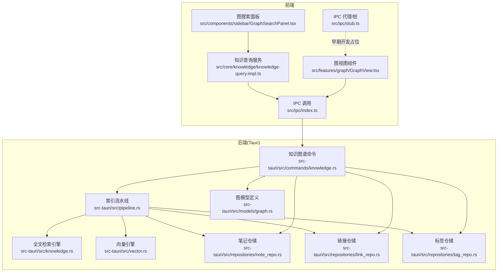
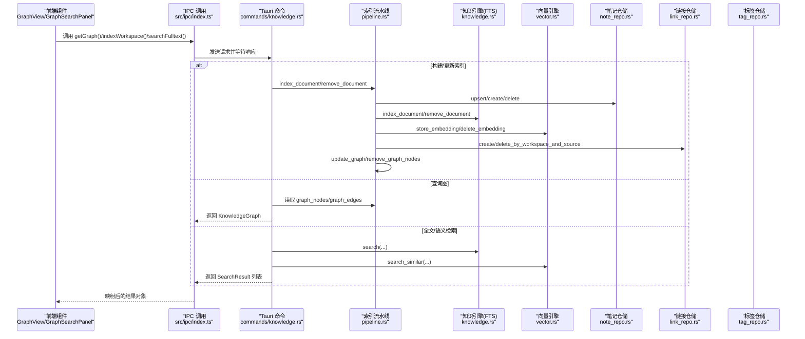
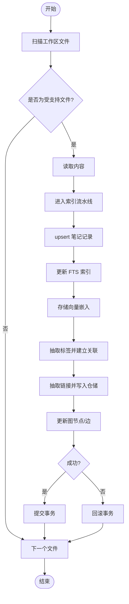
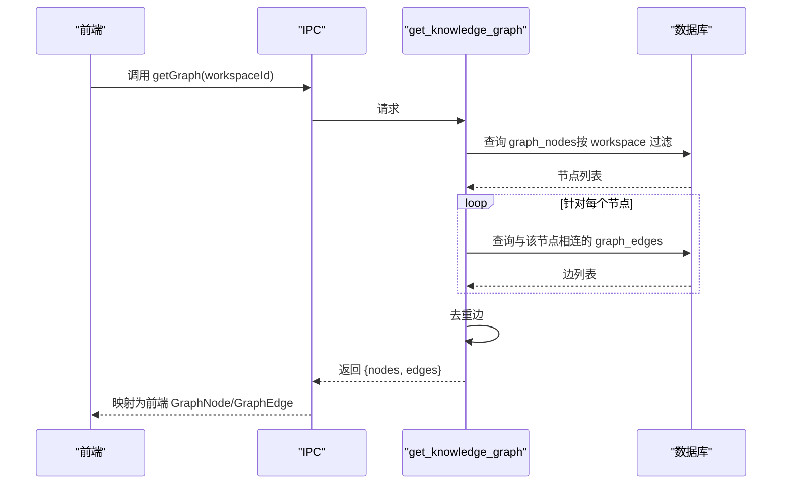
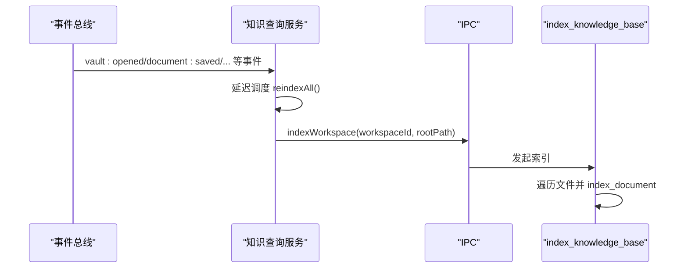
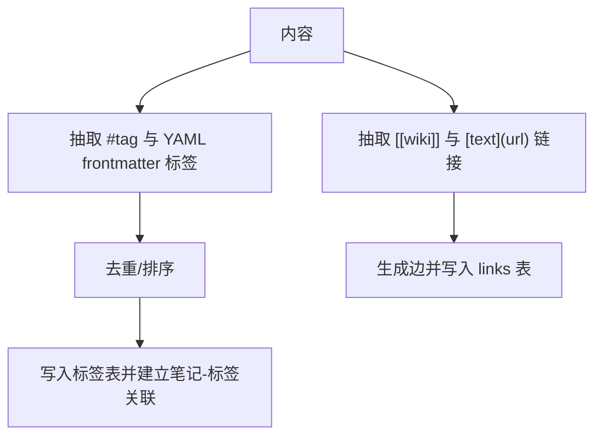
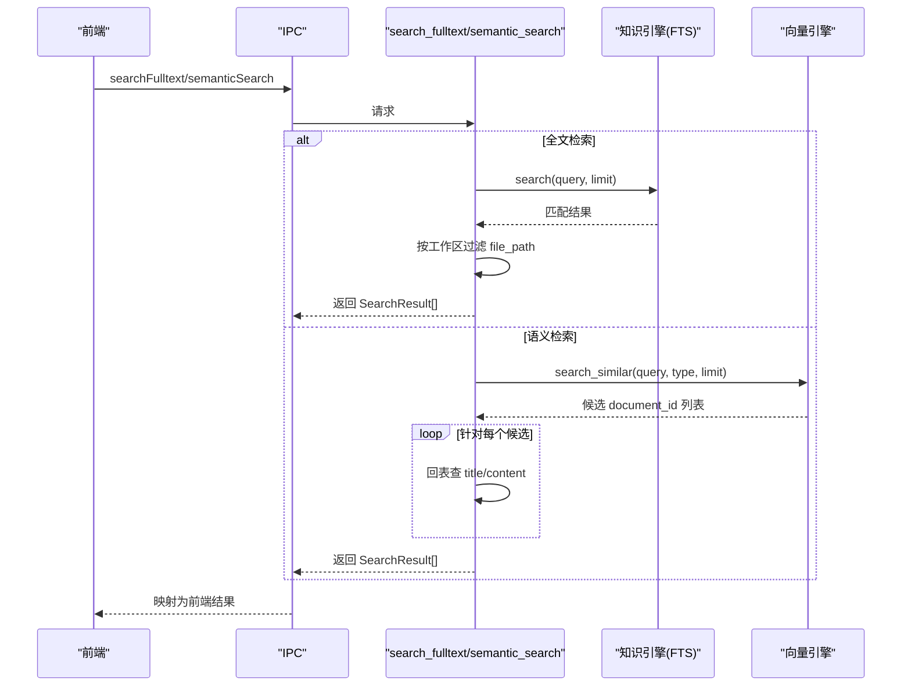
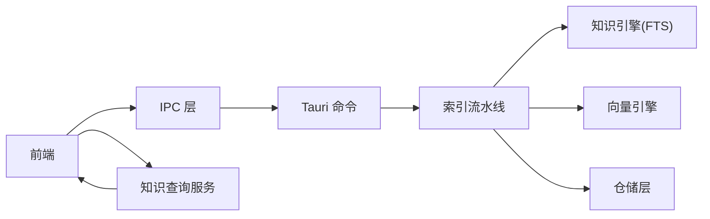

# 知识图谱命令

<cite>
**本文引用的文件**
- [src-tauri/src/commands/knowledge.rs](file://src-tauri/src/commands/knowledge.rs)
- [src-tauri/src/knowledge.rs](file://src-tauri/src/knowledge.rs)
- [src-tauri/src/pipeline.rs](file://src-tauri/src/pipeline.rs)
- [src-tauri/src/vector.rs](file://src-tauri/src/vector.rs)
- [src-tauri/src/models/graph.rs](file://src-tauri/src/models/graph.rs)
- [src-tauri/src/repositories/note_repo.rs](file://src-tauri/src/repositories/note_repo.rs)
- [src-tauri/src/repositories/link_repo.rs](file://src-tauri/src/repositories/link_repo.rs)
- [src-tauri/src/repositories/tag_repo.rs](file://src-tauri/src/repositories/tag_repo.rs)
- [src/core/knowledge/knowledge-query.impl.ts](file://src/core/knowledge/knowledge-query.impl.ts)
- [src/ipc/index.ts](file://src/ipc/index.ts)
- [src/ipc/stub.ts](file://src/ipc/stub.ts)
- [src/features/graph/GraphView.tsx](file://src/features/graph/GraphView.tsx)
- [src/components/sidebar/GraphSearchPanel.tsx](file://src/components/sidebar/GraphSearchPanel.tsx)
- [src/types.ts](file://src/types.ts)
</cite>

## 目录
1. [简介](#简介)
2. [项目结构](#项目结构)
3. [核心组件](#核心组件)
4. [架构总览](#架构总览)
5. [详细组件分析](#详细组件分析)
6. [依赖分析](#依赖分析)
7. [性能考虑](#性能考虑)
8. [故障排查指南](#故障排查指南)
9. [结论](#结论)
10. [附录：查询示例与调试技巧](#附录查询示例与调试技巧)

## 简介
本文件系统性梳理 NoteForge 的知识图谱命令体系，覆盖以下方面：
- 知识图谱构建命令：从文档解析、实体识别到关系抽取的完整流水线
- 图查询命令：节点查询、路径搜索与图遍历的实现思路
- 知识图谱更新命令：增量更新、冲突解决与一致性维护
- 性能优化：索引策略、缓存机制与查询优化
- 数据管理：数据清洗、去重与质量评估
- 查询示例与调试技巧

## 项目结构
围绕知识图谱功能的关键代码分布在前端 IPC 层、后端 Tauri 命令层、Rust 知识引擎与向量引擎、以及仓储层。

图表来源
- [src/ipc/index.ts:297-330](file://src/ipc/index.ts#L297-L330)
- [src/ipc/stub.ts:538-588](file://src/ipc/stub.ts#L538-L588)
- [src/core/knowledge/knowledge-query.impl.ts:1-178](file://src/core/knowledge/knowledge-query.impl.ts#L1-L178)
- [src/features/graph/GraphView.tsx:81-118](file://src/features/graph/GraphView.tsx#L81-L118)
- [src/components/sidebar/GraphSearchPanel.tsx:1-30](file://src/components/sidebar/GraphSearchPanel.tsx#L1-L30)
- [src-tauri/src/commands/knowledge.rs:1-305](file://src-tauri/src/commands/knowledge.rs#L1-L305)
- [src-tauri/src/pipeline.rs:1-290](file://src-tauri/src/pipeline.rs#L1-L290)
- [src-tauri/src/knowledge.rs:1-75](file://src-tauri/src/knowledge.rs#L1-L75)
- [src-tauri/src/vector.rs:1-151](file://src-tauri/src/vector.rs#L1-L151)
- [src-tauri/src/models/graph.rs:1-35](file://src-tauri/src/models/graph.rs#L1-L35)
- [src-tauri/src/repositories/note_repo.rs:1-170](file://src-tauri/src/repositories/note_repo.rs#L1-L170)
- [src-tauri/src/repositories/link_repo.rs:1-86](file://src-tauri/src/repositories/link_repo.rs#L1-L86)
- [src-tauri/src/repositories/tag_repo.rs:1-121](file://src-tauri/src/repositories/tag_repo.rs#L1-L121)

章节来源
- [src/ipc/index.ts:297-330](file://src/ipc/index.ts#L297-L330)
- [src-tauri/src/commands/knowledge.rs:1-305](file://src-tauri/src/commands/knowledge.rs#L1-L305)

## 核心组件
- 知识图谱命令层（Tauri）：提供索引、全文检索、语义检索、图查询、链接/标签提取、反链查询等命令。
- 索引流水线：原子化地执行“笔记入库、FTS 索引、向量嵌入、标签/链接抽取、图节点/边更新”。
- 知识引擎：基于 FTS5 的全文检索。
- 向量引擎：基于 fastembed 的文本嵌入与相似度检索。
- 仓储层：笔记、链接、标签的 CRUD 与聚合查询。
- 前端 IPC 与服务：统一调用后端命令，封装结果映射；知识查询服务负责调度索引与事件联动；图视图与搜索面板消费图数据。

章节来源
- [src-tauri/src/commands/knowledge.rs:1-305](file://src-tauri/src/commands/knowledge.rs#L1-L305)
- [src-tauri/src/pipeline.rs:1-290](file://src-tauri/src/pipeline.rs#L1-L290)
- [src-tauri/src/knowledge.rs:1-75](file://src-tauri/src/knowledge.rs#L1-L75)
- [src-tauri/src/vector.rs:1-151](file://src-tauri/src/vector.rs#L1-L151)
- [src-tauri/src/repositories/note_repo.rs:1-170](file://src-tauri/src/repositories/note_repo.rs#L1-L170)
- [src-tauri/src/repositories/link_repo.rs:1-86](file://src-tauri/src/repositories/link_repo.rs#L1-L86)
- [src-tauri/src/repositories/tag_repo.rs:1-121](file://src-tauri/src/repositories/tag_repo.rs#L1-L121)
- [src/core/knowledge/knowledge-query.impl.ts:1-178](file://src/core/knowledge/knowledge-query.impl.ts#L1-L178)
- [src/ipc/index.ts:297-330](file://src/ipc/index.ts#L297-L330)

## 架构总览
下图展示从前端到后端的调用链路与数据流。

图表来源
- [src/ipc/index.ts:297-330](file://src/ipc/index.ts#L297-L330)
- [src-tauri/src/commands/knowledge.rs:1-305](file://src-tauri/src/commands/knowledge.rs#L1-L305)
- [src-tauri/src/pipeline.rs:1-290](file://src-tauri/src/pipeline.rs#L1-L290)
- [src-tauri/src/knowledge.rs:1-75](file://src-tauri/src/knowledge.rs#L1-L75)
- [src-tauri/src/vector.rs:1-151](file://src-tauri/src/vector.rs#L1-L151)
- [src-tauri/src/repositories/note_repo.rs:1-170](file://src-tauri/src/repositories/note_repo.rs#L1-L170)
- [src-tauri/src/repositories/link_repo.rs:1-86](file://src-tauri/src/repositories/link_repo.rs#L1-L86)
- [src-tauri/src/repositories/tag_repo.rs:1-121](file://src-tauri/src/repositories/tag_repo.rs#L1-L121)

## 详细组件分析

### 组件一：知识图谱构建命令（索引与图更新）
- 功能要点
  - 扫描工作区目录，过滤支持的扩展名，逐文件执行索引流水线
  - 流水线原子化：事务包裹，依次完成笔记记录、FTS 索引、向量嵌入、标签/链接抽取、图节点/边更新
  - 删除文档时同步清理图节点与边，保证一致性
- 关键流程
  - index_knowledge_base：遍历文件 → index_document
  - index_document：upsert 笔记 → 更新 FTS → 存储向量 → 抽取标签/链接 → 更新图
  - remove_document：删除笔记 → 删除 FTS → 删除向量 → 删除链接 → 删除图节点

图表来源
- [src-tauri/src/commands/knowledge.rs:15-68](file://src-tauri/src/commands/knowledge.rs#L15-L68)
- [src-tauri/src/pipeline.rs:18-90](file://src-tauri/src/pipeline.rs#L18-L90)

章节来源
- [src-tauri/src/commands/knowledge.rs:15-68](file://src-tauri/src/commands/knowledge.rs#L15-L68)
- [src-tauri/src/pipeline.rs:18-90](file://src-tauri/src/pipeline.rs#L18-L90)

### 组件二：图查询命令（节点、边、路径与遍历）
- 节点查询：按工作区过滤，仅返回在图中存在边连接的节点
- 边查询：按节点集合收集其邻接边，去重后合并
- 路径搜索与图遍历：当前后端未直接提供路径/遍历命令，前端通过已加载的图进行本地计算（如过滤、可视化布局）

图表来源
- [src-tauri/src/commands/knowledge.rs:95-163](file://src-tauri/src/commands/knowledge.rs#L95-L163)
- [src-tauri/src/models/graph.rs:1-35](file://src-tauri/src/models/graph.rs#L1-L35)
- [src/types.ts:161-204](file://src/types.ts#L161-L204)

章节来源
- [src-tauri/src/commands/knowledge.rs:95-163](file://src-tauri/src/commands/knowledge.rs#L95-L163)
- [src-tauri/src/models/graph.rs:1-35](file://src-tauri/src/models/graph.rs#L1-L35)
- [src/types.ts:161-204](file://src/types.ts#L161-L204)

### 组件三：知识图谱更新命令（增量、冲突与一致性）
- 增量更新
  - 文档保存/变更事件触发知识服务的 reindexAll，内部调用 indexWorkspace
  - 索引流水线使用 upsert 与事务，确保幂等与原子性
- 冲突解决
  - 文档服务检测外部修改并发出冲突事件，前端弹窗提示
  - 知识服务监听事件，延迟触发重索引，避免频繁 IO
- 一致性维护
  - 删除文档时同步移除 FTS、向量、链接与图节点/边
  - 图节点属性包含 workspace_id，查询时按属性过滤，避免跨工作区污染

图表来源
- [src/core/knowledge/knowledge-query.impl.ts:150-175](file://src/core/knowledge/knowledge-query.impl.ts#L150-L175)
- [src/core/knowledge/knowledge-query.impl.ts:136-144](file://src/core/knowledge/knowledge-query.impl.ts#L136-L144)
- [src-tauri/src/commands/knowledge.rs:15-68](file://src-tauri/src/commands/knowledge.rs#L15-L68)

章节来源
- [src/core/knowledge/knowledge-query.impl.ts:150-175](file://src/core/knowledge/knowledge-query.impl.ts#L150-L175)
- [src/core/knowledge/knowledge-query.impl.ts:136-144](file://src/core/knowledge/knowledge-query.impl.ts#L136-L144)
- [src-tauri/src/commands/knowledge.rs:15-68](file://src-tauri/src/commands/knowledge.rs#L15-L68)

### 组件四：实体识别与关系抽取
- 实体识别
  - 标题与内容来自笔记记录；语言检测用于后续处理
- 关系抽取
  - wiki 链接与 Markdown 链接均被抽取为“引用”类型边
  - 链接上下文作为边属性保留，便于溯源
- 标签抽取
  - 支持行内 #tag 与 YAML frontmatter 中的 tags 列表
  - 去重并统计各标签出现次数

图表来源
- [src-tauri/src/pipeline.rs:193-267](file://src-tauri/src/pipeline.rs#L193-L267)
- [src-tauri/src/pipeline.rs:229-267](file://src-tauri/src/pipeline.rs#L229-L267)
- [src-tauri/src/repositories/tag_repo.rs:1-121](file://src-tauri/src/repositories/tag_repo.rs#L1-L121)
- [src-tauri/src/repositories/link_repo.rs:1-86](file://src-tauri/src/repositories/link_repo.rs#L1-L86)

章节来源
- [src-tauri/src/pipeline.rs:193-267](file://src-tauri/src/pipeline.rs#L193-L267)
- [src-tauri/src/repositories/tag_repo.rs:1-121](file://src-tauri/src/repositories/tag_repo.rs#L1-L121)
- [src-tauri/src/repositories/link_repo.rs:1-86](file://src-tauri/src/repositories/link_repo.rs#L1-L86)

### 组件五：全文检索与语义检索
- 全文检索
  - 使用 FTS5 虚拟表，匹配 query 并限制数量
  - 结果按工作区过滤，确保只返回当前工作区内的笔记
- 语义检索
  - 基于向量相似度，先检索候选集，再回表获取标题与内容

图表来源
- [src-tauri/src/commands/knowledge.rs:71-92](file://src-tauri/src/commands/knowledge.rs#L71-L92)
- [src-tauri/src/commands/knowledge.rs:233-269](file://src-tauri/src/commands/knowledge.rs#L233-L269)
- [src-tauri/src/knowledge.rs:25-46](file://src-tauri/src/knowledge.rs#L25-L46)
- [src-tauri/src/vector.rs:57-118](file://src-tauri/src/vector.rs#L57-L118)

章节来源
- [src-tauri/src/commands/knowledge.rs:71-92](file://src-tauri/src/commands/knowledge.rs#L71-L92)
- [src-tauri/src/commands/knowledge.rs:233-269](file://src-tauri/src/commands/knowledge.rs#L233-L269)
- [src-tauri/src/knowledge.rs:25-46](file://src-tauri/src/knowledge.rs#L25-L46)
- [src-tauri/src/vector.rs:57-118](file://src-tauri/src/vector.rs#L57-L118)

### 组件六：前端集成与可视化
- 知识查询服务
  - 提供 getBacklinks、resolveWikiLink、searchTitles 等能力，并在文档保存/仓库打开等事件后自动重索引
- 图视图与搜索面板
  - 图视图根据后端返回的 nodes/edges 渲染；搜索面板展示标签云并支持过滤
- IPC 与类型映射
  - 前端定义 SearchResult/GraphNode/GraphEdge/KnowledgeGraph 类型并与后端保持一致

章节来源
- [src/core/knowledge/knowledge-query.impl.ts:48-144](file://src/core/knowledge/knowledge-query.impl.ts#L48-L144)
- [src/features/graph/GraphView.tsx:81-118](file://src/features/graph/GraphView.tsx#L81-L118)
- [src/components/sidebar/GraphSearchPanel.tsx:1-30](file://src/components/sidebar/GraphSearchPanel.tsx#L1-L30)
- [src/types.ts:139-204](file://src/types.ts#L139-L204)
- [src/ipc/index.ts:297-330](file://src/ipc/index.ts#L297-L330)
- [src/ipc/stub.ts:538-588](file://src/ipc/stub.ts#L538-L588)

## 依赖分析
- 前端依赖
  - IPC 层依赖 Tauri 命令注册与 stub 占位实现
  - 知识查询服务依赖事件总线、文档服务与仓库服务
- 后端依赖
  - 命令层依赖数据库状态、知识引擎、向量引擎与仓储
  - 索引流水线串联多个模块，耦合度高但职责清晰
- 外部依赖
  - FTS5、fastembed、rusqlite

图表来源
- [src/ipc/index.ts:297-330](file://src/ipc/index.ts#L297-L330)
- [src/core/knowledge/knowledge-query.impl.ts:1-178](file://src/core/knowledge/knowledge-query.impl.ts#L1-L178)
- [src-tauri/src/commands/knowledge.rs:1-305](file://src-tauri/src/commands/knowledge.rs#L1-L305)
- [src-tauri/src/pipeline.rs:1-290](file://src-tauri/src/pipeline.rs#L1-L290)

章节来源
- [src/ipc/index.ts:297-330](file://src/ipc/index.ts#L297-L330)
- [src/core/knowledge/knowledge-query.impl.ts:1-178](file://src/core/knowledge/knowledge-query.impl.ts#L1-L178)
- [src-tauri/src/commands/knowledge.rs:1-305](file://src-tauri/src/commands/knowledge.rs#L1-L305)
- [src-tauri/src/pipeline.rs:1-290](file://src-tauri/src/pipeline.rs#L1-L290)

## 性能考虑
- 索引策略
  - FTS5 虚拟表提供高效全文匹配；建议在大规模工作区中限制并发扫描与批量提交
- 缓存机制
  - 向量引擎采用 JSON 存储嵌入，内存中计算相似度；可考虑懒加载模型与分页检索
- 查询优化
  - 图查询先筛选有边连接的节点，再按节点集合查询邻接边并去重
  - 全文检索先匹配再按工作区过滤，减少回表成本
- 建议
  - 对大工作区启用增量索引（仅处理变更文件）
  - 对向量检索引入索引或近似最近邻库（当前为内存全表扫描）

[本节为通用性能讨论，不直接分析具体文件]

## 故障排查指南
- 索引失败
  - 检查 index_knowledge_base 的文件过滤与读取逻辑
  - 确认 index_document 的事务是否正确提交/回滚
- 图数据异常
  - 核查 update_graph/remove_graph_nodes 是否按预期执行
  - 确保节点属性包含 workspace_id，查询时按属性过滤
- 搜索无结果
  - 全文检索需确认 FTS 已索引且工作区过滤生效
  - 语义检索需确认向量表存在对应文档嵌入
- 冲突与一致性
  - 文档外部修改会触发冲突对话框，必要时选择“从磁盘重新加载”
  - 重索引由事件驱动，检查事件订阅与调度延迟

章节来源
- [src-tauri/src/commands/knowledge.rs:15-68](file://src-tauri/src/commands/knowledge.rs#L15-L68)
- [src-tauri/src/pipeline.rs:136-190](file://src-tauri/src/pipeline.rs#L136-L190)
- [src-tauri/src/knowledge.rs:25-46](file://src-tauri/src/knowledge.rs#L25-L46)
- [src-tauri/src/vector.rs:57-118](file://src-tauri/src/vector.rs#L57-L118)
- [src/core/document/document-service.impl.ts:369-407](file://src/core/document/document-service.impl.ts#L369-L407)

## 结论
NoteForge 的知识图谱命令以“索引流水线 + 多引擎协同”的方式实现了从文档到图谱的自动化构建与查询。前端通过 IPC 与知识查询服务无缝接入后端命令，既满足了快速迭代的开发需求，也为后续引入更复杂的图算法与高性能向量检索打下基础。

[本节为总结性内容，不直接分析具体文件]

## 附录：查询示例与调试技巧
- 查询示例
  - 获取工作区图谱：调用 getGraph(workspaceId)，返回 nodes 与 edges
  - 全文检索：调用 searchFulltext(workspaceId, query, limit)
  - 语义检索：调用 semanticSearch(workspaceId, query, limit)
  - 重索引：调用 reindexAll（由知识查询服务在事件触发后自动执行）
- 调试技巧
  - 在 getKnowledgeGraph 中打印节点/边数量，验证过滤与去重逻辑
  - 在 index_document 中观察事务提交/回滚日志，定位单文件失败原因
  - 使用前端 GraphView 的过滤输入快速缩小问题范围
  - 对向量检索，先检查是否存在嵌入，再核对相似度阈值与 limit

章节来源
- [src/ipc/index.ts:297-330](file://src/ipc/index.ts#L297-L330)
- [src/features/graph/GraphView.tsx:81-118](file://src/features/graph/GraphView.tsx#L81-L118)
- [src-tauri/src/commands/knowledge.rs:95-163](file://src-tauri/src/commands/knowledge.rs#L95-L163)
- [src-tauri/src/commands/knowledge.rs:233-269](file://src-tauri/src/commands/knowledge.rs#L233-L269)