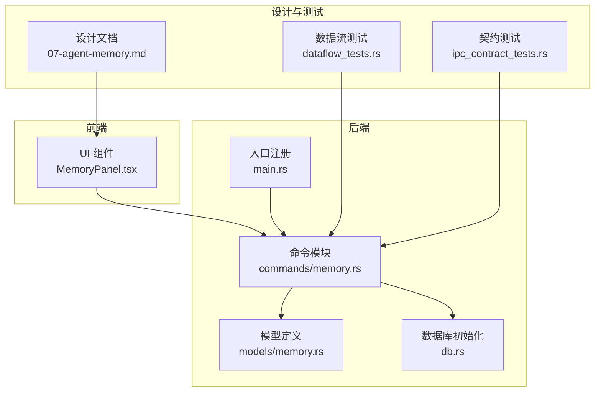
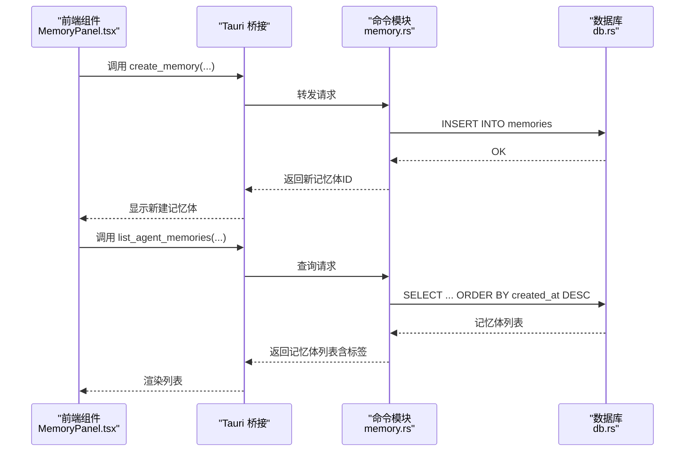
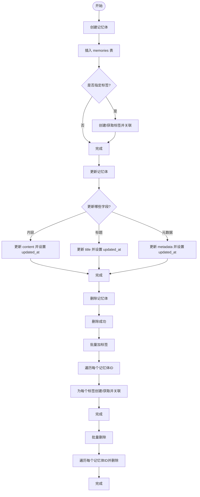
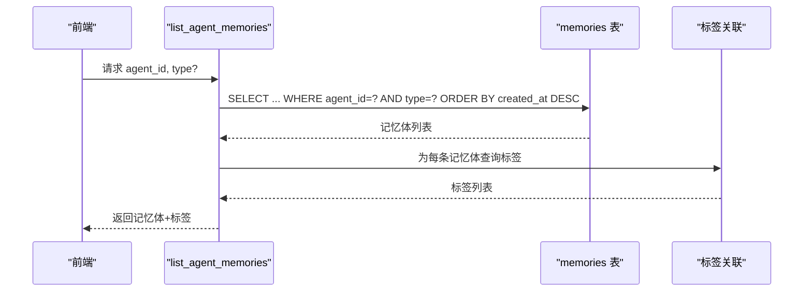
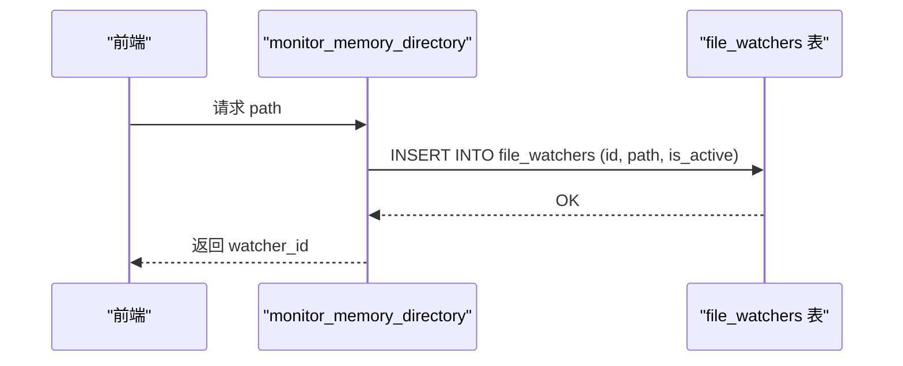
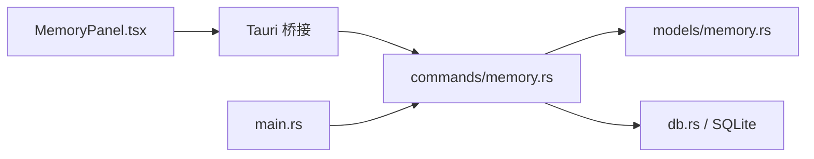

# 记忆体命令

<cite>
**本文引用的文件**
- [src-tauri/src/commands/memory.rs](file://src-tauri/src/commands/memory.rs)
- [src-tauri/src/models/memory.rs](file://src-tauri/src/models/memory.rs)
- [docs/design/07-agent-memory.md](file://docs/design/07-agent-memory.md)
- [src-tauri/src/main.rs](file://src-tauri/src/main.rs)
- [src-tauri/src/db.rs](file://src-tauri/src/db.rs)
- [.tmp/system-architecture-design.md](file://.tmp/system-architecture-design.md)
- [src/components/sidebar/MemoryPanel.tsx](file://src/components/sidebar/MemoryPanel.tsx)
- [src-tauri/tests/dataflow_tests.rs](file://src-tauri/tests/dataflow_tests.rs)
- [src-tauri/tests/ipc_contract_tests.rs](file://src-tauri/tests/ipc_contract_tests.rs)
</cite>

## 目录
1. [简介](#简介)
2. [项目结构](#项目结构)
3. [核心组件](#核心组件)
4. [架构总览](#架构总览)
5. [详细组件分析](#详细组件分析)
6. [依赖关系分析](#依赖关系分析)
7. [性能考量](#性能考量)
8. [故障排查指南](#故障排查指南)
9. [结论](#结论)
10. [附录](#附录)

## 简介
本文件聚焦于NoteForge的记忆体命令体系，围绕以下目标展开：
- 记忆体管理命令：创建、更新、删除与批量操作
- 记忆体数据存储命令：自动保存、数据同步与版本管理机制
- 记忆体生命周期命令：激活、休眠与销毁流程
- 数据一致性保障：事务、回滚与并发控制
- 最佳实践：数据组织、性能优化与内存管理策略
- 使用示例与常见问题解决方案

## 项目结构
记忆体命令由后端Rust模块提供，通过Tauri桥接到前端；同时配套数据库Schema与测试用例，确保行为一致与可验证。

图表来源
- [src-tauri/src/commands/memory.rs:1-337](file://src-tauri/src/commands/memory.rs#L1-L337)
- [src-tauri/src/models/memory.rs:1-107](file://src-tauri/src/models/memory.rs#L1-L107)
- [src-tauri/src/db.rs:46-75](file://src-tauri/src/db.rs#L46-L75)
- [src-tauri/src/main.rs:46-54](file://src-tauri/src/main.rs#L46-L54)
- [docs/design/07-agent-memory.md:1-237](file://docs/design/07-agent-memory.md#L1-L237)
- [src-tauri/tests/dataflow_tests.rs:128-160](file://src-tauri/tests/dataflow_tests.rs#L128-L160)
- [src-tauri/tests/ipc_contract_tests.rs:123-160](file://src-tauri/tests/ipc_contract_tests.rs#L123-L160)

章节来源
- [src-tauri/src/commands/memory.rs:1-337](file://src-tauri/src/commands/memory.rs#L1-L337)
- [src-tauri/src/models/memory.rs:1-107](file://src-tauri/src/models/memory.rs#L1-L107)
- [src-tauri/src/db.rs:46-75](file://src-tauri/src/db.rs#L46-L75)
- [src-tauri/src/main.rs:46-54](file://src-tauri/src/main.rs#L46-L54)
- [docs/design/07-agent-memory.md:1-237](file://docs/design/07-agent-memory.md#L1-L237)

## 核心组件
- 命令模块：提供记忆体的创建、更新、删除、查询、标签关联、批量操作与导入等能力
- 模型定义：统一请求/响应结构，便于前后端契约一致
- 数据库Schema：定义记忆体表、索引与标签关联表
- 前端组件：记忆体面板、批量操作交互
- 测试：数据流与契约测试，覆盖典型场景

章节来源
- [src-tauri/src/commands/memory.rs:12-337](file://src-tauri/src/commands/memory.rs#L12-L337)
- [src-tauri/src/models/memory.rs:20-107](file://src-tauri/src/models/memory.rs#L20-L107)
- [src-tauri/src/db.rs:46-75](file://src-tauri/src/db.rs#L46-L75)
- [src/components/sidebar/MemoryPanel.tsx:106-143](file://src/components/sidebar/MemoryPanel.tsx#L106-L143)
- [src-tauri/tests/dataflow_tests.rs:128-160](file://src-tauri/tests/dataflow_tests.rs#L128-L160)
- [src-tauri/tests/ipc_contract_tests.rs:123-160](file://src-tauri/tests/ipc_contract_tests.rs#L123-L160)

## 架构总览
记忆体命令通过Tauri命令暴露，后端以SQLite作为持久化存储，配合索引与外键约束保障查询与一致性；前端通过组件触发命令并展示结果。

图表来源
- [src-tauri/src/commands/memory.rs:29-92](file://src-tauri/src/commands/memory.rs#L29-L92)
- [src-tauri/src/db.rs:46-75](file://src-tauri/src/db.rs#L46-L75)
- [src/components/sidebar/MemoryPanel.tsx:106-143](file://src/components/sidebar/MemoryPanel.tsx#L106-L143)

## 详细组件分析

### 记忆体管理命令
- 创建记忆体
  - 输入：工作区ID、Agent ID、内容、标题、类型、标签、元数据
  - 处理：生成唯一ID，写入memories表，按需创建/链接标签
  - 输出：返回新ID
- 更新记忆体
  - 输入：记忆体ID，以及可选的内容/标题/元数据
  - 处理：按字段条件更新，并刷新updated_at
  - 输出：无错误即成功
- 删除记忆体
  - 输入：记忆体ID
  - 处理：删除对应记录
  - 输出：无错误即成功
- 批量标签与批量删除
  - 输入：记忆体ID集合与标签集合（批量标签），或记忆体ID集合（批量删除）
  - 处理：逐条执行标签创建/关联或删除
  - 输出：无错误即成功

图表来源
- [src-tauri/src/commands/memory.rs:215-250](file://src-tauri/src/commands/memory.rs#L215-L250)
- [src-tauri/src/commands/memory.rs:183-213](file://src-tauri/src/commands/memory.rs#L183-L213)
- [src-tauri/src/commands/memory.rs:252-263](file://src-tauri/src/commands/memory.rs#L252-L263)
- [src-tauri/src/commands/memory.rs:265-296](file://src-tauri/src/commands/memory.rs#L265-L296)

章节来源
- [src-tauri/src/commands/memory.rs:215-263](file://src-tauri/src/commands/memory.rs#L215-L263)
- [src-tauri/src/commands/memory.rs:265-296](file://src-tauri/src/commands/memory.rs#L265-L296)

### 记忆体数据存储命令
- 列举Agent记忆体
  - 支持按类型过滤与全局查询，按创建时间倒序
  - 结果附加标签信息
- 获取记忆体时间线
  - 支持起止日期过滤，按创建时间倒序
  - 结果附加标签信息
- Agent清单
  - 按Agent聚合统计记忆体数量

图表来源
- [src-tauri/src/commands/memory.rs:29-92](file://src-tauri/src/commands/memory.rs#L29-L92)
- [src-tauri/src/commands/memory.rs:115-181](file://src-tauri/src/commands/memory.rs#L115-L181)

章节来源
- [src-tauri/src/commands/memory.rs:29-92](file://src-tauri/src/commands/memory.rs#L29-L92)
- [src-tauri/src/commands/memory.rs:115-181](file://src-tauri/src/commands/memory.rs#L115-L181)

### 记忆体生命周期命令
- 目录监控
  - 注册文件监视器，用于导入外部导出的记忆体数据
- Agent清单
  - 展示各Agent的记忆体数量，支持筛选“全部”与具体Agent

图表来源
- [src-tauri/src/commands/memory.rs:12-26](file://src-tauri/src/commands/memory.rs#L12-L26)
- [src-tauri/src/commands/memory.rs:94-113](file://src-tauri/src/commands/memory.rs#L94-L113)

章节来源
- [src-tauri/src/commands/memory.rs:12-26](file://src-tauri/src/commands/memory.rs#L12-L26)
- [src-tauri/src/commands/memory.rs:94-113](file://src-tauri/src/commands/memory.rs#L94-L113)

### 数据一致性与并发控制
- 事务与回滚
  - 当前命令以单条SQL执行为主，未显式包裹事务块
  - 批量标签与批量删除在循环内逐条执行，失败不影响其他项
- 并发控制
  - 数据库连接采用互斥锁保护，避免并发写入竞争
  - 建议：对高频批量操作，可在上层合并请求或引入队列，减少锁竞争
- 版本管理
  - 记忆体表包含created_at/updated_at，可用于时间线与审计
  - 设计文档提出“本地历史/时间线”的回退思路，可作为跨重启一致性补充

章节来源
- [src-tauri/src/commands/memory.rs:183-213](file://src-tauri/src/commands/memory.rs#L183-L213)
- [src-tauri/src/commands/memory.rs:265-296](file://src-tauri/src/commands/memory.rs#L265-L296)
- [src-tauri/src/db.rs:46-75](file://src-tauri/src/db.rs#L46-L75)
- [docs/design/07-agent-memory.md:453-491](file://docs/design/07-agent-memory.md#L453-L491)

### 使用示例与最佳实践
- 创建记忆体
  - 前端通过命令调用创建，建议在UI中提供Agent选择、类型选择与标签输入
  - 示例路径：[创建记忆体命令:215-250](file://src-tauri/src/commands/memory.rs#L215-L250)
- 更新记忆体
  - 支持增量更新内容/标题/元数据，注意updated_at会自动刷新
  - 示例路径：[更新记忆体命令:183-213](file://src-tauri/src/commands/memory.rs#L183-L213)
- 批量操作
  - 前端勾选多项后，调用批量加标签与批量删除
  - 示例路径：[批量标签:265-281](file://src-tauri/src/commands/memory.rs#L265-L281)，[批量删除:283-296](file://src-tauri/src/commands/memory.rs#L283-L296)
- 导入记忆体
  - 支持JSON格式导入，逐条写入并返回导入统计与错误列表
  - 示例路径：[导入命令:298-336](file://src-tauri/src/commands/memory.rs#L298-L336)
- 最佳实践
  - 数据组织：按Agent与类型分类，合理使用标签；利用时间线与筛选提升检索效率
  - 性能优化：避免一次性大批量写入；必要时合并请求；利用现有索引（agent_id/type/importance）
  - 内存管理：前端仅渲染可见区域，避免全量加载；后台批处理任务异步执行

章节来源
- [src-tauri/src/commands/memory.rs:215-250](file://src-tauri/src/commands/memory.rs#L215-L250)
- [src-tauri/src/commands/memory.rs:183-213](file://src-tauri/src/commands/memory.rs#L183-L213)
- [src-tauri/src/commands/memory.rs:265-296](file://src-tauri/src/commands/memory.rs#L265-L296)
- [src-tauri/src/commands/memory.rs:298-336](file://src-tauri/src/commands/memory.rs#L298-L336)
- [src/components/sidebar/MemoryPanel.tsx:106-143](file://src/components/sidebar/MemoryPanel.tsx#L106-L143)

## 依赖关系分析
- 命令到模型：命令模块依赖模型定义进行请求/响应序列化
- 命令到数据库：命令模块通过数据库句柄执行SQL，依赖索引与外键
- 前端到命令：前端组件通过Tauri桥接调用命令
- 入口注册：主程序将记忆体命令注册为可用

图表来源
- [src-tauri/src/commands/memory.rs:1-10](file://src-tauri/src/commands/memory.rs#L1-L10)
- [src-tauri/src/main.rs:46-54](file://src-tauri/src/main.rs#L46-L54)
- [src-tauri/src/db.rs:46-75](file://src-tauri/src/db.rs#L46-L75)
- [src/components/sidebar/MemoryPanel.tsx:106-143](file://src/components/sidebar/MemoryPanel.tsx#L106-L143)

章节来源
- [src-tauri/src/commands/memory.rs:1-10](file://src-tauri/src/commands/memory.rs#L1-L10)
- [src-tauri/src/main.rs:46-54](file://src-tauri/src/main.rs#L46-L54)
- [src-tauri/src/db.rs:46-75](file://src-tauri/src/db.rs#L46-L75)
- [src/components/sidebar/MemoryPanel.tsx:106-143](file://src/components/sidebar/MemoryPanel.tsx#L106-L143)

## 性能考量
- 查询性能
  - 索引：memories表针对agent_id、type、importance建立索引，有利于筛选与排序
  - 建议：在高频过滤字段上保持索引，避免全表扫描
- 写入性能
  - 批量操作：建议前端合并多次请求，减少往返与锁竞争
  - 异步处理：导入等重任务在后台执行，避免阻塞UI
- 存储与版本
  - 记忆体具备created_at/updated_at，适合时间线展示与审计
  - 设计文档建议“本地历史/时间线”，可作为跨重启一致性与回退的补充

章节来源
- [.tmp/system-architecture-design.md:498-517](file://.tmp/system-architecture-design.md#L498-L517)
- [src-tauri/src/db.rs:46-75](file://src-tauri/src/db.rs#L46-L75)
- [docs/design/07-agent-memory.md:453-491](file://docs/design/07-agent-memory.md#L453-L491)

## 故障排查指南
- 常见错误
  - 记忆体不存在：删除/更新时若ID无效，返回错误
  - JSON解析失败：导入JSON格式错误导致解析异常
  - 不支持的格式：导入时格式不被识别
- 定位方法
  - 查看命令返回的错误列表（导入时返回errors数组）
  - 检查数据库连接与锁状态
  - 核对请求参数与模型定义
- 建议
  - 前端在调用前进行参数校验
  - 对批量操作增加确认与进度反馈
  - 对导入任务增加重试与失败汇总

章节来源
- [src-tauri/src/commands/memory.rs:252-263](file://src-tauri/src/commands/memory.rs#L252-L263)
- [src-tauri/src/commands/memory.rs:298-336](file://src-tauri/src/commands/memory.rs#L298-L336)

## 结论
记忆体命令提供了完整的生命周期管理与数据存储能力，结合数据库索引与前端交互，能够满足日常的记忆体组织与检索需求。建议在生产环境中进一步完善事务封装、批量写入优化与跨重启一致性方案，以提升稳定性与用户体验。

## 附录
- 数据模型概览（来自设计文档）
  - 记忆体表：包含ID、Agent ID、工作区ID、内容、类型、重要度、访问时间与计数、创建/更新时间、元数据
  - 标签表与关联表：支持记忆体与标签的多对多关联
  - 图节点/边与向量存储：为知识图谱与向量化检索提供扩展基础

章节来源
- [.tmp/system-architecture-design.md:498-614](file://.tmp/system-architecture-design.md#L498-L614)