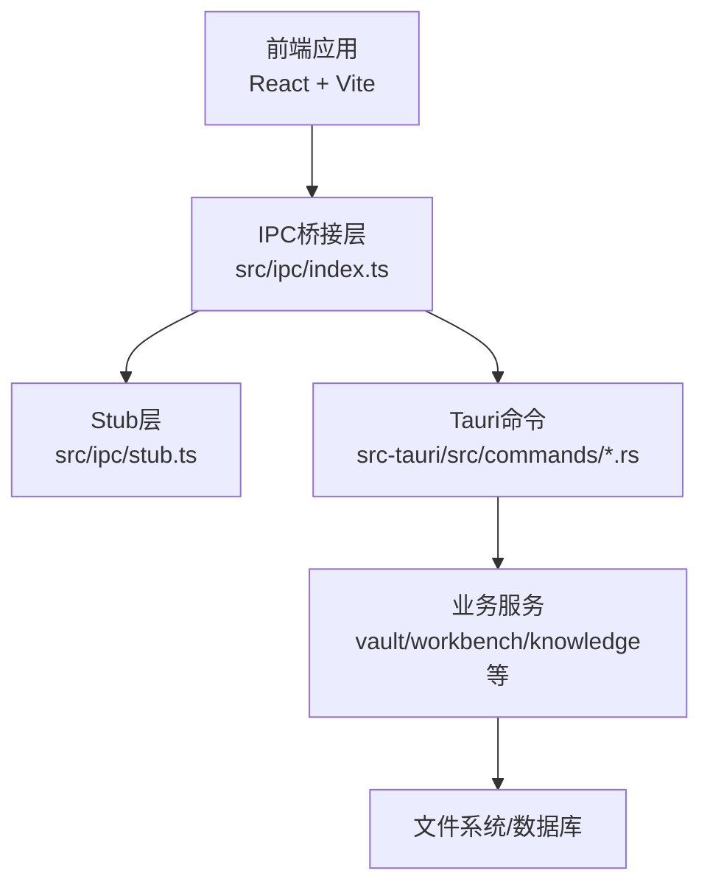
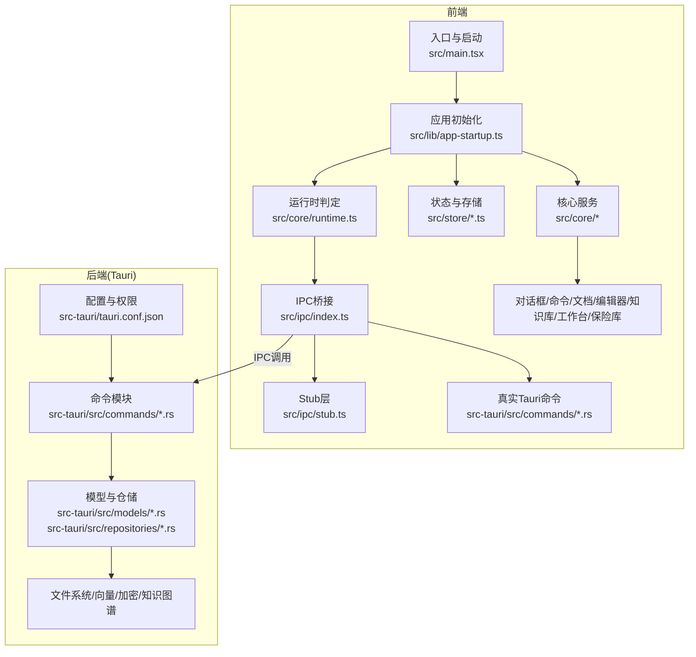
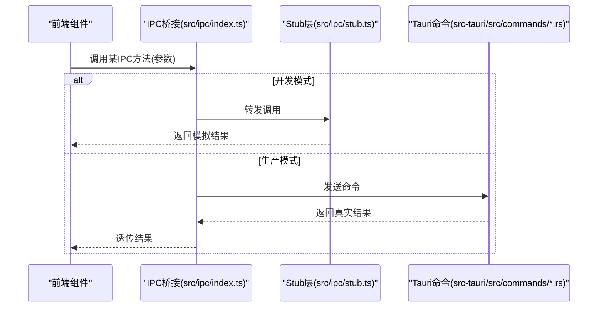
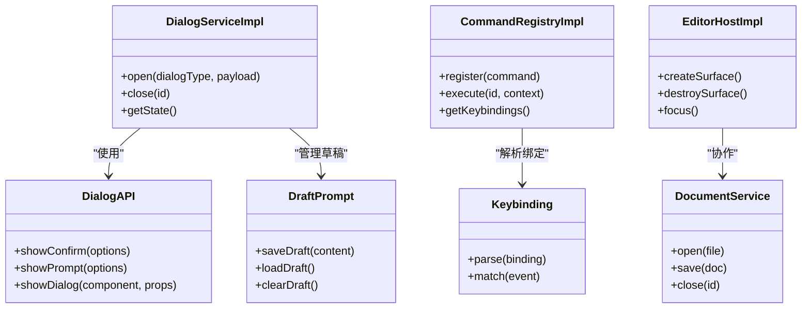
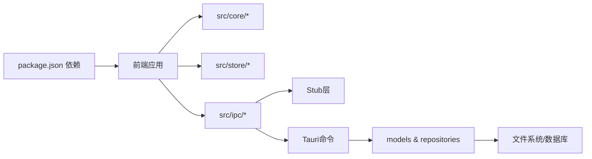

# 开发环境配置

<cite>
**本文档引用的文件**
- [package.json](file://package.json)
- [vite.config.ts](file://vite.config.ts)
- [src/ipc/index.ts](file://src/ipc/index.ts)
- [src/ipc/stub.ts](file://src/ipc/stub.ts)
- [src-tauri/tauri.conf.json](file://src-tauri/tauri.conf.json)
- [src-tauri/Cargo.toml](file://src-tauri/Cargo.toml)
- [src/main.tsx](file://src/main.tsx)
- [src/lib/app-startup.ts](file://src/lib/app-startup.ts)
- [src/core/runtime.ts](file://src/core/runtime.ts)
- [src/core/platform/config.ts](file://src/core/platform/config.ts)
- [src/core/platform/event-bus.ts](file://src/core/platform/event-bus.ts)
- [src/store/startup.ts](file://src/store/startup.ts)
- [src/core/dialog/dialog-service.impl.ts](file://src/core/dialog/dialog-service.impl.ts)
- [src/core/dialog/dialog-api.ts](file://src/core/dialog/dialog-api.ts)
- [src/core/dialog/types.ts](file://src/core/dialog/types.ts)
- [src/core/dialog/draft-prompt.ts](file://src/core/dialog/draft-prompt.ts)
- [src/core/command/command-registry.impl.ts](file://src/core/command/command-registry.impl.ts)
- [src/core/command/context.ts](file://src/core/command/context.ts)
- [src/core/command/keybinding.ts](file://src/core/command/keybinding.ts)
- [src/core/command/types.ts](file://src/core/command/types.ts)
- [src/core/document/document-service.impl.ts](file://src/core/document/document-service.impl.ts)
- [src/core/document/service.ts](file://src/core/document/service.ts)
- [src/core/document/types.ts](file://src/core/document/types.ts)
- [src/core/editor/editor-host.impl.ts](file://src/core/editor/editor-host.impl.ts)
- [src/core/editor/types.ts](file://src/core/editor/types.ts)
- [src/core/knowledge/knowledge-query.impl.ts](file://src/core/knowledge/knowledge-query.impl.ts)
- [src/core/knowledge/types.ts](file://src/core/knowledge/types.ts)
- [src/core/note/daily-note.ts](file://src/core/note/daily-note.ts)
- [src/core/session/scratch-autosave.ts](file://src/core/session/scratch-autosave.ts)
- [src/core/session/tab-lifecycle.ts](file://src/core/session/tab-lifecycle.ts)
- [src/core/session/workspace-draft-autosave.ts](file://src/core/session/workspace-draft-autosave.ts)
- [src/core/vault/service.ts](file://src/core/vault/service.ts)
- [src/core/vault/types.ts](file://src/core/vault/types.ts)
- [src/core/vault/vault-service.impl.ts](file://src/core/vault/vault-service.impl.ts)
- [src/core/workbench/service.ts](file://src/core/workbench/service.ts)
- [src/core/workbench/types.ts](file://src/core/workbench/types.ts)
- [src/core/workbench/workbench-service.impl.ts](file://src/core/workbench/workbench-service.impl.ts)
- [src/core/events.ts](file://src/core/events.ts)
- [src/core/invariants.ts](file://src/core/invariants.ts)
- [src/hooks/useDocumentContent.ts](file://src/hooks/useDocumentContent.ts)
- [src/hooks/useFileDrop.ts](file://src/hooks/useFileDrop.ts)
- [src/hooks/useShortcuts.ts](file://src/hooks/useShortcuts.ts)
- [src/hooks/useTabStripScroll.ts](file://src/hooks/useTabStripScroll.ts)
- [src/lib/utils.ts](file://src/lib/utils.ts)
- [src/lib/theme-cache.ts](file://src/lib/theme-cache.ts)
- [src/lib/sanitize-html.ts](file://src/lib/sanitize-html.ts)
- [src/lib/wiki-resolve.ts](file://src/lib/wiki-resolve.ts)
- [src/lib/yaml-location.ts](file://src/lib/yaml-location.ts)
- [src/lib/json-location.ts](file://src/lib/json-location.ts)
- [src/lib/front-matter.ts](file://src/lib/front-matter.ts)
- [src/lib/markdown-front-matter.ts](file://src/lib/markdown-front-matter.ts)
- [src/lib/save-dialog.ts](file://src/lib/save-dialog.ts)
- [src/lib/surface-mode.ts](file://src/lib/surface-mode.ts)
- [src/lib/editor-doc.ts](file://src/lib/editor-doc.ts)
- [src/lib/editor-caret-status.ts](file://src/lib/editor-caret-status.ts)
- [src/lib/file-drop.ts](file://src/lib/file-drop.ts)
- [src/lib/monaco-setup.ts](file://src/lib/monaco-setup.ts)
- [src/lib/app-lifecycle.ts](file://src/lib/app-lifecycle.ts)
- [src/components/ui/Button.tsx](file://src/components/ui/Button.tsx)
- [src/components/ui/Input.tsx](file://src/components/ui/Input.tsx)
- [src/components/ui/Dropdown.tsx](file://src/components/ui/Dropdown.tsx)
- [src/components/ui/ContextMenu.tsx](file://src/components/ui/ContextMenu.tsx)
- [src/components/ui/Tooltip.tsx](file://src/components/ui/Tooltip.tsx)
- [src/components/ui/Resizer.tsx](file://src/components/ui/Resizer.tsx)
- [src/components/ui/Dialog.tsx](file://src/components/ui/Dialog.tsx)
- [src/components/topbar/TopBar.tsx](file://src/components/topbar/TopBar.tsx)
- [src/components/sidebar/FileTree.tsx](file://src/components/sidebar/FileTree.tsx)
- [src/components/sidebar/MemoryPanel.tsx](file://src/components/sidebar/MemoryPanel.tsx)
- [src/components/sidebar/GraphSearchPanel.tsx](file://src/components/sidebar/GraphSearchPanel.tsx)
- [src/components/sidebar/QuickAccess.tsx](file://src/components/sidebar/QuickAccess.tsx)
- [src/components/sidebar/Sidebar.tsx](file://src/components/sidebar/Sidebar.tsx)
- [src/components/right/RightPanel.tsx](file://src/components/right/RightPanel.tsx)
- [src/components/right/BacklinksPanel.tsx](file://src/components/right/BacklinksPanel.tsx)
- [src/components/right/OutlinePanel.tsx](file://src/components/right/OutlinePanel.tsx)
- [src/components/right/PropertiesPanel.tsx](file://src/components/right/PropertiesPanel.tsx)
- [src/components/editor/EditorArea.tsx](file://src/components/editor/EditorArea.tsx)
- [src/components/editor/MonacoEditor.tsx](file://src/components/editor/MonacoEditor.tsx)
- [src/components/editor/StatusBar.tsx](file://src/components/editor/StatusBar.tsx)
- [src/components/editor/TabBar.tsx](file://src/components/editor/TabBar.tsx)
- [src/components/editor/AIFloatingToolbar.tsx](file://src/components/editor/AIFloatingToolbar.tsx)
- [src/components/editor/JsonYamlPanel.tsx](file://src/components/editor/JsonYamlPanel.tsx)
- [src/components/editor/ProblemsPanel.tsx](file://src/components/editor/ProblemsPanel.tsx)
- [src/components/editor/FileDropOverlay.tsx](file://src/components/editor/FileDropOverlay.tsx)
- [src/components/editor/EditorStartupPlaceholder.tsx](file://src/components/editor/EditorStartupPlaceholder.tsx)
- [src/features/graph/GraphView.tsx](file://src/features/graph/GraphView.tsx)
- [src/features/json-yaml/TreeView.tsx](file://src/features/json-yaml/TreeView.tsx)
- [src/features/markdown/MarkdownPanel.tsx](file://src/features/markdown/MarkdownPanel.tsx)
- [src/features/markdown/MilkdownSurface.tsx](file://src/features/markdown/MilkdownSurface.tsx)
- [src/features/markdown/heading-nav.ts](file://src/features/markdown/heading-nav.ts)
- [src/features/markdown/milkdown-surface.css](file://src/features/markdown/milkdown-surface.css)
- [src/features/markdown/wikilink-plugin.ts](file://src/features/markdown/wikilink-plugin.ts)
- [src/features/welcome/WelcomeView.tsx](file://src/features/welcome/WelcomeView.tsx)
- [src/features/ai/AIPanel.tsx](file://src/features/ai/AIPanel.tsx)
- [src/store/editor.ts](file://src/store/editor.ts)
- [src/store/theme.ts](file://src/store/theme.ts)
- [src/store/ui.ts](file://src/store/ui.ts)
- [src/store/workspace.ts](file://src/store/workspace.ts)
- [src/store/ai.ts](file://src/store/ai.ts)
- [src/App.tsx](file://src/App.tsx)
- [src/index.html](file://src/index.html)
- [src/index.css](file://src/index.css)
- [src/types.ts](file://src/types.ts)
- [src/vite-env.d.ts](file://src/vite-env.d.ts)
- [tsconfig.json](file://tsconfig.json)
- [tailwind.config.js](file://tailwind.config.js)
- [postcss.config.js](file://postcss.config.js)
- [.prettierrc.json](file://.prettierrc.json)
- [.eslintrc.json](file://.eslintrc.json)
- [README.md](file://README.md)
</cite>

## 目录
1. [简介](#简介)
2. [项目结构](#项目结构)
3. [核心组件](#核心组件)
4. [架构总览](#架构总览)
5. [详细组件分析](#详细组件分析)
6. [依赖关系分析](#依赖关系分析)
7. [性能考虑](#性能考虑)
8. [故障排除指南](#故障排除指南)
9. [结论](#结论)
10. [附录](#附录)

## 简介
本文件面向NoteForge的开发与调试场景，系统性梳理开发模式与生产模式的差异、isTauri()环境检测机制、stub层设计与模拟数据支持、开发工具链（热重载、断点调试、日志输出）、性能优化（内存管理、垃圾回收、资源清理）以及故障排除与最佳实践。文档以仓库中实际代码为依据，避免臆测，确保可操作性与可追溯性。

## 项目结构
NoteForge采用前端React/Vite + Tauri后端的双端架构：前端通过IPC与后端通信；后端提供文件系统、知识图谱、AI等能力，并通过Tauri命令暴露给前端。开发模式下，前端可直接运行；生产模式下，前端构建产物由Tauri打包为桌面应用。

图表来源
- [src/main.tsx](file://src/main.tsx)
- [src/ipc/index.ts](file://src/ipc/index.ts)
- [src/ipc/stub.ts](file://src/ipc/stub.ts)
- [src-tauri/tauri.conf.json](file://src-tauri/tauri.conf.json)

章节来源
- [package.json](file://package.json)
- [vite.config.ts](file://vite.config.ts)
- [src/main.tsx](file://src/main.tsx)
- [src-tauri/tauri.conf.json](file://src-tauri/tauri.conf.json)

## 核心组件
- 开发模式与生产模式
  - 开发模式：Vite直接启动前端，支持热重载、源码映射、断点调试；IPC默认走Stub层，便于无后端时调试。
  - 生产模式：Tauri打包前端产物，IPC切换至真实Tauri命令通道，启用权限控制与安全策略。
- isTauri()检测机制
  - 前端通过运行时判断是否在Tauri环境中执行，从而决定使用Stub或真实IPC路径。该判断通常基于全局变量或环境标识。
- Stub层设计
  - 提供与真实IPC接口一致的模拟实现，返回预设测试数据，支撑UI组件与业务逻辑的快速验证与联调。
- 开发工具链
  - Vite热重载、TypeScript类型检查、ESLint/Prettier格式化、TailwindCSS样式体系、Monaco编辑器集成。
- 性能优化
  - 组件懒加载、状态分片存储、事件总线去抖、资源句柄及时释放、缓存策略（如主题缓存）。

章节来源
- [src/core/runtime.ts](file://src/core/runtime.ts)
- [src/ipc/index.ts](file://src/ipc/index.ts)
- [src/ipc/stub.ts](file://src/ipc/stub.ts)
- [vite.config.ts](file://vite.config.ts)
- [src/lib/theme-cache.ts](file://src/lib/theme-cache.ts)

## 架构总览
NoteForge的开发与运行时架构如下：

图表来源
- [src/main.tsx](file://src/main.tsx)
- [src/lib/app-startup.ts](file://src/lib/app-startup.ts)
- [src/core/runtime.ts](file://src/core/runtime.ts)
- [src/ipc/index.ts](file://src/ipc/index.ts)
- [src/ipc/stub.ts](file://src/ipc/stub.ts)
- [src-tauri/tauri.conf.json](file://src-tauri/tauri.conf.json)

## 详细组件分析

### IPC与Stub层设计
- 设计目标
  - 在开发阶段无需启动后端即可完成前端交互验证；在生产阶段无缝切换到真实Tauri命令通道。
- 接口一致性
  - Stub层提供与真实命令相同的签名与返回结构，保证上层调用不感知底层差异。
- 测试数据与模拟行为
  - Stub返回固定或随机但可预测的数据，便于单元测试与端到端调试。
- 运行时切换
  - isTauri()返回true时走真实IPC；否则走Stub层。

图表来源
- [src/ipc/index.ts](file://src/ipc/index.ts)
- [src/ipc/stub.ts](file://src/ipc/stub.ts)
- [src/core/runtime.ts](file://src/core/runtime.ts)

章节来源
- [src/ipc/index.ts](file://src/ipc/index.ts)
- [src/ipc/stub.ts](file://src/ipc/stub.ts)
- [src/core/runtime.ts](file://src/core/runtime.ts)

### 开发模式与生产模式差异
- 模式识别
  - isTauri()用于区分当前运行环境，决定IPC路径与功能可用性。
- 配置差异
  - 开发模式：Vite HMR、SourceMap、断点调试；Stub层启用。
  - 生产模式：Tauri打包、权限能力清单、真实IPC通道。
- 安全与权限
  - 生产模式下，Tauri能力通过配置文件声明，限制命令访问范围。

章节来源
- [src/core/runtime.ts](file://src/core/runtime.ts)
- [src-tauri/tauri.conf.json](file://src-tauri/tauri.conf.json)
- [vite.config.ts](file://vite.config.ts)

### 开发工具链配置
- 热重载与调试
  - Vite提供开发服务器与HMR；配合浏览器断点调试与Vue DevTools风格的React调试体验。
- 类型与格式化
  - TypeScript严格模式、ESLint规则、Prettier格式化、TailwindCSS按需生成。
- 编辑器集成
  - Monaco编辑器配置、语法高亮、插件扩展（如wikilink、Milkdown渲染）。

章节来源
- [vite.config.ts](file://vite.config.ts)
- [tsconfig.json](file://tsconfig.json)
- [.eslintrc.json](file://.eslintrc.json)
- [.prettierrc.json](file://.prettierrc.json)
- [tailwind.config.js](file://tailwind.config.js)
- [postcss.config.js](file://postcss.config.js)
- [src/lib/monaco-setup.ts](file://src/lib/monaco-setup.ts)

### 核心业务模块（概览）
- 对话框系统
  - 对话框服务、API封装、草稿提示与状态管理。
- 命令系统
  - 命令注册、上下文解析、快捷键绑定与类型定义。
- 文档与编辑器
  - 文档服务、编辑器宿主、类型与状态管理。
- 知识图谱与工作台
  - 查询实现、类型定义与会话管理。
- 保险库与工作空间
  - 服务抽象、实现与仓储层。

图表来源
- [src/core/dialog/dialog-service.impl.ts](file://src/core/dialog/dialog-service.impl.ts)
- [src/core/dialog/dialog-api.ts](file://src/core/dialog/dialog-api.ts)
- [src/core/dialog/draft-prompt.ts](file://src/core/dialog/draft-prompt.ts)
- [src/core/command/command-registry.impl.ts](file://src/core/command/command-registry.impl.ts)
- [src/core/command/keybinding.ts](file://src/core/command/keybinding.ts)
- [src/core/document/document-service.impl.ts](file://src/core/document/document-service.impl.ts)
- [src/core/editor/editor-host.impl.ts](file://src/core/editor/editor-host.impl.ts)

章节来源
- [src/core/dialog/dialog-service.impl.ts](file://src/core/dialog/dialog-service.impl.ts)
- [src/core/dialog/dialog-api.ts](file://src/core/dialog/dialog-api.ts)
- [src/core/dialog/types.ts](file://src/core/dialog/types.ts)
- [src/core/dialog/draft-prompt.ts](file://src/core/dialog/draft-prompt.ts)
- [src/core/command/command-registry.impl.ts](file://src/core/command/command-registry.impl.ts)
- [src/core/command/context.ts](file://src/core/command/context.ts)
- [src/core/command/keybinding.ts](file://src/core/command/keybinding.ts)
- [src/core/command/types.ts](file://src/core/command/types.ts)
- [src/core/document/document-service.impl.ts](file://src/core/document/document-service.impl.ts)
- [src/core/document/service.ts](file://src/core/document/service.ts)
- [src/core/document/types.ts](file://src/core/document/types.ts)
- [src/core/editor/editor-host.impl.ts](file://src/core/editor/editor-host.impl.ts)
- [src/core/editor/types.ts](file://src/core/editor/types.ts)

### UI组件与特性模块
- 通用UI组件：按钮、输入、下拉、上下文菜单、提示、对话框、分割条等。
- 编辑器相关：编辑区、Monaco编辑器、状态栏、标签页、AI浮动工具栏、JSON/YAML面板、问题面板、拖拽覆盖层、启动占位符。
- 功能特性：图谱视图、JSON/YAML树形视图、Markdown渲染与Milkdown表面、欢迎界面、AI面板。

章节来源
- [src/components/ui/Button.tsx](file://src/components/ui/Button.tsx)
- [src/components/ui/Input.tsx](file://src/components/ui/Input.tsx)
- [src/components/ui/Dropdown.tsx](file://src/components/ui/Dropdown.tsx)
- [src/components/ui/ContextMenu.tsx](file://src/components/ui/ContextMenu.tsx)
- [src/components/ui/Tooltip.tsx](file://src/components/ui/Tooltip.tsx)
- [src/components/ui/Resizer.tsx](file://src/components/ui/Resizer.tsx)
- [src/components/ui/Dialog.tsx](file://src/components/ui/Dialog.tsx)
- [src/components/editor/EditorArea.tsx](file://src/components/editor/EditorArea.tsx)
- [src/components/editor/MonacoEditor.tsx](file://src/components/editor/MonacoEditor.tsx)
- [src/components/editor/StatusBar.tsx](file://src/components/editor/StatusBar.tsx)
- [src/components/editor/TabBar.tsx](file://src/components/editor/TabBar.tsx)
- [src/components/editor/AIFloatingToolbar.tsx](file://src/components/editor/AIFloatingToolbar.tsx)
- [src/components/editor/JsonYamlPanel.tsx](file://src/components/editor/JsonYamlPanel.tsx)
- [src/components/editor/ProblemsPanel.tsx](file://src/components/editor/ProblemsPanel.tsx)
- [src/components/editor/FileDropOverlay.tsx](file://src/components/editor/FileDropOverlay.tsx)
- [src/components/editor/EditorStartupPlaceholder.tsx](file://src/components/editor/EditorStartupPlaceholder.tsx)
- [src/features/graph/GraphView.tsx](file://src/features/graph/GraphView.tsx)
- [src/features/json-yaml/TreeView.tsx](file://src/features/json-yaml/TreeView.tsx)
- [src/features/markdown/MarkdownPanel.tsx](file://src/features/markdown/MarkdownPanel.tsx)
- [src/features/markdown/MilkdownSurface.tsx](file://src/features/markdown/MilkdownSurface.tsx)
- [src/features/welcome/WelcomeView.tsx](file://src/features/welcome/WelcomeView.tsx)
- [src/features/ai/AIPanel.tsx](file://src/features/ai/AIPanel.tsx)

### 存储与状态管理
- 分层存储：编辑器、主题、UI、工作空间、AI等独立store，降低耦合。
- 启动流程：应用启动时初始化各store并恢复持久化状态。

章节来源
- [src/store/editor.ts](file://src/store/editor.ts)
- [src/store/theme.ts](file://src/store/theme.ts)
- [src/store/ui.ts](file://src/store/ui.ts)
- [src/store/workspace.ts](file://src/store/workspace.ts)
- [src/store/ai.ts](file://src/store/ai.ts)
- [src/store/startup.ts](file://src/store/startup.ts)

### 工具与辅助库
- 主题缓存、HTML净化、Wiki链接解析、YAML/JSON位置定位、前端元信息处理、保存对话框、编辑器文档与光标状态、拖拽与放置、Milkdown设置、应用生命周期与工具集。

章节来源
- [src/lib/theme-cache.ts](file://src/lib/theme-cache.ts)
- [src/lib/sanitize-html.ts](file://src/lib/sanitize-html.ts)
- [src/lib/wiki-resolve.ts](file://src/lib/wiki-resolve.ts)
- [src/lib/yaml-location.ts](file://src/lib/yaml-location.ts)
- [src/lib/json-location.ts](file://src/lib/json-location.ts)
- [src/lib/front-matter.ts](file://src/lib/front-matter.ts)
- [src/lib/markdown-front-matter.ts](file://src/lib/markdown-front-matter.ts)
- [src/lib/save-dialog.ts](file://src/lib/save-dialog.ts)
- [src/lib/editor-doc.ts](file://src/lib/editor-doc.ts)
- [src/lib/editor-caret-status.ts](file://src/lib/editor-caret-status.ts)
- [src/lib/file-drop.ts](file://src/lib/file-drop.ts)
- [src/lib/monaco-setup.ts](file://src/lib/monaco-setup.ts)
- [src/lib/app-lifecycle.ts](file://src/lib/app-lifecycle.ts)
- [src/lib/utils.ts](file://src/lib/utils.ts)

## 依赖关系分析
- 前端依赖
  - React生态、Vite、TypeScript、TailwindCSS、Monaco Editor、自研核心模块与UI组件。
- 后端依赖
  - Rust生态、Tauri框架、SQLite/向量/加密等能力模块。
- IPC依赖
  - 前端通过统一IPC桥接访问后端命令，Stub层作为解耦点。

图表来源
- [package.json](file://package.json)
- [src/core/runtime.ts](file://src/core/runtime.ts)
- [src/ipc/index.ts](file://src/ipc/index.ts)
- [src-tauri/Cargo.toml](file://src-tauri/Cargo.toml)

章节来源
- [package.json](file://package.json)
- [src-tauri/Cargo.toml](file://src-tauri/Cargo.toml)

## 性能考虑
- 内存管理
  - 及时释放编辑器实例与监听器；避免闭包持有大对象；使用WeakRef（若适用）减少强引用。
- 垃圾回收
  - 减少不必要的状态更新与重复渲染；合理拆分组件与懒加载；使用memoization缓存计算结果。
- 资源清理
  - 生命周期钩子中注销事件总线订阅；关闭文件句柄与WebSocket；清理定时器与轮询。
- 状态与存储
  - 将大对象从store中剥离，仅保留必要字段；对频繁更新的状态进行节流/去抖。
- 渲染优化
  - 使用虚拟滚动处理长列表；延迟加载非首屏组件；Tailwind按需生成减少CSS体积。

## 故障排除指南
- IPC调用失败
  - 确认isTauri()返回值与当前模式匹配；检查Stub层与真实命令的签名一致性；查看Tauri命令日志。
- 热重载异常
  - 清理node_modules与缓存；重启Vite开发服务器；检查端口占用与防火墙。
- 断点无法命中
  - 确保SourceMap开启；检查TS/JS编译配置；确认浏览器已加载正确源文件。
- 样式异常
  - 检查Tailwind配置与PostCSS管线；确认类名拼写与冲突；验证按需引入。
- 编辑器问题
  - 检查Monaco版本与配置；确认主题缓存未损坏；验证插件加载顺序。
- 权限与能力
  - 校验tauri.conf.json中的能力声明；确认命令白名单；排查运行平台差异。

章节来源
- [src/core/runtime.ts](file://src/core/runtime.ts)
- [src/ipc/index.ts](file://src/ipc/index.ts)
- [src/ipc/stub.ts](file://src/ipc/stub.ts)
- [src-tauri/tauri.conf.json](file://src-tauri/tauri.conf.json)
- [vite.config.ts](file://vite.config.ts)
- [tailwind.config.js](file://tailwind.config.js)
- [postcss.config.js](file://postcss.config.js)

## 结论
NoteForge的开发环境通过isTauri()实现前后端无缝衔接，借助Stub层在开发期提供稳定可预测的交互体验；结合Vite热重载与完善的工具链，显著提升迭代效率。生产模式下，Tauri能力与权限控制确保安全性与稳定性。遵循本文档的性能与故障排除建议，可进一步提升开发体验与应用质量。

## 附录
- 最佳实践
  - 统一IPC接口与错误处理；为每个命令编写Stub实现；在store中最小化状态粒度；为关键流程添加日志与监控。
- 团队协作
  - 规范分支命名与PR模板；对核心模块变更进行代码评审；保持tauri.conf.json与命令契约一致；定期清理未使用的依赖与过时代码。