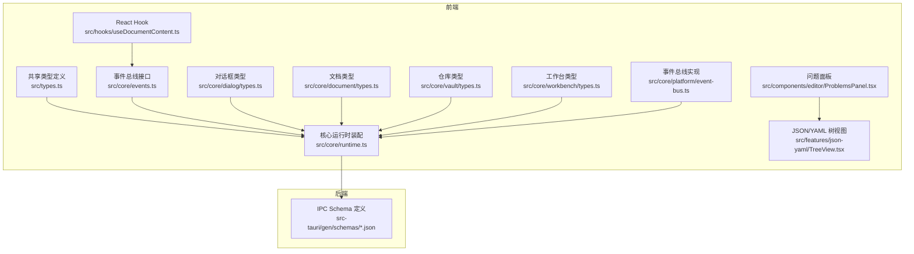
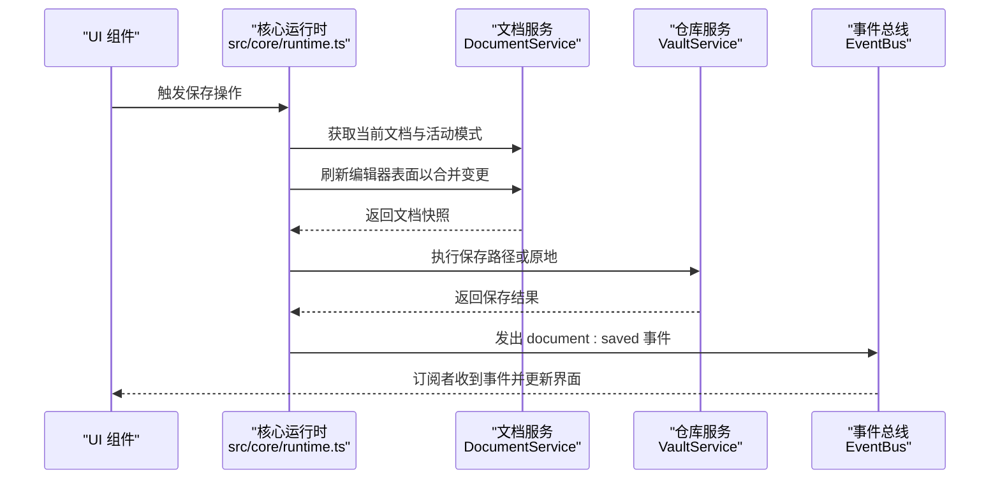
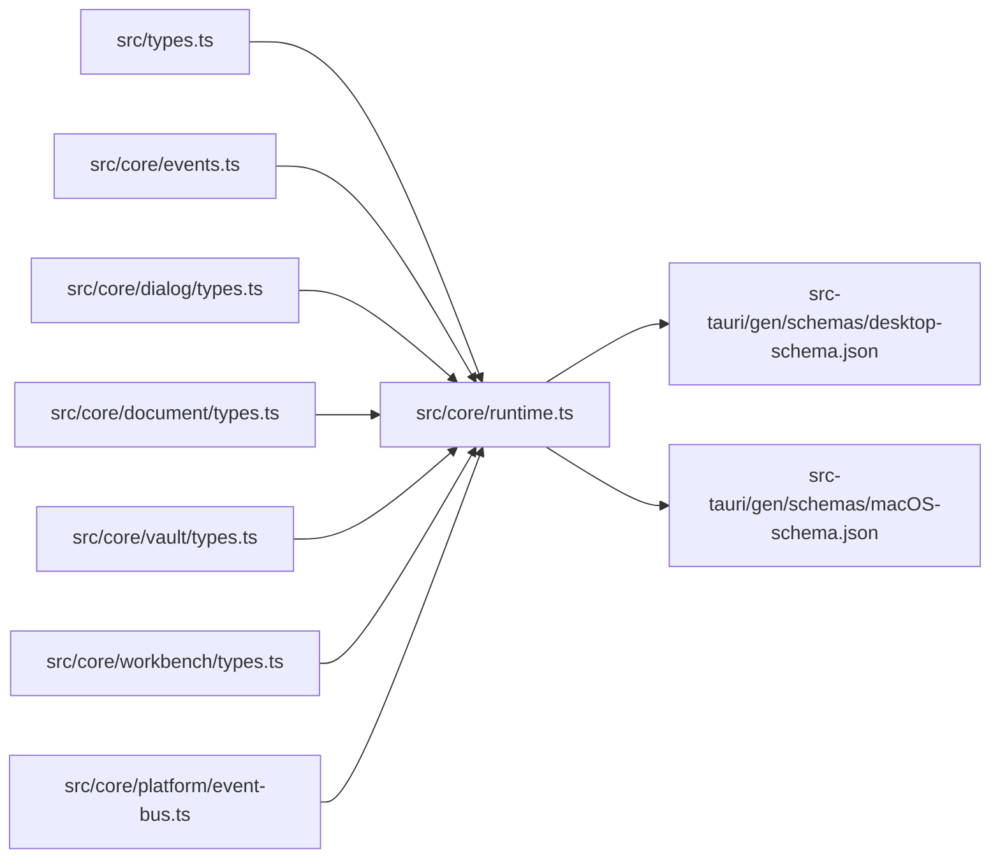

# 类型安全系统

<cite>
**本文引用的文件**
- [src/types.ts](file://src/types.ts)
- [src/core/events.ts](file://src/core/events.ts)
- [src/core/runtime.ts](file://src/core/runtime.ts)
- [src/core/dialog/types.ts](file://src/core/dialog/types.ts)
- [src/core/dialog/dialog-service.impl.ts](file://src/core/dialog/dialog-service.impl.ts)
- [src/core/document/types.ts](file://src/core/document/types.ts)
- [src/core/vault/types.ts](file://src/core/vault/types.ts)
- [src/core/workbench/types.ts](file://src/core/workbench/types.ts)
- [src/core/platform/event-bus.ts](file://src/core/platform/event-bus.ts)
- [src/hooks/useDocumentContent.ts](file://src/hooks/useDocumentContent.ts)
- [src/components/editor/ProblemsPanel.tsx](file://src/components/editor/ProblemsPanel.tsx)
- [src/features/json-yaml/TreeView.tsx](file://src/features/json-yaml/TreeView.tsx)
- [src/core/editor/surface-handle.ts](file://src/core/editor/surface-handle.ts)
- [src-tauri/gen/schemas/desktop-schema.json](file://src-tauri/gen/schemas/desktop-schema.json)
- [src-tauri/gen/schemas/macOS-schema.json](file://src-tauri/gen/schemas/macOS-schema.json)
- [pnpm-lock.yaml](file://pnpm-lock.yaml)
</cite>

## 目录
1. [引言](#引言)
2. [项目结构](#项目结构)
3. [核心组件](#核心组件)
4. [架构总览](#架构总览)
5. [详细组件分析](#详细组件分析)
6. [依赖分析](#依赖分析)
7. [性能考虑](#性能考虑)
8. [故障排查指南](#故障排查指南)
9. [结论](#结论)
10. [附录](#附录)

## 引言
本文件系统化梳理 NoteForge 的类型安全体系，覆盖前端与后端（Tauri/Rust）之间的共享类型定义、编译期类型检查与运行时类型验证的协同机制；解释数据转换层的设计理念与 to* 系列函数的职责边界；阐述泛型类型系统的使用方式（如 Promise<T>、可选参数、联合类型）；并给出类型系统的维护策略、最佳实践与常见问题的解决方案。

## 项目结构
NoteForge 的类型安全由“共享类型定义 + 编译期类型检查 + 运行时校验”三层构成：
- 共享类型定义：位于前端 src/types.ts，与后端命令签名保持一致，确保 IPC 层面的数据契约稳定。
- 编译期类型检查：通过 TypeScript 严格模式与类型推导，保证组件间接口契约与调用一致性。
- 运行时类型验证：在 UI 层对 JSON/YAML 等结构进行 Schema 校验，提示用户潜在格式问题。

图表来源
- [src/types.ts:1-389](file://src/types.ts#L1-L389)
- [src/core/events.ts:1-35](file://src/core/events.ts#L1-L35)
- [src/core/runtime.ts:1-191](file://src/core/runtime.ts#L1-L191)
- [src/core/dialog/types.ts:1-22](file://src/core/dialog/types.ts#L1-L22)
- [src/core/document/types.ts:1-111](file://src/core/document/types.ts#L1-L111)
- [src/core/vault/types.ts:1-44](file://src/core/vault/types.ts#L1-L44)
- [src/core/workbench/types.ts:1-77](file://src/core/workbench/types.ts#L1-L77)
- [src/core/platform/event-bus.ts:1-36](file://src/core/platform/event-bus.ts#L1-L36)
- [src/hooks/useDocumentContent.ts:1-47](file://src/hooks/useDocumentContent.ts#L1-L47)
- [src/components/editor/ProblemsPanel.tsx:55-82](file://src/components/editor/ProblemsPanel.tsx#L55-L82)
- [src/features/json-yaml/TreeView.tsx:299-340](file://src/features/json-yaml/TreeView.tsx#L299-L340)
- [src-tauri/gen/schemas/desktop-schema.json:2549-2606](file://src-tauri/gen/schemas/desktop-schema.json#L2549-L2606)
- [src-tauri/gen/schemas/macOS-schema.json:2549-2606](file://src-tauri/gen/schemas/macOS-schema.json#L2549-L2606)

章节来源
- [src/types.ts:1-389](file://src/types.ts#L1-L389)
- [src/core/events.ts:1-35](file://src/core/events.ts#L1-L35)
- [src/core/runtime.ts:1-191](file://src/core/runtime.ts#L1-L191)

## 核心组件
- 共享类型定义（src/types.ts）
  - 覆盖工作区、文件系统、草稿/会话、编辑器、知识图谱、Agent 内存、AI 服务、应用配置等领域的前后端对齐结构体与枚举。
  - 关键设计原则：命名与后端命令返回结构保持一致，便于后端直接复用前端类型，减少转换成本。
- 事件总线与事件类型（src/core/events.ts）
  - 使用联合类型与条件类型（Extract）实现强类型事件订阅与分发，避免字符串魔法。
  - 提供 EventBus 接口，支持按事件类型粒度订阅与全量订阅。
- 核心运行时装配（src/core/runtime.ts）
  - 统一初始化各子系统（文档、仓库、工作台、命令、对话框、知识查询、编辑器宿主），并通过事件总线协调状态变更。
  - 在保存前强制刷新编辑器表面以确保内容一致性。
- 对话框服务与类型（src/core/dialog/types.ts、src/core/dialog/dialog-service.impl.ts）
  - 通过 DialogRequest 联合类型表达 UI 请求意图，DialogService 提供队列化与关闭控制，保障 UI 并发与顺序正确性。
- 文档/仓库/工作台类型（src/core/document/types.ts、src/core/vault/types.ts、src/core/workbench/types.ts）
  - 明确定义文档生命周期、视图状态、保存目标、冲突信息、仓库节点与布局状态等，支撑跨模块协作。
- 事件总线实现（src/core/platform/event-bus.ts）
  - 基于 Map/Set 实现类型安全的订阅管理，支持按事件类型精确回调。
- React 集成（src/hooks/useDocumentContent.ts）
  - 将事件总线与 React 订阅模型结合，仅在目标文档变化时触发重渲染，降低不必要更新。
- 运行时 Schema 校验（src/components/editor/ProblemsPanel.tsx、src/features/json-yaml/TreeView.tsx）
  - 对 JSON/YAML 解析结果进行校验并在 UI 中展示问题列表，提升数据质量与可诊断性。
- 后端 IPC Schema（src-tauri/gen/schemas/*.json）
  - 生成的 JSON Schema 描述后端 IPC 参数与返回值的结构，作为前端类型契约的权威来源之一。

章节来源
- [src/types.ts:1-389](file://src/types.ts#L1-L389)
- [src/core/events.ts:1-35](file://src/core/events.ts#L1-L35)
- [src/core/runtime.ts:1-191](file://src/core/runtime.ts#L1-L191)
- [src/core/dialog/types.ts:1-22](file://src/core/dialog/types.ts#L1-L22)
- [src/core/dialog/dialog-service.impl.ts:1-57](file://src/core/dialog/dialog-service.impl.ts#L1-L57)
- [src/core/document/types.ts:1-111](file://src/core/document/types.ts#L1-L111)
- [src/core/vault/types.ts:1-44](file://src/core/vault/types.ts#L1-L44)
- [src/core/workbench/types.ts:1-77](file://src/core/workbench/types.ts#L1-L77)
- [src/core/platform/event-bus.ts:1-36](file://src/core/platform/event-bus.ts#L1-L36)
- [src/hooks/useDocumentContent.ts:1-47](file://src/hooks/useDocumentContent.ts#L1-L47)
- [src/components/editor/ProblemsPanel.tsx:55-82](file://src/components/editor/ProblemsPanel.tsx#L55-L82)
- [src/features/json-yaml/TreeView.tsx:299-340](file://src/features/json-yaml/TreeView.tsx#L299-L340)
- [src-tauri/gen/schemas/desktop-schema.json:2549-2606](file://src-tauri/gen/schemas/desktop-schema.json#L2549-L2606)
- [src-tauri/gen/schemas/macOS-schema.json:2549-2606](file://src-tauri/gen/schemas/macOS-schema.json#L2549-L2606)

## 架构总览
NoteForge 的类型安全贯穿“前端共享类型 → 编译期检查 → 运行时校验”的闭环：
- 前端共享类型与后端 IPC Schema 对齐，确保 IPC 数据结构稳定。
- TypeScript 严格模式与条件类型（Extract）保证事件订阅与回调的类型安全。
- UI 层对 JSON/YAML 的 Schema 校验提供即时反馈，降低错误传播风险。
- 运行时通过事件总线与服务层协作，确保状态一致性与边界清晰。

图表来源
- [src/core/runtime.ts:138-172](file://src/core/runtime.ts#L138-L172)
- [src/core/events.ts:9-23](file://src/core/events.ts#L9-L23)

## 详细组件分析

### 共享类型定义与对齐机制
- 设计要点
  - 前端类型与后端命令返回结构保持字段名一致（如 snake_case），便于后端直接复用前端类型，减少 to* 系列转换的复杂度。
  - 使用联合类型与字面量枚举（如 EditorSurfaceMode、ThemeMode）限定取值范围，增强可读性与可维护性。
- 典型场景
  - 工作区配置：前端 WorkspaceView 与后端 WorkspaceBackendConfig 字段一一对应，确保配置迁移与显示一致。
  - 搜索结果：前端 SearchResult 与后端 SearchBackendResult 字段对齐，避免额外映射。
- to* 系列函数定位
  - 当存在命名差异或需要进行轻量数据适配时，使用 to* 函数进行单向转换（例如 toSnakeCase、toFrontendShape），但优先通过共享类型消除差异。
  - 若后端返回结构与前端类型不完全一致，应在服务层集中处理转换，避免分散在 UI 层。

章节来源
- [src/types.ts:7-46](file://src/types.ts#L7-L46)
- [src/types.ts:149-155](file://src/types.ts#L149-L155)
- [src/types.ts:182-204](file://src/types.ts#L182-L204)

### 编译时类型检查与接口契约
- 条件类型与事件订阅
  - 通过 Extract<AppEvent, { type: T }> 将联合事件类型按具体类型拆分，确保订阅回调的参数类型与事件类型严格匹配。
- 泛型与可选参数
  - Promise<T> 用于异步操作的统一类型约束，确保调用方明确处理成功与失败分支。
  - 可选参数（如 OpenDocumentOptions.initialMode）通过接口属性标记可选，避免调用方遗漏非关键参数。
- 错误边界处理
  - IpcError 类型封装错误码与详情，配合前端错误对话框与日志记录，形成统一的错误边界。

章节来源
- [src/core/events.ts:27-34](file://src/core/events.ts#L27-L34)
- [src/core/document/types.ts:78-93](file://src/core/document/types.ts#L78-L93)
- [src/types.ts:378-389](file://src/types.ts#L378-L389)

### 运行时类型验证与数据适配
- JSON/YAML Schema 校验
  - UI 层解析 JSON/YAML 后进行校验，若失败则在 ProblemsPanel 或 TreeView 中展示问题列表，帮助用户快速定位错误。
- 事件驱动的 UI 更新
  - useDocumentContent 通过事件总线订阅 document:changed，仅当目标文档发生变化时触发重渲染，避免不必要的性能损耗。

章节来源
- [src/components/editor/ProblemsPanel.tsx:55-82](file://src/components/editor/ProblemsPanel.tsx#L55-L82)
- [src/features/json-yaml/TreeView.tsx:299-340](file://src/features/json-yaml/TreeView.tsx#L299-L340)
- [src/hooks/useDocumentContent.ts:1-47](file://src/hooks/useDocumentContent.ts#L1-L47)

### 编辑器表面与视图状态
- LiveSurfaceHandle
  - 定义编辑器表面的运行时绑定接口，包括内容刷新、滚动锚点恢复、光标锚点捕获等，确保多模式切换时的状态一致性。
- 视图状态归一化
  - normalizeSurfaceMode 将多种输入模式归一化为 write/source/read，减少分支判断与错误输入带来的不确定性。

章节来源
- [src/core/editor/surface-handle.ts:1-26](file://src/core/editor/surface-handle.ts#L1-L26)
- [src/core/workbench/types.ts:70-75](file://src/core/workbench/types.ts#L70-L75)

### 对话框服务与并发控制
- DialogRequest 联合类型
  - 将不同 UI 请求抽象为数据对象，避免在组件中直接耦合对话框逻辑。
- 队列化与关闭策略
  - 通过队列与关闭类型集合，确保对话框按序打开与关闭，避免并发 UI 冲突。

章节来源
- [src/core/dialog/types.ts:6-13](file://src/core/dialog/types.ts#L6-L13)
- [src/core/dialog/dialog-service.impl.ts:1-57](file://src/core/dialog/dialog-service.impl.ts#L1-L57)

### 事件总线与类型安全
- 订阅模型
  - 支持 subscribeAll 与按类型订阅，内部使用 Set 存储监听器，确保去重与高效移除。
- 事件类型提取
  - 通过 Extract<AppEvent, { type: T }> 精确匹配事件类型，避免回调参数类型不匹配。

章节来源
- [src/core/platform/event-bus.ts:1-36](file://src/core/platform/event-bus.ts#L1-L36)
- [src/core/events.ts:27-34](file://src/core/events.ts#L27-L34)

## 依赖分析
- 前端类型依赖关系
  - src/types.ts 为 IPC 与业务域的根类型，被 runtime.ts、dialog/types.ts、document/types.ts、vault/types.ts、workbench/types.ts 等广泛依赖。
  - runtime.ts 作为装配中心，协调各服务并发出事件，事件类型来自 events.ts。
- 后端 IPC Schema
  - desktop-schema.json 与 macOS-schema.json 描述后端 IPC 的参数与返回值结构，是前端类型契约的重要参考。
- 依赖可视化

图表来源
- [src/types.ts:1-389](file://src/types.ts#L1-L389)
- [src/core/runtime.ts:1-191](file://src/core/runtime.ts#L1-L191)
- [src/core/events.ts:1-35](file://src/core/events.ts#L1-L35)
- [src/core/dialog/types.ts:1-22](file://src/core/dialog/types.ts#L1-L22)
- [src/core/document/types.ts:1-111](file://src/core/document/types.ts#L1-L111)
- [src/core/vault/types.ts:1-44](file://src/core/vault/types.ts#L1-L44)
- [src/core/workbench/types.ts:1-77](file://src/core/workbench/types.ts#L1-L77)
- [src/core/platform/event-bus.ts:1-36](file://src/core/platform/event-bus.ts#L1-L36)
- [src-tauri/gen/schemas/desktop-schema.json:2549-2606](file://src-tauri/gen/schemas/desktop-schema.json#L2549-L2606)
- [src-tauri/gen/schemas/macOS-schema.json:2549-2606](file://src-tauri/gen/schemas/macOS-schema.json#L2549-L2606)

章节来源
- [src/types.ts:1-389](file://src/types.ts#L1-L389)
- [src/core/runtime.ts:1-191](file://src/core/runtime.ts#L1-L191)
- [src-tauri/gen/schemas/desktop-schema.json:2549-2606](file://src-tauri/gen/schemas/desktop-schema.json#L2549-L2606)
- [src-tauri/gen/schemas/macOS-schema.json:2549-2606](file://src-tauri/gen/schemas/macOS-schema.json#L2549-L2606)

## 性能考虑
- 事件驱动的最小化更新
  - 通过事件总线与 React 订阅模型，仅在目标文档变化时触发重渲染，降低不必要的计算与 DOM 更新。
- 编辑器表面刷新策略
  - 在保存前强制刷新编辑器表面，确保内容一致性，避免后续写入冲突与重复计算。
- 类型收敛与条件类型
  - 使用 Extract 等条件类型减少分支判断与类型检查开销，提升编译与运行时效率。

## 故障排查指南
- JSON/YAML 校验失败
  - 症状：ProblemsPanel 或 TreeView 展示“Schema 校验: N 问题”。
  - 处理：根据行号与消息定位问题，修正格式或字段类型；必要时在服务层增加 to* 适配。
- 事件未触发或回调类型不匹配
  - 症状：订阅回调未执行或参数类型报错。
  - 处理：确认事件类型是否正确；使用 Extract<AppEvent, { type: T }> 精确匹配；检查事件总线实现中的订阅注册。
- 对话框并发冲突
  - 症状：多个对话框同时出现或关闭顺序异常。
  - 处理：检查 DialogRequest 的 kind 是否属于关闭类集合；确保队列化逻辑正确执行。

章节来源
- [src/components/editor/ProblemsPanel.tsx:55-82](file://src/components/editor/ProblemsPanel.tsx#L55-L82)
- [src/features/json-yaml/TreeView.tsx:299-340](file://src/features/json-yaml/TreeView.tsx#L299-L340)
- [src/core/platform/event-bus.ts:1-36](file://src/core/platform/event-bus.ts#L1-L36)
- [src/core/dialog/dialog-service.impl.ts:1-57](file://src/core/dialog/dialog-service.impl.ts#L1-L57)

## 结论
NoteForge 的类型安全体系以“共享类型 + 编译期检查 + 运行时校验”为核心，通过前端与后端的类型对齐、严格的事件类型约束与 UI 层的 Schema 校验，有效降低了跨层数据不一致的风险。建议持续遵循“先对齐类型，再做转换”的原则，并在服务层集中处理 to* 适配，以维持类型系统的简洁与可维护性。

## 附录

### 类型系统维护指南
- 类型更新流程
  - 后端新增/修改命令时，同步更新 IPC Schema 与前端共享类型；优先通过字段对齐减少转换。
  - 前端类型变更需通过编译期检查，确保所有依赖点均能编译通过。
- 兼容性检查
  - 使用 TypeScript 的严格模式与 noImplicitAny，确保新增字段与可选参数的类型安全。
  - 对外暴露的公共类型尽量使用字面量枚举与联合类型，避免宽泛的 string/any。
- 重构策略
  - 将 to* 适配集中在服务层，UI 层只消费已对齐的类型。
  - 对事件类型进行模块化管理，避免全局字符串魔法。

### 最佳实践
- 事件订阅使用条件类型 Extract，确保回调参数类型与事件类型一致。
- Promise<T> 明确处理成功与失败分支，避免未处理的拒绝。
- 对可选参数使用接口属性标记可选，减少调用方负担。
- UI 层对 JSON/YAML 进行 Schema 校验，及时反馈错误并引导修复。