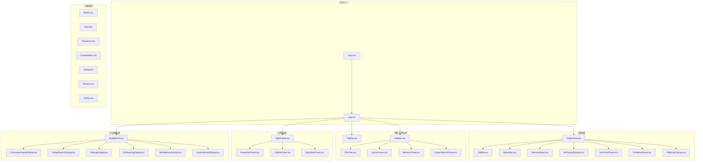
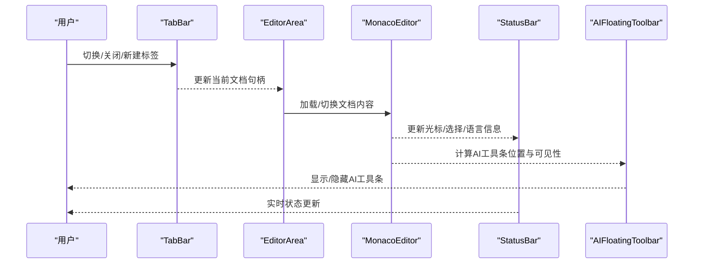
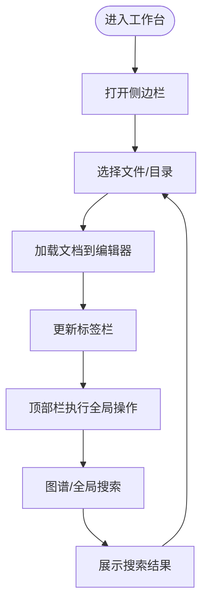
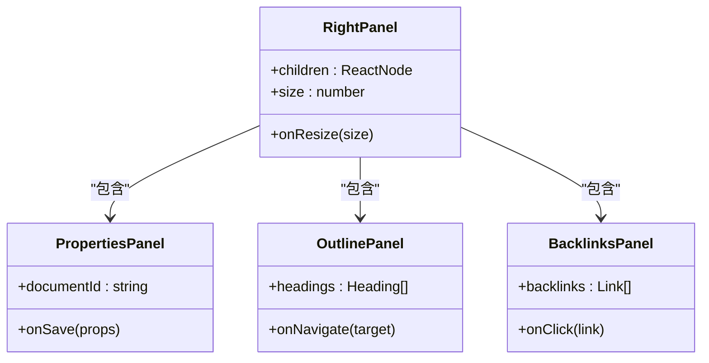
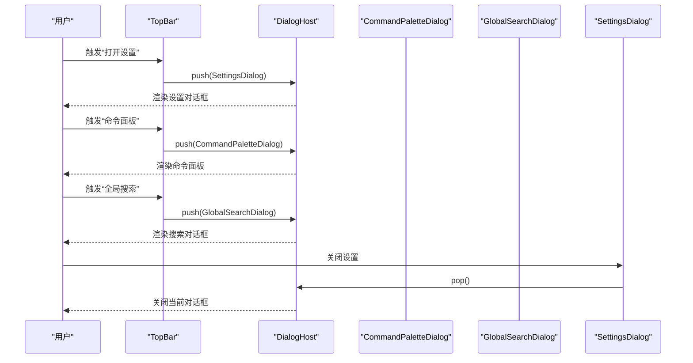
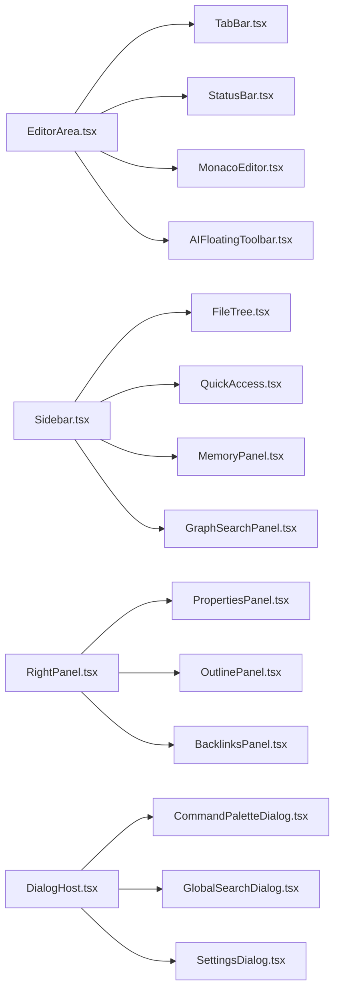

# UI组件系统

<cite>
**本文引用的文件**
- [src/components/ui/Button.tsx](file://src/components/ui/Button.tsx)
- [src/components/ui/Input.tsx](file://src/components/ui/Input.tsx)
- [src/components/ui/Dropdown.tsx](file://src/components/ui/Dropdown.tsx)
- [src/components/ui/ContextMenu.tsx](file://src/components/ui/ContextMenu.tsx)
- [src/components/ui/Dialog.tsx](file://src/components/ui/Dialog.tsx)
- [src/components/ui/Resizer.tsx](file://src/components/ui/Resizer.tsx)
- [src/components/ui/Tooltip.tsx](file://src/components/ui/Tooltip.tsx)
- [src/components/editor/EditorArea.tsx](file://src/components/editor/EditorArea.tsx)
- [src/components/editor/TabBar.tsx](file://src/components/editor/TabBar.tsx)
- [src/components/editor/StatusBar.tsx](file://src/components/editor/StatusBar.tsx)
- [src/components/editor/MonacoEditor.tsx](file://src/components/editor/MonacoEditor.tsx)
- [src/components/editor/AIFloatingToolbar.tsx](file://src/components/editor/AIFloatingToolbar.tsx)
- [src/components/editor/JsonYamlPanel.tsx](file://src/components/editor/JsonYamlPanel.tsx)
- [src/components/editor/ProblemsPanel.tsx](file://src/components/editor/ProblemsPanel.tsx)
- [src/components/editor/FileDropOverlay.tsx](file://src/components/editor/FileDropOverlay.tsx)
- [src/components/sidebar/Sidebar.tsx](file://src/components/sidebar/Sidebar.tsx)
- [src/components/sidebar/FileTree.tsx](file://src/components/sidebar/FileTree.tsx)
- [src/components/sidebar/QuickAccess.tsx](file://src/components/sidebar/QuickAccess.tsx)
- [src/components/sidebar/MemoryPanel.tsx](file://src/components/sidebar/MemoryPanel.tsx)
- [src/components/sidebar/GraphSearchPanel.tsx](file://src/components/sidebar/GraphSearchPanel.tsx)
- [src/components/topbar/TopBar.tsx](file://src/components/topbar/TopBar.tsx)
- [src/components/right/RightPanel.tsx](file://src/components/right/RightPanel.tsx)
- [src/components/right/PropertiesPanel.tsx](file://src/components/right/PropertiesPanel.tsx)
- [src/components/right/OutlinePanel.tsx](file://src/components/right/OutlinePanel.tsx)
- [src/components/right/BacklinksPanel.tsx](file://src/components/right/BacklinksPanel.tsx)
- [src/components/dialogs/DialogHost.tsx](file://src/components/dialogs/DialogHost.tsx)
- [src/components/dialogs/CommandPaletteDialog.tsx](file://src/components/dialogs/CommandPaletteDialog.tsx)
- [src/components/dialogs/GlobalSearchDialog.tsx](file://src/components/dialogs/GlobalSearchDialog.tsx)
- [src/components/dialogs/SettingsDialog.tsx](file://src/components/dialogs/SettingsDialog.tsx)
- [src/components/dialogs/OnboardingDialog.tsx](file://src/components/dialogs/OnboardingDialog.tsx)
- [src/components/dialogs/NewMemoryDialog.tsx](file://src/components/dialogs/NewMemoryDialog.tsx)
- [src/components/dialogs/ImportWizardDialog.tsx](file://src/components/dialogs/ImportWizardDialog.tsx)
- [src/store/theme.ts](file://src/store/theme.ts)
- [src/lib/theme-cache.ts](file://src/lib/theme-cache.ts)
- [src/index.css](file://src/index.css)
- [src/main.tsx](file://src/main.tsx)
- [src/App.tsx](file://src/App.tsx)
</cite>

## 目录
1. [简介](#简介)
2. [项目结构](#项目结构)
3. [核心组件](#核心组件)
4. [架构总览](#架构总览)
5. [详细组件分析](#详细组件分析)
6. [依赖关系分析](#依赖关系分析)
7. [性能考虑](#性能考虑)
8. [故障排查指南](#故障排查指南)
9. [结论](#结论)
10. [附录](#附录)

## 简介
本文件系统性梳理NoteForge的UI组件体系，覆盖组件分类与命名规范、复用策略、编辑器相关组件（编辑区、工具栏、状态栏、标签栏）、导航组件（侧边栏、顶部栏、对话框系统）、面板组件（右侧面板、属性面板、大纲面板）以及基础UI组件库（Button、Input、Dropdown、ContextMenu、Dialog、Resizer、Tooltip）。同时阐述组件间通信机制、状态管理与事件处理，提供定制化指南、响应式设计与无障碍访问建议，并给出主题系统的实现要点与最佳实践。

## 项目结构
NoteForge采用按功能域分层的组件组织方式：ui基础组件位于src/components/ui，编辑器相关组件在editor目录，导航与面板分别在sidebar、right，对话框系统在dialogs，顶部栏在topbar，入口应用在App.tsx与main.tsx中装配。

图表来源
- [src/main.tsx](file://src/main.tsx)
- [src/App.tsx](file://src/App.tsx)
- [src/components/editor/EditorArea.tsx](file://src/components/editor/EditorArea.tsx)
- [src/components/editor/TabBar.tsx](file://src/components/editor/TabBar.tsx)
- [src/components/editor/StatusBar.tsx](file://src/components/editor/StatusBar.tsx)
- [src/components/editor/MonacoEditor.tsx](file://src/components/editor/MonacoEditor.tsx)
- [src/components/editor/AIFloatingToolbar.tsx](file://src/components/editor/AIFloatingToolbar.tsx)
- [src/components/editor/JsonYamlPanel.tsx](file://src/components/editor/JsonYamlPanel.tsx)
- [src/components/editor/ProblemsPanel.tsx](file://src/components/editor/ProblemsPanel.tsx)
- [src/components/editor/FileDropOverlay.tsx](file://src/components/editor/FileDropOverlay.tsx)
- [src/components/sidebar/Sidebar.tsx](file://src/components/sidebar/Sidebar.tsx)
- [src/components/sidebar/FileTree.tsx](file://src/components/sidebar/FileTree.tsx)
- [src/components/sidebar/QuickAccess.tsx](file://src/components/sidebar/QuickAccess.tsx)
- [src/components/sidebar/MemoryPanel.tsx](file://src/components/sidebar/MemoryPanel.tsx)
- [src/components/sidebar/GraphSearchPanel.tsx](file://src/components/sidebar/GraphSearchPanel.tsx)
- [src/components/topbar/TopBar.tsx](file://src/components/topbar/TopBar.tsx)
- [src/components/right/RightPanel.tsx](file://src/components/right/RightPanel.tsx)
- [src/components/right/PropertiesPanel.tsx](file://src/components/right/PropertiesPanel.tsx)
- [src/components/right/OutlinePanel.tsx](file://src/components/right/OutlinePanel.tsx)
- [src/components/right/BacklinksPanel.tsx](file://src/components/right/BacklinksPanel.tsx)
- [src/components/dialogs/DialogHost.tsx](file://src/components/dialogs/DialogHost.tsx)
- [src/components/dialogs/CommandPaletteDialog.tsx](file://src/components/dialogs/CommandPaletteDialog.tsx)
- [src/components/dialogs/GlobalSearchDialog.tsx](file://src/components/dialogs/GlobalSearchDialog.tsx)
- [src/components/dialogs/SettingsDialog.tsx](file://src/components/dialogs/SettingsDialog.tsx)
- [src/components/dialogs/OnboardingDialog.tsx](file://src/components/dialogs/OnboardingDialog.tsx)
- [src/components/dialogs/NewMemoryDialog.tsx](file://src/components/dialogs/NewMemoryDialog.tsx)
- [src/components/dialogs/ImportWizardDialog.tsx](file://src/components/dialogs/ImportWizardDialog.tsx)

章节来源
- [src/main.tsx](file://src/main.tsx)
- [src/App.tsx](file://src/App.tsx)

## 核心组件
- 组件分类与命名约定
  - 基础UI组件：统一以小写开头的名词命名，如Button、Input、Dropdown、ContextMenu、Dialog、Resizer、Tooltip。
  - 功能域组件：按功能域分目录，如editor、sidebar、right、dialogs、topbar。
  - 复用策略：通过props注入行为与样式，避免硬编码；提供受控/非受控两种模式；通过hooks抽象交互逻辑。
- 编辑器相关组件：EditorArea作为容器，内部组合TabBar、StatusBar、MonacoEditor、AI浮动工具栏、JSON/YAML面板、问题面板与拖拽覆盖层。
- 导航组件：Sidebar为主容器，内含FileTree、QuickAccess、MemoryPanel、GraphSearchPanel；TopBar承载全局操作入口。
- 面板组件：RightPanel为容器，内嵌PropertiesPanel、OutlinePanel、BacklinksPanel。
- 对话框系统：DialogHost作为全局挂载点，集中管理CommandPalette、全局搜索、设置、引导、新建记忆体与导入向导等。

章节来源
- [src/components/ui/Button.tsx](file://src/components/ui/Button.tsx)
- [src/components/ui/Input.tsx](file://src/components/ui/Input.tsx)
- [src/components/ui/Dropdown.tsx](file://src/components/ui/Dropdown.tsx)
- [src/components/ui/ContextMenu.tsx](file://src/components/ui/ContextMenu.tsx)
- [src/components/ui/Dialog.tsx](file://src/components/ui/Dialog.tsx)
- [src/components/ui/Resizer.tsx](file://src/components/ui/Resizer.tsx)
- [src/components/ui/Tooltip.tsx](file://src/components/ui/Tooltip.tsx)
- [src/components/editor/EditorArea.tsx](file://src/components/editor/EditorArea.tsx)
- [src/components/editor/TabBar.tsx](file://src/components/editor/TabBar.tsx)
- [src/components/editor/StatusBar.tsx](file://src/components/editor/StatusBar.tsx)
- [src/components/editor/MonacoEditor.tsx](file://src/components/editor/MonacoEditor.tsx)
- [src/components/editor/AIFloatingToolbar.tsx](file://src/components/editor/AIFloatingToolbar.tsx)
- [src/components/editor/JsonYamlPanel.tsx](file://src/components/editor/JsonYamlPanel.tsx)
- [src/components/editor/ProblemsPanel.tsx](file://src/components/editor/ProblemsPanel.tsx)
- [src/components/editor/FileDropOverlay.tsx](file://src/components/editor/FileDropOverlay.tsx)
- [src/components/sidebar/Sidebar.tsx](file://src/components/sidebar/Sidebar.tsx)
- [src/components/sidebar/FileTree.tsx](file://src/components/sidebar/FileTree.tsx)
- [src/components/sidebar/QuickAccess.tsx](file://src/components/sidebar/QuickAccess.tsx)
- [src/components/sidebar/MemoryPanel.tsx](file://src/components/sidebar/MemoryPanel.tsx)
- [src/components/sidebar/GraphSearchPanel.tsx](file://src/components/sidebar/GraphSearchPanel.tsx)
- [src/components/topbar/TopBar.tsx](file://src/components/topbar/TopBar.tsx)
- [src/components/right/RightPanel.tsx](file://src/components/right/RightPanel.tsx)
- [src/components/right/PropertiesPanel.tsx](file://src/components/right/PropertiesPanel.tsx)
- [src/components/right/OutlinePanel.tsx](file://src/components/right/OutlinePanel.tsx)
- [src/components/right/BacklinksPanel.tsx](file://src/components/right/BacklinksPanel.tsx)
- [src/components/dialogs/DialogHost.tsx](file://src/components/dialogs/DialogHost.tsx)
- [src/components/dialogs/CommandPaletteDialog.tsx](file://src/components/dialogs/CommandPaletteDialog.tsx)
- [src/components/dialogs/GlobalSearchDialog.tsx](file://src/components/dialogs/GlobalSearchDialog.tsx)
- [src/components/dialogs/SettingsDialog.tsx](file://src/components/dialogs/SettingsDialog.tsx)
- [src/components/dialogs/OnboardingDialog.tsx](file://src/components/dialogs/OnboardingDialog.tsx)
- [src/components/dialogs/NewMemoryDialog.tsx](file://src/components/dialogs/NewMemoryDialog.tsx)
- [src/components/dialogs/ImportWizardDialog.tsx](file://src/components/dialogs/ImportWizardDialog.tsx)

## 架构总览
NoteForge UI采用“容器-展示”分层与“功能域模块化”的混合架构。容器组件负责状态聚合与事件编排，展示组件专注渲染与交互反馈。对话框系统通过全局宿主集中管理，编辑器与导航/面板之间通过store与服务层解耦。

```mermaid
graph TB
subgraph "状态与服务"
THEME["theme.ts"]
THEMECACHE["theme-cache.ts"]
CSS["index.css"]
end
subgraph "容器层"
EDITOR["EditorArea.tsx"]
SIDEBAR["Sidebar.tsx"]
RIGHT["RightPanel.tsx"]
HOST["DialogHost.tsx"]
end
subgraph "展示层"
TAB["TabBar.tsx"]
STATUS["StatusBar.tsx"]
MONACO["MonacoEditor.tsx"]
AI["AIFloatingToolbar.tsx"]
JSON["JsonYamlPanel.tsx"]
PROBS["ProblemsPanel.tsx"]
DROP["FileDropOverlay.tsx"]
FILETREE["FileTree.tsx"]
QUICK["QuickAccess.tsx"]
MEM["MemoryPanel.tsx"]
GRAPH["GraphSearchPanel.tsx"]
PROP["PropertiesPanel.tsx"]
OUT["OutlinePanel.tsx"]
BACK["BacklinksPanel.tsx"]
TOPBAR["TopBar.tsx"]
end
THEME --> CSS
THEMECACHE --> THEME
EDITOR --> TAB
EDITOR --> STATUS
EDITOR --> MONACO
EDITOR --> AI
EDITOR --> JSON
EDITOR --> PROBS
EDITOR --> DROP
SIDEBAR --> FILETREE
SIDEBAR --> QUICK
SIDEBAR --> MEM
SIDEBAR --> GRAPH
RIGHT --> PROP
RIGHT --> OUT
RIGHT --> BACK
HOST --> TOPBAR
```

图表来源
- [src/store/theme.ts](file://src/store/theme.ts)
- [src/lib/theme-cache.ts](file://src/lib/theme-cache.ts)
- [src/index.css](file://src/index.css)
- [src/components/editor/EditorArea.tsx](file://src/components/editor/EditorArea.tsx)
- [src/components/editor/TabBar.tsx](file://src/components/editor/TabBar.tsx)
- [src/components/editor/StatusBar.tsx](file://src/components/editor/StatusBar.tsx)
- [src/components/editor/MonacoEditor.tsx](file://src/components/editor/MonacoEditor.tsx)
- [src/components/editor/AIFloatingToolbar.tsx](file://src/components/editor/AIFloatingToolbar.tsx)
- [src/components/editor/JsonYamlPanel.tsx](file://src/components/editor/JsonYamlPanel.tsx)
- [src/components/editor/ProblemsPanel.tsx](file://src/components/editor/ProblemsPanel.tsx)
- [src/components/editor/FileDropOverlay.tsx](file://src/components/editor/FileDropOverlay.tsx)
- [src/components/sidebar/Sidebar.tsx](file://src/components/sidebar/Sidebar.tsx)
- [src/components/sidebar/FileTree.tsx](file://src/components/sidebar/FileTree.tsx)
- [src/components/sidebar/QuickAccess.tsx](file://src/components/sidebar/QuickAccess.tsx)
- [src/components/sidebar/MemoryPanel.tsx](file://src/components/sidebar/MemoryPanel.tsx)
- [src/components/sidebar/GraphSearchPanel.tsx](file://src/components/sidebar/GraphSearchPanel.tsx)
- [src/components/right/RightPanel.tsx](file://src/components/right/RightPanel.tsx)
- [src/components/right/PropertiesPanel.tsx](file://src/components/right/PropertiesPanel.tsx)
- [src/components/right/OutlinePanel.tsx](file://src/components/right/OutlinePanel.tsx)
- [src/components/right/BacklinksPanel.tsx](file://src/components/right/BacklinksPanel.tsx)
- [src/components/topbar/TopBar.tsx](file://src/components/topbar/TopBar.tsx)
- [src/components/dialogs/DialogHost.tsx](file://src/components/dialogs/DialogHost.tsx)

## 详细组件分析

### 编辑器组件族
- EditorArea：编辑器区域容器，协调标签栏、状态栏、Monaco编辑器、AI浮动工具栏、JSON/YAML面板、问题面板与拖拽覆盖层。
- TabBar：多标签页管理，支持切换、关闭、重命名、滚动与上下文菜单。
- StatusBar：显示光标位置、语言模式、编码、行尾、字数统计等信息。
- MonacoEditor：基于Monaco的代码/Markdown编辑器封装，提供语言模式、主题、快捷键与插件集成。
- AIFloatingToolbar：AI相关操作的悬浮工具条，随选区或光标位置动态定位。
- JsonYamlPanel：JSON/YAML数据视图与编辑面板，支持树形浏览与验证。
- ProblemsPanel：问题列表面板，展示语法、语义与外部工具产生的诊断信息。
- FileDropOverlay：文件拖拽进入时的覆盖提示层，提供视觉反馈与放置指示。

图表来源
- [src/components/editor/EditorArea.tsx](file://src/components/editor/EditorArea.tsx)
- [src/components/editor/TabBar.tsx](file://src/components/editor/TabBar.tsx)
- [src/components/editor/StatusBar.tsx](file://src/components/editor/StatusBar.tsx)
- [src/components/editor/MonacoEditor.tsx](file://src/components/editor/MonacoEditor.tsx)
- [src/components/editor/AIFloatingToolbar.tsx](file://src/components/editor/AIFloatingToolbar.tsx)

章节来源
- [src/components/editor/EditorArea.tsx](file://src/components/editor/EditorArea.tsx)
- [src/components/editor/TabBar.tsx](file://src/components/editor/TabBar.tsx)
- [src/components/editor/StatusBar.tsx](file://src/components/editor/StatusBar.tsx)
- [src/components/editor/MonacoEditor.tsx](file://src/components/editor/MonacoEditor.tsx)
- [src/components/editor/AIFloatingToolbar.tsx](file://src/components/editor/AIFloatingToolbar.tsx)
- [src/components/editor/JsonYamlPanel.tsx](file://src/components/editor/JsonYamlPanel.tsx)
- [src/components/editor/ProblemsPanel.tsx](file://src/components/editor/ProblemsPanel.tsx)
- [src/components/editor/FileDropOverlay.tsx](file://src/components/editor/FileDropOverlay.tsx)

### 导航组件族
- Sidebar：侧边栏容器，承载文件树、快速访问、记忆体与图谱搜索。
- FileTree：文件系统树形浏览，支持展开/折叠、节点选择、重命名、删除与上下文菜单。
- QuickAccess：常用路径与快速跳转入口。
- MemoryPanel：记忆体集合面板，支持检索与操作。
- GraphSearchPanel：图谱搜索入口与结果面板。
- TopBar：顶部工具栏，提供全局菜单、搜索、设置入口与用户操作。

图表来源
- [src/components/sidebar/Sidebar.tsx](file://src/components/sidebar/Sidebar.tsx)
- [src/components/sidebar/FileTree.tsx](file://src/components/sidebar/FileTree.tsx)
- [src/components/sidebar/QuickAccess.tsx](file://src/components/sidebar/QuickAccess.tsx)
- [src/components/sidebar/MemoryPanel.tsx](file://src/components/sidebar/MemoryPanel.tsx)
- [src/components/sidebar/GraphSearchPanel.tsx](file://src/components/sidebar/GraphSearchPanel.tsx)
- [src/components/topbar/TopBar.tsx](file://src/components/topbar/TopBar.tsx)

章节来源
- [src/components/sidebar/Sidebar.tsx](file://src/components/sidebar/Sidebar.tsx)
- [src/components/sidebar/FileTree.tsx](file://src/components/sidebar/FileTree.tsx)
- [src/components/sidebar/QuickAccess.tsx](file://src/components/sidebar/QuickAccess.tsx)
- [src/components/sidebar/MemoryPanel.tsx](file://src/components/sidebar/MemoryPanel.tsx)
- [src/components/sidebar/GraphSearchPanel.tsx](file://src/components/sidebar/GraphSearchPanel.tsx)
- [src/components/topbar/TopBar.tsx](file://src/components/topbar/TopBar.tsx)

### 面板组件族
- RightPanel：右侧容器，承载属性、大纲与反向链接等子面板。
- PropertiesPanel：文档属性与元数据编辑面板。
- OutlinePanel：标题大纲导航面板，支持层级跳转。
- BacklinksPanel：反向链接（被哪些文档引用）列表面板。

图表来源
- [src/components/right/RightPanel.tsx](file://src/components/right/RightPanel.tsx)
- [src/components/right/PropertiesPanel.tsx](file://src/components/right/PropertiesPanel.tsx)
- [src/components/right/OutlinePanel.tsx](file://src/components/right/OutlinePanel.tsx)
- [src/components/right/BacklinksPanel.tsx](file://src/components/right/BacklinksPanel.tsx)

章节来源
- [src/components/right/RightPanel.tsx](file://src/components/right/RightPanel.tsx)
- [src/components/right/PropertiesPanel.tsx](file://src/components/right/PropertiesPanel.tsx)
- [src/components/right/OutlinePanel.tsx](file://src/components/right/OutlinePanel.tsx)
- [src/components/right/BacklinksPanel.tsx](file://src/components/right/BacklinksPanel.tsx)

### 对话框系统
- DialogHost：全局对话框宿主，集中渲染当前激活的对话框队列。
- CommandPaletteDialog：命令面板，支持模糊搜索与快速执行。
- GlobalSearchDialog：全局搜索对话框，跨文档检索。
- SettingsDialog：设置对话框，集中管理应用配置。
- OnboardingDialog：引导流程对话框。
- NewMemoryDialog：新建记忆体对话框。
- ImportWizardDialog：导入向导对话框。

图表来源
- [src/components/dialogs/DialogHost.tsx](file://src/components/dialogs/DialogHost.tsx)
- [src/components/dialogs/CommandPaletteDialog.tsx](file://src/components/dialogs/CommandPaletteDialog.tsx)
- [src/components/dialogs/GlobalSearchDialog.tsx](file://src/components/dialogs/GlobalSearchDialog.tsx)
- [src/components/dialogs/SettingsDialog.tsx](file://src/components/dialogs/SettingsDialog.tsx)
- [src/components/topbar/TopBar.tsx](file://src/components/topbar/TopBar.tsx)

章节来源
- [src/components/dialogs/DialogHost.tsx](file://src/components/dialogs/DialogHost.tsx)
- [src/components/dialogs/CommandPaletteDialog.tsx](file://src/components/dialogs/CommandPaletteDialog.tsx)
- [src/components/dialogs/GlobalSearchDialog.tsx](file://src/components/dialogs/GlobalSearchDialog.tsx)
- [src/components/dialogs/SettingsDialog.tsx](file://src/components/dialogs/SettingsDialog.tsx)
- [src/components/dialogs/OnboardingDialog.tsx](file://src/components/dialogs/OnboardingDialog.tsx)
- [src/components/dialogs/NewMemoryDialog.tsx](file://src/components/dialogs/NewMemoryDialog.tsx)
- [src/components/dialogs/ImportWizardDialog.tsx](file://src/components/dialogs/ImportWizardDialog.tsx)
- [src/components/topbar/TopBar.tsx](file://src/components/topbar/TopBar.tsx)

### 基础UI组件库
- Button：基础按钮，支持主按钮、次要按钮、危险按钮、图标按钮、禁用态与加载态。
- Input：文本输入框，支持类型、尺寸、前缀/后缀、清除按钮、禁用与只读。
- Dropdown：下拉选择，支持单选/多选、可搜索、分组、禁用与自定义渲染。
- ContextMenu：上下文菜单，支持嵌套项、分隔符、图标、快捷键提示与键盘导航。
- Dialog：对话框容器，支持模态、遮罩点击关闭、Esc关闭、居中/全屏、动画过渡。
- Resizer：拖拽调整大小，支持水平/垂直方向、最小/最大约束、回调通知。
- Tooltip：气泡提示，支持触发方式（悬停/聚焦）、位置、延迟与主题。

章节来源
- [src/components/ui/Button.tsx](file://src/components/ui/Button.tsx)
- [src/components/ui/Input.tsx](file://src/components/ui/Input.tsx)
- [src/components/ui/Dropdown.tsx](file://src/components/ui/Dropdown.tsx)
- [src/components/ui/ContextMenu.tsx](file://src/components/ui/ContextMenu.tsx)
- [src/components/ui/Dialog.tsx](file://src/components/ui/Dialog.tsx)
- [src/components/ui/Resizer.tsx](file://src/components/ui/Resizer.tsx)
- [src/components/ui/Tooltip.tsx](file://src/components/ui/Tooltip.tsx)

## 依赖关系分析
- 组件耦合与内聚
  - 容器组件（EditorArea、Sidebar、RightPanel、DialogHost）承担高内聚的业务编排职责，展示组件保持低耦合与可替换性。
  - 展示组件通过props与回调与容器通信，避免直接依赖具体服务。
- 外部依赖与集成点
  - MonacoEditor依赖Monaco编辑器生态，需关注版本兼容与插件生态。
  - 主题系统通过store与缓存模块驱动CSS变量与类名切换。
- 潜在循环依赖
  - 当前结构以容器-展示分层为主，未见明显循环依赖迹象。

图表来源
- [src/components/editor/EditorArea.tsx](file://src/components/editor/EditorArea.tsx)
- [src/components/editor/TabBar.tsx](file://src/components/editor/TabBar.tsx)
- [src/components/editor/StatusBar.tsx](file://src/components/editor/StatusBar.tsx)
- [src/components/editor/MonacoEditor.tsx](file://src/components/editor/MonacoEditor.tsx)
- [src/components/editor/AIFloatingToolbar.tsx](file://src/components/editor/AIFloatingToolbar.tsx)
- [src/components/sidebar/Sidebar.tsx](file://src/components/sidebar/Sidebar.tsx)
- [src/components/sidebar/FileTree.tsx](file://src/components/sidebar/FileTree.tsx)
- [src/components/sidebar/QuickAccess.tsx](file://src/components/sidebar/QuickAccess.tsx)
- [src/components/sidebar/MemoryPanel.tsx](file://src/components/sidebar/MemoryPanel.tsx)
- [src/components/sidebar/GraphSearchPanel.tsx](file://src/components/sidebar/GraphSearchPanel.tsx)
- [src/components/right/RightPanel.tsx](file://src/components/right/RightPanel.tsx)
- [src/components/right/PropertiesPanel.tsx](file://src/components/right/PropertiesPanel.tsx)
- [src/components/right/OutlinePanel.tsx](file://src/components/right/OutlinePanel.tsx)
- [src/components/right/BacklinksPanel.tsx](file://src/components/right/BacklinksPanel.tsx)
- [src/components/dialogs/DialogHost.tsx](file://src/components/dialogs/DialogHost.tsx)
- [src/components/dialogs/CommandPaletteDialog.tsx](file://src/components/dialogs/CommandPaletteDialog.tsx)
- [src/components/dialogs/GlobalSearchDialog.tsx](file://src/components/dialogs/GlobalSearchDialog.tsx)
- [src/components/dialogs/SettingsDialog.tsx](file://src/components/dialogs/SettingsDialog.tsx)

章节来源
- [src/components/editor/EditorArea.tsx](file://src/components/editor/EditorArea.tsx)
- [src/components/sidebar/Sidebar.tsx](file://src/components/sidebar/Sidebar.tsx)
- [src/components/right/RightPanel.tsx](file://src/components/right/RightPanel.tsx)
- [src/components/dialogs/DialogHost.tsx](file://src/components/dialogs/DialogHost.tsx)

## 性能考虑
- 虚拟化与懒加载
  - 文件树与长列表建议采用虚拟化渲染，减少DOM节点数量。
  - 对话框按需渲染，关闭后及时卸载，避免内存泄漏。
- 事件节流与防抖
  - 拖拽与滚动事件应进行节流/防抖，提升交互流畅度。
- 主题切换优化
  - 使用CSS变量与缓存模块，避免频繁重排与样式回流。
- 编辑器性能
  - Monaco编辑器启用增量渲染与差异更新，避免大文档全量重绘。
  - 合理拆分插件与装饰器，按需加载。

## 故障排查指南
- 编辑器无响应
  - 检查MonacoEditor是否正确初始化，确认语言模式与主题已加载。
  - 查看AIFloatingToolbar位置计算逻辑，确保不被遮挡。
- 标签页异常
  - 确认TabBar与EditorArea之间的文档句柄同步，避免状态错配。
- 对话框无法关闭
  - 检查DialogHost的栈管理与顶层对话框状态，确保Esc与遮罩事件绑定正常。
- 侧边栏内容不刷新
  - 确认FileTree的数据源与选择状态同步，检查QuickAccess与MemoryPanel的订阅更新。
- 面板布局错位
  - 检查RightPanel的Resizer回调与最小/最大值约束，确保面板尺寸稳定。

章节来源
- [src/components/editor/MonacoEditor.tsx](file://src/components/editor/MonacoEditor.tsx)
- [src/components/editor/AIFloatingToolbar.tsx](file://src/components/editor/AIFloatingToolbar.tsx)
- [src/components/editor/TabBar.tsx](file://src/components/editor/TabBar.tsx)
- [src/components/dialogs/DialogHost.tsx](file://src/components/dialogs/DialogHost.tsx)
- [src/components/sidebar/FileTree.tsx](file://src/components/sidebar/FileTree.tsx)
- [src/components/right/RightPanel.tsx](file://src/components/right/RightPanel.tsx)

## 结论
NoteForge的UI组件系统以清晰的功能域划分与容器-展示分层为核心，结合全局对话框宿主与主题缓存机制，实现了高内聚、低耦合且易于扩展的前端架构。通过标准化的组件API与复用策略，开发者可以快速构建一致性的用户体验，并在保证性能与可维护性的前提下持续迭代。

## 附录
- 响应式设计
  - 使用相对单位与断点策略适配不同屏幕尺寸；对话框与面板在窄屏下自动调整布局。
- 无障碍访问
  - 为所有交互元素提供键盘可达性与ARIA标签；为颜色对比度不足的场景提供替代方案。
- 主题系统
  - 通过store与缓存模块驱动主题切换，CSS变量与类名切换相结合，确保主题变更即时生效且可持久化。

章节来源
- [src/store/theme.ts](file://src/store/theme.ts)
- [src/lib/theme-cache.ts](file://src/lib/theme-cache.ts)
- [src/index.css](file://src/index.css)