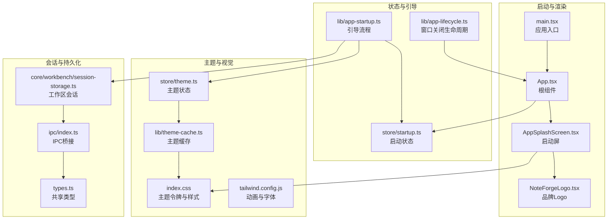
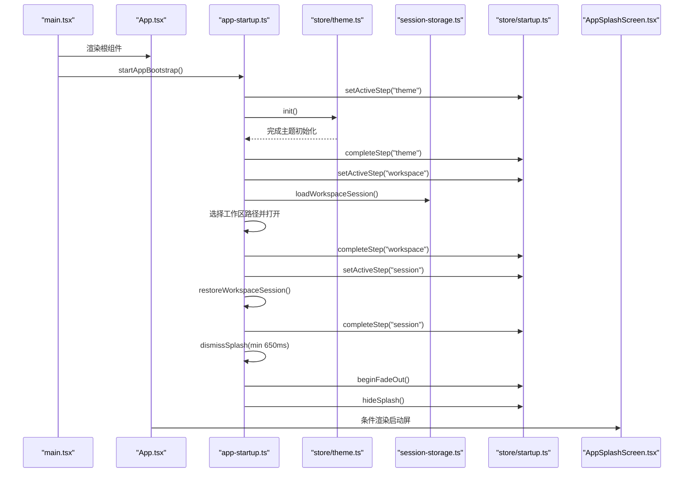
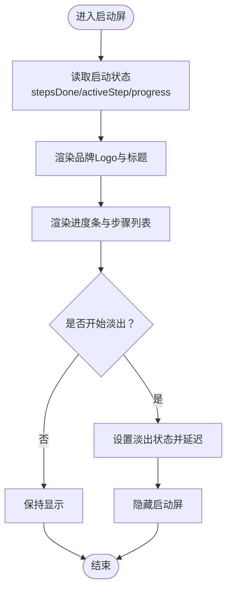
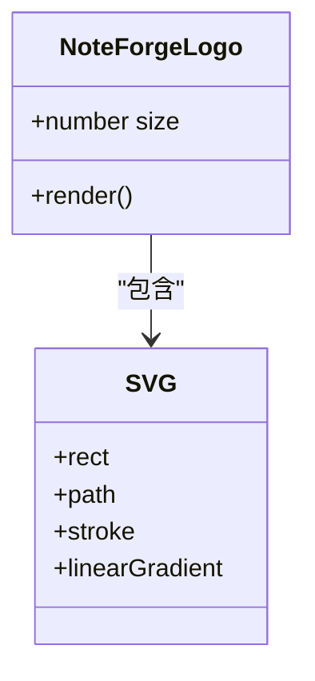
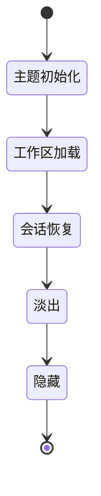
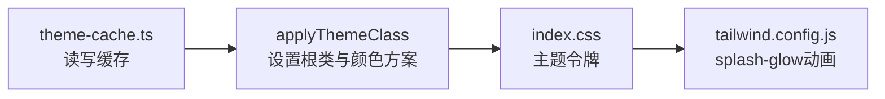
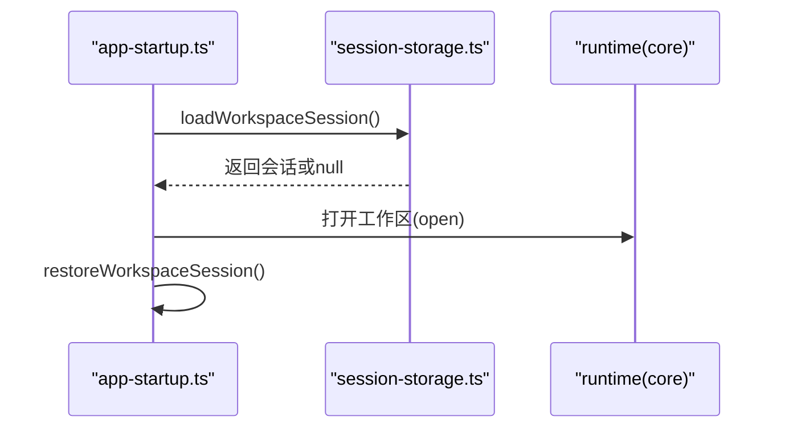
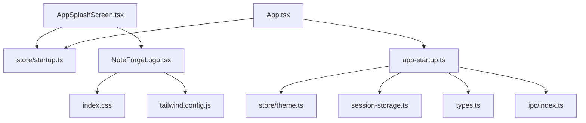

# 启动界面与资源

<cite>
**本文引用的文件**
- [src/components/splash/AppSplashScreen.tsx](file://src/components/splash/AppSplashScreen.tsx)
- [src/components/splash/NoteForgeLogo.tsx](file://src/components/splash/NoteForgeLogo.tsx)
- [src/lib/app-startup.ts](file://src/lib/app-startup.ts)
- [src/lib/app-lifecycle.ts](file://src/lib/app-lifecycle.ts)
- [src/store/startup.ts](file://src/store/startup.ts)
- [src/main.tsx](file://src/main.tsx)
- [src/App.tsx](file://src/App.tsx)
- [src/index.css](file://src/index.css)
- [src/store/theme.ts](file://src/store/theme.ts)
- [src/core/workbench/session-storage.ts](file://src/core/workbench/session-storage.ts)
- [src/ipc/index.ts](file://src/ipc/index.ts)
- [src/types.ts](file://src/types.ts)
- [src/lib/theme-cache.ts](file://src/lib/theme-cache.ts)
- [tailwind.config.js](file://tailwind.config.js)
</cite>

## 目录
1. [引言](#引言)
2. [项目结构](#项目结构)
3. [核心组件](#核心组件)
4. [架构总览](#架构总览)
5. [详细组件分析](#详细组件分析)
6. [依赖关系分析](#依赖关系分析)
7. [性能考量](#性能考量)
8. [故障排查指南](#故障排查指南)
9. [结论](#结论)
10. [附录](#附录)

## 引言
本文件聚焦NoteForge的启动界面与应用资源，系统性梳理启动屏的设计实现（加载状态管理、进度指示器、品牌展示）、Logo组件的矢量图形设计（SVG优化、颜色主题适配、响应式缩放）、启动流程的阶段划分与控制流、性能优化策略（资源预加载、最小可见时长、渐隐过渡）、品牌视觉系统（色彩方案、字体选择、图标设计），并提供跨平台适配与调试建议。

## 项目结构
启动相关代码主要分布在以下模块：
- 启动屏与品牌组件：src/components/splash
- 应用引导与生命周期：src/lib
- 状态管理：src/store
- 主应用挂载与渲染：src/main.tsx、src/App.tsx
- 视觉系统与主题：src/index.css、src/lib/theme-cache.ts、tailwind.config.js
- 工作区会话与持久化：src/core/workbench/session-storage.ts
- IPC桥接与类型：src/ipc/index.ts、src/types.ts

**图表来源**
- [src/main.tsx:1-24](file://src/main.tsx#L1-L24)
- [src/App.tsx:25-111](file://src/App.tsx#L25-L111)
- [src/components/splash/AppSplashScreen.tsx:42-99](file://src/components/splash/AppSplashScreen.tsx#L42-L99)
- [src/components/splash/NoteForgeLogo.tsx:1-45](file://src/components/splash/NoteForgeLogo.tsx#L1-L45)
- [src/store/startup.ts:1-56](file://src/store/startup.ts#L1-L56)
- [src/lib/app-startup.ts:1-75](file://src/lib/app-startup.ts#L1-L75)
- [src/lib/app-lifecycle.ts:1-31](file://src/lib/app-lifecycle.ts#L1-L31)
- [src/store/theme.ts:1-62](file://src/store/theme.ts#L1-L62)
- [src/lib/theme-cache.ts:1-46](file://src/lib/theme-cache.ts#L1-L46)
- [src/index.css:1-299](file://src/index.css#L1-L299)
- [tailwind.config.js:36-104](file://tailwind.config.js#L36-L104)
- [src/core/workbench/session-storage.ts:1-126](file://src/core/workbench/session-storage.ts#L1-L126)
- [src/ipc/index.ts:1-489](file://src/ipc/index.ts#L1-L489)
- [src/types.ts:1-389](file://src/types.ts#L1-L389)

**章节来源**
- [src/main.tsx:1-24](file://src/main.tsx#L1-L24)
- [src/App.tsx:25-111](file://src/App.tsx#L25-L111)
- [src/components/splash/AppSplashScreen.tsx:42-99](file://src/components/splash/AppSplashScreen.tsx#L42-L99)
- [src/components/splash/NoteForgeLogo.tsx:1-45](file://src/components/splash/NoteForgeLogo.tsx#L1-L45)
- [src/store/startup.ts:1-56](file://src/store/startup.ts#L1-L56)
- [src/lib/app-startup.ts:1-75](file://src/lib/app-startup.ts#L1-L75)
- [src/lib/app-lifecycle.ts:1-31](file://src/lib/app-lifecycle.ts#L1-L31)
- [src/store/theme.ts:1-62](file://src/store/theme.ts#L1-L62)
- [src/lib/theme-cache.ts:1-46](file://src/lib/theme-cache.ts#L1-L46)
- [src/index.css:1-299](file://src/index.css#L1-L299)
- [tailwind.config.js:36-104](file://tailwind.config.js#L36-L104)
- [src/core/workbench/session-storage.ts:1-126](file://src/core/workbench/session-storage.ts#L1-L126)
- [src/ipc/index.ts:1-489](file://src/ipc/index.ts#L1-L489)
- [src/types.ts:1-389](file://src/types.ts#L1-L389)

## 核心组件
- 启动屏组件：负责展示品牌Logo、标题副标题、进度条与步骤列表，并在完成阶段后触发渐隐与隐藏。
- Logo组件：矢量SVG品牌标识，支持尺寸参数化、动态渐变色与发光动画。
- 启动状态存储：维护“主题/会话/工作区”三步状态、当前活动步骤、是否正在淡出、是否显示等。
- 应用引导：顺序执行主题初始化、工作区打开与会话恢复，保证最小显示时长与渐隐过渡。
- 主题系统：读取缓存主题、监听系统主题变化、应用CSS类名与颜色方案。
- 视觉样式：通过CSS变量定义明暗两套主题令牌，Tailwind动画与字体配置支撑启动屏特效。

**章节来源**
- [src/components/splash/AppSplashScreen.tsx:42-99](file://src/components/splash/AppSplashScreen.tsx#L42-L99)
- [src/components/splash/NoteForgeLogo.tsx:1-45](file://src/components/splash/NoteForgeLogo.tsx#L1-L45)
- [src/store/startup.ts:13-56](file://src/store/startup.ts#L13-L56)
- [src/lib/app-startup.ts:31-75](file://src/lib/app-startup.ts#L31-L75)
- [src/store/theme.ts:11-62](file://src/store/theme.ts#L11-L62)
- [src/lib/theme-cache.ts:1-46](file://src/lib/theme-cache.ts#L1-L46)
- [src/index.css:5-77](file://src/index.css#L5-L77)
- [tailwind.config.js:86-104](file://tailwind.config.js#L86-L104)

## 架构总览
启动流程自应用入口开始，先应用缓存主题，再初始化核心运行时，安装窗口生命周期，最后启动引导流程。引导流程按序完成主题、工作区、会话三个步骤，期间更新启动屏状态；完成后等待最小显示时长，触发动画淡出并隐藏启动屏。

**图表来源**
- [src/main.tsx:12-15](file://src/main.tsx#L12-L15)
- [src/lib/app-startup.ts:32-75](file://src/lib/app-startup.ts#L32-L75)
- [src/store/startup.ts:30-50](file://src/store/startup.ts#L30-L50)
- [src/store/theme.ts:24-48](file://src/store/theme.ts#L24-L48)
- [src/core/workbench/session-storage.ts:57-74](file://src/core/workbench/session-storage.ts#L57-L74)
- [src/App.tsx:33-107](file://src/App.tsx#L33-L107)
- [src/components/splash/AppSplashScreen.tsx:42-99](file://src/components/splash/AppSplashScreen.tsx#L42-L99)

## 详细组件分析

### 启动屏组件分析
- 加载状态管理：通过启动状态存储的stepsDone与activeStep驱动步骤图标的完成态/进行态/未开始态；progress用于计算整体进度百分比。
- 进度指示器：水平进度条宽度基于startupProgress，最小8%以保证可感知。
- 品牌展示：居中放置品牌Logo与标题副标题，底部提示文案根据当前步骤动态变化。
- 动画与交互：淡入淡出采用CSS过渡与动画，禁用指针事件与文本选择以避免干扰。

**图表来源**
- [src/components/splash/AppSplashScreen.tsx:42-99](file://src/components/splash/AppSplashScreen.tsx#L42-L99)
- [src/store/startup.ts:52-56](file://src/store/startup.ts#L52-L56)

**章节来源**
- [src/components/splash/AppSplashScreen.tsx:11-99](file://src/components/splash/AppSplashScreen.tsx#L11-L99)
- [src/store/startup.ts:13-56](file://src/store/startup.ts#L13-L56)

### Logo组件分析
- 矢量图形设计：SVG内含圆角矩形背景、白色大写字母“NF”图案与描边，使用线性渐变填充矩形背景，颜色由CSS变量驱动。
- 颜色主题适配：渐变stop使用var(--color-accent)与var(--color-accent-hover)，随主题切换自动更新。
- 响应式缩放：通过size属性传入期望尺寸，容器宽高与SVG尺寸一致，确保清晰缩放。
- 发光效果：外层绝对定位的发光遮罩配合Tailwind动画类，营造呼吸感的动态光效。

**图表来源**
- [src/components/splash/NoteForgeLogo.tsx:1-45](file://src/components/splash/NoteForgeLogo.tsx#L1-L45)

**章节来源**
- [src/components/splash/NoteForgeLogo.tsx:1-45](file://src/components/splash/NoteForgeLogo.tsx#L1-L45)
- [tailwind.config.js:88-100](file://tailwind.config.js#L88-L100)
- [src/index.css:20-23](file://src/index.css#L20-L23)

### 启动流程与状态机
- 步骤定义：theme → session → workspace，顺序严格，每步完成后标记完成并推进至下一步。
- 状态推进：completeStep会查找下一个未完成步骤作为新的activeStep；beginFadeOut与hideSplash分别控制淡出与隐藏。
- 错误兜底：引导流程catch中确保所有步骤完成并尽快隐藏启动屏，同时保证会话恢复开关开启。

**图表来源**
- [src/store/startup.ts:24-50](file://src/store/startup.ts#L24-L50)
- [src/lib/app-startup.ts:32-75](file://src/lib/app-startup.ts#L32-L75)

**章节来源**
- [src/store/startup.ts:1-56](file://src/store/startup.ts#L1-L56)
- [src/lib/app-startup.ts:31-75](file://src/lib/app-startup.ts#L31-L75)

### 主题系统与视觉令牌
- 主题令牌：明/暗两套CSS变量，覆盖背景、表面、边框、文本、强调色、阴影等，统一由index.css定义。
- 主题缓存：localStorage记录用户偏好，首次渲染前应用缓存主题，避免闪烁。
- Tailwind集成：动画keyframes定义“splash-glow”，字体族与字号在配置中声明，启动屏发光效果依赖该动画。

**图表来源**
- [src/lib/theme-cache.ts:12-45](file://src/lib/theme-cache.ts#L12-L45)
- [src/index.css:5-77](file://src/index.css#L5-L77)
- [tailwind.config.js:88-100](file://tailwind.config.js#L88-L100)

**章节来源**
- [src/lib/theme-cache.ts:1-46](file://src/lib/theme-cache.ts#L1-L46)
- [src/index.css:1-299](file://src/index.css#L1-L299)
- [tailwind.config.js:36-104](file://tailwind.config.js#L36-L104)

### 会话与持久化
- 工作区会话：优先从Tauri后端加载，若无则回退到localStorage；保存时同理，必要时迁移数据。
- 引导流程：加载会话后调用核心运行时打开工作区，随后恢复编辑器会话并标记已恢复。

**图表来源**
- [src/lib/app-startup.ts:42-59](file://src/lib/app-startup.ts#L42-L59)
- [src/core/workbench/session-storage.ts:57-74](file://src/core/workbench/session-storage.ts#L57-L74)

**章节来源**
- [src/core/workbench/session-storage.ts:1-126](file://src/core/workbench/session-storage.ts#L1-L126)
- [src/lib/app-startup.ts:31-75](file://src/lib/app-startup.ts#L31-L75)

## 依赖关系分析
- 组件依赖：AppSplashScreen依赖启动状态存储与Logo组件；Logo依赖CSS变量与Tailwind动画。
- 引导依赖：app-startup依赖theme与session-storage，间接依赖IPC与类型定义。
- 根组件依赖：App在启动屏显示时禁用交互，避免与引导流程竞争。

**图表来源**
- [src/components/splash/AppSplashScreen.tsx:1-99](file://src/components/splash/AppSplashScreen.tsx#L1-L99)
- [src/components/splash/NoteForgeLogo.tsx:1-45](file://src/components/splash/NoteForgeLogo.tsx#L1-L45)
- [src/store/startup.ts:1-56](file://src/store/startup.ts#L1-L56)
- [src/lib/app-startup.ts:1-75](file://src/lib/app-startup.ts#L1-L75)
- [src/store/theme.ts:1-62](file://src/store/theme.ts#L1-L62)
- [src/core/workbench/session-storage.ts:1-126](file://src/core/workbench/session-storage.ts#L1-L126)
- [src/ipc/index.ts:1-489](file://src/ipc/index.ts#L1-L489)
- [src/types.ts:1-389](file://src/types.ts#L1-L389)
- [src/App.tsx:25-111](file://src/App.tsx#L25-L111)

**章节来源**
- [src/App.tsx:33-107](file://src/App.tsx#L33-L107)
- [src/lib/app-startup.ts:1-75](file://src/lib/app-startup.ts#L1-L75)

## 性能考量
- 最小可见时长：启动屏至少显示650ms，确保用户感知到加载过程，避免闪烁。
- 渐隐过渡：淡出持续约380ms，结合CSS过渡与动画，提升观感一致性。
- 资源预加载：在引导流程中尽早完成主题初始化与工作区打开，减少首屏阻塞。
- 懒加载与异步：AI模型加载采用异步触发，不影响启动屏消失时机。
- 缓存机制：主题与会话均使用本地缓存，降低IO与网络请求成本。
- 无障碍：启动屏提供aria-live与aria-label，便于读屏软件播报。

**章节来源**
- [src/lib/app-startup.ts:12-29](file://src/lib/app-startup.ts#L12-L29)
- [src/components/splash/AppSplashScreen.tsx:49-56](file://src/components/splash/AppSplashScreen.tsx#L49-L56)
- [src/store/startup.ts:52-55](file://src/store/startup.ts#L52-L55)

## 故障排查指南
- 启动屏不消失：检查引导流程是否抛错并走错误分支，确认completeStep被调用且最终触发dismissSplash。
- 主题闪烁：确认applyCachedTheme在ReactDOM.createRoot之前调用，确保根节点主题类名正确。
- Logo颜色异常：检查var(--color-accent)与var(--color-accent-hover)是否在当前主题下定义，Tailwind动画是否生效。
- 会话恢复失败：查看session-storage.ts的loadWorkspaceSession返回值与错误日志，确认IPC通道可用。
- 窗口关闭行为异常：检查installAppLifecycle是否在Tauri环境下注册，onCloseRequested回调逻辑。

**章节来源**
- [src/lib/app-startup.ts:64-71](file://src/lib/app-startup.ts#L64-L71)
- [src/main.tsx:12-15](file://src/main.tsx#L12-L15)
- [src/lib/theme-cache.ts:40-45](file://src/lib/theme-cache.ts#L40-L45)
- [src/core/workbench/session-storage.ts:57-74](file://src/core/workbench/session-storage.ts#L57-L74)
- [src/lib/app-lifecycle.ts:13-30](file://src/lib/app-lifecycle.ts#L13-L30)

## 结论
NoteForge的启动界面通过明确的状态机、简洁的SVG品牌标识与主题化的视觉令牌，实现了跨平台的一致体验。引导流程以最小可见时长与渐隐过渡保障用户感知，主题与会话缓存降低启动成本。建议在后续迭代中进一步细化步骤标签文案与无障碍描述，完善跨平台窗口生命周期处理。

## 附录
- 启动屏定制化指南
  - 步骤文案：修改启动状态存储中的标签映射，确保国际化友好。
  - 品牌Logo：调整SVG路径与渐变参数，保持与UI设计稿一致。
  - 动画时长：根据产品节奏调整最小显示时长与淡出时长。
  - 无障碍：为步骤列表与进度文本补充更详细的ARIA描述。
- 跨平台适配要点
  - Tauri环境：确保IPC通道可用，窗口关闭事件正确拦截。
  - 浏览器环境：stub模式下验证引导流程与会话恢复逻辑。
- 调试技巧
  - 在引导流程关键点打点计时，定位耗时步骤。
  - 使用浏览器开发者工具观察主题类名切换与Tailwind动画帧率。
  - 模拟慢速网络与磁盘IO，验证会话加载与错误兜底。