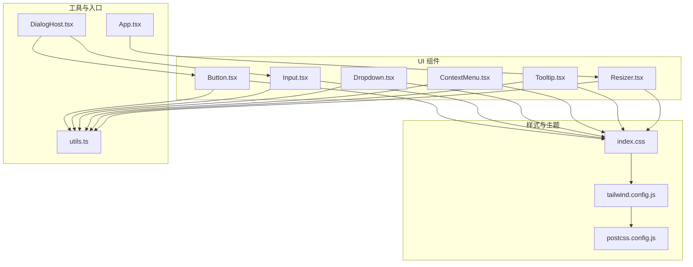
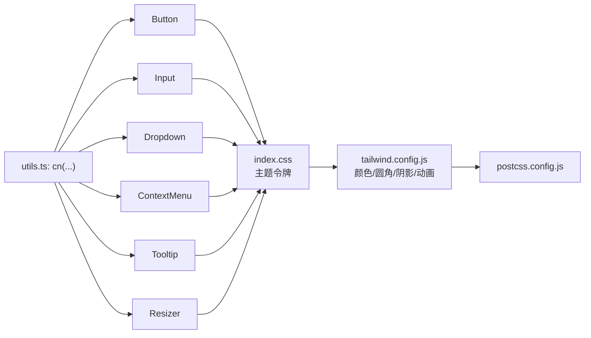
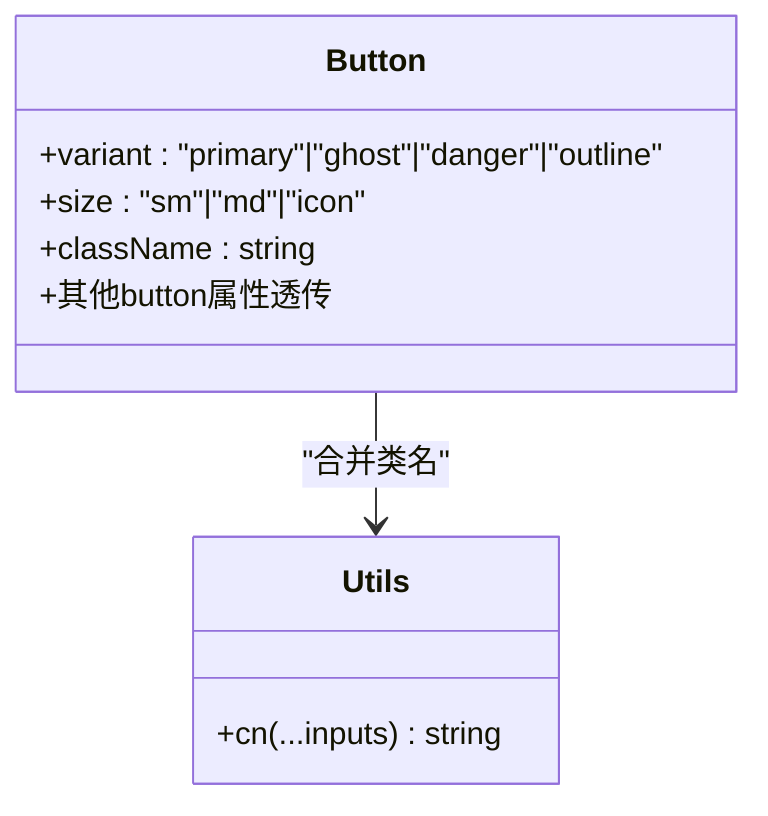
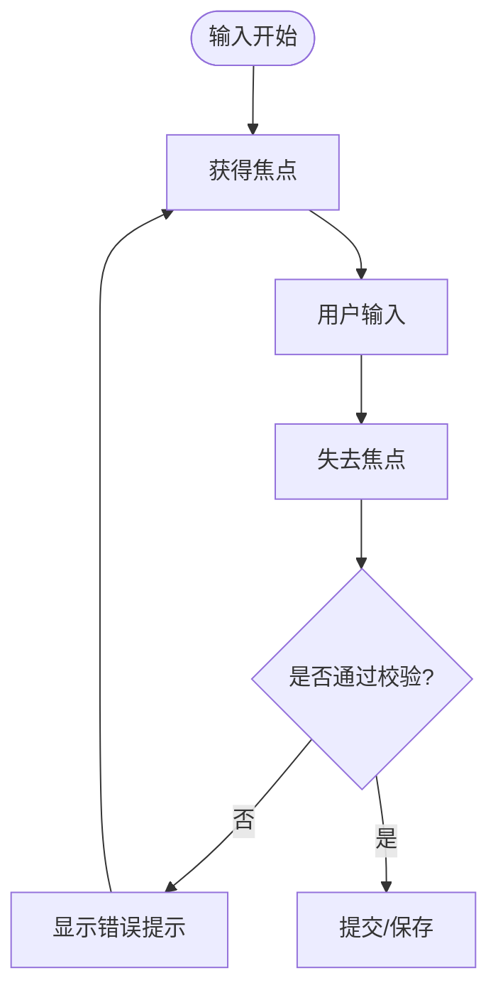
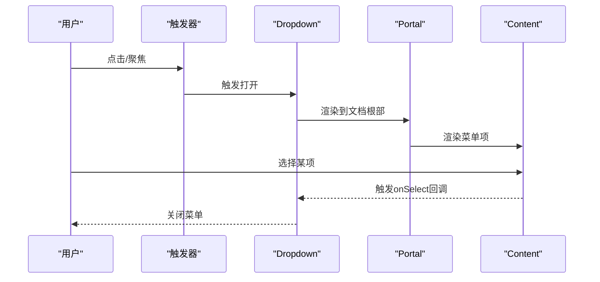
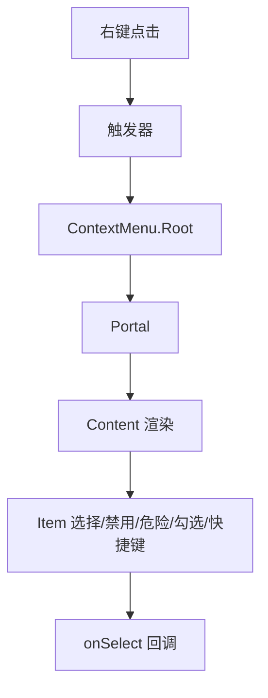
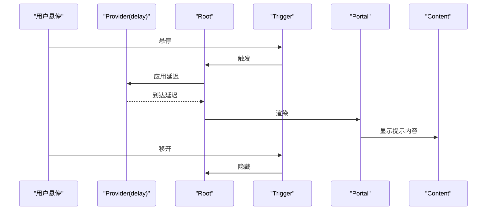
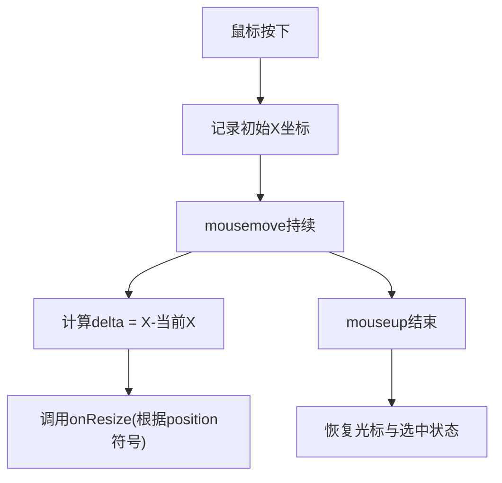
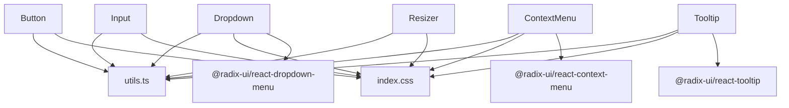

# 基础UI组件

<cite>
**本文引用的文件**
- [Button.tsx](file://src/components/ui/Button.tsx)
- [Input.tsx](file://src/components/ui/Input.tsx)
- [Dropdown.tsx](file://src/components/ui/Dropdown.tsx)
- [ContextMenu.tsx](file://src/components/ui/ContextMenu.tsx)
- [Tooltip.tsx](file://src/components/ui/Tooltip.tsx)
- [Resizer.tsx](file://src/components/ui/Resizer.tsx)
- [utils.ts](file://src/lib/utils.ts)
- [index.css](file://src/index.css)
- [tailwind.config.js](file://tailwind.config.js)
- [postcss.config.js](file://postcss.config.js)
- [App.tsx](file://src/App.tsx)
- [DialogHost.tsx](file://src/components/dialogs/DialogHost.tsx)
</cite>

## 目录
1. [引言](#引言)
2. [项目结构](#项目结构)
3. [核心组件](#核心组件)
4. [架构总览](#架构总览)
5. [详细组件分析](#详细组件分析)
6. [依赖关系分析](#依赖关系分析)
7. [性能考量](#性能考量)
8. [故障排查指南](#故障排查指南)
9. [结论](#结论)
10. [附录](#附录)

## 引言
本文件为NoteForge基础UI组件库的权威技术文档，覆盖设计理念、命名规范、属性约定与样式系统，并对关键组件进行深入解析：按钮、输入框、下拉菜单、上下文菜单、工具提示与分割器。文档同时提供最佳实践与样式定制指南，帮助开发者在保持一致性的前提下扩展与维护组件。

## 项目结构
基础UI组件集中于 src/components/ui 目录，采用“按功能分层”的组织方式：每个组件独立成文件，共享统一的样式系统与工具函数。样式系统基于Tailwind CSS，通过CSS变量定义主题令牌，并在暗/亮主题间切换；工具函数提供类名合并与通用辅助能力。

图表来源
- [Button.tsx:1-44](file://src/components/ui/Button.tsx#L1-L44)
- [Input.tsx:1-19](file://src/components/ui/Input.tsx#L1-L19)
- [Dropdown.tsx:1-64](file://src/components/ui/Dropdown.tsx#L1-L64)
- [ContextMenu.tsx:1-59](file://src/components/ui/ContextMenu.tsx#L1-L59)
- [Tooltip.tsx:1-29](file://src/components/ui/Tooltip.tsx#L1-L29)
- [Resizer.tsx:1-50](file://src/components/ui/Resizer.tsx#L1-L50)
- [utils.ts:1-100](file://src/lib/utils.ts#L1-L100)
- [index.css:1-57](file://src/index.css#L1-L57)
- [tailwind.config.js:1-90](file://tailwind.config.js#L1-L90)
- [postcss.config.js:1-6](file://postcss.config.js#L1-L6)
- [App.tsx:70-90](file://src/App.tsx#L70-L90)
- [DialogHost.tsx:120-210](file://src/components/dialogs/DialogHost.tsx#L120-L210)

章节来源
- [Button.tsx:1-44](file://src/components/ui/Button.tsx#L1-L44)
- [Input.tsx:1-19](file://src/components/ui/Input.tsx#L1-L19)
- [Dropdown.tsx:1-64](file://src/components/ui/Dropdown.tsx#L1-L64)
- [ContextMenu.tsx:1-59](file://src/components/ui/ContextMenu.tsx#L1-L59)
- [Tooltip.tsx:1-29](file://src/components/ui/Tooltip.tsx#L1-L29)
- [Resizer.tsx:1-50](file://src/components/ui/Resizer.tsx#L1-L50)
- [utils.ts:1-100](file://src/lib/utils.ts#L1-L100)
- [index.css:1-57](file://src/index.css#L1-L57)
- [tailwind.config.js:1-90](file://tailwind.config.js#L1-L90)
- [postcss.config.js:1-6](file://postcss.config.js#L1-L6)
- [App.tsx:70-90](file://src/App.tsx#L70-L90)
- [DialogHost.tsx:120-210](file://src/components/dialogs/DialogHost.tsx#L120-L210)

## 核心组件
- 按钮 Button：提供主/幽灵/危险/描边四种风格与小/中/图标三种尺寸，统一的焦点环与禁用态处理。
- 输入 Input：统一圆角、边框、背景与占位符颜色，聚焦时强调边框色，支持原生输入属性透传。
- 下拉 Dropdown：基于Radix UI，支持侧向与对齐方向、快捷键展示、选中态与危险项高亮。
- 上下文菜单 ContextMenu：右键触发，结构与下拉一致，便于在内容区快速唤起。
- 工具提示 Tooltip：可配置延迟与方位，内容区域具备阴影与淡入动画。
- 分割器 Resizer：鼠标拖拽调整面板宽度，提供视觉反馈与无障碍属性。

章节来源
- [Button.tsx:4-24](file://src/components/ui/Button.tsx#L4-L24)
- [Input.tsx:4-16](file://src/components/ui/Input.tsx#L4-L16)
- [Dropdown.tsx:6-21](file://src/components/ui/Dropdown.tsx#L6-L21)
- [ContextMenu.tsx:6-19](file://src/components/ui/ContextMenu.tsx#L6-L19)
- [Tooltip.tsx:4-9](file://src/components/ui/Tooltip.tsx#L4-L9)
- [Resizer.tsx:4-8](file://src/components/ui/Resizer.tsx#L4-L8)

## 架构总览
组件遵循“单一职责 + 可组合”原则：每个组件仅负责自身渲染与交互，通过className与透传属性与全局样式系统协作。Radix UI作为无障碍与可访问性基础设施，确保键盘导航与ARIA语义。工具函数cn用于安全合并类名，避免冲突。

图表来源
- [utils.ts:4-6](file://src/lib/utils.ts#L4-L6)
- [Button.tsx:30-37](file://src/components/ui/Button.tsx#L30-L37)
- [Input.tsx:9-13](file://src/components/ui/Input.tsx#L9-L13)
- [Dropdown.tsx:32-47](file://src/components/ui/Dropdown.tsx#L32-L47)
- [ContextMenu.tsx:27-42](file://src/components/ui/ContextMenu.tsx#L27-L42)
- [Tooltip.tsx:17-23](file://src/components/ui/Tooltip.tsx#L17-L23)
- [Resizer.tsx:38-42](file://src/components/ui/Resizer.tsx#L38-L42)
- [index.css:9-57](file://src/index.css#L9-L57)
- [tailwind.config.js:7-90](file://tailwind.config.js#L7-L90)
- [postcss.config.js:1-6](file://postcss.config.js#L1-L6)

## 详细组件分析

### 按钮 Button
- 设计理念
  - 风格变体：主色强调、幽灵轻量、危险警示、描边中性，满足不同操作意图。
  - 尺寸规格：小号适合紧凑空间，中号适合常规按钮，图标按钮用于单功能入口。
  - 状态管理：禁用态统一降权；焦点态统一环形轮廓；悬停态通过主题色hover变体增强反馈。
- 属性约定
  - 支持原生button属性透传，便于无障碍与表单集成。
  - className可叠加自定义样式，cn保证合并顺序与冲突消除。
- 事件处理
  - 由父级容器绑定onClick等事件，组件不内建业务逻辑。
- 使用示例（路径）
  - [DialogHost.tsx:120-210](file://src/components/dialogs/DialogHost.tsx#L120-L210)

图表来源
- [Button.tsx:7-10](file://src/components/ui/Button.tsx#L7-L10)
- [Button.tsx:12-24](file://src/components/ui/Button.tsx#L12-L24)
- [Button.tsx:26-41](file://src/components/ui/Button.tsx#L26-L41)
- [utils.ts:4-6](file://src/lib/utils.ts#L4-L6)

章节来源
- [Button.tsx:4-24](file://src/components/ui/Button.tsx#L4-L24)
- [Button.tsx:26-41](file://src/components/ui/Button.tsx#L26-L41)
- [DialogHost.tsx:120-210](file://src/components/dialogs/DialogHost.tsx#L120-L210)

### 输入 Input
- 设计理念
  - 统一圆角与边框，背景与文本色符合主题令牌。
  - 聚焦态强调边框色，提升可发现性。
  - 占位符文本使用弱化色，避免干扰用户输入。
- 类型与验证
  - 组件本身不内置校验逻辑，建议在上层表单或业务层进行校验与错误提示。
  - 可结合aria-*属性与外部验证库实现无障碍与实时反馈。
- 使用示例（路径）
  - [DialogHost.tsx:190-210](file://src/components/dialogs/DialogHost.tsx#L190-L210)

图表来源
- [Input.tsx:6-16](file://src/components/ui/Input.tsx#L6-L16)
- [DialogHost.tsx:190-210](file://src/components/dialogs/DialogHost.tsx#L190-L210)

章节来源
- [Input.tsx:4-16](file://src/components/ui/Input.tsx#L4-L16)
- [DialogHost.tsx:190-210](file://src/components/dialogs/DialogHost.tsx#L190-L210)

### 下拉 Dropdown
- 实现原理
  - 基于Radix UI的Dropdown Menu，支持触发器作为子节点，Portal挂载到文档根部，避免层级遮挡。
  - Content支持side与align控制方位与对齐，sideOffset提供偏移。
- 选项渲染
  - 支持分隔线、禁用、危险项、选中勾选与快捷键标签。
  - 高亮态与禁用态通过data属性自动应用。
- 键盘导航与无障碍
  - Radix UI提供默认键盘行为，支持Tab/Shift+Tab在菜单项间移动，Enter/Space选择。
- 使用示例（路径）
  - [Dropdown.tsx:23-62](file://src/components/ui/Dropdown.tsx#L23-L62)

图表来源
- [Dropdown.tsx:23-62](file://src/components/ui/Dropdown.tsx#L23-L62)

章节来源
- [Dropdown.tsx:6-21](file://src/components/ui/Dropdown.tsx#L6-L21)
- [Dropdown.tsx:23-62](file://src/components/ui/Dropdown.tsx#L23-L62)

### 上下文菜单 ContextMenu
- 触发方式
  - 右键触发，适合在内容区快速弹出操作菜单。
- 菜单项配置
  - 结构与下拉一致，支持分隔线、禁用、危险项、选中与快捷键。
- 定位与动画
  - Portal挂载与淡入动画同下拉，确保在任意容器内稳定呈现。
- 使用示例（路径）
  - [ContextMenu.tsx:21-57](file://src/components/ui/ContextMenu.tsx#L21-L57)

图表来源
- [ContextMenu.tsx:21-57](file://src/components/ui/ContextMenu.tsx#L21-L57)

章节来源
- [ContextMenu.tsx:6-19](file://src/components/ui/ContextMenu.tsx#L6-L19)
- [ContextMenu.tsx:21-57](file://src/components/ui/ContextMenu.tsx#L21-L57)

### 工具提示 Tooltip
- 延迟显示
  - 通过Provider的delayDuration控制显示延迟，默认200ms，避免频繁闪烁。
- 位置计算
  - side与sideOffset决定方位与偏移，Portal保证在任何布局下稳定显示。
- 响应式适配
  - 内容最大宽度受max-w-xs约束，确保窄屏下可读性。
- 使用示例（路径）
  - [Tooltip.tsx:11-28](file://src/components/ui/Tooltip.tsx#L11-L28)

图表来源
- [Tooltip.tsx:11-28](file://src/components/ui/Tooltip.tsx#L11-L28)

章节来源
- [Tooltip.tsx:4-9](file://src/components/ui/Tooltip.tsx#L4-L9)
- [Tooltip.tsx:11-28](file://src/components/ui/Tooltip.tsx#L11-L28)

### 分割器 Resizer
- 拖拽交互
  - 鼠标按下记录初始坐标，移动时计算delta并回调onResize；抬起结束。
  - 支持左右两侧，左拖负增量、右拖正增量，直观反映宽度变化。
- 最小尺寸限制
  - 由调用方在回调中自行约束最小值，组件不强制边界。
- 视觉反馈
  - active态改变背景色，提供col-resize光标与禁止选中文本的视觉提示。
- 使用示例（路径）
  - [App.tsx:70-90](file://src/App.tsx#L70-L90)

图表来源
- [Resizer.tsx:10-32](file://src/components/ui/Resizer.tsx#L10-L32)
- [Resizer.tsx:34-49](file://src/components/ui/Resizer.tsx#L34-L49)

章节来源
- [Resizer.tsx:4-8](file://src/components/ui/Resizer.tsx#L4-L8)
- [Resizer.tsx:10-32](file://src/components/ui/Resizer.tsx#L10-L32)
- [Resizer.tsx:34-49](file://src/components/ui/Resizer.tsx#L34-L49)
- [App.tsx:70-90](file://src/App.tsx#L70-L90)

## 依赖关系分析
- 组件到工具
  - 所有组件均依赖utils.ts中的cn进行类名合并，确保样式一致性与可维护性。
- 组件到样式
  - 组件类名广泛使用bg/surface/text/border/accent等主题变量，最终由index.css与tailwind.config.js映射为CSS变量。
- 组件到第三方
  - Dropdown与ContextMenu依赖@radix-ui/react-*，提供无障碍与可访问性保障。
- 组件到宿主
  - Resizer在App.tsx中被用于侧栏与右侧区域的宽度动态调整。

图表来源
- [Button.tsx:1-2](file://src/components/ui/Button.tsx#L1-L2)
- [Input.tsx:1-2](file://src/components/ui/Input.tsx#L1-L2)
- [Dropdown.tsx:1-1](file://src/components/ui/Dropdown.tsx#L1-L1)
- [ContextMenu.tsx:1-1](file://src/components/ui/ContextMenu.tsx#L1-L1)
- [Tooltip.tsx:1-1](file://src/components/ui/Tooltip.tsx#L1-L1)
- [utils.ts:1-6](file://src/lib/utils.ts#L1-L6)
- [index.css:1-57](file://src/index.css#L1-L57)
- [tailwind.config.js:1-90](file://tailwind.config.js#L1-L90)

章节来源
- [Button.tsx:1-2](file://src/components/ui/Button.tsx#L1-L2)
- [Input.tsx:1-2](file://src/components/ui/Input.tsx#L1-L2)
- [Dropdown.tsx:1-1](file://src/components/ui/Dropdown.tsx#L1-L1)
- [ContextMenu.tsx:1-1](file://src/components/ui/ContextMenu.tsx#L1-L1)
- [Tooltip.tsx:1-1](file://src/components/ui/Tooltip.tsx#L1-L1)
- [utils.ts:1-6](file://src/lib/utils.ts#L1-L6)
- [index.css:1-57](file://src/index.css#L1-L57)
- [tailwind.config.js:1-90](file://tailwind.config.js#L1-L90)

## 性能考量
- 渲染优化
  - 组件尽量无状态或少量状态，减少重渲染。下拉与上下文菜单使用Portal避免不必要的DOM树深度。
  - Tooltip的Provider延迟仅在首次触发生效，避免频繁创建/销毁。
- 事件处理
  - Resizer在active期间注册全局mouse事件，注意在卸载时清理，防止内存泄漏。
- 样式系统
  - Tailwind生成的类名体积可控，配合cn合并可避免重复样式导致的抖动。

## 故障排查指南
- 样式未生效
  - 检查主题变量是否正确注入至:root与.dark类，确认index.css已加载且tailwind.config.js未屏蔽相关颜色/动画。
- 焦点环不可见
  - 确认Button的focus-visible:outline-none与focus-visible:ring-*规则未被覆盖。
- 下拉/上下文菜单位置异常
  - 检查父容器overflow与定位，必要时调整Portal挂载目标或Content的side/align/offset。
- Tooltip不显示
  - 确认Provider的delayDuration设置合理，且Trigger包裹了可交互元素。
- 分割器拖拽无效
  - 检查onResize回调是否更新父级宽度状态，确保active期间未被意外重置。

章节来源
- [index.css:9-57](file://src/index.css#L9-L57)
- [tailwind.config.js:7-90](file://tailwind.config.js#L7-L90)
- [Button.tsx:30-37](file://src/components/ui/Button.tsx#L30-L37)
- [Dropdown.tsx:28-32](file://src/components/ui/Dropdown.tsx#L28-L32)
- [ContextMenu.tsx:26-28](file://src/components/ui/ContextMenu.tsx#L26-L28)
- [Tooltip.tsx:13-13](file://src/components/ui/Tooltip.tsx#L13-L13)
- [Resizer.tsx:14-32](file://src/components/ui/Resizer.tsx#L14-L32)

## 结论
该UI组件库以简洁、一致与可访问为核心，通过主题令牌与Tailwind实现跨主题的一致外观，借助Radix UI保障键盘与无障碍体验。组件职责清晰、接口统一，便于在复杂工作台中复用与扩展。

## 附录

### 设计理念与命名规范
- 组件分类
  - 控件类：Button、Input、Dropdown、ContextMenu、Tooltip、Resizer
- 属性约定
  - className可叠加；其余原生属性透传；必要时提供variant/size/align等枚举型属性
- 样式系统
  - 主题令牌：背景/表面/边框/文本/强调色/阴影/动画
  - 圆角与间距：sm/md/lx/xl与1-10等步进
  - 字体族：无衬线与等宽字体，字号xs/sm/base/md/lg/xl/2xl

章节来源
- [index.css:9-57](file://src/index.css#L9-L57)
- [tailwind.config.js:37-90](file://tailwind.config.js#L37-L90)

### 最佳实践与样式定制指南
- 最佳实践
  - 使用Button的variant明确操作意图；Icon尺寸用于工具栏微交互。
  - Input在表单中配合外部校验库与aria-*属性，提供即时反馈。
  - Dropdown/ContextMenu的items统一结构，danger项谨慎使用。
  - Tooltip仅用于简短说明，避免长篇文案。
  - Resizer的回调中加入节流与最小尺寸保护。
- 样式定制
  - 通过className叠加自定义类名；避免直接覆盖主题变量。
  - 如需新增尺寸/风格，优先扩展枚举与映射表，保持一致性。

章节来源
- [Button.tsx:4-24](file://src/components/ui/Button.tsx#L4-L24)
- [Input.tsx:6-16](file://src/components/ui/Input.tsx#L6-L16)
- [Dropdown.tsx:6-14](file://src/components/ui/Dropdown.tsx#L6-L14)
- [ContextMenu.tsx:6-14](file://src/components/ui/ContextMenu.tsx#L6-L14)
- [Tooltip.tsx:11-28](file://src/components/ui/Tooltip.tsx#L11-L28)
- [Resizer.tsx:14-32](file://src/components/ui/Resizer.tsx#L14-L32)
- [utils.ts:4-6](file://src/lib/utils.ts#L4-L6)