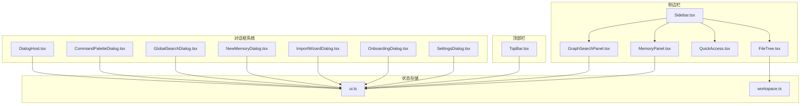
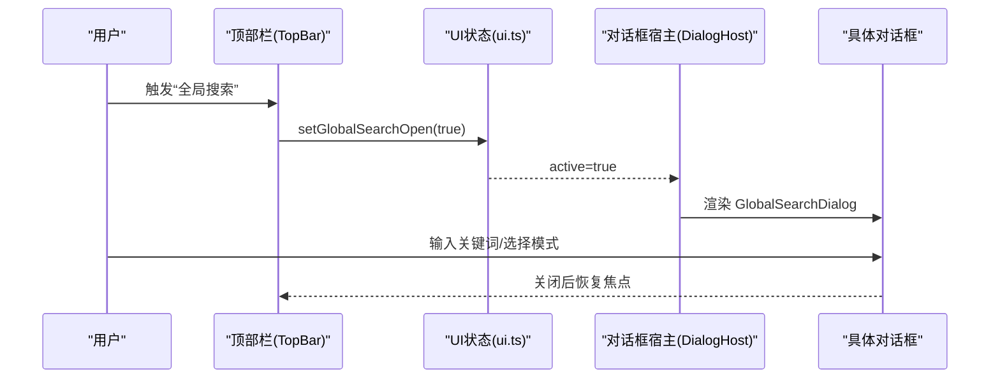
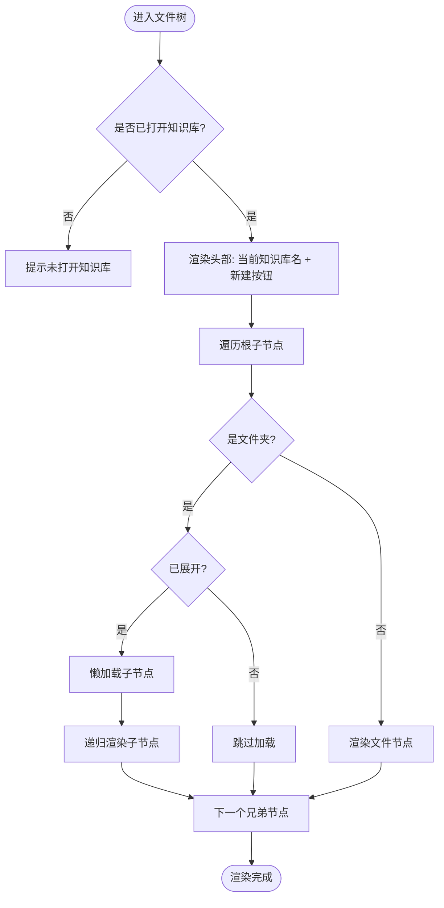
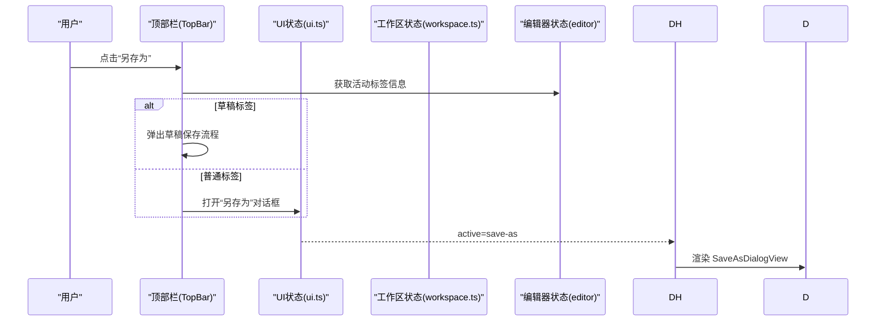
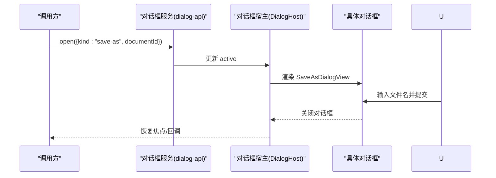
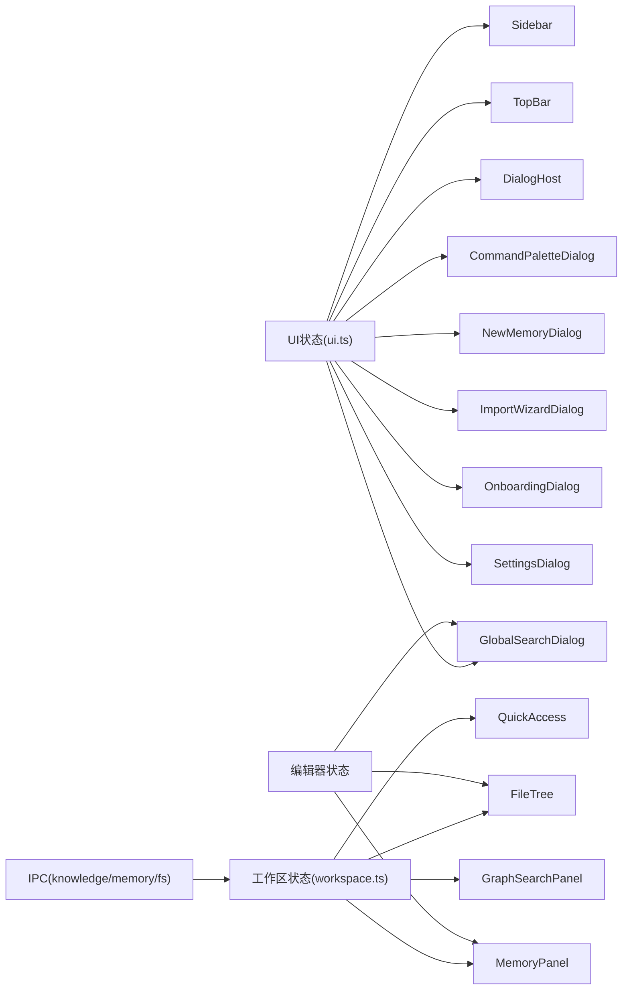

# 导航组件

<cite>
**本文引用的文件**
- [Sidebar.tsx](file://src/components/sidebar/Sidebar.tsx)
- [FileTree.tsx](file://src/components/sidebar/FileTree.tsx)
- [QuickAccess.tsx](file://src/components/sidebar/QuickAccess.tsx)
- [MemoryPanel.tsx](file://src/components/sidebar/MemoryPanel.tsx)
- [GraphSearchPanel.tsx](file://src/components/sidebar/GraphSearchPanel.tsx)
- [TopBar.tsx](file://src/components/topbar/TopBar.tsx)
- [DialogHost.tsx](file://src/components/dialogs/DialogHost.tsx)
- [CommandPaletteDialog.tsx](file://src/components/dialogs/CommandPaletteDialog.tsx)
- [GlobalSearchDialog.tsx](file://src/components/dialogs/GlobalSearchDialog.tsx)
- [NewMemoryDialog.tsx](file://src/components/dialogs/NewMemoryDialog.tsx)
- [ImportWizardDialog.tsx](file://src/components/dialogs/ImportWizardDialog.tsx)
- [OnboardingDialog.tsx](file://src/components/dialogs/OnboardingDialog.tsx)
- [SettingsDialog.tsx](file://src/components/dialogs/SettingsDialog.tsx)
- [ui.ts](file://src/store/ui.ts)
- [workspace.ts](file://src/store/workspace.ts)
</cite>

## 目录
1. [简介](#简介)
2. [项目结构](#项目结构)
3. [核心组件](#核心组件)
4. [架构总览](#架构总览)
5. [详细组件分析](#详细组件分析)
6. [依赖关系分析](#依赖关系分析)
7. [性能考量](#性能考量)
8. [故障排查指南](#故障排查指南)
9. [结论](#结论)
10. [附录](#附录)

## 简介
本文件系统性梳理 NoteForge 的导航组件体系，涵盖侧边栏架构（文件树、快速访问、内存面板、图搜索面板）、顶部栏设计（应用菜单、全局搜索、用户状态与系统通知入口）、以及对话框宿主系统（模态对话框生命周期、堆栈控制与焦点管理）。文档同时给出各组件间通信机制与状态同步方式、定制化指南与最佳实践，帮助开发者与产品人员高效理解与扩展导航子系统。

## 项目结构
导航相关代码主要分布在以下模块：
- 侧边栏：Sidebar、FileTree、QuickAccess、MemoryPanel、GraphSearchPanel
- 顶部栏：TopBar
- 对话框宿主与各类对话框：DialogHost、CommandPaletteDialog、GlobalSearchDialog、NewMemoryDialog、ImportWizardDialog、OnboardingDialog、SettingsDialog
- 状态存储：UI 状态（ui.ts）、工作区状态（workspace.ts）

图表来源
- [Sidebar.tsx:18-69](file://src/components/sidebar/Sidebar.tsx#L18-L69)
- [FileTree.tsx:175-242](file://src/components/sidebar/FileTree.tsx#L175-L242)
- [QuickAccess.tsx:28-65](file://src/components/sidebar/QuickAccess.tsx#L28-L65)
- [MemoryPanel.tsx:13-176](file://src/components/sidebar/MemoryPanel.tsx#L13-L176)
- [GraphSearchPanel.tsx:9-109](file://src/components/sidebar/GraphSearchPanel.tsx#L9-L109)
- [TopBar.tsx:22-208](file://src/components/topbar/TopBar.tsx#L22-L208)
- [DialogHost.tsx:25-48](file://src/components/dialogs/DialogHost.tsx#L25-L48)
- [CommandPaletteDialog.tsx:9-100](file://src/components/dialogs/CommandPaletteDialog.tsx#L9-L100)
- [GlobalSearchDialog.tsx:12-161](file://src/components/dialogs/GlobalSearchDialog.tsx#L12-L161)
- [NewMemoryDialog.tsx:8-123](file://src/components/dialogs/NewMemoryDialog.tsx#L8-L123)
- [ImportWizardDialog.tsx:14-182](file://src/components/dialogs/ImportWizardDialog.tsx#L14-L182)
- [OnboardingDialog.tsx:7-82](file://src/components/dialogs/OnboardingDialog.tsx#L7-L82)
- [SettingsDialog.tsx:10-167](file://src/components/dialogs/SettingsDialog.tsx#L10-L167)
- [ui.ts:3-85](file://src/store/ui.ts#L3-L85)
- [workspace.ts:38-157](file://src/store/workspace.ts#L38-L157)

章节来源
- [Sidebar.tsx:18-69](file://src/components/sidebar/Sidebar.tsx#L18-L69)
- [TopBar.tsx:22-208](file://src/components/topbar/TopBar.tsx#L22-L208)
- [DialogHost.tsx:25-48](file://src/components/dialogs/DialogHost.tsx#L25-L48)
- [ui.ts:3-85](file://src/store/ui.ts#L3-L85)
- [workspace.ts:38-157](file://src/store/workspace.ts#L38-L157)

## 核心组件
- 侧边栏容器与模式切换：Sidebar 提供图标式模式切换（文件树、Agent 记忆、知识图谱·搜索），并联动设置入口。
- 文件树：递归渲染文件/文件夹，支持展开/折叠、重命名、新建、删除、刷新等操作。
- 快速访问：基于本地存储的固定快捷入口，支持默认值与持久化。
- 内存面板：Agent 记忆的导入、筛选、排序、批量操作与时间线视图。
- 图搜索面板：标签云过滤、全局搜索入口、知识图谱打开入口。
- 顶部栏：应用菜单、全局搜索、文件/视图/工具菜单、搜索按钮、保存、主题切换、右侧面板开关。
- 对话框宿主：集中管理模态对话框生命周期、堆栈与焦点，按 kind 分发具体对话框。
- UI 状态存储：统一管理侧边栏/右侧面板开关与模式、搜索与对话框开关、引导状态等。
- 工作区状态存储：文件树数据、展开集合、最近工作区、文件操作接口。

章节来源
- [Sidebar.tsx:18-69](file://src/components/sidebar/Sidebar.tsx#L18-L69)
- [FileTree.tsx:175-242](file://src/components/sidebar/FileTree.tsx#L175-L242)
- [QuickAccess.tsx:28-65](file://src/components/sidebar/QuickAccess.tsx#L28-L65)
- [MemoryPanel.tsx:13-176](file://src/components/sidebar/MemoryPanel.tsx#L13-L176)
- [GraphSearchPanel.tsx:9-109](file://src/components/sidebar/GraphSearchPanel.tsx#L9-L109)
- [TopBar.tsx:22-208](file://src/components/topbar/TopBar.tsx#L22-L208)
- [DialogHost.tsx:25-48](file://src/components/dialogs/DialogHost.tsx#L25-L48)
- [ui.ts:3-85](file://src/store/ui.ts#L3-L85)
- [workspace.ts:38-157](file://src/store/workspace.ts#L38-L157)

## 架构总览
导航组件围绕“状态驱动 + 组件解耦”的原则构建：
- UI 状态（ui.ts）集中管理可见性与模式，组件通过 store 订阅与更新。
- 工作区状态（workspace.ts）封装文件系统与索引能力，文件树与编辑器交互由此驱动。
- 对话框宿主（DialogHost.tsx）以单一入口统一调度多种对话框，避免重复逻辑与焦点问题。
- 顶部栏作为全局入口，触发 UI 状态与对话框状态切换。

图表来源
- [TopBar.tsx:175-181](file://src/components/topbar/TopBar.tsx#L175-L181)
- [ui.ts:72-74](file://src/store/ui.ts#L72-L74)
- [DialogHost.tsx:25-48](file://src/components/dialogs/DialogHost.tsx#L25-L48)
- [GlobalSearchDialog.tsx:12-161](file://src/components/dialogs/GlobalSearchDialog.tsx#L12-L161)

## 详细组件分析

### 侧边栏与文件树
- 模式与布局
  - Sidebar 使用图标栏进行模式切换，联动设置按钮与 QuickAccess/FileTree/MemoryPanel/GraphSearchPanel 的内容区。
  - 通过 UI 状态控制当前模式与侧边栏开关。
- 文件树
  - 数据结构：FileEntry 递归树，支持 isDir、children、path、name、language 等字段。
  - 展开/折叠：维护 expandedDirs 集合，点击文件夹切换；懒加载子节点。
  - 编辑操作：重命名、新建文件/文件夹、删除、刷新；与工作区状态交互。
  - 语言图标：根据 language 返回不同图标或占位符。
  - 双击打开文件、右键下拉菜单提供上下文操作。
- 快速访问
  - 基于本地存储持久化固定条目，支持默认值初始化。
  - 点击打开对应文件，用于高频入口。
- 内存面板
  - 列表/时间线视图切换、按 Agent 过滤、按时间/重要度排序。
  - 批量选择、加标签、删除；支持导入向导与新建记忆入口。
  - 时间线分组：今日/昨日/本周更早/更早。
- 图搜索面板
  - 标签云过滤、输入框模糊匹配、统计字号映射。
  - 结果按标签组合过滤，点击打开文件；提供全局搜索与知识图谱入口。

图表来源
- [FileTree.tsx:175-242](file://src/components/sidebar/FileTree.tsx#L175-L242)
- [workspace.ts:87-130](file://src/store/workspace.ts#L87-L130)

章节来源
- [Sidebar.tsx:18-69](file://src/components/sidebar/Sidebar.tsx#L18-L69)
- [FileTree.tsx:175-242](file://src/components/sidebar/FileTree.tsx#L175-L242)
- [QuickAccess.tsx:28-65](file://src/components/sidebar/QuickAccess.tsx#L28-L65)
- [MemoryPanel.tsx:13-176](file://src/components/sidebar/MemoryPanel.tsx#L13-L176)
- [GraphSearchPanel.tsx:9-109](file://src/components/sidebar/GraphSearchPanel.tsx#L9-L109)
- [workspace.ts:38-157](file://src/store/workspace.ts#L38-L157)

### 顶部栏设计
- 应用菜单：显示当前知识库与最近工作区，支持打开新路径。
- 全局搜索：顶部搜索按钮与工具菜单项均可打开全局搜索对话框。
- 文件/视图/工具菜单：提供新建、保存、另存为、分屏、主题切换、打开侧边栏/右侧面板、新建/导入记忆等常用动作。
- 用户状态与系统通知：通过 UI 状态控制设置与引导对话框，主题切换按钮展示当前模式。

图表来源
- [TopBar.tsx:90-109](file://src/components/topbar/TopBar.tsx#L90-L109)
- [DialogHost.tsx:139-216](file://src/components/dialogs/DialogHost.tsx#L139-L216)
- [ui.ts:72-74](file://src/store/ui.ts#L72-L74)

章节来源
- [TopBar.tsx:22-208](file://src/components/topbar/TopBar.tsx#L22-L208)
- [ui.ts:3-85](file://src/store/ui.ts#L3-L85)
- [workspace.ts:38-157](file://src/store/workspace.ts#L38-L157)

### 对话框宿主系统
- 生命周期管理
  - 依据 active.kind 渲染对应对话框，支持 confirm-close、save-as、conflict、draft-restore-conflict、save-conflict、close-pane、confirm-delete 等。
  - 关闭时统一调用 getCore().dialog.closeTop()，保证堆栈一致性。
- 堆栈控制与焦点
  - 顶层对话框阻断底层交互；onOpenChange 回调负责取消/继续队列或关闭。
  - 保存类对话框在提交后关闭自身，确保焦点回到编辑器或调用方。
- 典型流程
  - 未保存关闭：提供保存/不保存/取消三选，必要时推进应用退出队列。
  - 另存为：校验文件名、扩展名、路径分隔符，拼接工作区路径后执行保存。
  - 冲突处理：磁盘变更冲突、草稿恢复冲突、保存冲突分别提供选项卡式处理。

图表来源
- [DialogHost.tsx:25-48](file://src/components/dialogs/DialogHost.tsx#L25-L48)
- [DialogHost.tsx:139-216](file://src/components/dialogs/DialogHost.tsx#L139-L216)

章节来源
- [DialogHost.tsx:25-48](file://src/components/dialogs/DialogHost.tsx#L25-L48)
- [DialogHost.tsx:139-216](file://src/components/dialogs/DialogHost.tsx#L139-L216)
- [DialogHost.tsx:250-331](file://src/components/dialogs/DialogHost.tsx#L250-L331)
- [DialogHost.tsx:333-379](file://src/components/dialogs/DialogHost.tsx#L333-L379)
- [DialogHost.tsx:381-433](file://src/components/dialogs/DialogHost.tsx#L381-L433)
- [DialogHost.tsx:435-466](file://src/components/dialogs/DialogHost.tsx#L435-L466)

### 对话框组件一览
- 命令面板
  - 支持查询、键盘导航、快捷键展示；执行命令后关闭。
- 全局搜索
  - 支持按文件名/全文/标签三种模式；高亮匹配片段；打开文件。
- 新建记忆
  - 选择 Agent/类型，填写标题/内容/标签，提交后清空并关闭。
- 导入向导
  - 三步流程：源目录选择与检测、Agent 映射、确认与导入；支持保留副本与自动解析。
- 引导对话
  - 多步引导，首次打开时展示；完成后标记已引导。
- 设置对话
  - 主题模式切换；AI Provider 与模型配置；连接测试与状态指示。

章节来源
- [CommandPaletteDialog.tsx:9-100](file://src/components/dialogs/CommandPaletteDialog.tsx#L9-L100)
- [GlobalSearchDialog.tsx:12-161](file://src/components/dialogs/GlobalSearchDialog.tsx#L12-L161)
- [NewMemoryDialog.tsx:8-123](file://src/components/dialogs/NewMemoryDialog.tsx#L8-L123)
- [ImportWizardDialog.tsx:14-182](file://src/components/dialogs/ImportWizardDialog.tsx#L14-L182)
- [OnboardingDialog.tsx:7-82](file://src/components/dialogs/OnboardingDialog.tsx#L7-L82)
- [SettingsDialog.tsx:10-167](file://src/components/dialogs/SettingsDialog.tsx#L10-L167)

## 依赖关系分析
- 组件耦合
  - Sidebar 与 UI 状态强耦合，通过 setSidebarMode 控制内容区。
  - FileTree 与工作区状态强耦合，依赖 tree、expandedDirs、文件操作接口。
  - 各对话框与 UI 状态耦合，通过 setXxxOpen 切换显示。
- 外部依赖
  - IPC 接口：knowledge（索引/搜索/标签）、memory（Agent 记忆）、fs（文件系统）。
  - 编辑器状态：打开文件、保存、分屏等能力由编辑器 store 提供。
- 状态同步
  - UI 状态统一管理可见性与模式；工作区状态统一管理文件树与操作；两者通过 store 订阅实现解耦。

图表来源
- [ui.ts:3-85](file://src/store/ui.ts#L3-L85)
- [workspace.ts:38-157](file://src/store/workspace.ts#L38-L157)
- [Sidebar.tsx:18-69](file://src/components/sidebar/Sidebar.tsx#L18-L69)
- [TopBar.tsx:22-208](file://src/components/topbar/TopBar.tsx#L22-L208)
- [DialogHost.tsx:25-48](file://src/components/dialogs/DialogHost.tsx#L25-L48)
- [FileTree.tsx:175-242](file://src/components/sidebar/FileTree.tsx#L175-L242)
- [MemoryPanel.tsx:13-176](file://src/components/sidebar/MemoryPanel.tsx#L13-L176)
- [GraphSearchPanel.tsx:9-109](file://src/components/sidebar/GraphSearchPanel.tsx#L9-L109)

章节来源
- [ui.ts:3-85](file://src/store/ui.ts#L3-L85)
- [workspace.ts:38-157](file://src/store/workspace.ts#L38-L157)

## 性能考量
- 文件树懒加载
  - 仅对已展开目录加载子节点，减少初次渲染与内存占用。
- 标签云与搜索
  - 图搜索面板对标签云采用一次性获取与前端过滤，注意大数据集下的渲染压力。
- 对话框渲染
  - 宿主按需渲染单一对话框，避免多层叠加导致的重绘成本。
- 状态订阅
  - 使用 zustand 的细粒度订阅，避免不必要的重渲染。

## 故障排查指南
- 无法打开知识库
  - 检查工作区状态 openWorkspace 是否抛错；确认路径有效且具备读取权限。
- 文件树空白
  - 确认已打开知识库；检查 refreshTree 是否正常；展开集合 expandedDirs 是否包含根路径。
- 对话框无法关闭
  - 确认 onOpenChange 回调是否正确关闭；检查 active 是否被重置。
- 另存为失败
  - 校验文件名合法性（不含路径分隔符）、扩展名推断、目标路径拼接；查看错误提示。
- 冲突处理
  - 根据冲突类型选择“从磁盘重新加载/保留本地/覆盖磁盘”，必要时同步编辑器内容。

章节来源
- [workspace.ts:61-84](file://src/store/workspace.ts#L61-L84)
- [DialogHost.tsx:139-216](file://src/components/dialogs/DialogHost.tsx#L139-L216)
- [DialogHost.tsx:333-379](file://src/components/dialogs/DialogHost.tsx#L333-L379)

## 结论
NoteForge 的导航组件以清晰的状态分层与组件解耦为核心设计，结合 IPC 能力实现文件系统与知识图谱的无缝集成。对话框宿主系统统一管理生命周期与焦点，提升用户体验与开发效率。通过本文档的架构与实现分析，读者可以快速定位关键实现点并进行定制化扩展。

## 附录
- 定制化指南
  - 新增侧边栏模式：在 UI 状态中新增枚举值与切换逻辑，在 Sidebar 中添加图标与内容区。
  - 新增对话框：在 UI 状态中新增开关，在 DialogHost 中按 kind 分发，并在对应组件中实现交互。
  - 文件树扩展：在工作区状态中补充所需接口，文件树组件中增加渲染与交互逻辑。
- 最佳实践
  - 保持状态单一事实源，避免跨组件直接共享状态。
  - 对大列表与复杂渲染使用懒加载与虚拟化策略。
  - 对外设事件与 IPC 回调进行异常捕获与降级处理。
  - 对话框交互遵循“可取消、可恢复、可回退”的设计原则。