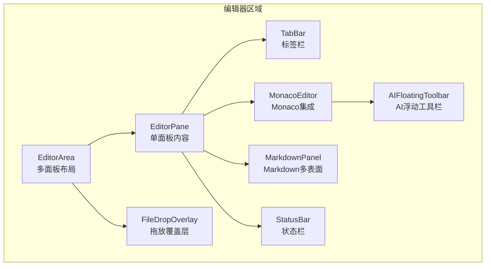
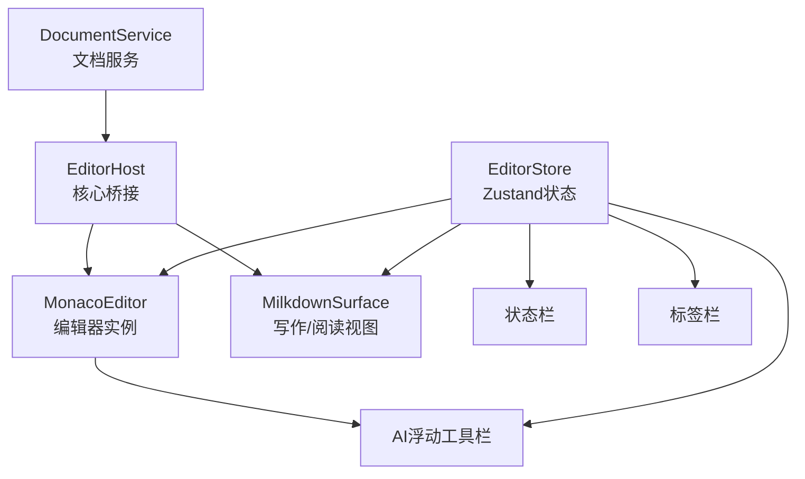
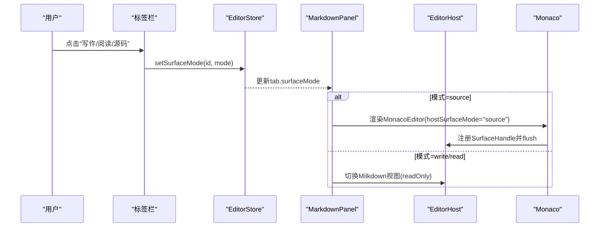
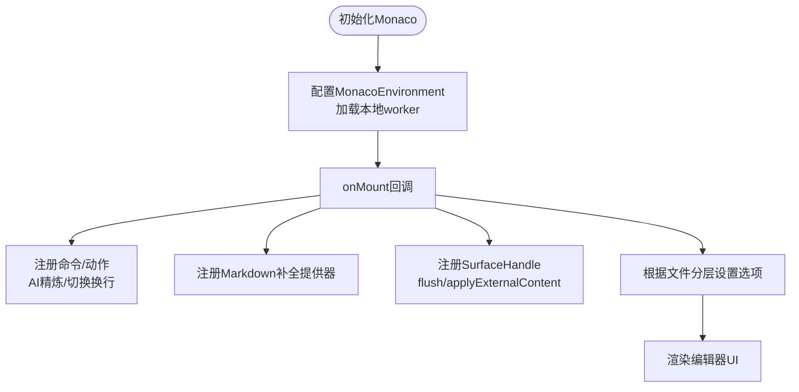
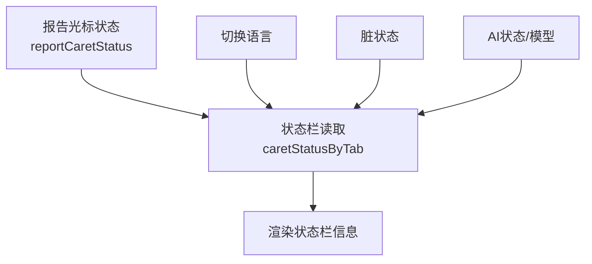
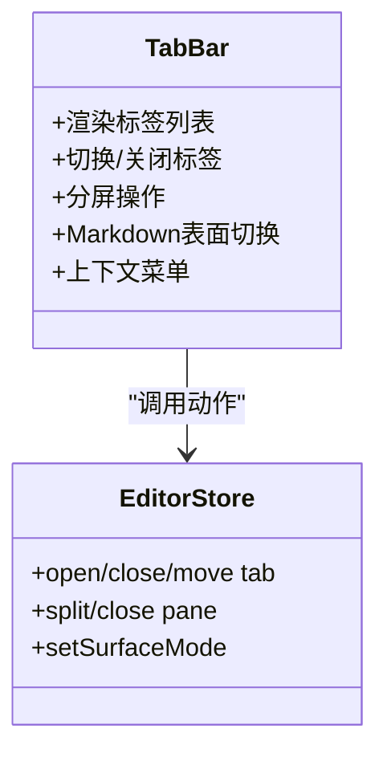
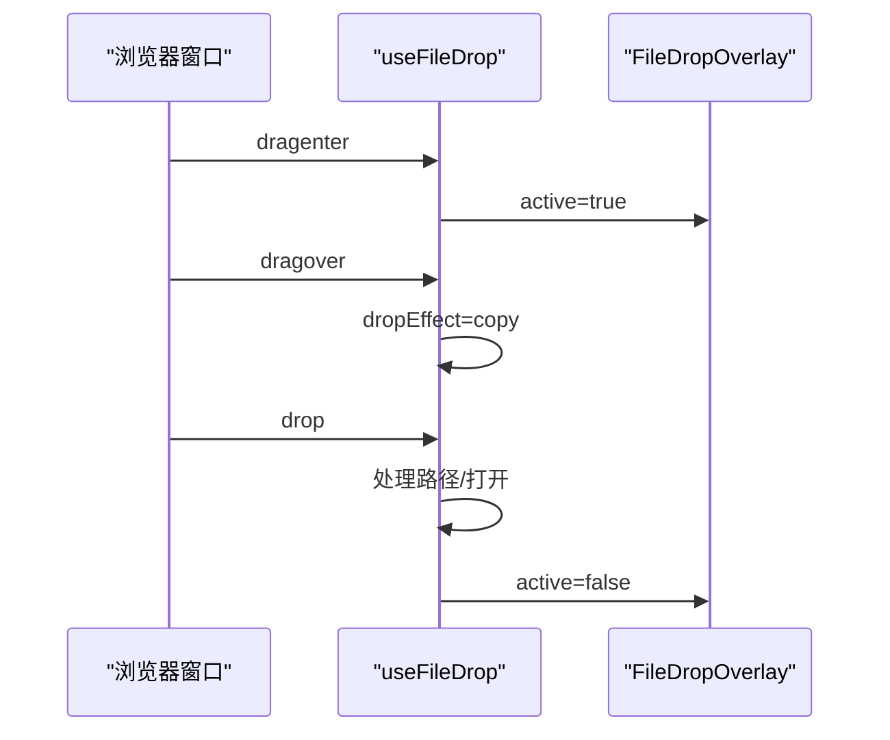
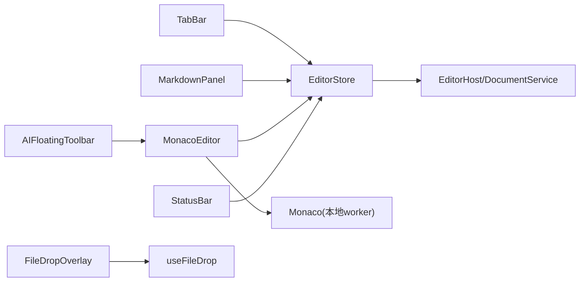

# 编辑器组件

<cite>
**本文引用的文件**
- [EditorArea.tsx](file://src/components/editor/EditorArea.tsx)
- [MonacoEditor.tsx](file://src/components/editor/MonacoEditor.tsx)
- [AIFloatingToolbar.tsx](file://src/components/editor/AIFloatingToolbar.tsx)
- [StatusBar.tsx](file://src/components/editor/StatusBar.tsx)
- [TabBar.tsx](file://src/components/editor/TabBar.tsx)
- [FileDropOverlay.tsx](file://src/components/editor/FileDropOverlay.tsx)
- [monaco-setup.ts](file://src/lib/monaco-setup.ts)
- [editor.ts](file://src/store/editor.ts)
- [editor-doc.ts](file://src/lib/editor-doc.ts)
- [editor-caret-status.ts](file://src/lib/editor-caret-status.ts)
- [surface-mode.ts](file://src/lib/surface-mode.ts)
- [MarkdownPanel.tsx](file://src/features/markdown/MarkdownPanel.tsx)
- [useFileDrop.ts](file://src/hooks/useFileDrop.ts)
- [file-tier.ts](file://src/core/document/file-tier.ts)
</cite>

## 目录
1. [简介](#简介)
2. [项目结构](#项目结构)
3. [核心组件](#核心组件)
4. [架构总览](#架构总览)
5. [详细组件分析](#详细组件分析)
6. [依赖关系分析](#依赖关系分析)
7. [性能考量](#性能考量)
8. [故障排查指南](#故障排查指南)
9. [结论](#结论)
10. [附录](#附录)

## 简介
本文件面向NoteForge编辑器组件，系统性梳理编辑器区域的架构与实现，重点覆盖：
- 多模式编辑支持（写作、阅读、源码模式）的实现原理与切换机制
- Monaco编辑器的集成方式（配置项、插件系统、自定义扩展）
- AI浮动工具栏的设计与实现（智能建议触发、上下文感知、体验优化）
- 状态栏功能（光标位置、选区统计、编码/换行符、语言、脏状态、AI状态等）
- 标签栏系统（多标签页管理、切换、关闭、分屏、拖拽重排）
- 文件拖放覆盖层的交互流程
- 配置指南、性能优化建议与常见问题处理

## 项目结构
编辑器相关模块主要位于src/components/editor与src/features/markdown目录，并通过src/store/editor集中管理状态；Monaco编辑器通过自定义加载器与工作线程确保离线可用与性能。

图表来源
- [EditorArea.tsx:27-65](file://src/components/editor/EditorArea.tsx#L27-L65)
- [TabBar.tsx:301-439](file://src/components/editor/TabBar.tsx#L301-L439)
- [MonacoEditor.tsx:353-408](file://src/components/editor/MonacoEditor.tsx#L353-L408)
- [MarkdownPanel.tsx:19-59](file://src/features/markdown/MarkdownPanel.tsx#L19-L59)
- [AIFloatingToolbar.tsx:20-116](file://src/components/editor/AIFloatingToolbar.tsx#L20-L116)
- [StatusBar.tsx:34-157](file://src/components/editor/StatusBar.tsx#L34-L157)
- [FileDropOverlay.tsx:7-24](file://src/components/editor/FileDropOverlay.tsx#L7-L24)

章节来源
- [EditorArea.tsx:1-66](file://src/components/editor/EditorArea.tsx#L1-L66)
- [TabBar.tsx:1-440](file://src/components/editor/TabBar.tsx#L1-L440)
- [MonacoEditor.tsx:1-434](file://src/components/editor/MonacoEditor.tsx#L1-L434)
- [MarkdownPanel.tsx:1-60](file://src/features/markdown/MarkdownPanel.tsx#L1-L60)
- [AIFloatingToolbar.tsx:1-117](file://src/components/editor/AIFloatingToolbar.tsx#L1-L117)
- [StatusBar.tsx:1-163](file://src/components/editor/StatusBar.tsx#L1-L163)
- [FileDropOverlay.tsx:1-25](file://src/components/editor/FileDropOverlay.tsx#L1-L25)

## 核心组件
- 编辑器区域容器：负责多面板布局与激活面板切换
- 标签栏：管理标签页集合、切换、关闭、分屏、上下文菜单与Markdown表面模式切换
- Monaco编辑器：提供语法高亮、智能提示、主题适配、大文件降级、AI动作与浮动工具栏
- Markdown多表面：写作（Milkdown）、阅读（只读Milkdown）、源码（Monaco）三态切换
- AI浮动工具栏：基于选区上下文的快速AI操作入口
- 状态栏：显示光标位置、选区统计、语言、编码/换行符、脏状态、AI模型状态
- 文件拖放覆盖层：全局拖放交互提示

章节来源
- [EditorArea.tsx:27-65](file://src/components/editor/EditorArea.tsx#L27-L65)
- [TabBar.tsx:301-439](file://src/components/editor/TabBar.tsx#L301-L439)
- [MonacoEditor.tsx:36-408](file://src/components/editor/MonacoEditor.tsx#L36-L408)
- [MarkdownPanel.tsx:19-59](file://src/features/markdown/MarkdownPanel.tsx#L19-L59)
- [AIFloatingToolbar.tsx:20-116](file://src/components/editor/AIFloatingToolbar.tsx#L20-L116)
- [StatusBar.tsx:34-157](file://src/components/editor/StatusBar.tsx#L34-L157)
- [FileDropOverlay.tsx:7-24](file://src/components/editor/FileDropOverlay.tsx#L7-L24)

## 架构总览
编辑器采用“状态驱动 + 表面模式”架构：
- 状态中心：Zustand存储EditorStore，统一管理面板、标签、激活态、光标状态、会话恢复等
- 表面模式：Markdown三态（write/read/source）由Milkdown或Monaco承载；Monaco作为通用源码编辑器
- 插件与扩展：Monaco通过注册补全提供器、动作与快捷键扩展；AI浮动工具栏提供上下文操作
- 大文件优化：根据文件大小动态调整Monaco能力与特性集，保证性能

图表来源
- [editor.ts:281-800](file://src/store/editor.ts#L281-L800)
- [MonacoEditor.tsx:92-314](file://src/components/editor/MonacoEditor.tsx#L92-L314)
- [MarkdownPanel.tsx:19-59](file://src/features/markdown/MarkdownPanel.tsx#L19-L59)
- [AIFloatingToolbar.tsx:20-116](file://src/components/editor/AIFloatingToolbar.tsx#L20-L116)
- [StatusBar.tsx:34-157](file://src/components/editor/StatusBar.tsx#L34-L157)

## 详细组件分析

### 多模式编辑支持（写作/阅读/源码）
- 切换机制
  - Markdown标签使用resolveSurfaceMode解析当前表面模式
  - 写作：Milkdown WYSIWYG
  - 阅读：Milkdown只读
  - 源码：Monaco
- 切换入口
  - 标签栏中的Markdown表面切换按钮
  - 快捷键：写作模式（如“⌘⇧I”）由标签栏按钮触发
- 表面模式持久化
  - EditorStore维护surfaceMode字段，支持applySurfaceMode更新
- 与Monaco的协作
  - 源码模式下，Monaco作为表面宿主，支持flush/外部内容同步与视图状态捕获

图表来源
- [TabBar.tsx:231-260](file://src/components/editor/TabBar.tsx#L231-L260)
- [MarkdownPanel.tsx:19-59](file://src/features/markdown/MarkdownPanel.tsx#L19-L59)
- [MonacoEditor.tsx:262-313](file://src/components/editor/MonacoEditor.tsx#L262-L313)
- [surface-mode.ts:9-11](file://src/lib/surface-mode.ts#L9-L11)

章节来源
- [surface-mode.ts:1-27](file://src/lib/surface-mode.ts#L1-L27)
- [MarkdownPanel.tsx:1-60](file://src/features/markdown/MarkdownPanel.tsx#L1-L60)
- [TabBar.tsx:231-260](file://src/components/editor/TabBar.tsx#L231-L260)
- [MonacoEditor.tsx:262-313](file://src/components/editor/MonacoEditor.tsx#L262-L313)

### Monaco编辑器集成
- 加载与工作线程
  - 使用本地打包的Monaco资源，避免CDN依赖，支持离线运行
  - 自定义MonacoEnvironment，按语言选择对应worker
- 主题与语言映射
  - 主题随主题存储切换；语言通过mapLanguage映射内部语言名到Monaco ID
- 配置要点
  - 字体、字号、行高、缩进、括号高亮、行号、滚动条、自动换行、建议策略、参数提示、空白渲染等
  - 大文件降级：根据文件分层（normal/large/huge）动态调整minimap、折叠、建议、格式化、只读等
- 插件与扩展
  - 注册Markdown Wiki链接补全提供器（触发字符“[[”，匹配笔记标题）
  - 注册AI精炼动作（快捷键“⌘⇧E”），对选区文本调用AI接口
  - 注册“切换自动换行”动作
  - 订阅光标/选择变化，上报EditorCaretStatus
- 表面宿主
  - 提供flush/applyExternalContent/revealLine/capture/restoreViewState等能力，供EditorHost统一调度

图表来源
- [monaco-setup.ts:1-24](file://src/lib/monaco-setup.ts#L1-L24)
- [MonacoEditor.tsx:92-314](file://src/components/editor/MonacoEditor.tsx#L92-L314)
- [file-tier.ts:86-95](file://src/core/document/file-tier.ts#L86-L95)

章节来源
- [monaco-setup.ts:1-24](file://src/lib/monaco-setup.ts#L1-L24)
- [MonacoEditor.tsx:36-408](file://src/components/editor/MonacoEditor.tsx#L36-L408)
- [file-tier.ts:1-95](file://src/core/document/file-tier.ts#L1-L95)

### AI浮动工具栏
- 触发条件
  - 当选区字符数≥阈值（默认50），且不包含空段落时显示
  - 基于requestAnimationFrame节流更新位置与内容
- 上下文感知
  - 读取当前选区文本，计算坐标并定位在可见区域内
- 功能入口
  - 精炼、摘要、改写为更专业语气、翻译为英文
  - 调用AI Store中的refine/summarize方法
- 用户体验
  - 固定定位，跟随滚动；鼠标按下阻止默认行为防止破坏选区

图表来源
- [AIFloatingToolbar.tsx:20-116](file://src/components/editor/AIFloatingToolbar.tsx#L20-L116)
- [MonacoEditor.tsx:164-178](file://src/components/editor/MonacoEditor.tsx#L164-L178)

章节来源
- [AIFloatingToolbar.tsx:1-117](file://src/components/editor/AIFloatingToolbar.tsx#L1-L117)
- [MonacoEditor.tsx:164-178](file://src/components/editor/MonacoEditor.tsx#L164-L178)

### 状态栏
- 信息展示
  - 光标位置（行/列）、选区统计（字符数/行数）
  - 语言切换下拉框（markdown/json/yaml等）
  - 编码（UTF-8）、换行符（LF）
  - 脏状态（未保存）与保存按钮
  - 问题面板入口
  - 工作空间名称
  - AI状态与模型选择（含不可用禁用项）
- 数据来源
  - EditorStore中的caretStatusByTab、activeTabIdByPane、tabs
  - 选区统计通过formatSelectionSummary格式化

图表来源
- [StatusBar.tsx:34-157](file://src/components/editor/StatusBar.tsx#L34-L157)
- [editor-caret-status.ts:1-32](file://src/lib/editor-caret-status.ts#L1-L32)

章节来源
- [StatusBar.tsx:1-163](file://src/components/editor/StatusBar.tsx#L1-L163)
- [editor-caret-status.ts:1-32](file://src/lib/editor-caret-status.ts#L1-L32)

### 标签栏系统
- 多标签页管理
  - 新建、关闭、批量关闭、在主屏/新分屏/指定分屏打开
  - 移动标签至其他分屏，自动去重与插入顺序保持
- 标签切换与关闭
  - 点击切换、中键关闭、悬停显隐关闭按钮
- 分屏与工具栏
  - 向右分屏、关闭次级分屏
  - Markdown表面模式切换按钮
- 右键上下文菜单
  - 关闭、关闭其他、关闭右侧、复制标题/路径、在分屏打开、移动到分屏、写作/阅读/源码模式
- 滚动与溢出
  - 溢出时显示左右滚动按钮与全部标签下拉

图表来源
- [TabBar.tsx:301-439](file://src/components/editor/TabBar.tsx#L301-L439)
- [editor.ts:281-800](file://src/store/editor.ts#L281-L800)

章节来源
- [TabBar.tsx:1-440](file://src/components/editor/TabBar.tsx#L1-L440)
- [editor.ts:281-800](file://src/store/editor.ts#L281-L800)

### 文件拖放覆盖层
- 交互流程
  - 全局监听dragenter/dragover/dragleave/drop
  - 深度计数与防抖锁，避免重复处理
  - 在窗口中心显示覆盖层，提示“松手打开”
  - 打开后释放锁，恢复状态
- 平台差异
  - 浏览器端：使用原生DragEvent
  - Tauri端：通过webviewWindow的DragDrop事件接收路径

图表来源
- [useFileDrop.ts:19-148](file://src/hooks/useFileDrop.ts#L19-L148)
- [FileDropOverlay.tsx:7-24](file://src/components/editor/FileDropOverlay.tsx#L7-L24)

章节来源
- [useFileDrop.ts:1-149](file://src/hooks/useFileDrop.ts#L1-L149)
- [FileDropOverlay.tsx:1-25](file://src/components/editor/FileDropOverlay.tsx#L1-L25)

## 依赖关系分析
- 组件耦合
  - MonacoEditor与AIFloatingToolbar通过Monaco实例共享上下文
  - MarkdownPanel与MonacoEditor共享SurfaceHost机制
  - TabBar与EditorStore强绑定，负责UI动作与状态联动
- 外部依赖
  - @monaco-editor/react与monaco-editor本地化加载
  - Tauri webviewWindow用于拖放事件
- 状态依赖
  - EditorStore集中管理面板、标签、激活态、光标状态、会话恢复
  - 选区统计依赖editor-caret-status格式化

图表来源
- [TabBar.tsx:301-439](file://src/components/editor/TabBar.tsx#L301-L439)
- [MonacoEditor.tsx:353-408](file://src/components/editor/MonacoEditor.tsx#L353-L408)
- [AIFloatingToolbar.tsx:20-116](file://src/components/editor/AIFloatingToolbar.tsx#L20-L116)
- [StatusBar.tsx:34-157](file://src/components/editor/StatusBar.tsx#L34-L157)
- [useFileDrop.ts:19-148](file://src/hooks/useFileDrop.ts#L19-L148)
- [monaco-setup.ts:1-24](file://src/lib/monaco-setup.ts#L1-L24)

章节来源
- [editor.ts:281-800](file://src/store/editor.ts#L281-L800)
- [MonacoEditor.tsx:353-408](file://src/components/editor/MonacoEditor.tsx#L353-L408)
- [MarkdownPanel.tsx:19-59](file://src/features/markdown/MarkdownPanel.tsx#L19-L59)

## 性能考量
- 大文件降级
  - normal/large/huge三档配置，分别控制minimap、折叠、建议、格式化、只读等
  - draft防抖时间随文件增大而增加，降低频繁写入
- Monaco优化
  - 开启largeFileOptimizations、wordWrap按场景设置、合理关闭昂贵功能
  - 仅在需要时启用minimap与折叠，减少渲染压力
- 事件节流
  - 光标/滚动更新使用requestAnimationFrame节流
  - 选区阈值避免频繁显示浮动工具栏
- 状态订阅
  - 仅在必要时订阅EditorStore，避免无谓重渲染

章节来源
- [file-tier.ts:1-95](file://src/core/document/file-tier.ts#L1-L95)
- [MonacoEditor.tsx:247-259](file://src/components/editor/MonacoEditor.tsx#L247-L259)
- [AIFloatingToolbar.tsx:26-68](file://src/components/editor/AIFloatingToolbar.tsx#L26-L68)

## 故障排查指南
- Monaco无法加载/报错
  - 确认已引入monaco-setup.ts以使用本地worker
  - 检查MonacoEnvironment是否正确配置
- 拖放无效
  - 浏览器端确认dragenter/over/leave/drop事件均被监听
  - Tauri端确认webviewWindow的DragDrop事件监听已注册
- AI浮动工具栏不出现
  - 确认选区字符数达到阈值且不含空段落
  - 确认编辑器实例已挂载
- 状态栏信息不更新
  - 确认光标/选择事件已触发reportCaretStatus
  - 检查activeTabIdByPane与caretStatusByTab映射
- 标签页切换异常
  - 检查EditorStore的setActive与activeTabIdByPane更新逻辑
  - 确认分屏移动与去重逻辑

章节来源
- [monaco-setup.ts:1-24](file://src/lib/monaco-setup.ts#L1-L24)
- [useFileDrop.ts:19-148](file://src/hooks/useFileDrop.ts#L19-L148)
- [AIFloatingToolbar.tsx:26-68](file://src/components/editor/AIFloatingToolbar.tsx#L26-L68)
- [StatusBar.tsx:290-304](file://src/components/editor/StatusBar.tsx#L290-L304)
- [TabBar.tsx:459-473](file://src/components/editor/TabBar.tsx#L459-L473)

## 结论
NoteForge编辑器组件通过清晰的状态中心与表面模式抽象，实现了多形态编辑体验与高性能表现。Monaco集成与AI浮动工具栏提供了强大的编辑与智能化辅助能力；标签栏与状态栏则保障了复杂工作流下的可操作性与可观测性。整体设计兼顾易用性与扩展性，适合进一步引入更多语言与AI能力。

## 附录

### 配置指南
- Monaco基础配置
  - 字体与行高：在options中设置fontFamily、fontSize、lineHeight
  - 自动换行：Markdown场景开启wordWrap，其他语言关闭
  - 建议与提示：quickSuggestions、parameterHints、wordBasedSuggestions
  - 滚动与行高亮：scrollbar、renderLineHighlight
- 大文件降级
  - 通过file-tier.ts的getTierConfig动态调整功能开关
- AI动作与补全
  - 在onMount中注册动作与补全提供器
- 主题与语言
  - 主题随主题存储切换；语言通过mapLanguage映射

章节来源
- [MonacoEditor.tsx:372-403](file://src/components/editor/MonacoEditor.tsx#L372-L403)
- [file-tier.ts:86-95](file://src/core/document/file-tier.ts#L86-L95)
- [MonacoEditor.tsx:131-161](file://src/components/editor/MonacoEditor.tsx#L131-L161)