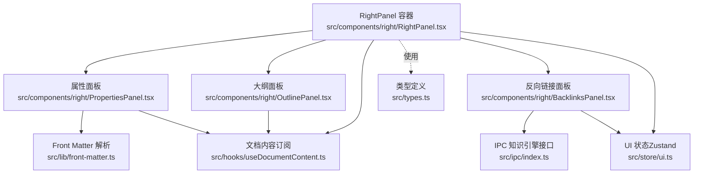
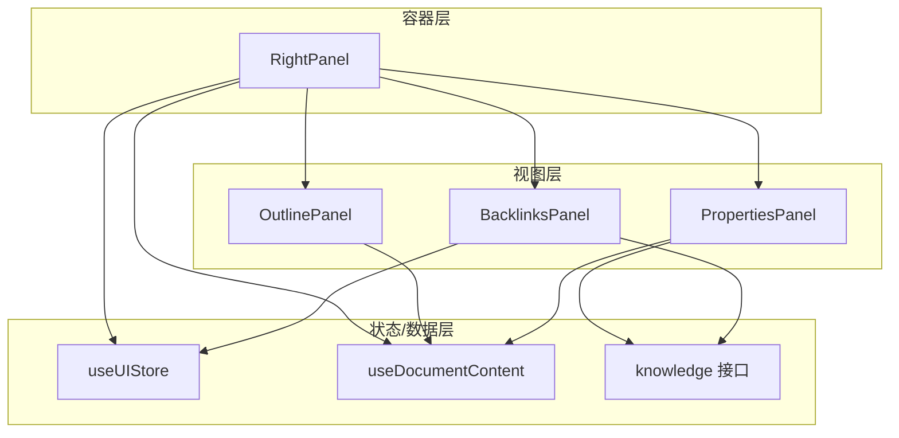
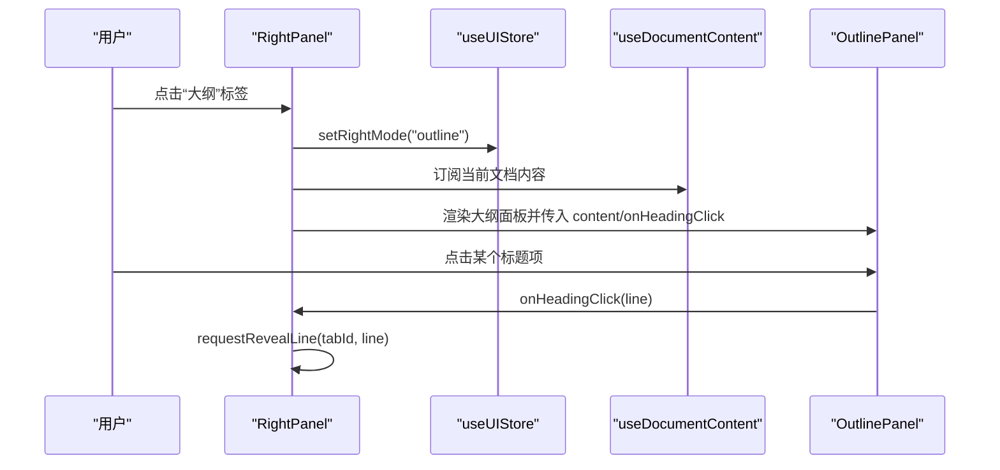
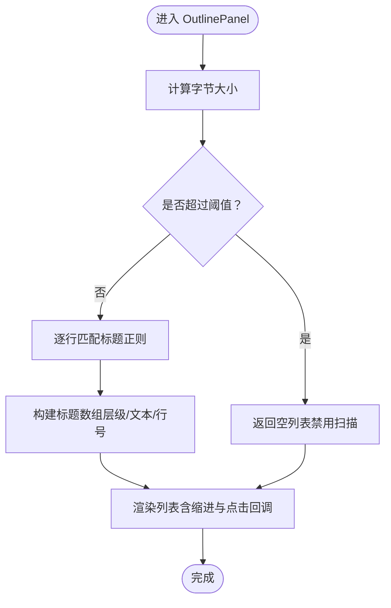
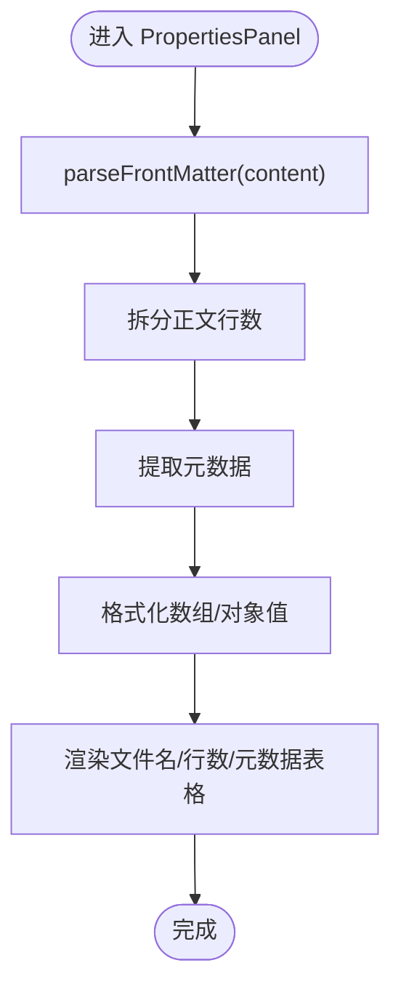
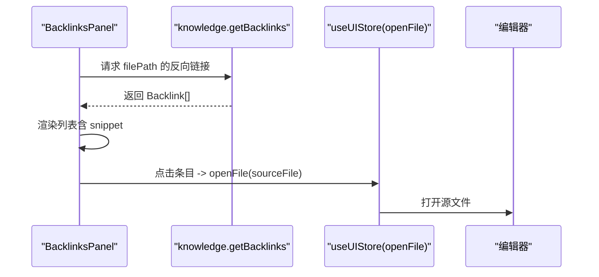
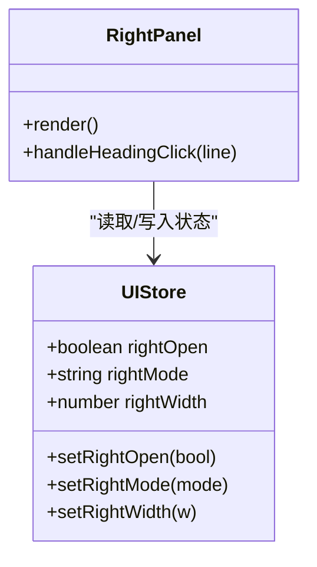
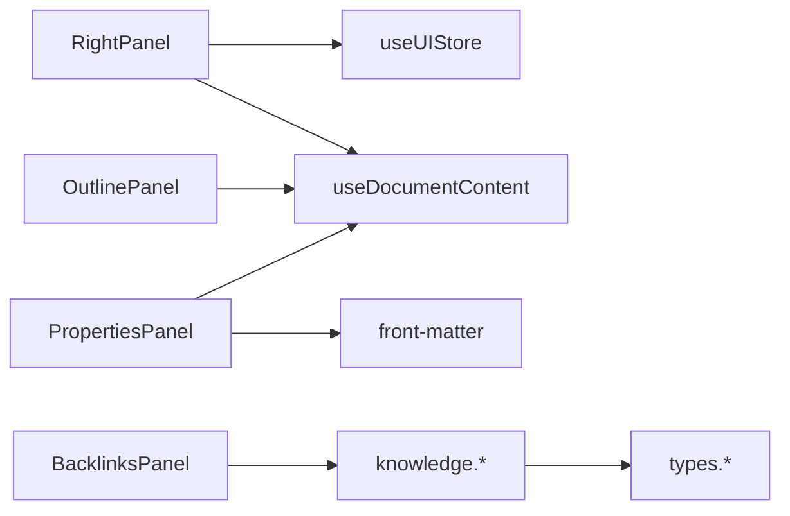

# 面板组件

<cite>
**本文档引用的文件**
- [src/components/right/RightPanel.tsx](file://src/components/right/RightPanel.tsx)
- [src/components/right/OutlinePanel.tsx](file://src/components/right/OutlinePanel.tsx)
- [src/components/right/PropertiesPanel.tsx](file://src/components/right/PropertiesPanel.tsx)
- [src/components/right/BacklinksPanel.tsx](file://src/components/right/BacklinksPanel.tsx)
- [src/store/ui.ts](file://src/store/ui.ts)
- [src/hooks/useDocumentContent.ts](file://src/hooks/useDocumentContent.ts)
- [src/lib/front-matter.ts](file://src/lib/front-matter.ts)
- [src/ipc/index.ts](file://src/ipc/index.ts)
- [src/types.ts](file://src/types.ts)
- [src/core/document/file-tier.ts](file://src/core/document/file-tier.ts)
</cite>

## 目录
1. [简介](#简介)
2. [项目结构](#项目结构)
3. [核心组件](#核心组件)
4. [架构总览](#架构总览)
5. [详细组件分析](#详细组件分析)
6. [依赖分析](#依赖分析)
7. [性能考量](#性能考量)
8. [故障排查指南](#故障排查指南)
9. [结论](#结论)
10. [附录](#附录)

## 简介
本文件系统化梳理 NoteForge 右侧面板组件体系，覆盖面板容器、布局与响应式适配、大纲面板、属性面板、反向链接面板的实现细节，并给出面板间联动与数据同步策略、可配置能力（开关、宽度、固定）以及扩展与性能优化建议。目标是帮助开发者快速理解与高效维护右侧面板生态。

## 项目结构
右侧面板由一个统一容器组件承载多个子面板，通过 UI 状态驱动切换；内容来源主要来自文档内容订阅与后端知识引擎服务。

**图表来源**
- [src/components/right/RightPanel.tsx:1-81](file://src/components/right/RightPanel.tsx#L1-L81)
- [src/components/right/OutlinePanel.tsx:1-62](file://src/components/right/OutlinePanel.tsx#L1-L62)
- [src/components/right/PropertiesPanel.tsx:1-65](file://src/components/right/PropertiesPanel.tsx#L1-L65)
- [src/components/right/BacklinksPanel.tsx:1-61](file://src/components/right/BacklinksPanel.tsx#L1-L61)
- [src/store/ui.ts:1-86](file://src/store/ui.ts#L1-L86)
- [src/hooks/useDocumentContent.ts:1-48](file://src/hooks/useDocumentContent.ts#L1-L48)
- [src/lib/front-matter.ts:1-20](file://src/lib/front-matter.ts#L1-L20)
- [src/ipc/index.ts:300-354](file://src/ipc/index.ts#L300-L354)
- [src/types.ts:213-232](file://src/types.ts#L213-L232)

**章节来源**
- [src/components/right/RightPanel.tsx:1-81](file://src/components/right/RightPanel.tsx#L1-L81)
- [src/store/ui.ts:1-86](file://src/store/ui.ts#L1-L86)

## 核心组件
- 右侧面板容器：负责模式切换、头部工具条、内容区渲染与关闭按钮。
- 大纲面板：解析文档标题层级，生成目录树，支持点击跳转到对应行。
- 属性面板：展示文件名、正文行数与 YAML Front Matter 元数据。
- 反向链接面板：查询并展示引用当前文件的其他笔记，支持打开源文件。

上述组件均通过 UI 状态与文档内容订阅进行解耦，保证可测试与可扩展。

**章节来源**
- [src/components/right/RightPanel.tsx:22-81](file://src/components/right/RightPanel.tsx#L22-L81)
- [src/components/right/OutlinePanel.tsx:15-62](file://src/components/right/OutlinePanel.tsx#L15-L62)
- [src/components/right/PropertiesPanel.tsx:17-65](file://src/components/right/PropertiesPanel.tsx#L17-L65)
- [src/components/right/BacklinksPanel.tsx:11-61](file://src/components/right/BacklinksPanel.tsx#L11-L61)

## 架构总览
右侧面板采用“容器 + 子面板 + 状态/数据层”的分层架构：
- 容器层：RightPanel 负责模式选择、头部交互与内容区渲染。
- 数据层：Zustand UI 状态管理；useDocumentContent 订阅文档变更；IPC 封装知识引擎调用。
- 视图层：各子面板按需渲染，避免对大文件执行昂贵操作。

**图表来源**
- [src/components/right/RightPanel.tsx:22-81](file://src/components/right/RightPanel.tsx#L22-L81)
- [src/store/ui.ts:39-85](file://src/store/ui.ts#L39-L85)
- [src/hooks/useDocumentContent.ts:8-25](file://src/hooks/useDocumentContent.ts#L8-L25)
- [src/ipc/index.ts:340-345](file://src/ipc/index.ts#L340-L345)

## 详细组件分析

### 右侧面板容器（RightPanel）
- 功能要点
  - 提供五个标签页模式：反向链接、大纲、属性、知识图谱、AI 协作者。
  - 顶部工具条包含模式切换按钮与关闭按钮。
  - 根据当前激活标签页与文档 ID 获取内容，传递给子面板。
  - 支持从大纲点击跳转到编辑器指定行。
- 关键行为
  - 模式切换：通过 UI Store 设置 rightMode 并自动打开面板。
  - 关闭面板：设置 rightOpen 为 false。
  - 内容获取：使用 useDocumentContent 订阅文档内容变化。
  - 行跳转：调用编辑器请求 reveal 指定行号。

**图表来源**
- [src/components/right/RightPanel.tsx:22-76](file://src/components/right/RightPanel.tsx#L22-L76)
- [src/store/ui.ts:69-69](file://src/store/ui.ts#L69-L69)
- [src/hooks/useDocumentContent.ts:8-25](file://src/hooks/useDocumentContent.ts#L8-L25)

**章节来源**
- [src/components/right/RightPanel.tsx:14-81](file://src/components/right/RightPanel.tsx#L14-L81)
- [src/store/ui.ts:25-27](file://src/store/ui.ts#L25-L27)

### 大纲面板（OutlinePanel）
- 功能要点
  - 基于文档内容解析 Markdown 标题层级（# 到 ######），生成标题列表。
  - 对超大文件（阈值见 file-tier）禁用扫描，避免性能问题。
  - 支持点击标题触发父级的行跳转回调。
- 性能与体验
  - 使用 useMemo 缓存标题解析结果，依赖 content。
  - 通过内联样式根据层级缩进，提升可读性。
  - 超大文件提示“已禁用大纲扫描”。

**图表来源**
- [src/components/right/OutlinePanel.tsx:16-26](file://src/components/right/OutlinePanel.tsx#L16-L26)
- [src/core/document/file-tier.ts:3-12](file://src/core/document/file-tier.ts#L3-L12)

**章节来源**
- [src/components/right/OutlinePanel.tsx:15-62](file://src/components/right/OutlinePanel.tsx#L15-L62)
- [src/core/document/file-tier.ts:1-96](file://src/core/document/file-tier.ts#L1-L96)

### 属性面板（PropertiesPanel）
- 功能要点
  - 解析 YAML Front Matter，展示文件名、正文行数与元数据表。
  - 对数组与对象类型的元数据进行格式化输出。
  - 使用 HTML 转义保障显示安全。
- 数据来源
  - 通过 useDocumentContent 获取最新文档内容。
  - 使用 front-matter 工具解析元数据与正文。

**图表来源**
- [src/components/right/PropertiesPanel.tsx:17-21](file://src/components/right/PropertiesPanel.tsx#L17-L21)
- [src/lib/front-matter.ts:4-19](file://src/lib/front-matter.ts#L4-L19)

**章节来源**
- [src/components/right/PropertiesPanel.tsx:17-65](file://src/components/right/PropertiesPanel.tsx#L17-L65)
- [src/lib/front-matter.ts:1-20](file://src/lib/front-matter.ts#L1-L20)

### 反向链接面板（BacklinksPanel）
- 功能要点
  - 通过 IPC 知识引擎查询当前文件的反向链接集合。
  - 支持加载态、空态与列表态的 UI 分支。
  - 点击条目直接在编辑器中打开源文件。
- 数据流
  - 组件挂载时发起查询，使用取消标记避免竞态。
  - 返回的后端结构经 IPC 适配转换为前端类型。

**图表来源**
- [src/components/right/BacklinksPanel.tsx:11-26](file://src/components/right/BacklinksPanel.tsx#L11-L26)
- [src/ipc/index.ts:340-345](file://src/ipc/index.ts#L340-L345)
- [src/types.ts:213-217](file://src/types.ts#L213-L217)

**章节来源**
- [src/components/right/BacklinksPanel.tsx:11-61](file://src/components/right/BacklinksPanel.tsx#L11-L61)
- [src/ipc/index.ts:300-354](file://src/ipc/index.ts#L300-L354)
- [src/types.ts:213-217](file://src/types.ts#L213-L217)

### 面板容器、布局与响应式适配
- 容器布局
  - 顶部工具条：包含模式按钮与关闭按钮，使用 Tooltip 提示。
  - 内容区：根据 rightMode 条件渲染不同子面板。
- 响应式适配
  - 宽度控制：UI Store 提供 rightWidth 并限制最小/最大范围。
  - 开关控制：通过 rightOpen 控制面板显隐。
  - 模式控制：通过 rightMode 切换面板内容。

**图表来源**
- [src/store/ui.ts:39-85](file://src/store/ui.ts#L39-L85)
- [src/components/right/RightPanel.tsx:22-76](file://src/components/right/RightPanel.tsx#L22-L76)

**章节来源**
- [src/store/ui.ts:67-70](file://src/store/ui.ts#L67-L70)
- [src/components/right/RightPanel.tsx:37-81](file://src/components/right/RightPanel.tsx#L37-L81)

## 依赖分析
- 组件耦合
  - RightPanel 与子面板之间为单向数据流：容器提供内容与回调，子面板只消费。
  - 子面板之间低耦合，各自独立维护自身状态与副作用。
- 外部依赖
  - UI 状态：Zustand（ui store）。
  - 文档内容：React useSyncExternalStore + 核心事件总线。
  - 后端服务：IPC 知识引擎（反向链接、图谱等）。
- 类型契约
  - 后端命令返回结构经 IPC 适配转换为前端类型，确保前后端一致性。

**图表来源**
- [src/components/right/RightPanel.tsx:22-30](file://src/components/right/RightPanel.tsx#L22-L30)
- [src/store/ui.ts:39-85](file://src/store/ui.ts#L39-L85)
- [src/hooks/useDocumentContent.ts:8-25](file://src/hooks/useDocumentContent.ts#L8-L25)
- [src/lib/front-matter.ts:1-20](file://src/lib/front-matter.ts#L1-L20)
- [src/ipc/index.ts:300-354](file://src/ipc/index.ts#L300-L354)
- [src/types.ts:213-232](file://src/types.ts#L213-L232)

**章节来源**
- [src/ipc/index.ts:300-354](file://src/ipc/index.ts#L300-L354)
- [src/types.ts:213-232](file://src/types.ts#L213-L232)

## 性能考量
- 大文件降级
  - 大文件阈值：超过 2MB 禁用大纲扫描；超过 20MB 仅只读预览。
  - 降低 Monaco 配置与特性启用，减少内存与 CPU 占用。
- 渲染优化
  - 大纲解析使用 useMemo，依赖 content，避免重复计算。
  - 属性面板对数组/对象进行格式化，避免深层对象渲染带来的重排。
- 异步与防抖
  - 反向链接查询使用取消标记，避免竞态与无效渲染。
  - Draft 保存去抖时间随文件体量增大而增加，降低频繁写入。

**章节来源**
- [src/core/document/file-tier.ts:3-12](file://src/core/document/file-tier.ts#L3-L12)
- [src/components/right/OutlinePanel.tsx:16-26](file://src/components/right/OutlinePanel.tsx#L16-L26)
- [src/components/right/BacklinksPanel.tsx:16-26](file://src/components/right/BacklinksPanel.tsx#L16-L26)

## 故障排查指南
- 大纲不显示或为空
  - 检查文档内容是否超过阈值；确认 useDocumentContent 是否正确订阅。
  - 确认右侧模式是否为“大纲”。
- 属性面板未显示元数据
  - 确认文档包含有效的 YAML Front Matter；检查 front-matter 解析是否抛错。
- 反向链接为空
  - 确认当前文件路径有效；检查 IPC 知识引擎是否可用；查看加载态/空态分支。
- 点击标题无法跳转
  - 确认父级 RightPanel 是否正确传递 onHeadingClick；检查编辑器请求是否被调用。

**章节来源**
- [src/components/right/OutlinePanel.tsx:37-42](file://src/components/right/OutlinePanel.tsx#L37-L42)
- [src/components/right/PropertiesPanel.tsx:58-60](file://src/components/right/PropertiesPanel.tsx#L58-L60)
- [src/components/right/BacklinksPanel.tsx:35-41](file://src/components/right/BacklinksPanel.tsx#L35-L41)
- [src/components/right/RightPanel.tsx:32-35](file://src/components/right/RightPanel.tsx#L32-L35)

## 结论
右侧面板通过清晰的容器-子面板分层、稳定的 UI 状态与文档内容订阅、以及后端 IPC 接口，实现了可扩展、可配置且具备性能保护的面板体系。大纲、属性与反向链接三大核心面板分别覆盖“导航—信息—关联”三类需求，满足日常知识工作流。

## 附录

### 面板可配置能力
- 面板开关：通过 UI Store 的 rightOpen 控制显隐。
- 面板宽度：通过 rightWidth 控制，限定合理范围。
- 固定与吸附：可通过布局策略在主界面中固定右侧区域。
- 模式切换：通过 rightMode 在多个面板间切换。

**章节来源**
- [src/store/ui.ts:67-70](file://src/store/ui.ts#L67-L70)
- [src/components/right/RightPanel.tsx:37-81](file://src/components/right/RightPanel.tsx#L37-L81)

### 面板间联动与数据同步
- 大纲 → 编辑器：通过 onHeadingClick 回调触发行跳转。
- 反向链接 → 编辑器：点击条目直接打开源文件。
- 属性面板：基于文档内容实时渲染，无需额外联动。

**章节来源**
- [src/components/right/RightPanel.tsx:32-35](file://src/components/right/RightPanel.tsx#L32-L35)
- [src/components/right/BacklinksPanel.tsx:46-46](file://src/components/right/BacklinksPanel.tsx#L46-L46)

### 扩展指南
- 新增面板步骤
  - 在 RightPanel 中注册新模式与图标。
  - 实现子面板组件，按需使用 useDocumentContent 或 IPC。
  - 在 UI Store 中扩展 rightMode 类型与默认值。
- 性能优化建议
  - 对可能昂贵的操作（如全文索引、复杂计算）添加阈值判断与缓存。
  - 使用 React.memo/useMemo 避免不必要的重渲染。
  - 对异步请求使用取消标记与错误兜底。

**章节来源**
- [src/components/right/RightPanel.tsx:14-20](file://src/components/right/RightPanel.tsx#L14-L20)
- [src/store/ui.ts:4-4](file://src/store/ui.ts#L4-L4)