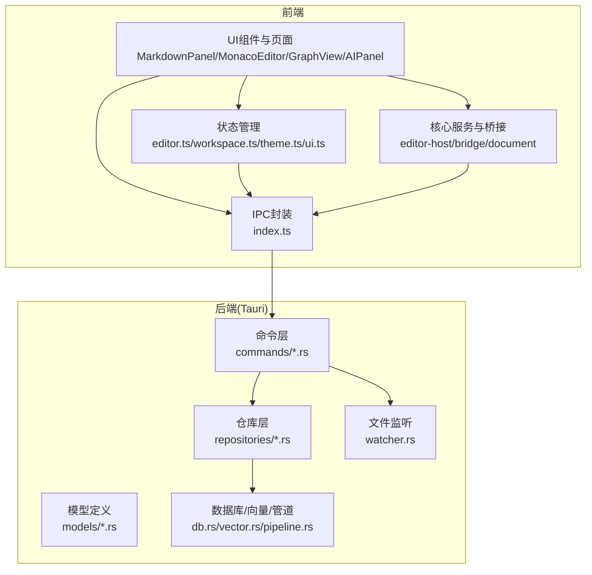
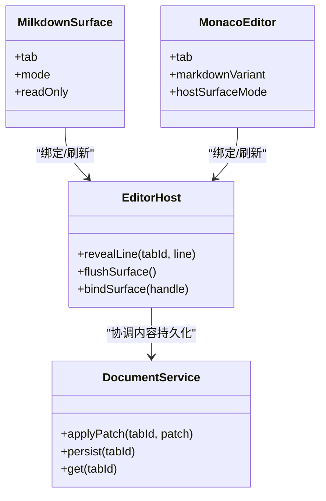
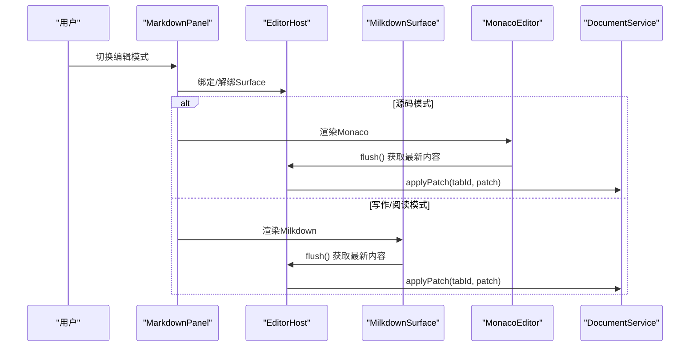
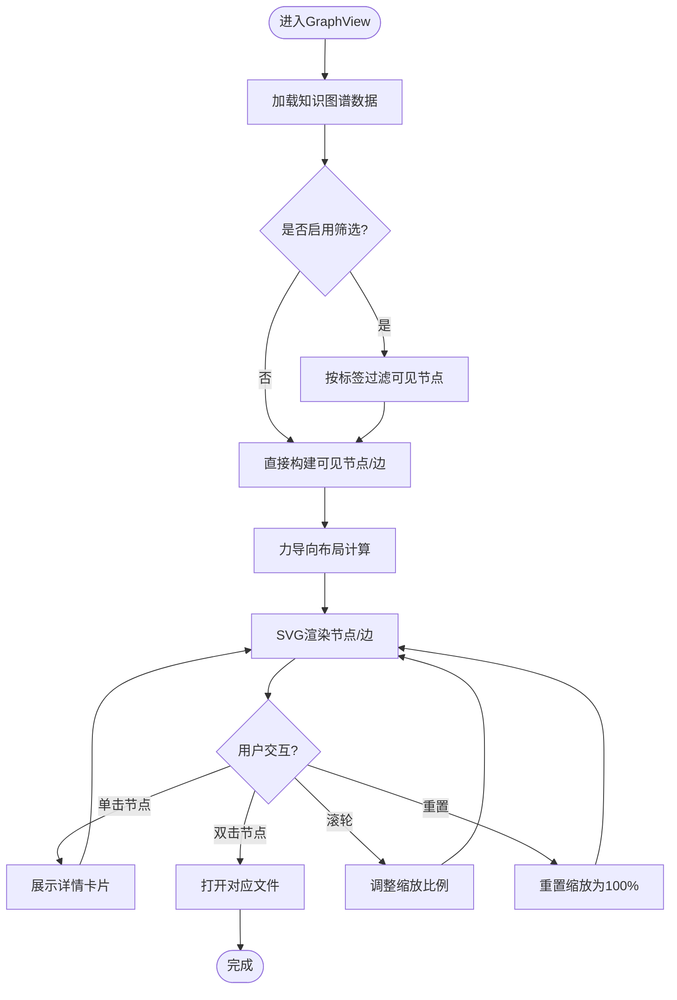
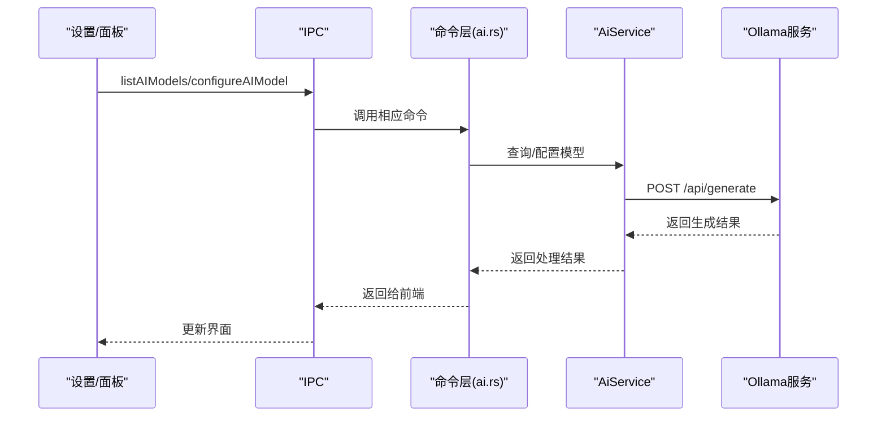
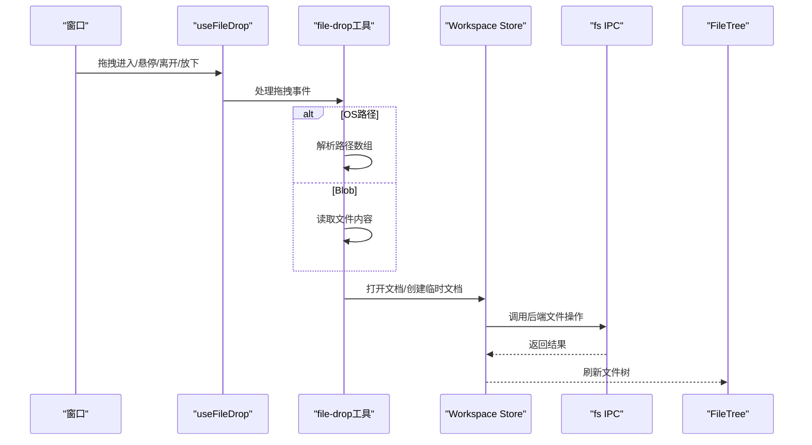
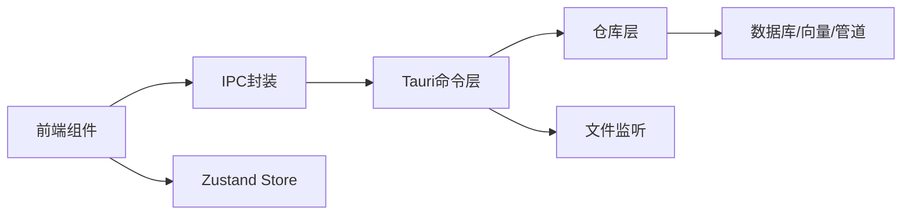

# 功能模块

<cite>
**本文引用的文件**
- [src/features/markdown/MarkdownPanel.tsx](file://src/features/markdown/MarkdownPanel.tsx)
- [src/features/markdown/MilkdownSurface.tsx](file://src/features/markdown/MilkdownSurface.tsx)
- [src/components/editor/MonacoEditor.tsx](file://src/components/editor/MonacoEditor.tsx)
- [src/features/graph/GraphView.tsx](file://src/features/graph/GraphView.tsx)
- [docs/design/05-knowledge-graph.md](file://docs/design/05-knowledge-graph.md)
- [src-tauri/src/ai.rs](file://src-tauri/src/ai.rs)
- [src/features/ai/AIPanel.tsx](file://src/features/ai/AIPanel.tsx)
- [src/components/dialogs/SettingsDialog.tsx](file://src/components/dialogs/SettingsDialog.tsx)
- [src/ipc/index.ts](file://src/ipc/index.ts)
- [src/ipc/stub.ts](file://src/ipc/stub.ts)
- [src/lib/file-drop.ts](file://src/lib/file-drop.ts)
- [src/hooks/useFileDrop.ts](file://src/hooks/useFileDrop.ts)
- [src/components/sidebar/FileTree.tsx](file://src/components/sidebar/FileTree.tsx)
- [src/store/workspace.ts](file://src/store/workspace.ts)
- [src/core/document/service.ts](file://src/core/document/service.ts)
- [src/core/vault/service.ts](file://src/core/vault/service.ts)
- [src/core/workbench/service.ts](file://src/core/workbench/service.ts)
- [src/core/platform/event-bus.ts](file://src/core/platform/event-bus.ts)
- [src/core/command/command-registry.impl.ts](file://src/core/command/command-registry.impl.ts)
- [src/core/dialog/dialog-service.impl.ts](file://src/core/dialog/dialog-service.impl.ts)
- [src/core/session/tab-lifecycle.ts](file://src/core/session/tab-lifecycle.ts)
- [src/core/session/workspace-draft-autosave.ts](file://src/core/session/workspace-draft-autosave.ts)
- [src/core/session/scratch-autosave.ts](file://src/core/session/scratch-autosave.ts)
- [src/core/knowledge/knowledge-query.impl.ts](file://src/core/knowledge/knowledge-query.impl.ts)
- [src/core/bridge/editor-sync.ts](file://src/core/bridge/editor-sync.ts)
- [src/core/bridge/editor-store-bridge.ts](file://src/core/bridge/editor-store-bridge.ts)
- [src/core/editor/editor-host.impl.ts](file://src/core/editor/editor-host.impl.ts)
- [src/core/editor/surface-handle.ts](file://src/core/editor/surface-handle.ts)
- [src/core/document/types.ts](file://src/core/document/types.ts)
- [src/core/vault/types.ts](file://src/core/vault/types.ts)
- [src/core/workbench/types.ts](file://src/core/workbench/types.ts)
- [src/core/knowledge/types.ts](file://src/core/knowledge/types.ts)
- [src/store/editor.ts](file://src/store/editor.ts)
- [src/store/theme.ts](file://src/store/theme.ts)
- [src/store/ui.ts](file://src/store/ui.ts)
- [src/store/workspace.ts](file://src/store/workspace.ts)
- [src/store/startup.ts](file://src/store/startup.ts)
- [src/lib/surface-mode.ts](file://src/lib/surface-mode.ts)
- [src/lib/monaco-setup.ts](file://src/lib/monaco-setup.ts)
- [src/lib/front-matter.ts](file://src/lib/front-matter.ts)
- [src/lib/wiki-resolve.ts](file://src/lib/wiki-resolve.ts)
- [src/lib/json-location.ts](file://src/lib/json-location.ts)
- [src/lib/yaml-location.ts](file://src/lib/yaml-location.ts)
- [src/lib/save-dialog.ts](file://src/lib/save-dialog.ts)
- [src/lib/theme-cache.ts](file://src/lib/theme-cache.ts)
- [src/lib/utils.ts](file://src/lib/utils.ts)
- [src/main.tsx](file://src/main.tsx)
- [src/App.tsx](file://src/App.tsx)
- [src-tauri/src/main.rs](file://src-tauri/src/main.rs)
- [src-tauri/src/watcher.rs](file://src-tauri/src/watcher.rs)
- [src-tauri/src/db.rs](file://src-tauri/src/db.rs)
- [src-tauri/src/vector.rs](file://src-tauri/src/vector.rs)
- [src-tauri/src/pipeline.rs](file://src-tauri/src/pipeline.rs)
- [src-tauri/src/models/graph.rs](file://src-tauri/src/models/graph.rs)
- [src-tauri/src/models/note.rs](file://src-tauri/src/models/note.rs)
- [src-tauri/src/models/link.rs](file://src-tauri/src/models/link.rs)
- [src-tauri/src/models/tag.rs](file://src-tauri/src/models/tag.rs)
- [src-tauri/src/repositories/note_repo.rs](file://src-tauri/src/repositories/note_repo.rs)
- [src-tauri/src/repositories/link_repo.rs](file://src-tauri/src/repositories/link_repo.rs)
- [src-tauri/src/repositories/tag_repo.rs](file://src-tauri/src/repositories/tag_repo.rs)
- [src-tauri/src/repositories/embedding_repo.rs](file://src-tauri/src/repositories/embedding_repo.rs)
- [src-tauri/src/knowledge.rs](file://src-tauri/src/knowledge.rs)
- [src-tauri/src/commands/knowledge.rs](file://src-tauri/src/commands/knowledge.rs)
- [src-tauri/src/commands/ai.rs](file://src-tauri/src/commands/ai.rs)
- [src-tauri/src/commands/file.rs](file://src-tauri/src/commands/file.rs)
- [src-tauri/src/commands/editor.rs](file://src-tauri/src/commands/editor.rs)
- [src-tauri/src/commands/search.rs](file://src-tauri/src/commands/search.rs)
- [src-tauri/src/commands/memory.rs](file://src-tauri/src/commands/memory.rs)
- [src-tauri/src/commands/vault_watch.rs](file://src-tauri/src/commands/vault_watch.rs)
- [src-tauri/src/commands/workbench_session.rs](file://src-tauri/src/commands/workbench_session.rs)
- [src-tauri/src/commands/workspace.rs](file://src-tauri/src/commands/workspace.rs)
- [src-tauri/src/commands/workspace_draft.rs](file://src-tauri/src/commands/workspace_draft.rs)
- [src-tauri/src/commands/scratch.rs](file://src-tauri/src/commands/scratch.rs)
- [src-tauri/src/commands/config.rs](file://src-tauri/src/commands/config.rs)
- [src-tauri/src/commands/encryption.rs](file://src-tauri/src/commands/encryption.rs)
- [src-tauri/Cargo.toml](file://src-tauri/Cargo.toml)
</cite>

## 目录
1. [简介](#简介)
2. [项目结构](#项目结构)
3. [核心组件](#核心组件)
4. [架构总览](#架构总览)
5. [详细组件分析](#详细组件分析)
6. [依赖分析](#依赖分析)
7. [性能考虑](#性能考虑)
8. [故障排查指南](#故障排查指南)
9. [结论](#结论)
10. [附录](#附录)

## 简介
本文件面向NoteForge的功能模块，系统性梳理笔记编辑系统、知识图谱、AI集成与文件管理四大核心模块的设计理念、实现架构与交互流程，并对多模式编辑器（Monaco与Milkdown）的集成方式、知识图谱构建与渲染、AI服务调用与内容生成、以及文件系统与监听机制进行深入解析。同时提供API接口说明、使用示例与集成指南，以及扩展与性能优化建议。

## 项目结构
NoteForge采用前端React + Tauri后端的混合架构。前端通过IPC桥接到Tauri命令层，实现文件系统、知识图谱、AI等能力；编辑器子系统在前端内部以“表面（Surface）”抽象统一不同编辑器（Monaco、Milkdown），并通过编辑宿主与文档服务协调内容变更与持久化。

图表来源
- [src/main.tsx](file://src/main.tsx)
- [src/App.tsx](file://src/App.tsx)
- [src/ipc/index.ts](file://src/ipc/index.ts)
- [src-tauri/src/main.rs](file://src-tauri/src/main.rs)
- [src-tauri/src/commands/mod.rs](file://src-tauri/src/commands/mod.rs)

章节来源
- [src/main.tsx](file://src/main.tsx)
- [src/App.tsx](file://src/App.tsx)
- [src/ipc/index.ts](file://src/ipc/index.ts)
- [src-tauri/src/main.rs](file://src-tauri/src/main.rs)

## 核心组件
- 笔记编辑系统：提供“写作/阅读/源码”三种模式，分别由Milkdown与Monaco驱动，统一通过编辑宿主与文档服务协调内容同步与持久化。
- 知识图谱：基于双向链接与标签/概念语义，构建节点与边，采用轻量SVG力导向布局渲染，支持筛选、缩放与节点详情交互。
- AI集成：封装Ollama服务调用，提供内容精炼、摘要生成、模型列表与配置能力，前端通过设置面板选择模型与端点。
- 文件管理系统：提供文件树浏览、目录展开、文件操作（创建/删除/重命名/移动/复制）、拖拽打开与监听刷新。

章节来源
- [src/features/markdown/MarkdownPanel.tsx](file://src/features/markdown/MarkdownPanel.tsx)
- [src/features/markdown/MilkdownSurface.tsx](file://src/features/markdown/MilkdownSurface.tsx)
- [src/components/editor/MonacoEditor.tsx](file://src/components/editor/MonacoEditor.tsx)
- [src/features/graph/GraphView.tsx](file://src/features/graph/GraphView.tsx)
- [src-tauri/src/ai.rs](file://src-tauri/src/ai.rs)
- [src/features/ai/AIPanel.tsx](file://src/features/ai/AIPanel.tsx)
- [src/components/dialogs/SettingsDialog.tsx](file://src/components/dialogs/SettingsDialog.tsx)
- [src/ipc/index.ts](file://src/ipc/index.ts)
- [src/lib/file-drop.ts](file://src/lib/file-drop.ts)
- [src/hooks/useFileDrop.ts](file://src/hooks/useFileDrop.ts)
- [src/components/sidebar/FileTree.tsx](file://src/components/sidebar/FileTree.tsx)
- [src/store/workspace.ts](file://src/store/workspace.ts)

## 架构总览
编辑器子系统采用“表面（Surface）+ 宿主（Host）+ 文档服务（DocumentService）”三层抽象：
- 表面：MilkdownSurface与MonacoEditor分别承载不同模式下的编辑体验。
- 宿主：EditorHost负责统一调度与生命周期管理，如行定位、刷新等。
- 文档服务：负责内容持久化、补丁应用与版本控制。

图表来源
- [src/core/editor/editor-host.impl.ts](file://src/core/editor/editor-host.impl.ts)
- [src/core/document/service.ts](file://src/core/document/service.ts)
- [src/features/markdown/MilkdownSurface.tsx](file://src/features/markdown/MilkdownSurface.tsx)
- [src/components/editor/MonacoEditor.tsx](file://src/components/editor/MonacoEditor.tsx)

章节来源
- [src/core/editor/editor-host.impl.ts](file://src/core/editor/editor-host.impl.ts)
- [src/core/document/service.ts](file://src/core/document/service.ts)
- [src/features/markdown/MilkdownSurface.tsx](file://src/features/markdown/MilkdownSurface.tsx)
- [src/components/editor/MonacoEditor.tsx](file://src/components/editor/MonacoEditor.tsx)

## 详细组件分析

### 笔记编辑系统（多模式编辑器）
- 模式与组件映射
  - 写作模式：Milkdown WYSIWYG，提供富文本编辑体验。
  - 阅读模式：Milkdown只读视图，复用同一适配器。
  - 源码模式：Monaco，提供语法高亮、诊断与自动补全。
- 编辑器桥接
  - 通过SurfaceHandle与EditorHost统一绑定与刷新，避免每键全量同步。
  - 使用去抖策略减少频繁更新，最终通过DocumentService.applyPatch落盘。
- 关键流程
  - 切换模式时，根据SurfaceMode决定使用Milkdown还是Monaco。
  - 行定位请求通过EditorHost.revealLine触发，优先尝试当前Surface，否则回退到下一帧。

图表来源
- [src/features/markdown/MarkdownPanel.tsx](file://src/features/markdown/MarkdownPanel.tsx)
- [src/features/markdown/MilkdownSurface.tsx](file://src/features/markdown/MilkdownSurface.tsx)
- [src/components/editor/MonacoEditor.tsx](file://src/components/editor/MonacoEditor.tsx)
- [src/core/editor/editor-host.impl.ts](file://src/core/editor/editor-host.impl.ts)
- [src/core/document/service.ts](file://src/core/document/service.ts)

章节来源
- [src/features/markdown/MarkdownPanel.tsx](file://src/features/markdown/MarkdownPanel.tsx)
- [src/features/markdown/MilkdownSurface.tsx](file://src/features/markdown/MilkdownSurface.tsx)
- [src/components/editor/MonacoEditor.tsx](file://src/components/editor/MonacoEditor.tsx)
- [src/core/editor/editor-host.impl.ts](file://src/core/editor/editor-host.impl.ts)
- [src/core/document/service.ts](file://src/core/document/service.ts)
- [src/lib/surface-mode.ts](file://src/lib/surface-mode.ts)

### 知识图谱（GraphView）
- 数据来源与渲染
  - 通过IPC调用后端知识图谱查询，返回节点与边集合。
  - 使用轻量SVG实现力导向布局，支持节点筛选、缩放与邻接高亮。
- 交互行为
  - 单击节点选中并展示详情卡片；双击节点打开对应文件。
  - 支持实时过滤节点标签、滚轮缩放、重置缩放。
- 设计规范
  - 节点类型与边样式遵循设计文档中的颜色、图标与连线风格约定。

图表来源
- [src/features/graph/GraphView.tsx](file://src/features/graph/GraphView.tsx)
- [docs/design/05-knowledge-graph.md](file://docs/design/05-knowledge-graph.md)

章节来源
- [src/features/graph/GraphView.tsx](file://src/features/graph/GraphView.tsx)
- [docs/design/05-knowledge-graph.md](file://docs/design/05-knowledge-graph.md)

### AI集成（Ollama）
- 服务封装
  - 封装Ollama生成接口，支持内容精炼与摘要生成。
  - 提供模型列表查询与端点连通性校验。
- 前端集成
  - 设置对话框提供本地模型选择与端点配置。
  - AIPanel用于展示AI生成结果与交互入口。
- 调用流程
  - 前端发起调用，IPC转发至Tauri命令层，再调用AI服务执行请求。

图表来源
- [src-tauri/src/ai.rs](file://src-tauri/src/ai.rs)
- [src/features/ai/AIPanel.tsx](file://src/features/ai/AIPanel.tsx)
- [src/components/dialogs/SettingsDialog.tsx](file://src/components/dialogs/SettingsDialog.tsx)
- [src/ipc/index.ts](file://src/ipc/index.ts)

章节来源
- [src-tauri/src/ai.rs](file://src-tauri/src/ai.rs)
- [src/features/ai/AIPanel.tsx](file://src/features/ai/AIPanel.tsx)
- [src/components/dialogs/SettingsDialog.tsx](file://src/components/dialogs/SettingsDialog.tsx)
- [src/ipc/index.ts](file://src/ipc/index.ts)

### 文件管理系统
- 文件树与操作
  - FileTree提供目录展开、右键菜单（重命名/删除/复制路径/刷新）。
  - Workspace Store封装文件系统操作（创建/删除/重命名/移动），并负责树刷新。
- 拖拽与打开
  - useFileDrop监听全局拖拽事件，支持OS路径与浏览器Blob两种场景。
  - 打开文件时自动确保库存在并打开新文档标签页。
- IPC接口
  - fs.read/write/list/create/remove/rename/move/info等基础文件操作通过IPC调用后端实现。

图表来源
- [src/hooks/useFileDrop.ts](file://src/hooks/useFileDrop.ts)
- [src/lib/file-drop.ts](file://src/lib/file-drop.ts)
- [src/store/workspace.ts](file://src/store/workspace.ts)
- [src/components/sidebar/FileTree.tsx](file://src/components/sidebar/FileTree.tsx)
- [src/ipc/index.ts](file://src/ipc/index.ts)

章节来源
- [src/hooks/useFileDrop.ts](file://src/hooks/useFileDrop.ts)
- [src/lib/file-drop.ts](file://src/lib/file-drop.ts)
- [src/store/workspace.ts](file://src/store/workspace.ts)
- [src/components/sidebar/FileTree.tsx](file://src/components/sidebar/FileTree.tsx)
- [src/ipc/index.ts](file://src/ipc/index.ts)

## 依赖分析
- 前端依赖
  - 编辑器：@milkdown/react、@milkdown/crepe、Monaco Editor。
  - 状态管理：Zustand（editor、workspace、theme、ui）。
  - IPC：统一的call函数与stub实现，便于开发环境模拟。
- 后端依赖
  - Rust生态：reqwest（HTTP客户端）、SQLite/向量存储、文件监听。
  - Tauri命令：commands/* 对应前端IPC调用。
- 耦合与内聚
  - 编辑器Surface与EditorHost松耦合，通过SurfaceHandle桥接。
  - 知识图谱与AI均通过IPC调用后端命令，保持前端简洁。
  - 文件系统操作集中在Workspace Store与fs IPC，避免分散逻辑。

图表来源
- [src/ipc/index.ts](file://src/ipc/index.ts)
- [src-tauri/src/commands/mod.rs](file://src-tauri/src/commands/mod.rs)
- [src-tauri/src/repositories/mod.rs](file://src-tauri/src/repositories/mod.rs)
- [src-tauri/src/db.rs](file://src-tauri/src/db.rs)
- [src-tauri/src/watcher.rs](file://src-tauri/src/watcher.rs)

章节来源
- [src/ipc/index.ts](file://src/ipc/index.ts)
- [src-tauri/src/commands/mod.rs](file://src-tauri/src/commands/mod.rs)
- [src-tauri/src/repositories/mod.rs](file://src-tauri/src/repositories/mod.rs)
- [src-tauri/src/db.rs](file://src-tauri/src/db.rs)
- [src-tauri/src/watcher.rs](file://src-tauri/src/watcher.rs)

## 性能考虑
- 编辑器
  - 使用去抖与flush策略，避免每键全量同步，降低渲染与持久化压力。
  - 源码模式下启用largeFileOptimizations与最小化诊断噪声，提升大文件体验。
- 知识图谱
  - 采用轻量SVG力导向布局，适合中小规模图谱（≤数百节点）。
  - 实时筛选与缩放通过状态驱动重绘，建议在大规模数据时引入分页/抽样。
- AI
  - 本地模型（Ollama）避免网络延迟，但需合理设置模型与端点。
  - 对长文本摘要与精炼建议分批处理，避免阻塞UI线程。
- 文件系统
  - 目录展开采用懒加载与递归hydrate，减少初始渲染成本。
  - 拖拽打开文件时批量调度工作区持久化，避免频繁IO。

## 故障排查指南
- 编辑器无响应或内容未保存
  - 检查Surface是否正确绑定与flush；确认EditorHost.revealLine调用时机。
  - 查看DocumentService.applyPatch是否被调用及参数是否正确。
- 知识图谱为空或交互异常
  - 确认后端知识图谱查询命令已实现且返回有效数据。
  - 检查过滤条件与缩放状态是否导致节点不可见。
- AI无法连接或模型不可用
  - 在设置中检查Ollama端点连通性与模型可用性。
  - 查看命令层日志与错误提示，确认端点可达与模型存在。
- 文件拖拽无效
  - 确认useFileDrop事件监听是否生效，浏览器环境下检查Blob读取权限。
  - 检查Workspace Store的文件操作是否成功并触发树刷新。

章节来源
- [src/core/editor/editor-host.impl.ts](file://src/core/editor/editor-host.impl.ts)
- [src/core/document/service.ts](file://src/core/document/service.ts)
- [src/features/graph/GraphView.tsx](file://src/features/graph/GraphView.tsx)
- [src-tauri/src/ai.rs](file://src-tauri/src/ai.rs)
- [src/hooks/useFileDrop.ts](file://src/hooks/useFileDrop.ts)
- [src/store/workspace.ts](file://src/store/workspace.ts)

## 结论
NoteForge通过清晰的前端-后端边界与“表面+宿主+文档服务”的编辑器抽象，实现了多模式编辑、知识图谱可视化与AI能力的有机整合。文件系统以IPC为核心，配合拖拽与监听机制，提供了流畅的本地文件操作体验。未来可在编辑器数据流、图谱渲染性能与AI推理管线等方面持续优化，以支撑更大规模的知识管理需求。

## 附录

### API接口文档（前端IPC）
- 文件系统
  - read(path): 读取文件内容与语言
  - write(path, content): 写入文件
  - list(path): 列出目录项
  - create(path, content=""): 创建文件
  - remove(path): 删除文件/目录
  - rename(oldPath, newPath): 重命名
  - move(source, destination): 移动
  - info(path): 获取文件信息
- 知识图谱
  - getGraph(workspaceId): 获取知识图谱（节点/边）
- AI
  - listAIModels(type): 列出本地/云端模型
  - configureAIModel(provider, apiKey?, endpoint?): 配置模型
- 编辑器
  - flushSurface(): 刷新当前Surface内容
  - revealLine(tabId, line): 定位到指定行
- 搜索/记忆/加密/配置等
  - 命令层提供对应接口，前端通过IPC调用

章节来源
- [src/ipc/index.ts](file://src/ipc/index.ts)
- [src-tauri/src/commands/file.rs](file://src-tauri/src/commands/file.rs)
- [src-tauri/src/commands/knowledge.rs](file://src-tauri/src/commands/knowledge.rs)
- [src-tauri/src/commands/ai.rs](file://src-tauri/src/commands/ai.rs)
- [src-tauri/src/commands/editor.rs](file://src-tauri/src/commands/editor.rs)
- [src-tauri/src/commands/search.rs](file://src-tauri/src/commands/search.rs)
- [src-tauri/src/commands/memory.rs](file://src-tauri/src/commands/memory.rs)
- [src-tauri/src/commands/encryption.rs](file://src-tauri/src/commands/encryption.rs)
- [src-tauri/src/commands/config.rs](file://src-tauri/src/commands/config.rs)

### 使用示例与集成指南
- 集成编辑器Surface
  - 在MarkdownPanel中根据SurfaceMode选择Milkdown或Monaco。
  - 通过EditorHost.bindSurface绑定SurfaceHandle，使用flush与applyPatch实现内容落盘。
- 集成知识图谱
  - 在右侧面板添加GraphView，订阅工作区变化并调用knowledge.getGraph。
  - 实现节点点击/双击与详情展示。
- 集成AI
  - 在设置对话框中列出本地模型并允许用户选择。
  - 通过AIPanel触发生成任务，展示结果并支持进一步操作。
- 集成文件系统
  - 在侧边栏FileTree中实现右键菜单与快捷操作。
  - 使用useFileDrop处理拖拽事件，结合Workspace Store刷新树。

章节来源
- [src/features/markdown/MarkdownPanel.tsx](file://src/features/markdown/MarkdownPanel.tsx)
- [src/features/graph/GraphView.tsx](file://src/features/graph/GraphView.tsx)
- [src/features/ai/AIPanel.tsx](file://src/features/ai/AIPanel.tsx)
- [src/components/dialogs/SettingsDialog.tsx](file://src/components/dialogs/SettingsDialog.tsx)
- [src/hooks/useFileDrop.ts](file://src/hooks/useFileDrop.ts)
- [src/store/workspace.ts](file://src/store/workspace.ts)

### 扩展最佳实践
- 编辑器
  - 新增Surface时，确保实现flush与SurfaceHandle协议，避免全量同步。
  - 对长文档采用增量渲染与虚拟滚动，减少重绘。
- 知识图谱
  - 大规模图谱采用分块加载与抽样渲染，结合缓存与增量更新。
  - 提供导出/导入能力，便于跨设备迁移。
- AI
  - 引入任务队列与并发限制，避免过载。
  - 支持流式输出与取消机制，改善用户体验。
- 文件系统
  - 增加文件类型识别与预览，提升打开效率。
  - 提供差异对比与合并工具，增强协作能力。