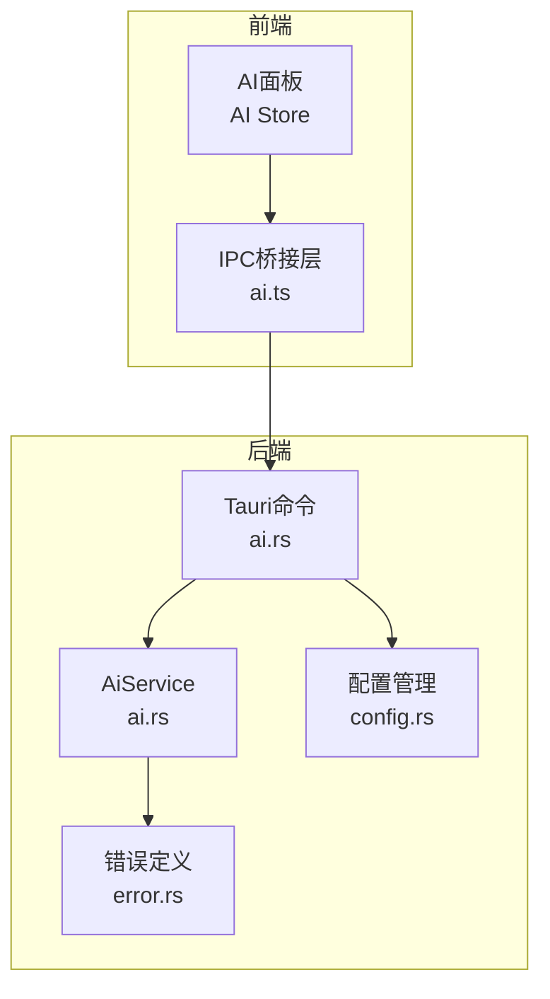
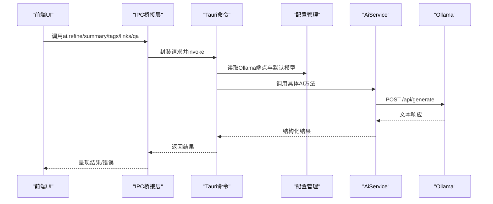
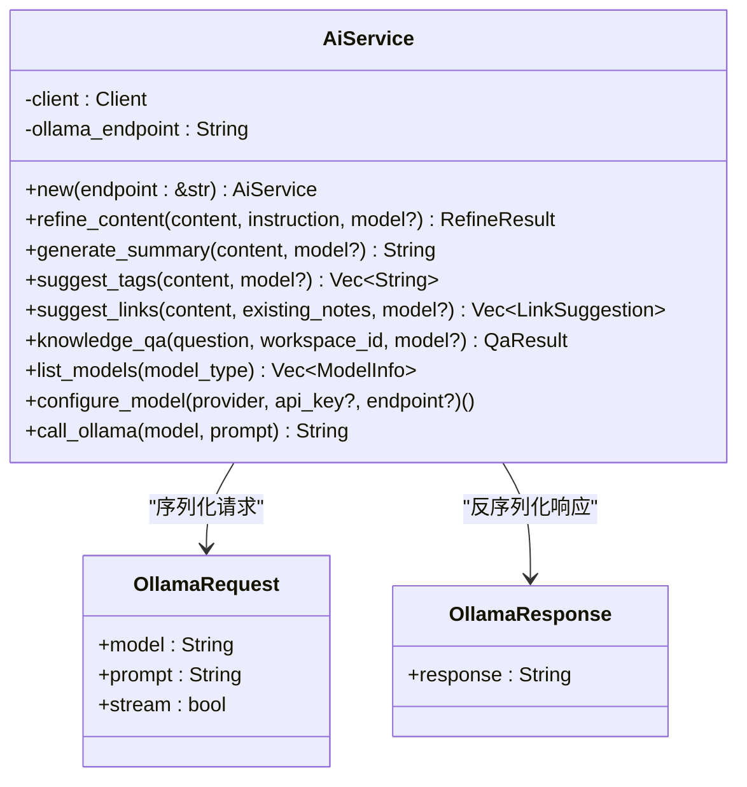
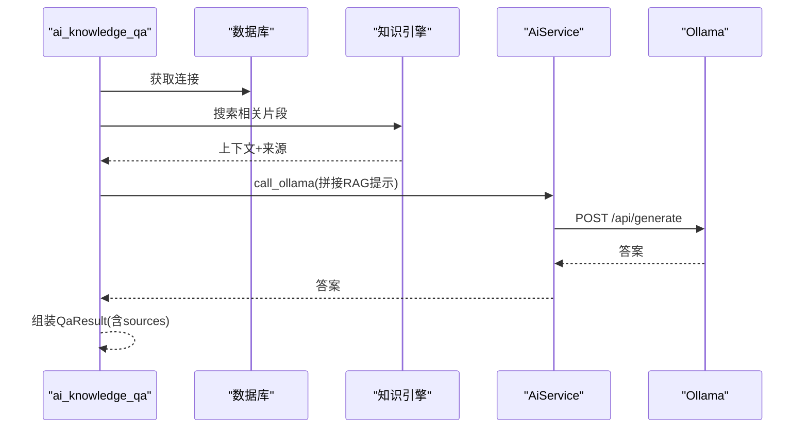
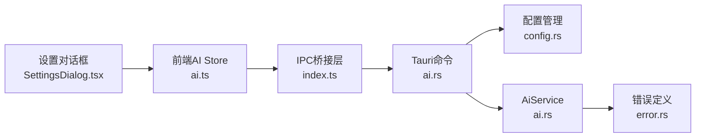

# AI服务核心

<cite>
**本文档引用的文件**
- [ai.rs](file://src-tauri/src/ai.rs)
- [ai.rs](file://src-tauri/src/commands/ai.rs)
- [ai.rs](file://src-tauri/src/models/ai.rs)
- [config.rs](file://src-tauri/src/config.rs)
- [error.rs](file://src-tauri/src/error.rs)
- [index.ts](file://src/ipc/index.ts)
- [ai.ts](file://src/store/ai.ts)
- [SettingsDialog.tsx](file://src/components/dialogs/SettingsDialog.tsx)
</cite>

## 目录
1. [简介](#简介)
2. [项目结构](#项目结构)
3. [核心组件](#核心组件)
4. [架构总览](#架构总览)
5. [详细组件分析](#详细组件分析)
6. [依赖关系分析](#依赖关系分析)
7. [性能考虑](#性能考虑)
8. [故障排除指南](#故障排除指南)
9. [结论](#结论)
10. [附录](#附录)

## 简介
本文件聚焦于NoteForge应用中的AI服务核心模块，系统性梳理AiService结构体的设计与实现，涵盖HTTP客户端配置、Ollama端点管理、异步请求处理流程；详解内容精炼(refine_content)、摘要生成(generate_summary)、标签建议(suggest_tags)、链接建议(suggest_links)、问答系统(knowledge_qa)等AI功能；说明模型管理(list_models、configure_model)；阐述错误处理机制、请求超时与重试策略；提供API调用示例与最佳实践，并给出性能优化与资源管理建议。

## 项目结构
AI服务位于Rust后端(src-tauri)，通过Tauri命令暴露给前端；前端通过IPC桥接层统一调用，状态管理由Zustand Store负责。

**图表来源**
- [ai.rs:1-126](file://src-tauri/src/commands/ai.rs#L1-L126)
- [ai.rs:1-205](file://src-tauri/src/ai.rs#L1-L205)
- [config.rs:1-90](file://src-tauri/src/config.rs#L1-L90)
- [error.rs:1-80](file://src-tauri/src/error.rs#L1-L80)
- [index.ts:414-448](file://src/ipc/index.ts#L414-L448)
- [ai.ts:1-111](file://src/store/ai.ts#L1-L111)

**章节来源**
- [ai.rs:1-126](file://src-tauri/src/commands/ai.rs#L1-L126)
- [ai.rs:1-205](file://src-tauri/src/ai.rs#L1-L205)
- [config.rs:1-90](file://src-tauri/src/config.rs#L1-L90)
- [error.rs:1-80](file://src-tauri/src/error.rs#L1-L80)
- [index.ts:414-448](file://src/ipc/index.ts#L414-L448)
- [ai.ts:1-111](file://src/store/ai.ts#L1-L111)

## 核心组件
- AiService：封装HTTP客户端与Ollama交互，提供多种AI能力方法与模型管理接口。
- Tauri命令：将前端请求转发至AiService，执行业务逻辑并返回结果。
- IPC桥接层：统一的invoke封装，支持真实后端与stub模拟。
- Store：管理AI面板状态、模型列表加载与用户交互。
- 配置管理：提供Ollama端点、默认模型等配置项。
- 错误体系：统一的错误码映射与序列化。

**章节来源**
- [ai.rs:5-177](file://src-tauri/src/ai.rs#L5-L177)
- [ai.rs:13-125](file://src-tauri/src/commands/ai.rs#L13-L125)
- [index.ts:66-83](file://src/ipc/index.ts#L66-L83)
- [ai.ts:28-110](file://src/store/ai.ts#L28-L110)
- [config.rs:9-38](file://src-tauri/src/config.rs#L9-L38)
- [error.rs:4-41](file://src-tauri/src/error.rs#L4-L41)

## 架构总览
AI服务采用“前端IPC → 后端命令 → AiService → Ollama”的链路，命令层负责参数解析与上下文准备（如RAG检索），AiService负责与Ollama通信与结果解析。

**图表来源**
- [index.ts:414-448](file://src/ipc/index.ts#L414-L448)
- [ai.rs:13-99](file://src-tauri/src/commands/ai.rs#L13-L99)
- [ai.rs:159-176](file://src-tauri/src/ai.rs#L159-L176)
- [config.rs:61-62](file://src-tauri/src/config.rs#L61-L62)

## 详细组件分析

### AiService结构体设计
- 字段
  - client: reqwest::Client，用于HTTP请求。
  - ollama_endpoint: String，Ollama服务地址。
- 方法族
  - refine_content：内容精炼，返回结果文本与diff对比。
  - generate_summary：生成摘要。
  - suggest_tags：提取逗号分隔标签。
  - suggest_links：基于现有笔记建议链接，返回JSON数组。
  - knowledge_qa：结合知识库上下文的问答。
  - list_models：枚举本地可用模型。
  - configure_model：校验Ollama端点连通性。
  - call_ollama：通用生成请求封装。
- 辅助函数
  - compute_diff：逐行比较原文与修改后的差异。

**图表来源**
- [ai.rs:5-177](file://src-tauri/src/ai.rs#L5-L177)
- [ai.rs:194-204](file://src-tauri/src/ai.rs#L194-L204)

**章节来源**
- [ai.rs:5-177](file://src-tauri/src/ai.rs#L5-L177)

### HTTP客户端与Ollama端点管理
- 客户端初始化：每次创建AiService实例时新建reqwest::Client，便于独立控制请求行为。
- 端点配置：通过ConfigManager读取配置中的ollama_endpoint，默认"http://localhost:11434"。
- 请求路径：
  - 列举模型：GET {endpoint}/api/tags
  - 生成文本：POST {endpoint}/api/generate
- 连通性校验：configure_model对指定endpoint发起GET /api/tags，失败则抛出AI错误。

**章节来源**
- [ai.rs:11-16](file://src-tauri/src/ai.rs#L11-L16)
- [ai.rs:111-136](file://src-tauri/src/ai.rs#L111-L136)
- [ai.rs:138-157](file://src-tauri/src/ai.rs#L138-L157)
- [config.rs:9-38](file://src-tauri/src/config.rs#L9-L38)

### 异步请求处理与RAG流程
- 命令层(ai_knowledge_qa)先执行知识检索，构建RAG上下文，再调用AiService的call_ollama生成答案。
- 数据库访问在锁外构建prompt，避免长时间持有锁影响并发。
- 返回结构包含answer与sources（引用文件路径）。

**图表来源**
- [ai.rs:62-99](file://src-tauri/src/commands/ai.rs#L62-L99)
- [ai.rs:159-176](file://src-tauri/src/ai.rs#L159-L176)

**章节来源**
- [ai.rs:62-99](file://src-tauri/src/commands/ai.rs#L62-L99)

### AI功能实现详解

#### 内容精炼(refine_content)
- 输入：content、instruction、model(可选，默认llama3)。
- 处理：构造指令+内容的提示，调用call_ollama，计算diff。
- 输出：RefineResult(result, diff)。

**章节来源**
- [ai.rs:18-34](file://src-tauri/src/ai.rs#L18-L34)

#### 摘要生成(generate_summary)
- 输入：content、model(可选，默认llama3)。
- 处理：构造摘要提示，调用call_ollama。
- 输出：String。

**章节来源**
- [ai.rs:36-48](file://src-tauri/src/ai.rs#L36-L48)

#### 标签建议(suggest_tags)
- 输入：content、model(可选，默认llama3)。
- 处理：提示要求返回逗号分隔标签，解析为Vec<String>。
- 输出：Vec<String>。

**章节来源**
- [ai.rs:50-69](file://src-tauri/src/ai.rs#L50-L69)

#### 链接建议(suggest_links)
- 输入：content、existing_notes、model(可选，默认llama3)。
- 处理：提示返回JSON数组，元素包含note与relevance，反序列化为Vec<LinkSuggestion>。
- 输出：Vec<LinkSuggestion>。

**章节来源**
- [ai.rs:71-89](file://src-tauri/src/ai.rs#L71-L89)

#### 问答系统(knowledge_qa)
- 输入：question、workspace_id、model(可选)。
- 处理：命令层先检索上下文，再调用AiService生成答案。
- 输出：QaResult(answer, sources)。

**章节来源**
- [ai.rs:62-99](file://src-tauri/src/commands/ai.rs#L62-L99)
- [ai.rs:91-109](file://src-tauri/src/ai.rs#L91-L109)

### 模型管理
- list_models：调用Ollama /api/tags，过滤并组装ModelInfo列表。
- configure_model：当provider为ollama且提供了endpoint时，尝试GET /api/tags连通性检查。

**章节来源**
- [ai.rs:111-136](file://src-tauri/src/ai.rs#L111-L136)
- [ai.rs:138-157](file://src-tauri/src/ai.rs#L138-L157)

### 错误处理机制
- 错误类型：NoteforgeError，覆盖reqwest、数据库、JSON、通知、加密、AI、向量检索等。
- 序列化：统一映射为包含code与message的结构，便于前端识别。
- 前端消费：IPC桥接层在调用失败时抛出IpcError，Store捕获并展示。

**章节来源**
- [error.rs:4-41](file://src-tauri/src/error.rs#L4-L41)
- [error.rs:49-74](file://src-tauri/src/error.rs#L49-L74)
- [index.ts:66-83](file://src/ipc/index.ts#L66-L83)
- [ai.ts:79-81](file://src/store/ai.ts#L79-L81)

### API调用示例与最佳实践
- 前端调用入口：ai.refine、ai.summary、ai.suggestTags、ai.suggestLinks、ai.qa、ai.listModels、ai.configureModel。
- 最佳实践：
  - 明确model参数，避免默认模型不匹配。
  - 对大文档先做摘要再进行标签/链接建议，提升效率。
  - RAG问答前确保知识库已索引，减少检索耗时。
  - 捕获并展示错误，引导用户检查Ollama端点连通性。

**章节来源**
- [index.ts:414-448](file://src/ipc/index.ts#L414-L448)
- [ai.ts:36-49](file://src/store/ai.ts#L36-L49)

## 依赖关系分析
- 前端依赖
  - IPC桥接层：统一invoke与错误包装。
  - Store：状态管理与异步加载。
  - 设置对话框：模型选择与Provider切换。
- 后端依赖
  - Tauri命令：参数解析与上下文准备。
  - AiService：与Ollama交互。
  - 配置管理：提供运行时配置。
  - 错误体系：统一错误语义。

**图表来源**
- [ai.ts:1-111](file://src/store/ai.ts#L1-L111)
- [SettingsDialog.tsx:63-92](file://src/components/dialogs/SettingsDialog.tsx#L63-L92)
- [index.ts:414-448](file://src/ipc/index.ts#L414-L448)
- [ai.rs:1-126](file://src-tauri/src/commands/ai.rs#L1-L126)
- [config.rs:1-90](file://src-tauri/src/config.rs#L1-L90)
- [error.rs:1-80](file://src-tauri/src/error.rs#L1-L80)

**章节来源**
- [ai.ts:1-111](file://src/store/ai.ts#L1-L111)
- [SettingsDialog.tsx:63-92](file://src/components/dialogs/SettingsDialog.tsx#L63-L92)
- [index.ts:414-448](file://src/ipc/index.ts#L414-L448)
- [ai.rs:1-126](file://src-tauri/src/commands/ai.rs#L1-L126)
- [config.rs:1-90](file://src-tauri/src/config.rs#L1-L90)
- [error.rs:1-80](file://src-tauri/src/error.rs#L1-L80)

## 性能考虑
- 并发与锁释放：RAG流程在释放数据库锁后再构建prompt，降低锁竞争。
- 模型选择：优先选择轻量模型进行预处理（摘要、标签），复杂任务使用更大模型。
- 缓存与复用：AiService每次创建新client，可在高频调用场景考虑共享client并设置合理的超时与重试。
- 前端批处理：模型列表加载使用Promise.all并行获取本地与云端列表。
- I/O优化：避免在UI线程执行长耗时操作，保持界面流畅。

**章节来源**
- [ai.rs:69-85](file://src-tauri/src/commands/ai.rs#L69-L85)
- [ai.ts:36-49](file://src/store/ai.ts#L36-L49)

## 故障排除指南
- Ollama不可达
  - 现象：configure_model或list_models报AI错误。
  - 排查：确认ollama_endpoint正确，Ollama服务正在运行。
- 模型不存在
  - 现象：调用AiService方法返回错误。
  - 排查：使用list_models确认模型存在，或切换到可用模型。
- 前端错误展示
  - 现象：AI面板显示错误消息。
  - 排查：查看Store中的errorMessage，根据错误码定位问题。

**章节来源**
- [ai.rs:144-153](file://src-tauri/src/ai.rs#L144-L153)
- [error.rs:54-73](file://src-tauri/src/error.rs#L54-L73)
- [ai.ts:79-81](file://src/store/ai.ts#L79-L81)

## 结论
AiService以简洁的结构实现了多样化的AI能力，结合Tauri命令与IPC桥接层，形成了清晰的前后端协作模式。通过配置管理与错误体系保障了可用性与可观测性；RAG问答流程体现了知识检索与LLM生成的协同。建议在生产环境中引入超时与重试策略、模型缓存与并发控制，持续优化用户体验与系统稳定性。

## 附录
- 数据模型概览
  - RefineResult：result、diff
  - QaResult：answer、sources
  - LinkSuggestion：note、relevance
  - ModelInfo：name、size、model_type

**章节来源**
- [ai.rs:25-30](file://src-tauri/src/models/ai.rs#L25-L30)
- [ai.rs:18-23](file://src-tauri/src/models/ai.rs#L18-L23)
- [ai.rs:3-8](file://src-tauri/src/models/ai.rs#L3-L8)
- [ai.rs:10-16](file://src-tauri/src/models/ai.rs#L10-L16)