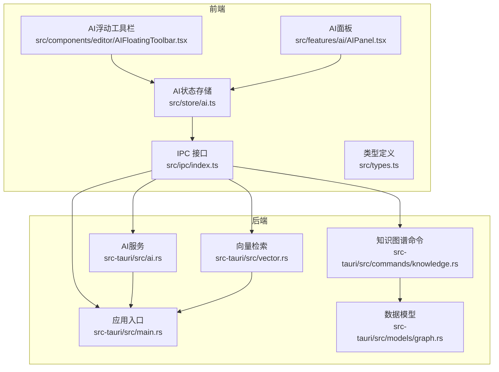
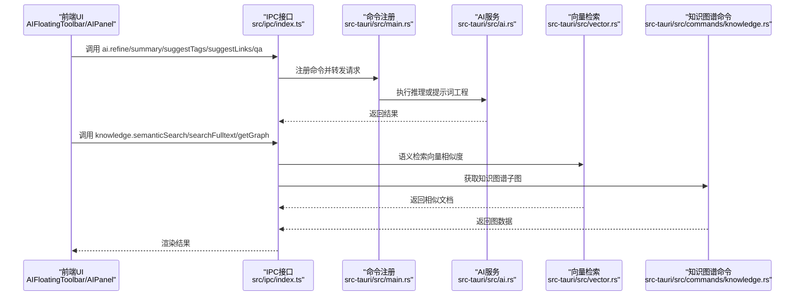
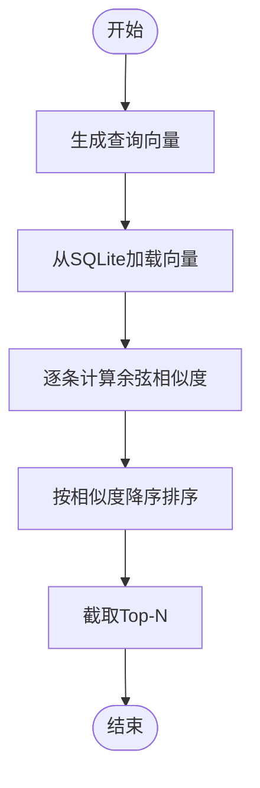
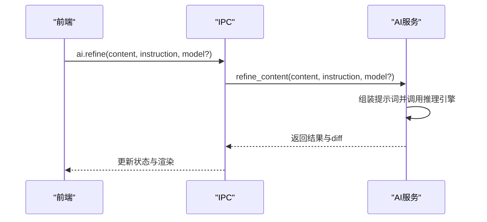
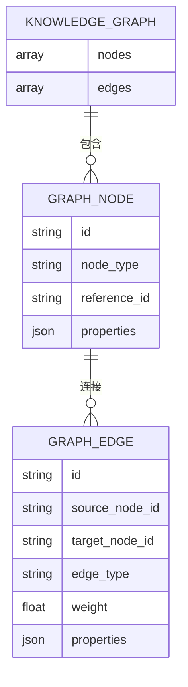
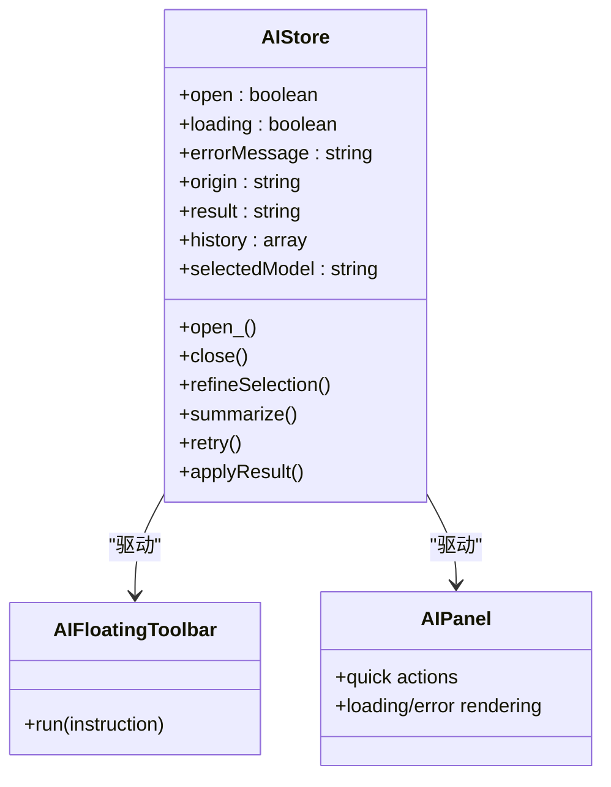
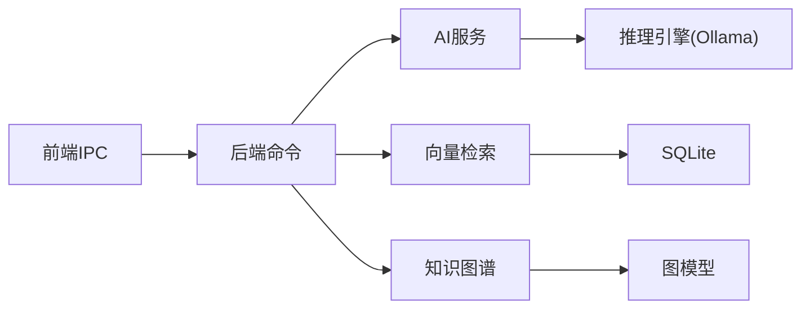

# AI集成服务

<cite>
**本文引用的文件**
- [src/ipc/index.ts](file://src/ipc/index.ts)
- [src/ipc/stub.ts](file://src/ipc/stub.ts)
- [src-tauri/src/ai.rs](file://src-tauri/src/ai.rs)
- [src-tauri/src/commands/ai.rs](file://src-tauri/src/commands/ai.rs)
- [src-tauri/src/vector.rs](file://src-tauri/src/vector.rs)
- [src-tauri/src/commands/knowledge.rs](file://src-tauri/src/commands/knowledge.rs)
- [src-tauri/src/models/graph.rs](file://src-tauri/src/models/graph.rs)
- [src/types.ts](file://src/types.ts)
- [src/store/ai.ts](file://src/store/ai.ts)
- [src/components/editor/AIFloatingToolbar.tsx](file://src/components/editor/AIFloatingToolbar.tsx)
- [src/features/ai/AIPanel.tsx](file://src/features/ai/AIPanel.tsx)
- [src-tauri/src/main.rs](file://src-tauri/src/main.rs)
- [src-tauri/Cargo.toml](file://src-tauri/Cargo.toml)
</cite>

## 目录
1. [简介](#简介)
2. [项目结构](#项目结构)
3. [核心组件](#核心组件)
4. [架构总览](#架构总览)
5. [详细组件分析](#详细组件分析)
6. [依赖分析](#依赖分析)
7. [性能考量](#性能考量)
8. [故障排查指南](#故障排查指南)
9. [结论](#结论)
10. [附录](#附录)

## 简介
本文件系统化梳理NoteForge的AI集成服务，覆盖向量嵌入与语义检索、文本处理与提示词工程、知识图谱构建与查询、以及前端交互与状态管理。文档以“可读性优先”为原则，通过分层讲解与可视化图示帮助读者快速理解整体架构与关键流程。

## 项目结构
NoteForge采用前后端分离的架构：前端通过IPC接口调用后端命令；后端以Tauri为宿主，使用Rust实现AI推理、向量检索、知识图谱与全文检索等核心能力。关键目录与职责如下：
- 前端IPC与类型定义：src/ipc、src/types、src/store、src/components、src/features
- 后端命令与服务：src-tauri/src/commands、src-tauri/src/ai.rs、src-tauri/src/vector.rs、src-tauri/src/knowledge.rs
- 数据模型与数据库：src-tauri/src/models、src-tauri/src/db.rs
- 应用入口与能力声明：src-tauri/src/main.rs、src-tauri/capabilities/default.json

图表来源
- [src/ipc/index.ts:297-330](file://src/ipc/index.ts#L297-L330)
- [src-tauri/src/ai.rs:1-48](file://src-tauri/src/ai.rs#L1-L48)
- [src-tauri/src/vector.rs:44-151](file://src-tauri/src/vector.rs#L44-L151)
- [src-tauri/src/commands/knowledge.rs:126-163](file://src-tauri/src/commands/knowledge.rs#L126-L163)
- [src-tauri/src/models/graph.rs:1-34](file://src-tauri/src/models/graph.rs#L1-L34)

章节来源
- [src/ipc/index.ts:297-330](file://src/ipc/index.ts#L297-L330)
- [src-tauri/src/main.rs](file://src-tauri/src/main.rs)

## 核心组件
- IPC接口与命令注册：前端通过统一的ai与knowledge接口发起请求，后端在main.rs中注册对应命令，实现跨语言调用。
- AI服务（本地/云端）：封装Ollama等推理引擎，提供内容精炼、摘要生成、标签建议、链接建议、问答等功能。
- 向量检索：基于SQLite存储向量，按需生成查询向量并计算余弦相似度，返回相似文档。
- 知识图谱：以节点与边为核心数据模型，支持按工作区查询子图，支持去重与权重聚合。
- 前端状态与UI：AI状态存储负责历史记录、加载态与错误态；浮动工具栏与AI面板提供快捷操作入口。

章节来源
- [src/ipc/index.ts:414-448](file://src/ipc/index.ts#L414-L448)
- [src-tauri/src/ai.rs:1-48](file://src-tauri/src/ai.rs#L1-L48)
- [src-tauri/src/vector.rs:44-151](file://src-tauri/src/vector.rs#L44-L151)
- [src-tauri/src/models/graph.rs:1-34](file://src-tauri/src/models/graph.rs#L1-L34)
- [src/store/ai.ts:51-110](file://src/store/ai.ts#L51-L110)

## 架构总览
NoteForge的AI服务采用“前端IPC → 后端命令 → 业务服务”的分层设计。前端负责用户交互与状态管理，后端负责实际的AI推理、向量计算与知识图谱查询，并通过SQLite持久化关键数据。

图表来源
- [src/components/editor/AIFloatingToolbar.tsx:70-116](file://src/components/editor/AIFloatingToolbar.tsx#L70-L116)
- [src/features/ai/AIPanel.tsx:159-196](file://src/features/ai/AIPanel.tsx#L159-L196)
- [src/ipc/index.ts:414-448](file://src/ipc/index.ts#L414-L448)
- [src-tauri/src/ai.rs:18-48](file://src-tauri/src/ai.rs#L18-L48)
- [src-tauri/src/vector.rs:57-151](file://src-tauri/src/vector.rs#L57-L151)
- [src-tauri/src/commands/knowledge.rs:126-163](file://src-tauri/src/commands/knowledge.rs#L126-L163)

## 详细组件分析

### 向量嵌入与语义检索
- 嵌入生成与存储
  - 后端在vector模块中按需生成查询向量，并将文档向量序列化后存入SQLite表document_embeddings。
  - 支持按document_type过滤，便于后续检索时限定范围。
- 相似度计算
  - 使用余弦相似度在内存中遍历已存向量，计算与查询向量的相似度并排序，返回前N个结果。
- 检索优化
  - 当前实现为内存扫描，适合小规模数据；生产环境建议引入专用向量数据库（如Pinecone、Weaviate）以提升吞吐与延迟表现。

图表来源
- [src-tauri/src/vector.rs:57-151](file://src-tauri/src/vector.rs#L57-L151)

章节来源
- [src-tauri/src/vector.rs:44-151](file://src-tauri/src/vector.rs#L44-L151)

### 文本处理与提示词工程
- 提示词构造
  - 对于内容精炼与摘要生成，后端将指令(instruction)与原文拼接为提示词，调用推理引擎执行。
- 结果差异计算
  - 在内容精炼场景，后端会计算新旧文本的差异，便于前端展示diff视图。
- 多模型支持
  - 前端提供列出模型与配置模型的接口，后端默认使用llama3，可通过参数切换。

图表来源
- [src-tauri/src/ai.rs:18-48](file://src-tauri/src/ai.rs#L18-L48)
- [src/ipc/index.ts:414-448](file://src/ipc/index.ts#L414-L448)

章节来源
- [src-tauri/src/ai.rs:1-48](file://src-tauri/src/ai.rs#L1-L48)
- [src/ipc/index.ts:414-448](file://src/ipc/index.ts#L414-L448)
- [src/ipc/stub.ts:819-846](file://src/ipc/stub.ts#L819-L846)

### 知识图谱构建与查询
- 数据模型
  - 节点包含id、node_type、reference_id与properties；边包含source/target节点、edge_type、weight与properties。
- 查询流程
  - 前端调用getGraph，后端根据节点集合查询关联边，去重并返回子图。
- 图优化
  - 通过去重与权重聚合减少冗余边，提升渲染与分析效率。

图表来源
- [src-tauri/src/models/graph.rs:1-34](file://src-tauri/src/models/graph.rs#L1-L34)

章节来源
- [src-tauri/src/models/graph.rs:1-34](file://src-tauri/src/models/graph.rs#L1-L34)
- [src-tauri/src/commands/knowledge.rs:126-163](file://src-tauri/src/commands/knowledge.rs#L126-L163)
- [src/types.ts:161-204](file://src/types.ts#L161-L204)

### 前端交互与状态管理
- 状态存储
  - AI状态存储负责打开/关闭面板、加载态、错误信息、历史记录与当前选型模型。
- 快捷操作
  - 浮动工具栏提供“精炼/摘要/改写/翻译”等常用指令；AI面板提供更丰富的快捷动作与加载/错误反馈。
- 类型与转换
  - 前端类型与后端模型保持对齐，确保IPC传输的数据结构稳定。

图表来源
- [src/store/ai.ts:51-110](file://src/store/ai.ts#L51-L110)
- [src/components/editor/AIFloatingToolbar.tsx:70-116](file://src/components/editor/AIFloatingToolbar.tsx#L70-L116)
- [src/features/ai/AIPanel.tsx:159-196](file://src/features/ai/AIPanel.tsx#L159-L196)

章节来源
- [src/store/ai.ts:51-110](file://src/store/ai.ts#L51-L110)
- [src/components/editor/AIFloatingToolbar.tsx:70-116](file://src/components/editor/AIFloatingToolbar.tsx#L70-L116)
- [src/features/ai/AIPanel.tsx:159-196](file://src/features/ai/AIPanel.tsx#L159-L196)

## 依赖分析
- 前端依赖后端命令：所有AI与知识相关操作均通过IPC接口调用后端命令实现。
- 后端内部依赖：AI服务依赖推理引擎；向量检索依赖SQLite；知识图谱查询依赖图模型与数据库。
- 外部依赖：推理引擎（默认Ollama），可扩展为其他云模型提供商。

图表来源
- [src-tauri/src/ai.rs:10-16](file://src-tauri/src/ai.rs#L10-L16)
- [src-tauri/src/vector.rs:44-55](file://src-tauri/src/vector.rs#L44-L55)
- [src-tauri/src/commands/knowledge.rs:126-163](file://src-tauri/src/commands/knowledge.rs#L126-L163)

章节来源
- [src-tauri/src/ai.rs:1-48](file://src-tauri/src/ai.rs#L1-L48)
- [src-tauri/src/vector.rs:44-151](file://src-tauri/src/vector.rs#L44-L151)
- [src-tauri/src/commands/knowledge.rs:126-163](file://src-tauri/src/commands/knowledge.rs#L126-L163)

## 性能考量
- 向量检索
  - 当前实现为内存扫描，适合小规模数据；建议引入专用向量数据库与索引，以降低时间复杂度与提升吞吐。
- 模型选择
  - 不同模型在速度与质量上存在权衡；建议根据任务类型动态选择模型并缓存常用结果。
- 缓存机制
  - 可在IPC层或后端增加结果缓存，避免重复计算；对高频查询（如摘要、标签建议）尤为有效。
- 离线处理
  - 将推理与向量计算下沉至后端，前端仅负责展示；对大文档分块处理，结合增量更新策略提升体验。

## 故障排查指南
- 常见问题
  - 推理引擎不可用：检查推理引擎地址与网络连通性。
  - 向量检索无结果：确认是否已建立向量索引、文档类型过滤条件是否正确。
  - 知识图谱为空：确认节点集合是否为空、边查询逻辑是否正确。
- 错误处理
  - 前端状态存储维护errorMessage字段，便于用户感知异常。
  - 后端命令返回错误时，IPC层应捕获并回传前端，避免静默失败。

章节来源
- [src/store/ai.ts:79-98](file://src/store/ai.ts#L79-L98)
- [src-tauri/src/ai.rs:18-48](file://src-tauri/src/ai.rs#L18-L48)

## 结论
NoteForge的AI集成服务以清晰的前后端分层与模块化设计实现了从提示词工程到向量检索再到知识图谱查询的完整链路。当前实现简洁可靠，适合小规模场景；面向更大规模与更高性能需求，建议引入专用向量数据库与模型缓存策略，并完善离线处理与增量更新机制。

## 附录
- 配置项与能力
  - 列出与配置模型：前端提供listModels与configureModel接口，后端通过命令实现具体逻辑。
  - 能力声明：Tauri能力文件用于声明IPC权限，确保安全调用。
- 安全与隐私
  - 建议对敏感数据进行本地加密存储；对外部推理引擎的通信进行TLS加密；严格限制IPC暴露面，避免越权访问。

章节来源
- [src/ipc/index.ts:442-447](file://src/ipc/index.ts#L442-L447)
- [src-tauri/src/main.rs](file://src-tauri/src/main.rs)
- [src-tauri/Cargo.toml](file://src-tauri/Cargo.toml)