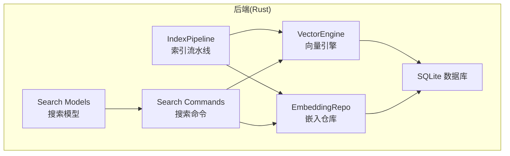
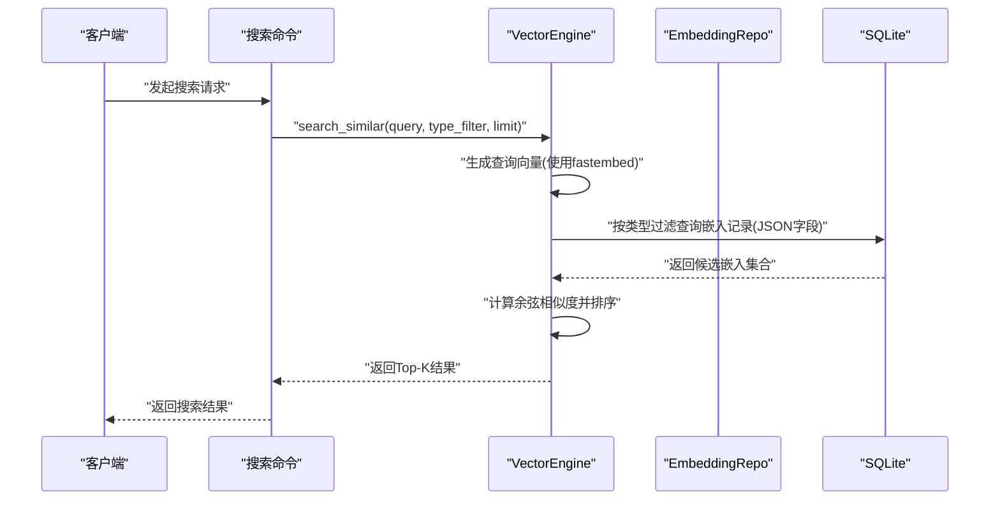
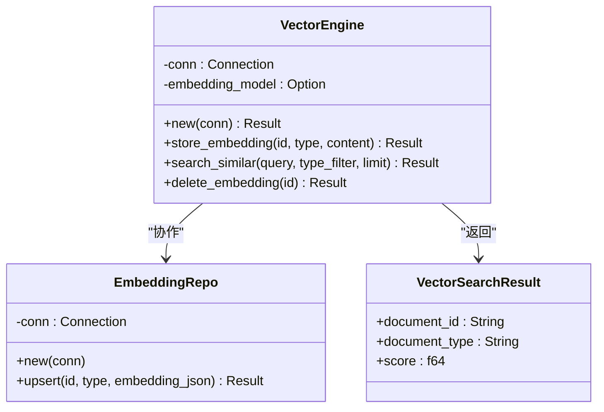
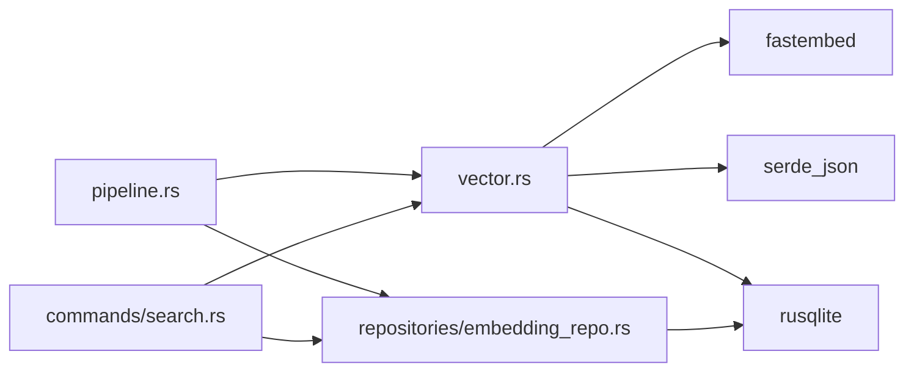

# 向量搜索系统

<cite>
**本文档引用的文件**
- [src-tauri/src/vector.rs](file://src-tauri/src/vector.rs)
- [src-tauri/src/repositories/embedding_repo.rs](file://src-tauri/src/repositories/embedding_repo.rs)
- [src-tauri/src/pipeline.rs](file://src-tauri/src/pipeline.rs)
- [src-tauri/src/commands/search.rs](file://src-tauri/src/commands/search.rs)
- [src-tauri/src/models/search.rs](file://src-tauri/src/models/search.rs)
- [src-tauri/Cargo.toml](file://src-tauri/Cargo.toml)
- [src-tauri/src/main.rs](file://src-tauri/src/main.rs)
</cite>

## 目录
1. [简介](#简介)
2. [项目结构](#项目结构)
3. [核心组件](#核心组件)
4. [架构总览](#架构总览)
5. [详细组件分析](#详细组件分析)
6. [依赖关系分析](#依赖关系分析)
7. [性能考虑](#性能考虑)
8. [故障排除指南](#故障排除指南)
9. [结论](#结论)

## 简介
本文件为向量搜索系统的深度技术文档，聚焦于以下方面：
- 向量嵌入生成：文本预处理、嵌入模型选择与加载、向量维度管理
- 相似度计算：余弦相似度、欧几里得距离与内积计算
- 索引与检索：HNSW/IVF/倒排索引在当前实现中的应用现状与扩展建议
- 查询流程：查询向量生成、候选集筛选与结果排序
- 训练与微调：嵌入模型的训练与微调方法
- 性能调优：参数配置、内存优化与并发查询处理
- 存储与持久化：向量存储格式、压缩与持久化策略

当前仓库采用 SQLite 存储向量，并通过 fastembed 在运行时生成嵌入；相似度计算采用余弦相似度。系统尚未集成专用向量数据库或高级索引（如 HNSW/IVF），但具备良好的扩展点以支持后续优化。

## 项目结构
后端采用 Rust + Tauri 架构，向量搜索能力集中在 src-tauri 模块中，核心文件如下：
- 向量引擎与相似度计算：vector.rs
- 嵌入存储仓库：repositories/embedding_repo.rs
- 索引流水线：pipeline.rs
- 搜索命令与模型定义：commands/search.rs、models/search.rs
- 依赖声明：Cargo.toml
- 应用入口：src/main.rs

图表来源
- [src-tauri/src/vector.rs:1-151](file://src-tauri/src/vector.rs#L1-L151)
- [src-tauri/src/repositories/embedding_repo.rs:1-24](file://src-tauri/src/repositories/embedding_repo.rs#L1-L24)
- [src-tauri/src/pipeline.rs:1-45](file://src-tauri/src/pipeline.rs#L1-L45)
- [src-tauri/src/commands/search.rs](file://src-tauri/src/commands/search.rs)
- [src-tauri/src/models/search.rs](file://src-tauri/src/models/search.rs)

章节来源
- [src-tauri/src/vector.rs:1-151](file://src-tauri/src/vector.rs#L1-L151)
- [src-tauri/src/repositories/embedding_repo.rs:1-24](file://src-tauri/src/repositories/embedding_repo.rs#L1-L24)
- [src-tauri/src/pipeline.rs:1-45](file://src-tauri/src/pipeline.rs#L1-L45)
- [src-tauri/src/commands/search.rs](file://src-tauri/src/commands/search.rs)
- [src-tauri/src/models/search.rs](file://src-tauri/src/models/search.rs)

## 核心组件
- 向量引擎(VectorEngine)：负责嵌入表初始化、嵌入生成、相似度计算与删除操作。当前实现采用 fastembed 的 TextEmbedding，相似度计算为余弦相似度。
- 嵌入仓库(EmbeddingRepo)：封装对 document_embeddings 表的插入/更新操作，提供 JSON 格式嵌入的持久化接口。
- 索引流水线(IndexPipeline)：协调知识图谱、标签、链接与向量嵌入的原子化索引流程。
- 搜索命令与模型：对外暴露搜索接口，接收查询字符串、类型过滤与返回数量限制等参数。

章节来源
- [src-tauri/src/vector.rs:7-28](file://src-tauri/src/vector.rs#L7-L28)
- [src-tauri/src/repositories/embedding_repo.rs:4-24](file://src-tauri/src/repositories/embedding_repo.rs#L4-L24)
- [src-tauri/src/pipeline.rs:18-45](file://src-tauri/src/pipeline.rs#L18-L45)

## 架构总览
下图展示从文档到向量检索的整体数据流：

图表来源
- [src-tauri/src/vector.rs:57-118](file://src-tauri/src/vector.rs#L57-L118)
- [src-tauri/src/commands/search.rs](file://src-tauri/src/commands/search.rs)
- [src-tauri/src/models/search.rs](file://src-tauri/src/models/search.rs)

## 详细组件分析

### 向量引擎(VectorEngine)
- 职责
  - 初始化嵌入表(document_embeddings)，包含 document_id、document_type、embedding(JSON)、created_at 字段
  - 延迟加载嵌入模型，避免阻塞启动
  - 生成文档嵌入并以 JSON 形式存入数据库
  - 执行查询向量生成与相似度计算，返回排序后的结果
  - 支持按 document_type 过滤与删除指定嵌入
- 关键算法
  - 余弦相似度：计算查询向量与存储向量的夹角余弦值，作为相似度分数
  - 排序与截断：按分数降序排列并限制返回数量
- 复杂度
  - 当前实现为全表扫描与内存计算，时间复杂度 O(N·D)，N 为向量数量，D 为向量维度
  - 空间复杂度 O(N·D) 用于加载候选向量
- 可扩展性
  - 可替换 fastembed 为本地量化模型或外部向量数据库
  - 可引入 HNSW/IVF 等近似最近邻索引以降低查询复杂度

图表来源
- [src-tauri/src/vector.rs:7-28](file://src-tauri/src/vector.rs#L7-L28)
- [src-tauri/src/vector.rs:146-151](file://src-tauri/src/vector.rs#L146-L151)
- [src-tauri/src/repositories/embedding_repo.rs:4-24](file://src-tauri/src/repositories/embedding_repo.rs#L4-L24)

章节来源
- [src-tauri/src/vector.rs:13-118](file://src-tauri/src/vector.rs#L13-L118)
- [src-tauri/src/vector.rs:130-144](file://src-tauri/src/vector.rs#L130-L144)

### 嵌入仓库(EmbeddingRepo)
- 职责
  - 提供 upsert 接口，将 JSON 格式的向量写入 document_embeddings 表
- 特点
  - 使用 INSERT OR REPLACE 实现幂等更新
  - 与 VectorEngine 协作完成嵌入持久化

章节来源
- [src-tauri/src/repositories/embedding_repo.rs:13-24](file://src-tauri/src/repositories/embedding_repo.rs#L13-L24)

### 索引流水线(IndexPipeline)
- 职责
  - 将文档处理为知识图谱、标签、链接与向量嵌入的原子化索引流程
  - 在事务中保证一致性
- 流程要点
  - 创建笔记记录
  - 解析语言、提取标签与链接
  - 生成向量嵌入并持久化
  - 更新知识图谱与索引

章节来源
- [src-tauri/src/pipeline.rs:18-45](file://src-tauri/src/pipeline.rs#L18-L45)

### 搜索命令与模型
- 搜索命令
  - 对外暴露搜索 API，接收查询字符串、可选的文档类型过滤器与返回条数上限
- 搜索模型
  - 定义请求/响应的数据结构，便于前后端契约一致

章节来源
- [src-tauri/src/commands/search.rs](file://src-tauri/src/commands/search.rs)
- [src-tauri/src/models/search.rs](file://src-tauri/src/models/search.rs)

## 依赖关系分析
- 外部依赖
  - fastembed：文本嵌入生成
  - rusqlite：SQLite 访问与事务控制
  - serde_json：JSON 序列化/反序列化
- 内部模块
  - vector.rs 与 repositories/embedding_repo.rs 协同完成嵌入的生成与持久化
  - pipeline.rs 组织多源索引流程
  - commands/search.rs 与 models/search.rs 提供搜索接口与数据契约

图表来源
- [src-tauri/src/vector.rs:3-5](file://src-tauri/src/vector.rs#L3-L5)
- [src-tauri/src/repositories/embedding_repo.rs:1-2](file://src-tauri/src/repositories/embedding_repo.rs#L1-L2)
- [src-tauri/src/pipeline.rs:1-6](file://src-tauri/src/pipeline.rs#L1-L6)
- [src-tauri/src/commands/search.rs](file://src-tauri/src/commands/search.rs)

章节来源
- [src-tauri/src/vector.rs:3-5](file://src-tauri/src/vector.rs#L3-L5)
- [src-tauri/src/repositories/embedding_repo.rs:1-2](file://src-tauri/src/repositories/embedding_repo.rs#L1-L2)
- [src-tauri/src/pipeline.rs:1-6](file://src-tauri/src/pipeline.rs#L1-L6)

## 性能考虑
- 当前实现瓶颈
  - 全表扫描与内存计算导致查询复杂度高，不适合大规模向量集
  - JSON 存储增加序列化/反序列化开销
- 建议优化方向
  - 引入近似最近邻索引
    - HNSW：适合高维稠密向量，支持增量插入与动态图维护
    - IVF：分桶聚类，查询时仅扫描部分桶，适合超大规模向量
    - 倒排索引：结合词袋/子词特征，适用于稀疏向量或混合索引
  - 存储与压缩
    - 向量存储二进制格式，减少 JSON 序列化成本
    - 量化压缩：FP32->INT8/FP16，显著降低内存占用
  - 并发与缓存
    - 查询并发池与连接池，避免阻塞
    - 热点向量缓存与预加载
  - 参数调优
    - HNSW：M、efConstruction、efSearch
    - IVF：聚类中心数、桶数量
    - 余弦归一化与内积等价转换，减少运行时归一化开销

[本节为通用性能指导，不直接分析具体文件]

## 故障排除指南
- 常见错误与定位
  - 嵌入生成失败：检查 fastembed 模型可用性与输入内容合法性
  - JSON 序列化/反序列化失败：确认向量维度与类型匹配
  - 查询无结果：确认 document_type 过滤条件与数据是否正确入库
- 建议排查步骤
  - 验证嵌入表结构与数据完整性
  - 检查事务提交与回滚路径
  - 校验查询向量维度与存储向量维度一致

章节来源
- [src-tauri/src/vector.rs:36-54](file://src-tauri/src/vector.rs#L36-L54)
- [src-tauri/src/vector.rs:97-118](file://src-tauri/src/vector.rs#L97-L118)

## 结论
本系统以 SQLite 为基础实现了轻量级向量检索方案，具备清晰的嵌入生成与相似度计算流程。随着数据规模增长，建议引入专用向量数据库与近似索引（HNSW/IVF）以提升查询性能；同时通过二进制存储、量化压缩与并发优化进一步降低资源消耗。当前代码结构为后续扩展提供了良好基础。