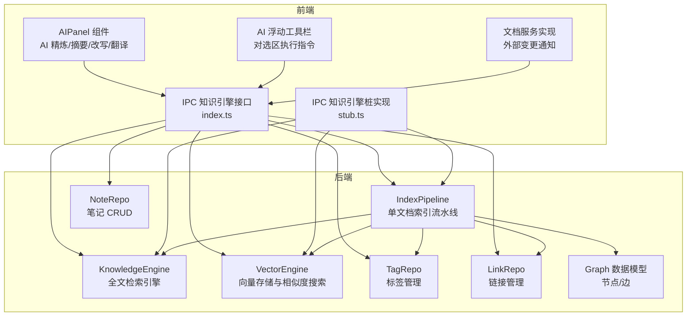
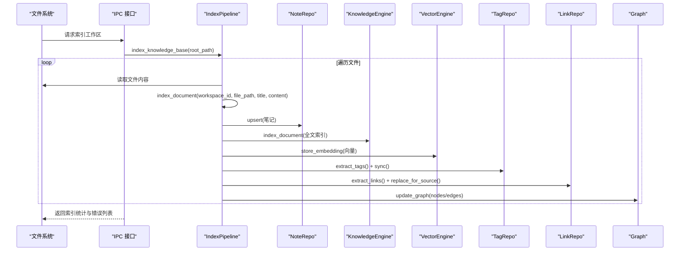
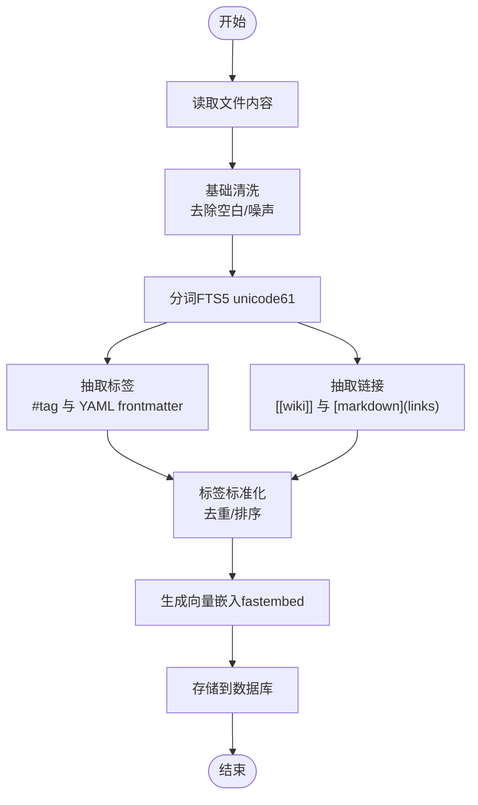
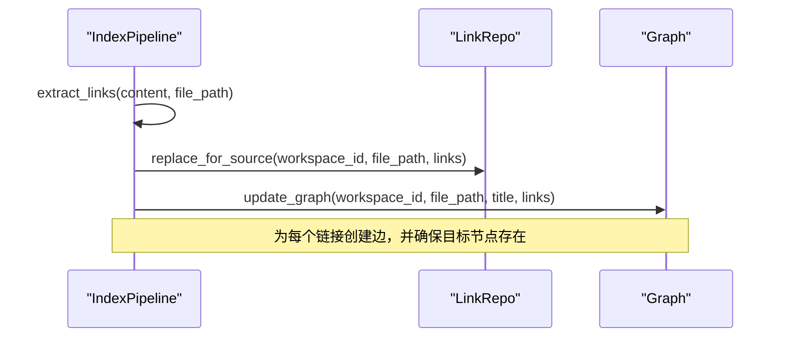
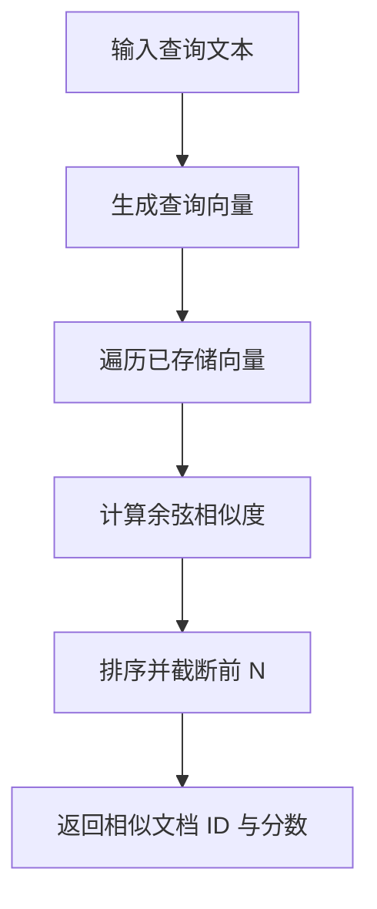
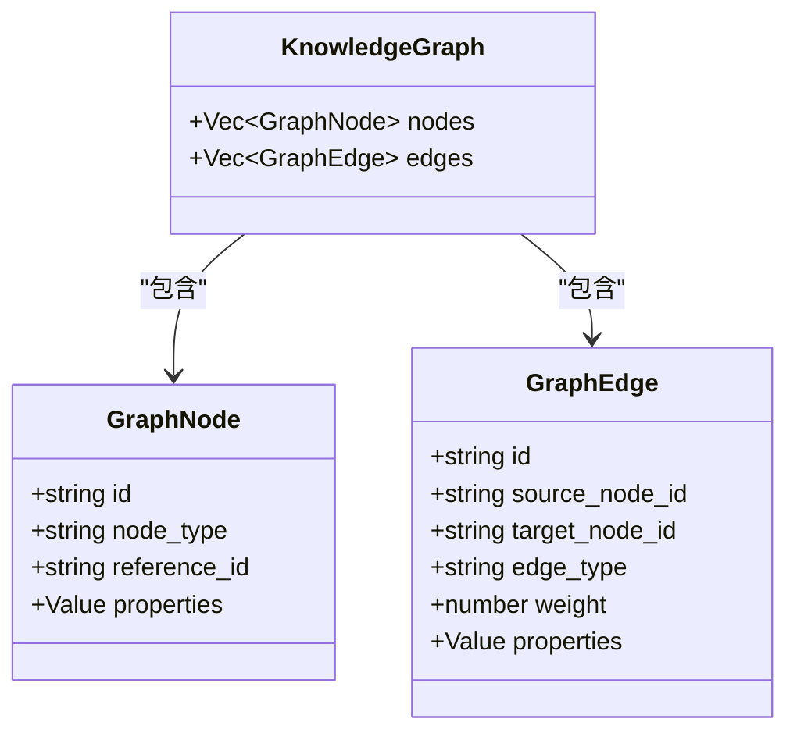
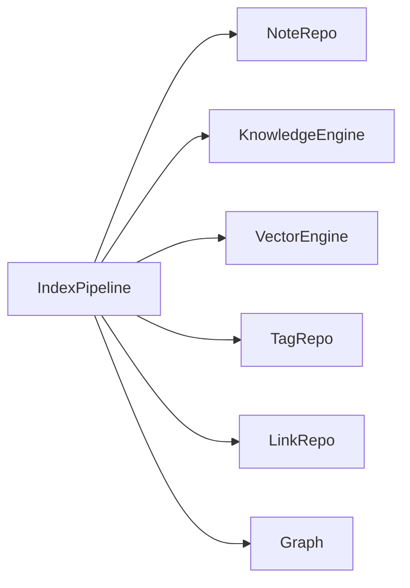

# 文本处理管道

<cite>
**本文引用的文件**
- [pipeline.rs](file://src-tauri/src/pipeline.rs)
- [knowledge.rs](file://src-tauri/src/knowledge.rs)
- [vector.rs](file://src-tauri/src/vector.rs)
- [note_repo.rs](file://src-tauri/src/repositories/note_repo.rs)
- [tag_repo.rs](file://src-tauri/src/repositories/tag_repo.rs)
- [link_repo.rs](file://src-tauri/src/repositories/link_repo.rs)
- [graph.rs](file://src-tauri/src/models/graph.rs)
- [knowledge.rs（命令模块）](file://src-tauri/src/commands/knowledge.rs)
- [系统架构设计（临时）](file://.tmp/system-architecture-design.md)
- [IPC 知识引擎接口](file://src/ipc/index.ts)
- [IPC 知识引擎桩实现](file://src/ipc/stub.ts)
- [AIPanel 组件](file://src/features/ai/AIPanel.tsx)
- [AI 浮动工具栏](file://src/components/editor/AIFloatingToolbar.tsx)
- [文档服务实现](file://src/core/document/document-service.impl.ts)
- [IPC 合约测试](file://src-tauri/tests/ipc_contract_tests.rs)
- [数据流测试](file://src-tauri/tests/dataflow_tests.rs)
</cite>

## 目录
1. [简介](#简介)
2. [项目结构](#项目结构)
3. [核心组件](#核心组件)
4. [架构总览](#架构总览)
5. [详细组件分析](#详细组件分析)
6. [依赖分析](#依赖分析)
7. [性能考虑](#性能考虑)
8. [故障排查指南](#故障排查指南)
9. [结论](#结论)
10. [附录](#附录)

## 简介
本文件面向“文本处理管道”的综合技术文档，围绕笔记型知识库的文本预处理、索引与检索、向量化与语义搜索、标签与链接抽取、知识图谱构建等能力展开。重点覆盖以下方面：
- 文本预处理流程：分词、去噪、标准化与特征提取
- NLP 处理管道：实体识别、关系抽取、语义分析
- 文本分类与聚类：主题建模与文档相似度计算
- 知识抽取：命名实体识别、关系三元组提取、知识图谱构建
- 文本清洗与过滤：停用词处理、正则表达式匹配、上下文理解
- 批量处理优化：流水线并行与缓存机制
- 管道配置参数、性能监控与错误恢复策略

## 项目结构
该项目采用前端（React + TypeScript）与后端（Tauri + Rust）分离的架构，文本处理管道主要由 Rust 后端负责，前端通过 IPC 与后端交互。

图表来源
- [pipeline.rs:1-290](file://src-tauri/src/pipeline.rs#L1-L290)
- [knowledge.rs:1-75](file://src-tauri/src/knowledge.rs#L1-L75)
- [vector.rs:1-151](file://src-tauri/src/vector.rs#L1-L151)
- [note_repo.rs:1-170](file://src-tauri/src/repositories/note_repo.rs#L1-L170)
- [tag_repo.rs:1-121](file://src-tauri/src/repositories/tag_repo.rs#L1-L121)
- [link_repo.rs:1-86](file://src-tauri/src/repositories/link_repo.rs#L1-L86)
- [graph.rs:1-34](file://src-tauri/src/models/graph.rs#L1-L34)
- [IPC 知识引擎接口:297-330](file://src/ipc/index.ts#L297-L330)
- [IPC 知识引擎桩实现:538-588](file://src/ipc/stub.ts#L538-L588)

章节来源
- [IPC 知识引擎接口:297-330](file://src/ipc/index.ts#L297-L330)
- [IPC 知识引擎桩实现:538-588](file://src/ipc/stub.ts#L538-L588)
- [系统架构设计（临时）:679-802](file://.tmp/system-architecture-design.md#L679-L802)

## 核心组件
- IndexPipeline：单文档原子性索引流水线，串联笔记写入、全文索引、向量嵌入、标签与链接抽取、图谱同步。
- KnowledgeEngine：基于 FTS5 的全文检索引擎，支持 Unicode 分词与查询。
- VectorEngine：基于 fastembed 的向量嵌入存储与相似度搜索。
- NoteRepo/TagRepo/LinkRepo：笔记、标签、链接的持久化仓库。
- Graph 数据模型：知识图谱节点与边的数据结构。
- 前端 IPC 层：提供 index_knowledge_base、search_fulltext、semantic_search、get_knowledge_graph 等命令调用。

章节来源
- [pipeline.rs:17-90](file://src-tauri/src/pipeline.rs#L17-L90)
- [knowledge.rs:5-74](file://src-tauri/src/knowledge.rs#L5-L74)
- [vector.rs:7-128](file://src-tauri/src/vector.rs#L7-L128)
- [note_repo.rs:30-50](file://src-tauri/src/repositories/note_repo.rs#L30-L50)
- [tag_repo.rs:14-40](file://src-tauri/src/repositories/tag_repo.rs#L14-L40)
- [link_repo.rs:14-40](file://src-tauri/src/repositories/link_repo.rs#L14-L40)
- [graph.rs:3-28](file://src-tauri/src/models/graph.rs#L3-L28)
- [IPC 知识引擎接口:297-330](file://src/ipc/index.ts#L297-L330)

## 架构总览
下图展示从文件系统到知识图谱的完整数据流，涵盖索引、检索、向量相似度与图谱同步。

图表来源
- [系统架构设计（临时）:737-783](file://.tmp/system-architecture-design.md#L737-L783)
- [pipeline.rs:17-90](file://src-tauri/src/pipeline.rs#L17-L90)
- [knowledge.rs:48-65](file://src-tauri/src/knowledge.rs#L48-L65)
- [vector.rs:30-55](file://src-tauri/src/vector.rs#L30-L55)
- [tag_repo.rs:14-40](file://src-tauri/src/repositories/tag_repo.rs#L14-L40)
- [link_repo.rs:30-40](file://src-tauri/src/repositories/link_repo.rs#L30-L40)
- [graph.rs:3-28](file://src-tauri/src/models/graph.rs#L3-L28)

## 详细组件分析

### 文本预处理与特征提取
- 分词与去噪
  - 全文检索使用 FTS5，分词器配置支持 Unicode 字符，适合中英文混合场景；查询时对输入进行预处理以提升匹配效果。
  - 正则表达式用于标签与链接抽取，分别匹配 #tag 与 YAML frontmatter 标签、[[wiki-links]] 与 [markdown](links)。
- 标准化
  - 标签去重与排序，统一格式；语言检测基于文件扩展名，便于后续处理。
- 特征提取
  - 向量嵌入：使用 fastembed 生成文档级向量，存储为 JSON 并支持相似度检索。

图表来源
- [pipeline.rs:193-227](file://src-tauri/src/pipeline.rs#L193-L227)
- [pipeline.rs:229-267](file://src-tauri/src/pipeline.rs#L229-L267)
- [knowledge.rs:11-20](file://src-tauri/src/knowledge.rs#L11-L20)
- [vector.rs:30-55](file://src-tauri/src/vector.rs#L30-L55)

章节来源
- [pipeline.rs:193-227](file://src-tauri/src/pipeline.rs#L193-L227)
- [pipeline.rs:229-267](file://src-tauri/src/pipeline.rs#L229-L267)
- [knowledge.rs:11-20](file://src-tauri/src/knowledge.rs#L11-L20)
- [vector.rs:30-55](file://src-tauri/src/vector.rs#L30-L55)

### NLP 处理管道：实体识别、关系抽取与语义分析
- 实体识别
  - 当前实现未内置专用 NER 模块，但可通过 wiki 链接与标签实现弱实体抽取（如 [[目标文件]] 作为“文档实体”）。
- 关系抽取
  - 基于正则表达式抽取 wiki 链接与 Markdown 链接，形成“源文件 -> 目标文件”的引用关系。
- 语义分析
  - 使用向量嵌入与余弦相似度进行语义相似度计算，支持按类型过滤的相似文档检索。

图表来源
- [pipeline.rs:229-267](file://src-tauri/src/pipeline.rs#L229-L267)
- [link_repo.rs:30-40](file://src-tauri/src/repositories/link_repo.rs#L30-L40)
- [pipeline.rs:136-181](file://src-tauri/src/pipeline.rs#L136-L181)

章节来源
- [pipeline.rs:229-267](file://src-tauri/src/pipeline.rs#L229-L267)
- [link_repo.rs:30-40](file://src-tauri/src/repositories/link_repo.rs#L30-L40)
- [pipeline.rs:136-181](file://src-tauri/src/pipeline.rs#L136-L181)

### 文本分类与聚类：主题建模与文档相似度
- 主题建模
  - 项目未内置主题模型（如 LDA），但可通过标签体系与链接关系进行粗粒度主题组织与发现。
- 文档相似度
  - 使用向量嵌入与余弦相似度进行相似度计算，支持限定文档类型的检索。

图表来源
- [vector.rs:57-118](file://src-tauri/src/vector.rs#L57-L118)

章节来源
- [vector.rs:57-118](file://src-tauri/src/vector.rs#L57-L118)

### 知识抽取：命名实体识别、关系三元组与知识图谱
- 命名实体识别
  - 未使用专用 NER 模型，采用 wiki 链接与标签作为“弱实体”来源。
- 关系三元组
  - 三元组形式：(源文件, 关系类型, 目标文件)，关系类型在抽取时固定为“引用”，上下文保存在属性中。
- 知识图谱
  - 节点：以“note:文件路径”为标识，属性包含标题、路径、工作区；边：链接关系，权重为 1，属性包含上下文。

图表来源
- [graph.rs:3-28](file://src-tauri/src/models/graph.rs#L3-L28)

章节来源
- [graph.rs:3-28](file://src-tauri/src/models/graph.rs#L3-L28)
- [pipeline.rs:136-181](file://src-tauri/src/pipeline.rs#L136-L181)

### 文本清洗与过滤策略
- 停用词处理
  - 未实现专门停用词表；FTS5 分词器已具备移除变音符号与基本归一化能力。
- 正则表达式匹配
  - 标签：匹配 #tag 与 YAML frontmatter 的 tags 列表。
  - 链接：匹配 [[wiki-links]] 与 [markdown](links)。
- 上下文理解
  - 链接抽取时保留原始片段上下文，便于后续可视化与溯源。

章节来源
- [pipeline.rs:193-227](file://src-tauri/src/pipeline.rs#L193-L227)
- [pipeline.rs:229-267](file://src-tauri/src/pipeline.rs#L229-L267)

### 批量处理优化、流水线并行与缓存
- 批量索引
  - 工作区索引采用分批处理（批大小 50），对每个文件在独立线程池任务中执行，减少主线程阻塞。
- 增量索引
  - 文件监听事件触发时，执行删除旧索引与插入新索引的 upsert 流程，保证一致性。
- 缓存机制
  - 向量模型惰性加载，避免首次启动阻塞；向量嵌入以 JSON 形式存储，便于快速读取与相似度计算。

章节来源
- [系统架构设计（临时）:737-783](file://.tmp/system-architecture-design.md#L737-L783)
- [pipeline.rs:92-134](file://src-tauri/src/pipeline.rs#L92-L134)
- [vector.rs:13-28](file://src-tauri/src/vector.rs#L13-L28)

### 管道配置参数、性能监控与错误恢复
- 配置参数
  - 工作区排除模式、文件扩展名白名单、批大小等在工作区配置中定义，影响索引范围与吞吐。
- 性能监控
  - 前端提供 AI 精炼面板与浮动工具栏，便于用户感知处理结果；后端通过事务与 WAL 模式保障写入性能与一致性。
- 错误恢复
  - 单文档索引采用事务回滚，任一步骤失败均回滚，避免部分更新；批量索引收集错误信息并继续处理其他文件。

章节来源
- [系统架构设计（临时）:737-783](file://.tmp/system-architecture-design.md#L737-L783)
- [pipeline.rs:24-90](file://src-tauri/src/pipeline.rs#L24-L90)
- [pipeline.rs:96-134](file://src-tauri/src/pipeline.rs#L96-L134)

## 依赖分析
- 组件耦合
  - IndexPipeline 对 NoteRepo/KnowledgeEngine/VectorEngine/TagRepo/LinkRepo/Graph 存在直接依赖，体现“单一职责 + 原子事务”的设计。
- 外部依赖
  - FTS5 提供全文检索；fastembed 提供向量生成；SQLite 作为统一存储后端。
- 循环依赖
  - 未见循环依赖迹象；各仓库模块职责清晰。

图表来源
- [pipeline.rs:28-33](file://src-tauri/src/pipeline.rs#L28-L33)
- [graph.rs:3-28](file://src-tauri/src/models/graph.rs#L3-L28)

章节来源
- [pipeline.rs:28-33](file://src-tauri/src/pipeline.rs#L28-L33)

## 性能考虑
- I/O 与并发
  - 批量索引使用线程池与分批处理，降低内存峰值与锁竞争。
- 存储与索引
  - FTS5 虚拟表提供高效全文检索；向量嵌入以 JSON 存储，适合中小规模场景；大规模建议引入专用向量数据库。
- 事务与一致性
  - 单文档索引使用事务，确保多表原子更新；WAL 模式提升并发读写性能。

## 故障排查指南
- 索引失败
  - 检查事务日志与回滚分支，确认具体失败步骤；查看错误集合是否包含该文件路径。
- 检索无结果
  - 确认查询是否经过分词器处理；检查工作区过滤条件与文件路径是否匹配。
- 图谱为空
  - 确认链接抽取是否正确；检查节点与边的插入逻辑与属性序列化。

章节来源
- [pipeline.rs:80-89](file://src-tauri/src/pipeline.rs#L80-L89)
- [IPC 合约测试:382-419](file://src-tauri/tests/ipc_contract_tests.rs#L382-L419)
- [数据流测试:36-80](file://src-tauri/tests/dataflow_tests.rs#L36-L80)

## 结论
本文本处理管道以 SQLite 为核心存储，结合 FTS5 全文检索与 fastembed 向量嵌入，实现了从文件到知识图谱的端到端数据流。通过正则表达式驱动的标签与链接抽取，以及事务化的索引流水线，满足了知识库的索引、检索、相似度与图谱构建需求。未来可在以下方向演进：
- 引入专用 NER 与关系抽取模型，提升实体与三元组抽取质量；
- 将向量存储迁移至专用向量数据库，优化大规模相似度检索；
- 增强停用词与规则化策略，提升检索与聚类效果；
- 扩展主题建模能力，结合标签与链接进行主题发现。

## 附录
- 前端 AI 能力集成
  - AIPanel 与浮动工具栏提供对选区的精炼、摘要、改写与翻译，便于用户在编辑态直接体验文本处理效果。

章节来源
- [AIPanel 组件:198-228](file://src/features/ai/AIPanel.tsx#L198-L228)
- [AI 浮动工具栏:70-116](file://src/components/editor/AIFloatingToolbar.tsx#L70-L116)