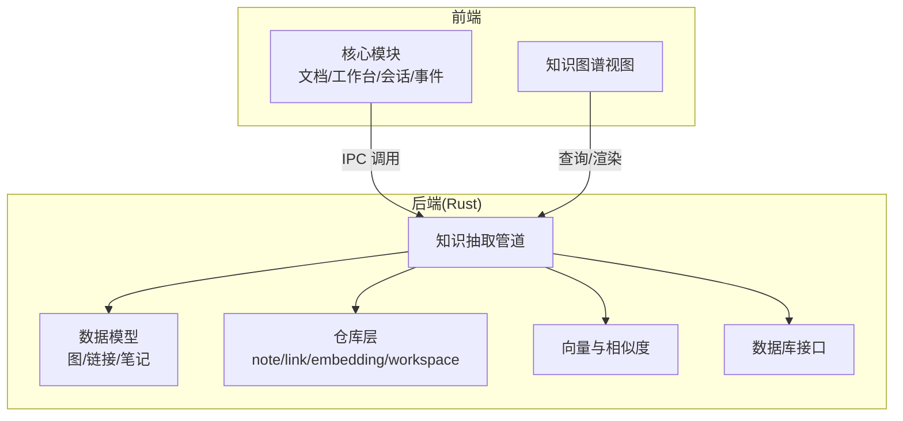
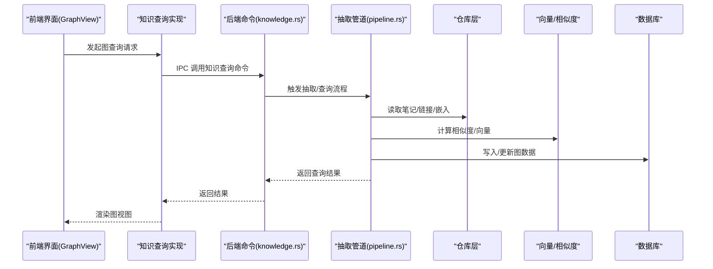
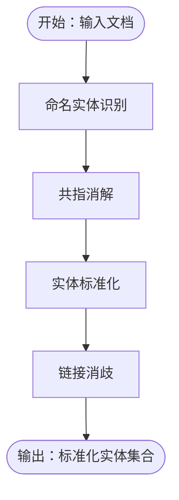
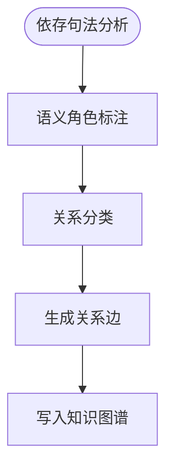
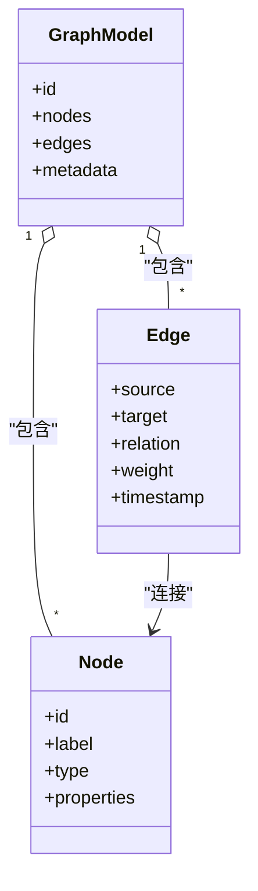
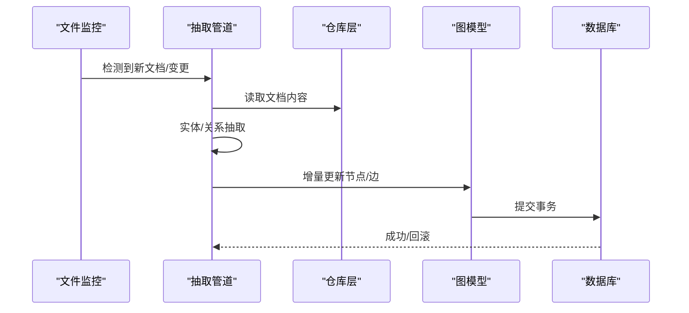
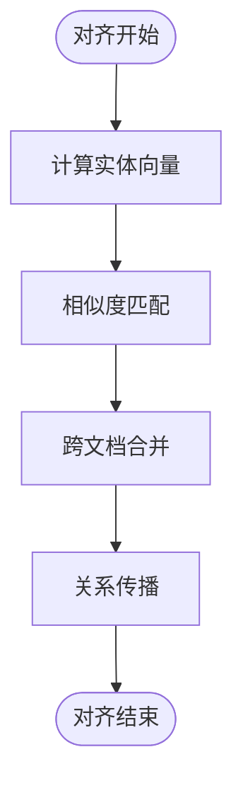
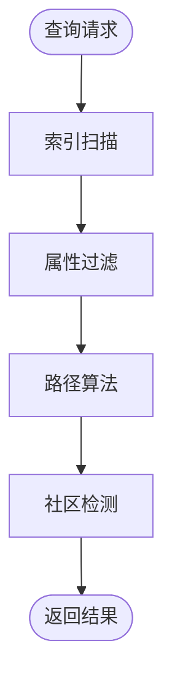
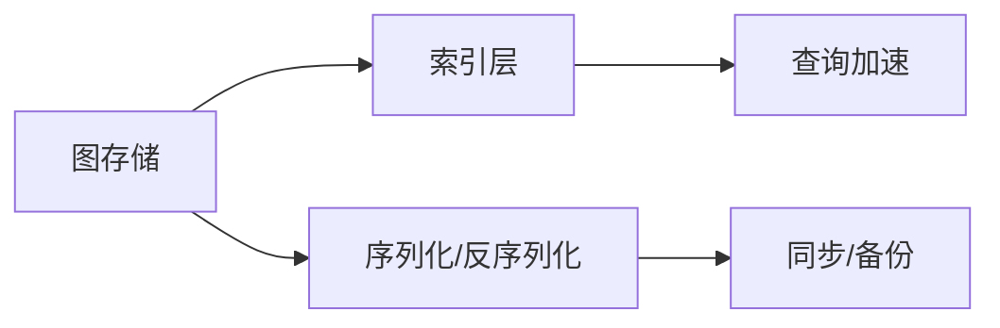
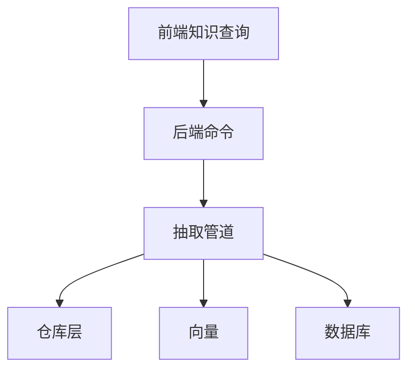

# 知识图谱构建

<cite>
**本文引用的文件**
- [docs/design/05-knowledge-graph.md](file://docs/design/05-knowledge-graph.md)
- [src/core/knowledge/types.ts](file://src/core/knowledge/types.ts)
- [src/core/knowledge/knowledge-query.impl.ts](file://src/core/knowledge/knowledge-query.impl.ts)
- [src-tauri/src/knowledge.rs](file://src-tauri/src/knowledge.rs)
- [src-tauri/src/pipeline.rs](file://src-tauri/src/pipeline.rs)
- [src-tauri/src/models/graph.rs](file://src-tauri/src/models/graph.rs)
- [src-tauri/src/models/link.rs](file://src-tauri/src/models/link.rs)
- [src-tauri/src/repositories/note_repo.rs](file://src-tauri/src/repositories/note_repo.rs)
- [src-tauri/src/repositories/link_repo.rs](file://src-tauri/src/repositories/link_repo.rs)
- [src-tauri/src/vector.rs](file://src-tauri/src/vector.rs)
- [src-tauri/src/db.rs](file://src-tauri/src/db.rs)
- [src-tauri/Cargo.toml](file://src-tauri/Cargo.toml)
- [src/features/graph/GraphView.tsx](file://src/features/graph/GraphView.tsx)
- [src/core/document/types.ts](file://src/core/document/types.ts)
- [src/core/document/service.ts](file://src/core/document/service.ts)
- [src/core/workbench/types.ts](file://src/core/workbench/types.ts)
- [src/core/workbench/service.ts](file://src/core/workbench/service.ts)
- [src/core/session/workspace-draft-autosave.ts](file://src/core/session/workspace-draft-autosave.ts)
- [src/core/platform/event-bus.ts](file://src/core/platform/event-bus.ts)
</cite>

## 目录
1. [简介](#简介)
2. [项目结构](#项目结构)
3. [核心组件](#核心组件)
4. [架构总览](#架构总览)
5. [详细组件分析](#详细组件分析)
6. [依赖分析](#依赖分析)
7. [性能考虑](#性能考虑)
8. [故障排查指南](#故障排查指南)
9. [结论](#结论)
10. [附录](#附录)

## 简介
本文件面向“知识图谱构建系统”的实现与使用，围绕以下目标展开：实体识别与链接消歧（命名实体识别、共指消解、实体标准化）、关系抽取（依存句法分析、语义角色标注、关系分类）、图构建数据结构（节点类型、边权重、图优化）、动态图更新（增量构建、冲突解决、一致性维护）、知识融合与对齐（跨文档实体对齐、关系传播）、图查询优化与路径查找、社区检测、图存储格式与索引策略以及分布式处理能力。  
本系统采用前端 TypeScript/Vue 与后端 Rust 的混合架构，前端负责用户交互与视图渲染，后端负责知识抽取、图构建与持久化。

## 项目结构
- 前端模块
  - 核心能力：文档服务、工作台、会话管理、事件总线等
  - 知识相关：知识查询实现、知识图谱视图
- 后端模块（Rust）
  - 知识抽取与管道：实体识别、关系抽取、向量化、存储
  - 数据模型：图、链接、笔记、标签等
  - 仓库层：笔记、链接、嵌入、工作区等数据访问
  - 向量与数据库：向量相似度、SQLite/外部存储接口

**图表来源**
- [src/features/graph/GraphView.tsx](file://src/features/graph/GraphView.tsx)
- [src/core/knowledge/knowledge-query.impl.ts](file://src/core/knowledge/knowledge-query.impl.ts)
- [src-tauri/src/knowledge.rs](file://src-tauri/src/knowledge.rs)
- [src-tauri/src/pipeline.rs](file://src-tauri/src/pipeline.rs)
- [src-tauri/src/models/graph.rs](file://src-tauri/src/models/graph.rs)
- [src-tauri/src/repositories/note_repo.rs](file://src-tauri/src/repositories/note_repo.rs)
- [src-tauri/src/vector.rs](file://src-tauri/src/vector.rs)
- [src-tauri/src/db.rs](file://src-tauri/src/db.rs)

**章节来源**
- [src/features/graph/GraphView.tsx](file://src/features/graph/GraphView.tsx)
- [src/core/knowledge/knowledge-query.impl.ts](file://src/core/knowledge/knowledge-query.impl.ts)
- [src-tauri/src/knowledge.rs](file://src-tauri/src/knowledge.rs)
- [src-tauri/src/pipeline.rs](file://src-tauri/src/pipeline.rs)

## 核心组件
- 知识查询实现：封装前端对后端知识图谱的查询调用，支持节点/边检索、邻接查询、路径搜索等
- 知识图谱视图：可视化展示图结构，支持交互式浏览与高亮
- 抽取管道：后端负责从文档中抽取实体、关系，生成图结构并写入存储
- 数据模型：定义图、节点、边、链接等核心数据结构
- 仓库层：提供对笔记、链接、嵌入、工作区等的增删改查
- 向量与相似度：用于实体标准化、跨文档对齐与关系传播
- 数据库接口：统一的数据持久化抽象

**章节来源**
- [src/core/knowledge/knowledge-query.impl.ts](file://src/core/knowledge/knowledge-query.impl.ts)
- [src/features/graph/GraphView.tsx](file://src/features/graph/GraphView.tsx)
- [src-tauri/src/models/graph.rs](file://src-tauri/src/models/graph.rs)
- [src-tauri/src/repositories/note_repo.rs](file://src-tauri/src/repositories/note_repo.rs)
- [src-tauri/src/vector.rs](file://src-tauri/src/vector.rs)
- [src-tauri/src/db.rs](file://src-tauri/src/db.rs)

## 架构总览
系统采用前后端分离架构：
- 前端通过 IPC 调用后端命令，执行知识抽取、查询与图渲染
- 后端以“抽取管道”为核心，串联 NLP 处理、向量化、存储与查询
- 图数据在后端以模型形式存在，前端仅负责展示与交互

**图表来源**
- [src/features/graph/GraphView.tsx](file://src/features/graph/GraphView.tsx)
- [src/core/knowledge/knowledge-query.impl.ts](file://src/core/knowledge/knowledge-query.impl.ts)
- [src-tauri/src/knowledge.rs](file://src-tauri/src/knowledge.rs)
- [src-tauri/src/pipeline.rs](file://src-tauri/src/pipeline.rs)
- [src-tauri/src/repositories/note_repo.rs](file://src-tauri/src/repositories/note_repo.rs)
- [src-tauri/src/vector.rs](file://src-tauri/src/vector.rs)
- [src-tauri/src/db.rs](file://src-tauri/src/db.rs)

## 详细组件分析

### 实体识别与链接消歧
- 命名实体识别（NER）：由抽取管道完成，输出候选实体及其边界、类型
- 共指消解（Coreference Resolution）：基于上下文与指代表达，合并同一实体的不同表述
- 实体标准化（Entity Normalization）：利用向量相似度与外部知识库，将候选实体映射到标准标识符
- 链接消歧（Link Disambiguation）：在多义词场景下选择最可能的实体条目

**图表来源**
- [src-tauri/src/pipeline.rs](file://src-tauri/src/pipeline.rs)
- [src-tauri/src/vector.rs](file://src-tauri/src/vector.rs)

**章节来源**
- [src-tauri/src/pipeline.rs](file://src-tauri/src/pipeline.rs)
- [src-tauri/src/vector.rs](file://src-tauri/src/vector.rs)

### 关系抽取
- 依存句法分析（Dependency Parsing）：提取句子结构，识别主谓宾、修饰关系
- 语义角色标注（Semantic Role Labeling, SRL）：标注谓词的语义角色（施事、受事、工具等）
- 关系分类（Relation Classification）：将语义角色组合为具体关系类型（如“位于”、“属于”）

**图表来源**
- [src-tauri/src/pipeline.rs](file://src-tauri/src/pipeline.rs)
- [src-tauri/src/models/graph.rs](file://src-tauri/src/models/graph.rs)

**章节来源**
- [src-tauri/src/pipeline.rs](file://src-tauri/src/pipeline.rs)
- [src-tauri/src/models/graph.rs](file://src-tauri/src/models/graph.rs)

### 图构建数据结构设计
- 节点类型定义：实体节点（含类型、属性、向量指纹）、关系节点（可选）
- 边定义：源节点、目标节点、关系类型、边权重（置信度/相似度/时间衰减）
- 图优化策略：去重、合并、权重聚合、周期性清理

**图表来源**
- [src-tauri/src/models/graph.rs](file://src-tauri/src/models/graph.rs)

**章节来源**
- [src-tauri/src/models/graph.rs](file://src-tauri/src/models/graph.rs)

### 动态图更新机制
- 增量构建：仅对新增或变更文档进行抽取与更新
- 冲突解决：当同一实体出现不同表述时，依据置信度与上下文合并
- 一致性维护：通过事务与版本控制保证并发更新不破坏图结构

**图表来源**
- [src-tauri/src/watcher.rs](file://src-tauri/src/watcher.rs)
- [src-tauri/src/pipeline.rs](file://src-tauri/src/pipeline.rs)
- [src-tauri/src/repositories/note_repo.rs](file://src-tauri/src/repositories/note_repo.rs)
- [src-tauri/src/db.rs](file://src-tauri/src/db.rs)

**章节来源**
- [src-tauri/src/pipeline.rs](file://src-tauri/src/pipeline.rs)
- [src-tauri/src/repositories/note_repo.rs](file://src-tauri/src/repositories/note_repo.rs)
- [src-tauri/src/db.rs](file://src-tauri/src/db.rs)

### 知识融合与对齐
- 跨文档实体对齐：基于向量相似度与共享上下文，将不同文档中的同一实体对齐
- 关系传播：在对齐实体之间传播已确认的关系，提升覆盖率
- 标准化与规范化：统一实体标识符与关系类型，减少歧义

**图表来源**
- [src-tauri/src/vector.rs](file://src-tauri/src/vector.rs)
- [src-tauri/src/repositories/link_repo.rs](file://src-tauri/src/repositories/link_repo.rs)

**章节来源**
- [src-tauri/src/vector.rs](file://src-tauri/src/vector.rs)
- [src-tauri/src/repositories/link_repo.rs](file://src-tauri/src/repositories/link_repo.rs)

### 图查询优化、路径查找与社区检测
- 查询优化：索引节点类型与属性，缓存常用查询结果
- 路径查找：广度优先/深度优先/最短路径，支持权重与约束
- 社区检测：基于边密度与模块度的社区发现算法

**图表来源**
- [src/core/knowledge/knowledge-query.impl.ts](file://src/core/knowledge/knowledge-query.impl.ts)
- [src-tauri/src/db.rs](file://src-tauri/src/db.rs)

**章节来源**
- [src/core/knowledge/knowledge-query.impl.ts](file://src/core/knowledge/knowledge-query.impl.ts)
- [src-tauri/src/db.rs](file://src-tauri/src/db.rs)

### 图存储格式、索引策略与分布式处理
- 存储格式：以关系型/键值结合的方式保存图结构与元数据；支持 JSON/二进制序列化
- 索引策略：按节点类型、属性建立二级索引；对边权重与时间戳建立复合索引
- 分布式能力：通过消息队列与分片存储扩展；抽取与查询可水平扩展

**图表来源**
- [src-tauri/src/db.rs](file://src-tauri/src/db.rs)
- [src-tauri/src/models/graph.rs](file://src-tauri/src/models/graph.rs)

**章节来源**
- [src-tauri/src/db.rs](file://src-tauri/src/db.rs)
- [src-tauri/src/models/graph.rs](file://src-tauri/src/models/graph.rs)

## 依赖分析
- 前端依赖后端命令与知识查询实现
- 后端依赖抽取管道、仓库层、向量与数据库
- 依赖耦合集中在命令接口与数据模型

**图表来源**
- [src/core/knowledge/knowledge-query.impl.ts](file://src/core/knowledge/knowledge-query.impl.ts)
- [src-tauri/src/knowledge.rs](file://src-tauri/src/knowledge.rs)
- [src-tauri/src/pipeline.rs](file://src-tauri/src/pipeline.rs)
- [src-tauri/src/repositories/note_repo.rs](file://src-tauri/src/repositories/note_repo.rs)
- [src-tauri/src/vector.rs](file://src-tauri/src/vector.rs)
- [src-tauri/src/db.rs](file://src-tauri/src/db.rs)

**章节来源**
- [src/core/knowledge/knowledge-query.impl.ts](file://src/core/knowledge/knowledge-query.impl.ts)
- [src-tauri/src/knowledge.rs](file://src-tauri/src/knowledge.rs)
- [src-tauri/src/pipeline.rs](file://src-tauri/src/pipeline.rs)

## 性能考虑
- 批量处理：对多文档进行批量化抽取与入库，降低事务开销
- 缓存策略：热点查询与向量结果缓存，减少重复计算
- 并发控制：使用锁与队列避免并发写入冲突
- 索引优化：针对高频查询字段建立索引，避免全表扫描

## 故障排查指南
- 抽取失败：检查抽取管道日志与输入文档格式
- 查询异常：确认索引是否存在、查询条件是否合理
- 写入冲突：查看事务状态与并发写入情况
- 向量计算错误：核对嵌入维度与归一化策略

**章节来源**
- [src-tauri/src/error.rs](file://src-tauri/src/error.rs)
- [src-tauri/src/db.rs](file://src-tauri/src/db.rs)

## 结论
本系统通过前后端协同，实现了从文档到知识图谱的自动化构建与可视化呈现。后端抽取管道承担核心的实体识别、关系抽取与图构建职责，前端提供直观的图视图与查询能力。通过向量相似度与索引优化，系统具备良好的扩展性与查询性能。后续可在分布式扩展、增量学习与更丰富的关系分类方面持续演进。

## 附录
- 设计文档：知识图谱设计要点与实现思路
- 类型定义：知识查询与图模型的关键类型
- 命令与模型：后端命令与数据模型的定义位置

**章节来源**
- [docs/design/05-knowledge-graph.md](file://docs/design/05-knowledge-graph.md)
- [src/core/knowledge/types.ts](file://src/core/knowledge/types.ts)
- [src-tauri/src/models/graph.rs](file://src-tauri/src/models/graph.rs)
- [src-tauri/src/models/link.rs](file://src-tauri/src/models/link.rs)
- [src-tauri/Cargo.toml](file://src-tauri/Cargo.toml)